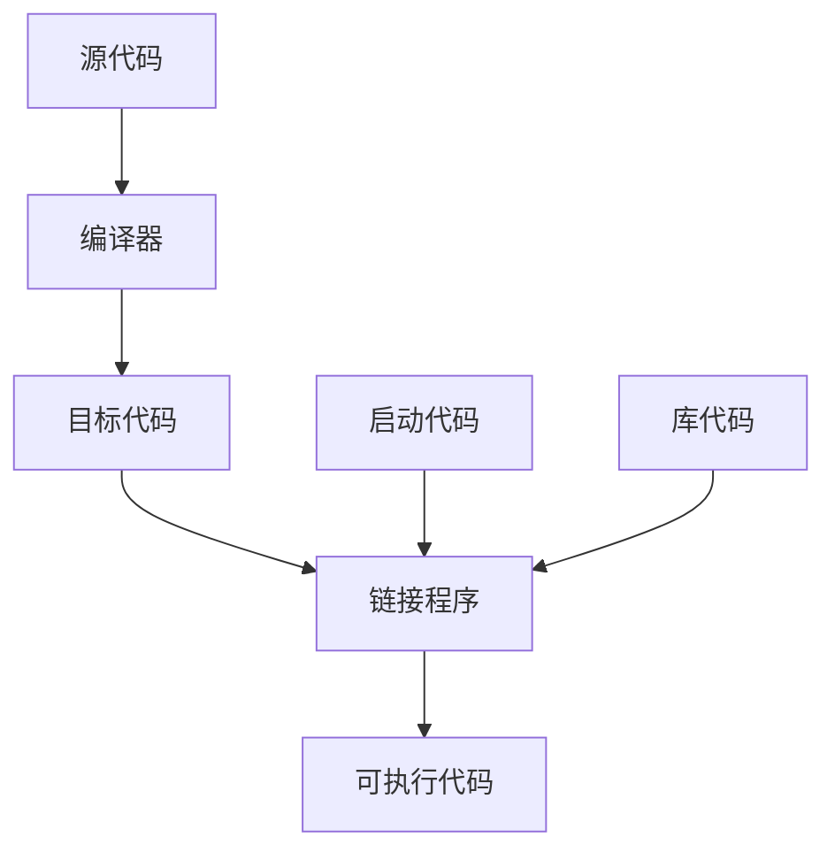

# 介绍

## C++

​		C++ 融合了3种不同的编程方式：C语言代表的过程性语言、C++在C语言基础上添加的类代表的面向对象语言、C++模板支持的泛型编程。C++ 是在C语言基础上开发的一种集面向对象、泛型编程和过程化编程于一体的编程语言，是C语言的超集<sup>1</sup>。

### 简史

​		20世纪70年代，C和Pascal这样的语言引领人们进入了结构化编程时代，这种机制把秩序和规程带进了迫切需要这种性质的领域中。除了提供结构化编程工具外，C还能生成简洁、快速运行的程序，并提供了处理硬件问题的能力，如管理通信端口和磁盘驱动器。这些因素使C语言成为20世纪80年代占统治地位的编程语言。同时，20世纪80年代，人们也见证了一种新编程模式的成长：面向对象编程（OOP）。SmallTalk和C++语言具备这种功能<sup>1</sup>。

#### C语言

​		20世纪70年代早期，贝尔实验室的Dennis Ritchie致力于开发UNIX操作系统。为完成这项工作，Ritchie需要一种语言，它必须简洁，能够生成简洁、快速的程序，并能有效地控制硬件。传统上，使用汇编语言来满足这些要求，汇编语言依赖于计算机的内部机器语言。然而，汇编语言是低级语言，即直接操作硬件，如直接访问CPU寄存器和内存单元。因此汇编语言针对于特定的计算机处理器，要将汇编程序移植到另一种计算机上，必须使用不同的汇编语言重新编写程序。

​		然而，UNIX是为在不同的计算机（或平台）上工作而设计的，这意味着它是一种高级语言。高级语言致力于解决问题，而不针对特定的硬件。一种被称为编译器的特殊程序将高级语言翻译成特定计算机的内部语言。这样，就可以通过对每个平台使用不同的编译器来在不同的平台上使用同一个高级语言程序了。Ritchie希望有一种语言能将低级语言的效率、硬件访问能力和高级语言的通用性、可移植性融合在一起，于是他在旧语言的基础上开发了C语言。

#### C语言编程原理

​		一般来说，计算机语言要处理两个概念：数据和算法。数据是程序使用和处理的信息，而算法是程序使用的方法。

​		C语言最初面世时是过程性（procedural）语言，这意味着它强调的是编程的算法方面。从概念上说，过程化编程首先要确定计算机应采取的操作，然后使用编程语言来实现这些操作。

​		随着程序规模扩大，早期的程序语言（如FORTRAN和BASIC）都会遇到组织方面的问题。例如，程序经常使用分支语句，根据某种测试的结果，执行一组或另一组指令。很多旧式程序的执行路径很混乱（被称为“”意大利面条式编程），几乎不可能通过阅读程序来理解，修改这种程序简直是一场灾难。为了解决这种问题，计算机科学家开发了一种更有序的编程方法：结构化编程（structured programming）。C语言具有使用这种方法的特性。例如，结构化编程将分支限制为一小组行为良好的结构。C语言的词汇表中就包含了这些结构（for循环、while循环、do while循环和if else语句）。

​		另一个新原则是自顶向下（top-down）的设计。在C语言中，其理念是将大型程序分解成小型、便于管理的任务。如果其中一项任务仍然过大，则将它分解为更小的任务。这一过程将一直持续下去，直到将程序划分为小型的、易于编写的模块。C语言的设计有助于使用这种方法，它鼓励程序员开发程序单元（函数）来表示各个任务模块。

​		如上所述，结构化编程技术反映了过程性编程的思想，根据执行的操作来构思一个程序。

#### 面向对象编程

​		虽然结构化编程的理念提高了程序的清晰度、可靠性，并使之便于维护，但它在编写大型程序时。仍然面临着挑战。为应付这种挑战，OOP提供了一种新方法。与强调算法的过程性编程不同的是，OOP强调的是数据。OOP不像过程性编程那样，试图使问题满足语言的过程性方法，而是试图让语言来满足问题的要求。其理念是设计与问题的本质特征相对应的数据格式。

​		在C++中，类是一种规范，它描述了这种新型数据格式，对象是根据这种规范构造的特定数据结构。通常，类规定了可使用哪些数据来表示对象以及可以对这些数据执行哪些操作。OOP程序设计方法首先设计类，它们准确地表示了程序要处理的东西。

​		OOP编程并不仅仅是将数据和方法合并为类定义。OOP还有助于创建可重用的代码，这将减少大量的工作。信息隐藏可以保护数据，使其免遭不适当的访问。多态可以为运算符和函数创建多个定义，通过编程上下文来确定使用哪个定义。继承可以使用旧类派生出新类。

​		OOP引入了很多新的理念，使用的编程方法不同于过程性编程。它不是将重点放在任务上，而是放在表示概念上。有时不一定使用自上向下的编程方法，而是使用自下向上的编程方法。

​		设计有用、可靠的类是一项艰巨的任务。OOP语言使程序员在编程中能够轻松地使用已有的类。厂商提供了大量有用的类库，包括设计用于简化Windows或Macintosh环境下编程的类库。C++真正的优点之一是：可以方便地重用和修改现有的、经过仔细测试的代码。

#### C++和泛型编程

​		泛型编程（generic programming）是C++支持的另一种编程模式。它与OOP的目标相同，即使重用代码和抽象通用概念的技术更简单。不过OOP强调的是编程的数据方面，而泛型编程强调的是独立于特定数据类型。它们的侧重点不同。OOP是一个管理大型项目的工程，而泛型编程提供了执行常见任务的工具。术语泛型（generic）指的是创建独立于类型的代码。C++的数据表示有多种类型：整数、小数、字符、字符串、用户定义的、由多种类型组成的复合结构。

​		例如，要对不同类型的数据进行排序，通常必须为每种类型创建一个排序函数。泛型编程需要对语言进行扩展，以便可以只编写一个泛型函数，并将其用于各种实际类型。C++模板提供了完成这种任务的机制。

#### C++的起源

​		C++与C语言一样，也是在贝尔实验室诞生的，Bjarne Stroustrup于20世纪80年代在这里开发出了这种语言。

> Bjarne Stroustrup的主页
>
> ​		Bjarne Stroustrup设计并实现了C++编程语言，他是权威参考手册《The C++ Programming Language》和《The design and Evolution of C++》的作者。读者应将他位于AT&T Labs Research上的个人网站作为首选的C++书签：http://www.research.att.com/-bs
>
> ​		该网站包括了C++语言有趣的发展历史、Bjarne的传记材料和C++ FAQ。Bjarne被问得最多的问题是：Bjarne Stroustrup应该如何读。您可以访问Stroustrup的网站，阅读FAQ部分并下载.WAV文件，亲自听一听。

​		Stroustrup比较关心的是让C++更有用，而不是实施特定的编程原理或风格。在确定C++语言特性方面，真正的编程需要比纯粹的原理更重要。Stroustrup之所以在C的基础上创建C++，是因为C语言简洁、适合系统编程、使用广泛且与UNIX操作系统联系紧密。C++的OOP方面是受到了计算机模拟语言Simula67的启发。Stroustrup加入了OOP特性和对C的泛型编程支持，但并没有对C的组件作很大的改动。因此，C++是C语言的超集，这意味着任何有效的C程序都是有效的C++程序。它们之间有些细微的差异，但无足轻重。C++程序可以使用已有的C软件库。库是编程模块的集合，可以从程序中调用它们。库对很多常见的编程问题提供可可靠的解决方法，因此能节省程序员大量的时间和工作量。这也有助于C++的广泛传播。

​		名称C++来自于C语言中的递增运算符++，表明它是C的扩充版本。

​		计算机程序将实际问题转换为计算机能够执行的一系列操作。OOP部分赋予了C++语言将问题所涉及的概念联系起来的能力，C部分则赋予了C++语言紧密联系硬件的能力，这种能力上的结合成就了C++的广泛传播。

> ​		从程序的一个方脉年转到另一个方面时，思维方式也要跟着转换（确实，有些OOP正统派把为C添加OOP特性看作是为猪插上翅膀，虽然这是头瘦骨嶙峋、非常能干的猪）。另外，C++是在C语言的基础上添加OOP特性，可以忽略C++的面向对象特性，但将错过很多有用的东西。

​		在C++获得一定程度的成功后，Stroustrup才添加了模板，这使得进行泛型编程成为可能。在模板特性使用和改进后，人们逐渐认识到，它们和OOP同样重要，甚至比OOP还重要，但有些人不这么认为。C++融合了OOP、泛型编程和传统的过程性方法，这表明C++强调的是实用价值，而不是意识形态方法，这也是该语言获得成功的原因之一。

#### 可移植性和标准

​		在可移植性方面存在两个障碍，其中的一个是硬件。硬件特定的程序是不可移植的。例如，直接控制IBM PC视频卡的程序在涉及Sun时将“胡言乱语”（将依赖于硬件的部分放在函数模块中可以最大限度地降低可移植问题：这样只需重新编写这些模块即可）。

​		可移植性的第二个障碍是语言上的差异。Windows XP C++的实现与Red Hat Linux或Macintosh OS X的实现相同吗？虽然多数实现都希望其C++版本与其他版本兼容，但如果没有准确描述语言工作方式的公开标准，这将很难做到。因此，美国国家标准局（American National Standards Institute，ANSI）在1990年设立了一个委员会（ANSI X3J16），专门负责制定C++标准（ANSI制定了C语言标准）。国际标准化组织（ISO）很快通过自己的委员会（ISO-WG-21）加入了这个行列，创建了联合组织ANSI/ISO，致力于制定C++标准。

​		经过多年的努力，制定出了一个国际标准ISO/IEC 14882:1998，并于1998年获得了ISO、IEC（International Electrotechnical Committee，国际电工技术委员会）和ANSI的批准。该标准常被称为C++98，它不仅描述了已有的C++特性，还对该语言进行了扩展，添加了异常、运行阶段类型识别（RTTI）、模板和标准模板库（STL）。2003年，发布了C++标准第二版（ISO/IEC 14882:2003）：这个新版本是一次技术性修订，这意味着它对第一版进行了整理——修订错误、减少多义性等，但没有改变语言特性。这个版本常被称为C++03。由于C++03没有改变语言特性，因此使用C++98表示C++98/C++2003。

​		C++在不断发展。ISO标准委员会于2001年8月批准了新标准ISO/IEC 14882:2011，该标准以前称为C++11。与C++98一样，C++11也新增了众多特性。另外，其目标是消除目标不一致性，让C++学习和使用起来更容易。该标准还曾被称为C++0x，最初预期x为7或8，但标准制定工作是一个令人疲惫的缓慢过程。所幸的是，可将0x视为十六进制数，这意味着委员会只需在2015年前完成这项任务即可。根据这个度量标准，委员会还是提前完成了任务。

​		ISO C++标准还吸收了ANSI C语言标准，因为C++应尽量是C语言的超集。这意味着在理想情况下，任何有效的C程序都应该是有效的C++程序。ANSI C与对应的C++规则之间存在一些差别，但这种差别很小。实际上，ANSI C加入了C++首次引入的一些特性，如函数原型和类型限定符const。

​		在ANSI C出现之前，C语言社区遵循一种事实标准，该标准基于Kernighan 和Ritchie编写的《The C Programming Language》一书，通常被称为K&R C。ANSI C出现后，更简单的K&R C有时被称为经典C（Classic C）。

​		ANSI C标准不仅定义了C语言，还定义了一个ANSI C实现必须支持的标准C库。C++也使用了这个库：将其称为C库或标准库。另外，ANSI/ISO C++标准还提供了一个C++标准类库。

​		最新的C标准为C99，ISO和ANSI分别于1999年和2000批准了该标准该标准在C语言添加了一些C++编译器支持的特性，如新的整型。

#### C++的发展

​		Stroustrup编写的《The Programming Language》包含65页的参考手册，它成了最初的C++事实标准。下一个事实标准是Ellis和Stroustrup编写的《The Annotated C++ Reference Manual》。C++98标准新增了大量特性，其篇幅将近800页，且包含的说明很少。C++11标准的篇幅长达1350页，对旧标准做了大量的补充。

### 程序创建的技巧

​		让一个C++程序运行起来的具体步骤取决于计算机环境和使用的C++编译器，但大体如下

1. 编辑程序，将其保存在文件中，这个文件就是程序的源代码
2. 编译源代码。这意味着运行一个程序，将源代码翻译为主机使用的内部语言——机器语言。包含了翻译后的程序的文件就是程序的目标代码（object code）
3. 将目标代码与其他代码链接起来。如，C++程序通常使用库。C++库包含一系列计算机例程（被称为函数）的目标代码，这些函数可以执行诸如在屏幕上显示信息或计算平方根等任务。链接指的是将目标代码同使用的函数的目标代码以及一些标准的启动代码（startup code）组合起来，生成程序的运行阶段版本。包含该最终产品的文件被称为可执行代码。



> 如果不加说明，后面的代码可以在任何支持C++98的系统中运行，

​		有些编译器要求使用特定的标记，让其支持部分C++特性。例如，从4.3版起，g++要求编译源代码文件时使用标记`-std=c++0x`：

```shell
g++ -srd=c++0x xxx.cpp
```

#### 创建源代码文件

​		有些C++实现（如Microsoft Visual C++、Embarcadero C++ Builder、Apple Xcode、Open Watcom C++、Digital Mars C++和Freescale Code Warrior）提供了集成开发环境（integrated development environment，IDE），能够在主程序中管理程序开发的所有步骤，包括编辑。有些实现（如UNIX和Linux的GNU C++、用于AIX的IBM XL C/C++、Embarcadero分发的Borland 5.5免费版以及Digital Mars编译器）只能处理编译和链接阶段。要求在系统命令行输入命令。在这种情况下，可以使用任何文本编辑器来创建和修改源代码。如，在UNIX系统上，可以使用vi、ed、ex或emacs；在以命令提示符模式运行的Windows系统上，可以使用edlin、edit或任何程序编辑器。如果将文件保存为标准ASCII文本文件（而不是特殊的字处理器格式），甚至可以使用字处理器。另外，还可能有IDE选项，能够使用这些命令行编译器。

​		给源文件命名时，必须使用正确的后缀，将文件标识为C++文件。这不仅表示是源文件，还将这种信息告知给编译器（如果UNIX编译器显示信息“bad magic number”，则表明后缀不正确）。后缀由一个句点和一个或多个字符组成，这些字符被称为扩展名。

​		使用什么扩展名取决于C++实现，下表列出了一些常用的扩展名。

|        C++实现         |  源代码文件的扩展名   |
| :--------------------: | :-------------------: |
|          UNIX          |     C、cc、cxx、c     |
|        GNU C++         | C、cc、cxx、cpp、c++  |
|      Digital Mars      |       cpp、cxx        |
|      Borland C++       |          cpp          |
|         Watcom         |          cpp          |
|  Microsoft Visual C++  |     cpp、cxx、cc      |
| Freestyle Code Warrior | cp、cpp、cc、cxx、c++ |

​		UNIX区分大小写，但标准C才使用小写的c。为避免在UNIX系统上发生混淆，对于C程序应使用c，而对于C++程序请使用C。对于某些UNIX系统，也可以使用cc或cxx。DOS比UNIX稍微简单一点，不区分大小写。

#### 编译和链接

​		最初，Stroustrup实现C++时，使用了一个C++到C的编译器程序，而不是开发直接的C++到目标代码的编译器。前者叫做cfront（表示C前端，C front end），它将C++源代码翻译成C源代码，然后使用一个标准C编译器对其进行编译。这种方法简化了向C的领域引入C++的过程。其他实现也采用这种方法将C++引入到其他平台。随着C++的日渐普及，越来越多的实现转向创建C++编译器，直接将C++源代码生成目标代码。这种直接方法加速了编译过程，并强调C++是一种独立的语言。

​		编译的机理取决于实现，下面介绍一些常见的形式。这些总结概括了基本步骤，但对于具体步骤，必须查看系统文档。

##### UNIX编译和链接

​		最初，UNIX命令CC调用cfront，但cfront未能紧跟C++的发展步伐，其最后一个版本发布于1993年。当今的UNIX计算机可能没有编译器、有专用编译器或第三方编译器，这些编译器可能是商业的，也可能是自由软件，如GNU g++编译器。如果UNIX计算机上有C++编译器，很多情况下命令CC仍然管用，只是启动的编译器随系统而异。出于简化的目的，假设命令CC可用，但必须认识到，对于下述讨论中的CC，可能必须使用其他命令代替。

​		使用CC命令编译程序，名称采用大写字母，这样可以将它与标准UNIX C编译器cc区分开来。CC编译器命令行编译器，意味着需要在UNIX命令行上输入编译命令。

```shell
# 编译C++源代码文件spiffy.C
CC spiffy.C
```

如果没有错误，编译器将生成一个扩展名为o的目标代码文件（spiffy.o）。

​		接下来，编译器自动将目标代码文件传递给系统链接程序，该程序代码与库代码结合起来，生成一个可执行文件。在默认情况下，可执行文件为a.out。如果只使用一个源文件，链接程序还将删除spiffy.o文件，因为这个文件不再需要了。要运行该程序，只要输入可执行文件的文件名即可

```shell
a.out
```

​		如果编译新程序，新的可执行文件a.out将覆盖已有的a.out（这是因为可执行文件占用了大量空间，因此覆盖旧的可执行文件有助于降低存储需求）。然而，如果想保留可执行文件，只需使用UNIX的mv命令来修改可执行文件的文件名即可。

​		与在C语言中一样，在C++中，程序也可以包含多个文件。这种情况下，可以通过在命令行上列出所有文件来编译程序。

```shell
CC my.C precious.C
```

​		如果有多个源代码文件，则编译器将不会删除目标代码文件。这样，如果只修改了my.C文件，则可以用下面的命令重新编译该程序：

```shell
CC my.C precious.C
```

这将重新编译my.C文件，并将它与前面编译的precious.o文件链接起来。

​		可能需要显式地指定一些库。例如，要访问数学库中定义的函数，必须在命令行中加上-lm标记

```shell
CC usingmath.C -lm
```

##### Linux编译和链接

​		Linux系统中最常用的编译器是g++，这是来自Free Software Foundation 的GNU C++编译器。Linux的多数版本都包括该编译器，但并不一定总会安装它。g++编译器的工作方式很像标准UNIX编译器。例如，下面的命令将生成可执行文件a.out

```shell
g++ spiffy.cxx
```

​		有些版本可能要求链接C++库

```shell
g++ spiffy.cxx -lg++
```

​		要编译多个源文件，只需将它们全部放到命令行中即可

```shell
g++ my.cxx precious.cxx
```

这将生成一个名为a.out的可执行文件和两个目标代码文件my.o和precious.o。如果接下来修改了其中的某个源代码文件，如my.cxx，则可以使用my.cxx和precious.o来重新编译。

```shell
g++ my.cxx precious.o
```

​		GNU编译器可以在很多平台上使用，包括基于Windows的PC和在各种平台上运行的UNIX系统。

##### Windows编译器

​		Windows产品很多且修订频繁，无法分别介绍。通常，必须为程序创建一个项目，并将组成程序的一个或多个文件添加到该项目中。每个厂商提供的IDE都包含用于创建项目的菜单选项。必须确定的非常重要的一点是，需要创建的是什么类型的程序。通常，编译器提供了很多选择，如Windows应用程序、MFC Windows应用程序、动态链接库、ActiveX控件、DOS或字符模式的可执行文件、静态库或控制台应用程序等。其中一些可能既有32位版本，又有64位版本。

​		创建好项目后，需要对程序进行编译和链接。IDE通常提供了多个菜单项，如Compile（编译）、Build（建立）、Make（生成）、Build All（全部建立）、Link（链接）、Execute（执行）、Run（运行）和Debug（调试），不过同一个IDE中，不一定包含所有这些选项。

- Complie通常意味着对当前打开的文件中的代码进行编译
- Build和Make通常意味着编译项目中所有源代码文件的代码。这通常是一个递增过程，也就是说，如果项目中包含多个文件，但只有一个文件被修改，那么只重新编译这个文件。
- Build All通常意味着重新编译所有的源代码文件
- Link意味着将编译后的源代码与所需的库代码组合起来
- Run或Execute意味着运行程序。通常，如果还没有执行前面的步骤，Run将在运行程序之前完成这些步骤。
- Debug意味着以步进的方式执行程序。
- 编译器肯可能让你选择要生成调试版还是发布版。调试版包含额外的代码，这会增大程序、降低执行速度，但可提供详细的调试信息。

​		如果程序违反了语言规则，编译器将生成错误消息，指出存在问题的行。

​		程序能够通过某个编译器的编译并不意味着它是合法的C++程序；同样，程序不能通过某个编译器的编译也并不意味着它是非法的C++程序。现在的编译器更严格地遵守了C++标准。另外，编译器通常提供了可用于控制严格程度的选项。

​		有时，编译器在不完全地构建程序后将出现混乱，它显示无法改正的、无意义的错误消息。这种情况下，可以选择Build All，重新编译整个程序，以清除这些错误消息。

​		通常，IDE允许在辅助窗口中运行程序。程序执行完毕后，有些IDE将关闭该窗口，而有些IDE不关闭。为查看输出，有时需要在程序最后加上一些代码，如

```c++
cin.get();
cin.get();
return 0;
```

##### Macintosh上的C++

​		当前，Apple随操作系统Mac OS X提供了开发框架Xcode，该框架是免费的，但通常不会自动安装。要安装它，可以使用操作系统安装盘，也可以从Apple网站免费下载（比较大）。Xcode不仅提供了支持多种语言的IDE，还自带了两个命令行编译器（g++和clang），可在UNIX模式下运行。而要进入UNIX模式，可通过实用程序Terminal。

# 开始学习C++

​		第一个示例程序

```c++
#include<iostream>

int main(){
    using namespace std;
    cout << "Come up and C++ me some time.";
    cout << endl;
    cout << "You won't regret it!" <<endl;
    return 0;
}
```

​		事实上，C++能够使用printf()、scanf()和其他所有标准C输入和输出函数，只需要包含常规C语言的stdio.h文件。

​		上面的示例程序中，包含下述元素

- 注释：由前缀`//`标识
- 预处理器编译指令`#include`
- 函数头`int main()`
- 编译指令`using namespace`
- 函数体，用`{`和`}`包围
- 使用C++的cout工具显示消息的语句
- 结束main函数的`return`语句

## main 函数

​		去掉修饰后，上述示例程序的基本结构如下

```cpp
int main(){
    statements
    return 0;
}
```

这段代码表示有一个名为main的函数，并描述了该函数的行为。这几行代码构成了函数定义（function definition）。该定义由两部分组成：第一行叫函数头；花括号包围的部分叫函数体。

​		函数头对函数与程序其他部分之间的接口进行了总结：函数体是指出函数应做什么的计算机指令。C++中，每条完整的指令都称为语句，所有的语句都以分号结束。main中最后一条语句叫做返回语句，它结束该函数。

​		**语句和分号**：语句是要执行的操作。为理解代码，编译器需要知道一条语句何时结束，另一条语句何时开始。有些语言使用语句分隔符。例如，FORTRAN通过行尾将语句分隔开来，Pascal使用分号。在Pascal中，有些情况下可以省略分号，如END语句前的语句后面，这种情况下，实际上并没有将两条语句分开。不过C++与C一样，也使用终止符（terminator），而不是分隔符。终止符是一个分号，它是语句结束的标记，是语句的组成部分，而不是语句之间的标记。**即，在C++中，不能省略分号**。

​		C++要求main()函数的定义以函数头int main()开始。通常，C++函数可以被其他函数激活或调用，函数头描述了函数与调用它的函数之间的接口。位于函数前面的部分叫做函数返回类型，它描述的是从函数返回给调用它的函数的信息。函数名后括号中的部分叫做形参列表（argument list）或参数列表（parameter list），它描述的是从调用函数传递给被调用的函数的信息。这种通用格式用于main()时让人感到有点迷惑，因为通常并不从程序的其他部分调用main()。

​		然而，通常，main()被启动代码调用，而启动代码是由编译器添加到程序中的，是程序和操作系统（UNIX、Windows 7或其他操作系统）之间的桥梁。事实上，该函数头描述的是main()和操作系统之间的接口。

​		在C语言中，省略返回类型相当于说明函数的类型为int。然而，C++逐步淘汰了这种用法。也可以使用以下变体

```cpp
int main(void)
```

在括号中使用关键字void明确地指出，函数不接受任何参数。在C++中（不是在C中），让括号空着与在括号中使用void等效（在C中，让括号空着意味着对是否接受参数保持沉默）。

​		有些使用下面的函数头，并省略返回语句

```cpp
void main()
```

这在逻辑上是一致的，因为void返回类型意味着函数不返回任何值。该变体适用于很多系统，但由于不是当前标准强制的一个选项，因此在有些系统上不能工作。应当尽量避免这种形式。

​		ANSI/ISO C++标准对那些抱怨必须在main()函数最后包含一条返回语句过于繁琐的人做出了让步。如果编译器到达main()函数末尾时没有遇到返回语句，则认为main()函数以如下语句结尾

```cpp
return 0;
```

这条语句只适用于main()函数，不适用于其他函数。

​		通常，C++程序必须包含一个名为main()的函数。在运行C++程序时，通常从main()函数开始执行。因此，如果没有main()，程序将不完整，编译器将指出未定义main()函数。

​		存在一些例外情况。例如，在Windows编程中，可以编写一个动态链接库（DLL）模块，这是其他Windows程序可以使用的代码。由于DLL模块不是独立的程序，因此不需要main()。用于专用环境的程序，如机器人中的控制芯片，可能不需要main()。有些编程环境提供一个框架程序，该程序调用一些非标准函数，如`_tmain()`。这种情况下，有一个隐藏的main()，它调用`_tmain()`。但常规的独立程序都需要main()。

## C++ 注释

​		C++注释以双斜杠打头。注释是程序员为读者提供的说明，通常标识程序的一部分或解释代码的某个方面。编译器忽略注释。

​		**C-风格注释**：C++也能识别C注释，C注释包括在符号`/*`和`*/`之间。这种注释可以跨越多行。但应尽量使用C++注释，因为不涉及符号的匹配，所以产生的问题可能性较小。事实上，C99标准也在C语言中添加了`//`注释。

### C++预处理器和iostream文件

​		如果C++程序需要使用输入和输出工具，则需要包含下面两行代码

```cpp
#include <iostream>
using namespace std;
```

第2行代码可使用其他代码代替。如果编译器不接受这几行代码，说明没有遵守C++98。

​		C++和C一样，也使用一个预处理器，该程序在进行主编译之前对源文件进行处理（前面介绍过，有些C++使用使用翻译器程序将C++程序转换为C程序。虽然翻译器也是一种预处理器，但这里不讨论这种，只讨论处理以`#`开头的编译指令的预处理器）。不必执行任何特殊的操作来调用该预处理器，它会在编译程序时自动运行。

​		`#include`是一种典型的预处理器操作，在源代码被编译之前，添加或替换文本。

​		iostream文件中的内容涉及到程序与外部世界之间的通信。iostream中的io指的是输入（进入程序的信息）和输出（从程序中发送出去的信息）。C++的输入/输出方案涉及iostream文件中的多个定义。为了使用cout来显示消息，需要这些定义。`#include`编译指令导致iostream文件的内容随源代码文件的内容一起被发送给编译器，实际上，iostream文件的内容将取代程序中的代码行`#include<iostream>`。原始文件没有被修改，而是将源代码文件和iostream组合成一个复合文件，编译的下一阶段将使用该文件。

​		**使用cin和cout进行输入和输出的程序必须包含文件iostream**

## 头文件名

​		像iostream这样的文件叫做包含文件（include file），由于它们被包含在其他文件中；也叫头文件（header file），由于它们被包含在文件的起始处。C++编译器自带了很多头文件，每个头文件都支持一组特定的工具。C语言的传统是，头文件使用扩展名`.h`，将其作为一种通过名称标识文件类型的简单方式。但C++的用法变了。现在，对老式C的头文件保留了扩展名h（C++程序仍可以使用这种文件），而C++头文件则没有扩展名。有些C头文件被转换为C++头文件，这些文件爱你被重新命名，去掉了扩展名h（使之变成了C++风格的名称），并在文件名称前面加上前缀c（表明来自C语言）。例如，C++版本的math.h为cmath。有时C头文件的C版本和C++版本相同，而有时新版本做了一些修改。对于纯粹的C++头文件（如iostream）来说，去掉h不只是形式上的变化，没有h的头文件也可以包含名称空间。下表对头文件的命名约定进行了总结

| 头文件类型  |         约定          |    示例    |                         说明                          |
| :---------: | :-------------------: | :--------: | :---------------------------------------------------: |
| C++旧式风格 |       以.h结尾        | iostream.h |                    C++程序可以使用                    |
|  C旧式风格  |       以.h结尾        |   math.h   |                  C、C++程序可以使用                   |
| C++新式风格 |      没有扩展名       |  iostream  |         C++程序就可以使用，使用namespace std          |
|  转换后的C  | 加上前缀c，没有扩展名 |   cmath    | C++程序可以使用，可以使用不是C的特性，如namespace std |

​		由于C使用不同的文件扩展名来表示不同文件类型，因此用一些特殊的扩展名（如.hpp或.hxx）表示C++头文件是有道理的，ANSI/ISO委员会也这样认为。问题在于究竟使用哪种扩展名，因此最终他们一致同意不使用任何扩展名。

## 名称空间

​		如果使用iostream，而不是iostream.h，则应使用下面的名称空间编译指令来使iostream中的定义对程序可用

```cpp
using namespace std
```

这叫做using编译指令。

​		名称空间支持是一项C++特性，旨在编写大型程序以及将多个厂商现有的代码组合起来的程序更容易，还有助于组织程序。一个潜在的问题是，可能使用两个已封装好的产品，而它们各自都包含名为wanda()的函数。这样，使用wanda()函数时，编译器不知道指的是哪个版本。名称空间让厂商能够将其产品封装在一个叫做名称空间的单元中，这样就可以用名称空间的名称来指出想使用哪个厂商的产品。

​		按照这种方式，类、函数和变量便是C++编译器的标准组件，它们现在都被放置在名称空间std中。仅当头文件没有扩展名h时，情况才是如此。这意味着在iostream中定义的用于输出的cout变量实际上是`std::cout`，而endl实际上是`std::endl`。因此，可以省略编译指令，以下述方式进行编码

```cpp
std::cout<<"Come up and C++ me some time.";
std::cout << std<< endl;
```

​		然而，多数用户并不喜欢将引入名称空间之前的代码（使用iostream.h和cout）转换为名称空间代码（使用iostream和std::cout），除非它们可以不费力地完成这种转换。于是，using编译指令应运而生。下面的代码表明，可以使用std名称空间中定义的名称，而不必使用`std::`前缀

```cpp
using namespace std;
```

这个using编译指令使得std名称空间中的所有名称都可用。这是一种偷懒的做法，在大型项目中一个潜在的问题。更好的做法是，只使用所需的名称可用，这可以通过使用using声明来实现

```cpp
using std::cout;
using std::endl;
using std::cin;
```

``然而，要使用iostram中的其他名称，必须要分别加入到using列表中。对于简单的程序，可以使用偷懒的方式。因为对于简单的程序而言，采用何种名称空间管理方法无关紧要。

## cout

​		在C++中，使用双引号括起来的一系列字符叫做字符串。`<<`符号表示将信息发送给cout；该符号指出了信息流动的路径。cout是一个预定义的对象，知道如何显示字符串、数字和单个字符等。

​		cout对象属性包括一个插入运算符`<<`，它可以将其右侧的信息插入到流中。插入运算符看起来和左移运算符是一样的，实际上这是一个运算符重载的例子。C本身也有一些运算符重载的情况，如&既表示地址运算符，又表示按位运算；*既表示乘法，又表示对指针解除引用。C++扩展了运算符重载的概念，允许用户定义的类型（类）重新定义运算符的含义。

## endl

​		endl是一个特殊的C++符号，表示一个重要的概念：重起一行。在输出流中插入endl将导致光标移到下一行开头。诸如endl等对于cout来说有特殊含义的特殊符号被称为控制符（manipulator）。和cout一样，endl也是在iostream中定义的，且位于名称空间std中。

## 换行符

​		C++还提供了另一种在输出中指示换行的旧式方法：C语言符号`\n`。在显示用引号括起来的字符串时，通常使用`\n`，在其他情况下，一般使用控制符endl。一个差别是：endl确保程序继续运行前刷新输出（将其立即显示在屏幕上）；而使用`\n`不能提供这样的保证，这意味着在有些系统中，有时可能在输入信息之后才会出现提示。

​		**换行符是一种被称为“转义序列”的按键组合**

## C++源代码的格式化

​		有些语言（如FORTRAN）是面向行的，即每条语句占一行。对于这些语言来说，回车的作用是将语句分开。然而，在C++中，分号标示了语句的结尾。因此，在C++中，回车的作用就和空格和制表符相同。也就是说，在C++中，通常可以在能够使用回车的地方使用空格，反之亦然。这说明既可以把一条语句放在几行上，也可以把几条语句放在同一行上。

​		但也必须遵循一些规则：不能把空格、制表符或回车放在元素（比如名称）中间，也不能把回车放在字符串中间。然而，C++11新增的原始（raw）字符串可包含回车。

### 源代码中的标记和空白

​		一行代码中不可分隔的元素叫做标记（token）。通常，必须用空格、制表符或回车将两个标记分开，空格、制表符和回车统称为空白（white space）。有些字符（如括号和逗号）是不需要用空白分开的标记。

### C++源代码风格

​		虽然C++在格式方面有很大的自由度，但如果遵循合理的风格，程序将便于阅读。有效但难看的代码不会令人满意。多数程序员都会遵循下述规则

- 每条语句占一行
- 每个函数都有一个开始花括号和结束花括号，这两个花括号各占一行
- 函数中语句都相对于花括号进行缩进
- 与函数名称相关的圆括号周围没有空白

​		前三条规则旨在确保代码清晰可读；第四条规则帮助区分函数和一些也使用圆括号的C++内置结构（如循环）。

## C++语句

​		C++程序是一组函数，而每个函数又是一组语句。C++有好几种语句。下面的示例代码提供了两种新的语句：声明语句创建变量；赋值语句给该变量提供一个值。另外，还演示了cout的新功能

```cpp
#include <iostream>

int main(){
    using namespace std;

    int carrots;

    carrots=25;
    cout << "I have ";
    cout << carrots;
    cout << " carrots.";
    cout << endl;
    carrots=carrots-1;
    cout << "Crunch, crunch. Now I have "<<carrots<<" carrots." << endl;
    return 0;
}
```

### 声明语句和变量

​		计算机是一种精确的、有条理的机器。要将信息存储在计算机中，必须指出信息的存储位置和所需的内存空间。C++中，完成这种任务的一种相对简便的方法，是使用声明语句来指出存储类型并提供位置标签。如，上述示例程序中的

```cpp
int carrots;
```

​		这条语句提供了两项信息：需要的内存以及该内存单元的名称。具体地说，这条语句指出程序需要足够的存储空间来存储一个整数，在C++中用int表示整数。编译器负责分配和标记内存的细节。C++可以处理多种数据类型，而int是最基本的数据类型。它表示整数。C++的int类型可以为正、也可以为负，但大小范围取决于实现。

​		完成的第二项任务是给存储单元指定名称。在这里，该声明语句指出，此后程序将使用名称carrots来标识存储在该内存单元中的值。carrots被称为变量，因为它的值可被修改。在C++中，所有变量都必须声明。

​		**为什么变量必须声明**：有些语言（最典型的是BASIC）在使用新名称时创建新的变量，而不用显式地进行声明。这看上去对用户比较友好，事实上从短期上来说确实如此。问题是，如果错误地拼写了变量名，将在不知情的情况下创建一个新的变量。在BASIC中，程序员可能编写了如下语句

```Basic
CastleDark=34
...
CastleDank=CastleDark+MoreGhosts
...
PRINT CastleDark
```

由于CastleDank是拼写错误，因此所作的修改并没有发生在CastleDark变量上。这种错误很难发现，因为没有违反BASIC中的任何规则。

​		因此，声明通常指出了要存储的数据类型和程序对存储在这里的数据使用的名称。程序中的声明语句叫做定义声明（defining declaration）语句，简称为定义（definition）。这意味着它将指导编译器为变量分配内存空间。在较为复杂的情况下，还可能有引用声明（reference declaration）。这些声明命令计算机使用在其他地方定义的变量。**通常，声明不一定是定义**。

​		在C和Pascal中，所有的变量声明通常都位于函数或过程的开始位置，但C++没有这种限制。实际上，C++通常的做法是，在首次使用变量前声明它。这种风格也有缺点，就是没有把所有的变量集中在一起，因此无法对函数使用了哪些变量一目了然（C99标准使C声明规则与C++非常相似）。

​		**对于声明变量，C++的做法是尽可能在首次使用变量前声明它**

### 赋值语句

​		赋值语句将值赋给存储单元。符号`=`叫做赋值运算符。C++（和C）有一项不寻常的特性，可以连续使用赋值运算符。赋值将从右向左进行。

### cout的新花样

​		cout可用于数字和字符串。但整数25和字符串“25”有天壤之别。要打印字符串，cout只需打印字符串中各个字符即可。但整数被存储为数值，计算机不是单独存储每个数字，而是存储为二进制数。这里的要点是，在打印之前，cout必须将整数形式的数字转换为字符串形式。

​		与老式C语言的区别在于cout的聪明程度。在C语言中，要打印字符串还是整数，可以使用C语言的多功能输出函数printf()。

​		撇开printf()的复杂性不说，必须用特殊代码（%s和%d）来指出是要打印字符串还是整数。如果让printf()打印字符串，但又错误地提供了一个整数，由于printf()不够精密，因此根本发现不了错误。它将继续处理，显示一堆乱码。

​		cout的智能行为源自C++面向对象特性。实际上，C++插入运算符将根据其后的数据类型相应地调整其行为，这是一个运算符重载的例子。

​		**cout和printf**：如果已经习惯了C语言和printf()，可能觉得cout看起来很奇怪。程序员甚至可能固执地坚持使用printf()。但与使用所有转换说明的printf()相比，cout的外观一点也不奇怪。更重要的是，cout还有明显的优点。它能够识别类型的功能表明，其设计更灵活、更好用。另外，它是可扩展的。也就是说，可以重新定义<<运算符，使cout能够识别和显示所开发的新的数据类型。如果喜欢printf()提供的控制功能，可以使用更高级的cout来获得相同的效果。

## 其他C++语句

​		下面的示例程序要求程序在运行时输入一个值。它使用了cin，这是与cout对应的用于输入的对象。另外，该程序还演示了cout对象的多功能性。

```cpp
#include <iostream>

int main(){

    using namespace std;

    int carrots;
    cout << "How many carrots do you have?"<<endl;
    cin >> carrots;
    cout << "Here are two more. ";
    carrots=carrots+2;
    cout << "Now you have " << carrots << " carrots." << endl;
    return 0;
}
```

### 使用cin

​		上面的程序中，信息从cin流向carrots。显然，对这一过程有更为正式的描述。就像C++将输出看作流出程序的字符一样，它也将输入看作是流入程序的字符流。iostream文件将cin定义为一个表示这种流的对象。输出时，<<运算符将字符串插入到输出流中；输入时，cin使用>>运算符从输入流中抽取字符。通常，需要在运算符右侧提供一个变量，以接收抽取的信息。

​		与cout一样，cin也是一个智能对象。它可以将通过键盘输入的一系列字符（即输入）转换为接收信息的变量能够接受的形式。

​		示例代码中的另一项新特性是将4条输出语句合并为一条。

### 类简介

​		类是C++中面向对象编程（OOP）的核心概念之一。

​		类是用户定义的一种数据类型。要定义类，需要描述它能够表示什么信息和可对数据执行哪些操作。类之于对象就像类型之于变量。也就是说，类定义描述的是数据格式及其用法，而对象则是根据数据格式规范创建的实体。

​		cout是一个ostream类对象。ostream类定义描述了ostream对象表示的数据以及可以对它执行的操作，如将数字或字符串插入到输出流中。同样，cin是一个istream类对象，也是在iostream中定义的。

​		类描述了一种数据类型的全部属性（包括可使用它执行的操作），对象是根据这些描述创建的实体。

​		知道类是用户定义的类型，但作为用户，并没有设计ostream和istream类。就像函数可以来自函数库一样，类也可以来自类库。ostream和istream类就属于这种情况。从技术上说，它们没有被内置到C++语言中，而是语言标准指定的类。这些类定义位于iostream文件中，没有内置到编译器中。如果愿意，程序员甚至可以修改这些类定义。iostream系列类和相关的fstream（或文件I/O）系列类是早期所有的实现都自带的唯一两组类定义。然而，ANSI/ISO C++委员会在C++标准中添加了其他一些类库。另外，多数实现都在软件包中提供了其他类定义。事实上，C++当前之所以如此有吸引力，很大程度上是由于存在大量支持UNIX、Macintosh和Windows编程的类库。

​		类描述指定了可对类对象执行的所有操作。要对特定对象执行这些允许的操作，需要给该对象发送一条消息：一种是使用类方法（本质上就是函数调用）；另一种是重新定义运算符（cin和cout就是）。

## 函数

​		C++函数分两种：有返回值的和没有返回值的。

### 使用有返回值的函数

​		有返回值的函数将生成一个值，而这个值可赋给变量或在其他表达式中使用。被调用的函数叫做被调用函数（called function），包含函数调用的函数叫做调用函数（calling function）。圆括号中的值是发给函数的信息，这被称为传递函数。以这种方式发给函数的值叫做参数。

​		使用函数之前，C++编译器必须知道函数的参数类型和返回值类型。C++程序应当为程序中使用的每个函数提供原型。函数原型之于函数就像变量声明之于变量，指出涉及的类型。

​		在程序中使用`sqrt()`时，必须提供原型，可以用两种方法

- 在源代码文件中输入函数原型
- 包含头文件cmath（老系统为math.h），其中定义了原型

第二种方法更好，因为头文件更有可能使原型正确。对于C++库中的每个函数，都在一个或多个头文件中提供了其原型。通过手册或者在线帮助查看函数描述来确定应使用哪个头文件。

​		不要混淆函数原型和函数定义。可以看出，原型只描述函数接口。也就是说，它描述的是发送给函数的信息和返回的信息。而定义中包含了函数的代码，如计算平方根的代码。C和C++将库函数的这两项特性（原型和定义）分开了。库文件中包含了函数的编译代码，而头文件中包含了原型。

​		应在首次使用函数之前提供其原型。通常的做法是把原型放到main()函数定义的前面，下面的程序演示了库函数sqrt()的用法，它通过包含cmath文件来提供该函数的原型

```cpp
#include <iostream>
#include <cmath>

int main(){
    using namespace std;

    double area;
    cout << "Enter the floor area, in square feet, of your home: ";
    cin >> area;
    double side;
    side=sqrt(area);
    cout << "That's the equivalent of a square " << side
         << " feet to the side." << endl;
    cout << "How fascinating!" << endl;
    return 0;
}
```

​		**使用库函数**：C++库函数存储在库文件中。编译器编译程序时，它必须在库文件中搜索使用的函数。至于自动搜索哪些文件，将因编译器而异。如果运行上述程序时，得到一条消息指出`_sqrt`是一个没有定义的外部函数（似乎应当避免），则很可能是由于编译器不能自动搜索数学库（编译器倾向于给函数名添加下划线前缀，提示它们对程序具有最后的发言权）。如果在UNIX实现中遇到这样的消息，可能需要在命令行结尾使用`-lm`选项

```shell
CC sqrt.C -lm
```

在Linux系统中，有些版本的GNU编译器与此类似

```shell
g++ sqrt.C -lm
```

​		只包含cmath头文件可以提供原型，但不一定会导致编译器搜索正确的库文件。

### 函数变体

​		有些函数需要多项信息。这些函数使用多个参数，参数间用逗号分开。另外有一些函数不接受任何参数。在C++中，函数调用中必须包含括号，即使没有参数。还有一些函数没有返回值，因此不能直接将函数调用放在赋值语句或其他表达式中。

​		有些语言中，又返回值的函数被称为函数（function）；没有返回值的函数被称为过程（procedure）或子程序（subroutine）。但C++与C一样，这两种变体都称为函数。

### 用户定义的函数

​		标准C库提供了140多个预定义的函数。如果其中的函数能满足要求，则应使用它们。但用户经常需要编写自己的函数，尤其是在设计类的时候。和库函数一样，也可以通过函数名来调用用户定义的函数。

```cpp
#include <iostream>

void simon(int);

int main(){

    using namespace std;
    simon(3);
    cout << "Pick an integer";
    int count;
    cin >> count;
    simon(count);
    cout << "Done!" << endl;
    return 0;
}

void simon(int n){
    using namespace std;
    cout << "Simon says touch your toes "<< n << " times." << endl;
}
```

​		和C一样（但是和Pascal不同），C++不允许将函数定义嵌套在另一个函数。每个函数定义都是独立的，所有函数的创建都是平等的。

​		**main()函数的返回值去哪里了**：可以将计算机操作系统看作是调用程序。因此，main()的返回值并不是返回给程序的其他部分，而是返回给操作系统。很多操作系统都可以使用程序的返回值。例如，UNIX外壳脚本和Windows命令行批处理文件都被设计成运行程序，并测试它们的返回值（通常叫做退出值）。通常的约定是，退出值为0意味着程序运行成功，为非零意味着存在问题。因此，如果C++程序无法打开文件，可以将它设计为一个非零值。然后，便可设计一个外壳脚本或批处理文件来运行该程序，如果该程序发出指示失败的消息，则采取其他措施。

​		**关键字**：字是计算机语言的词汇。main不是关键字，由于它不是语言的组成部分。然而，它是一个必不可少的函数名称。可以把main用作变量名（在一些很神秘的以至于无法在这里介绍的情况中，将main用作变量名会引发错误，由于它在任何情况下都是容易混淆的，因此最好不要这样做）。同样，其他函数名和对象名也都不能是关键字。然而，程序中将同一个名称用作对象名和变量名会把编译器搞糊涂。

### 用户定义的有返回值的函数

```cpp
#include <iostream>

int stonetolb(int);

int main(){
    using namespace std;
    int stone;
    cout << "Enter the weight in stone: ";
    cin >> stone;
    int pounds=stonetolb(stone);
    cout << stone << " stone = ";
    cout << pounds << " pounds." << endl;
    return 0;
}

int stonetolb(int sts){
    return 14 * sts;
}
```

​		函数原型描述了函数接口，即函数如何与程序的其他部分交互。参数列表指出了何种信息将被传递给函数，函数类型指出了返回值的类型。

### 在多函数程序中使用using编译指令

​		将编译指令放在函数外面，所有函数前面

```cpp
#include <iostream>

using namespace std;

void simon(int);

int main(){
    simon(3);
    cout << "Pick an integer";
    int count;
    cin >> count;
    simon(count);
    cout << "Done!" << endl;
    return 0;
}

void simon(int n){
    cout << "Simon says touch your toes "<< n << " times." << endl;
}
```

​		当前通行的理念是，只让需要访问名称空间std的函数访问它是更好的选择。总之，让程序能够访问名称空间std的方法有多种，下面是其中4种

- 将`using namespace std;`放在函数定义之前，让文件中所有的函数都能够使用名称空间std中所有的元素
- 将`using namespace std;`放在特定的函数定义中，让该函数能够使用名称空间std中的所有元素
- 在特定的函数中使用类似`using std::cout;`这样的编译指令，让该函数能够使用指定的元素
- 完全不使用编译指令using，而在需要使用名称空间std中的元素时，使用前缀`std::`。

# 处理数据

​		内置的C++类型分为两组：基本类型和复合类型。C++知道，没有任何一种整型和浮点型能够满足所有的编程要求，因此对于这两种数据，它提供了多种变体。

## 简单变量

​		通常程序都需要存储信息。为把信息存储在计算机中，程序必须记录3个基本属性

- 信息将存储在哪里
- 要存储什么值
- 存储何种类型的信息

### 变量名

​		C++提倡使用有一定含义的变量名。必须遵守几种简单的C++命名规则

- 在名称中只能使用字母字符、数字和下划线`_`
- 名称的第一个字符不能是数字
- 区分大写字符与小写字符
- 不能将C++关键字用作名称
- 以两个下划线或下划线和大写字母打头的名称被保留给实现（编译器及其使用的资源）使用。以一个下划线开头的名称被保留给实现，用作全局标识符。
- C++对于名称的长度没有限制，名称中所有的字符都有意义，但有些平台有长度限制。

​		倒数第二点与前面几点有些不同，因为使用像`_time_stop`或`_Dount`这样的名称不会导致编译器错误，而会导致行为的不确定性。换句话说，不知道结果将是什么。不出现编译器错误的原因是，这样的名称不是非法的，但要留给实现使用。全局名称指的是名称被声明的位置。

​		最后一点使得C++与ANSI C（C99 标准）有所区别，后者只保证名称中的前63个字符有意义（在ANSI C中，前63个字符相同的名称被认为是相同的，即使第64个字符不同）。

### 整型

​		整数就是没有小数部分的数字。语言只能提供整数的一个子集。

​		不同C++整型使用不同内存量来存储整数。使用的内存量越大，可以表示的整数值范围越大。另外，有的类型（符号类型）可以表示正值和负值，而有的类型（无符号类型）不能表示负值。术语宽度（width）用于描述存储整数时使用的内存量。使用的内存越多，则越宽。C++的基本整型分别是char、short、int、long和C++11新增的long long，其中每种类型都有符号版本和无符号版本。

#### short、int、long和long long

​		计算机的内存由一些叫做位（bit）的单元组成。C++的short、int、long和long long类型通过使用不同数目的位来存储值，最多能够表示4种不同的整数宽度。如果在所有系统中，每种类型的宽度都相同，则使用起来非常方便。不过，C++提供了一种灵活的标准，它确保了最小长度（从C语言借鉴而来）

- short至少16位
- int至少与short一样长
- long至少32位，却至少与int一样长
- long long至少64位，且至少与long一样长

​		计算机内存的基本单位是位（bit）。字节（byte）通常指的是8位的内存单元，从这个意义上说，字节指的就是描述计算机内存量的度量单位。然而，C++对字节的定义与此不同。C++字节由至少能够容纳实现的基本字符集的相邻位组成。也就是说，可能取值的数目必须等于或超过字符数目。在美国，基本字符集通常是ASCII和EBCDIC字符集，它们都可以用8位来容纳，所以在使用这两种字符集的系统中，C++字节通常包含8位。然而，国际编程可能需要使用更大的字符集，如Unicode，因此有些实现可能使用16位甚至32位的字节。有些人使用术语八位组（octet）表示8位字节。

​		当前很多系统都使用最小长度，即short为16位，long为32位，这仍然为int提供了多种选择，其宽度可以是16位、24位或32位，同时又符合标准；甚至可以是64位，因为long和long long至少64位。通常，在老式IBM PC的实现中，int的宽度为16位（与short相同），而在Windows XP、Windows Vista、Windows 7、Macintosh OS X、VAX和很多其他微型计算机的实现中，为32位（与long相同）。有些实现允许选择如何处理int。类型的宽度随实现而异，这可能在将C++程序从一种环境移到另一种环境时引发问题。

​		实际上，short是short int的简称，long是long int的简称。

​		要知道系统中整数的最大长度，可以在程序中使用C++工具来检查类型的长度。首先，sizeof运算符返回类型或变量的长度，单位为字节（运算符是内置的语言元素，对一个或多个数据进行运算，并生成一个值）。因为“字节”的含义依赖于实现，因此在一个系统中，两字节的int可能是16位，而在另一个系统中可能是32位。其次，头文件climits（在老式实现中为limits.h）中包含了关于整型限制的信息。具体地说，它定义了表示各种限制的符号名称。如，`INT_MAX`为int的最大取值，`CHAR_BIT`为字节的位数。

```cpp
#include <iostream>
#include <climits>

int main(){
    using namespace std;
    int n_int=INT_MAX;
    short n_short=SHRT_MAX;
    long n_long=LONG_MAX;
    long long n_llong = LLONG_MAX;

    cout << "int is "<< sizeof(int)<< " bytes." << endl;
    cout << "short is "<< sizeof n_short<< " bytes." << endl;
    cout << "long is "<< sizeof n_long<< " bytes." << endl;
    cout << "long long is "<< sizeof n_llong<< " bytes." << endl;
    cout << endl;

    cout << "Maximum values:"<<endl;
    cout << "int: "<< n_int<<endl;
    cout << "short: "<< n_short<<endl;
    cout << "long: "<<n_long<< endl;
    cout << "long long: "<< n_llong <<endl<< endl;

    cout << "Minimum int value = "<<INT_MIN<<endl;
    cout << "Bits per byte = "<< CHAR_BIT << endl;
    return 0;
}
```

- **运算符sizeof和头文件limits**：sizeof运算符指出，在使用8位字节的系统中，int的长度为4个字节。可对类型名或变量名使用sizeof运算符。对类型名使用sizeof运算符时，应当放在括号中；但对变量名使用该运算符时，括号是可选的。

  头文件climits定义了符号常量来表示类型的限制。

  |  符号常量  |            表示            |
  | :--------: | :------------------------: |
  |  CHAR_BIT  |         char的位数         |
  |  CHAR_MAX  |        char的最大值        |
  |  CHAR_MIN  |        char的最小值        |
  | SCHAR_MAX  |    signed char的最大值     |
  | SCHAR_MIN  |    signed char的最小值     |
  | UCHAR_MAX  |   unsighed char的最大值    |
  |  SHRT_MAX  |       short的最大值        |
  |  SHRT_MIN  |       short的最小值        |
  | USHRT_MAX  |   unsigned short的最大值   |
  |  INT_MAX   |        int的最大值         |
  |  INT_MIN   |        int的最小值         |
  |  UINT_MAX  |    unsigned int的最大值    |
  |  LONG_MAX  |        long的最大值        |
  |  LONG_MIN  |        long的最小值        |
  | ULONG_MAX  |   unsigned long的最大值    |
  | LLONG_MAX  |     long long的最大值      |
  | LLONG_MIN  |     long long的最小值      |
  | ULLONG_MAX | unsigned long long的最大值 |

  **符号常量——预处理器方式**：climits文件中包含与下面类似的语句行

  ```cpp
  #define INT_MAX 32767
  ```

  在C++编译过程中，首先将源代码传递给预处理器。在这里，`#define`和`#include`一样，也是一个预处理器编译指令。该编译指令告诉预处理器：在程序中查找`INT_MAX`，并将所有的`INT_MAX`都替换为32767。因此`#define`编译指令的工作方式与文本编辑器或字处理器中的全局搜索并替换命令相似。修改后的程序将完成这些替换后被编译。预处理器查找独立的标记（单独的单词），跳过嵌入的单词。也就是说，预处理器不会将`PING_MAXTM`替换为`P32767PM`。也可以使用`#define`来定义自己的符号常量。然而，`#define`是C语言遗留下来的。C++有一种更好的创建符号常量的方法（使用关键字const），所以不会经常使用`#define`。然而，有些头文件，尤其是那些被设计成可用于C和C++中的头文件，必须使用`#define`。

- **初始化**：初始化将赋值与声明合并在一起。也可以使用字面值常量来初始化。可以将变量初始化为另一个变量，条件是后者已经定义过的。甚至可以用表达式来初始化变量，条件是当程序执行到该声明时，表达式中所有的值都是已知的。

  C++还有另一种C语言没有的初始化语法

  ```c++
  int owls=101; // 传统C初始化
  int wrens(432); //C++的额外语法，将wrens设置为432
  ```

  如果不对函数内部定义的变量进行初始化，该变量的值将是不确定的。这意味着该变量的值将是它被创建之前，相应内存单元保存的值。

  如果知道变量的初始化应该是什么，则应对它进行初始化。将变量声明和赋值分开，可能会带来悬而未决的问题。

- **C++11初始化方式**：这种方式用户数组和结构，但在C++98中，也可以用于单值变量。

  ```cpp
  int hanburgers={24};
  ```

  将大括号初始化器用于单值变量的情形还不多，但C++11标准使得这种情形更多了。首先，采用这种形式时，可以使用等号，也可以不使用等号。其次，大括号内可以不包含任何东西，此时变量将被初始化为零。最后，这将有助于更好地防范类型转换错误。

  **为什么需要更多的初始化方法**：原因是让新手更容易学习C++。以前，C++使用不同的方式来初始化不同的类型：初始化类变量的方式不同于初始化常规结构的方式，而初始化常规结构的方式又不同于初始化简单变量的方式：通过使用C++新增的大括号初始化器，初始化常规变量的方式与初始化类变量的方式更像。C++11使得可将大括号初始化器用于任何类型（可以使用等号，也可以不使用），这是一种通用的初始化语法。

#### 无符号类型

​		前面介绍的4种整型都有一种不能存储负值的无符号变体，其优点是可以增大变量能够存储的最大值。只有当数值不会为负的时候才会使用到无符号类型，只需要使用关键字unsighed修饰声明即可。

​		注意unsighed本身就是unsighed int的缩写。

```C++
#include <iostream>
#define ZERO 0
#include <climits>

int main()
{
    using namespace std;
    short sam = SHRT_MAX;
    unsigned short sue = sam;

    cout << "Sam has " << sam << " dollars and Sue has " << sue;
    cout << "dollars deposited." << endl
         << "Add $1 to each account." << endl
         << "Now ";
    sam = sam + 1;
    sue = sue + 1;
    cout << "Sam has " << sam << " dollars and Sue has " << sue;
    cout << " dollars deposited.\nPoor Sam!" << endl;

    sam = ZERO;
    sue = ZERO;
    cout << "Sam has " << sam << " dollars and Sue has " << sue;
    cout << " dollars deposited." << endl;
    cout << "Take $1 from each account." << endl
         << "Now ";
    sam = sam - 1;
    sue = sue - 1;
    cout << "Sam has " << sam << " dollars and Sue has " << sue;
    cout << " dollars deposited." << endl
         << "Lucky Sue!" << endl;
    return 0;
}
```

```
Sam has 32767 dollars and Sue has 32767dollars deposited.
Add $1 to each account.
Now Sam has -32768 dollars and Sue has 32768 dollars deposited.
Poor Sam!
Sam has 0 dollars and Sue has 0 dollars deposited.
Take $1 from each account.
Now Sam has -1 dollars and Sue has 65535 dollars deposited.
Lucky Sue!
```

​		这些变量如果超过了限制，其值将为范围另一端的取值。C++确保了无符号类型的这种行为；但C++并不保证符号整型超越限制（上溢和下溢）时不出错。

#### 选择整型类型

​		C++提供了大量的整型。通常，int被设置为对目标计算机而言最为“自然”的长度。自然长度（natural size）指的是计算机处理起来效率最高的长度，如果没有非常有说服力的理由来选择其他类型，则应该使用int。

​		如果变量的表示不可能为负值，那么应该使用无符号类型，以便表示更大的值。如果知道变量可能表示的整数值大于16位整数的最大可能值，则使用long。即使系统上int为32位也应该这样做。这样将程序移植到16位系统时也可以工作。如果要存储的值超过20亿，则可以使用long long。

​		如果short比int小，则使用short可以节省内存。通常，仅当有大型整型数组时，才有必要使用short。如果节省内存很重要，则应该使用short，而不是int。即使长度是一样的情况下也建议使用short，以便移植的时候保证正常工作。如果只需要使用一个字节，则可以使用char。

#### 整型字面值

​		整型字面值（常量）是显式地书写的常量。与C一样，C++能够以三种不同的计数方式来书写整数：基数为10、基数为8（老式UNIX版本）和基数为16（硬件黑客的最爱）。C++使用前一（两）位来标识数字常量的基数。如果第一位为1～9，则基数为10；如果第一位是0，第二位为1～7，则基数为8；如果前两位为0x或0X，则基数为16

```c++
#include <iostream>

int main()
{
    using namespace std;

    int chest = 42;
    int waist = 0x42;
    int inseam = 042;

    cout << "Monsieur cuts a striking figure!\n";
    cout << "chest = " << chest << " (42 in decimal)\n";
    cout << "waist = " << waist << " (0x42 in hex)\n";
    cout << "inseam = " << inseam << " (042 in octal)\n";

    return 0;
}
```

默认情况下，cout以十进制显示整数。

​		不管把值书写为十进制、八进制还是十六进制，在计算机中都是以二进制进行存储的。

​		如果要以十六进制或八进制方式显示值，则可以使用cout的一些特殊特性。如iostream头文件还提供了控制符dec、hex和oct，分别用于指示cout以十进制、十六进制和八进制格式显示整数。

```c++
#include <iostream>

int main()
{
    using namespace std;

    int chest = 42;
    int waist = 42;
    int inseam = 42;

    cout << "Monsieur cuts a striking figure!\n";
    cout << "chest = " << chest << " (decimal for 42)\n";
    cout << hex;
    cout << "waist = " << waist << " (hexadecimal for 42)\n";
    cout << oct;
    cout << "inseam = " << inseam << " (octal for 42)\n";

    return 0;
}
```

诸如`cout<<hex;`等代码不会在屏幕上显示任何内容，而只是修改cout显示整数的方式。因此，控制符hex实际上是一条消息，告诉cout采取何种行为。

#### C++如何确定常量的类型

​		除非有理由存储为其他类型（如使用了特殊的后缀来表示特定的类型，或者值太大，不能存储为int），否则C++将整型常量存储为int类型。

​		后缀是放在数字常量后的字母，用于表示类型。整数后面的l或L后缀表示该整数为long常量；u或U后缀表示unsigned int常量；ul（任意顺序或大小写组合均可）表示unsigned long常量。C++ 11还提供了表示类型long long的后缀ll和LL（要同时使用相同形式的大小写），另外还有表示unsighed long long的ull、uLL、Ull和ULL。

​		接下来考察长度。在C++中，对十进制整数采用的规则，与十六进制和八进制稍微有些不同。对于不带后缀的十进制整数，将使用下面几种类型中能够存储该数的最小类型来表示：int、long或long long。对于不带后缀的十六进制和八进制整数，将使用下面几种类型中能够存储该数的最小类型来表示：int、unsighed int、long、unsigned long、long long或unsigned long long。

#### char类型

​		char类型是专为存储字符（如数字和字母）而设计的。char类型是另一种整型，它足够长，能够表示目标计算机系统中的所有基本符号。实际上，很多系统支持的字符都不超过128个，因此用一个字节就可以表示所有的符号，因此，虽然char最常用来处理字符，但也可以将其视为比short更小的整型。

​		在美国，最常用的符号集是ASCII字符集。为方便起见，本书示例中使用的是ASCII码。然而，C++实现使用的是其主机系统的编码。如IBM大型机使用EBCDID编码，ASCII和EBCDID都不能很好地满足国际需要，C++支持的宽字符类型可以存储更多的值，如国际Unicode字符集使用的值。

```c++
#include<iostream>

int main(){
    using namespace std;

    char ch;
    cout << "Enter a character: "<<endl;
    cin >> ch;
    cout << "Hola! ";
    cout << "Thank you for the " << ch << " character." << endl;

    return 0;
}
```

程序中输入M，而不是对应的字符编码77。同时打印的是M，而不是77。这是因为cin和cout进行了处理。下面的程序还演示了如何表示字符常量，最后cout.put()函数可以显示一个字符

```cpp
#include<iostream>

int main(){
    using namespace std;

    char ch='M';
    int i=ch;
    cout << "The ASCII code for "<< ch << " is "<<i<< endl;

    cout << "Add one to the character code: "<< endl;
    ch=ch+1;
    i=ch;
    cout << "The ASCII code for "<< ch << " is "<<i<< endl;

    cout << "Displaying char ch using cout.put(ch): ";
    cout.put(ch);

    cout.put('!');
    cout << endl << "Done"<< endl;

    return 0;
}
```

​		C++将字符表示为整数提供了方便，使得操纵字符值很容易。不必使用笨重的转换函数在字符和ASCII码之间来回转换。即使通过键盘输入的数字也被视为字符。

​		**成员函数cout.put()**：这是C++ OOP中的一个重要概念——成员函数。类定义了如何表示和控制数据，成员函数归类所有，描述了操作数据的方法。只能通过类的特定对象来使用成员函数。此时必须要使用`.`，这称为成员运算符。

​		**为何需要cout.put**：这与历史有关。在C++的Release 2.0之前，cout将字符变量显示为字符，而将字符常量显示为数字。问题是，C++的早期版本与C一样，也把字符常量存储为int类型。也就是说，`M`的编码77将被存储在一个16位或32位的单元中，而char变量一般只占8位。下面的语句从常量`M`中复制8位（左边的8位）到变量chz中

```c
char ch='M'；
```

遗憾的是，这意味着对于cout来说，`M`和ch看上去有天壤之别，虽然它们的存储的值相同。因此，下面的语句将打印`$`字符的ASCII码，而不是字符`$`

```c++
cout << '$';
```

但下面的语句将打印字符`$`

```c++
cout.put('$');
```

在Release 2.0之后，C++将字符常量存储为char类型，而不是int类型。这意味着cout现在可以正确处理字符常量了。

​		cin对象有几种不同的方式可以读取输入的字符。通过使用一个利用循环来读取几个字符的程序，可以更容易理解这一点。

​		**char字面值**：在C++中，书写字符常量的方式有很多。对于常规字符，可以直接使用但引号括起来。这种表示法优于数值编码，且不需要知道编码方式，如果系统使用的是EBCDIC，则A的编码将不是65，但'A'表示的仍然是字符A。

​		有些字符不能直接通过键盘输入到程序中。如，按回车键并不能使字符串包含一个换行符；相反，程序编译器将把这种键击解释为在源代码中开始新的一行。其他一些字符也无法从键盘输入，因为C++语言赋予了它们特殊的含义。对于这些字符，C++提供了一种特殊的表示方法——转义序列。

​		**C++转义序列的编码**

|  字符名称  | ASCII符号 | C++代码 | 十进制ASCII码 | 十六进制ASCII码 |
| :--------: | :-------: | :-----: | :-----------: | :-------------: |
|   换行符   |  NL(LF)   |   \n    |      10       |       0xA       |
| 水平制表符 |    HT     |   \t    |       9       |       0x9       |
| 垂直制表符 |    VT     |   \v    |      11       |       0xB       |
|    退格    |    BS     |   \b    |       8       |       0x8       |
|    回车    |    CR     |   \r    |      13       |       0xD       |
|    振铃    |    BEL    |   \a    |       7       |       0x7       |
|   反斜杠   |     \     |   \\    |      92       |      0x5C       |
|    问号    |     ?     |   \?    |      63       |      0x3F       |
|   单引号   |     '     |  `\'`   |      39       |      0x27       |
|   双引号   |     "     |  `\"`   |      34       |      0x22       |

​		应该像处理常规字符一样处理转义序列：将它们作为字符常量时，用单引号；放在字符串中时，不要使用单引号。转义序列的概念可以追溯到使用电传打字机与计算机通信的时代，现代系统并非都支持所有的转义序列。如，输入振铃字符时，有些系统保持沉默。

​		换行符可代替endl，用于在输出中重起一行。可以将换行符嵌入到较长的字符串中，这通常比使用endl方便。

​		可以基于字符的八进制和十六进制编码来使用转义序列。如，Ctrl+Z的ASCII码为26，对应的八进制编码为032，十六进制编码为0x1a。

​		在可以使用数字转义序列或符号转义序列（如\x8和\b）时，应使用符号序列。数字表示与特定的编码方式（如ASCII码）相关，而符号表示适用于任何编码方式，其可读性也更强。

​		下面的程序演示了一些转义序列，它使用振铃字符来提请注意，使用换行符使光标前进，使用退格字符使光标向左退一格（Houdini曾经在只使用转义序列的情况下，绘制了一幅哈得逊河图：他无疑是一位转义序列艺术大师）。

```c++
#include <iostream>

int main(){
    using  namespace std;
    cout << "\aOperation \"HyperHype\" is now activated!\n";
    cout << "Enter your agent code: __________\b\b\b\b\b\b\b\b";
    long code;
    cin >> code;
    cout << "\aYou entered " << code << "...\n";
    cout << "\aCode verified! Proceed with Plan Z3!\n";
    return 0;
}
```

有些基于ANSI C 之前的编译器的C++系统不能识别\a。对于使用ASCII 字符集的系统，可以用\007代替\a。有些系统的行为可能有些不同，例如可能将\b显示为一个小矩形，而不是退格，或者在退格时删除，还可能忽略\a。

#### 通用字符名

​		C++实现支持一个基本的源字符集，即可用来编写源代码的字符集。它由标准美国键盘上的字符（大写和小写）和数字、C语言中使用的符号（如{和=}以及其他一些字符（如空格和换行符）组成）。还有一个基本的执行字符集，它包括在程序执行期间可处理的字符（如可从文件中读取或显示到屏幕上的字符）。它增加了一些字符，如退格和振铃。C++标准还允许实现提供扩展源字符集和扩展执行字符集。另外，那些被作为字母的额外字符也可以用于标识符名称中。也就是说，德国实现可能允许使用日耳曼语的元音变音，而法国实现则允许使用重元音。C++有一种表示这种特殊字符的机制，它独立于任何特定的键盘，使用的是通用字符名（universal character name）。

​		通用字符名的用法类似于转义序列。通用字符名可以以\u或\U打头。\u后面是8个十六进制位，\U后面则是16个十六进制位。这些位表示的是字符的ISO 10646码点（ISO 10646是一种正在定制的国际标准，为大量的字符提供了数值编码）

​		如果所用的实现支持扩展字符，则可以在标识符（如字符常量）和字符串中使用通用字符名

```c++
int k\u00F6rper;
cout << "Let them eat g\u00E2teau.\n";
```

如果系统不支持ISO 10646，将显示其他字符或gu00E2teau

​		实际上，从易读性上来看，在变量名中使用\u00F6并没有多大意义，但如果实现的扩展源字符集包含ö，它可能允许您从键盘输入该字符

​		C++使用“通用编码名”而不是“通用编码”，这是因为应该将`\u00F6`解释为“Unicode 码点为U-00F6的字符”。支持Unicode的编译器知道，这表示字符ö，但无需使用内部编码00F6。无论计算机使用是ASCII还是其他编码系统，都可以在内部表示字符T；同样，在不同的系统中，将使用不同的编码来表示字符ö。在源代码中，可使用适用于所有系统的通用编码名，而编译器将根据当前系统使用合适的内部编码来表示它。

​		**Unicode和ISO 10646**：Unicode提供了一种表示各种字符集的解决方案——为大量字符和符号提供标准数值编码，并根据类型将它们分组。如，ASCII码为Unicode的子集，因此在这两种系统中，美国的拉丁字符的表示相同。然而，Unicode还包含其他拉丁字符，如欧洲语言使用的拉丁字符、来自其他语言（如希腊语、西里尔语、希伯来语、切罗基语、阿拉伯语、泰语和孟加拉语）中的字符以及象形文字（如中国和日本的文字）。到目前为止，Unicode可以表示109000多种符号和90多个手写符号（script），它还在不断发展中。

​		Unicode给每个字符指定一个编号——码点。Unicode码点通常类似下面这样：U-222B。其中U表示这是一个Unicode字符，而222B是该字符（积分正弦符号）的十六进制编号。

​		国际化标准组织（ISO）建立了一个工作组，专门开发ISO 10646——这也是一个对多种语言文本进行编码的标准。ISO 10646小组和Unicode小组从1991年开始合作，以确保他们的标准同步。

#### signed char和unsigned char

​		char在默认情况下是既不是没有符号的，也不是有符号的。是否有符号由C++实现决定。这样编译器开发人员可以最大限度地将这种类型与硬件属性匹配起来。如果char有某种特定的行为对您来说非常重要，则可以显式地将类型设置为signed char或unsigned char

​		如果将char用作数值类型，则signed char和unsigned char之间的差异非常重要，unsigned char表示的范围通常为0~255，而signed char表示的范围为-128~127。假设使用一个char变量来存储像200这样大的值，则在某些系统上可以，而在另一些系统上则不行。但使用unsigned char可以在任何系统上达到这种目的。另一方面，如果使用char变量存储标准ASCII字符，则char有没有符号都没关系。

#### wchar_t

​		程序需要处理的字符集可能无法用一个8位的字节表示，如日文汉字系统。对于这种情况，C++的处理方式有两种。首先，如果大型字符集是实现的基本字符集，则编译器厂商可以将char定义为一个16位的字节或更长的字节。其次，一种实现可以同时支持一个小型基本字符集和一个较大的扩展字符集。8位char可以表示为基本字符集，另一种类型wchar_t（宽字符类型）可以表示为扩展字符集。wchar_t类型是一种整数类型，它有足够的空间，可以表示系统使用的最大扩展字符集。这种类型与另一种整型（底层（underlying）类型）的长度和符号属性相同。对底层类型的选取取决于实现，因此在一个系统中，它可能是unsigned short，而在另一个系统中，则可能是int。

​		cin和cout将输入和输出看作是char流，因此不适于用来处理wchar_t类型。iostream头文件最新版提供了作用类似的工具——wcin和wcout，可用于处理wchar_t流。另外，可以通过加上前缀L来指示宽字符常量和宽字符串。

```c++
wchar_t bob=L'P';
wcout << L"tall" << endl;
```

在支持两字节wchar_t系统中，上述代码把每个字符存储在一个两个字节的内存单元中。虽然本书不使用wchar_t，但应该知道有这种类型，特别是在国际化编程或使用Unicode或ISO 10646时。

#### C++ 11新增的类型：char16_t和char32_t

​		随着编程人员日益熟悉Unicode，类型wchar_t显然不再能满足需求。事实上，在计算机系统上进行字符和字符串编码时，仅使用Unicode码点并不够。具体地说，在进行字符串编码时，如果有特定长度和符号特征的类型，将很有帮助，而类型wchar_t的长度和符号特征随实现而已。因此，C++ 11新增了char16_t和char32_t，都是无符号的，分别为16位和32位。C++ 11 使用前缀u表示char16_t的字符和字符串常量；使用前缀U表示char32_t的字符和字符串常量。char16_t与\u00F6形式的通用字符名匹配，char32_t与\U0000222B形式的通用字符名匹配。

```C++
char16_t ch1=u'q';
char32_t ch2=U'\U0000222B'
```

与wchar_t一样，char16_t和char32_t也都有底层类型——一种内置的整型，但底层类型可能随系统而已。

### bool类型

​		ANSI/ISO C++标准添加了一种名叫bool的新类型（对C++来说是新的）。它的名称源于英国数学家George Boole，是他开发了逻辑律的数学表示法。在计算过程中，布尔变量的值可以是true或false。过去，C++和C一样，也没有布尔类型。C++将非零值解释为true，将零解释为false。然而，现在可以使用bool来表示真和假了，它们分别用预定义的字面值true和false表示。

​		字面值true和false都可以通过提升类型转换为int整型。任何数字值或指针值都可以被隐式转换为bool值。

## Const限定符

​		C++有一种更好的处理符号常量的方法，这种方法就是使用const关键字来修改变量声明和初始化。常量被初始化后，其值就被固定了，编译器将不允许再修改该常量的值。

​		一般的做法是将名称的首字母大写以提醒是常量。这不是一种通用的约定。另一种是将整个常量名大写。具体什么约定看自己的组织规范。

​		创建常量的通用格式为`const type name=value;`。应该在声明中对const进行初始化，虽然可以分开声明和赋值。但这种做法不好。如果在声明时不提供常量的值，那么值是不确定且无法修改的。

​		如果以其使用过C语言，可能觉得#define已经足够完成常量的工作了。但const比#define好。首先，它能明确类型。其次，可以使用C++的作用域规则将定义限制在特定的函数或文件中。最后，可以将const用于更复杂的类型。

​		ANSI C也使用const限定符，这是从C++中借鉴的。如果熟悉ANSI C版本，则应该注意，C++版本稍微有些不同。区别之一是作用域规则。另一个主要区别是，在C++中可以用const值来声明数组长度。

## 浮点数

​		浮点数能够表示带小数部分的数字。计算机将这样的数值分成两个部分存储，一部分表示值，另一部分用于对值进行放大或缩小。缩放因子的作用是移动小数点的位置，浮点因此得名。C++内部表示浮点数的方法于此相同，只不过是基于二进制数，因此缩放因子是2的幂，不是10的幂。

### 书写浮点数

​		C++有两种浮点数书写方法。第一种是使用常用的标准小数点法，C++标准允许实现表示不同的区域，如，提供了欧洲方法的机制，即将逗号而不是句点用作小数点。然而，这些选项控制的是数字在输入和输出的外观，而不是数字在代码中的外观。第二种叫做E表示法。可以是E或e，指数可以是正数或负数。但数字之间不能有空格。

### 浮点类型

​		和ANSI C一样，C++也有3种浮点类型：float、double和long double。这些类型按照它们可以比表示的有效数位数和允许的指数最小范围来描述的。有效位（significant figure）是数字中有意义的位。

​		事实上，C和C++对于有效位数的要求是：float至少32位，double至少48位，且不少于float；long double至少和double一样。这三种类型的有效位数可以一样多。然而，通常float为32位，double为64位，而long double为80、96或128甚至更多。另外，这3种类型的指数范围至少是-37到37.可以从头文件cfloat或float.h找到系统的限制。

​		有些C++实现尚未添加头文件cfloat，有些基于ANSI C之前的编译器的C++实现没有提供头文件float.h。下面的程序演示了float和double类型以及它们表示数字时在精度方面的差异（即有效位数）。该程序预览了ostream方法setf()。这种调用迫使输出使用定点表示法，以便更好了解精度，防止把较大的值切换为E表示法，并使程序显示到小数点后6位。参数ios_base::fixed和ios_base::floatfield是通过包含iostream来提供的常量

```C++
#include <iostream>

int main(){
    using namespace std;

    cout.setf(ios_base::fixed,ios_base::floatfield);
    float tub=10.0/3.0;
    double mint=10.0/3.0;
    const float million = 1.0e6;

    cout << "tub = " << tub;
    cout << ", a million tubs = " << million * tub;
    cout << ",\nand ten million tubs = ";
    cout << 10 * million * tub << endl;

    cout << "mint = " << mint << " and a millions mints = ";
    cout << million *mint  << endl;
    return 0;
}
```

​		通常cout会删除结尾的零。如，将3333333.250000显示为3333333.25。调用cout.setf()将覆盖这种行为，至少在新的实现中是这样的。注意，为和float的精度比double低。tub和mint都被初始化为1.0/3.0=3.33333333.....由于cout打印6位小数，因此tub和mint都是精确的。但当程序将每个数乘以一百万后，tub在第7个3后就与正确的值有了误差。tub在7位有效位上还是精确的（该系统确保float至少6位有效位，但这是最糟糕的情况）。然而，double类型的；变量显示了13个3，因此其至少有13位是精确的。由于系统确保15位有效位，因此这就没有什么好奇怪的。另外，将tub乘以一百万后，再乘以10，得到的结果不正确，这再一次指出了float的精度限制。

​		cout所属的ostream类还有一个类成员函数，能够精确地控制输出的格式——字段宽度、小数位数、采用小数格式还是E格式等。为简单起见，本例通常只使用<<运算符。有时候，这种方法显示的位数比需要的多，但这只会影响美观。

​		**读取包含文件**：C++源文件开头的包含编译指令总是有一种魔咒的力量，新手C++程序员通过阅读和体验来了解哪个头文件添加哪些功能，再一一包含它们，以便程序能够运行。不要将包含文件作为神秘的知识而依赖；可以随便打开、阅读它们。它们都是文本文件，因此可以很轻松阅读。被包含在程序中的所有文件都存在于计算机中，或位于计算机可以使用的地方。找到这些文件阅读，所使用的源文件和头文件都是知识和信息的很好来源。有些情况下，它们是最好的文档。

### 浮点常量

​		在程序中书写浮点常量的时候，默认为double类型，如果想要表示float类型，则需要加f或F后缀。而对于long double，可以使用l或L后缀，推荐使用L，因为l看起来像1。

### 浮点数的优缺点

​		与整数相比，浮点数有两大优点：它们可以表示整数之间的值；由于有缩放因子，因此可以表示的范围大很多。但浮点数的运算速度通常比整数慢，且精度会降低。

```c++
#include <iostream>

int main(){
    using namespace std;

    float a=2.34E+22f;
    float b=a+1.0f;

    cout << "a= " << a << endl;
    cout << "b-a= "<<b-a << endl;

    return 0;
}
```

有些基于ANSI C之前的编译器的老式C++实现不支持浮点常量后缀f。如果出现这样的问题，可以用2.34E+22代替2.34E+22f，用（float）1.0代替1.0f。

```
a= 2.34e+22
b-a= 0
```

该程序将数字加1，然后减去原来的数字。结果应该为1。加上1，就是在第23为加1.但float类型只能表示数字中的前6或7位，因此修改第23位对这个值不会有任何影响。

​		**将类型分类**：C++对基本类型进行分类，形成了若干个族。类型signed char、short、int和long统称为符号整型；它们的无符号版本统称为无符号整型；C++ 11新增了long long。bool、char、wchar_t、符号整数和无符号整型统称为整型；C++ 11新增了char16_t和char32_t。float、double和long double统称为浮点型。整数和浮点型统称为算术（arithmetic）类型。

## C++算术运算符

​		C++使用运算符来运算。它提供了几种运算符来完成5种基本的算术计算：加、减、乘、除、求模。每种运算符都使用两个值（操作数）来计算结果。运算符及其操作数构成了表达式。

​		求模要保证两个操作数都是整数，如果有浮点数参与运算，会导致编译错误。

```C++
#include <iostream>

int main(){
    using namespace std;

    float hats, heads;

    cout.setf(ios_base::fixed,ios_base::floatfield);
    cout << "Enter a number: ";
    cin >> hats;
    cout << "Enter an another number: ";
    cin >> heads;

    cout << "hats = " << hats << "; heads = " << heads << endl;
    cout << "hats + heads = "<< hats+heads<< endl;
    cout << "hats - heads = "<< hats-heads<< endl;
    cout << "hats * heads = "<< hats*heads<< endl;
    cout << "hats / heads = "<< hats/heads<< endl;

    return 0;
}
```

​		对于float，C++只保证6位有效位。如果需要更高的精度，使用double或long double。其时，浮点数运算都需要考虑精度问题。

### 运算符优先级和结合性

​		附录D

### 除法分支

​		除法运算符的行为取决于操作数的类型。如果两个操作数都是整数，则C++将执行除法，这意味着结果的小数部分会被抛弃。如果有一个是浮点数，则结果为浮点数。

```C++
#include <iostream>

int main(){
    using namespace std;

    float hats, heads;

    cout.setf(ios_base::fixed,ios_base::floatfield);
    cout << "Integer division: 9/5 = "<< 9/5 <<endl;
    cout << "Floating-point division: 9.0/5.0=" << 9.0f/5.0f<< endl;
    cout << "Mixed division: 9.0/5=" << 9.0f/5 << endl;
    cout << "double constants: 1e7/9.0=" << 1e7/9.0 <<endl;

    return 0;
}
```

如果编译器不接受sef()中的ios_base，请使用ios。

​		有些基于ANSI C之前的编译器的C++实现不支持浮点常量的f后缀。可以使用`(float)`强制转换。有些实现会删除结尾的零。

​		**运算符重载**：C++根据上下文（如操作数的类型）确定运算的含义。使用相同的符号进行多种操作叫做运算符的重载（operator overloading）。C++有一些内置的重载示例。C++还允许扩展运算符重载，以便能够用于用户定义的类，因此这里可以看到的是一个重要的OOP属性。

### 求模运算符

​		求模运算符返回整数除法的余数。

```C++
#include <iostream>

int main(){
    using namespace std;

    const int lbs_per_stn = 14;
    int lbs;

    cout << "Enter your weight in pounds: " ;
    cin >> lbs;
    int stone = lbs/lbs_per_stn;
    int pounds=lbs%lbs_per_stn;
    cout << lbs << " pounds are "<< stone <<" stone, "<<pounds <<"pound(s).\n";

    return 0;
}
```

### 类型转换

​		C++丰富的类型允许根据需求选择不同的类型，这也使得计算机的操作更复杂。如，将两个short值相加涉及到的硬件编译指令可能与两个long值相加不同。由于有11种整型和3种浮点类型，因此计算机需要处理大量不同的情况，尤其是对不同类型进行计算时。为处理这种潜在的混乱，C++自动执行很多类型转换

- 将一种算术类型的值赋给另一种算术类型的变量，C++会对值进行转换
- 表达式中包含不同的类型，C++会对值进行转换
- 将参数传递给函数时，C++会对值进行转换

#### 初始化和赋值进行的转换

​		C++允许将一种类型的值赋给另一种类型的变量。这样，值将被转换为接收变量的类型。将一个值赋给取值范围更大的类型通常不会有什么问题。但反过来可能会带来麻烦。

|                  转换                  |                          潜在的问题                          |
| :------------------------------------: | :----------------------------------------------------------: |
| 将较大的浮点数类型转换为较小的浮点类型 | 精度（有效数位）降低，值可能超出目标类型的取值范围，此时结果将不确定 |
|          将浮点类型转换为整型          |  小数部分丢失，值可能超出目标类型的取值范围，此时结果不确定  |
|      将较大的整型转换为较小的整型      |      值可能超出目标类型的取值范围，通常只复制右边的字节      |

将0赋给bool将被转变为false，而非零值转变为true。

```C++
#include <iostream>

int main(){
    using namespace std;

    cout.setf(ios_base::fixed, ios_base::floatfield);
    float tree=3;
    int guess(3.9832);
    int debt=7.2E12;
    cout << "tree = "<< tree << endl;
    cout << "guess = " << guess <<endl;
    cout << "debt = " << debt << endl;

    return 0;
}
```

#### 以{}方式初始化时进行的转换（C++11）

​		C++11将使用大括号的初始化称为列表初始化（list-initialization），因为这种初始化经常用于给复杂的数据类型提供值列表。其对类型转换的要求更严格。具体地说，列表初始化不允许缩窄（narrowing），即类型的变量可能无法表示赋给它的值。如，不允许将浮点类型转换为整型，在不同整型之间转换或将整型转换为浮点型可能被允许，条件是编译器知道目标变量能够正确地存储赋给它的值。

```C++
const int code =66;
int x=66;
char c1 {31325}; // narrowing not allowed
char c2={66}; // allowed because char can hold 66
char c3 {code}; // ditto
char c4={x}; // not allowed, x is not constant
x=31325;
char c5=x; // allowed by this form of initialization
```

#### 表达式中的转换

​		当一个表达式中包含两种不同的算术类型时。C++将执行两种转换：首先，一些类型在出现时便会自动转换；其次，有些类型在与其他类型同时出现在表达式中时将被转换。

​		在计算表达式时，C++将bool、char、unsigned char、signed char和short自动转换为int。这些转换被称为整型提升（intergal promotion）。通常将int类型选择为计算机最自然的类型，这意味着计算机使用这种类型计算时，运算速度可能最快。

​		还有一些其他的整型提升：如果short比int短，则unsigned short将被转换为int。如果相同，则unsigned short将被转换为unsigned int。这种规则确保了在进行提升时不会损失数据。

​		同样，wchat_t被提升为下列类型中第一个宽度足够存储wchar_t取值范围的类型：int、unsigned int、long或unsigned long。

​		将不同类型进行算术运算时，也会进行一些转换。较小的类型将被转换为较大的类型。编译器通过校验表确定在算术表达式中执行的转换。C++ 11对这个校验表稍做了修改，下面是C++ 11版本的校验表

1. 如果有一个操作数的类型是long double，则将另一个转换为long double
2. 否则，如果有一个操作数的类型是double，则将另一个转换为double
3. 否则，如果有一个操作数的类型是float，则将另一个转换为float
4. 否则，说明操作数都是整数，因此执行整型提升。
5. 这种情况下，如果两个操作数都是无符号或有符号的，且其中一个操作数的级别比另一个低，则转换为级别高的类型
6. 如果一个操作数是有符号的，另一个是无符号的，且无符号的级别比有符号的级别高，则将有符号的转换为无符号的
7. 否则，如果有符号的可以表示无符号的所有可能取值，则将无符号的转换为有符号的
8. 否则，将两个操作数都转换为有符号类型的无符号版本。

​		ANSI C遵循的规则与ISO 2003 C++相同，这与前述规则稍有不同：而传统K&R C的规则又与ANSI C稍有不同。如，传统C语言总是将float提升为double，即使两个操作数都是float。

​		有符号整型按照级别从高到低：long long、long、int、short和signed char。无符号的也是一样。类型char、signed char和unsigned char级别相同。bool的级别最低，wchar_t、char16_t和char32_t的级别与其底层类型相同。

#### 传递参数时的转换

​		传递参数时类型转换通常由C++函数原型控制。然而，也可以取消原型对参数传递的控制，尽管这样做不明智。这种情况下，C++将对char和short类型（signed和unsigned）应用整型提升。另外，为保持与传统C语言中大量代码的兼容性，在将参数传递给取消原型对参数传递控制的函数时，C++将float参数提升为double。

#### 强制类型转换

​		C++允许进行强制类型转换，格式有两种：`(类型) 变量`或`类型 (变量)`。强制类型转换不会改变原变量的值，而是创建一个新的值。第一种形式来自于C语言，第二种是纯粹的C++格式，是为了让类型转换看起来像一个函数。

​		C++还引入了4个强制类型转换运算符，对它们的使用要求更为严格。其中，static_cast<>可用于将值从一种数值类型转换为另一种数值类型

```C++
static_cast<typeName> (value)
```

​		Stroustrup认为，C语言式的强制类型转换由于过多的可能性而极其危险。运算符static_cast<>比传统强制类型转换更为严格。

```C++
#include <iostream>

int main(){
    using namespace std;

    int auks, bats, coots;
    auks=19.99+11.99;

    bats=(int) 19.99 +(int)11.99;
    coots = int (19.99) + int(11.99);
    cout << "auks=" << auks << ", bats="<<bats;
    cout << ", coots"<< coots << endl;

    char ch='Z';
    cout << "The code for " << ch << " is ";
    cout << int(ch) << endl;
    cout << "Yes, the code is ";
    cout << static_cast<int>(ch)<< endl;

    return 0;
}
```

### C++ 11中的auto声明

​		C++ 11新增了一个工具，让编译器能够根据初始值的类型推断变量的类型。为此，它重新定义了auto的含义。auto是一个C语言关键字，但很少使用。在初始化声明中，如果使用auto关键字，而不指定变量的类型，编译器将把变量的类型设置成与初始值相同。

​		然而，自动推断类型并非为简单的情况设计的：事实上，如果将其用于这种简单情形，甚至可能会误入歧途。

```C++
auto x=0.0;  // x is double
double y=0;  // 0 自动转换为 0.0
auto z=0;  // 0
```

​		处理复杂类型，如标准模板库（STL）中的类型时，自动类型推断的用处才能体现，如对于下述C++98语句

```C++
std::vector<double> scores;
std::vector<double>::iterator pv=socres.begin();
```

C++ 11允许重写为

```C++
std::vector<double> scores;
auto pv=socres.begin();
```

# 复合类型

## 数组

​		数组（array）是一种数据格式，能够存储多个同类型的值。每个值都存储在一个独立的数组元素
中，计算机在内存中依次存储数组的各个元素。

​		数组声明应指出以下三点

- 存储在每个元素中的值的类型；
- 数组名；
- 数组中的元素数。

在C++中，可以通过修改简单变量的声明，添加中括号（其中包含元素数目）来完成数组声明

```CPP
typeName arrayName[arraySize];
```

表达式arraySize指定元素数目，它必须是整型常数或const值，也可以是常量表达式，即其中所有的值在编译时都是已知的。稍后将介绍如何使用new运算符来避开这种限制。

​		**作为复合类型的数组**：数组之所以被称为复合类型，是因为它是使用其他类型来创建的（C语言使用术语“派生类型”，但由于C++对类关系使用术语“派生”，所以它必须创建一个新术语）。不能仅仅将某
种东西声明为数组，它必须是特定类型的数组。没有通用的数组类型，但存在很多特定的数组类型，如char数组或long数组。

```C++
float loans[20];
```

loans的类型不是“数组”，而是“float数组”。这强调了loans数组是使用float类型创建的。

​		数组的很多用途都是基于这样一个事实：可以单独访问数组元素。方法是使用下标或索引来对元素进行编号。C++数组从0开始编号。C++使用带索引的方括号表示法来指定数组元素。

​		**有效下标值的重要性**：编译器不会检查使用的下标是否有效。但是程序运行后，这种赋值可能引发问题，它可能破坏数据或代码，也可能导致程序异常终止。所以必须确保程序只使用有效的下标值。

```c++
#include <iostream>

int main()
{
    using namespace std;

    int yams[3];
    yams[0] = 7;
    yams[1] = 8;
    yams[2] = 6;

    // If your C++ complier or translator can't inilialize this array, 
    // use static int yamcosts[3] instand of int yamcosts[3]
    int yamcosts[3] = {20, 30, 5}; 

    cout << "Total yams = ";
    cout << yams[0]+yams[1]+yams[2] << endl;
    cout << "The package with " << yams[1] << " yams costs ";
    cout << yamcosts[1] << " cents per yam.\n";
    int total=yams[0] * yamcosts[0] + yams[1] * yamcosts[1] + yams[2] *yamcosts[2];
    cout << "The total yam expense is " << total << " cents.\n";
    cout << "\nSize of yams array = " << sizeof yams;
    cout << " bytes.\n";
    cout << "Size of one element = " << sizeof yams[0];
    cout << " bytes.\n";

    return 0;
}
```

C++允许在声明语句中初始化数组元素。只需提供一个用逗号分隔的值列表（初始化列表），并将它们用花括号括起即可。列表中的空格是可选的。如果没有初始化函数中定义的数组，则其元素值将是不确定的，这意味着元素的值为以前驻留在该内存单元中的值。

​		如果将sizeof运算符用于数组名，得到的将是整个数组中的字节数。但如果将sizeof用于数组元素，则得到的将是元素的长度（单位为字节）

### 数组的初始化规则

​		C++有几条关于初始化数组的规则，它们限制了初始化的时刻，决定了数组的元素数目与初始化器中值的数目不相同时将发生的情况

​		只有在定义数组时才能使用初始化，此后就不能使用了，也不能将一个数组赋给另一个数组

```C++
int cards[4]={3,6,8,10};
int hand[4];
hand[4]={5,6,7,8};  // not allowed
hand=cards;         // not allowed
```

然而，可以使用下标分别给数组中的元素赋值。

​		初始化数组时，提供的值可以少于数组的元素数目。如果只对数组的一部分进行初始化，则编译器将把其他元素设置为0。因此，将数组中所有的元素都初始化为0非常简单：只要显式地将第一个元素初始化为0，然后让编译器将其他元素都初始化为0即可。

​		如果初始化为{1}而不是{0}，则第一个元素被设置为1，其他元素都被设置为0。

​		如果初始化数组时方括号内（[ ]）为空，C++编译器将计算元素个数。

```C++
short things[]={1,5,3,8};
```

​		**让编译器去做**：通常，让编译器计算元素个数是种很糟的做法，因为其计数可能与您想象的不一样。例如，您可能不小心在列表中遗漏了一个值。然而，这种方法对于将字符数组初始化为一个字符串来说比较安全。如果主要关心的问题是程序，而不是自己是否知道数组的大小，则可以这样做

```C++
short things[]={1,5,3,8};
int num_elements=sizeof(things)/sizeof(short)
```

这样做是有用还是偷懒取决于具体情况。

### C++11数组初始化方法

​		C++11将使用大括号的初始化（列表初始化）作为一种通用初始化方式，可用于所有类型。数组以前就可使用列表初始化，但C++11中的列表初始化新增了一些功能。

- 始化数组时，可省略等号（=）
- 可不在大括号内包含任何东西，这将把所有元素都设置为零
- 列表初始化禁止缩窄转换

C++标准模板库（STL）提供了一种数组替代品—模板类vector，而C++11新增了模板类array。这些替代品比内置复合类型数组更复杂、更灵活

## 字符串

​		字符串是存储在内存的连续字节中的一系列字符。C++处理字符串的方式有两种。第一种来自C语言，常被称为C-风格字符串（C-style string）；另一种基于string类库。

​		存储在连续字节中的一系列字符意味着可以将字符串存储在char数组中，其中每个字符都位于自己的数组元素中。字符串提供了一种存储文本信息的便捷方式。C-风格字符串具有一种特殊的性质：以空字符（null character）结尾，空字符被写作\0，其ASCII码为0，用来标记字符串的结尾。

```C++
char dog[8]={'b','e','a','u','x','','I','I'}; // not a string
char cat[8]={'f','a','t','e','s','s','a','\0'}; // a string
```

​		空字符对C-风格字符串而言至关重要。例如，C++有很多处理字符串的函数，其中包括cout使用的那些函数。它们都逐个地处理字符串中的字符，直到到达空字符为止。如果使用cout显示上面的cat这样的字符串，则将显示前7个字符，发现空字符后停止。但是，如果使用cout显示上面的dog数组（它不是字符串），cout将打印出数组中的8个字母，并接着将内存中随后的各个字节解释为要打印的字符，直到遇到空字符为止。由于空字符（实际上是被设置为0的字节）在内存中很常见，因此这一过程将很快停止。但尽管如此，还是不应将不是字符串的字符数组当作字符串来处理。

​		在cat数组示例中，将数组初始化为字符串的工作看上去冗长乏味—使用大量单引号，且必须记住加上空字符。不必担心，有一种更好的、将字符数组初始化为字符串的方法—只需使用一个用引号括起的字符串即可，这种字符串被称为字符串常量（string constant）或字符串字面值（string literal）。

```C++
char bird[11]="Mr. Cheeps"; // the \0 is understood
char fish[]= "Bubbles"; // let the compile count
```

用引号括起的字符串隐式地包括结尾的空字符，因此不用显式地包括它

​		各种C++输入工具通过键盘输入，将字符串读入到char数组中时，将自动加上结尾的空字符。如果在运行前面示例程序时发现，必须使用关键字static来初始化数组，则初始化上述char数组时也必须使用该关键字。

​		当然，应确保数组足够大，能够存储字符串中所有字符—包括空字符。使用字符串常量初始化字符数组是这样的一种情况，即让编译器计算元素数目更为安全。让数组比字符串长没有什么害处，只是会浪费一些空间而已。这是因为处理字符串的函数根据空字符的位置，而不是数组长度来进行处理。C++对字符串长度没有限制。

​		**在确定存储字符串所需的最短数组时，别忘了将结尾的空字符计算在内。**

​		字符串常量（使用双引号）不能与字符常量（使用单引号）互换。字符常量（如'S'）是字符串编码的简写表示。在ASCII系统上，'S'只是83的另一种写法，因此，下面的语句将83赋给shirt_size

```c++
char shirt_size='S';
```

但"S"不是字符常量，它表示的是两个字符（字符S和\0）组成的字符串。更糟糕的是，"S"实际上表示的是字符串所在的内存地址。因此下面的语句试图将一个内存地址赋给shirt_size

```C++
char shirt_size="S";  // illegal type mismatch
```

由于地址在C++中是一种独立的类型，因此C++编译器不允许这种不合理的做法。

### 拼接字符串常量

​		有时候，字符串很长，无法放到一行中。C++允许拼接字符串字面值，即将两个用引号括起的字符串合并为一个。事实上，任何两个由空白（空格、制表符和换行符）分隔的字符串常量都将自动拼接成一个。面所有的输出语句都是等效的

```C++
cout << "I'd give my right arm to be" " a great violinist.\n";
cout << "I'd give my right arm to be a great violinist.\n";
cout << "I'd give my right ar
"m to be a great violinist.\n";
```

### 在数组中使用字符串

​		要将字符串存储到数组中，最常用的方法有两种—将数组初始化为字符串常量、将键盘或文件输入读入到数组中。

```C++
#include <iostream>
#include <cstring>

int main()
{
    using namespace std;

    const int Size = 15;
    char name1[Size];
    char name2[Size] = "C++owboy";
    // some implements may require the static keyword to initialize the array name2

    cout << "Howdy! I'm " << name2;
    cout << "! What's your name?\n";
    cin >> name1;
    cout << "Well, " << name1 << ", your name has ";
    cout << strlen(name1) << " letters and is stored\n";
    cout << " in an array of " << sizeof(name1) << " bytes.\n";
    cout << "Your initial is " << name1[0] << ".\n";
    name2[3] = '\0';
    cout << "Here are the first 3 characters of your name: ";
    cout << name2 << endl;

    return 0;
}
```

strlen( )只计算可见的字符，而不把空字符计算在内

### 字符串输入

​		上面的程序有一个缺陷，这种缺陷通过精心选择输入被掩盖掉。

```C++
#include <iostream>
int main()
{
    using namespace std;

    const int ArSize = 20;
    char name[ArSize];
    char dessert[ArSize];

    cout << "Enter your name:\n";
    cin >> name;
    cout << "Enter your favorite dessert:\n";
    cin >> dessert;
    cout << "I have some delicious " << dessert;
    cout << " for you, " << name << ".\n";

    return 0;
}
```

cin是如何确定已完成字符串输入：由于不能通过键盘输入空字符，因此cin需要用别的方法来确定字符串的结尾位置。cin使用空白（空格、制表符和换行符）来确定字符串的结束位置，这意味着cin在获取字符数组输入时只读取一个单词。读取该单词后，cin将该字符串放到数组中，并自动在结尾添加空字符。

​		执行上述程序，如果输入名字`AA BB`，则会发现根本不需要输入甜点程序就执行完了。

​		另一个问题是，输入字符串可能比目标数组长（运行中没有揭示出来）。像这个例子一样使用cin，确实不能防止将包含30个字符的字符串放到20个字符的数组中的情况发生。

​		很多程序都依赖于字符串输入，因此有必要对该主题做进一步探讨。必须使用cin的较高级特性。

### 每次读取一行字符串输入

​		每次读取一个单词通常不是最好的选择。istream中的类（如cin）提供了一些面向行的类成员函数：getline( )和get( )。这两个函数都读取一行输入，直到到达换行符。然而，随后getline( )将丢弃换行符，而get( )将换行符保留在输入序列中

#### 面向行的输入：getline( )

​		getline( )函数读取整行，它使用通过回车键输入的换行符来确定输入结尾。要调用这种方法，可以使用cin.getline( )。该函数有两个参数。第一个参数是用来存储输入行的数组的名称，第二个参数是要读取的字符数。如果这个参数为20，则函数最多读取19个字符，余下的空间用于存储自动在结尾处添加的空字符。getline( )成员函数在读取指定数目的字符或遇到换行符时停止读取。

- getline( )成员函数还可以接受第三个可选参数

```C++
#include <iostream>
int main()
{
    using namespace std;

    const int ArSize = 20;
    char name[ArSize];
    char dessert[ArSize];

    cout << "Enter your name:\n";
    cin.getline(name, ArSize);
    cout << "Enter your favorite dessert:\n";
    cin.getline(dessert, ArSize);
    cout << "I have some delicious " << dessert;
    cout << " for you, " << name << ".\n";

    return 0;
}
```

getline( )函数每次读取一行。它通过换行符来确定行尾，但不保存换行符。相反，在存储字符串时，它用空字符来替换换行符

#### 面向行的输入：get( )

​		istream类有另一个名为get( )的成员函数，该函数有几种变体。其中一种变体的工作方式与getline( )类似，它们接受的参数相同，解释参数的方式也相同，并且都读取到行尾。但get并不再读取并丢弃换行符，而是将其留在输入队列中。假设连续两次调研get：由于第一次调用后，换行符将留在输入队列中，因此第二次调用时看到的第一个字符便是换行符。因此get( )认为已到达行尾，而没有发现
任何可读取的内容。如果不借助于帮助，get( )将不能跨过该换行符。

​		幸运的是，get( )有另一种变体。使用不带任何参数的cin.get( )调用可读取下一个字符（即使是换行符），因此可以用它来处理换行符，为读取下一行输入做好准备。

```C++
cin.get(name, ArSize);
cin.get();
cin.get(dessert, ArSize);
```

另一种使用get( )的方式是将两个类成员函数拼接起来（合并）

```C++
cin.get(name, ArSize).get();
```

​		之所以可以这样做，是由于cin.get（name，ArSize）返回一个cin对象，该对象随后将被用来调用get( )函数。同样，下面的语句将把输入中连续的两行分别读入到数组name1和name2 中，其效果与两次调用cin.getline( )相同

```C++
cin.getline(name, ArSize).getline(dessert, ArSize);
```

```C++
#include <iostream>
int main()
{
    using namespace std;

    const int ArSize = 20;
    char name[ArSize];
    char dessert[ArSize];

    cout << "Enter your name:\n";
    cin.get(name, ArSize).get();
    cout << "Enter your favorite dessert:\n";
    cin.get(dessert, ArSize).get();
    cout << "I have some delicious " << dessert;
    cout << " for you, " << name << ".\n";

    return 0;
}
```

​		**函数重载**：C++允许函数有多个版本，条件是这些版本的参数列表不同。如果使用的是cin.get（name，ArSize），则编译器知道是要将一个字符串放入数组中，因而将使用适当的成员函数。如果使用的是cin.get( )，则编译器知道是要读取一个字符

​		**为什么要使用get( )，而不是getline( )**：首先，老式实现没有getline( )。其次，get( )使输入更仔细。例如，假设用get( )将一行读入数组中。如何知道停止读取的原因是由于已经读取了整行，而不是由于数组已填满呢？查看下一个输入字符，如果是换行符，说明已读取了整行；否则，说明该行中还有其他输入。

​		getline( )使用起来简单一些，但get( )使得检查错误更简单些。可以用其中的任何一个来读取一行输入；只是应该知道，它们的行为稍有不同。

#### 空行和其他问题

​		当getline( )或get( )读取空行时，将发生什么情况？最初的做法是，下一条输入语句将在前一条getline( )或get( )结束读取的位置开始读取；但当前的做法是，当get( )（不是getline( )）读取空行后将设置失效位（failbit）。这意味着接下来的输入将被阻断，但可以用下面的命令来恢复输入

```C++
cin.clear();
```

另一个潜在的问题是，输入字符串可能比分配的空间长。如果输入行包含的字符数比指定的多，则getline( )和get( )将把余下的字符留在输入队列中，而getline( )还会设置失效位，并关闭后面的输入。

### 混合输入字符串和数字

​		混合输入数字和面向行的字符串会导致问题。

```C++
#include <iostream>
int main()
{
    using namespace std;

    cout << " What year was your house built?\n";
    int year;
    cin >> year;
    cout << "What is its street address?\n";
    char address[100];
    cin.getline(address, 100);
    cout << "Year built: " << year << endl;
    cout << "Street address: " << address << endl;
    cout << "Done!\n";

    return 0;
}
```

用户根本没有输入地址的机会。问题在于，当cin读取年份，将回车键生成的换行符留在了输入队列中。后面的cin.getline( )看到换行符后，将认为是一个空行，并将一个空字符串赋给address数组。解决之道
是，在读取地址之前先读取并丢弃换行符。这可以通过几种方法来完成，其中包括使用没有参数的get( )和使用接受一个char参数的get( )，如前面的例子所示。可以单独进行调用

```C++
cin >> year;
cin.get();  // or cin.get(ch);
```

也可以利用表达式cin>>year返回cin对象，将调用拼接起来

```C++
(cin>> year).get(); // or (cin>> year).get(ch);
```

```C++
#include <iostream>
int main()
{
    using namespace std;

    cout << " What year was your house built?\n";
    int year;
    (cin>> year).get();
    cout << "What is its street address?\n";
    char address[100];
    cin.getline(address, 100);
    cout << "Year built: " << year << endl;
    cout << "Street address: " << address << endl;
    cout << "Done!\n";

    return 0;
}
```

C++程序常使用指针（而不是数组）来处理字符串。下面介绍一种较新的处理字符串的方式：C++ string类。

## string类简介

​		ISO/ANSI C++98标准通过添加string类扩展了C++库，因此现在可以string类型的变量（使用C++的话说是对象）而不是字符数组来存储字符串。string类使用起来比数组简单，同时提供了将字符串作为一种数据类型的表示方法。

​		要使用string类，必须在程序中包含头文件string。string类位于名称空间std中，因此必须提供一条using编译指令，或者使用std::string来引用它。string类定义隐藏了字符串的数组性质，让您能够像处理普通变量那样处理字符串。

```C++
#include <iostream>
#include <string>
int main()
{
    using namespace std;

    char charr1[20];
    char charr2[20] = "jaguar";
    string str1;
    string str2 = "panther";

    cout << "Enter a kind of feline: ";
    cin >> charr1;
    cout << "Enter another kind of feline: ";
    cin >> str1;
    cout << "Here are some felines:\n";
    cout << charr1 << " " << charr2 << " "
         << str1 << " " << str2
         << endl;
    cout << "The third letter in " << charr2 << " is "
         << charr2[2] << endl;
    cout << "The third letter in " << str2 << " is "
         << str2[2] << endl;

    return 0;
}
```

从这个示例可知，在很多方面，使用string对象的方式与使用字符数组相同。

- 可以使用C-风格字符串来初始化string对象。
- 可以使用cin来将键盘输入存储到string对象中。
- 可以使用cout来显示string对象。
- 可以使用数组表示法来访问存储在string对象中的字符。

程序表明，string对象和字符数组之间的主要区别是，可以将string对象声明为简单变量，而不是数组

```c++
string str1;
string str2="panther";
```

类设计让程序能够自动处理string的大小。例如，str1的声明创建一个长度为0的string对象，但程序将输入读取到str1中时，将自动调整str1的长度

​		这使得与使用数组相比，使用string对象更方便，也更安全。从理论上说，可以将char数组视为一组用于存储一个字符串的char存储单元，而string类变量是一个表示字符串的实体。

### C++11字符串初始化

​		C++11也允许将列表初始化用于C-风格字符串和string对象

```C++
char first_date[]={"Le Chapon Dodu"};
char second_date[]{"The Elegant Plate"};
string third_date={"The Bread Bowl"};
string fourth_date {"Hank's Fine Eats"};
```

### 赋值、拼接和附加

​		使用string类时，某些操作比使用数组时更简单。例如，不能将一个数组赋给另一个数组，但可以将一个string对象赋给另一个string对象

​		string类简化了字符串合并操作。可以使用运算符+将两个string对象合并起来，还可以使用运算符+=将字符串附加到string对象的末尾。

​		可以将C-风格字符串或string对象与string对象相加，或将它们附加到string对象的末尾。

```C++
#include <iostream>
#include <string>
int main()
{
    using namespace std;

    string s1 = "penguin";
    string s2, s3;

    cout << "You can assign one string object to another: s2=s1\n";
    s2 = s1;
    cout << "s1: " << s1 << ", s2: " << s2 << endl;
    cout << "You can assign a C-style string to a string object.\n";
    cout << "s2=\"buzzard\"\n";
    s2 = "buzzard";
    cout << "s2: " << s2 << endl;
    cout << "You can concatenate strings: s3=s1+s2\n";
    s3 = s1 + s2;
    cout << "s3: " << s3 << endl;
    cout << "You can append strings.\n";
    s1 += s2;
    cout << "s1+=s2 yields s1= " << s1 << endl;
    s2 += " for a day";
    cout << "s2+=\" for a day\" yields s2= " << s2 << endl;

    return 0;
}
```

### string类的其他操作

​		在C++新增string类之前，程序员也需要完成诸如给字符串赋值等工作。对于C-风格字符串，程序员使用C语言库中的函数来完成这些任务。头文件cstring（以前为string.h）提供了这些函数。例如，可以使用函数strcpy( )将字符串复制到字符数组中，使用函数strcat( )将字符串附加到字符数组末尾。

```C++
#include <iostream>
#include <string>
#include <cstring>
int main()
{
    using namespace std;

    char charr1[20];
    char charr2[20] = "jaguar";
    string str1;
    string str2 = "panther";

    str1 = str2;
    strcpy(charr1, charr2);

    str1 += " paste";
    strcat(charr1, " juice");

    int len1 = str1.size();
    int len2 = strlen(charr1);

    cout << "The string " << str1 << " contains " << len1 << " characters.\n";
    cout << "The string " << charr1 << " contains " << len2 << " characters.\n";

    return 0;
}
```

处理string对象的语法通常比使用C字符串函数简单，尤其是执行较为复杂的操作时

```C++
str3=str2+str1;
// 使用C-风格
strcpy(charr3,charr1);
strcat(charr3, charr2);
```

​		另外，使用字符数组时，总是存在目标数组过小，无法存储指定信息的危险

```C++
char site[10]="house";
strcat(site, " of pancakes"); // memory problem
```

函数strcat( )试图将全部12个字符复制到数组site中，这将覆盖相邻的内存。这可能导致程序终止，或者程序继续运行，但数据被损坏。string类具有自动调整大小的功能，从而能够避免这种问题发生。C函数
库确实提供了与strcat( )和strcpy( )类似的函数—strncat( )和strncpy( )，它们接受指出目标数组最大允许长度的第三个参数，因此更为安全，但使用它们进一步增加了编写程序的复杂度。

​		函数strlen( )是一个常规函数，它接受一个C-风格字符串作为参数，并返回该字符串包含的字符数。函数size( )的功能基本上与此相同，但句法不同：str1不是被用作函数参数，而是位于函数名之前，它们之间用句点连接。这种句法表明，str1是一个对象，而size( )是一个类方法。方法是一个函数，只能通过其所属类的对象进行调用。

### string类I/O

​		可以使用cin和运算符<<来将输入存储到string对象中，使用cout和运算符<<来显示string对象，其句法与处理C-风格字符串相同。但每次读取一行而不是一个单词时，使用的句法不同

```C++
#include <iostream>
#include <string>
#include <cstring>
int main()
{
    using namespace std;

    char charr[20];
    string str;

    cout << "Length of string in charr before input: "
         << strlen(charr) << endl;
    cout << "Length of string in str before input: "
         << str.size() << endl;
    cout << "Enter a line of text:\n";
    cin.getline(charr, 20);
    cout << "You entered: " << charr << endl;
    cout << "Enter another line of text: \n";
    getline(cin, str);
    cout << "You entered: " << str << endl;
    cout << "Length of string in charr after input: "
         << strlen(charr) << endl;
    cout << "Length of string in str after input: "
         << str.size() << endl;

    return 0;
}
```

charr在输入字符串之前的长度是不确定的。函数strlen( )从数组的第一个元素开始计算字节数，直到遇到空字符。对于未被初始化的数据，第一个空字符的出现位置是随机的，因此在运行该程序时，得到的数组长度很可能与此不同。

- `cin.getline(charr, 20);`：这种句点表示法表明，函数getline( )是istream类的一个类方法
- `getline(cin, str);`：这里没有使用句点表示法，这表明这个getline( )不是类方法。它将cin作为参数，指出到哪里去查找输入。另外，也没有指出字符串长度的参数，因为string对象将根据字符串的长度自动调整自己的大小。

在引入string类之前很久，C++就有istream类。因此istream的设计考虑到了诸如double和int等基本C++数据类型，但没有考虑string类型，所以istream类中，有处理double、int和其他基本类型的类方法，但没有处理string对象的类方法。

​		**istream类中没有处理string对象的类方法，下述代码为何可行**：

```C++
cin >> str;
```

像下面这样的代码使用istream类的一个成员函数

```C++
cin >> x; // read a value into a basic C++ type
```

但前面处理string对象的代码使用string类的一个友元函数。有关友元函数及这种技术为何可行，将在后面进行介绍。另外，可以将cin和cout用于string对象，而不用考虑其内部工作原理。

### 其他形式的字符串字面值

​		除char类型外，C++还有类型wchar_t；而C++11新增了类型char16_t和char32_t。可创建这些类型的数组和这些类型的字符串字面值。对于这些类型的字符串字面值，C++分别使用前缀L、u和U表示

​		C++11还支持Unicode字符编码方案UTF-8。在这种方案中，根据编码的数字值，字符可能存储为1～4个八位组。C++使用前缀u8来表示这种类型的字符串字面值。

​		C++11新增的另一种类型是原始（raw）字符串。在原始字符串中，字符表示的就是自己原始字符串将`"(`和`)"`用作定界符，并使用前缀R来标识原始字符串

```C++
cout << R"(Jim "King" Tutt uses "\n" instead of endl.)" << '\n';
```

​		**如果要在原始字符串中包含`)"`**：编译器见到第一个`)"`时，会认为字符串到此结束。但原始字符串语法允许在表示字符串开头的`"`和`(`之间添加其他字符，这意味着表示字符串结尾的`"`和`)`之间也必须包含这些字符。因此，使用R`"+*(`标识原始字符串的开头时，必须使用`)+*"`标识原始字符串的结尾。

​		自定义定界符时，在默认定界符之间添加任意数量的基本字符，但空格、左括号、右
括号、斜杠和控制字符（如制表符和换行符）除外。

​		可将前缀R与其他字符串前缀结合使用，以标识wchar_t等类型的原始字符串。可将R放在前面，也可将其放在后面，如Ru、UR等。

## 结构简介

​		结构是一种比数组更灵活的数据格式，因为同一个结构可以存储多种类型的数
据，这使得能够将有关篮球运动员的信息放在一个结构中，从而将数据的表示合并到一起。结构也是C++ OOP堡垒（类）的基石。

​		结构是用户定义的类型，而结构声明定义了这种类型的数据属性。定义了类型后，便可以创建这种类型的变量。因此创建结构包括两步。首先，定义结构描述—它描述并标记了能够存储在结构中的各种数据类型。然后按描述创建结构变量（结构数据对象）。

​		假设Bloataire公司要创建一种类型来描述其生产线上充气产品的成员。具体地说，这种类型应存储产品名称、容量（单位为立方英尺）和售价。

```C++
struct inflatable {
    char name[20];
    float volume;
    double price;
};
```

关键字struct表明，这些代码定义的是一个结构的布局。标识符inflatable是这种数据格式的名称，因此新类型的名称为inflatable。这样，便可以像创建char或int类型的变量那样创建inflatable类型的变量了。接下来的大括号中包含的是结构存储的数据类型的列表，其中每个列表项都是一条声明语句。

​		与C语言不同之处在于，C++允许在声明结构变量时省略关键字struct。在C++中，结构标记的用法与基本类型名相同。这种变化强调的是，结构声明定义了一种新类型。在C++中，省略struct不会出错。

​		可以使用成员运算符（.）来访问各个成员。访问类成员函数的方式是从访问结构成员变量的方式衍生而来的。

### 在程序中使用结构

```C++
#include <iostream>

struct inflatable
{
    char name[20];
    float volume;
    double price;
};
int main()
{
    using namespace std;

    inflatable guest = {
        "Glorious Gloria",
        1.88,
        29.99};

    inflatable pal = {
        "Audacious Arthur",
        3.12,
        32.99};
    // some implementations require using static inflatable guest =

    cout << "Expand your guest list with " << guest.name;
    cout << " and " << pal.name << "!\n";
    cout << "You can hanve both for $";
    cout << guest.price + pal.price << "!\n";

    return 0;
}
```

​		**结构声明的位置很重要**：对于上面的程序，可以将声明放在main( )函数中，紧跟在开始括号的后面；另一种选择是将声明放到main( )的前面。

​		位于函数外面的声明被称为外部声明。对于这个程序来说，两种选择之间没有实际区别。但是对于那些包含两个或更多函数的程序来说，差别很大。外部声明可以被其后面的任何函数使用，而内部声明只能被该声明所属的函数使用。

​		变量也可以在函数内部和外部定义，外部变量由所有的函数共享。C++不提倡使用外部变量，但提倡使用外部结构声明。另外，在外部声明符号常量通常更合理。

​		和数组一样，使用由逗号分隔值列表，并将这些值用花括号括起就可以进行初始化。可以将结构的每个成员都初始化为适当类型的数据。

### C++11结构初始化

​		C++11也支持将列表初始化用于结构，且等号（=）是可选的

```C++
inflatable duck {"Daphne", 0.12 , 9.98};
```

如果大括号内未包含任何东西，各个成员都将被设置为零。不允许缩窄转换。

​		**结构可以将string类作为成员吗**：只要使用的编译器支持对以string对象作为成员的结构进行初始化就可以。一定要让结构定义能够访问名称空间std。为此，可以将编译指令using移到结构定义之前；也可将name的类型声明为std::string。

### 其他结构属性

​		C++使用户定义的类型与内置类型尽可能相似。例如，可以将结构作为参数传递给函数，也可以让函数返回一个结构。另外，还可以使用赋值运算符（=）将结构赋给另一个同类型的结构，这样结构中每个成员都将被设置为另一个结构中相应成员的值，即使成员是数组。这种赋值被称为成员赋值（memberwise assignment）

```C++
#include <iostream>

struct inflatable
{
    char name[20];
    float volume;
    double price;
};
int main()
{
    using namespace std;

    inflatable bouquet = {
        "sunflowers",
        0.20,
        12.49
    };
    inflatable choice;
    cout << "bouquet: " << bouquet.name << " for $";
    cout << bouquet.price << endl;

    choice=bouquet;
    cout << "choice: " << choice.name << " for $";
    cout << choice.price << endl;

    return 0;
}
```

​		可以同时完成定义结构和创建结构变量的工作。为此，只需将变量名放在结束括号的后面即可

```C++
struct perks{
    int key_number;
    char car[12];
} mr_smith, ms_jones;
```

甚至可以初始化以这种方式创建的变量

```C++
struct perks{
    int key_number;
    char car[12];
} mr_smith={
    7,
    "Packard"
};
```

将结构定义和变量声明分开，可以使程序更易于阅读和理解。

​		还可以声明没有名称的结构类型，方法是省略名称，同时定义一种结构类型和一个这种类型的变量

```C++
struct{
    int x;
    int y;
} position;
```

但这种类型没有名称，因此以后无法创建这种类型的变量。

​		除了C++程序可以使用结构标记作为类型名称外，C结构具有到目前为止讨论的C++结构的所有特性（C++11特性除外），但C++结构的特性更多。例如，与C结构不同，C++结构除了成员变量之外，还可以有成员函数。但这些高级特性通常被用于类中，而不是结构中。

### 结构数组

​		inflatable结构包含一个数组（name）。也可以创建元素为结构的数组，方法和创建基本类型数组完全相同。

​		要初始化结构数组，可以结合使用初始化数组的规则（用逗号分隔每个元素的值，并将这些值用花括号括起）和初始化结构的规则（用逗号分隔每个成员的值，并将这些值用花括号括起）。由于数组中的每个元素都是结构，因此可以使用结构初始化的方式来提供它的值。因此，最终结果为一个被括在花括号中、用逗号分隔的值列表，其中每个值本
身又是一个被括在花括号中、用逗号分隔的值列表

```C++
#include <iostream>

struct inflatable
{
    char name[20];
    float volume;
    double price;
};
int main()
{
    using namespace std;

    inflatable guests[2] = {
        {"Bambi", 0.5, 21.99},
        {"Godzilla", 2000, 565.99}};

    cout << "The guests " << guests[0].name << " and " << guests[1].name
         << "\n have a combined volume of "
         << guests[0].volume + guests[1].volume << " cubic feet.\n";

    return 0;
}
```

### 结构中的位字段

​		与C语言一样，C++也允许指定占用特定位数的结构成员，这使得创建与某个硬件设备上的寄存器对应的数据结构非常方便。字段的类型应为整型或枚举，接下来是冒号，冒号后面是一个数字，它指定了使用的位数。可以使用没有名称的字段来提供间距。每个成员都被称为位字段（bit field）。

```C++
struct torgle_register{
    unsigned int SN : 4;
    unsigned int : 4;
    bool goodIn : 1;
    bool goodTorgle : 1;
};
```

可以像通常那样初始化这些字段，还可以使用标准的结构表示法来访问位字段。位字段通常用在低级编程中。一般来说，可以使用整型和附录E介绍的按位运算符来代替这种方式。

## 共用体

​		共用体（union）是一种数据格式，它能够存储不同的数据类型，但只能同时存储其中的一种类型。也就是说，结构可以同时存储int、long和double，共用体只能存储int、long或double。共用体的句法与结构相似，但含义不同。

```C++
union one4all{
  	int int_val;
  	long long_val;
  	double double_val;
};
```

可以使用one4all变量来存储int、long或double，条件是在不同的时间进行

```C++
one4all pail;
pail.int_val=15;
cout << pail.int_val;
pail.double_val = 1.38;
cout << pail.double_val;
```

因此，pail有时可以是int变量，而有时又可以是double变量。成员名称标识了变量的容量。由于共用体每次只能存储一个值，因此它必须有足够的空间来存储最大的成员，所以，共用体的长度为其最大成员的长度。

​		共用体的用途之一是，当数据项使用两种或更多种格式（但不会同时使用）时，可节省空间。例如，假设管理一个小商品目录，其中有一些商品的ID为整数，而另一些的ID为字符串

```C++
struct widget{
    char brand[20];
    int type;
    union id {
        long id_num;
        char id_char[20];
    } id_val;
};
...
widget prize;
...
if(prize.type==1)
    cin >> prize.id_val.id_num;
else
    cin >> prize.id_val.id_char;
```

​		匿名共用体（anonymous union）没有名称，其成员将成为位于相同地址处的变量。显然，每次只有一个成员是当前的成员

```C++
struct widget{
    char brand[20];
    int type;
    union {
        long id_num;
        char id_char[20];
    };
};
...
widget prize;
...
if(prize.type==1)
    cin >> prize.id_num;
else
    cin >> prize.id_char;
```

由于共用体是匿名的，因此id_num和id_char被视为prize的两个成员，它们的地址相同，所以不需要中间标识符id_val。程序员负责确定当前哪个成员是活动的。

​		共用体常用于（但并非只能用于）节省内存。当前，系统的内存多达数GB甚至数TB，好像没有必要节省内存，但并非所有的C++程序都是为这样的系统编写的。C++还用于嵌入式系统编程，如控制烤箱、MP3播放器或火星漫步者的处理器。对这些应用程序来说，内存可能非常宝贵。另外，共用体常用于操作系统数据结构或硬件数据结构。

## 枚举

​		C++的enum工具提供了另一种创建符号常量的方式，这种方式可以代替const。它还允许定义新类型，但必须按严格的限制进行。使用enum的句法与使用结构相似。

```C++
enum spectrum {red, orange, yellow, green, blue, violet, indigo, ultraviolet};
```

- 让spectrum成为新类型的名称；spectrum被称为枚举（enumeration），就像struct变量被称为结构一样。
- 将red、orange、yellow等作为符号常量，它们对应整数值0～7。这些常量叫作枚举量（enumerator）。

在默认情况下，将整数值赋给枚举量，第一个枚举量的值为0，第二个枚举量的值为1，依次类推。可以通过显式地指定整数值来覆盖默认值

​		可以用枚举名来声明这种类型的变量

```C++
spectrum band;
```

枚举变量具有一些特殊的属性

- **在不进行强制类型转换的情况下，只能将定义枚举时使用的枚举量赋给这种枚举的变量**

  如果试图将一个非法值赋给它，则有些编译器将出现编译器错误，而另一些则发出警
  告。为获得最大限度的可移植性，应将把非enum值赋给enum变量视为错误。

- **对于枚举，只定义了赋值运算符。具体地说，没有为枚举定义算术运算**

  然而，有些实现并没有这种限制，这有可能导致违反类型限制。例如，如果band的值为ultraviolet（7），则++band（如果有效的话）将把band增加到8，而对于spectrum类型来说，8是无效的。另外，为获得最大限度的可移植性，应采纳较严格的限制。

- **枚举量是整型，可被提升为int类型，但int类型不能自动转换为枚举类型**

  同样，有些实现方法没有这种限制。可以在算术表达式中同时使用枚举和常规整数，尽管并没有为枚举本身定义算术运算

  ```C++
  band = orange + red;
  ```

  非法的原因有些复杂。确实没有为枚举定义运算符+，但用于算术表达式中时，枚举将被转换为整数，因此表达式orange + red将被转换为1 + 0。这是一个合法的表达式，但其类型为int，不能将其赋给类型为spectrum的变量band。

  如果int值是有效的，则可以通过强制类型转换，将它赋给枚举变量

  ```C++
  band = spectrum(3);
  ```

  如果试图对一个不适当的值进行强制类型转换，结果是不确定的，这意味着这样做不会出错，但不能依赖得到的结果

  ```C++
  band = spectrum(40003); // undefined
  ```

​		枚举的规则相当严格。实际上，枚举更常被用来定义相关的符号常量，而不是新类型。如，可以用枚举来定义switch语句中使用的符号常量，如果打算只使用常量，而不创建枚举类型的变量，则可以省略枚举类型的名称

```C++
enum {red, orange, yellow, green, blue, violet, indigo, ultraviolet};
```

### 设置枚举量的值

​		可以使用赋值运算符来显式地设置枚举量的值

```C++
enum bits {one=1, two=2, four=4, eight=8};
```

指定的值必须是整数。也可以只显式地定义其中一些枚举量的值

```C++
enum bigstep{first=1, second=100, third};
```

这里，first在默认情况下为0。后面没有被初始化的枚举量的值将比其前面的枚举量大1。因此，third的值为101。

​		可以创建多个值相同的枚举量

```C++
enum {zero, null=0, one, numero_uno=1};
```

其中，zero和null都为0，one和umero_uno都为1。在C++早期的版本中，只能将int值（或提升为int的值）赋给枚举量，但这种限制取消了，因此可以使用long甚至long long类型的值。

### 枚举的取值范围

​		最初，对于枚举来说，只有声明中指出的那些值是有效的。然而，C++现在通过强制类型转换，增加了可赋给枚举变量的合法值。每个枚举都有取值范围（range），通过强制类型转换，可以将取值范围中的任何整数值赋给枚举变量，即使这个值不是枚举值。

```C++
enum bits{one=1,two=2,four=4,eight=8};
bits myflag;

myflag=bits(6);  //  valid, because 6 is in bits range
```

其中6不是枚举值，但它位于枚举定义的取值范围内。

​		取值范围的定义如下。首先，要找出上限，需要知道枚举量的最大值。找到大于这个最大值的、最小的2的幂，将它减去1，得到的便是取值范围的上限。例如，前面定义的bigstep的最大值枚举值是101。在2的幂中，比这个数大的最小值为128，因此取值范围的上限为127。要计算下限，需要知道枚举量的最小值。如果它不小于0，则取值范围的下限为0；否则，采用与寻找上限方式相同的方式，但加上负号。例如，如果最小的枚举量为−6，而比它小的、最大的2的幂是−8（加上负号），因此下限为−7。

​		选择用多少空间来存储枚举由编译器决定。对于取值范围较小的枚举，使用一个字节或更少的空间；而对于包含long类型值的枚举，则使用4个字节。

​		C++11扩展了枚举，增加了作用域内枚举（scoped enumeration）。

## 指针和自由存储空间

​		计算机程序在存储数据时必须跟踪的3种基本属性

- 信息存储在何处；
- 存储的值为多少；
- 存储的信息是什么类型。

​		使用过一种策略来达到上述目的：定义一个简单变量。声明语句指出了值的类型和符号名，还让程序为值分配内存，并在内部跟踪该内存单元。

​		另一种策略，它在开发C++类时非常重要。这种策略以指针为基础，指针是一个变量，其存储的是值的地址，而不是值本身。先看一看如何找到常规变量的地址。只需对
变量应用地址运算符（&），就可以获得它的位置

```C++
#include <iostream>

int main()
{
    using namespace std;

    int donuts = 6;
    double cups=4.5;

    cout << "donuts value = " << donuts;
    cout << " and donuts address = " << &donuts << endl;
    // yoy may need to use unsigned (&donuts) and unsigned (&cups)
    cout << "cups value = " << cups;
    cout << " and cups address = " << &cups << endl;

    return 0;
}
```

显示地址时，该实现的cout使用十六进制表示法，因为这是常用于描述内存的表示法（有些实现可能使用十进制表示法）。在该实现中，donuts的存储位置比cups要低。两个地址的差为4。这是有意义的，因为donuts的类型为int，而这种类型使用4个字节。当然，不同系统给定的地址值可能不同。有些系统可能先存储cups，再存储donuts，这样两个地址值的差将为8个字节，因为cups的类型为double。另外，在有些系统中，可能不会将这两个变量存储在相邻的内存单元中。

​		使用常规变量时，值是指定的量，而地址为派生量。下面来看看指针策略，它是C++内存管理编程理念的核心

​		**指针与C++基本原理**：面向对象编程与传统的过程性编程的区别在于，OOP强调的是在运行阶段（而不是编译阶段）进行决策。运行阶段指的是程序正在运行时，编译阶段指的是编译器将程序组合起来时。运行阶段决策就好比度假时，选择参观哪些景点取决于天气和当时的心情；而编译阶段决策更像不管在什么条件下，都坚持预先设定的日程安排。

​		运行阶段决策提供了灵活性，可以根据当时的情况进行调整。例如，考虑为数组分配内存的情况。传统的方法是声明一个数组。要在C++中声明数组，必须指定数组的长度。因此，数组长度在程序编译时就设定好了；这就是编译阶段决策。您可能认为，在80%的情况下，一个包含20个元素的数组足够了，但程序有时需要处理200个元素。为了安全起见，使用了一个包含200个元素的数组。这样，程序在大多数情况下都浪费了内存。OOP通过将这样的决策推迟到运行阶段进行，使程序更灵活。在程序运行后，可以这次告诉它只需要20个元素，而还可以下次告诉它需要205个元素。

​		总之，使用OOP时，您可能在运行阶段确定数组的长度。为使用这种方法，语言必须允许在程序运行时创建数组。稍后您看会到，C++采用的方法是，使用关键字new请求正确数量的内存以及使用指针来跟踪新分配的内存的位置。

​		在运行阶段做决策并非OOP独有的，但使用C++编写这样的代码比使用C语言简单。

​		处理存储数据的新策略刚好相反，将地址视为指定的量，而将值视为派生量。一种特殊类型的变量—指针用于存储值的地址。因此，指针名表示的是地址。*运算符被称为间接值（indirect velue）或解除引用（dereferencing）运算符，将其应用于指针，可以得到该地址处存储的值（这和乘法使用的符号相同；C++根据上下文来确定所指的是乘法还
是解除引用）

```C++
#include <iostream>

int main()
{
    using namespace std;

    int updates = 6;
    int *p_updates;
    p_updates = &updates;

    cout << "Values: updates = " << updates;
    cout << ", *p_updates = " << p_updates << endl;

    cout << "Addresses: &updates = " << &updates;
    cout << ", p_updates = " << p_updates << endl;

    *p_updates = *p_updates + 1;
    cout << "Now updates = " << updates << endl;

    return 0;
}
```

从中可知，int变量updates和指针变量p_updates只不过是同一枚硬币的两面。变量updates表示值，并使用&运算符来获得地址；而变量p_updates表示地址，并使用`*`运算符来获得值。由于p_updates指向updates，因此`*p_updates`和updates完全等价。可以像使用int变量那样使用`*p_updates`。甚至可以将值赋给`*p_updates`。这样做将修改指向的值，即updates。

### 声明和初始化指针

```C++
int *p_updates;
```

由于`*`运算符被用于指针，因此p_updates变量本身必须是指针。顺便说一句，`*`运算符两边的空格是可选的。

​		在哪里添加空格对于编译器来说没有任何区别，甚至可以这样做

```C++
int*ptr;
```

在C++中，`int *`是一种复合类型，是指向int的指针。

​		尽管都是指针，却是不同类型的指针。和数组一样，指针都是基于其他类型的。

​		可以在声明语句中初始化指针。在这种情况下，被初始化的是指针，而不是它指向的值。

```C++
#include <iostream>

int main()
{
    using namespace std;

    int higgens = 5;
    int * pt=&higgens;

    cout << "Value of higgens = " << higgens
         << "; Address of higgens = " << &higgens << endl;
    cout << "Value of *pt = " << *pt
         << "; Value of pt = " << pt << endl;

    return 0;
}
```

### 指针的危险

​		在C++中创建指针时，计算机将分配用来存储地址的内存，但不会分配用来存储指针所指向的数据的内存。为数据提供空间是一个独立的步骤，忽略这一步无疑是自找麻烦

```C++
long * fellow;  
*fellow = 223323; // place a value in never-never land
```

fellow确实是一个指针，但它指向哪里呢？上述代码没有将地址赋给fellow。那么223323将被放在哪里呢？我们不知道。由于fellow没有被初始化，它可能有任何值。不管值是什么，程序都将它解释为存储223323的地址。如果fellow的值碰巧为1200，计算机将把数据放在地址1200上，即使这恰巧是程序代码的地址。fellow指向的地方很可能并不是所要存储223323的地方。这种错误可能会导致一些最隐匿、最难以跟踪的bug。

​		一定要在对指针应用解除引用运算符（*）之前，将指针初始化为一个确定的、适当的地址。这是关于使用指针的金科玉律。

### 指针和数字

​		指针不是整型，虽然计算机通常把地址当作整数来处理。从概念上看，指针与整数是截然不同的类型。整数是可以执行加、减、除等运算的数字，而指针描述的是位置，将两个地址相乘没有任何意义。从可以对整数和指针执行的操作上看，它们也是彼此不同的。因此，不能简单地将整数赋给指针

```C++
int * pt;
pt = 0xB8000000;  // type mismatch
```

左边是指向int的指针，因此可以把它赋给地址，但右边是一个整数。0xB8000000是老式计算机系统中视频内存的组合段偏移地址，但这条语句并没有告诉程序，这个数字就是一个地址。在C99标准发布之前，C语言允许这样赋值。但C++在类型一致方面的要求更严格，编译器将显示一条错误消息，通告类型不匹配。要将数字值作为地址来使用，应通过强制类型转换将数字转换为适当的地址类型

```C++
int * pt;
pt = (int *) 0xB8000000;
```

pt是int值的地址并不意味着pt本身的类型是int。例如，在有些平台中，int类型是个2字节值，而地址是个4字节值。

### 使用new来分配内存

​		变量是在编译时分配的有名称的内存，而指针只是为可以通过名称直接访问的内存提供了一个别名。指针真正的用武之地在于，**在运行阶段分配未命名的内存以存储值**。在这种情况下，只能通过指针来访问内存。在C语言中，可以用库函数malloc( )来分配内存；在C++中仍然可以这样做，但C++还有更好的方法—new运算符。

​		在运行阶段为一个int值分配未命名的内存，并使用指针来访问这个值。这里的关键所在是C++的new运算符。程序员要告诉new，需要为哪种数据类型分配内存；new将找到一个长度正确的内存块，并返回该内存块的地址。

```C++
int * pn = new int;
```

new int告诉程序，需要适合存储int的内存。new运算符根据类型来确定需要多少字节的内存。然后，它找到这样的内存，并返回其地址。接下来，将地址赋给pn，pn是被声明为指向int的指针。现在，pn是地址，而*pn是存储在那里的值。将这种方法与将变量的地址赋给指针进行比较

```C++
int higgens;
int * pt= & higgens;
```

在这两种情况（pn和pt）下，都是将一个int变量的地址赋给了指针。在第二种情况下，可以通过名称higgens来访问该int，在第一种情况下，则只能通过该指针进行访问。

​		这引出了一个问题：pn指向的内存没有名称，如何称呼。pn指向一个数据对象，这里的“对象”不是“面向对象编程”中的对象，而是一样“东西”。术语“数据对象”比“变量”更通用，它指的是为数据项分配的内存块。因此，变量也是数据对象，但pn指向的内存不是变量。乍一看，处理数据对象的指针方法可能不太好用，但它使程序在管理内存方面有更大的控制权。

​		为一个数据对象（可以是结构，也可以是基本类型）获得并指定分配内存的通用格式如下

```C++
typeName * pointer_name = new typeName;
```

​		**需要在两个地方指定数据类型**：用来指定需要什么样的内存和用来声明合适的指针。当然，如果已经声明了相应类型的指针，则可以使用该指针，而不用再声明一个新的指针。

```C++
#include <iostream>

int main()
{
    using namespace std;

    int nights = 1001;
    int *pt = new int;
    *pt = 1001;

    cout << "nights value = ";
    cout << nights << ": location " << &nights << endl;
    cout << "int ";
    cout << "value = " << *pt << ": location = " << pt << endl;

    double *pd = new double;
    *pd = 10000001.0;

    cout << "double ";
    cout << "value = " << *pd << ": location = " << pd << endl;
    cout << "location of pointer pd: " << &pd << endl;
    cout << "size of pt = " << sizeof(pt);
    cout << ": size or *pt = " << sizeof(*pt) << endl;
    cout << "size of pd = " << sizeof(pd);
    cout << ": size or *pd = " << sizeof(*pd) << endl;

    return 0;
}
```

内存位置的准确值随系统而异。指向int的指针的长度与指向double的指针相同。它们都是地址

​		new分配的内存块通常与常规变量声明分配的内存块不同。变量nights和pd的值都存储在被称为栈（stack）的内存区域中，而new从被称为堆（heap）或自由存储区（free
store）的内存区域分配内存。

​		**内存被耗尽**：计算机可能会由于没有足够的内存而无法满足new的请求。在这种情况下，new通常会引发异常。而在较老的实现中，new将返回0。在C++中，值为0的指针被称为空指针（null pointer）。C++确保空指针不会指向有效的数据，因此它常被用来表示运算符或函数失败（如果成功，它们将返回一个有用的指针）。C++提供了检测并处理
内存分配失败的工具

### 使用delete释放内存

​		当需要内存时，可以使用new来请求，这只是C++内存管理数据包中有魅力的一个方面。另一个方面是delete运算符，它使得在使用完内存后，能够将其归还给内存池，这是通向最有效地使用内存的关键一步。归还或释放（free）的内存可供程序的其他部分使用。使用delete时，后面要加上指向内存块的指针（这些内存块最初是用new分配的）

```C++
int * ps= new int;
...
delete ps;
```

这将释放ps指向的内存，但不会删除指针ps本身。例如，可以将ps重新指向另一个新分配的内存块。一定要配对地使用new和delete；否则将发生内存泄漏（memory leak），也就是说，被分配的内存再也无法使用了。如果内存泄漏严重，则程序将由于不断寻找更多内存而终止。

​		不要尝试释放已经释放的内存块，C++标准指出，这样做的结果将是不确定的，这意味着什么情况都可能发生。另外，不能使用delete来释放声明变量所获得的内存

```C++
int * ps = new int;
delete ps;
delete ps; // not ok
int jugs=5;
int * pi = &jugs;
delete pi; // not allowed, memory not allocated by new
```

只能用delete来释放使用new分配的内存。然而，对空指针使用delete是安全的

​		使用delete的关键在于，将它用于new分配的内存。这并不意味着要使用用于new的指针，而是用于new的地址

```C++
int * ps = new int;
int * pq=ps;
delete pq; // delete with second pointer
```

一般来说，不要创建两个指向同一个内存块的指针，因为这将增加错误地删除同一个内存块两次的可能性。但对于返回指针的函数，使用另一个指针确实有道理。

### 使用new来创建动态数组

​		如果程序只需要一个值，则可能会声明一个简单变量，因为对于管理一个小型数据对象来说，这样做比使用new和指针更简单，尽管给人留下的印象不那么深刻。通常，对于大型数据（如数组、字符串和结构），应使用new，这正是new的用武之地。

​		假设要编写一个程序，它是否需要数组取决于运行时用户提供的信息。如果通过声明来创建数组，则在程序被编译时将为它分配内存空间。不管程序最终是否使用数组，数组都在那里，它占用了内存。在编译时给数组分配内存被称为静态联编（static binding），意味着数组是在编译时加入到程序中的。

​		但使用new时，如果在运行阶段需要数组，则创建它；如果不需要，则不创建。还可以在程序运行时选择数组的长度。这被称为动态联编（dynamic binding），意味着数组是在程序运行时创建的。这种数组叫作动态数组（dynamic array）。

​		**使用静态联编时，必须在编写程序时指定数组的长度；使用动态联编时，程序将在运行时确定数组的长度。**

#### 使用new创建动态数组

​		在C++中，创建动态数组很容易；只要将数组的元素类型和元素数目告诉new即可。必须在类型名后加上方括号，其中包含元素数目。new运算符返回第一个元素的地址。

​		当程序使用完new分配的内存块时，应使用delete释放它们。然而，对于使用new创建的数组，应使用另一种格式的delete来释放

```C++
int * psome = new int [10];
delete [] psome;
```

方括号告诉程序，应释放整个数组，而不仅仅是指针指向的元素。

​		如果使用new时，不带方括号，则使用delete时，也不应带方括号。如果使用new时带方括号，则使用delete时也应带方括号。C++的早期版本无法识别方括号表示法。然而，对于ANSI/ISO标准来说，new与delete的格式不匹配导致的后果是不确定的，这意味着程序员不能依赖于某种特定的行为。

```C++
int * pt = new int;
short * ps = new short [500];
delete [] pt; // effect is undefined, don't do it
delete ps; // effect is undefined, don't do it
```

​		使用new和delete时，应遵守以下规则

- 不要使用delete来释放不是new分配的内存。
- 不要使用delete释放同一个内存块两次。
- 如果使用new [ ]为数组分配内存，则应使用delete [ ]来释放。
- 如果使用new [ ]为一个实体分配内存，则应使用delete（没有方括号）来释放。
- 对空指针应用delete是安全的。

​		psome是指向一个int（数组第一个元素）的指针。您的责任是跟踪内存块中的元素个数。也就是说，由于编译器不能对psome是指向10个整数中的第1个这种情况进行跟踪，因此编写程序时，必须让程序跟踪元素的数目。

​		实际上，程序确实跟踪了分配的内存量，以便以后使用delete [ ]运算符时能够正确地释放这些内存。但这种信息不是公用的，例如，不能使用sizeof运算符来确定动态分配的数组包含的字节数。

#### 使用动态数组

​		对于第1个元素，可以使用psome[0]，而不是*psome；对于第2个元素，可以使用psome[1]，依此类推。这样，使用指针来访问动态数组就非常简单了，虽然还不知道为何这种方法管用。可以这样做的原因是，C和C++内部都使用指针来处理数组。数组和指针基本等价是C和C++的优点之一（这在有时候也是个问题，但这是另一码事）。稍后将更详细地介绍这种等同性。

```C++
#include <iostream>

int main()
{
    using namespace std;

    double *p3 = new double[3];
    p3[0] = 0.2;
    p3[1] = 0.5;
    p3[2] = 0.8;
    cout << "p3[1] is " << p3[1] << ".\n";
    p3 = p3 + 1;
    cout << "Now p3[0] is " << p3[0] << " and ";
    cout << "p3[1] is " << p3[1] << ".\n";
    p3 = p3 - 1;
    delete[] p3;

    return 0;
}
```

相邻的int地址通常相差2个字节或4个字节，而将p3加1后，它将指向下一个元素的地址，这表明指针算术有一些特别的地方。情况确实如此。

## 指针、数组和指针算术

​		指针和数组基本等价的原因在于指针算术（pointer arithmetic）和C++内部处理数组的方式。将指针变量加1后，增加的量等于它指向的类型的字节数。

```C++
#include <iostream>

int main()
{
    using namespace std;

    double wages[3] = {10000.0, 20000.0, 30000.0};
    short stacks[3] = {3, 2, 1};

    double *pw = wages;
    short *ps = &stacks[0];

    cout << "pw = " << pw << ", *pw = " << *pw << endl;
    pw = pw + 1;
    cout << "add 1 to the pw pointer:\n";
    cout << " pw = " << pw << ", *pw = " << *pw << "\n\n";

    cout << "ps = " << ps << ", *ps = " << *ps << endl;
    ps = ps + 1;
    cout << "add 1 to the ps pointer:\n";
    cout << " ps = " << ps << ", *ps = " << *ps << "\n\n";

    cout << "access two elements with array notation\n";
    cout << "stacks[0] = " << stacks[0] << ", stacks[1] = " << stacks[1] << endl;
    cout << "access three elements with pointer notation\n";
    cout << "*stack = " << *stacks << ", *(stacks+1) = " << *(stacks + 1) << endl;

    cout << sizeof(wages) << " = size of wages array\n";
    cout << sizeof(pw) << " = size of pw pointer\n";

    return 0;
}
```

C++将数组名解释为地址。将指针变量加1后，其增加的值等于指向的类型占用的字节数。

​		通常，使用数组表示法时，C++都执行下面的转换

```C++
arrayname[i]
// 转换为
*(arrayname+1)
```

因此，在很多情况下，可以相同的方式使用指针名和数组名。对于它们，可以使用数组方括号表示法，也可以使用解除引用运算符（*）。在多数表达式中，它们都表示地址。区别之一是，**可以修改指针的值，而数组名是常量**

```C++
pointername = pointername +1; //valid
arrayname = arrayname+1; // not allowed
```

另一个区别是，对数组应用sizeof运算符得到的是数组的长度，而对指针应用sizeof得到的是指针的长度，即使指针指向的是一个数组。这种情况下，C++不会将数组名解释为地址。

​		**数组的地址**：对数组取地址时，数组名也不会被解释为其地址。等等，数组名难道不被解释为数组的地址吗？不完全如此：数组名被解释为其第一个元素的地址，而对数组名应用地址运算符时，得到的是整个数组的地址

```C++
short tell[10];
cout << tell << endl; // display &tell[0]
cout << &tell << endl; // diaplay address of whole array
```

从数字上说，这两个地址相同；但从概念上说，&tell[0]（即tell）是一个2字节内存块的
地址，而&tell是一个20字节内存块的地址。因此，表达式tell + 1将地址值加2，而表达式&tell+2将地址加20。换句话说，tell是一个short指针（* short），而&tell是一个这样的指针，即指向包含20个元素的short数组（short (*) [20]）。

​		前面有关&tell的类型描述是如何来的：可以这样声明和初始化这种指针

```C++
short (*pas)[20] = &tell; // pas points to array of 20 shorts
```

如果省略括号，优先级规则将使得pas先与[20]结合，导致pas是一个short指针数组，它包含20个元素，因此括号是必不可少的。其次，如果要描述变量的类型，可将声明中的变量名删除。因此，pas的类型为`short (*) [20]`。另外，由于pas被设置为&tell，因此`*pas`与tell等价，所以`(*pas) [0]`为tell数组的第一个元素。

​		使用new来创建数组以及使用指针来访问不同的元素很简单。只要把指针当作数组名对待即可。然而，要理解为何可以这样做，将是一种挑战。要想真正了解数组和指针，应认真复习它们的相互关系。

### 指针和字符串

​		数组和指针的特殊关系可以扩展到C-风格字符串。

```C++
char flower[10] = "rose";
cout << flower << "s are red\n";
```

数组名是第一个元素的地址，因此cout语句中的flower是包含字符r的char元素的地址。cout对象认为char的地址是字符串的地址，因此它打印该地址处的字符，然后继续打印后面的字符，直到遇到空字符（\0）为止。总之，如果给cout提供一个字符的地址，则它将从该字符开始打印，直到遇到空字符为止。

​		这里的关键不在于flower是数组名，而在于flower是一个char的地址。这意味着可以将指向char的指针变量作为cout的参数，因为它也是char的地址。当然，该指针指向字符串的开头

​		**前面的cout语句中最后一部分的情况如何**：如果flower是字符串第一个字符的地址，则表达式“s are red\n”是什么呢？为了与cout对字符串输出的处理保持一致，这个用引号括起的字符串也应当是一个地址。在C++中，用引号括起的字符串像数组名一样，也是第一个元素的地址。上述代码不会将整个字符串发送给cout，而只是发送该字符串的地址。这意味着对于数组中的字符串、用引号括起的字符串常量以及指针所描述的字符串，处理的方式是一样的，都将传递它们的地址。与逐个传递字符串中的所有字符相比，这样做的工作量确实要少。

​		**在cout和多数C++表达式中，char数组名、char指针以及用引号括起的字符串常量都被解释为字符串第一个字符的地址。**

```C++
#include <iostream>
#include <cstring>

int main()
{
    using namespace std;

    char animal[20] = "bear";
    const char * bird = "wren";
    char * ps;

    cout << animal << " and ";
    cout << bird << "\n";
    // cout << ps << "\n";  // may display garbage, may cause a crash

    cout << "Enter a kind of animal: ";
    cin >> animal;
    // cin >> ps;  Too horrible a blunder to try; ps doesn't point to allocated space
    
    ps= animal;
    cout << ps << "!\n";
    cout << "Before using strcpy():\n";
    cout << animal << " at " << (int *) animal << endl;
    cout << ps << " at " << (int *) ps << endl;

    ps= new char[strlen(animal) + 1];
    strcpy(ps, animal);

    cout << "After using strcpy():\n";
    cout << animal << " at " << (int *) animal << endl;
    cout << ps << " at " << (int *) ps << endl;
    delete [] ps;
    
    return 0;
}
```

- “wren”实际表示的是字符串的地址，一般来说，编译器在内存留出一些空间，以存储程序源代码中所有用引号括起的字符串，并将每个被存储的字符串与其地址关联起来。

- 字符串字面值是常量，这就是为什么代码在声明中使用关键字const的原因。以这种方式使用const意味着可以用bird来访问字符串，但不能修改它。

- 对于输入，情况有点不同。只要输入比较短，能够被存储在数组中，则使用数组animal进行输入将是安全的。然而，使用bird来进行输入并不合适

  - 有些编译器将字符串字面值视为只读常量，如果试图修改它们，将导致运行阶段错误。在C++中，字符串字面值都将被视为常量，但并不是所有的编译器都对以前的行为做了这样的修改。
  - 有些编译器只使用字符串字面值的一个副本来表示程序中所有的该字面值。

  C++不能保证字符串字面值被唯一地存储。也就是说，如果在程序中多次使用了字符串字面值“wren”，则编译器将可能存储该字符串的多个副本，也可能只存储一个副本。如果是后面一种情况，则将bird设置为指向一个“wren”，将使它只是指向该字符串的唯一一个副本。将值读入一个字符串可能会影响被认为是独立的、位于其他地方的字符串。无论如何，由于bird指针被声明为const，因此编译器将禁止改变bird指向的位置中的内容。

- 试图将信息读入ps指向的位置将更糟。由于ps没有被初始化，因此并不知道信息将被存储在哪里，这甚至可能改写内存中的信息。幸运的是，要避免这种问题很容易—只要使用足够大的char数组来接收输入即可。请不要使用字符串常量或未被初始化的指针来接收输入。为避免这些问题，也可以使用std::string对象，而不是数组。

​		在将字符串读入程序时，应使用已分配的内存地址。该地址可以是数组名，也可以是使用new初始化过的指针。

​		一般来说，如果给cout提供一个指针，它将打印地址。但如果指针的类型为char *，则cout将显示指向的字符串。如果要显示的是字符串的地址，则必须将这种指针强制转换为另一种指针类型

​		要获得字符串的副本，还需要做其他工作。首先，需要分配内存来存储该字符串，这可以通过声明另一个数组或使用new来完成。后一种方法使得能够根据字符串的长度来指定所需的空间

```C++
ps= new char[strlen(animal) + 1];
```

字符串“fox”不能填满整个animal数组，因此这样做浪费了空间。上述代码使用strlen( )来确定字符串的长度，并将它加1来获得包含空字符时该字符串的长度。随后，程序使用new来分配刚好足够存储该字符串的空间。

​		接下来，需要将animal数组中的字符串复制到新分配的空间中。将animal赋给ps是不可行的，因为这样只能修改存储在ps中的地址，从而失去程序访问新分配内存的唯一途径。需要使用库函数strcpy( )。

​		类似下面这样的代码可能导致问题，因为food数组比字符串小

```C++
strcpy(food, "a picnic basket filled with many goodoes");
```

在这种情况下，函数将字符串中剩余的部分复制到数组后面的内存字节中，这可能会覆盖程序正在使用的其他内存。要避免这种问题，请使用strncpy( )。该函数还接受第3个参数—要复制的最大字符数。然而，要注意的是，如果该函数在到达字符串结尾之前，目标内存已经用完，则它将不会添加空字符。因此，应该这样使用该函数

```C++
strncpy(food, "a picnic basket filled with many goodoes",19);
food[19]='\0';
```

这样最多将19个字符复制到数组中，然后将最后一个元素设置成空字符。如果该字符串少于19个字符，则strncpy( )将在复制完该字符串之后加上空字符，以标记该字符串的结尾。

​		**应使用strcpy( )或strncpy( )，而不是赋值运算符来将字符串赋给数组。**

​		对使用C-风格字符串和cstring库的一些方面有了了解后，便可以理解为何使用C++ string类型更为简单了：您不用担心字符串会导致数组越界，并可以使用赋值运算符而不是函数strcpy( )和strncpy( )。

### 使用new创建动态结构

​		在运行时创建数组优于在编译时创建数组，对于结构也是如此。需要在程序运行时为结构分配所需的空间，这也可以使用new运算符来完成。通过使用new，可以创建动态结构。同样，“动态”意味着内存是在运行时，而不是编译时分配的。由于类与结构非常相似。

​		将new用于结构由两步组成：创建结构和访问其成员。要创建结构，需要同时使用结构类型和new。如，要创建一个未命名的inflatable类型，并将其地址赋给一个指针

```C++
inflatable * ps = new inflatable;
```

这将把足以存储inflatable结构的一块可用内存的地址赋给ps。这种句法和C++的内置类型完全相同。

​		比较棘手的一步是访问成员。创建动态结构时，不能将成员运算符句点用于结构名，因为这种结构没有名称，只是知道它的地址。C++专门为这种情况提供了一个运算符：箭头成员运算符（−>）。该运算符由连字符和大于号组成，可用于指向结构的指针，就像点运算符可用于结构名一样。

​		如果ps指向一个inflatable结构，则ps−>price是被指向的结构的price成员

​		C++新手在指定结构成员时，搞不清楚何时应使用句点运算符，何时应使用箭头运算符。规则非常简单。**如果结构标识符是结构名，则使用句点运算符；如果标识符是指向结构的指针，则使用箭头运算符。**

​		另一种访问结构成员的方法是，如果ps是指向结构的指针，则`*ps`就是被指向的值—结构本身。由于`*ps`是一个结构，因此`(*ps).price`是该结构的price成员。C++的运算符优先规则要求使用括号。

```C++
#include <iostream>
#include <cstring>

struct inflatable{
  char name[20];
  float volume;
  double price;  
};
int main()
{
    using namespace std;

    inflatable * ps = new inflatable;
    cout << "Enter name of inflatable item: ";
    cin.get(ps->name,20);
    cout << "Enter volume in cubic feet: ";
    cin >> (*ps).volume;
    cout << "Enter price: $";
    cin >> ps->price;
    cout << "Name: " << (*ps).name << endl;
    cout << "Volume: " << ps->volume << " cubic feet\n";
    cout << "Price: $" << ps->price << endl;
    delete ps;
     
    return 0;
}
```

#### 一个使用new和delete的示例

​		下面介绍一个使用new和delete来存储通过键盘输入的字符串的示例。

​		定义了一个函数getname( )，该函数返回一个指向输入字符串的指针。该函数将输入读入到一个大型的临时数组中，然后使用new [ ]创建一个刚好能够存储该输入字符串的内存块，并返回一个指向该内存块的指针。对于读取大量字符串的程序，这种方法可以节省大量内存（实际编写程序时，使用string类将更容易，因为这样可以使用内置的new和delete）。

​		假设程序要读取100个字符串，其中最大的字符串包含79个字符，而大多数字符串都短得多。如果用char数组来存储这些字符串，则需要1000个数组，其中每个数组的长度为80个字符。这总共需要80000个字节，而其中的很多内存没有被使用。另一种方法是，创建一个数组，它包含1000个指向char的指针，然后使用new根据每个字符串的需要分配相应数量的内存。这将节省几万个字节。是根据输入来分配内存，而不是为每个字符串使用一个大型数组。另外，还可以使用new根据需要的指针数量来分配空间。就目前而言，这有点不切实际，即使是使用1000个指针的数组也是这样，不过程序还是演示了一些技巧。另外，为演示delete是如何工作的，该程序还用它来释放内存以便能够重新使用。

```C++
#include <iostream>
#include <cstring>

using namespace std;

char * getname(void);

int main()
{
    char *name;
    name=getname();
    cout << name << " at " << (int *)name<< "\n";
    delete [] name;

    name=getname();
    cout << name << " at " << (int *)name<< "\n";
    delete [] name;   
     
    return 0;
}

char * getname(){
    char temp[80];
    cout << "Enter last name: ";
    cin >> temp;
    char * pn = new char[strlen(temp) + 1];
    strcpy(pn, temp);

    return pn;
}
```

C++不保证新释放的内存就是下一次使用new时选择的内存

### 自动存储、静态存储和动态存储

​		根据用于分配内存的方法，C++有3种管理数据内存的方式：自动存储、静态存储和动态存储（有时也叫作自由存储空间或堆）。在存在时间的长短方面，以这3种方式分配的数据对象各不相同。

​		**C++11新增了第四种类型—线程存储**

#### 自动存储

​		在函数内部定义的常规变量使用自动存储空间，被称为自动变量（automatic variable），这意味着它们在所属的函数被调用时自动产生，在该函数结束时消亡。程序中的temp数组仅当getname( )函数活动时存在。当程序控制权回到main( )时，temp使用的内存将自动被释放。如果getname( )返回temp的地址，则main( )中的name指针指向的内存将很快得到重新使用。这就是在getname( )中使用new的原因之一。

​		实际上，自动变量是一个局部变量，其作用域为包含它的代码块。代码块是被包含在花括号中的一段代码。函数内也可以有代码块。如果在其中的某个代码块定义了一个变量，则该变量仅在程序执行该代码块中的代码时存在。

​		自动变量通常存储在栈中。这意味着执行代码块时，其中的变量将依次加入到栈中，而在离开代码块时，将按相反的顺序释放这些变量，这被称为后进先出（LIFO）。因此，在程序执行过程中，栈将不断地增大和缩小。

#### 静态存储

​		静态存储是整个程序执行期间都存在的存储方式。使变量成为静态的方式有两种：一种是在函数外面定义它；另一种是在声明变量时使用关键字static

​		在K&R C中，只能初始化静态数组和静态结构，而C++ Release2.0（及后续版本）和ANSI C中，也可以初始化自动数组和自动结构。然而，一些您可能已经发现，有些C++实现还不支持对自动数组和自动结构的初始化。

​		自动存储和静态存储的关键在于：这些方法严格地限制了变量的寿命。变量可能存在于程序的整个生命周期（静态变量），也可能只是在特定函数被执行时存在（自动变量）。

#### 动态存储

​		new和delete运算符提供了一种比自动变量和静态变量更灵活的方法。它们管理了一个内存池，这在C++中被称为自由存储空间（free store）或堆（heap）。该内存池同用于静态变量和自动变量的内存是分开的。

​		new和delete让您能够在一个函数中分配内存，而在另一个函数中释放它。因此，数据的生命周期不完全受程序或函数的生存时间控制。与使用常规变量相比，使用new和delete让程序员对程序如何使用内存有更大的控制权。然而，内存管理也更复杂了。在
栈中，自动添加和删除机制使得占用的内存总是连续的，但new和delete的相互影响可能导致占用的自由存储区不连续，这使得跟踪新分配内存的位置更困难。

​		**栈、堆和内存泄漏**：如果使用new运算符在自由存储空间（或堆）上创建变量后，没有调用delete，则即使包含指针的内存由于作用域规则和对象生命周期的原因而被释放，在自由存储空间上动态分配的变量或结构也将继续存在。实际上，将会无法访问自由存储空间中的结构，因为指向这些内存的指针无效。这将导致内存泄漏。被泄漏的内存将在程序的整个生命周期内都不可使用；这些内存被分配出去，但无法收回。极端情况（不过不常见）是，内存泄漏可能会非常严重，以致于应用程序可用的内存被耗尽，出现内存耗尽错误，导致程序崩溃。另外，这种泄漏还会给一些操作系统或在相同的内存空间中运行的应用程序带来负面影响，导致它们崩溃。

​		即使是最好的程序员和软件公司，也可能导致内存泄漏。要避免内存泄漏，最好是养成这样一种习惯，即同时使用new和delete运算符，在自由存储空间上动态分配内存，随后便释放它。C++智能指针有助于自动完成这种任务

​		指针是功能最强大的C++工具之一，但也最危险，因为它们允许执行对计算机不友好的操作，如使用未经初始化的指针来访问内存或者试图释放同一个内存块两次。另外，在通过实践习惯指针表示法和指针概念之前，指针是容易引起迷惑的。

## 类型组合

​		可以各种方式组合数组、结构和指针。

```C++
struct antarctica_years_end{
    int year;
}
```

​		可以创建这种类型的变量

```C++
antarctica_years_end s01,s02,s03;
```

然后使用成员运算符访问其成员

```C++
s01.year=1998;
```

​		可创建指向这种结构的指针

```C++
antarctica_years_end * pa=&s02;
```

将该指针设置为有效地址后，就可使用间接成员运算符来访问成员

```C++
pa->year=1999;
```

​		可创建结构数组

```C++
antarctica_years_end trio[3];
```

然后，可以使用成员运算符访问元素的成员

```C++
trio[0].year=2003;
```

其中trio是一个数组，trio[0]是一个结构，而trio[0].year是该结构的一个成员。由于数组名是一个指针，因此也可使用间接成员运算符

```C++
(trio+1)->year=2004;  // same as trio[1].year=2004;
```

​		可创建指针数组

```C++
const antarctica_years_end *arp[3]={&s01,&s02,&s03};
```

既然arp是一个指针数组，arp[1]就是一个指针，可将间接成员运算符应用于它，以访问成员

```C++
std::cout << arp[1]-> year << std::endl;
```

​		可创建指向上述数组的指针

```C++
const antarctica_years_end ** ppa=arp;
```

其中arp是一个数组的名称，因此它是第一个元素的地址。但其第一个元素为指针，因此ppa是一个指针，指向一个指向constantarctica_years_end的指针。这种声明很容易容错。例如，可能遗漏const，忘记*，搞错顺序或结构类型。下面的示例演示了C++11版本的auto提供的方便。编译器知道arp的类型，能够正确地推断出ppb的类型

```C++
auto ppb=arp;
```

在以前，编译器利用它推断的类型来指出声明错误，而现在，可利用它的这种推断能力。

​		由于ppa是一个指向结构指针的指针，因此*ppa是一个结构指针，可将间接成员运算符应用于它

```C++
std::cout << (*ppa)->year << std::endl;
std::cout << (*(ppb+1))->year << std::endl;
```

由于ppa指向arp的第一个元素，因此`*ppa`为第一个元素，即&s01。所以，`(*ppa)->year`为s01的year成员。在第二条语句中，ppb+1指向下一个元素arp[1]，即&s02。其中的括号必不可少，这样才能正确地结合。例如，`*ppa->year`试图将运算符`*`应用于ppa->year，这将导致错误，因为成员year不是指针。

```C++
#include <iostream>
#include <cstring>

struct antarctica_years_end
{
    int year;
};

int main()
{
    antarctica_years_end s01, s02, s03;
    s01.year = 1998;
    antarctica_years_end *pa = &s02;
    pa->year = 1999;
    antarctica_years_end trio[3];
    trio[0].year = 2003;
    std::cout << trio->year << std::endl;
    const antarctica_years_end *arp[3] = {&s01, &s02, &s03};
    std::cout << arp[1]->year << std::endl;
    const antarctica_years_end **ppa = arp;
    auto ppb = arp;
    std::cout << (*ppa)->year << std::endl;
    std::cout << (*(ppb + 1))->year << std::endl;

    return 0;
}
```

## 数组的替代品

​		模板类vector和array是数组的替代品。

### 模板类vector

​		模板类vector类似于string类，也是一种动态数组。可以在运行阶段设置vector对象的长度，可在末尾附加新数据，还可在中间插入新数据。基本上，它是使用new创建动态数组的替代品。实际上，vector类确实使用new和delete来管理内存，但这种工作是自动完成的。

​		要使用vector对象，必须包含头文件vector。其次，vector包含在名称空间std中，因此您可使用using编译指令、using声明或std::vector。第三，模板使用不同的语法来指出它存储的数据类型。第四，vector类使用不同的语法来指定元素数。

```C++
#include <vector>
...
using namespace std;
vector<int> vi;  // create a zero-size array of int
int n;
cin >> n;
vector<double> vd(n); // create an array of n doubles
```

vi是一个vector<int>对象，vd是一个vector<double>对象。由于vector对象在您插入或添加值时自动调整长度，因此可以将vi的初始长度设置为零。但要调整长度，需要使用vector包中的各种方法。

​		一般而言，下面的声明创建一个名为vt的vector对象，它可存储n_elem个类型为typeName的元素

```C++
vector<typeName> vt(n_elem);
```

其中参数n_elem可以是整型常量，也可以是整型变量。

### 模板类array（C++11）

​		vector类的功能比数组强大，但付出的代价是效率稍低。如果需要的是长度固定的数组，使用数组是更佳的选择，但代价是不那么方便和安全。有鉴于此，C++11新增了模板类array，它也位于名称空间std中。与数组一样，array对象的长度也是固定的，也使用栈（静态内存分配），而不是自由存储区，因此其效率与数组相同，但更方便，更安全。要创建array对象，需要包含头文件array。

```C++
#include <array>
...
using namespace std;
array<int, 5> ai;  // create array object of 5 ints
array<double, 4> ad={1.2,2.1,3.43,4.3};
```

推而广之，下面的声明创建一个名为arr的array对象，它包含n_elem个类型为typename的元素

```C++
array<typeName, n_elem> arr;
```

与创建vector对象不同的是，n_elem不能是变量。

​		在C++11中，可将列表初始化用于vector和array对象，但在C++98中，不能对vector对象这样做。

### 比较数组、vector对象和array对象

```C++
#include <iostream>
#include <vector>
#include <array>

int main()
{

    using namespace std;
    double a1[4] = {1.2, 2.4, 3.6, 4.8};

    vector<double> a2(4);
    a2[0] = 1.0 / 3.0;
    a2[1] = 1.0 / 5.0;
    a2[2] = 1.0 / 7.0;
    a2[3] = 1.0 / 9.0;

    array<double, 4> a3 = {3.14, 2.72, 1.62, 1.41};
    array<double, 4> a4;
    a4 = a3;
    cout << "a1[2]: " << a1[2] << " at " << &a1[2] << endl;
    cout << "a2[2]: " << a2[2] << " at " << &a2[2] << endl;
    cout << "a3[2]: " << a3[2] << " at " << &a3[2] << endl;
    cout << "a4[2]: " << a4[2] << " at " << &a4[2] << endl;

    a1[-2] = 20.2;
    cout << "a1[-2]: " << a1[-2] << " at " << &a1[-2] << endl;
    cout << "a3[2]: " << a3[2] << " at " << &a3[2] << endl;
    cout << "a4[2]: " << a4[2] << " at " << &a4[2] << endl;

    return 0;
}
```

首先，注意到无论是数组、vector对象还是array对象，都可使用标准数组表示法来访问各个元素。其次，从地址可知，array对象和数组存储在相同的内存区域（即栈）中，而vector对象存储在另一个区域（自由存储区或堆）中。第三，注意到可以将一个array对象赋给另一个array对象；而对于数组，必须逐元素复制数据。

​		索引-2是什么意思：

```C++
a1[-2] = 20.2;
// 转换成
*(a1-2)=20.2;
```

找到a1指向的地方，向前移两个double元素，并将20.2存储到目的地。也就是说，将信息存储到数组的外面。与C语言一样，C++也不检查这种超界错误。在这个示例中，这个位置位于array对象a3中。其他编译器可能将20.2放在a4中，甚至做出更糟糕的选择。这
表明数组的行为是不安全的。

​		**vector和array对象能够禁止这种行为**：如果您让它们禁止，它们就能禁止。也就是说，您仍可编写不安全的代码

```C++
a2[-2]=.5;
a3[200]=1.4;
```

然而，您还有其他选择。一种选择是使用成员函数at()。就像可以使用cin对象的成员函数getline()一样，您也可以使用vector和array对象的成员函数at()

```C++
a2.at(1)=2.3; // assign 2.3 to a2[1]
```

中括号表示法和成员函数at()的差别在于，使用at()时，将在运行期间捕获非法索引，而程序默认将中断。这种额外检查的代价是运行时间更长，这就是C++让允许您使用任何一种表示法的原因所在。另外，这些类还让您能够降低意外超界错误的概率。例如，它们包含成员函数begin()和end()，让您能够确定边界，以免无意间超界。

# 循环和关系表达式

## for循环

```C++
#include <iostream>

int main()
{

    using namespace std;

    int i;
    for (i = 0; i < 5; i++)
    {
        cout << "C++ knows loops.\n";
    }
    cout << "C++ knows when to stop.\n";

    return 0;
}
```

这里使用了++运算符—递增运算符（increment operator），它将操作数的值加1。递增运算符并不仅限于用于for循环。

### for循环的组成部分

​		for循环为执行重复的操作提供了循序渐进的步骤。for循环的组成部分完成下面这些步骤。

- 设置初始值。
- 执行测试，看看循环是否应当继续进行。
- 执行循环操作。
- 更新用于测试的值。

C++循环设计中包括了这些要素，很容易识别。初始化、测试和更新操作构成了控制部分，这些操作由括号括起。其中每部分都是一个表达式，彼此由分号隔开。控制部分后面的语句叫作循环体，只要测试表达式为true，它便被执行

​		C++语法将整个for看作一条语句—虽然循环体可以包含一条或多条语句。（包含多条语句时，需要使用复合语句或代码块）

​		循环只执行一次初始化。通常，程序使用该表达式将变量设置为起始值，然后用该变量计算循环周期。

​		test-expression（测试表达式）决定循环体是否被执行。通常，这个表达式是关系表达式，即对两个值进行比较

```C++
#include <iostream>

int main()
{

    using namespace std;

    cout << "Enter the starting countdown value: ";
    int limit;
    cin >> limit;
    int i;
    for (i = limit; i; i--)
        cout << "i= " << i << "\n";
    cout << "Done now that i = " << i << "\n";
    return 0;
}
```

C++添加了bool类型后，关系表达式就判定为bool字面值true和false，而不是1和0了。
这种变化不会导致不兼容的问题，因为C++程序在需要整数值的地方将把true和false分别转换为1和0，而在需要bool值的地方将把0转换为false，非0转换为true。

​		for循环是入口条件（entry-condition）循环。这意味着在每轮循环之前，都将计算测试表达式的值，当测试表达式为false时，将不会执行循环体。

​		update-expression（更新表达式）在每轮循环结束时执行，此时循环体已经执行完毕。通常，它用来对跟踪循环轮次的变量的值进行增减。然而，它可以是任何有效的C++表达式，还可以是其他控制表达式。

​		for语句看上去有些像函数调用，因为它使用一个后面跟一对括号的名称。然而，for是一个C++关键字，因此编译器不会将for视为一个函数，这还将防止将函数命名为for。C++常用的方式是，在for和括号之间加上一个空格，而省略函数名与括号之间的空格。对于其他控制语句（如if和while），处理方式与for相似。这样从视觉上强化了控制语句和函数调用之间的区别。另外，常见的做法是缩进for语句体，使它看上去比较显著。

#### 表达式和语句

​		for语句的控制部分使用3个表达式。由于其自身强加的句法限制，C++成为非常具有表现力的语言。任何值或任何有效的值和运算符的组合都是表达式。

​		C++将赋值表达式的值定义为左侧成员的值，因此这个表达式的值为20。由于赋值表达式有值，因此可以编写下面这样的语句

```C++
maids = (cooks=4)+3;
```

表达式cooks = 4的值为4，因此maids的值为7。然而，C++虽然允许这样做，但并不意味着应鼓励这种做法。允许存在上述语句存在的原则也允许编写如下的语句

```C++
x=y=z=0;
```

这种方法可以快速地将若干个变量设置为相同的值。优先级表表明，赋值运算符是从右向左结合的，因此首先将0赋给z，然后将z = 0赋给y，依此类推。

```C++
#include <iostream>

int main()
{

    using namespace std;

    int x;
    cout << "The expression x=100 has the value ";
    cout << (x = 100) << endl;
    cout << "Now x = " << x << endl;
    cout << "The expression x < 3 has the value ";
    cout << (x < 3) << endl;
    cout << "The expression x > 3 has the value ";
    cout << (x > 3) << endl;
    cout.setf(ios_base::boolalpha);
    cout << "The expression x < 3 has the value ";
    cout << (x < 3) << endl;
    cout << "The expression x > 3 has the value ";
    cout << (x > 3) << endl;

    return 0;
}
```

老式C++实现可能要求使用ios：boolalpha，而不是ios_base：：boolalpha来作为cout.setf( )的参数。有些老式实现甚至无法识别这两种形式。

​		通常，cout在显示bool值之前将它们转换为int，但cout.setf（ios::boolalpha）函数调用设置了一个标记，该标记命令cout显示true和false，而不是1和0。

​		**C++表达式是值或值与运算符的组合，每个C++表达式都有值。**

​		为判定表达式x = 100，C++必须将100赋给x。当判定表达式的值这种操作改变了内存中数据的值时，我们说表达式有副作用（side effect）。因此，判定赋值表达式会带来这样的副作用，即修改被赋值者的值。有可能把赋值看作预期的效果，但从C++的构造方式这个角度来看，判定表达式才是主要作用。并不是所有的表达式都有副作用。例如，判定x + 15将计算出一个新的值，但不会修改x的值。然而，判定++x + 15就有副作用，因为它将x加1。

​		**从表达式到语句的转变很容易，只要加分号即可。**更准确地说，这是一条表达式语句。只要加上分号，所有的表达式都可以成为语句，但不一定有编程意义。

​		如果rodents是个变量，则下面就是一条有效的C++语句

```C++
rodents + 6;  // valid but useless
```

编译器允许这样的语句，但它没有完成任何有用的工作。程序仅仅是计算和，而没有使用得到的结果，然后便进入下一条语句。

#### 非表达式和语句

​		对任何表达式加上分号都可以成为语句，但是这句话反过来说就不对了。也就是说，从语句中删除分号，并不一定能将它转换为表达式。

​		返回语句、声明语句和for语句都不满足“语句=表达式+分号”这种模式。同样，不能把for循环赋给变量。

#### 修改规则

​		C++在C循环的基础上添加了一项特性，要求对for循环句法做一些微妙的调整。

​		可以在for循环的初始化部分中声明变量。这很方便，但并不适用于原来的句法，因为声明不是表达式。这种一度是非法的行为最初是通过定义一种新的表达式—声明语句表达式（declaration-statement expression）—来合法化的，声明语句表达式不带分号声明，只能出现在for语句中。然而，这种调整已经被取消了，代之以将for语句的句法修改成下面这样

```C++
for (for-init-statement condition; expression)
    statement
```

乍一看很奇怪，因为这里只有一个分号（而不是两个分号）。但是这是允许的，因为for-init-statement被视为一条语句，而语句有自己的分号。对于for-init-statement来说，它既可以是表达式语句，也可以是声明。这种句法规则用语句替换了后面跟分号的表达式，语句本身有自己的分号。总之，C++程序员希望能够在for循环初始化部分中声明和初始
化变量，他们会做C++句法需要和英语所允许的工作。

> 注意，这里只是为了自洽导致说法变了，程序中使用仍然没变

​		在for-init-statement中声明变量还有其实用的一面，这也是应该知道的。这种变量只存在于for语句中，也就是说，当程序离开循环后，这种变量将消失

​		有些较老的C++实现遵循以前的规则，对于前面的循环，将把i视为是在循环之前声明的，因此在循环结束后，i仍可用。

### 回到for循环

```C++
#include <iostream>

const int ArSize=16;

int main()
{

    using namespace std;

    long long factorials[ArSize];
    factorials[1]=factorials[0]=1LL;
    for(int i=2 ;i<ArSize;i++)
        factorials[i]=i*factorials[i-1];
    for(int i=0;i<ArSize;i++)
        cout << i << "! = " << factorials[i] << endl;

    return 0;
}
```

### 修改步长

```C++
#include <iostream>

const int ArSize = 16;

int main()
{

    using namespace std;

    cout << "Enter an integer: ";
    int by;
    cin >> by;
    cout << "Counting by " << by << "s:\n";
    for (int i = 0; i < 100; i = i + by)
        cout << i << endl;

    return 0;
}
```

检测不等通常比检测相等好。

### 使用for循环访问字符串

```C++
#include <iostream>
#include <cstring>

int main()
{

    using namespace std;

    cout << "Enter a word: ";
    string word;
    cin >> word;

    for (int i = word.size() - 1; i >= 0; i--)
        cout << word[i];
    cout << "\nBye.\n";

    return 0;
}
```

### 递增运算符（++）和递减运算符（−−）

​		递增运算符（++）（名称C++由此得到）和递减运算符（−−）。这两个运算符执行两种极其常见的循环操作：将循环计数加1或减1。

​		这两个运算符都有两种变体。前缀（prefix）版本位于操作数前面，如++x；后缀（postfix）版本位于操作数后面，如x++。两个版本对操作数的影响是一样的，但是影响的时间不同。

```C++
#include <iostream>

int main()
{

    using namespace std;

    int a= 20;
    int b=20;

    cout << "a   = " << a<< ";   b="<< b<< endl;
    cout << "a++ = " << a++ << "; ++b = " << ++b << endl;
    cout << "a   = " << a << ";   b = " << b << endl;

    return 0;
}
```

递增运算符和递减运算符都是漂亮的小型运算符，不过千万不要失去控制，在同一条语句对同一个值递增或递减多次。问题在于，规则“使用后修改”和“修改后使用”可能会变得模糊不清。也就是说，下面这条语句在不同的系统上将生成不同的结果

```C++
x=2 * x++ * (3- ++ x);
```

对这种语句，C++没有定义正确的行为。

### 副作用和顺序点

​		副作用（side effect）指的是在计算表达式时对某些东西（如存储在变量中的值）进行了修改；顺序点（sequence point）是程序执行过程中的一个点，在这里，进入下一步之前将确保对所有的副作用都进行了评估。在C++中，语句中的分号就是一个顺序点，这意味着程序处理下一条语句之前，赋值运算符、递增运算符和递减运算符执行的所有修改都必须完成。

​		任何完整的表达式末尾都是一个顺序点。**完整表达式**：不是另一个更大表达式
的子表达式。完整表达式的例子有：表达式语句中的表达式部分以及用作while循环中检测条件的表达式。

​		顺序点有助于阐明后缀递增何时进行。

```C++
while (guests++ < 10)
    cout << guests << endl;
```

表达式guests++ < 10是一个完整表达式，因为它是一个while循环的测试条件，因此该表达式的末尾是一个顺序点。所以，C++确保副作用（将guests加1）在程序进入cout之前完成。然而，通过使用后缀格式，可确保将guests同10进行比较后再将其值加1。

```C++
y=(4+x++)+(6+x++);
```

表达式4 + x++不是一个完整表达式，因此，C++不保证x的值在计算子表达式4 + x++后立刻增加1。在这个例子中，整条赋值语句是一个完整表达式，而分号标示了顺序点，因此C++只保证程序执行到下一条语句之前，x的值将被递增两次。C++没有规定是在计算每个子表达式之后将x的值递增，还是在整个表达式计算完毕后才将x的值递增，有鉴于此，您应避免使用这样的表达式。

​		在C++11文档中，不再使用术语“顺序点”了，因为这个概念难以用于讨论多线程执行。相反，使用了术语“顺序”，它表示有些事件在其他事件前发生。这种描述方法并非要改变规则，而旨在更清晰地描述多线程编程。

### 前缀格式和后缀格式

​		如果变量被用于某些目的（如用作函数参数或给变量赋值），使用前缀格式和后缀格式的结果将不同。然而，如果递增表达式的值没有被使用，情况又如何

```C++
for(n=lim;n>0;--n)
// and
for(n=lim;n>0;n--)
```

从逻辑上说，在上述两种情形下，使用前缀格式和后缀格式没有任何区别。表达式的值未被使用，因此只存在副作用。在上面的例子中，使用这些运算符的表达式为完整表达式，因此将x加1和n减1的副作用将在程序进入下一步之前完成，**前缀格式和后缀格式的最终效果相同**。

​		然而，虽然选择使用前缀格式还是后缀格式对程序的行为没有影响，但执行速度可能有细微的差别。对于内置类型和当代的编译器而言，这看似不是什么问题。然而，C++允许您针对类定义这些运算符，在这种情况下，用户这样定义前缀函数：将值加1，然后返回结果；但后缀版本首先复制一个副本，将其加1，然后将复制的副本返回。因此，对于类而言，**前缀版本的效率比后缀版本高**。

​		总之，对于内置类型，采用哪种格式不会有差别；但对于用户定义的类型，如果有用户定义的递增和递减运算符，则前缀格式的效率更高。

### 递增/递减运算符和指针

​		可以将递增运算符用于指针和基本变量。将递增运算符用于指针时，将把指针的值增加其指向的数据类型占用的字节数，这种规则适用于对指针递增和递减

​		也可以结合使用这些运算符和`*`运算符来修改指针指向的值。将`*`和++同时用于指针时提出了这样的问题：将什么解除引用，将什么递增。这取决于运算符的位置和优先级。前缀递增、前缀递减和解除引用运算符的优先级相同，以从右到左的方式进行结合。后缀递增和后缀递减的优先级相同，但比前缀运算符的优先级高，这两个运算符以从左到右的
方式进行结合。

​		前缀运算符的从右到到结合规则意味着`*++pt`的含义如下：先将++应用于pt（因为++位于`*`的右边），然后将`*`应用于被递增后的pt。

​		`++*pt`意味着先取得pt指向的值，然后将这个值加1。后缀运算符++的优先级更高

​		指针递增和递减遵循指针算术规则。因此，如果pt指向某个数组的第一个元素，++pt将修改pt，使之指向第二个元素。

### 组合赋值运算符

​		C++有一种合并了加法和赋值操作的运算符

```C++
i=i+by;
i+=by;
```

+=运算符将两个操作数相加，并将结果赋给左边的操作数。这意味着左边的操作数必须能够被赋值，如变量、数组元素、结构成员或通过对指针解除引用来标识的数据

​		**组合赋值运算符**

| 操作符 | 作用（L为左操作数，R为右操作数） |
| :----: | :------------------------------: |
|   +=   |            将L+R赋给L            |
|   -=   |            将L-R赋给L            |
|   *=   |            将L*R赋给L            |
|   /=   |            将L/R赋给L            |
|   %=   |            将L%R赋给L            |

### 复合语句（语句块）

​		编写C++for语句的格式（或句法）看上去可能比较严格，因为循环体必须是一条语句。如果要在循环体中包含多条语句，这将很不方便。所幸的是，C++提供了避开这种限制的方式，通过这种方式可以在循环体中包含任意多条语句。方法是用两个花括号来构造一条复合语句（代码块）。代码块由一对花括号和它们包含的语句组成，被视为一条语
句，从而满足句法的要求。

```C++
#include <iostream>

int main()
{

    using namespace std;

    cout << "The Amazing Accounto will sum and average ";
    cout << "fove numbers for you.\n";
    cout << "Please enter five values:\n";
    double number;
    double sum = 0.0;
    for (int i = 1; i <= 5; i++)
    {
        cout << "Value " << i << ": ";
        cin >> number;
        sum += number;
    }
    cout << "Five exquisite choices indeed! ";
    cout << "They sum to " << sum << endl;
    cout << "and average to " << sum / 5 << ".\n";
    cout << "The Amazing Accounto bids you adieu!\n";

    return 0;
}
```

​		复合语句还有一种有趣的特性。如果在语句块中定义一个新的变量，则仅当程序执行该语句块中的语句时，该变量才存在。执行完该语句块后，变量将被释放。

```C++
#include <iostream>

int main()
{

    using namespace std;

    int x = 20;
    {
        int y = 100;
        cout << x << endl;
        cout << y << endl;
    }
    cout << x << endl;
    cout << y << endl; // invalid,won't compile

    return 0;
}
```

如果在一个语句块中声明一个变量，而外部语句块中也有一个这种名称的变量，在声明位置到内部语句块结束的范围之内，新变量将隐藏旧变量；然后就变量再次可见

```C++
#include <iostream>

int main()
{

    using namespace std;

    int x = 20;
    {
        cout << x << endl;
        int x = 100;
        cout << x << endl;
    }
    cout << x << endl;

    return 0;
}
```

### 逗号运算符

​		语句块允许把两条或更多条语句放到按C++句法只能放一条语句的地方。逗号运算符对表达式完成同样的任务，允许将两个表达式放到C++句法只允许放一个表达式的地方。例如，假设有一个循环，每轮都将一个变量加1，而将另一个变量减1。在for循环控制部
分的更新部分中完成这两项工作将非常方便，但循环句法只允许这里包含一个表达式。在这种情况下，可以使用逗号运算符将两个表达式合并为一个

​		逗号并不总是逗号运算符。例如，声明中的逗号将变量列表中相邻的名称分开

```C++
#include <iostream>
#include <cstring>
int main()
{

    using namespace std;

    cout << "Enter a word: ";
    string word;
    cin >> word;

    char temp;
    int i, j;
    for (j = 0, i = word.size() - 1; j < i; --i, ++j)
    {
        temp = word[i];
        word[i] = word[j];
        word[j] = temp;
    }
    cout << word << "\nDone\n";

    return 0;
}
```

需要注意的另一点是，声明变量temp、i、j的位置。代码在循环之前声明i和j，因为不能用逗号运算符将两个声明组合起来。这是因为声明已经将逗号用于其他用途—分隔列表中的变量。也可以使用一个声明语句表达式来创建并初始化两个变量，但是这样看起来有些乱

```C++
int j=0, i=word.size()-1;
```

在这种情况下，逗号只是一个列表分隔符，而不是逗号运算符，因此该表达式对j和i进行声明和初始化。然而，看上去好像只声明了j。

​		**逗号运算符花絮**：到目前为止，逗号运算符最常见的用途是将两个或更多的表达式放
到一个for循环表达式中。不过C++还为这个运算符提供了另外两个特性。首先，它确保先计算第一个表达式，然后计算第二个表达式（换句话说，逗号运算符是一个顺序点）。

​		如下所示的表达式是安全的

```C++
i = 20,j = 2 * i;
```

C++规定，逗号表达式的值是第二部分的值。

​		在所有运算符中，逗号运算符的优先级是最低的。

```C++
cats = 17,240;
// 被解释为
(cats=17),240;
```

将cats设置为17，240不起作用。然而，由于括号的优先级最高，下面的表达式将把cats设置为240—逗号右侧的表达式值

```C++
cats=(17,240);
```

### 关系表达式

​		计算机不只是机械的数字计数器。它能够对值进行比较，这种能力是计算机决策的基础。在C++中，关系运算符是这种能力的体现。C++提供了6种关系运算符来对数字进行比较。**由于字符用其ASCII码表示，因此也可以将这些运算符用于字符。不能将它们用于C-风格字符串，但可用于string类对象**。对于所有的关系表达式，如果比较结果为真，则其值将为true，否则为false，因此可将其用作循环测试表达式。（老式实现认为结果为true的关系表达式的值为1，而结果为false的关系表达式为0。）

| 操作符 |   含义   |
| :----: | :------: |
|   <    |   小于   |
|   <=   | 小于等于 |
|   ==   |   等于   |
|   >    |   大于   |
|   >=   | 大于等于 |
|   !=   |  不等于  |

关系运算符的优先级比算术运算符低

```C++
x+3>y-2;
// 意味着
(x+3)>(y-2);
```

由于将bool值提升为int后，表达式(3>y)要么为1，要么为0，因此第二个和第三个表达式都是有效的。不过更希望第一个表达式等价于第二个表达式，而C++正是这样做的。

### 赋值、比较和可能犯的错误

​		不要混淆等于运算符（= =）与赋值运算符（=）。

​		for循环的灵活设计让用户很容易出错。如果不小心遗漏了= =运算符中的一个等号，则for循环的测试部分将是一个赋值表达式，而不是关系表达式，此时代码仍是有效的。这是因为可以将任何有效的C++表达式用作for循环的测试条件。别忘了，非零值为true，零值为false。将4赋给musicians的表达式的值为4，因此被视为true。如果以前使用过用=判断是否相等的语言，如Pascal或BASIC，则尤其可能出现这样的错误。

```C++
#include <iostream>
int main()
{

    using namespace std;

    int quizscores[10] = {
        20, 20, 20, 20, 20, 19, 20, 18, 20, 20};

    cout << "Doing it right:\n";
    int i;
    for (i = 0; quizscores[i] == 20; i++)
        cout << "quiz " << i << " is a 20\n";
    cout << "Doing it dangerously wrong:\n";
    for (i = 0; quizscores[i] = 20; i++)
        cout << "quiz " << i << " is a 20\n";

    return 0;
}
```

​		该程序试图检查一个存储了测验成绩的数组，在遇到第一个不为20的成绩时停止。该程序首先演示了一个正确进行比较的循环，然后是一个在测试条件中错误地使用了赋值运算符的循环。该程序还有另一个重大的设计错误，稍后将介绍如何修复（

​		发现这种错误的困难之处在于，代码在语法上是正确的，因此编译器不会将其视为错误（然而，由于C和C++程序员频繁地犯这种错误，因此很多编译器都会发出警告，询问这是否是设计者的真正意图）。

​		和C语言一样，C++比起大多数编程语言来说，赋予程序员更大的自由。这种自由以程序员应付的更大责任为代价。只有良好的规划才能避免程序超出标准C++数组的边界。然而，对于C++类，可以设计一种保护数组类型来防止这种错误。另外，应在需要的时候在程序中加入保护措施。

### C-风格字符串的比较

​		假设要知道字符数组中的字符串是不是mate。如果word是数组名，下面的测试可能并不能像我们预想的那样工作

```C++
word == "mate";
```

请记住，数组名是数组的地址。同样，用引号括起的字符串常量也是其地址。因此，上面的关系表达式不是判断两个字符串是否相同，而是查看它们是否存储在相同的地址上。两个字符串的地址是否相同呢？答案是否定的，虽然它们包含相同的字符。

​		由于C++将C-风格字符串视为地址，因此如果使用关系运算符来比较它们，将无法得到满意的结果。相反，应使用C-风格字符串库中的strcmp( )函数来比较。该函数接受两个字符串地址作为参数。这意味着参数可以是指针、字符串常量或字符数组名。如果两个字符串相同，该函数将返回零；如果第一个字符串按字母顺序排在第二个字符串之前，则strcmp( )将返回一个负数值；如果第一个字符串按字母顺序排在第二个字符串之后，则strcpm( )将返回一个正数值。实际上，“按系统排列顺序”比“按字母顺序”更准确。这意味着字符是根据字符的系统编码来进行比较的。例如，使用ASCII码时，所有大写字母的编码都比小写字母小，所以按排列顺序，大写字母将位于小写字母之前。因此，字符串“Zoo”在字符串“aviary”之前。根据编码进行比较还意味着大写字母和小写字母是不同的，因此字符串“FOO”和字符串“foo”不同。

​		在有些语言（如BASIC和标准Pascal）中，存储在不同长度的数组中的字符串彼此不相等。但是C-风格字符串是通过结尾的空值字符定义的，而不是由其所在数组的长度定义的。这意味着两个字符串即使被存储在长度不同的数组中，也可能是相同的

​		顺便说一句，虽然不能用关系运算符来比较字符串，但却可以用它们来比较字符，因为字符实际上是整型。

```C++
#include <iostream>
#include <cstring>
int main()
{

    using namespace std;

    char word[5] = "?ate";
    for (char ch = 'a'; strcmp(word, "mate"); ch++)
    {
        cout << word << endl;
        word[0] = ch;
    }
    cout << "After loop ends, word is " << word << endl;

    return 0;
}
```

如果字符串不相等，则该语句的值为1（true），如果字符串相等，则该语句的值为0（false）。但使用strcmp（word，"mate"）本身将如何呢？如果字符串不相等，则它的值为非零（true）；如果字符串相等，则它的值为零（false）。实际上，如果字符串不同，该返回true，否则返回false。因此，可以只用这个函数，而不是整个关系表达式。这样得到的结果将相同，还可以少输入几个字符。另外，C和C++程序员传统上就是用这种方式使用strcmp( )的。

​		**检测相等或排列顺序**：可以使用strcmp( )来测试C-风格字符串是否相等（排列顺序）。如果str1和str2相等，则下面的表达式为true

```C++
strcmp(str1,str2)==0
```

如果str1和str2不相等，则下面两个表达式都为true

```C++
strcmp(str1,str2!=0
strcmp(str1,str2)
```

如果str1在str2的前面，则下面的表达式为true

```C++
strcmp(str1,str2)<0
```

如果str1在str2的后面，则下面的表达式为true

```C++
strcmp(str1,str2)>0
```

因此，根据要如何设置测试条件，strcmp( )可以扮演= =、!=、<和>运算符的角色。

​		可以对字符变量使用递增运算符和递减运算符，因为char类型实际上是整型，因此这种操作实际上将修改存储在变量中的整数编码。另外，使用数组索引可使修改字符串中的字符更为简单。

### 比较string类字符串

​		如果使用string类字符串而不是C-风格字符串，比较起来将简单些，因为类设计让您能够使用关系运算符进行比较。这之所以可行，是因为类函数重载（重新定义）了这些运算符。

```C++
#include <iostream>
int main()
{

    using namespace std;

    string word = "?ate";
    for (char ch = 'a'; word != "mate"; ch++)
    {
        cout << word << endl;
        word[0] = ch;
    }
    cout << "After loop ends, word is " << word << endl;

    return 0;
}
```

string类重载运算符!=的方式让您能够在下述条件下使用它：至少有一个操作数为string对象，另一个操作数可以是string对象，也可以是C-风格字符串。

## while循环

​		while循环是没有初始化和更新部分的for循环，它只有测试条件和循环体

```C++
while(test-condition)
    body
```

首先，程序计算圆括号内的测试条件（test-condition）表达式。如果该表达式为true，则执行循环体中的语句。与for循环一样，循环体也由一条语句或两个花括号定义的语句块组成。执行完循环体后，程序返回测试条件，对它进行重新评估。如果该条件为非零，则再次执行循环体。测试和执行将一直进行下去，直到测试条件为false为止

​		如果希望循环最终能够结束，循环体中的代码必须完成某种影响测试条件表达式的操作。例如，循环可以将测试条件中使用的变量加1或从键盘输入读取一个新值。和for循环一样，while循环也是一种入口条件循环。因此，如果测试条件一开始便为false，则程序将不会执行循环体。

```C++
#include <iostream>

const int ArSize = 20;
int main()
{

    using namespace std;

    char name[ArSize];
    cout << "Your first name, please: ";
    cin >> name;
    cout << "Here is your name, verticalized and ASCIIized:\n";
    int i = 0;
    while (name[i] != '\0')
    {
        cout << name[i] << ": " << int(name[i]) << "\n";
        i++;
    }

    return 0;
}
```

可以这样修改while行

```C++
while(name[i])
```

经过这种修改后，程序的工作方式将不变。这是由于name[i]是常规字符，其值为该字符的编码—非零值或true。然而，当name[i]为空值字符时，其编码将为0或false。这种表示法更为简洁（也更常用）

​		对于后一种情况，“笨拙”的编译器生成的代码的速度将更快，“聪明”的编译器对于这两个版本生成的代码将相同。

​		要打印字符的ASCII码，必须通过强制类型转换将name[i]转换为整型。这样，cout将把值打印成整数，而不是将它解释为字符编码。

​		不同于C-风格字符串，string对象不使用空字符来标记字符串末尾

### for与while

​		在C++中，for和while循环本质上是相同的。

​		for循环需要3个表达式（从技术的角度说，它需要1条后面跟两个表达式的语句），不过它们可以是空表达式（语句），只有两个分号是必需的。另外，省略for循环中的测试表达式时，测试结果将为true

​		由于for循环和while循环几乎是等效的，因此究竟使用哪一个只是风格上的问题。它们之间存在三个差别。首先，在for循环中省略了测试条件时，将认为条件为true；其次，在for循环中，可使用初始化语句声明一个局部变量，但在while循环中不能这样做；最后，如果循环体中包括continue语句，情况将稍有不同

​		通常，程序员使用for循环来为循环计数，因为for循环格式允许将所有相关的信息—初始值、终止值和更新计数器的方法—放在同一个地方。在无法预先知道循环将执行的次数时，程序员常使用while循环。

​		**在设计循环时，请记住下面几条指导原则**

- 指定循环终止的条件。
- 在首次测试之前初始化条件。
- 在条件被再次测试之前更新条件。

for循环的一个优点是，其结构提供了一个可实现上述3条指导原则的地方，因此有助于程
序员记住应该这样做。但这些指导原则也适用于while循环。

​		**错误的标点符号**：for循环和while循环都由用括号括起的表达式和后面的循环体（包含一条语句）组成。前面讲过，这条语句可以是语句块，其中包含多条语句。记住，语句块是由花括号，而不是由缩进定义的

```C++
i=0;
while(name[i]!='\0')
    cout << name[i] <<endl;
	i++;
cout << "Done\n";
```

缩进表明，该程序的作者希望i++；语句是循环体的组成部分。然而，由于没有花括号，因此编译器认为循环体仅由最前面的cout语句组成。因此，该循环将不断地打印数组的第一个字符。该程序不会执行i++；语句，因为它在循环的外面。

​		下面的例子说明了另一个潜在的缺陷

```C++
i=0;
while(name[i]!='\0');
{
    cout << name[i] <<endl;
	i++;
}
cout << "Done\n";
```

这一次，代码正确地使用了花括号，但还插入了一个分号。记住，分号结束语句，因此该分号将结束while循环。换句话说，循环体为空语句，也就是说，分号后面没有任何内容。这样，花括号中所有的代码现在位于循环的后面，永远不会被执行。该循环不执行任何操作，是一个死循环。请注意这种分号。

### 等待一段时间：编写延时循环

​		有时候，让程序等待一段时间很有用。while循环可用于这种目的。一种用于个人计算机的早期技术是，让计算机进行计数，以等待一段时间

```C++
long wait=0;
while(wait < 10000)
    wait++;
```

这种方法的问题是，当计算机处理器的速度发生变化时，必须修改计数限制。例如，有些为IBM PC编写的游戏在速度更快的机器上运行时，其速度将快得无法控制；另外，有些编译器可能修改上述代码，将wait设置为10000，从而跳过该循环。更好的方法是让系统时钟来完成这种工作。

​		ANSI C和C++库中有一个函数有助于完成这样的工作。这个函数名为clock( )，返回程序开始执行后所用的系统时间。这有两个复杂的问题：首先，clock( )返回时间的单位不一定是秒；其次，该函数的返回类型在某些系统上可能是long，在另一些系统上可能是unsigned long或其他类型。

​		但头文件ctime（较早的实现中为time.h）提供了这些问题的解决方案。首先，它定义了一个符号常量—CLOCKS_PER_SEC，该常量等于每秒钟包含的系统时间单位数。因此，将系统时间除以这个值，可以得到秒数。或者将秒数乘以CLOCK_PER_SEC，可以得到以系统时间单位为单位的时间。其次，ctime将clock_t作为clock( )返回类型的别名，这意味着可以将变量声明为clock_t类型，编译器将把它转换为long、unsigned int或适合系统的其他类型。

```C++
#include <iostream>
#include <ctime>
int main()
{

    using namespace std;

    cout << "Enter the delay time, in seconds: ";
    float secs;
    cin >> secs;
    clock_t delay = secs * CLOCKS_PER_SEC;
    cout << "starting\a\n";
    clock_t start = clock();
    while (clock() - start < delay)
        ;
    cout << "done\a\n";

    return 0;
}
```

​		**类型别名**：C++为类型建立别名的方式有两种。一种是使用预处理器

```C++
#define BYTE char
```

这样，预处理器将在编译程序时用char替换所有的BYTE，从而使BYTE成为char的别名。

​		第二种方法是使用C++（和C）的关键字typedef来创建别名。

```C++
typedef char byte;
```

换句话说，如果要将aliasName作为某种类型的别名，可以声明aliasName，如同将aliasName声明为这种类型的变量那样，然后在声明的前面加上关键字typedef。例如，要让byte_pointer成为char指针的别名，可将byte_pointer声明为char指针，然后在前面加上typedef

​		也可以使用#define，不过声明一系列变量时，这种方法不适用。

```C++
#define FLOAT_POINTER float *
FLOAT_POINTER pa,pb;
```

预处理器置换将该声明转换为这样

```C++
float *pa,pb;//pa a pointer to float, pb just a float
```

typedef方法不会有这样的问题。它能够处理更复杂的类型别名，这使得与使用#define相
比，使用typedef是一种更佳的选择—有时候，这也是唯一的选择。

​		typedef不会创建新类型，而只是为已有的类型建立一个新名称。如果将word作为int的别名，则cout将把word类型的值视为int类型。

## do while循环

​		第3种C++循环是do while，它不同于另外两种循环，因为它是出口条件（exit condition）循环。这意味着这种循环将首先执行循环体，然后再判定测试表达式，决定是否应继续执行循环。如果条件为false，则循环终止；否则，进入新一轮的执行和测试。这样的循环通常至少执行一次，因为其程序流必须经过循环体后才能到达测试条件。

```C++
do
    body
while(text-expression)
```

通常，入口条件循环比出口条件循环好，因为入口条件循环在循环开始之前对条件进行检查。

​		前面的示例使用do while而不是while，则循环将打印空值字符及其编码，然后才发现已到达字符串结尾。但是有时do while测试更合理。例如，请求用户输入时，程序必须先获得输入，然后对它进行测试。

```C++
#include <iostream>
int main()
{

    using namespace std;

    int n;
    cout << "Enter numbers in the range 1-10 to find ";
    cout << "my favorite number\n";
    do
    {
        cin >> n;
    } while (n != 7);
    cout << "Yes, 7 is my favorite.\n";

    return 0;
}
```

​		**奇特的for循环**：虽然不是很常见，但有时出现下面这样的代码

```C++
int i=0;
for(;;)  // sometimes called a "forever loop"
{
    i++;
    //...
    if(30 >= i) break;
}
```

或另一种变体

```C++
int i=0;
for(;;i++)  // sometimes called a "forever loop"
{
    if(30 >= i) break;
    	//...
}
```

上述代码基于这样一个事实：for循环中的空测试条件被视为true。这些例子既不易于阅
读，也不能用作编写循环的通用模型。第一个例子的功能在do while循环中将表达得更清晰

```C++
int i=0;
do{
    i++;
    //...
}while(30>i);
```

同样，第二个例子使用while循环可以表达得更清晰

```C++
while(i<30){
    //...
    i++;
}
```

通常，编写清晰、容易理解的代码比使用语言的晦涩特性来显示自己的能力更为有用。

## 基于范围的for循环（C++11）

​		C++11新增了一种循环：基于范围（range-based）的for循环。这简化了一种常见的循环任务：对数组（或容器类，如vector和array）的每个元素执行相同的操作

```C++
doubles prices[5]={4.99,10.99,6.87,7.99,8.49};
for(double x: prices)
    cout << x<< endl;
```

​		要修改数组的元素，需要使用不同的循环变量语法

```C++
for(double &x: prices)
    x=x*0.80;
```

符号&表明x是一个引用变量。就这里而言，这种声明让接下来的代码能够修改数组的内容，而第一种语法不能。

​		还可结合使用基于范围的for循环和初始化列表

```C++
for(int x: {3,5,2,8,6})
    cout << x<< " ";
cout << '\n';
```

​		这种循环主要用于各种模板容器类。

## 循环和文本输入

​		循环完成的一项最常见、最重要的任务：逐字符地读取来自文件或键盘的文本

​		编写一个能够计算输入中的字符数、行数和字数的程序。传统上，C++和C语言一样，也使用while循环来完成这类任务。

​		尽管C++中的while循环与C语言中的while循环一样，但C++的I/O工具不同，这使得
C++循环看起来与C语言循环有些不同。事实上，cin对象支持3种不同模式的单字符输入，其用户接口各不相同。

### 使用原始的cin进行输入

​		如果程序要使用循环来读取来自键盘的文本输入，则必须有办法知道何时停止读取。如何知道这一点呢？一种方法是选择某个特殊字符—有时被称为哨兵字符（sentinel character），将其作为停止标记。

```C++
#include <iostream>
int main()
{

    using namespace std;

    char ch;
    int count = 0;
    cout << "Enter characters; enter # to quit:\n";
    cin >> ch;
    while (ch != '#')
    {
        cout << ch;
        ++count;
        cin >> ch;
    }
    cout << endl
         << count << " characters read \n";

    return 0;
}
```

​		该程序计算读取的字符数，并回显这些字符，即在屏幕上显示读取的字符。按下键盘上的键不能自动将字符显示到屏幕上，程序必须通过回显输入字符来完成这项工作。通常，这种任务由操作系统处理。运行完毕后，该程序将报告处理的总字符数。

​		为什么程序在输出时省略了空格：原因在cin。读取char值时，与读取其他基本类型一样，cin将忽略空格和换行符。因此输入中的空格没有被回显，也没有被包括在计数内。

​		更为复杂的是，发送给cin的输入被缓冲。这意味着只有在用户按下回车键后，他输入的内容才会被发送给程序。这就是在运行该程序时，可以在#后面输入字符的原因。按下回车键后，整个字符序列将被发送给程序，但程序在遇到#字符后将结束对输入的处理。

### 使用cin.get(char)进行补救

​		通常，逐个字符读取输入的程序需要检查每个字符，包括空格、制表符和换行符。cin所属的istream类（在iostream中定义）中包含一个能够满足这种要求的成员函数。具体地说，成员函数cin.get(ch)读取输入中的下一个字符（即使它是空格），并将其赋给变量ch。使用这个函数调用替换cin>>ch

```C++
#include <iostream>
int main()
{

    using namespace std;

    char ch;
    int count = 0;
    cout << "Enter characters; enter # to quit:\n";
    cin.get(ch);
    while (ch != '#')
    {
        cout << ch;
        ++count;
        cin.get(ch);
    }
    cout << endl
         << count << " characters read \n";

    return 0;
}
```

现在，该程序回显了每个字符，并将全部字符计算在内，其中包括空格。输入仍被缓冲，因此输入的字符个数仍可能比最终到达程序的要多。

​		**如果熟悉C语言，可能以为这个程序存在严重的错误**：cin.get(ch)调用将一个值放在ch变量中，这意味着将修改该变量的值。在C语言中，要修改变量的值，必须将变量的地址传递给函数。但程序用cin.get( )时，传递的是ch，而不是&ch。在C语言中，这样的代码无效，但在C++中有效，只要函数将参数声明为引用即可。引用是C++在C语言的基础上新增的一种类型。头文件iostream将cin.get(ch)的参数声明为引用类型，因此该函数可以修改其参数的值。

​		C语言行家可以松一口气了—通常，在C++中传递的参数的工作方式与在C语言中相同。然而，cin.get(ch)不是这样。

### 使用哪一个cin.get( )

​		cin.get( )的一个版本接受两个参数：数组名（字符串（`char*`类型）的地址）和ArSize（int类型的整数）。（记住，数组名是其第一个元素的地址，因此字符数组名的类型为`char*`。）接下来，程序使用了不接受任何参数的cin.get( )。

​		在C语言中，如果函数接受char指针和int参数，则使用该函数时，不能只传递一个参数（类型不同）。但在C++中，可以这样做，因为该语言支持被称为函数重载的OOP特性。函数重载允许创建多个同名函数，条件是它们的参数列表不同。

​		函数重载允许对多个相关的函数使用相同的名称，这些函数以不同方式或针对不同
类型执行相文件尾条件的基本任务。

### 文件尾条件

​		使用诸如#等符号来表示输入结束很难令人满意，因为这样的符号可能就是合法输入的组成部分，其他符号（如@和%）也如此。如果输入来自于文件，则可以使用一种功能更强大的技术—检测文件尾（EOF）。C++输入工具和操作系统协同工作，来检测文件尾并将这种信息告知程序。

​		乍一看，读取文件中的信息似乎同cin和键盘输入没什么关系，但其实存在两个相关的地方。首先，很多操作系统（包括Unix、Linux和Windows命令提示符模式）都支持重定向，允许用文件替换键盘输入。例如，假设在Windows中有一个名为gofish.exe的可执行程序和一个名为fishtale的文本文件，则可以在命令提示符模式下输入下面的命令

```shell
gosish < fishtale
```

这样，程序将从fishtale文件（而不是键盘）获取输入。<符号是Unix和Windows命令提示符模式的重定向运算符。

​		其次，很多操作系统都允许通过键盘来模拟文件尾条件。在Unix中，可以在行首按下Ctrl+D来实现；在Windows命令提示符模式下，可以在任意位置按Ctrl+Z和Enter。有些C++实现支持类似的行为，即使底层操作系统并不支持。键盘输入的EOF概念实际上是命令行环境遗留下来的。然而，用于Mac的Symantec C++模拟了UNIX，将Ctrl+D视为仿真的EOF。Metrowerks Codewarrior能够在Macintosh和Windows环境下识别Ctrl+Z。用于PC的Microsoft Visual C++、Borland C++ 5.5和GNU C++ 都能够识别行首的Ctrl + Z，但用户必须随后按下回车键。总之，很多PC编程环境都将Ctrl+Z视为模拟的EOF，但具体细节（必须在行首还是可以在任何位置，是否必须按下回车键等）各不相同。

​		如果编程环境能够检测EOF，可以在类似于程序清单的程序中使用重定向的文件，也可以使用键盘输入，并在键盘输入中模拟EOF。

​		检测到EOF后，cin将两位（eofbit和failbit）都设置为1。可以通过成员函数eof( )来查看eofbit是否被设置；如果检测到EOF，则cin.eof( )将返回bool值true，否则返回false。同样，如果eofbit或failbit被设置为1，则fail( )成员函数返回true，否则返回false。注意，eof( )和fail( )方法报告最近读取的结果；也就是说，它们在事后报告，而不是预先报告。因此应将cin.eof( )或cin.fail( )测试放在读取后

```C++
#include <iostream>
int main()
{

    using namespace std;

    char ch;
    int count = 0;
    cin.get(ch);
    while (cin.fail() == false)
    {
        cout << ch;
        ++count;
        cin.get(ch);
    }
    cout << endl
         << count << " characters read \n";

    return 0;
}
```

它使用的是fail( )，而不是eof( )，因为前者可用于更多的实现中。

​		有些系统不支持来自键盘的模拟EOF；有些系统对其支持不完善。cin.get( )可以用来锁住屏幕，直到可以读取为止，但是这种方法在这里并不适用，因为检测EOF时将关闭对输入的进一步读取。然而，可以使用计时循环来使屏幕在一段时间内是可见的。也可使用cin.clear( )来重置输入流

​		这里在Windows 7系统上运行该程序，因此可以按下Ctrl+Z和回车键来模拟EOF条件。请注意，在Unix和类Unix（包括Linux和Cygwin）系统中，用户应按Ctrl+Z组合键将程序挂起，而命令fg恢复执行程序。

​		通过使用重定向，可以用该程序来显示文本文件，并报告它包含的字符数。下面，我们在Unix系统运行该程序，并对一个两行的文件进行读取、回显和计算字数

```shell
program < stuff
```

#### EOF结束输入

​		前面指出过，cin方法检测到EOF时，将设置cin对象中一个指示EOF条件的标记。设置这个标记后，cin将不读取输入，再次调用cin也不管用。对于文件输入，这是有道理的，因为程序不应读取超出文件尾的内容。然而，对于键盘输入，有可能使用模拟EOF来结束循环，但稍后要读取其他输入。cin.clear( )方法可能清除EOF标记，使输入继续进行。

​		有些系统中，按Ctrl+Z实际上将结束输入和输出，而cin.clear( )将无法恢复输入和输出。

#### 常见的字符输入做法

​		每次读取一个字符，直到遇到EOF的输入循环的基本设计如下

```C++
cin.get(ch);
while (cin.fail() == false)
{
    ...
    cin.get(ch);
}
```

可以在上述代码中使用一些简捷方式。!运算符可以将true切换为false或将false切换为true。可以使用此运算符将上述while测试改写成这样

```C++
cin.get(ch);
while (!cin.fail())
{
    ...
    cin.get(ch);
}
```

方法cin.get(char)的返回值是一个cin对象。然而，istream类提供了一个可以将istream对象（如cin）转换为bool值的函数；当cin出现在需要bool值的地方（如在while循环的测试条件中）时，该转换函数将被调用。另外，如果最后一次读取成功了，则转换得到的bool值为true；否则为false。这意味着可以将上述while测试改写为这样

```C++
cin.get(ch);
while (cin)
{
    ...
    cin.get(ch);
}
```

这比! cin.fail( )或!cin.eof( )更通用，因为它可以检测到其他失败原因，如磁盘故障。

​		由于cin.get(char)的返回值为cin，因此可以将循环精简成这种格式

```C++
while (cin.get(ch))
{
    ...
}
```

这样，cin.get(char)只被调用一次，而不是两次：循环前一次、循环结束后一次。为判断循环测试条件，程序必须首先调用cin.get(ch)。如果成功，则将值放入ch中。然后，程序获得函数调用的返回值，即cin。接下来，程序对cin进行bool转换，如果输入成功，则结果为true，否则为false。三条指导原则（确定结束条件、对条件进行初始化以及更新条
件）全部被放在循环测试条件中。

### 另一个cin.get( )版本

​		“怀旧”的C语言用户可能喜欢C语言中的字符I/O函数—getchar( )和putchar( )，它们仍然适用，只要像在C语言中那样包含头文件stdio.h（或新的cstdio）即可。也可以使用istream和ostream类中类似功能的成员函数

​		不接受任何参数的cin.get( )成员函数返回输入中的下一个字符。也就是说，可以这样使用它

```C++
ch = cin.get();
```

该函数的工作方式与C语言中的getchar( )相似，将字符编码作为int值返回；而cin.get(ch)返回一个对象，而不是读取的字符。同样，可以使用cout.put( )函数来显示字符

```C++
cout.put(ch);
```

该函数的工作方式类似C语言中的putchar( )，只不过其参数类型为char，而不是int。

​		最初，put( )成员只有一个原型—put(char)。可以传递一个int参数给它，该参数将被强制转换为char。C++标准还要求只有一个原型。然而，有些C++实现都提供了3个原型：put(char)、put(signed char)和put(unsigned char)。在这些实现中，给put( )传递一个int参数将导致错误消息，因为转换int的方式不止一种。使用显式强制类型转换的原型（如cin.put(char(ch))）可使用int参数。

​		为成功地使用cin.get( )，需要知道其如何处理EOF条件。当该函数到达EOF时，将没有可返回的字符。相反，cin.get( )将返回一个用符号常量EOF表示的特殊值。该常量是在头文件iostream中定义的。EOF值必须不同于任何有效的字符值，以便程序不会将EOF与常规字符混淆。通常，EOF被定义为值−1，因为没有ASCII码为−1的字符，但并不需要知道实际的值，而只需在程序中使用EOF即可。

```C++
char ch;
cin.get(ch);
while(cin.fail()==false){
    cout << ch;
    ++count;
    cin.get(ch);
}
```

可以使用int ch，并用cin.get( )代替cin.get(char)，用cout.put( )代替cout，用EOF测试代替cin.fail( )测试

```C++
int ch;
ch = cin.get();
while(ch!=EOF){
	cout.put(ch);
    ++count;
	ch = cin.get();
}
```

如果ch是一个字符，则循环将显示它。如果ch为EOF，则循环将结束。需要知道的是，EOF不表示输入中的字符，而是指出没有字符。

​		除了当前所做的修改外，关于使用cin.get( )还有一个微妙而重要的问题。由于EOF表示的不是有效字符编码，因此可能不与char类型兼容。例如，在有些系统中，char类型是没有符号的，因此char变量不可能为EOF值（−1）。由于这种原因，如果使用cin.get( )（没有参数）并测试EOF，则必须将返回值赋给int变量，而不是char变量。另外，如果
将ch的类型声明为int，而不是char，则必须在显示ch时将其强制转换为char类型。

```C++
#include <iostream>
int main()
{

    using namespace std;

    int ch;
    int count = 0;

    while ((ch = cin.get()) != EOF)
    {
        cout.put(ch);
        ++count;
    }
    cout << endl
         << count << " characters read \n";

    return 0;
}
```

通过将字符输入与while循环测试合并在一起，使代码更为简洁。

​		子表达式ch=cin.get( )两端的括号导致程序首先计算该表达式。为此，程序必须首先调用cin.get( )函数，然后将该函数的返回值赋给ch。由于赋值语句的值为左操作数的值，因此整个子表达式变为ch的值。如果这个值是EOF，则循环将结束，否则继续。该测试条件中所有的括号都是必不可少的。如果省略其中的一些括号

```C++
while (ch = cin.get() != EOF)
```

由于!=运算符的优先级高于=，因此程序将首先对cin.get( )的返回值和EOF进行比较。比较的结果为false或true，而这些bool值将被转换为0或1，并本质赋给ch。

​		另一方面，使用cin.get(ch)（有一个参数）进行输入时，将不会导致任何类型方面的问题。前面讲过，cin.get(char)函数在到达EOF时，不会将一个特殊值赋给ch。事实上，在这种情况下，它不会将任何值赋给ch。ch不会被用来存储非char值

​		下表总结了cin.get(char)和cin.get( )之间的差别。

​		**cin.get(ch)与cin.get( )**

|            属性            |             cin.get(ch)              |    ch=cin.get()    |
| :------------------------: | :----------------------------------: | :----------------: |
|     传递输入字符的方式     |              赋给参数ch              | 将函数返回值赋给ch |
| 用于字符输入时函数的返回值 | istream对象（执行bool转换后为true）  | int类型的字符编码  |
|   到达EOF时函数的返回值    | istream对象（执行bool转换后为false） |        EOF         |

​		**应使用cin.get( )还是cin.get(char)**：使用字符参数的版本更符合对象方式，因为其返回值是istream对象。这意味着可以将它们拼接起来。例如，下面的代码将输入中的下一个字符读入到ch1中，并将接下来的一个字符读入到ch2中

```C++
cin.get(ch1).get(ch2);
```

这是可行的，因为函数调用cin.get(ch1)返回一个cin对象，然后便可以通过该对象调用get(ch2)。

​		get( )的主要用途是能够将stdio.h的getchar( )和putchar( )函数转换为iostream的cin.get( )和cout.put( )方法。只要用头文件iostream替换stdio.h，并用作用相似的方法替换所有的getchar( )和putchar( )即可。（如果旧的代码使用int变量进行输入，而所用的实现包含put( )的多个原型，则必须做进一步的调整。）

## 嵌套循环和二维数组

​		C++没有提供二维数组类型，但用户可以创建每个元素本身都是数组的数组。

### 初始化二维数组

​		创建二维数组时，可以初始化其所有元素。这项技术建立在一维数组初始化技术的基础之上：提供由逗号分隔的用花括号括起的值列表

​		对于二维数组来说，由于每个元素本身就是一个数组，因此可以使用与上述代码类似的格式来初始化每一个元素。因此，初始化由一系列逗号分隔的一维数组初始化（用花括号括起）组成

### 使用二维数组

​		循环的顺序相反，将列循环（城市索引）放在外面，将行循环（年份索引）放在内面。另外，它还采用了C++常用的做法，将一个指针数组初始化为一组字符串常量。也就是说，将cities声明为一个char指针数组。这使得每个元素（如cities [0]）都是一个char指针，可被初始化为一个字符串的地址。程序将cities [0]初始化为字符串“Gribble City”的地址，等等。因此，该指针数组的行为与字符串数组类似。

```C++
#include <iostream>

const int Cities = 5;
const int Years = 4;
int main()
{

    using namespace std;

    const char *cities[Cities] = {
        "Gribble City",
        "Gribble town",
        "New Gribble",
        "San Gribble",
        "Gribble Vista"};

    int maxtemps[Years][Cities] = {
        {96, 100, 87, 101, 105},
        {96, 98, 91, 107, 104},
        {97, 101, 93, 108, 107},
        {98, 103, 95, 109, 108}};

    cout << "Maxmimum temperatures for 2008 -2011 \n\n";
    for (int city = 0; city < Cities; ++city)
    {
        cout << cities[city] << ":\t";
        for (int year = 0; year < Years; ++year)
        {
            cout << maxtemps[year][city] << "\t";
        }
        cout << endl;
    }

    return 0;
}
```

​		在这个例子中，可以使用char数组的数组，而不是字符串指针数组。在这种情况下，声明如下

```C++
char cities[Cities][25] = {
        "Gribble City",
        "Gribble town",
        "New Gribble",
        "San Gribble",
        "Gribble Vista"};
```

上述方法将全部5个字符串的最大长度限制为24个字符。指针数组存储5个字符串的地址，而使用char数组的数组时，将5个字符串分别复制到5个包含25个元素的char数组中。因此，从存储空间的角度说，使用指针数组更为经济；然而，如果要修改其中的任何一个字符串，则二维数组是更好的选择。令人惊讶的是，这两种方法使用相同的初始化列
表，显示字符串的for循环代码页相同。

​		另外，还可以使用string对象数组，而不是字符串指针数组。在这种情况下，声明如下

```C++
const string cities[Cities] = {
        "Gribble City",
        "Gribble town",
        "New Gribble",
        "San Gribble",
        "Gribble Vista"};
```

如果希望字符串是可修改的，则应省略限定符const。使用string对象数组时，初始化列表和用于显示字符串的for循环代码与前两种方法中相同。在希望字符串是可修改的情况下，string类自动调整大小的特性将使这种方法比使用二维数组更为方便。

# 分支语句和逻辑运算符

## if语句

​		当C++程序必须决定是否执行某个操作时，通常使用if语句来实现选择。if有两种格式：if和if else。

​		if语句的语法与while相似

```C++
if(test-condition)
    statement
```

如果test-condition（测试条件）为true，则程序将执行statement（语句），后者既可以是一条语句，也可以是语句块。如果测试条件为false，则程序将跳过语句。和循环测试条件一样，if测试条件也将被强制转换为bool值，因此0将被转换为false，非零为true。整个if语句被视为一条语句。

```C++
#include <iostream>

int main()
{

    using namespace std;

    char ch;
    int spaces = 0;
    int total = 0;
    cin.get(ch);
    while (ch != '.')
    {
        if (ch == ' ')
            ++spaces;
        ++total;
        cin.get(ch);
    }
    cout << spaces << "spaces, " << total;
    cout << " characters total in sentence\n";

    return 0;
}
```

因为语句++total;位于if语句的外面，因此在每轮循环中都将被执行。注意，字符总数中包括按回车键生成的换行符。

### if else语句

​		if语句让程序决定是否执行特定的语句或语句块，而if else语句则让程序决定执行两条语句或语句块中的哪一条，这种语句对于选择其中一种操作很有用。

```C++
if(test-condition)
    statement1
else 
    statement2
```

如果测试条件为true或非零，则程序将执行statement1，跳过statement2；如果测试条件为false或0，则程序将跳过statement1，执行statement2。每条语句都既可以是一条语句，也可以是用大括号括起的语句块

```C++
#include <iostream>

int main()
{

    using namespace std;

    char ch;

    cout << "Type, and I shall repeat.\n";
    cin.get(ch);
    while (ch != '.')
    {
        if (ch == '\n')
            cout << ch;
        else
            cout << ++ch;
        cin.get(ch);
    }
    cout << "\nPlease eexcuse the slight confusion.\n";

    return 0;
}
```

将++ch改为ch+1将产生一种有趣的效果。试验一下，然后看看是否可以解释发生的情况（提示：想一想cout是如何处理不同的类型的）。

### 格式化if else语句

​		if else中的两种操作都必须是一条语句。如果需要多条语句，需要用大括号将它们括起来，组成一个块语句。和有些语言（如BASIC和FORTRAN）不同的是，由于C++不会自动将if和else之间的所有代码视为一个代码块，因此必须使用大括号将这些语句组合成一个语句块。

​		由于C++是自由格式语言，因此只要使用大括号将语句括起，对大括号的位置没有任何限制。

### if else if else结构

​		与实际生活中发生的情况类似，计算机程序也可能提供两个以上的选择。可以将C++的if else语句进行扩展来满足这种需求。正如读者知道的，else之后应是一条语句，也可以是语句块。由于if else语句本身是一条语句，所以可以放在else的后面

​		这看上去像是一个新的控制结构——if else if else结构。但实际上，它只是一个if else被包含在另一个if else中。修订后的格式更为清晰，使程序员通过浏览代码便能确定不同的选择。整个构造仍被视为一条语句。

```C++
#include <iostream>

const int Fave = 27;
int main()
{

    using namespace std;

    int n;

    cout << "Enter a number in the range 1-100 to find ";
    cout << "my favorite number: ";
    do
    {
        cin >> n;
        if (n < Fave)
            cout << "Too low -- guess again: ";
        else if (n > Fave)
            cout << "Too high -- guess again: ";
        else
            cout << Fave << " is right!\n";
    } while (n != Fave);

    return 0;
}
```

​		**条件运算符和错误防范**：许多程序员将更直观的表达式variable = =value反转为value = =variable，以此来捕获将相等运算符误写为赋值运算符的错误。

```C++
if(3==myNumber)
```

但如果错误地使用下面的条件，编译器将生成错误消息，因为它以为程序员试图将一个
值赋给一个字面值（3总是等于3，而不能将另一个值赋给它）

```C++
if(3=myNumber)
```

假设犯了类似的错误，但使用的是前一种表示方法

```C++
if(myNumber=3)
```

编译器将只是把3赋给myNumber，而if中的语句块将包含非常常见的、而又非常难以发现的错误（然而，很多编译器会发出警告，因此注意警告是明智的）。一般来说，编写让编译器能够发现错误的代码，比找出导致难以理解的错误的原因要容易得多。

## 逻辑表达式

​		C++提供了3种逻辑运算符，来组合或修改已有的表达式。这些运算符分别是逻辑OR（||）、逻辑AND（&&）和逻辑NOT（!）

### 逻辑OR运算符：||

​		C++可以采用逻辑OR运算符（||），将两个表达式组合在一起。如果原来表达式中的任何一个或全部都为true（或非零），则得到的表达式的值为true；否则，表达式的值为false。由于||的优先级比关系运算符低，因此不需要在这些表达式中使用括号。

​		C++规定，||运算符是个顺序点（sequence point）。也是说，先修改左侧的值，再对右侧的值进行判定（C++11的说法是，运算符左边的子表达式先于右边的子表达式）。

```C++
i++ &lt; 6 || i == j
```

假设i原来的值为10，则在对i和j进行比较时，i的值将为11。另外，如果左侧的表达式为true，则C++将不会去判定右侧的表达式，因为只要一个表达式为true，则整个逻辑表达式为true（读者可能还记得，冒号和逗号运算符也是顺序点）。

|              | expr1\|\|expr2 的值 |              |
| :----------: | :-----------------: | :----------: |
|              |     expr1==true     | expr1==false |
| expr2==true  |        true         |     true     |
| expr2==false |        true         |    false     |

```C++
#include <iostream>

int main()
{

    using namespace std;

    cout << "This program may reformat your hard disk\n"
            "and destroy all your data.\n"
            " Do you wish to continue?<y/n> ";

    char ch;
    cin >> ch;
    if (ch == 'y' || ch == 'Y')
        cout << "You were warned!\a\a\n";
    else if (ch == 'n' || ch == 'N')
        cout << "A wise choice ... bye\n";
    else
        cout << "That wasn't a y or n! Apparently you "
                "can't follow\ninstructions, so "
                "I'll trash your disk anyway.\a\a\a\n";

    return 0;
}
```

由于程序只读取一个字符，因此只读取响应的第一个字符。这意味着用户可以用NO!（而不是N）进行回答，程序将只读取N。然而，如果程序后面再读取输入时，将从O开始读取。

### 逻辑AND运算符：&&

​		逻辑AND运算符（&&），也是将两个表达式组合成一个表达式。仅当原来的两个表达式都为true时，得到的表达式的值才为true。

​		由于&&的优先级低于关系运算符，因此不必在这些表达式中使用括号。和||运算符一样，&&运算符也是顺序点，因此将首先判定左侧，并且在右侧被判定之前产生所有的副作用。如果左侧为false，则整个逻辑表达式必定为false，在这种情况下，C++将不会再对右侧进行判定。

|              | expr1\|\|expr2 的值 |              |
| :----------: | :-----------------: | :----------: |
|              |     expr1==true     | expr1==false |
| expr2==true  |        true         |    false     |
| expr2==false |        false        |    false     |

```C++
#include <iostream>

const int ArSize = 6;

int main()
{

    using namespace std;

    float naaq[ArSize];
    cout << "Enter the NAAQs (New Age Awareness Quotients) "
         << "of\nyour neighbors. Program terminates "
         << "when you make\n " << ArSize << " entries "
         << "or enter a negative value.\n";

    int i = 0;
    float temp;
    cout << "First value: ";
    cin >> temp;
    while (i < ArSize && temp >= 0)
    {
        naaq[i] = temp;
        ++i;
        if (i < ArSize)
        {
            cout << "Next value: ";
            cin >> temp;
        }
    }
    if (i == 0)
        cout << "No data--bye\n";
    else
    {
        cout << "Enter your NAAQ: ";
        float you;
        cin >> you;
        int count = 0;
        for (int j = 0; j < i; j++)
            if (naaq[j] > you)
                ++count;
        cout << count;
        cout << " of your neighbors have greater awareness of\n"
             << "the New Age than you do.\n";
    }

    return 0;
}
```

### 用&&来设置取值范围

​		&&运算符还允许建立一系列if else if else语句，其中每种选择都对应于一个特定的取值范围。

​		演示了一种用于处理一系列消息的技术。与char指针变量可以通过指向一个字符串的开始位置来标识该字符串一样，char指针数组也可以标识一系列字符串，只要将每一个字符串的地址赋给各个数组元素即可。

​		使用qualify数组来存储4个字符串的地址，例如，qualify [1]存储字符串“mud tug-of-war\n”的地址。然后，程序便能够将cout、strlen( )或strcmp( )用于qualify [1]，就像用于其他字符串指针一样。使用const限定符可以避免无意间修改这些字符串。

```C++
#include <iostream>

const char *qualify[4] = {
    "10,000-meter race.\n",
    "mud tug-of-war.\n",
    "masters canoe jousting.\n",
    "pie-throwing festival.\n"};

int main()
{

    using namespace std;

    int age;
    cout << "Enter your age in years: ";
    cin >> age;
    int index;

    if (age > 17 && age < 35)
        index = 0;
    else if (age >= 35 && age < 50)
        index = 1;
    else if (age >= 50 && age < 65)
        index = 2;
    else
        index = 3;

    cout << "You qualify for the " << qualify[index];

    return 0;
}
```

if else语句用来选择数组索引，而索引则标识特定的字符串。

​		**取值范围测试的每一部分都使用AND运算符将两个完整的关系表达式组合起来**

```C++
if (age > 17 && age < 35)  // OK
// 不要使用数学符号将其表示为
if(17<age<35)
```

编译器不会捕获这种错误，因为它仍然是有效的C++语法。<运算符从左向右结合，因此
上述表达式的含义如下

```C++
if((17<age)<35)
```

但17 < age的值要么为true（1），要么为false（0）。不管是哪种情况，表达式17 < age的值都小于35，因此整个测试的结果总是true

### 逻辑NOT运算符：!

​		!运算符将它后面的表达式的真值取反。也是说，如果expression为true，则!expression是false；如果expression为false，则!expression是true。更准确地说，如果expression为true或非零，则!expression为false。

​		通常，不使用这个运算符可以更清楚地表示关系

```C++
if(!(x>5))  // if(x<=5) is clearer
```

然而，!运算符对于返回true-false值或可以被解释为true-false值的函数来说很有用。例如，如果C-风格字符串s1和s2不同，则strcmp(s1, s2)将返回非零（true）值，否则返回0。这意味着如果这两个字符串相同，则!strcmp(s1, s2)为true。

```C++
#include <iostream>
#include <climits>

bool int is_int(double);
int main()
{

    using namespace std;

    double num;

    cout << "Yo, dude! Enter an integer value: ";
    cin >> num;
    while (!is_int(num))
    {
        cout << "Out of range -- please try again: ";
        cin >> num;
    }
    int val = int(num);
    cout << "You've entered the integer " << val << "\nBye\n";

    return 0;
}

bool is_int(double x)
{
    if (x <= INT_MAX && x >= INT_MIN)
    {
        return true;
    }
    else
    {
        return false;
    }
}
```

布尔函数is_int( )使用了climits文件中定义的两个符号常量（INT_MAX和INT_MIN）来确定其参数是否位于适当的范围内。如果是，该函数将返回true，否则返回false。

​		main( )程序使用while循环来拒绝无效输入，直到用户输入有效的值为止。可以在输入超出取值范围时显示int的界限，这样程序将更为友好。确认输入有效后，程序将其赋给一个int变量。

### 逻辑运算符细节

​		C++逻辑OR和逻辑AND运算符的优先级都低于关系运算符。另一方面，!运算符的优先级高于所有的关系运算符和算术运算符。因此，要对表达式求反，必须用括号将其括起；逻辑AND运算符的优先级高于逻辑OR运算符

​		虽然C++运算符的优先级规则常可能不使用括号便可以编写复合比较的语句，但最简单的方法还是用括号将测试进行分组，而不管是否需要括号。这样代码容易阅读，避免读者查看不常使用的优先级规则，并减少由于没有准确记住所使用的规则而出错的可能性。

​		C++确保程序从左向右进行计算逻辑表达式，并在知道答案后立刻停止。例如，假设有下面的条件

```C++
x!=0 && 1.0 /x > 100.0
```

如果第一个条件为false，则整个表达式肯定为false。这是因为要使整个表达式为true，每个条件都必须为true。知道第一个条件为false后，程序将不判定第二个条件。这个例子非常幸运，因为计算第二个条件将导致被0除，这是计算机没有定义的操作。

### 其他表示方式

​		并不是所有的键盘都提供了用作逻辑运算符的符号，因此C++标准提供了另一种表示方式。标识符and、or和not都是C++保留字，这意味着不能将它们用作变量名等。它们不是关键字，因为它们都是已有语言特性的另一种表示方式。另外，它们并不是C语言中的保留字，但C语言程序可以将它们用作运算符，只要在程序中包含了头文件iso646.h。C++不要求使用头文件。

| 运算符 | 另一种表示方式 |
| :----: | :------------: |
|   &&   |      and       |
|  \|\|  |       or       |
|   !    |      not       |

## 字符函数库cctype

​		C++从C语言继承了一个与字符相关的、非常方便的函数软件包，它可以简化诸如确定字符是否为大写字母、数字、标点符号等工作，这些函数的原型是在头文件cctype（老式的风格中为ctype.h）中定义的。

​		使用这些函数比使用AND和OR运算符更方便。

```C++
if((ch >='a' && ch<='z')|| (ch >='A'&& ch<='Z'))
```

```C++
if(isalpha(ch))
```

isalpha( )不仅更容易使用，而且更通用。AND/OR格式假设A-Z的字符编码是连续的，其他字符的编码不在这个范围内。这种假设对于ASCII码来说是成立的，但通常并非总是如此。

```C++
#include <iostream>
#include <cctype>

int main()
{

    using namespace std;

    cout << "Enter text for analysis, and type @"
            " to terminate input.\n";

    char ch;
    int whitespace = 0;
    int chars = 0;
    int digits = 0;
    int punct = 0;
    int others = 0;

    cin.get(ch);
    while (ch != '@')
    {
        if (isalpha(ch))
            chars++;
        else if (isdigit(ch))
            digits++;
        else if (isspace(ch))
            whitespace++;
        else if (ispunct(ch))
            punct++;
        else
            others++;
        cin.get(ch);
    }

    cout << chars << " letters, "
         << whitespace << " whitespace, "
         << digits << " digits, "
         << punct << " punctuations, "
         << others << " others" << endl;

    return 0;
}
```

​		**cctype中的字符函数**

|  函数名称  |                            返回值                            |
| :--------: | :----------------------------------------------------------: |
| isalnum()  |       如果参数是字母数字，即字母或数字，该函数返回true       |
| isalpha()  |                如果参数是字母，该函数返回true                |
| iscntrl()  |              如果参数是控制字符，该函数返回true              |
| isdigit()  |            如果参数是数字（0～9），该函数返回true            |
| isgraph()  |        如果参数是除空格之外的打印字符，该函数返回true        |
| islower()  |              如果参数是小写字母，该函数返回true              |
| isprint()  |        如果参数是打印字符（包括空格），该函数返回true        |
| ispunct()  |              如果参数是标点符号，该函数返回true              |
| isspace()  | 如果参数是标准空白字符，如空格、进纸、换行符、回车、水平制表符或者垂直制表符，该函数返回true |
| isupper()  |              如果参数是大写字母，该函数返回true              |
| isxdigit() |  如果参数是十六进制数字，即0～9、a～f或A～F，该函数返回true  |
| tolower()  |       如果参数是大写字符，则返回其小写，否则返回该参数       |
| toupper()  |       如果参数是小写字符，则返回其大写，否则返回该参数       |

## ?:运算符

​		C++有一个常被用来代替if else语句的运算符，这个运算符被称为条件运算符（?:），它是C++中唯一一个需要3个操作数的运算符。

```C++
expression ? expression2: expression3
```

如果expression1为true，则整个条件表达式的值为expression2的值；否则，整个表达式的值为expression3的值。

```C++
#include <iostream>

int main()
{

    using namespace std;

    int a, b;
    cout << "Enter two integers: ";
    cin >> a >> b;
    cout << "The larger of " << a << " and " << b;
    int c = a > b ? a : b;
    cout << " is " << c << endl;

    return 0;
}
```

与if else序列相比，条件运算符更简洁，但第一次遇到时不那么容易理解。这两种方法之间的区别是，条件运算符生成一个表达式，因此是一个值，可以将其赋给变量或将其放到一个更大的表达式中。

​		条件运算符格式简洁、语法奇特、外观与众不同，因此在欣赏这些特点的程序员中广受欢迎。其中一个技巧（它完成一个应被谴责的任务——隐藏代码）是将条件表达式嵌套在另一个条件表达式中

```C++
const char x[2][20]={"Jason ", "at your service\n"};
const char * y ="Quillstone ";

for(int i=0;i<3;i++)
    cout << ((i<2)?:!i?x[i]:y:x[1]);
```

这是一种费解的方式（但绝不是最难理解的）。从可读性来说，条件运算符最适合于简单关系和简单表达式的值，当代码变得更复杂时，使用if else语句来表达可能更为清晰。

## switch语句

​		C++的switch语句能够更容易地从大型列表中进行选择

```C++
switch (integer-expression){
    case label1: statement(s)
    case label2: statement(s)
    ...
    default : statement(s)
}
```

C++的switch语句就像指路牌，告诉计算机接下来应执行哪行代码。执行到switch语句时，程序将跳到使用integer-expression的值标记的那一行。

​		integer-expression必须是一个结果为整数值的表达式。另外，每个标签都必须是整数常量表达式。最常见的标签是int或char常量（如1或'q'），也可以是枚举量。如果integer-expression不与任何标签匹配，则程序将跳到标签为default的那一行。Default标签是可选的，如果被省略，而又没有匹配的标签，则程序将跳到switch后面的语句处执行

​		switch语句与Pascal等语言中类似的语句之间存在重大的差别。C++中的case标签只是行标签，而不是选项之间的界线。也是说，程序跳到switch中特定代码行后，将依次执行之后的所有语句，除非有明确的其他指示。程序不会在执行到下一个case处自动停止，要让程序执行完一组特定语句后停止，必须使用break语句。这将导致程序跳到switch后面的语句处执行。

```C++
#include <iostream>
using namespace std;

void showmenu();
void report();
void comfort();

int main()
{
    showmenu();
    int choice;
    cin >> choice;
    while (choice != 5)
    {
        switch (choice)
        {
        case 1:
            cout << "\a\n";
            break;
        case 2:
            report();
            break;
        case 3:
            cout << "The boss was in all day.\n";
            break;
        case 4:
            comfort();
            break;
        default:
            cout << "That's not a choice.\n";
        }
        showmenu();
        cin >> choice;
    }
    cout << "Bye!" << endl;

    return 0;
}

void showmenu()
{
    cout << "Please enter 1,2,3,4,or 5:\n"
            "1) alarm               2) report\n"
            "3) alibi               4) comfort\n"
            "5) quit\n";
}

void report()
{
    cout << "It's been an excellent week for business.\n"
            "Sales are up 120%. Expenses are down 35%.\n"
}

void comfort()
{
    cout << "Your employees think you are the finest CEO\n"
            "in the industry. The board of directors think\n"
            "you are the finest CEO in the industry.\n"
}

```

```C++
char choice;
cin>> choice;
while(choice !='Q' && choice !='q'){
    switch(choice){
        case 'a':
        case 'A': cout << "\a\n"; break;
        case 'r':
        case 'R': report(); break;
        case 'l':
        case 'L': cout << "The boss was in all day.\n"; break;
        case 'c':
        case 'C': comfort(); break;
        default: cout << "That's not a choice.\n";
    }
}
```

### 将枚举量用作标签

​		通常，cin无法识别枚举类型（它不知道程序员是如何定义它们的），因此该程序要求用户选择选项时输入一个整数。当switch语句将int值和枚举量标签进行比较时，将枚举量提升为int。另外，在while循环测试条件中，也会将枚举量提升为int类型。

```C++
#include <iostream>

enum
{
    red,
    orange,
    yellow,
    green,
    blue,
    violet,
    indigo
};

int main()
{
    using namespace std;

    cout << "Enter cplor code (0-6): ";
    int code;
    cin >> code;
    while (code >= red && code <= indigo)
    {
        switch (code)
        {
        case red:
            cout << "Her lips were red." << endl;
            break;
        case orange:
            cout << "Here hair was orange." << endl;
            break;
        case yellow:
            cout << "Here shoes was yellow." << endl;
            break;
        case green:
            cout << "Here nails was green." << endl;
            break;
        case blue:
            cout << "Here sweatsuit was blue." << endl;
            break;
        case violet:
            cout << "Here eyes was violet." << endl;
            break;
        case indigo:
            cout << "Here mood was indigo." << endl;
            break;
        }
        cout << "Enter color code (0-6): ";
        cin >> code;
    }
    cout >> "Bye\n";

    return 0;
}

```

### switch和if else

​		switch语句和if else语句都允许程序从选项中进行选择。相比之下，if else更通用。例如，它可以处理取值范围

​		然而，switch并不是为处理取值范围而设计的。switch语句中的每一个case标签都必须是一个单独的值。另外，这个值必须是整数（包括char），因此switch无法处理浮点测试。另外case标签值还必须是常量。如果选项涉及取值范围、浮点测试或两个变量的比较，则应使用if else语句。

​		然而，如果所有的选项都可以使用整数常量来标识，则可以使用switch语句或if else语句。由于switch语句是专门为这种情况设计的，因此，如果选项超过两个，则就代码长度和执行速度而言，switch语句的效率更高。

​		**如果既可以使用if else if语句，也可以使用switch语句，则当选项不少于3个时，应使用switch语句。**

## break和continue语句

​		break和continue语句都使程序能够跳过部分代码。可以在switch语句或任何循环中使用break语句，使程序跳到switch或循环后面的语句处执行。continue语句用于循环中，让程序跳过循环体中余下的代码，并开始新一轮循环

```C++
#include <iostream>

const int ArSize = 80;

int main()
{
    using namespace std;

    chat line[ArSize];
    int spaces = 0;

    cout << "Enter a line of text:\n";
    cin.get(line, ArSize);
    cout << "Complete line:\n"
         << line << endl;
    cout << "Line through first period:\n";
    for (int i = 0; line[i] != '\0'; i++)
    {
        cout << line[i];
        if (line[i] == '.')
            break;
        if (line[i] == ' ')
            continue;
        spaces++;
    }
    cout << "\n"
         << spaces << " spaces\n";
    cout << "Done.\n";

    return 0;
}
```

虽然continue语句导致该程序跳过循环体的剩余部分，但不会跳过循环的更新表达式。在for循环中，continue语句使程序直接跳到更新表达式处，然后跳到测试表达式处。然而，对于while循环来说，continue将使程序直接跳到测试表达式处，因此while循环体中位于continue之后的更新表达式都将被跳过。在某些情况下，这可能是一个问题。

​		该程序可以不使用continue语句，而使用下面的代码

```C++
if (line[i] == ' ')
	spaces++;
```

然而，当continue之后有多条语句时，continue语句可以提高程序的可读性。这样，就不必将所有这些语句放在if语句中。

​		和C语言一样，C++也有goto语句。下面的语句将跳到使用`paris:`作为标签的位置

​		在大多数情况下（有些人认为，在任何情况下），使用goto语句不好，而应使用结构化控制语句（如if else、switch、continue等）来控制程序的流程。

## 读取数字的循环

​		假设要编写一个将一系列数字读入到数组中的程序，并允许用户在数组填满之前结束输入。一种方法是利用cin。

```C++
int n;
cin >> n;
```

如果用户输入一个单词，而不是一个数字。发生这种类型不匹配的情况时，将发生4种情况

- n的值保持不变；
- 不匹配的输入将被留在输入队列中；
- cin对象中的一个错误标记被设置；
- 对cin方法的调用将返回false（如果被转换为bool类型）。

方法返回false意味着可以用非数字输入来结束读取数字的循环。非数字输入设置错误标记意味着必须重置该标记，程序才能继续读取输入。clear( )方法重置错误输入标记，同时也重置文件尾（EOF条件）。输入错误和EOF都将导致cin返回false

```C++
#include <iostream>

const int Max = 5;

int main()
{
    using namespace std;

    double fish[Max];
    cout << "Please enter the weights of your fish.\n";
    cout << "You may enter up to " << Max
         << " fish < q to terminate.\n";
    cout << "fish #1: ";
    int i = 0;
    while (i < Max && cin >> fish[i])
    {
        if (++i < Max)
            cout << "fish #" << i + i << ": ";
    }
    double total = 0.0;
    for (int j = 0; j < i; j++)
        total += fish[j];
    if (i == 0)
        cout << "No fish\n";
    else
        cout << total / i << " = average weight of "
             << i << " fish\n";
    cout << "Done.\n";

    return 0;
}

```

在有些执行环境中，为让窗口打开以便能够看到输出，需要添加额外的代码。在这个示例中，由于输入‘q’结束输入，处理起来更复杂些

```C++
if(!cin){
    cin.clear();
    cin.get();
}
cin.get();
cin.get();
```

```C++
while (i < Max && cin >> fish[i])
```

如果逻辑AND表达式的左侧为false，则C++将不会判断右侧的表达式。在这里，对右侧的表达式进行判定意味着用cin将输入放到数组中。如果i等于Max，则循环将结束，而不会将一个值读入到数组后面的位置中。

​		当用户输入的不是数字时，该程序将不再读取输入。下面来看一个继续读取的例子。假设程序要求用户提供5个高尔夫得分，以计算平均成绩。如果用户输入非数字输入，程序将拒绝，并要求用户继续输入数字。可以看到，可以使用cin输入表达式的值来检测输入是不是数字。程序发现用户输入了错误内容时，应采取3个步骤

1. 重置cin以接受新的输入。
2. 删除错误输入。
3. 提示用户再输入。

程序必须先重置cin，然后才能删除错误输入。

```C++
#include <iostream>

const int Max = 5;

int main()
{
    using namespace std;

    dint golf[Max];
    cout << "Please enter your golf scores.\n";
    cout << "You must enter  " << Max << " rounds.\n";
    int i;
    for (i = 0; i < Max; i++)
    {
        cout << "round #" << i + 1 << ": ";
        while (!(cin >> golf[i]))
        {
            cin.clear();
            while (cin.get() != '\n')
                continue;
            cout << "Please enter a number: ";
        }
    }
    double total = 0.0;
    for (i = 0; i < Max; i++)
        total += golf[i];
    cout << total / Max << " = average score "
         << Max << " rounds\n";

    return 0;
}

```

## 简单文件输入/输出

​		C++使得将读取键盘输入和在屏幕上显示输出（统称为控制台输入/输出）的技巧用于文件输入/输出（文件I/O）非常简单

### 文本I/O和文本文件

​		使用cin进行输入时，程序将输入视为一系列的字节，其中每个字节都被解释为字符编码。不管目标数据类型是什么，输入一开始都是字符数据——文本数据。然后，cin对象负责将文本转换为其他类型。为说明这是如何完成的，来看一些处理同一个输入行的代码

​		假设有如下示例输入行

```
38.5 19.2
```

看一下使用不同数据类型的变量来存储时，cin是如何处理该输入行的。首先，来看使用char数据类型的情况

```C++
char ch;
cin >> ch;
```

输入行中的第一个字符被赋给ch。在这里，第一个字符是数字3，其字符编码（二进制）被存储在变量ch中。输入和目标变量都是字符，因此不需要进行转换。注意，这里存储的数值3，而是字符3的编码。执行上述输入语句后，输入队列中的下一个字符为字符8，下一个输入操作将对其进行处理。

​		接下来看看int类型

```C++
int n;
cin >> n;
```

在这种情况下，cin将不断读取，直到遇到非数字字符。也就是说，它将读取3和8，这样句点将成为输入队列中的下一个字符。cin通过计算发现，这两个字符对应数值38，因此将38的二进制编码复制到变量n中。

​		接下来看看double类型

```C++
double x;
cin >> x;
```

在这种情况下，cin将不断读取，直到遇到第一个不属于浮点数的字符。也就是说，cin读取3、8、句点和5，使得空格成为输入队列中的下一个字符。cin通过计算发现，这四个字符对应于数值38.5，因此将38.5的二进制编码（浮点格式）复制到变量x中。

​		接下来看看char数组的情况

```C++
char word[50];
cin >> word;
```

在这种情况下，cin将不断读取，直到遇到空白字符。也就是说，它读取3、8、句点和5，使得空格成为输入队列中的下一个字符。然后，cin将这4个字符的字符编码存储到数组word中，并在末尾加上一个空字符。这里不需要进行任何转换。

​		最后，来看一下另一种使用char数组来存储输入的情况

```C++
char word[50];
cin.getline(word, 50);
```

在这种情况下，cin将不断读取，直到遇到换行符（示例输入行少于50个字符）。所有字符都将被存储到数组word中，并在末尾加上一个空字符。换行符被丢弃，输入队列中的下一个字符是下一行中的第一个字符。这里不需要进行任何转换。

​		对于输入，将执行相反的转换。即整数被转换为数字字符序列，浮点数被转换为数字字符和其他字符组成的字符序列（如284.53或−1.58E+06）。字符数据不需要做任何转换。

​		这里的要点是，输入一开始为文本。因此，控制台输入的文件版本是文本文件，即每个字节都存储了一个字符编码的文件。并非所有的文件都是文本文件，例如，数据库和电子表格以数值格式（即二进制整数或浮点格式）来存储数值数据。另外，字处理文件中可能包含文本信息，但也可能包含用于描述格式、字体、打印机等的非文本数据。

​		本章讨论的文件I/O相当于控制台I/O，因此仅适用于文本文件。要创建文本文件，用于提供输入，可使用文本编译器，如DOS中的EDIT、Windows中的“记事本”和UNIX/Linux系统中的vi或emacs。也可以使用字处理程序来创建，但必须将文件保存为文本格式。IDE中的源代码编辑器生成的也是文本文件，事实上，源代码文件就属于文本文件。同样，可以使用文本编辑器来查看通过文本输出创建的文件。

### 写入到文本文件中

​		对于文件输入，C++使用类似于cout的东西。下面来复习一些有关将cout用于控制台输出的基本事实，为文件输出做准备。

- 必须包含头文件iostream。
- 头文件iostream定义了一个用处理输出的ostream类。
- 头文件iostream声明了一个名为cout的ostream变量（对象）。
- 必须指明名称空间std；例如，为引用元素cout和endl，必须使用编译指令using或前缀std::。
- 可以结合使用cout和运算符<<来显示各种类型的数据。

​		文件输出与此极其相似。

- 必须包含头文件fstream。
- 头文件fstream定义了一个用于处理输出的ofstream类。
- 需要声明一个或多个ofstream变量（对象），并以自己喜欢的方式对其进行命名，条件是遵守常用的命名规则。
- 必须指明名称空间std；例如，为引用元素ofstream，必须使用编译指令using或前缀std::。
- 需要将ofstream对象与文件关联起来。为此，方法之一是使用open()方法。
- 使用完文件后，应使用方法close( )将其关闭。
- 可结合使用ofstream对象和运算符<<来输出各种类型的数据。

​		注意，虽然头文件iostream提供了一个预先定义好的名为cout的ostream对象，但您必须声明自己的ofstream对象，为其命名，并将其同文件关联起来。

```C++
ofstream outFile;
ofstream fout;
```

​		下面演示了如何将这种对象与特定的文件关联起来

```C++
outFile.open("fish.txt");
char filename[50];
cin >> filename;
fout.open(filename);
```

方法open( )接受一个C-风格字符串作为参数，这可以是一个字面字符串，也可以是存储在数组中的字符串。下面演示了如何使用这种对象

```C++
double wt = 125.8;
outFile << wt;
char line[81] = "Objects are closer than they appear.";
fout << line << endl;
```

声明一个ofstream对象并将其同文件关联起来后，便可以像使用cout那样使用它。所有可用于cout的操作和方法（如<<、endl和setf( )）都可用于ofstream对象（如前述示例中的outFile和fout）。

​		总之，使用文件输出的主要步骤如下

1. 包含头文件fstream。
2. 创建一个ofstream对象。
3. 将该ofstream对象同一个文件关联起来。
4. 就像使用cout那样使用该ofstream对象。

```C++
#include <iostream>
#include <fstream>

int main()
{
    using namespace std;

    char automobile[50];
    int year;
    double a_price;
    double d_price;

    ofstream outFile;
    outFile.open("carinfo.txt");

    cout << "Enter the make and model of automobile: ";
    cin.getline(automobile, 50);
    cout << "Enter the model year: ";
    cin >> year;
    cout << "Enter the original asking price: ";
    cin >> a_price;
    d_price = 0.913 * a_price;

    cout << fixed;
    cout.precision(2);
    cout.setf(ios_base::showpoint);
    cout << "Make and model: " << automobile << endl;
    cout << "Year: " << year << endl;
    cout << "Was asking $" << a_price << endl;
    cout << "Now asking $" << d_price << endl;

    outFile << fixed;
    outFile.precision(2);
    outFile.setf(ios_base::showpoint);
    outFile << "Make and model: " << automobile << endl;
    outFile << "Year: " << year << endl;
    outFile << "Was asking $" << a_price << endl;
    outFile << "Now asking $" << d_price << endl;

    outFile.close();

    return 0;
}

```

该程序的最后一部分与cout部分相同，只是将cout替换为outFile而已。

​		声明一个ofstream对象后，便可以使用方法open( )将该对象特定文件关联起来；程序使用完该文件后，应该将其关闭。

​	outFile可使用cout可使用的任何方法。它不但能够使用运算符<<，还可以使用各种格式化方法，如setf( )和precision( )。这些方法只影响调用它们的对象。例如，对于不同的对象，可以提供不同的值

​		创建好ofstream对象（如outFile）后，便可以像使用cout那样使用它

​		该程序运行之前，文件carinfo.txt并不存在。在这种情况下，方法open( )将新建一个名为carinfo.txt的文件。如果在此运行该程序，文件carinfo.txt将存在，默认情况下，open( )将首先截断该文件，即将其长度截短到零——丢其原有的内容，然后将新的输出加入到该文件中

​		打开文件用于接受输入时可能失败。例如，指定的文件可能已经存在，但禁止对其进行访问。因此细心的程序员将检查打开文件的操作是否成功

### 读取文本文件

​		接下来介绍文本文件输入，它是基于控制台输入的。控制台输入涉及多个方面，下面首先总结这些方面。

- 必须包含头文件iostream。
- 头文件iostream定义了一个用处理输入的istream类。
- 头文件iostream声明了一个名为cin的istream变量（对象）。
- 必须指明名称空间std；例如，为引用元素cin，必须使用编译指令using或前缀std::。
- 可以结合使用cin和运算符>>来读取各种类型的数据。
- 可以使用cin和get( )方法来读取一个字符，使用cin和getline( )来读取一行字符。
- 可以结合使用cin和eof( )、fail( )方法来判断输入是否成功。
- 对象cin本身被用作测试条件时，如果最后一个读取操作成功，它将被转换为布尔值true，否则被转换为false。

​		文件输出与此极其相似

- 必须包含头文件fstream。
- 头文件fstream定义了一个用于处理输入的ifstream类。
- 需要声明一个或多个ifstream变量（对象），并以自己喜欢的方式对其进行命名，条件是遵守常用的命名规则。
- 必须指明名称空间std；例如，为引用元素ifstream，必须使用编译指令using或前缀std::。
- 需要将ifstream对象与文件关联起来。为此，方法之一是使用open( )方法。
- 使用完文件后，应使用close( )方法将其关闭。
- 可结合使用ifstream对象和运算符>>来读取各种类型的数据。
- 可以使用ifstream对象和get( )方法来读取一个字符，使用ifstream对象和getline( )来读取一行字符。
- 可以结合使用ifstream和eof( )、fail( )等方法来判断输入是否成功。
- ifstream对象本身被用作测试条件时，如果最后一个读取操作成功，它将被转换为布尔值true，否则被转换为false。

​		注意，虽然头文件iostream提供了一个预先定义好的名为cin的istream对象，但您必须声明自己的ifstream对象，为其命名，并将其同文件关联起来。

```C++
ifstream inFile;
ifstream fin;
```

下面演示了如何将这种对象与特定的文件关联起来

```C++
inFile.open("bowling.txt");
char filename[50];
cin >> filename;
fin.open(filename);
```

注意，方法open( )接受一个C-风格字符串作为参数，这可以是一个字面字符串，也可以是存储在数组中的字符串。

​		下面演示了如何使用这种对象

```C++
double wt;
inFile >> wt;
char line[81];
fin.getline(line, 81);
```

重要的是，声明一个ifstream对象并将其同文件关联起来后，便可以像使用cin那样使用它。所有可用于cin的操作和方法都可用于ifstream对象（如前述示例中的inFile和fin）。

​		如果试图打开一个不存在的文件用于输入，这种错误将导致后面使用ifstream对象进行输入时失败。检查文件是否被成功打开的首先方法是使用方法is_open( )

```C++
inFile.open("bowling.txt");
if(!inFile.is_open()){
    exit(EXIT_FAILURE);
}
```

如果文件被成功地打开，方法is_open( )将返回true；因此如果文件没有被打开，表达式!inFile.isopen( )将为true。函数exit( )的原型是在头文件cstdlib中定义的，在该头文件中，还定义了一个用于同操作系统通信的参数值EXIT_FAILURE。函数exit( )终止程序。

​		方法is_open( )是C++中相对较新的内容。如果读者的编译器不支持它，可使用较老的方法good( )来代替。方法good( )在检查可能存在的问题方面，没有is_open( )那么广泛。

```C++
#include <iostream>
#include <fstream>
#include <cstdlib>

const int SIZE = 60;

int main()
{
    using namespace std;

    char filename[SIZE];
    ifstream inFile;
    cout << "Enter name of data file: ";
    cin.getline(filename, SIZE);
    inFile.open(filename);
    if (!inFile.is_open())
    {
        cout << "Could not open the file " << filename << endl;
        cout << "Program terminating.\n";
        exit(EXIT_FAILURE);
    }
    double value;
    double sum = 0.0;
    int count = 0;

    inFile >> value;
    while (inFile.good())
    {
        ++count;
        sum += value;
        inFile >> value;
    }
    if (inFile.eof())
        cout << "End of file reached.\n";
    else if (inFile.fail())
        cout << "Input terminated by data mismatch.\n";
    else
        cout << "Input terminated for unknown reason.\n";
    if (count == 0)
        cout << "No data processed.\n";
    else
    {
        cout << "Items read: " << count << "\n";
        cout << "Sum: " << sum << "\n";
        cout << "Average: " << sum / count << "\n";
    }
    inFile.close();

    return 0;
}

```

首先必须创建一个包含数字的文本文件。为此，可以使用文本编辑器（如用于编写源代码的文本编辑器）。程序还必须能够找到这个文件。通常，除非在输入的文件名中包含路径，否则程序将在可执行文件所属的文件夹中查找。

​		Windows文本文件的每行都以回车字符和换行符结尾；通常情况下，C++在读取文件时将这两个字符转换为换行符，并在写入文件时执行相反的转换。有些文本编辑器（如Metrowerks CodeWarrior IDE编辑器），不会自动在最后一行末尾加上换行符。因此，如果读者使用的是这种编辑器，请在输入最后的文本后按下回车键，然后再保存文件。

​		检查文件是否被成功打开至关重要。下面是一些可能出问题的地方：指定的文件可能不存在；文件可能位于另一个目录（文件夹）中；访问可能被拒绝；用户可能输错了文件名或省略了文件扩展名。很多初学者花了大量的时间检查文件读取循环的哪里出了问题后，最终却发现问题在于程序没有打开文件。检查文件是否被成功打开可避免将这种将精力放在错误地方的情况发生。

​		读者需要特别注意的是文件读取循环的正确设计。读取文件时，有几点需要检查。首先，程序读取文件时不应超过EOF。如果最后一次读取数据时遇到EOF，方法eof( )将返回true。其次，程序可能遇到类型不匹配的情况。期望文件中只包含数字。如果最后一
次读取操作中发生了类型不匹配的情况，方法fail( )将返回true（如果遇到了EOF，该方法也将返回true）。最后，可能出现意外的问题，如文件受损或硬件故障。如果最后一次读取文件时发生了这样的问题，方法bad( )将返回true。不要分别检查这些情况，一种更简单的方法是使用good( )方法，该方法在没有发生任何错误时返回true

```C++
while(inFile.good()){  // while input good and not at EOF
    ...
}
```

然后，如果愿意，可以使用其他方法来确定循环终止的真正原因

```C++
if(inFile.eof())
    cout << "End of file reached.\n";
else if(inFile.fail())
    cout << "Input terminated by data mismatch.\n";
else
    cout << "Input terminated for unknown reason.\n";
```

​		这些代码紧跟在循环的后面，用于判断循环为何终止。由于eof( )只能判断是否到达EOF，而fail( )可用于检查EOF和类型不匹配，因此上述代码首先判断是否到达EOF。这样，如果执行到了else if测试，便可排除EOF，因此，如果fail( )返回true，便可断定导致循环终止的原因是类型不匹配。

​		方法good( )指出最后一次读取输入的操作是否成功，这一点至关重要。这意味着应该在执行读取输入的操作后，立刻应用这种测试。为此，一种标准方法是，在循环之前（首次执行循环测试前）放置一条输入语句，并在循环的末尾（下次执行循环测试之前）放置另一条输入语句

```C++
inFile >> value;
while(inFile.good()){
    inFile >> value;
}
```

鉴于以下事实，可以对上述代码进行精简：表达式inFile >> value的结果为inFile，而在需要一个bool值的情况下，inFile的结果为inFile.good( )，即true或false。

​		因此，可以将两条输入语句用一条用作循环测试的输入语句代替。也就是说，可以将上述循环结构替换为如下循环结构

```C++
while(inFile>>value){
    ...
}
```

这种设计仍然遵循了在测试之前进行读取的规则，因为要计算表达式inFile >> value的值，程序必须首先试图将一个数字读取到value中。

# 函数-C++的编程模块

​		C++自带了一个包含函数的大型库（标准ANSI库加上多个C++类），但真正的编程
乐趣在于编写自己的函数；另一方面，要提高编程效率，可更深入地学习STL和BOOST C++提供的功能。

## 复习函数的基本知识

​		要使用C++函数，必须完成如下工作

- 提供函数定义；
- 提供函数原型；
- 调用函数。

​		库函数是已经定义和编译好的函数，同时可以使用标准库头文件提供其原型，因此只需正确地调用这种函数即可。然而，创建自己的函数时，必须自行处理这3个方面——定义、提供原型和调用。

```C++
#include <iostream>

void simple();

int main()
{
    using namespace std;

    cout << "main() will call the simple() function:\n";
    simple();
    cout << "main() is finished with the simple() function.\n";

    return 0;
}

void simple()
{
    using namespace std;
    cout << "I'm but a simple function.\n";
}

```

### 定义函数

​		可以将函数分成两类：没有返回值的函数和有返回值的函数。没有返回值的函数被称为void函数，其通用格式如下

```C++
void functionName(parameterList){
    statement(s);
    return;  // optional
}
```

parameterList指定了传递给函数的参数类型和数量；可选的返回语句标记了函数的结尾；否则，函数将在右花括号处结束。

​		有返回值的函数将生成一个值，并将它返回给调用函数。

```C++
typeName functionName(parameterList){
    statement(s);
    return value;  // optional
}
```

对于有返回值的函数，必须使用返回语句，以便将值返回给调用函数。值本身可以是常量、变量，也可以是表达式，只是其结果的类型必须为typeName类型或可以被转换为typeName（例如，如果声明的返回类型为double，而函数返回一个int表达式，则该int值将被强制转换为double类型）。然后，函数将最终的值返回给调用函数。

​		**C++对于返回值的类型有一定的限制**：不能是数组，但可以是其他任何类型——整
数、浮点数、指针，甚至可以是结构和对象。虽然C++函数不能直接返回数组，但可以将数组作为结构或对象组成部分来返回。

​		作为一名程序员，并不需要知道函数是如何返回值的，但是对这个问题有所了解将有助于澄清概念。通常，函数通过将返回值复制到指定的CPU寄存器或内存单元中来将其返回。随后，调用程序将查看该内存单元。返回函数和调用函数必须就该内存单元中存储的数据的类型达成一致。函数原型将返回值类型告知调用程序，而函数定义命令被调用函数应返回什么类型的数据。在原型中提供与定义中相同的信息似乎有些多余，但这样做确实有道理。

​		函数在执行返回语句后结束。如果函数包含多条返回语句（例如，它们位于不同的if else选项中），则函数在执行遇到的第一条返回语句后结束。如果函数包含多条返回语句，通常认为它会令人迷惑，有些编译器将针对这一点发出警告。

​		有返回值的函数与Pascal、FORTRAN和BASIC中的函数相似，它们向调用程序返回一个值，然后调用程序可以将其赋给变量、显示或将其用于别的用途。

### 函数原型和函数调用

```C++
#include <iostream>

void cheers(int);
double cube(double x);

int main()
{
    using namespace std;

    cheers(5);
    cout << "Give me a number: ";
    double side;
    cin >> side;
    double volume = cube(side);
    cout << "A " << side << "-foot cube has a volume of ";
    cout << volume << " cubic feet.\n";
    cheers(cube(2));

    return 0;
}

void cheers(int)
{
    using namespace std;
    for (int i = 0; i < n; i++)
    {
        cout << "Cheers! ";
    }
    cout << endl;
}

double cube(double x)
{
    return x * x * x;
}

```

​		需要知道C++要求提供原型的原因。其次，由于C++要求提供原型，因此还应知道正确的语法。最后，应当感谢原型所做的一切。

#### 为什么需要原型

​		原型描述了函数到编译器的接口，也就是说，它将函数返回值的类型（如果有的话）以及参数的类型和数量告诉编译器。

```C++
double volume = cube(side);
```

首先，原型告诉编译器，cube( )有一个double参数。如果程序没有提供这样的参数，原型将让编译器能够捕获这种错误。其次，cube( )函数完成计算后，将把返回值放置在指定的位置——可能是CPU寄存器，也可能是内存中。然后调用函数（这里为main( )）将从这个位置取得返回值。由于原型指出了cube( )的类型为double，因此编译器知道应检索多少个字节以及如何解释它们。如果没有这些信息，编译器将只能进行猜测，而编译器是不会这样做的。

​		为何编译器需要原型，难道它就不能在文件中进一步查找，以了解函数是如何定义的吗：这种方法的一个问题是效率不高。编译器在搜索文件的剩余部分时将必须停止对main( )的编译。一个更严重的问题是，函数甚至可能并不在文件中。C++允许将一个程序放在多个文件中，单独编译这些文件，然后再将它们组合起来。在这种情况下，编译器在编译main( )时，可能无权访问函数代码。如果函数位于库中，情况也将如此。避免使用函数原型的唯一方法是，在首次使用函数之前定义它，但这并不总是可行的。另外，C++的编程风格是将main()放在最前面，因为它通常提供了程序的整体结构。

#### 原型的语法

​		函数原型是一条语句，因此必须以分号结束。获得原型最简单的方法是，复制函数定义中的函数头，并添加分号。然而，函数原型不要求提供变量名，有类型列表就足够了。

​		通常，在原型的参数列表中，可以包括变量名，也可以不包括。原型中的变量名相当于占位符，因此不必与函数定义中的变量名相同。

​		**C++原型与ANSI原型**：ANSI C借鉴了C++中的原型，但这两种语言还是有区别的。其中最重要的区别是，为与基本C兼容，ANSI C中的原型是可选的，但在C++中，原型是必不可少的。

​		在C++中，括号为空与在括号中使用关键字void是等效的——意味着函数没有参数。在ANSI C中，括号为空意味着不指出参数——这意味着将在后面定义参数列表。在C++中，不指定参数列表时应使用省略号。通常，仅当与接受可变参数的C函数（如printf( )）交互时才需要这样做。

#### 原型的功能

​		原型可以帮助编译器完成许多工作。对程序员，它们可以极大地降低程序出错的几率。具体来说，原型确保以下几点：

- 编译器正确处理函数返回值；
- 编译器检查使用的参数数目是否正确；
- 编译器检查使用的参数类型是否正确。如果不正确，则转换为正确的类型（如果可能的话）。

​		看一看参数数目不对时将发生的情况。例如，假设进行了如下调用

```C++
double z= cube();
```

如果没有函数原型，编译器将允许它通过。当函数被调用时，它将找到cube( )调用存放值的位置，并使用这里的值。这正是ANSIC从C++借鉴原型之前，C语言的工作方式。由于对于ANSI C来说，原型是可选的，因此有些C语言程序正是这样工作的。但在C++中，原型不是可选的，因此可以确保不会发生这类错误。

​		接下来，假设提供了一个参数，但其类型不正确。在C语言中，这将造成奇怪的错误。例如，如果函数需要一个int值（假设占16位），而程序员传递了一个double值（假设占64位），则函数将只检查64位中的前16位，并试图将它们解释为一个int值。但C++自动将传递的值转换为原型中指定的类型，条件是两者都是算术类型。

​		通常，原型自动将被传递的参数强制转换为期望的类型。（但函数重载可能导致二义性，因此不允许某些自动强制类型转换。）

​		自动类型转换并不能避免所有可能的错误。例如，如果将8.33E27传递给期望一个int值的函数，则这样大的值将不能被正确转换为int值。当较大的类型被自动转换为较小的类型时，有些编译器将发出警告，指出这可能会丢失数据。

​		**仅当有意义时，原型化才会导致类型转换。**

​		在编译阶段进行的原型化被称为静态类型检查（static type checking）。可以看出，静态类型检查可捕获许多在运行阶段非常难以捕获的错误。

## 函数参数和按值传递

​		C++通常按值传递参数，这意味着将数值参数传递给函数，而后者将其赋给一个新的变量。

​		用于接收传递值的变量被称为形参。传递给函数的值被称为实参。出于简化的目的，C++标准使用参数（argument）来表示实参，使用参量（parameter）来表示形参，因此参数传递将参量赋给参数

​		在函数中声明的变量（包括参数）是该函数私有的。在函数被调用时，计算机将为这些变量分配内存；在函数结束时，计算机将释放这些变量使用的内存（有些C++文献将分配和释放内存称为创建和毁坏变量，这样似乎更激动人心）。这样的变量被称为局部变量，因为它们被限制在函数中。前面提到过，这样做有助于确保数据的完整性。这还意
味着，如果在main( )中声明了一个名为x的变量，同时在另一个函数中也声明了一个名为x的变量，则它们将是两个完全不同的、毫无关系的变量。这样的变量也被称为自动变量，因为它们是在程序执行过程中自动被分配和释放的。

### 多个参数

​		函数可以有多个参数。在调用函数时，只需使用逗号将这些参数分开即可。同样，在定义函数时，也在函数头中使用由逗号分隔的参数声明列表

​		如果函数的两个参数的类型相同，则必须分别指定每个参数的类型，而不能像声明常规变量那样，将声明组合在一起

​		和其他函数一样，只需添加分号就可以得到该函数的原型。和一个参数的情况一样，原型中的变量名不必与定义中的变量名相同，而且可以省略

​		然而，提供变量名将使原型更容易理解，尤其是两个参数的类型相同时。这样，变量名可以提醒参量和参数间的对应关系

```C++
#include <iostream>

using namespace std;

void n_chars(char, int);
int main()
{
    int times;
    char ch;

    cout << "Enter a character: ";
    cin >> ch;
    while (ch != 'q')
    {
        cout << "Enter an integer: ";
        cin >> times;
        n_chars(ch, times);
        cout << "\nEnter another character or press the"
                " q-key to quit: ";
        cin >> ch;
    }
    cout << "The value of times is " << tiimes << ".\n";
    cout << "Bye\n";
    return 0;
}

void n_chars(char c, int n)
{
    while (n-- > 0)
        cout << c;
}

```

main( )函数使用一个while循环提供重复输入（并让读者温习使用循环的技巧），它使用cin>>ch，而不是cin.get（ch）或ch =cin.get( )来读取一个字符。这样做是有原因的。前面讲过，这两个cin.get( )函数读取所有的输入字符，包括空格和换行符，而cin>>跳过空
格和换行符。当用户对程序提示作出响应时，必须在每行的最后按Enter键，以生成换行符。cin>>ch方法可以轻松地跳过这些换行符，但当输入的下一个字符为数字时，cin.get( )将读取后面的换行符。可以通过编程来避开这种麻烦，但比较简便的方法是像该程序那样使用cin。

### 另外一个接受两个参数的函数

​		下面创建另一个功能更强大的函数，它执行重要的计算任务。另外，该函数将演示局部变量的用法，而不是形参的用法。

​		有些C++实现不支持long double类型，如果所用的C++实现是这样的，请使用double类型。

```C++
#include <iostream>

long double probability(unsigned numbers, unsigned picks);
int main()
{
    using namespace std;
    double total, choices;
    cout << "Enter the total number of choices on the game card and\n"
            "the number of picks allowed:\n";
    while ((cin >> total >> choices) && choices <= total)
    {
        cout << "You have one chance in ";
        cout << probability(total, choices);
        cout << " of winning.\n";
        cout << "Next two numbers (q to quit): ";
    }
    cout << "bye\n";

    return 0;
}

long double probability(unsigned numbers, unsigned picks)
{
    long double result = 1.0;
    long double n;
    unsigned p;
    for (n = numbers, p = picks; p > 0; n--, p--)
        result = result * n / p;
    return result;
}

```

## 函数和数组

​		函数是处理更复杂的类型（如数组和结构）的关键。函数需要知道要对哪个数组进行累计，因此需要将数组名作为参数传递给它。为使函数通用，而不限于特定长度的数组，还需要传递数组长度。这里唯一的新内容是，需要将一个形参声明为数组名。

```C++
int sum_arr(int arr[], int n)
```

这看起来似乎合理。方括号指出arr是一个数组，而方括号为空则表明，可以将任何长度的数组传递给该函数。但实际情况并非如此：arr实际上并不是数组，而是一个指针。在编写函数的其余部分时，可以将arr看作是数组。

```C++
#include <iostream>

const int ArSize = 8;
int sum_arr(int arr[], int n);
int main()
{
    using namespace std;

    int cookies[ArSize] = {1, 2, 4, 8, 16, 32, 64, 128};
    int sum = sum_arr(cookies, ArSize);
    cout << "Total cookies eaten: " << sum << endl;

    return 0;
}

int sum_arr(int arr[], int n)
{
    int total = 0;
    for (int i = 0; i < n; i++)
        total += arr[i];
    return total;
}

```

### 函数如何使用指针来处理数组

​		在大多数情况下，C++和C语言一样，也将数组名视为指针。C++将数组名解释为其第一个元素的地址

```C++
cookies == &cookies[0]
```

该规则有一些例外。首先，数组声明使用数组名来标记存储位置；其次，对数组名使用sizeof将得到整个数组的长度（以字节为单位）；将地址运算符&用于数组名时，将返回整个数组的地址，例如&cookies将返回一个32字节内存块的地址（如果int长4字节）。

```C++
int sum = sum_arr(cookies, ArSize);
```

其中，cookies是数组名，而根据C++规则，cookies是其第一个元素的地址，因此函数传递的是地址。由于数组的元素的类型为int，因此cookies的类型必须是int指针，即int *。这表明，正确的函数头应该是这样的

```C++
int sum_arr(int * arr, int n);
```

其中用int * arr替换了int arr [ ]。这证明这两个函数头都是正确的，因为在C++中，当（且仅当）用于函数头或函数原型中，int *arr和int arr[ ]的含义才是相同的。它们都意味着arr是一个int指针。然而，数组表示法（int arr[ ]）提醒用户，arr不仅指向int，还指向int数组的第一个int。当指针指向数组的第一个元素时，本书使用数组表示法；而当指针指向一个独立的值时，使用指针表示法。别忘了，在其他的上下文中，int * arr和int arr [ ]的含义并不相同。例如，不能在函数体中使用int tip[ ]来声明指针。

​		鉴于变量arr实际上就是一个指针，函数的其余部分是合理的。同数组名或指针一样，也可以用方括号数组表示法来访问数组元素。无论arr是指针还是数组名，表达式arr [3]都指的是数组的第4个元素。就目前而言，提请读者记住下面两个恒等式，将不会有任何坏处：

```C++
arr[i]==*(ar+i);  // values in two notations
&arr[i]==ar+i;  // addresses in two notations
```

记住，将指针（包括数组名）加1，实际上是加上了一个与指针指向的类型的长度（以字节为单位）相等的值。对于遍历数组而言，使用指针加法和数组下标时等效的。

### 将数组作为参数意味着什么

​		传递常规变量时，函数将使用该变量的拷贝；但传递数组时，函数将使用原来的数组。实际上，这种区别并不违反C++按值传递的方法，sum_arr( )函数仍传递了一个值，这个值被赋给一个新变量，但这个值是一个地址，而不是数组的内容。

​		**数组名与指针对应是好事吗**：确实是一件好事。将数组地址作为参数可以节省复制整个数组所需的时间和内存。如果数组很大，则使用拷贝的系统开销将非常大；程序不仅需要更多的计算机内存，还需要花费时间来复制大块的数据。另一方面，使用原始数据增加了破坏数据的风险。在经典的C语言中，这确实是一个问题，但ANSI C和C++中的const限定符提供了解决这种问题的办法。

```C++
#include <iostream>

const int ArSize = 8;
int sum_arr(int arr[], int n);
int main()
{
    int cookies[ArSize] = {1, 2, 4, 8, 16, 32, 64, 128};
    std::cout << cookies << " = array address, ";
    std::cout << sizeof cookies << " = sizeof cookies\n";
    int sum = sum_arr(cookies, ArSize);
    std::cout << "Total cookies eaten: " << sum << std::endl;
    sum = sum_arr(cookies, 3);
    std::cout << "First three eaters ate " << sum << " cookies.\n";
    sum = sum_arr(cookies + 4, 4);
    std::cout << "Last four eaters ate " << sum << " cookies.\n";

    return 0;
}

int sum_arr(int arr[], int n)
{
    int total = 0;
    std::cout << arr << " =arr, ";
    // some systems require a type cast: unsigned (arr)
    std::cout << sizeof arr << " = sizeof arr\n";
    for (int i = 0; i < n; i++)
        total += arr[i];
    return total;
}

```

地址值和数组的长度随系统而异。另外，有些C++实现以十进制而不是十六进制格式显示地址，还有些编译器以十六进制显示地址时，会加上前缀0x。

​		cookies和arr指向同一个地址。但sizeof cookies的值为32，而sizeof arr为4。这是由于sizeof cookies是整个数组的长度，而sizeof arr只是指针变量的长度（上述程序运行结果是从一个使用4字节地址的系统中获得的）。顺便说一句，这也是必须显式传递数组长度，而不能在sum_arr( )中使用sizeof arr的原因；指针本身并没有指出数组的长度。

​		由于sum_arr( )只能通过第二个参数获知数组中的元素数量，因此可以对函数“说谎”。

​		可以将&cookies[4]，而不是cookies + 4作为参数；它们的含义是相同的。为将数组类型和元素数量告诉数组处理函数，请通过两个不同的参数来传递它们，而不要试图使用方括号表示法来传递数组长度。

```C++
void fillArray(int arr[size]); // NO
```

### 更多数组函数示例

​		选择使用数组来表示数据时，实际上是在进行一次设计方面的决策。但设计决策不仅仅是确定数据的存储方式，还涉及到如何使用数据。程序员常会发现，编写特定的函数来处理特定的数据操作是有好处的（这里讲的好处指的是程序的可靠性更高、修改和调试更为方便）。另外，构思程序时将存储属性与操作结合起来，便是朝OOP思想迈进了重要的一步；以后将证明这是很有好处的。

```C++
#include <iostream>

const int Max = 5;

int fill_array(double ar[], int limit);
void show_array(const double ar[], int n); // don't change data
void revalue(double r, double ar[], int n);
int main()
{

    using namespace std;
    double properties[Max];

    int size = fill_array(properties, Max);
    show_array(properties, size);
    if (size > 0)
    {
        cout << "Enter revalution factor: ";
        double factor;
        while (!(cin >> factor))
        { // bad input
            cin.clear();
            while (cin.get() != '\n')
            {
                continue;
            }
            cout << "Bad input; Please enter a number: ";
        }
        revalue(factor, properties, size);
        show_array(properties, size);
    }
    cout << "Done.\n";
    cin.get();
    cin.get();

    return 0;
}

int fill_array(double ar[], int limit)
{
    using namespace std;
    double temp;
    int i;
    for (i = 0; i < limit; i++)
    {
        cout << "Enter value #" << (i + 1) << ": ";
        cin >> temp;
        if (!cin)
        { // bad input
            cin.clear();
            while (cin.get() != '\n')
                continue;
            cout << "Bad input; input process terminated.\n";
            break;
        }
        else if (temp < 0)
            break;
        ar[i] = temp;
    }
    return i;
}

void show_array(const double ar[], int n)
{
    using namespace std;
    for (int i = 0; i < n; i++)
    {
        cout << "Property #" << (i + 1) << ": $";
        cout << ar[i] << "\n";
    }
}

void revalue(double r, double ar[], int n)
{
    for (int i = 0; i < n; i++)
        ar[i] *= r;
}

```

首先考虑的是通过数据类型和设计适当的函数来处理数据，然后将这些函数组合成一个程序。有时也称为自下而上的程序设计（bottom-up programming），因为设计过程从组件到整体进行。这种方法非常适合于OOP——它首先强调的是数据表示和操纵。而传统的过程性编程倾向于从上而下的程序设计（top-down programming），首先指定模块化设计方案，然后再研究细节。这两种方法都很有用，最终的产品都是模块化程序。

#### 数组处理函数的常用编写方式

​		假设要编写一个处理double数组的函数。如果该函数要修改数组，其原型可能类似于下面这样

```C++
void f_modify(double ar[], int n);
```

如果函数不修改数组，其原型可能类似于下面这样

```C++
void f_modify(const double ar[], int n);
```

当然，在函数原型中可以省略变量名，也可将返回类型指定为类型。这里的要点是，ar实际上是一个指针，指向传入的数组的第一个元素；另外，由于通过参数传递了元素数，这两个函数都可使用任何长度的数组，只要数组的类型为double

​		这种做法是通过传递两个数字（数组地址和元素数）实现的。正如您看到的，函数缺少一些有关原始数组的知识；例如，它不能使用sizeof来获悉原始数组的长度，而必须依赖于程序员传入正确的元素数。

### 使用数组区间的函数

​		对于处理数组的C++函数，必须将数组中的数据种类、数组的起始位置和数组中元素数量提交给它；传统的C/C++方法是，将指向数组起始处的指针作为一个参数，将数组长度作为第二个参数（指针指出数组的位置和数据类型），这样便给函数提供了找到所有数据所需的信息。

​		还有另一种给函数提供所需信息的方法，即指定元素区间（range），这可以通过传递两个指针来完成：一个指针标识数组的开头，另一个指针标识数组的尾部。例如，C++标准模板库将区间方法广义化了。STL方法使用“超尾”概念来指定区间。也就是说，对于数组而言，标识数组结尾的参数将是指向最后一个元素后面的指针。

```C++
double elbuod[20];
```

则指针elboud和elboud + 20定义了区间。首先，数组名elboub指向第一个元素。表达式elboud + 19指向最后一个元素（即elboud[19]），因此，elboud + 20指向数组结尾后面的一个位置。将区间传递给函数将告诉函数应处理哪些元素。

```C++
#include <iostream>

const int ArSize = 8;
int sum_arr(const int *begin, const int *end);
int main()
{
    using namespace std;
    int cookies[ArSize] = {1, 2, 4, 8, 16, 32, 64, 128};

    int sum = sum_arr(cookies, cookies + ArSize);
    cout << "Total cookies eaten: " << sum << endl;
    sum = sum_arr(cookies, cookies + 3);
    cout << "First three eaters ate " << sum << " cookies.\n";
    sum = sum_arr(cookies + 4, cookies + 8);
    cout << "Last four eaters ate " << sum << " cookies.\n";

    return 0;
}

int sum_arr(const int *begin, const int *end)
{
    const int *pt;
    int total = 0;
    for (pt = begin; pt != end; ++pt)
        total += *pt;
    return total;
}

```

必须按正确的顺序传递指针，因为这里的代码假定begin在前面，end在后面。

### 指针和const

​		将const用于指针有一些很微妙的地方（指针看起来总是很微妙），来详细探讨一下。可以用两种不同的方式将const关键字用于指针。第一种方法是让指针指向一个常量对象，这样可以防止使用该指针来修改所指向的值，第二种方法是将指针本身声明为常量，这样可以防止改变指针指向的位置。

​		首先，声明一个指向常量的指针pt

```C++
int age = 39;
const int * pt = &age;
```

该声明指出，pt指向一个const int（这里为39），因此不能使用pt来修改这个值。换句话来说，*pt的值为const，不能被修改

​		pt的声明并不意味着它指向的值实际上就是一个常量，而只是意味着对pt而言，这个值是常量。如，pt指向age，而age不是const。可以直接通过age变量来修改age的值，但不能使用pt指针来修改它

​		以前我们将常规变量的地址赋给常规指针，而这里将常规变量的地址赋给指向const的指针。因此还有两种可能：将const变量的地址赋给指向const的指针、将const的地址赋给常规指针。第一种可行，但第二种不可行：

```C++
const float g_earth = 9.80;
const float * pe = &g_earth;  // VALID

const float g_moon = 1.63;
float * pm =&g_moon;  //INVALID
```

对于第一种情况来说，既不能使用g_earth来修改值9.80，也不能使用pe来修改。C++禁止第二种情况的原因很简单——如果将g_moon的地址赋给pm，则可以使用pm来修改g_moon的值，这使得g_moon的const状态很荒谬，因此C++禁止将const的地址赋给非const指针。如果读者非要这样做，可以使用强制类型转换来突破这种限制。参阅对运算符const_cast的讨论。

​		如果将指针指向指针，则情况将更复杂。前面讲过，假如涉及的是一级间接关系，则将非const指针赋给const指针是可以的

```C++
int age=39;
int * pd= &age;
const int * pt =pd;// invalid
```

然而，进入两级间接关系时，与一级间接关系一样将const和非const混合的指针赋值方式将不再安全。如果允许这样做，则可以编写这样的代码

```C++
const int **pp2;
int *p1;
const int n=13;
pp2=&p1;  // not allowed, but suppose it were
*pp2=&n;  // valid, both const, but sets p1 to point at n
*p1=10;   // valid, but changes const n
```

上述代码将非const地址（&pl）赋给了const指针（pp2），因此可以使用pl来修改const数据。**因此，仅当只有一层间接关系（如指针指向基本数据类型）时，才可以将非const地址或指针赋给const指针。**

​		如果数据类型本身并不是指针，则可以将const数据或非const数据的地址赋给指向const的指针，但只能将非const数据的地址赋给非const指针。

​		假设有一个由const数据组成的数组

```C++
const int months[12]={31,28,31,30,31,30,31,31,30,31,30,31};
```

则禁止将常量数组的地址赋给非常量指针将意味着不能将数组名作为参数传递给使用非常量形参的函数

```C++
int sum(int arr[], int n);
...
int j=sum(months,12); // not allowed
```

上述函数调用试图将const指针（months）赋给非const指针（arr），编译器将禁止这种函数调用。

​		**尽可能使用const**：将指针参数声明为指向常量数据的指针有两条理由

- 这样可以避免由于无意间修改数据而导致的编程错误；
- 使用const使得函数能够处理const和非const实参，否则将只能接受非const数据。

如果条件允许，则应将指针形参声明为指向const的指针。

​		为说明另一个微妙之处，请看下面的声明

```C++
int age =39;
const int * pt = &age;
```

第二个声明中的const只能防止修改pt指向的值（这里为39），而不能防止修改pt的值。也就是说，可以将一个新地址赋给pt

```C++
int sage=80;
pt=&sage; // okay to point to another location
```

但仍然不能使用pt来修改它指向的值（现在为80）。

​			第二种使用const的方式使得无法修改指针的值

```C++
int sloth = 3;
const int * ps =&sloth;  // a pointer to const int
int * const finger = &sloth;  // a const pointer to int
```

在最后一个声明中，关键字const的位置与以前不同。这种声明格式使得finger只能指向sloth，但允许使用finger来修改sloth的值。中间的声明不允许使用ps来修改sloth的值，但允许将ps指向另一个位置。简而言之，finger和`*ps`都是const，而`*finger`和ps不是

​		如果愿意，还可以声明指向const对象的const指针

```C++
double trouble = 2.0E30;
const double * const stick = & trouble;
```

其中，stick 只能指向 trouble，而 stick 不能用来修改 trouble 的值。简而言之，stick 和*stick 都是const。

​		**通常，将指针作为函数参数来传递时，可以使用指向const的指针来保护数据。**

## 函数和二维数组

​		为编写将二维数组作为参数的函数，必须牢记，数组名被视为其地址，因此，相应的形参是一个指针，就像一维数组一样。比较难处理的是如何正确地声明指针。

```C++
int data[3][4]={{1,2,3,4},{9,8,7,6},{2,4,6,8}};
int total = sum(data,3);
```

函数为何将行数（3）作为参数，而不将列数（4）作为参数呢？

​		Data是一个数组名，该数组有3个元素。第一个元素本身是一个数组，有4个int值组成。因此data的类型是指向由4个int组成的数组的指针，因此正确的原型如下

```C++
int sum(int (*ar2)[4], int size);
```

其中的括号是必不可少的，因为下面的声明将声明一个由4个指向int的指针组成的数组，而不是由一个指向由4个int组成的数组的指针；另外，函数参数不能是数组

```C++
int *ar2[4]
```

还有另外一种格式，这种格式与上述原型的含义完全相同，但可读性更强

```C++
int sum(int ar2[][4], int size);
```

上述两个原型都指出，ar2是指针而不是数组。还需注意的是，指针类型指出，它指向由4个int组成的数组。因此，指针类型指定了列数，这就是没有将列数作为独立的函数参数进行传递的原因。

​		由于指针类型指定了列数，因此sum( )函数只能接受由4列组成的数组。但长度变量指定了行数，因此sum( )对数组的行数没有限制

​		由于参数ar2是指向数组的指针，那么我们如何在函数定义中使用它呢？最简单的方法是将ar2看作是一个二维数组的名称。

```C++
int sum(int ar2[][4], int size){
    int total;
    for(int r=0;r<size;r++)
        for(int c=0;c<4;c++)
            total+=ar2[r][c];
    return total;
}
```

同样，行数被传递给size参数，但无论是参数ar2的声明或是内部for循环中，列数都是固定的——4列。

​		可以使用数组表示法的原因如下。由于ar2指向数组（它的元素是由4个int组成的数组）的第一个元素（元素0），因此表达式ar2 + r指向编号为r的元素。因此ar2[r]是编号为r的元素。由于该元素本身就是一个由4个int组成的数组，因此ar2[r]是由4个int组成的数组的名称。将下标用于数组名将得到一个数组元素，因此ar2[r][c]是由4个int组成的数组中
的一个元素，是一个int值。必须对指针ar2执行两次解除引用，才能得到数据。最简单的方法是使用方括号两次：`ar2[r][c]`。然而，如果不考虑难看的话，也可以使用运算符*两次

```C++
ar2[r][c]== *(*(ar2+r)+c)
```

sum( )的代码在声明参数ar2时，没有使用const，因为这种技术只能用于指向基本类型的指针，而ar2是指向指针的指针。

```C++
ar2   			// pointer to first row of an array of 4 int
ar2+r			// pointer to row r (an array of 4 int)
*(ar2+r)		// row r (an array of 4 int, hence the name of an arry). thus a pointer to the first int in the row, i.e., ar2[r]
*(ar2+r)+c		// pointer int number c in row r, i.e., ar2[r]+c
*(*(ar2+r)+c)	// value of int number c in row r, i.e. ar2[r][c]
```

## 函数和C-风格字符串

​		C-风格字符串由一系列字符组成，以空值字符结尾。例如，将字符串作为参数时意味着传递的是地址，但可以使用const来禁止对字符串参数进行修改。

### 将C-风格字符串作为参数的函数

​		假设要将字符串作为参数传递给函数，则表示字符串的方式有三种

- char数组；
- 用引号括起的字符串常量（也称字符串字面值）；
- 被设置为字符串的地址的char指针。

但上述3种选择的类型都是char指针（准确地说是char*），因此可以将其作为字符串处理函数的参数

```C++
char ghost[15]="galloping";
char * str ="galumphing";
int n1=strlen(ghost);  // ghost is &ghost[0]
int n1=strlen(str);		// pointer to char
int n1=strlen("gamboling");	// address of string
```

可以说是将字符串作为参数来传递，但实际传递的是字符串第一个字符的地址。这意味着字符串函数原型应将其表示字符串的形参声明为char *类型。

​		C-风格字符串与常规char数组之间的一个重要区别是，字符串有内置的结束字符（前面讲过，包含字符，但不以空值字符结尾的char数组只是数组，而不是字符串）。这意味着不必将字符串长度作为参数传递给函数，而函数可以使用循环依次检查字符串中的每个字符，直到遇到结尾的空值字符为止。

```C++
#include <iostream>

unsigned int c_in_str(const char *str, char ch);
int main()
{
    using namespace std;

    char mm[15] = "minimum";
    const char *wail = "ululate";

    unsigned int ms = c_in_str(mm, 'm');
    unsigned int us = c_in_str(wail, 'u');
    cout << ms << " m characters in " << mm << endl;
    cout << us << " u characters in " << wail << endl;

    return 0;
}

unsigned int c_in_str(const char *str, char ch)
{
    unsigned int count = 0;
    while (*str)
    {
        if (*str == ch)
            count++;
        str++;
    }
    return count;
}

```

c_int_str( )函数不应修改原始字符串，因此它在声明形参str时使用了限定符const。这样，如果错误地址函数修改了字符串的内容，编译器将捕获这种错误。当然，可以在函数头中使用数组表示法，而不声明str

```C++
unsigned int c_in_str(const char str[], char ch);
```

然而，使用指针表示法提醒读者注意，参数不一定必须是数组名，也可以是其他形式的指针。

### 返回C-风格字符串的函数

​		现在，假设要编写一个返回字符串的函数。是的，函数无法返回一个字符串，但可以返回字符串的地址，这样做的效率更高。

```C++
#include <iostream>

char *buildstr(char c, int n);
int main()
{
    using namespace std;

    int times;
    char ch;

    cout << "Enter a character: ";
    cin >> ch;
    cout << "Enter an integer: ";
    cin >> times;
    char *ps = buildstr(ch, times);
    cout << ps << endl;
    delete[] ps;
    ps = buildstr('+', 20);
    cout << ps << "-DONE-" << ps << endl;
    delete[] ps;

    return 0;
}

char *buildstr(char c, int n)
{
    char *pstr = new char[n + 1];
    pstr[n] = '\0';
    while (n-- > 0)
        pstr[n] = c;
    return pstr;
}

```

当该字符串不再需要时程序使用delete释放该字符串占用的内存。然后，将ps指向为下一个字符串分配的内存块，然后释放它们。这种设计（**让函数返回一个指针，该指针指向new分配的内存**）的缺点是，程序员必须记住使用delete。

## 函数和结构

​		为结构编写函数比为数组编写函数要简单得多。虽然结构变量和数组一样，都可以存储多个数据项，但在涉及到函数时，结构变量的行为更接近于基本的单值变量。也就是说，与数组不同，结构将其数据组合成单个实体或数据对象，该实体被视为一个整体。

​		可以将一个结构赋给另外一个结构。同样，也可以按值传递结构，就像普通变量那样。在这种情况下，函数将使用原始结构的副本。另外，函数也可以返回结构。与数组名就是数组第一个元素的地址不同的是，结构名只是结构的名称，要获得结构的地址，必须
使用地址运算符&。在C语言和C++中，都使用符号&来表示地址运算符；另外，C++还使用该运算符来表示引用变量，

​		使用结构编程时，最直接的方式是像处理基本类型那样来处理结构；也就是说，将结构作为参数传递，并在需要时将结构用作返回值使用。然而，按值传递结构有一个缺点。如果结构非常大，则复制结构将增加内存要求，降低系统运行的速度。出于这些原因（同时由于最初C语言不允许按值传递结构），许多C程序员倾向于传递结构的地址，然后使用指针来访问结构的内容。C++提供了第三种选择——按引用传递

### 传递和返回结构

​		当结构比较小时，按值传递结构最合理

```C++
#include <iostream>

struct travel_time
{
    int hours;
    int mins;
};

const int Mins_per_hr = 60;

travel_time sum(travel_time t1, travel_time t2);
void show_time(travel_time t);

int main()
{
    using namespace std;

    travel_time day1 = {5, 45};
    travel_time day2 = {4, 55};

    travel_time trip = sum(day1, day2);
    cout << "Two-day total: ";
    show_time(trip);
    travel_time day3 = {4, 32};
    cout << "Three-day total: ";
    show_time(sum(trip, day3));

    return 0;
}

travel_time sum(travel_time t1, travel_time t2)
{
    travel_time total;
    total.mins = (t1.mins + t2.mins) % Mins_per_hr;
    total.hours = (t1.hours + t2.hours) + (t1.mins + t2.mins) / Mins_per_hr;
    return total;
}

void show_time(travel_time t)
{
    using namespace std;
    cout << t.hours << " hours, "
         << t.mins << " minutes" << endl;
}

```

### 另一个处理结构的函数示例

​		假设要描述屏幕上某点的位置，或地图上某点相对于原点的位置，则一种方法是指出该点相对于原点的水平偏移量和垂直偏移量。传统上，数学家使用x表示水平偏移量，使用y表示垂直偏移量。x和y一起构成了直角坐标（rectangular coordinates）。可以定义由两个坐标组成的结构来表示位置

​		另一种描述点的位置的方法是，指出它偏离原点的距离和方向（例如，东偏北40度）。传统上，数学家从正水平轴开始按逆时针方向度量角度。距离和角度一起构成了极坐标（polar coordinates）。可以定义另一个结构来表示这种位置

​		C++库（从C语言借鉴而来）中的数学函数假设角度的单位为弧度，因此应以弧度为单位来测量角度。但为了便于显示，我们将弧度值转换为角度值。这意味着需要将弧度值乘以180/——约为57.29577951

```C++
#include <iostream>
#include <cmath>

struct polar
{
    double distance;
    double angle;
};
struct rect
{
    double x;
    double y;
};

polar rect_to_polar(rect xypos);
void show_polar(polar dapos);
int main()
{
    using namespace std;

    rect rplace;
    polar pplace;

    cout << "Enter the x and y values: ";
    while (cin >> rplace.x >> rplace.y)
    {
        pplace = rect_to_polar(rplace);
        show_polar(pplace);
        cout << "Next two numbers (q to quit): ";
    }
    cout << "Done.\n";

    return 0;
}

polar rect_to_polar(rect xypos)
{
    using namespace std;
    polar answer;

    answer.distance = sqrt(xypos.x * xypos.x + xypos.y * xypos.y);
    answer.angle = atan2(xypos.x, xypos.y);
    return answer;
}

void show_polar(polar dapos)
{
    using namespace std;
    const double Rad_to_deg = 57.29577951;
    cout << "distance = " << dapos.distance;
    cout << ", angle = " << dapos.angle * Rad_to_deg;
    cout << " degrees\n";
}

```

cin是istream类的一个对象。抽取运算符（>>）被设计成使得cin>>rplace.x也是一个istream对象。类运算符是使用函数实现的。使用cin>>rplace.x时，程序将调用一个函数，该函数返回一个istream值。将抽取运算符用于cin>>rplace.x对象（就像cin>>rplace.x>>rplace.y这样），也将获得一个istream对象。因此，整个while循环的测试表达式的最终结果为cin，而cin被用于测试表达式中时，将根据输入是否成功，被转换为bool值true或false。例如，在程序循环中，cin期望用户输入两个数字，如果用户输入了q（前面的输出示例就是这样做的），cin>>将知道q不是数字，从而将q留在输入队列中，并返回一个将被转换为fasle的值，导致循环结束。

​		请将这种读取数字的方法与下面更为简单的方法进行比较

```C++
for(int i=0;i<;limit;i++){
    cout << "Enter value #" << (i+1) << ": ";
    cin >> temp;
    if(temp< 0)
        break;
    ar[i]=temp;
}
```

要提早结束该循环，可以输入一个负值。这将输入限制为非负值。这种限制符合某些程序的需要，但通常需要一种不会将某些数值排除在外的、终止循环的方式。将cin>>用作测试条件消除了这种限制，因为它接受任何有效的数字输入。在需要使用循环来输入数字时，别忘了考虑使用这种方式。另外请记住，非数字输入将设置一个错误条件，禁止
进一步读取输入。如果程序在输入循环后还需要进行输入，则必须使用cin.clear( )重置输入，然后还可能需要通过读取不合法的输入来丢弃它们。

### 传递结构的地址

​		假设要传递结构的地址而不是整个结构以节省时间和空间，则需要重新编写前面的函数，使用指向结构的指针。首先来看一看如何重新编写show_polar( )函数。需要修改三个地方

- 调用函数时，将结构的地址（&pplace）而不是结构本身（pplace）传递给它；
- 将形参声明为指向polar的指针，即polar *类型。由于函数不应该修改结构，因此使用了const修饰符；
- 由于形参是指针而不是结构，因此应间接成员运算符（->），而不是成员运算符（句点）。

```C++
void show_polar(const polar *pda)
{
    using namespace std;
    const double Rad_to_deg = 57.29577951;
    cout << "distance = " << pda->distance;
    cout << ", angle = " << pda->angle * Rad_to_deg;
    cout << " degrees\n";
}
```

​		接下来对rect_to_polar进行修改。由于原来的rect_to_polar函数返回一个结构，因此修改工作更复杂些。为了充分利用指针的效率，应使用指针，而不是返回值。为此，需要将两个指针传递给该函数。第一个指针指向要转换的结构，第二个指针指向存储转换结果的结构。函数不返回一个新的结构，而是修改调用函数中已有的结构。因此，虽然第一个参数是const指针，但第二个参数却不是。也可以像修改函数show_polar() 修改这个函数

```C++
#include <iostream>
#include <cmath>

struct polar
{
    double distance;
    double angle;
};
struct rect
{
    double x;
    double y;
};

void rect_to_polar(const rect *pxy, polar *pda);
void show_polar(const polar *pda);
int main()
{
    using namespace std;

    rect rplace;
    polar pplace;

    cout << "Enter the x and y values: ";
    while (cin >> rplace.x >> rplace.y)
    {
        rect_to_polar(&rplace, &pplace);
        show_polar(&pplace);
        cout << "Next two numbers (q to quit): ";
    }
    cout << "Done.\n";

    return 0;
}

void rect_to_polar(const rect *pxy, polar *pda)
{
    using namespace std;

    pda->distance = sqrt(pxy->x * pxy->x + pxy->y * pxy->y);
    pda->angle = atan2(pxy->x, pxy->y);
}

void show_polar(const polar *pda)
{
    using namespace std;
    const double Rad_to_deg = 57.29577951;
    cout << "distance = " << pda->distance;
    cout << ", angle = " << pda->angle * Rad_to_deg;
    cout << " degrees\n";
}

```

有些编译器需要明确指示，才会搜索数学库。例如，较早的g++版本使用下面这样的命令行

```shell
g++ xxx.cpp -lm
```

## 函数和string对象

​		虽然C-风格字符串和string对象的用途几乎相同，但与数组相比，string对象与结构的更相似。例如，可以将一个结构赋给另一个结构，也可以将一个对象赋给另一个对象。可以将结构作为完整的实体传递给函数，也可以将对象作为完整的实体进行传递。如果需要多个字符串，可以声明一个string对象数组，而不是二维char数组。

```C++
#include <iostream>
#include <cstring>

using namespace std;

const innt SIZE = 5;

void display(const string sa[], int n);

int main()
{

    string list[SIZE];
    cout << "Enter your " << SIZE << " favorite astronomical sights:\n";
    for (int i = 0; i < SIZE; i++)
    {
        cout << i + 1 << ": ";
        getline(cin, list[i]);
    }
    cout << "Your list:\n";
    display(list, SIZE);

    return 0;
}

void display(const string sa[], int n)
{
    for (int i = 0; i < n; i++)
    {
        cout << i + 1 << ": " << sa[i] << endl;
    }
}
```

## 函数与array对象

​		在C++中，类对象是基于结构的，因此结构编程方面的有些考虑因素也适用于类。例如，可按值将对象传递给函数，在这种情况下，函数处理的是原始对象的副本。另外，也可传递指向对象的指针，这让函数能够操作原始对象。

```C++
#include <iostream>
#include <string>
#include <array>

using namespace std;

const int Seasons = 4;
const array<string, Seasons> Snames = {"Spring", "Summer", "Fall", "Winter"};

void fill(array<double, Seasons> *pa);
void show(array<double, Seasons> da);

int main()
{

    array<double, Seasons> expenses;
    fill(&expenses);
    show(expenses);

    return 0;
}

void fill(array<double, Seasons> *pa)
{
    for (int i = 0; i < Seasons; i++)
    {
        cout << "Enter " << Snames[i] << " expense: ";
        cin >> (*pa)[i];
    }
}

void show(array<double, Seasons> da)
{
    double total = 0.0;
    cout << "\nEXPENSES\n";
    for (int i = 0; i < Seasons; i++)
    {
        cout << Snames[i] << ": $" << da[i] << "\n";
        total += da[i];
    }
    dout << "Total Expenses: $" << total << "\n";
}

```

由于const array对象Snames是在所有函数之前声明的，因此可后面的任何函数定义中使用它。与const Seasons一样，Snames也有整个源代码文件共享。这个程序没有使用编译指令using，因此必须使用std::限定array和string。为简化程序，并将重点放在函数可如何使用对象上，函数fill()没有检查输入是否有效。

​		函数fill()和show()都有缺点。函数show()存在的问题是，expenses存储了四个double值，而创建一个新对象并将expenses的值复制到其中的效率太低。如果修改该程序，使其处理每月甚至每日的开支，这种问题将更严重。

​		函数fill()使用指针来直接处理原始对象，这避免了上述效率低下的问题，但代价是代码看起来更复杂

​		(*pa) [i]是该对象的一个元素。由于运算符优先级的影响，其中的括号必不可少。这里的逻辑很简单，但增加了犯错的机会。

## 递归

​		C++函数有一种有趣的特点——可以调用自己（然而，与C语言不同的是，C++不允许main( )调用自己），这种功能被称为递归。

### 包含一个递归调用的递归

​		如果递归函数调用自己，则被调用的函数也将调用自己，这将无限循环下去，除非代码中包含终止调用链的内容。通常的方法将递归调用放在if语句中。

```C++
#include <iostream>

using namespace std;

void countdown(int n);

int main()
{
    countdown(4);
    return 0;
}

void countdown(int n)
{
    cout << "Counting down ... " << n << endl;
    if (n > 0)
        countdown(n - 1);
    cout << n << ": Kaboom!\n";
}

```

### 包含多个递归调用的递归

```C++
#include <iostream>

using namespace std;

const int Len = 66;
const int Divs = 6;

void subdivide(char ar[], int low, int high, int level);

int main()
{
    char ruler[Len];
    int i;
    for (i = 0; i < Len - 2; i++)
        ruler[i] = ' ';
    ruler[Len - 1] = '\0';
    int max = Len - 2;
    int min = 0;
    ruler[min] = ruler[max] = '|';
    cout << ruler << endl;
    for (i = 1; i <= Divs; i++)
    {
        subdivide(ruler, min, max, i);
        cout << ruler << endl;
        for (int j = 1; j < Len - 2; j++)
            ruler[j] = ' ';
    }
    return 0;
}

void subdivide(char ar[], int low, int high, int level)
{
    if (level == 0)
        return;
    int mid = (high + low) / 2;
    ar[mid] = '|';
    subdivide(ar, low, mid, level - 1);
    subdivide(ar, mid, high, level - 1);
}

```

## 函数指针

​		与数据项相似，函数也有地址。函数的地址是存储其机器语言代码的内存的开始地址。通常，这些地址对用户而言，既不重要，也没有什么用处，但对程序而言，却很有用。

​		例如，可以编写将另一个函数的地址作为参数的函数。这样第一个函数将能够找到第二个函数，并运行它。与直接调用另一个函数相比，这种方法很笨拙，但它允许在不同的时间传递不同函数的地址，这意味着可以在不同的时间使用不同的函数。

### 函数指针的基础知识

- **获取函数的地址**：只要使用函数名（后面不跟参数）即可

- **声明一个函数指针**：声明指向某种数据类型的指针时，必须指定指针指向的类型。同样，声明指向函数的指针时，也必须指定指针指向的函数类型。这意味着声明应指定函数的返回类型以及函数的特征标（参数列表）。也就是说，声明应像函数原型那样指出有关函数的信息。

  ```C++
  double pam(int); // prototype
  double (*pf)(int); // pf points to a function that takes one int int argument and that returns type double
  ```

  通常，要声明指向特定类型的函数的指针，可以首先编写这种函数的原型，然后用（*pf）替换函数名。这样pf就是这类函数的指针。

  为提供正确的运算符优先级，必须在声明中使用括号将`*pf`括起。括号的优先级比`*`运算符高，因此`*pf（int）`意味着pf( )是一个返回指针的函数，而`（*pf）（int）`意味着pf是一个指向函数的指针

- **使用函数指针来调用函数**：线索来自指针声明。前面讲过，`（*pf）`扮演的角色与函数名相同，因此使用`（*pf）`时，只需将它看作函数名即可

  实际上，C++也允许像使用函数名那样使用

  ```C++
  double pam(int);
  double (*pf)(int);
  pf=pam;
  double x=pam(4);
  double y=(*pf)(5);
  double z=pf(5);
  ```

​		**历史与逻辑**：为何pf和`（*pf）`等价呢？一种学派认为，由于pf是函数指针，而`*pf`是函数，因此应将（*pf）( )用作函数调用。另一种学派认为，由于函数名是指向该函数的指针，指向函数的指针的行为应与函数名相似，因此应将pf( )用作函数调用使用。C++进行了折衷——这2种方式都是正确的，或者至少是允许的，虽然它们在逻辑上是互相冲突的。在认为这种折衷粗糙之前，应该想到，容忍逻辑上无法自圆其说的观点正是人类思维活动的特点。

### 函数指针示例

```C++
#include <iostream>

using namespace std;

double betsy(int);
double pam(int);

void estimate(int lines, double (*pf)(int));
int main()
{
    int code;
    cout << "How many lines of code do you need? ";
    cin >> code;
    cout << "Here's Betsy's estimate: \n";
    estimate(code, betsy);
    cout << "Here's Pam's estimate: \n";
    estimate(code, pam);
    return 0;
}

double betsy(int lns)
{
    return 0.05 * lns;
}

double pam(int lns)
{
    return 0.03 * lns + 0.0004 * lns * lns;
}

void estimate(int lines, double (*pf)(int))
{
    cout << lines << " lines will take ";
    cout << (*pf)(lines) << " hours(s)\n";
}
```

### 深入探讨函数指针

​		函数指针的表示可能非常恐怖。下面通过一个示例演示使用函数指针时面临的一些挑战。首先，下面是一些函数的原型，它们的特征标和返回类型相同

```C++
const double * f1(const double ar[], int n);
const double * f2(const double [], int);
const double * f3(const double *, int);
```

这些函数的特征标看似不同，但实际上相同。首先，前面说过，在函数原型中，参数列表const double ar [ ]与const double * ar的含义完全相同。其次，在函数原型中，可以省略标识符。因此，const double ar [ ]可简化为const double [ ]，而const double * ar可简化为const double *。因此，上述所有函数特征标的含义都相同。另一方面，函数定义必须提供标识符，因此需要使用const double ar [ ]或const double * ar。

​		接下来，假设要声明一个指针，它可指向这三个函数之一。假定该指针名为pa，则只需将目标函数原型中的函数名替换为(*pa)

```C++
const double * (*p1)(const double *, int);
```

可在声明的同时进行初始化

```C++
const double * (*p1)(const double *, int)=f1;
```

使用C++11的自动类型推断功能时，代码要简单得多

```C++
auto p2=f2;
```

​		现在来看下面的语句

```C++
cout << (*p1)(av,3) << ": " << *(*p1)(av,3)<< endl;
cout << p2(av,3)<< ": " <<*p2(av,3)<< endl;
```

`(*p1) (av, 3)和p2(av, 3)`都调用指向的函数（这里为f1()和f2()），并将av和3作为参数。因此，显示的是这两个函数的返回值。返回值的类型为`const double *`（即double值的地址），因此在每条cout语句中，前半部分显示的都是一个double值的地址。为查看存储在这些地址处的实际值，需要将运算符`*`应用于这些地址，如表达式`*(*p1)(av,3)`和`*p2(av,3)`所示。

​		鉴于需要使用三个函数，如果有一个函数指针数组将很方便。这样，将可使用for循环通过指针依次调用每个函数。如何声明这样的数组呢？显然，这种声明应类似于单个函数指针的声明，但必须在某个地方加上[3]，以指出这是一个包含三个函数指针的数组。问题是在什么地方加上[3]，答案如下（包含初始化）

```C++
const double * (*pa[3])(const double *, int)={f1,f2,f3};
```

为何将[3]放在这个地方呢？pa是一个包含三个元素的数组，而要声明这样的数组，首先需要使用pa[3]。该声明的其他部分指出了数组包含的元素是什么样的。运算符[]的优先级高于`*`，因此`*pa[3]`表明pa是一个包含三个指针的数组。上述声明的其他部分指出了每个指针指向的是什么：特征标为const double *, int，且返回类型为const double *的函数。因此，pa是一个包含三个指针的数组，其中每个指针都指向这样的函数，即将const double *和int作为参数，并返回一个const double *。

​		这里能否使用auto：不能。**自动类型推断只能用于单值初始化**，而不能用于初始化列表。但声明数组pa后，声明同样类型的数组就很简单了

```C++
auto pb=pa;
```

数组名是指向第一个元素的指针，因此pa和pb都是指向函数指针的指针。

​		pa[i]和pb[i]都表示数组中的指针，因此可将任何一种函数调用表示法用于它们

```C++
const double * px=pa[0](av,3);
const double * px=(*pb[1])(av,3);
```

要获得指向的double值，可使用运算符

```C++
double x=*pa[0](av,3);
double y=*(*pb[1])(av,3);
```

可做的另一件事是创建指向整个数组的指针。由于数组名pa是指向函数指针的指针，因此指向数组的指针将是这样的指针，即它指向指针的指针。这听起来令人恐怖，但由于可使用单个值对其进行初始化，因此可使用auto

```C++
auto pc=&pa;
```

如果您喜欢自己声明，该如何办呢？显然，这种声明应类似于pa的声明，但由于增加了一层间接，因此需要在某个地方添加一个`*`。具体地说，如果这个指针名为pd，则需要指出它是一个指针，而不是数组。这意味着声明的核心部分应为`(*pd)[3]`，其中的括号让标识符pd与`*`先结合

```C++
*pd[3];  // an array of 3 pointers
(*pd)[3];  // a pointer to an array of 3 elements
```

换句话说，pd是一个指针，它指向一个包含三个元素的数组。这些元素是什么呢？由pa的声明的其他部分描述，结果如下

```C++
const double *(*(*pd)[3])(const double *, int) = & pa;
```

要调用函数，需认识到这样一点：既然pd指向数组，那么`*pd`就是数组，而`(*pd)[i]`是数组中的元素，即函数指针。因此，较简单的函数调用是`(*pd)i`，而`*(*pd)i`是返回的指针指向的值。也可以使用第二种使用指针调用函数的语法：使用(*(*pd)[i])(av,3)来调用函数，而*(*(*pd)[i])(av,3)是指向的double值。

​		请注意pa（它是数组名，表示地址）和&pa之间的差别。在大多数情况下，pa都是数组第一个元素的地址，即&pa[0]。因此，它是单个指针的地址。但&pa是整个数组（即三个指针块）的地址。从数字上说，pa和&pa的值相同，但它们的类型不同。一
种差别是，pa+1为数组中下一个元素的地址，而&pa+1为数组pa后面一个12字节内存块的地址（这里假定地址为4字节）。另一个差别是，要得到第一个元素的值，只需对pa解除一次引用，但需要对&pa解除两次引用

```C++
**&pa==*pa==pa[0]
```

```C++
#include <iostream>

using namespace std;

const double *f1(const double ar[], int n);
const double *f2(const double[], int);
const double *f3(const double *, int);

int main()
{
    double av[3] = {1112.3, 1542.6, 2227.9};

    const double *(*p1)(const double *, int) = f1;
    auto p2 = f2;
    cout << "Using pointers to functions:\n";
    cout << " Address Value\n";
    cout << (*p1)(av, 3) << ": " << *(*p1)(av, 3) << endl;
    cout << p2(av, 3) << ": " << *p2(av, 3) << endl;

    const double *(*pa[3])(const double *, int) = {f1, f2, f3};
    auto pb = pa;
    // Pre C++11：const double *(**pb)(const double *, int) =pa;
    cout << "\nUsing an array of pointers to functions:\n";
    cout << " Address Value\n";
    for (int i = 0; i < 3; i++)
        cout << pa[i](av, 3) << ": " << *pa[i](av, 3) << "\n";
    cout << "\nUsing a pointer to a pointer to a function:\n";
    cout << " Address Value\n";
    for (int i = 0; i < 3; i++)
        cout << pb[i](av, 3) << ": " << *pb[i](av, 3) << "\n";

    cout << "\nUsing pointers to an array of functions:\n";
    cout << " Address Value\n";
    auto pc = &pa;
    // Pre C++11：const double *(*(*pc)[3])(const double *, int) =&pa;
    cout << (*pc)[0](av, 3) << ": " << *(*pc)[0](av, 3) << "\n";
    const double *(*(*pd)[3])(const double *, int) = &pa;
    const double *pdb = (*pd)[1](av, 3);
    cout << pdb << ": " << *pdb << endl;
    cout << (*(*pd)[2])(av, 3) << ": " << *(*(*pd)[2])(av, 3) << endl;

    return 0;
}

const double *f1(const double * ar, int n)
{
    return ar;
}

const double *f2(const double ar[], int)
{
    return ar + 1;
}

const double *f3(const double ar[], int)
{
    return ar + 2;
}

```

这个示例可能看起来比较深奥，但指向函数指针数组的指针并不少见。实际上，类的虚方法实现通常都采用了这种技术，这些细节由编译器处理。

​		C++11的目标之一是让C++更容易使用，从而让程序员将主要精力放在设计而不是细节上。

```C++
auto pc=&pa; // C++ 11
```

自动类型推断功能表明，编译器的角色发生了改变。在C++98中，编译器利用其知识帮助您发现错误，而在C++11中，编译器利用其知识帮助您进行正确的声明。

​		存在一个潜在的缺点。自动类型推断确保变量的类型与赋给它的初值的类型一致，但您提供的初值的类型可能不对

```C++
auto pc=*pa; // ERROR
```

### 使用typedef进行简化

​		除auto外，C++还提供了其他简化声明的工具。这里采用的方法是，将别名当做标识符进行声明，并在开头使用关键字typedef。因此，可将p_fun声明为程序清单使用的函数指针类型的别名：

```C++
typedef const double *(*p_func)(const double *, int);  // p_func now a type name
p_func p1=f1;
```

然后使用这个别名来简化代码

```C++
p_func pa[3] ={f1,f2,f3};
p_func (*pd)[3]=&pa;
```

使用typedef可减少输入量，让您编写代码时不容易犯错，并让程序更容易理解。

# 函数探幽

## C++内联函数

​		内联函数是C++为提高程序运行速度所做的一项改进。常规函数和内联函数之间的主要区别不在于编写方式，而在于C++编译器如何将它们组合到程序中。要了解内联函数与常规函数之间的区别，必须深入到程序内部。

​		编译过程的最终产品是可执行程序——由一组机器语言指令组成。运行程序时，操作系统将这些指令载入到计算机内存中，因此每条指令都有特定的内存地址。计算机随后将逐步执行这些指令。有时（如有循环或分支语句时），将跳过一些指令，向前或向后跳到特定地址。常规函数调用也使程序跳到另一个地址（函数的地址），并在函数结束时返回。下面更详细地介绍这一过程的典型实现。执行到函数调用指令时，程序将在函数调用后立即存储该指令的内存地址，并将函数参数复制到堆栈（为此保留的内存块），跳到标记函数起点的内存单元，执行函数代码（也许还需将返回值放入到寄存器中），然后跳回到地址被保存的指令处。**来回跳跃并记录跳跃位置意味着以前使用函数时，需要一定的开销**。

​		C++内联函数提供了另一种选择。内联函数的编译代码与其他程序代码“内联”起来了。也就是说，编译器将使用相应的函数代码替换函数调用。对于内联代码，程序无需跳到另一个位置处执行代码，再跳回来。因此，内联函数的运行速度比常规函数稍快，但代价是需要占用更多内存。如果程序在10个不同的地方调用同一个内联函数，则该程序将包含该函数代码的10个副本

​		要使用这项特性，必须采取下述措施之一

- 在函数声明前加上关键字inline；
- 在函数定义前加上关键字inline。

通常的做法是省略原型，将整个定义（即函数头和所有函数代码）放在本应提供原型的地方。

​		程序员请求将函数作为内联函数时，编译器并不一定会满足这种要求。它可能认为该函数过大或注意到函数调用了自己（内联函数不能递归），因此不将其作为内联函数；而有些编译器没有启用或实现这种特性。

```C++
#include <iostream>

using namespace std;

inline double square(double x) { return x * x; }

int main()
{
    double a, b;
    double c = 13.0;

    a = square(5.0);
    b = square(4.5 + 7.5);
    cout << "a = " << a << " b = " << b << endl;
    cout << "c = " << c;
    cout << " , c squared = " << square(c++) << endl;
    cout << "Now c = " << c << endl;

    return 0;
}
```

内联函数和常规函数一样，也是按值来传递参数的。如果参数为表达式，如4.5 + 7.5，则函数将传递表达式的值（这里为12）。这使得C++的内联功能远远胜过C语言的宏定义。

​		尽管程序没有提供独立的原型，但C++原型特性仍在起作用。这是因为在函数首次使用前出现的整个函数定义充当了原型。这意味着可以给square( )传递int或long值，将值传递给函数前，程序自动将这个值强制转换为double类型。

​		**内联与宏**：inline工具是C++新增的特性。C语言使用预处理器语句#define来提供宏——内联代码的原始实现。

```C
#define SQUARE(X) X*X
```

这并不是通过传递参数实现的，而是通过文本替换来实现的——X是“参数”的符号标记。

```C
a=SQUARE(5.0); // replaced by a= 5.0*5.0
b=SQUARE(4.5+7.5); // replaced by b= 4.5+7.5*4.5+7.5
c=SQUARE(c++); // replaced by c= c++*c++
```

上述示例只有第一个能正常工作。可以通过使用括号来进行改进

```C++
#define SQUARE(X) (X)*(X)
```

但仍然存在这样的问题，即宏不能按值传递。即使使用新的定义，SQUARE（C++）仍将c递增两次，但是程序中的内联函数square( )计算c的结果，传递它，以计算其平方值，然后将c递增一次。

​		这里的目的不是演示如何编写C宏，而是要指出，如果使用C语言的宏执行了类似函数的功能，应考虑将它们转换为C++内联函数。

## 引用变量

​		C++新增了一种复合类型——引用变量。引用是已定义的变量的别名（另一个名称）。例如，如果将twain作为clement变量的引用，则可以交替使用twain和clement来表示该变量。

​		引用变量的主要用途是用作函数的形参。通过将引用变量用作参数，函数将使
用原始数据，而不是其副本。这样除指针之外，引用也为函数处理大型结构提供了一种非常方便的途径，同时对于设计类来说，引用也是必不可少的。

### 创建引用变量

​		C和C++使用&符号来指示变量的地址。C++给&符号赋予了另一个含义，将其用来声明引用。

```C++
int rats;
int & rodents = rats;  // makes rodents an alias for rats
```

其中，&不是地址运算符，而是类型标识符的一部分。就像声明中的char*指的是指向char的指针一样，int &指的是指向int的引用。上述引用声明允许将rats和rodents互换——它们指向相同的值和内存单元

```C++
#include <iostream>

using namespace std;

int main()
{
    int rats = 101;
    int &rodents = rats;
    cout << "rats = " << rats;
    cout << ", rodents = " << rodents << endl;
    rodents++;
    cout << "rats = " << rats;
    cout << ", rodents = " << rodents << endl;

    cout << "rats address = " << &rats;
    cout << ", rodents address = " << &rodents << endl;

    return 0;
}
```

rats和rodents的值和地址都相同（具体的地址和显示格式随系统而异）。

​		虽然该示例演示了引用是如何工作的，但并没有说明引用的典型用途，即作为函数参数，具体地说是结构和对象参数。

​		对于C语言用户而言，首次接触到引用时可能也会有些困惑，因为这些用户很自然地会想到指针，但它们之间还是有区别的

```C++
int rats=101;
int & rodents=rats;
int * prats=&rats;
```

​		这样，表达式rodents和`*prats`都可以同rats互换，而表达式&rodents和prats都可以同&rats互换。从这一点来说，引用看上去很像伪装表示的指针（其中，`*`解除引用运算符被隐式理解）。实际上，引用还是不同于指针的。除了表示法不同外，还有其他的差别。例如，差别之一是，必须在声明引用时将其初始化，而不能像指针那样，先声明，再赋值

```C++
int rats=101;
int & rodents;
rodents=rats; // ERROR
```

**必须在声明引用变量时进行初始化。**

​		引用更接近const指针，必须在创建时进行初始化，一旦与某个变量关联起来，就将一直效忠于它

```C++
int & rodents=rats;
// 实际上是下述代码的伪装表示
int * const pr = &rats;
```

其中，引用rodents扮演的角色与表达式*pr相同。

```C++
#include <iostream>

using namespace std;

int main()
{
    int rats = 101;
    int &rodents = rats;
    cout << "rats = " << rats;
    cout << ", rodents = " << rodents << endl;
    cout << "rats address = " << &rats;
    cout << ", rodents address = " << &rodents << endl;

    int bunnies = 50;
    rodents = bunnies;
    cout << "bunnies = " << bunnies << endl;
    cout << "rats = " << rats;
    cout << ", rodents = " << rodents << endl;
    cout << "bunnies address = " << &bunnies;
    cout << ", rodents address = " << &rodents << endl;

    return 0;
}
```

最初，rodents引用的是rats，但随后程序试图将rodents作为bunnies的引用

```C++
rodents = bunnies;
```

咋一看，这种意图暂时是成功的，因为rodents的值从101变为了50。但仔细研究将发现，rats也变成了50，同时rats和rodents的地址相同，而该地址与bunnies的地址不同。由于rodents是rats的别名，因此上述赋值语句与下面的语句等效

```C++
rats = bunnies;
```

也就是说，这意味着“将bunnies变量的值赋给rat变量”。简而言之，可以通过初始化声明来设置引用，但不能通过赋值来设置。

​		假设试图这样做

```C++
int rats = 101;
int * pt = &rats;
int & rodents = * pt;
int bunnies = 50;
pt = &bunnies;
```

将rodents初始化为*pt使得rodents指向rats。接下来将pt改为指向bunnies，并不能改变这样的事实，即rodents引用的是rats。

### 将引用用作函数参数

​		引用经常被用作函数参数，使得函数中的变量名成为调用程序中的变量的别名。这种传递参数的方法称为按引用传递。按引用传递允许被调用的函数能够访问调用函数中的变量。C++新增的这项特性是对C语言的超越，C语言只能按值传递。按值传递导致被调用函数使用调用程序的值的拷贝。当然，C语言也允许避开按值传递的限制，采用按指针传递的方式。

​		通过一个常见的的计算机问题——交换两个变量的值，对使用引用和使用指针做一下比较。交换函数必须能够修改调用程序中的变量的值。这意味着按值传递变量将不管用，因为函数将交换原始变量副本的内容，而不是变量本身的内容。但传递引用时，函数将可以使用原始数据。另一种方法是，传递指针来访问原始数据。程序演示了这三种方法，其中包括一种不可行的方法，以便您能对这些方法进行比较。

```C++
#include <iostream>

using namespace std;

void swapr(int &a, int &b);
void swapp(int *p, int *q);
void swapv(int a, int b);
int main()
{
    int wallet1 = 300;
    int wallet2 = 350;

    cout << "wallet1 = $" << wallet1;
    cout << " wallet2 = $" << wallet2 << endl;

    cout << "Using reference to swap contents:\n";
    swapr(wallet1, wallet2);
    cout << "wallet1 = $" << wallet1;
    cout << " wallet2 = $" << wallet2 << endl;

    cout << "Using pointers to swap contents:\n";
    swapp(&wallet1, &wallet2);
    cout << "wallet1 = $" << wallet1;
    cout << " wallet2 = $" << wallet2 << endl;

    cout << "Trying to use passing by value\n";
    swapv(wallet1, wallet2);
    cout << "wallet1 = $" << wallet1;
    cout << " wallet2 = $" << wallet2 << endl;

    return 0;
}

void swapr(int &a, int &b)
{
    int temp;
    temp = a;
    a = b;
    b = temp;
}

void swapp(int *p, int *q)
{
    int temp;
    temp = *p;
    *p = *q;
    *q = temp;
}

void swapv(int a, int b)
{
    int temp;
    temp = a;
    a = b;
    b = temp;
}

```

```
wallet1 = $300 wallet2 = $350  // original values
Using reference to swap contents:
wallet1 = $350 wallet2 = $300  // values swapped
Using pointers to swap contents:
wallet1 = $300 wallet2 = $350  // values swapped again
Trying to use passing by value
wallet1 = $300 wallet2 = $350  // swap failed
请按任意键继续. . .
```

引用和指针方法都成功地交换了两个钱夹（wallet）中的内容，而按值传递的方法没能完成这项任务。

​		按引用传递（swapr(wallet1, wallet2)）和按值传递（swapv(wallet1,waller2)）看起来相同。只能通过原型或函数定义才能知道swapr( )是按引用传递的。然而，地址运算符（&）使得按地址传递（swapp(&wallet1, &wallet2)）一目了然（类型声明int * p表明，p是一个int指针，因此与p对应的参数应为地址，如&wallet1）。

​		比较函数swapr( )（按引用传递）和swapv( )（按值传递）的代码，唯一的外在区别是声明函数参数的方式不同。当然还有内在区别：在swapr( )中，变量a和b是wallet1和wallet2的别名，所以交换a和b的值相当于交换wallet1和wallet2的值；但在swapv( )
中，变量a和b是复制了wallet1和waller2的值的新变量，因此交换a和b的值并不会影响wallet1和wallet2的值。

​		比较函数swapr( )（传递引用）和swapp( )（传递指针）。第一个区别是声明函数参数的方式不同。另一个区别是指针版本需要在函数使用p和q的整个过程中使用解除
引用运算符*

​		前面说过，应在定义引用变量时对其进行初始化。函数调用使用实参初始化形参，因此函数的引用参数被初始化为函数调用传递的实参。也就是说，下面的函数调用将形参a和b分别初始化为wallet1和wallet2

```C++
swapr(wallet1, wallet2);
```

### 引用的属性和特别之处

​		使用引用参数时，需要了解其一些特点。下面的程序使用两个函数来计算参数的立方，其中一个函数接受double类型的参数，另一个接受double引用。为了说明这一点，我们有意将计算立方的代码编写得比较奇怪。

```C++
#include <iostream>

using namespace std;

double cube(double a);
double refcube(double &ra);

int main()
{
    double x = 3.0;

    cout << cube(x);
    cout << " = cube of " << x << endl;
    cout << refcube(x);
    cout << " = cube of " << x << endl;

    return 0;
}

double cube(double a)
{
    a *= a * a;
    return a;
}

double refcube(double &ra)
{
    ra *= ra * ra;
    return ra;
}
```

```
27 = cube of 3
27 = cube of 27
请按任意键继续. . .
```

refcube( )函数修改了main( )中的x值，而cube( )没有，这提醒我们为何通常按值传递。变量a位于cube( )中，它被初始化为x的值，但修改a并不会影响x。但由于refcube( )使用了引用参数，因此修改ra实际上就是修改x。如果程序员的意图是让函数使用传递给它的信息，而不对这些信息进行修改，同时又想使用引用，则应使用常量引用。

​		例如，在这个例子中，应在函数原型和函数头中使用const

```C++
double refcube(const double &ra);
```

如果这样做，当编译器发现代码修改了ra的值时，将生成错误消息。

​		顺便说一句，如果要编写类似于上述示例的函数（即使用基本数值类型），应采用按值传递的方式，而不要采用按引用传递的方式。当数据比较大（如结构和类）时，引用参数将很有用。

​		按值传递的函数，如函数cube( )，可使用多种类型的实参。例如，下面的调用都是合法的

```C++
double z=cube(x+2.0);
z=cube(8.0);
int k = 10;
z=cube(k);
double yo[3] = {2.2,3.3,4.4};
z=cube(y[2]);
```

如果将与上面类似的参数传递给接受引用参数的函数，将会发现，传递引用的限制更严格。毕竟，如果ra是一个变量的别名，则实参应是该变量。下面的代码不合理，因为表达式x + 3.0并不是变量

```C++
double z=refcube(x+3.0); // ERROR
```

例如，不能将值赋给该表达式

```C++
x+3.0=5.0;
```

如果试图使用像refcube(x + 3.0)这样的函数调用，在现代的C++中，这是错误的，大多数编译器都将指出这一点；而有些较老的编译器将发出这样的警告

```
Warning: Temporary used for parameter 'ra' in call to recube(double &)
```

之所以做出这种比较温和的反应是由于早期的C++确实允许将表达式传递给引用变量。有些情况下，仍然是这样做的。这样做的结果如下：由于x + 3.0不是double类型的变量，因此程序将创建一个临时的无名变量，并将其初始化为表达式x + 3.0的值。然后，ra将成为该临时变量的引用。

#### 临时变量、引用参数和const

​		如果实参与引用参数不匹配，C++将生成临时变量。当前，仅当参数为const引用时，C++才允许这样做，但以前不是这样。下面来看看何种情况下，C++将生成临时变量，以及为何对const引用的限制是合理的。

​		**什么时候将创建临时变量**：如果引用参数是const，则编译器将在下面两种情况下生成临时变量

- 实参的类型正确，但不是左值；
- 实参的类型不正确，但可以转换为正确的类型。

左值参数是可被引用的数据对象，例如，变量、数组元素、结构成员、引用和解除引用的指针都是左值。非左值包括字面常量（用引号括起的字符串除外，它们由其地址表示）和包含多项的表达式。在C语言中，左值最初指的是可出现在赋值语句左边的实体，但这是引入关键字const之前的情况。现在，常规变量和const变量都可视为左值，因为可通过地址访问它们。但常规变量属于可修改的左值，而const变量属于不可修改的左值。

​		假设重新定义了refcube( )，使其接受一个常量引用参数

```C++
double refcube(const double &ra){
    return ra*ra*ra;
}
```

现在考虑下面的代码

```C++
double side = 3.0;
double * pd=&side;
double & rd=side;
long edge = 5L;
double lens[4]={2.0,5.0,10.0,12.0};
double c1=refcube(side); // ra is side
double c2=refcube(lens[2]); // ra is lens[2]
double c3=refcube(rd); // ra is rd is side 
double c4=refcube(*pd); // ra is *pd is side
double c5=refcube(edge); // ra is temporary variable 
double c6=refcube(7.0); // ra is temporary variable 
double c7=refcube(side+10.0); // ra is temporary variable 
```

参数side、lens[2]、rd和*pd都是有名称的、double类型的数据对象，因此可以为其创建引用，而不需要临时变量（数组元素的行为与同类型的变量类似）。edge虽然是变量，类型却不正确，double引用不能指向long。另一方面，参数7.0和side + 10.0的类型都正确，但没有名称，在这些情况下，编译器都将生成一个临时匿名变量，并让ra指向它。这些临时变量只在函数调用期间存在，此后编译器便可以随意将其删除。

​		**为什么对于常量引用，这种行为是可行的，其他情况下却不行**：对于swapr()函数

```C++
void swapr(int & a, int & b){
    int temp;
    a=b;
    b=temp;
}
```

如果在早期C++较宽松的规则下

```C++
long a=3,b=5;
swapr(a,b);
```

这里的类型不匹配，因此编译器将创建两个临时int变量，将它们初始化为3和5，然后交换临时变量的内容，而a和b保持不变。

​		简而言之，如果接受引用参数的函数的意图是修改作为参数传递的变量，则创建临时变量将阻止这种意图的实现。解决方法是，禁止创建临时变量，现在的C++标准正是这样做的（然而，在默认情况下，有些编译器仍将发出警告，而不是错误消息，因此如果看到了有关临时变量的警告，请不要忽略）。

​		现在来看refcube( )函数。该函数的目的只是使用传递的值，而不是修改它们，因此临时变量不会造成任何不利的影响，反而会使函数在可处理的参数种类方面更通用。因此，如果声明将引用指定为const，C++将在必要时生成临时变量。实际上，对于形参为const引用的C++函数，如果实参不匹配，则其行为类似于按值传递，为确保原始数据不被修改，将使用临时变量来存储值。

​		如果函数调用的参数不是左值或与相应的const引用参数的类型不匹配，则C++将创建类型正确的匿名变量，将函数调用的参数的值传递给该匿名变量，并让参数来引用该变量。

​		**应尽可能使用const**：将引用参数声明为常量数据的引用的理由有三个

- 使用const可以避免无意中修改数据的编程错误；
- 使用const使函数能够处理const和非const实参，否则将只能接受非const数据；
- 使用const引用使函数能够正确生成并使用临时变量。

因此，应尽可能将引用形参声明为const。

​		C++11新增了另一种引用——右值引用（rvalue reference）。这种引用可指向右值，是使用&&声明

```C++
double && rref = std::sqrt(36.00); // not allowed for double &
double j = 15.0;
double && jref = 2.0*j+18.5;  // not allowed for double &
std::cout << rref << '\n';   // display 6.0
std::cout << jref << '\n';   // display 48.5
```

新增右值引用的主要目的是，让库设计人员能够提供有些操作的更有效实现。后面将讨论如何使用右值引用来实现移动语义（move semantics）。以前的引用（使用&声明的引用）现在称为左值引用。

### 将引用用于结构

​		引用非常适合用于结构和类（C++的用户定义类型）。确实，引入引用主要是为了用于这些类型的，而不是基本的内置类型。

​		使用结构引用参数的方式与使用基本变量引用相同，只需在声明结构参数时使用引用运算符&即可。

```C++
struct free_throws{
    std::string name;
    int made;
    int attempts;
    float percent;
};
```

则可以这样编写函数原型，在函数中将指向该结构的引用作为参数

```C++
void set_pc(free_throws & ft);
```

如果不希望函数修改传入的结构，可使用const

```C++
void set_pc(const free_throws & ft);
```

​		下面的程序正是这样做的。它还通过让函数返回指向结构的引用添加了一个有趣的特点，这与返回结构有所不同。对此，有一些需要注意的地方

```C++
#include <iostream>
#include <string>

using namespace std;

struct free_throws
{
    string name;
    int made;
    int attempts;
    float percent;
};

void display(const free_throws &ft);
void set_pc(free_throws &ft);
free_throws &accumulate(free_throws &target, const free_throws &source);

int main()
{
    free_throws one = {"Ifelsa Branch", 13, 14};
    free_throws two = {"Andor Kott", 10, 16};
    free_throws three = {"Minnie Max", 7, 9};
    free_throws four = {"Whily Looper", 5, 9};
    free_throws five = {"Long Long", 6, 14};
    free_throws team = {"Throwgoods", 0, 0};

    free_throws dup;

    set_pc(one);
    display(one);
    accumulate(team, one);
    display(team);

    display(accumulate(team, two));
    accumulate(accumulate(team, three), four);
    display(team);

    dup = accumulate(team, five);
    cout << "Displaying team:\n";
    display(team);
    cout << "Displaying dup after assignment:\n";
    display(dup);
    set_pc(four);
    accumulate(dup, five) = four; // ill-advised assignment
    cout << "Displaying dup after ill-advised assignment:\n";
    display(dup);

    return 0;
}

void display(const free_throws &ft)
{
    cout << "Name: " << ft.name << '\n';
    cout << " Made: " << ft.made << '\t';
    cout << "Attempts: " << ft.attempts << '\t';
    cout << "Percent: " << ft.percent << '\n';
}

void set_pc(free_throws &ft)
{
    if (ft.attempts != 0)
        ft.percent = 100.0f * float(ft.made) / float(ft.attempts);
    else
        ft.percent = 0;
}

free_throws &accumulate(free_throws &target, const free_throws &source)
{
    target.attempts += source.attempts;
    target.made += source.made;
    set_pc(target);
    return target;
}

```

```
Name: Ifelsa Branch
 Made: 13       Attempts: 14    Percent: 92.8571
Name: Throwgoods
 Made: 13       Attempts: 14    Percent: 92.8571
Name: Throwgoods
 Made: 23       Attempts: 30    Percent: 76.6667
Name: Throwgoods
 Made: 35       Attempts: 48    Percent: 72.9167
Displaying team:
Name: Throwgoods
 Made: 41       Attempts: 62    Percent: 66.129
Displaying dup after assignment:
Name: Throwgoods
 Made: 41       Attempts: 62    Percent: 66.129
Displaying dup after ill-advised assignment:
Name: Whily Looper
 Made: 5        Attempts: 9     Percent: 55.5556
请按任意键继续. . .
```

该程序首先初始化了多个结构对象。如果指定的初始值比成员少，余下的成员（这里只有percent）将被设置为零。

```C++
set_pc(one);
```

由于函数set_pc()的形参ft为引用，因此ft指向one，函数set_pc()的代码设置成员one.percent。就这里而言，按值传递不可行，因此这将导致设置的是one的临时拷贝的成员percent。另一种方法是使用指针参数并传递地址，但要复杂些

```C++
set_pcp(&one);
...
void set_pcp(free_throws * pt){
    if(pt->attempts != 0)
        pt->percent = 100.0f*float(pt->made)/float(pt->attempts);
    else
        pt->percent=0;
}
```

​		下一个函数调用如下

```C++
display(one);
```

由于display()显示结构的内容，而不修改它，因此这个函数使用了一个const引用参数。就这个函数而言，也可按值传递结构，但与复制原始结构的拷贝相比，使用引用可节省时间和内存。

​		再下一个函数调用如下

```C++
accumulate(team,one);
```

函数accumulate()接收两个结构参数，并将第二个结构的成员attempts和made的数据添加到第一个结构的相应成员中。只修改了第一个结构，因此第一个参数为引用，而第二个参数为const引用

```C++
free_throws &accumulate(free_throws &target, const free_throws &source);
```

前讨论的函数调用没有使用它；就目前而言，原本可以将返回值声明为void，但请看下述函数调用

```C++
diaplay(accumulate(team,two));
```

首先，将结构对象team作为第一个参数传递给了accumulate()。这意味着在函数accumulate()中，target指向的是team。函数accumulate()修改team，再返回指向它的引用。注意到返回语句如下

```C++
return target;
```

光看这条语句并不能知道返回的是引用，但函数头和原型指出了这一点

```C++
free_throws &accumulate(free_throws &target, const free_throws &source);
```

如果返回类型被声明为free_throws而不是free_throws &，上述返回语句将返回target（也就是team）的拷贝。但返回类型为引用，这意味着返回的是最初传递给accumulate()的team对象。

​		接下来，将accumulate()的返回值作为参数传递给了display()，这意味着将team传递给了display()。display()的参数为引用，这意味着函数display()中的ft指向的是team，因此将显示team的内容。所以，下述代码

```C++
diaplay(accumulate(team,two));
```

与下面的代码等效

```C++
accumulate(team,two);
diaplay(team);
```

​		上述逻辑也适用于如下语句

```C++
accumulate(accumulate(team, three), four);
```

因此，该语句与下面的语句等效

```
accumulate(team, three);
accumulate(team, four);
```

​		接下来，程序使用了一条赋值语句

```C++
dup=accumulate(team, five);
```

这条语句将team中的值复制到dup中。

​		最后，程序以独特的方式使用了accumulate()

```C++
accumulate(dup, five)=four;
```

这条语句将值赋给函数调用，这是可行的，因为函数的返回值是一个引用。如果函数accumulate()按值返回，这条语句将不能通过编译。由于返回的是指向dup的引用，因此上述代码与下面的代码等效

```C++
accumulate(dup, five);  // add five's data to dup
dup =four; // overwrite the contents of dup with the contents of four;
```

其中第二条语句消除了第一条语句所做的工作，因此在原始赋值语句使用accumulate()的方式并不好。

#### 为何要返回引用

​		传统返回机制与按值传递函数参数类似：计算关键字return后面的表达式，并将
结果返回给调用函数。从概念上说，这个值被复制到一个临时位置，而调用程序将使用这个值。

```C++
double m = sqrt(16.0);
cout << sqrt(25.0);
```

在第一条语句中，值4.0被复制到一个临时位置，然后被复制给m。在第二条语句中，值5.0被复制到一个临时位置，然后被传递给cout（这里理论上的描述，实际上，编译器可能合并某些步骤）。

​		现在来看下面的语句

```C++
dup=accumulate(team,five);
```

如果accumulate()返回一个结构，而不是指向结构的引用，将把整个结构复制到一个临时位置，再将这个拷贝复制给dup。但在返回值为引用时，将直接把team复制到dup，其效率更高。

​		返回引用的函数实际上是被引用的变量的别名

#### 返回引用时需要注意的问题

​		返回引用时最重要的一点是，应避免返回函数终止时不再存在的内存单元引用。您应避免编写下面这样的代码

```C++
const free_throws & clone2(free_throws & ft){
    free_throw newguy;  // first step to big error
    newguy = ft;   // copy info 
    return newguy;  // return reference to copy
}
```

该函数返回一个指向临时变量（newguy）的引用，函数运行完毕后它将不再存在。同样，也应避免返回指向临时变量的指针。

​		为避免这种问题，最简单的方法是，返回一个作为参数传递给函数的引用。作为参数的引用将指向调用函数使用的数据，因此返回的引用也将指向这些数据。accumulate()正是这样做的。

​		另一种方法是用new来分配新的存储空间。前面见过这样的函数，它使用new为字符串分配内存空间，并返回指向该内存空间的指针。下面是使用引用来完成类似工作的方法

```C++
const free_throws & clone2(free_throws & ft){
    free_throw *pt;  // first step to big error
    *pt = ft;   // copy info 
    return *pt;  // return reference to copy
}
```

第一条语句创建一个无名的free_throws结构，并让指针pt指向该结构，因此*pt就是该结构。上述代码似乎会返回该结构，但函数声明表明，该函数实际上将返回这个结构的引用。这样，便可以这样使用该函数

```C++
free_throws & jolly = clone(three);
```

这使得jolly成为新结构的引用。这种方法存在一个问题：在不再需要new分配的内存时，应使用delete来释放它们。调用clone( )隐藏了对new的调用，这使得以后很容易忘记使用delete来释放内存。auto_ptr模板以及C++11新增的unique_ptr可帮助程序员自动完成释放工作。

#### 为何将const用于引用返回类型

```C++
accumulate(dup, five)=four;
```

其效果如下：首先将five的数据添加到dup中，再使用four的内容覆盖dup的内容。这条语句为何能够通过编译。**在赋值语句中，左边必须是可修改的左值**。也就是说，在赋值表达式中，左边的子表达式必须标识一个可修改的内存块。在这里，函数返回指向dup的引用，它确实标识的是一个这样的内存块，因此这条语句是合法的。

​		另一方面，常规（非引用）返回类型是右值——不能通过地址访问的值。这种表达式可出现在赋值语句的右边，但不能出现在左边。其他右值包括字面值（如10.0）和表达式（如x + y）。显然，获取字面值（如10.0）的地址没有意义，但为何常规函数返回值是右值呢？这是因为这种返回值位于临时内存单元中，运行到下一条语句时，它们可能不再存在。

​		假设您要使用引用返回值，但又不允许执行像给accumulate()赋值这样的操作，只需将返回类型声明为const引用

```C++
const free_throws &accumulate(free_throws &target, const free_throws &source);
```

现在返回类型为const，是不可修改的左值，因此下面的赋值语句不合法

```C++
accumulate(dup, five)=four;  // ERROR
```

​		该程序中的其他函数调用又如何呢？返回类型为const引用后，下面的语句仍合法

```C++
display(accumulate(team,two));
```

这是因为display()的形参也是const free_throws &类型。但下面的语句不合法，因此accumulate()的第一个形参不是const

```C++
accumulate(accumulate(team,three), four);
```

这影响大吗？就这里而言不大，因为您仍可以这样做

```C++
accumulate(team,three);
accumulate(team,four)
```

另外，您仍可以在赋值语句右边使用accumulate()。

​		通过省略const，可以编写更简短代码，但其含义也更模糊。

​		通常，应避免在设计中添加模糊的特性，因为模糊特性增加了犯错的机会。将返回类型声明为const引用，可避免您犯糊涂。然而，有时候省略const确实有道理重载运算符<<就是一个这样的例子。

### 将引用用于类对象

​		将类对象传递给函数时，C++通常的做法是使用引用。例如，可以通过使用引用，让函数将类string、ostream、istream、ofstream和ifstream等类的对象作为参数。

​		下面来看一个例子，它使用了string类，并演示了一些不同的设计方案，其中的一些是糟糕的。这个例子的基本思想是，创建一个函数，它将指定的字符串加入到另一个字符串的前面和后面。程序提供了三个这样的函数，然而其中的一个存在非常大的缺陷，可能导致程序崩溃甚至不同通过编译。

```C++
#include <iostream>
#include <string>

using namespace std;

string version1(const string &s1, const string &s2);
const string &version2(string &s1, const string &s2); // has side effect
const string &version3(string &s1, const string &s2); // bad design

int main()
{
    string input;
    string copy;
    string result;

    cout << "Enter a string: ";
    getline(cin, input);
    copy = input;
    cout << "Your string as entered " << input << endl;
    result = version1(input, "***");
    cout << "Your string enhanced: " << result << endl;
    cout << "Your original string " << input << endl;

    result = version2(input, "###");
    cout << "Your string enhanced: " << result << endl;
    cout << "Your original string " << input << endl;

    cout << "Resetting original string.\n";
    input = copy;
    result = version3(input, "@@@");
    cout << "Your string enhanced: " << result << endl;
    cout << "Your original string " << input << endl;

    return 0;
}

string version1(const string &s1, const string &s2)
{
    string temp;
    temp = s2 + s1 + s2;
    return temp;
}

const string &version2(string &s1, const string &s2)
{
    s1 = s2 + s1 + s2;
    return s1;
}

const string &version3(string &s1, const string &s2)
{
    string temp;
    temp = s2 + s1 + s2;
    // unsafe to return reference to local variable
    return temp;
}

```

​		version1接受两个string参数，并使用string类的相加功能来创建一个满足要求的新字符串。这两个函数参数都是const引用。如果使用string对象作为参数，最终结果将不变

```C++
string version4(string s1, string s2) // would work the same
```

在这种情况下，s1和s2将为string对象。使用引用的效率更高，因为函数不需要创建新的string对象，并将原来对象中的数据复制到新对象中。限定符const指出，该函数将使用原来的string对象，但不会修改它。

​		temp是一个新的string对象，只在函数version1( )中有效，该函数执行完毕后，它将不再存在。因此，返回指向temp的引用不可行，因此该函数的返回类型为string，这意味着temp的内容将被复制到一个临时存储单元中，然后在main( )中，该存储单元的内容被复制到一个名为result的string中

​		**将C-风格字符串用作string对象引用参数**：对于函数version1( )，您可能注意到了很有趣的一点：该函数的两个形参（s1和s2）的类型都是const string &，但实参（input和“***”）的类型分别是string和const char *。由于input的类型为string，因此让s1指向它没有任何问题。然而，程序怎么能够接受将char指针赋给string引用呢

- 首先，string类定义了一种char *到string的转换功能，这使得可以使用C-风格字符串来初始化string对象。
- 其次是前面讨论过的类型为const引用的形参的一个属性。假设实参的类型与引用参数类型不匹配，但可被转换为引用类型，程序将创建一个正确类型的临时变量，使用转换后的实参值来初始化它，然后传递一个指向该临时变量的引用。

例如，在前面，将int实参传递给const double &形参时，就是以这种方式进行处理的。同样，也可以将实参char *或const char *传递给形参const string &。

​		这种属性的结果是，如果形参类型为const string &，在调用函数时，使用的实参可以是string对象或C-风格字符串，如用引号括起的字符串字面量、以空字符结尾的char数组或指向char的指针变量。

​		函数version2( )不创建临时string对象，而是直接修改原来的string对象。该函数可以修改s1，因为不同于s2，s1没有被声明为const。

​		由于s1是指向main( )中一个对象（input）的引用，因此将s1最为引用返回是安全的。由于s1是指向input的引用，因此，下面一行代码

```C++
result=version2(input,"###");
```

与下面的代码等价

```C++
version2(input,"###");  // input altered directly by version2()
result=input;      // reference to s1 is reference to input
```

然而，由于s1是指向input的引用，调用该函数将带来修改input的副作用。因此，如果要保留原来的字符串不变，这将是一种错误设计。

​		第三个函数版本指出了什么不能做。它存在一个致命的缺陷：返回一个指向version3( )中声明的变量的引用。这个函数能够通过编译（但编译器会发出警告），但当程序试图执行该函数时将崩溃。具体地说，问题是由下面的赋值语句引发

```C++
result=version3(input,"@@@");
```

程序试图引用已经释放的内存。

### 对象、继承和引用

​		ostream和ofstream类凸现了引用的一个有趣属性。ofstream对象可以使用ostream类的方法，这使得文件输入/输出的格式与控制台输入/输出相同。使得能够将特性从一个类传递给另一个类的语言特性被称为继承。简单地说，ostream是基类（因为ofstream是建立在它的基础之上的），而ofstream是派生类（因为它是从ostream派生而来的）。派生类继承了基类的方法，这意味着ofstream对象可以使用基类的特性，如格式化方法precision( )和setf()。

​		继承的另一个特征是，基类引用可以指向派生类对象，而无需进行强制类型转换。这种特征的一个实际结果是，可以定义一个接受基类引用作为参数的函数，调用该函数时，可以将基类对象作为参数，也可以将派生类对象作为参数

​		程序通过调用同一个函数（只有函数调用参数不同）将数据写入文件和显示到屏幕上来说明了这一点。该程序要求用户输入望远镜物镜和一些目镜的焦距，然后计算并显示每个目镜的放大倍数。放大倍数等于物镜的焦距除以目镜的焦距，因此计算起来很简单。该程序还使用了一些格式化方法，这些方法用于cout和ofstream对象（在这个例
子中为fout）时作用相同。

```C++
#include <iostream>
#include <fstream>
#include <cstdlib>

using namespace std;

void file_it(ostream &os, double fo, const double fe[], int n);
const int LIMIT = 5;

int main()
{
    ofstream fout;
    const char *fn = "ep-data.txt";
    fout.open(fn);
    if (!fout.is_open())
    {
        cout << "Can't open " << fn << ". Bye.\n";
        exit(EXIT_FAILURE);
    }
    double objective;
    cout << "Enter the focal length of your "
            "telescope objective in mm: ";
    cin >> objective;
    double eps[LIMIT];
    cout << "Enter the focal lengths, in mm, of " << LIMIT
         << " eyepieces:\n";
    for (int i = 0; i < LIMIT; i++)
    {
        cout << "Eyepiece #" << i + 1 << ": ";
        cin >> eps[i];
    }
    file_it(fout, objective, eps, LIMIT);
    file_it(cout, objective, eps, LIMIT);
    cout << "Done\n";

    return 0;
}

void file_it(ostream &os, double fo, const double fe[], int n)
{
    ios_base::fmtflags initial;
    initial = os.setf(ios_base::fixed);
    os.precision(0);
    os << "Focal length of objective: " << fo << " mm\n";
    os.setf(ios_base::showpoint);
    os.precision(1);
    os.width(12);
    os << "f.1. eyepiece";
    os.width(15);
    os << "magnification" << endl;
    for (int i = 0; i < n; i++)
    {
        os.width(12);
        os << fe[i];
        os.width(15);
        os << int(fo / fe[i] + 0.5) << endl;
    }
    os.setf(initial);
}

```

​		下述代码行将目镜数据写入到文件ep-data.txt中

```C++
file_it(fout, objective, eps, LIMIT);
```

而下述代码行将同样的信息以同样的格式显示到屏幕上

```C++
file_it(cout, objective, eps, LIMIT);
```

​		对于该程序，最重要的一点是，参数os（其类型为ostream &）可以指向ostream对象（如cout），也可以指向ofstream对象（如fout）。该程序还演示了如何使用ostream类中的格式化方法。

​		方法setf( )让您能够设置各种格式化状态。例如，方法调用setf(ios_base::fixed)将对象置于使用定点表示法的模式；setf(ios_base::showpoint)将对象置于显示小数点的模式，即使小数部分为零。方法precision( )指定显示多少位小数（假定对象处于定点模式下）。所有这些设置都将一直保持不变，直到再次调用相应的方法重新设置它们。方法width( )设置下一次输出操作使用的字段宽度，这种设置只在显示下一个值时有效，然后将恢复到默认设置。默认的字段宽度为零，这意味着刚好能容纳下要显示的内容。

​		函数file_it( )使用了两个有趣的方法调用

```C++
ios_base::fmtflags initial;
initial = os.setf(ios_base::fixed);
...
os.setf(initial);
```

方法setf( )返回调用它之前有效的所有格式化设置。ios_base::fmtflags是存储这种信息所需的数据类型名称。因此，将返回值赋给initial将存储调用file_it( )之前的格式化设置，然后便可以使用变量initial作为参数来调用setf( )，将所有的格式化设置恢复到原来的值。因此，该函数将对象回到传递给file_it( )之前的状态。

​		了解更多有关类的知识将有助于更好地理解这些方法的工作原理，以及为何在代码中使用ios_base。

​		需要说明的最后一点是，每个对象都存储了自己的格式化设置。因此，当程序将cout传递给file_it( )时，cout的设置将被修改，然后被恢复；当程序将fout传递给file_it( )时，fout的设置将被修改，然后被恢复。

### 何时使用引用参数

​		使用引用参数的主要原因有两个。

- 程序员能够修改调用函数中的数据对象。
- 通过传递引用而不是整个数据对象，可以提高程序的运行速度。

当数据对象较大时（如结构和类对象），第二个原因最重要。这些也是使用指针参数的原因。这是有道理的，因为引用参数实际上是基于指针的代码的另一个接口。那么，什么时候应使用引用、什么时候应使用指针呢？什么时候应按值传递呢？下面是一些指导原则

​		对于使用传递的值而不作修改的函数

- 如果数据对象很小，如内置数据类型或小型结构，则按值传递。
- 如果数据对象是数组，则使用指针，因为这是唯一的选择，并将指针声明为指向const的指针。
- 如果数据对象是较大的结构，则使用const指针或const引用，以提高程序的效率。这样可以节省复制结构所需的时间和空间。
- 如果数据对象是类对象，则使用const引用。类设计的语义常常要求使用引用，这是C++新增这项特性的主要原因。因此，传递类对象参数的标准方式是按引用传递。

​		对于修改调用函数中数据的函数

- 如果数据对象是内置数据类型，则使用指针。如果看到诸如fixit（&x）这样的代码（其中x是int），则很明显，该函数将修改x。
- 如果数据对象是数组，则只能使用指针。
- 如果数据对象是结构，则使用引用或指针。
- 如果数据对象是类对象，则使用引用。

当然，这只是一些指导原则，很可能有充分的理由做出其他的选择。例如，对于基本类型，cin使用引用，因此可以使用cin>>n，而不是cin >> &n。

## 默认参数

​		C++的另一项新内容——默认参数。默认参数指的是当函数调用中省略了实参时自动使用的一个值。这极大地提高了使用函数的灵活性。

​		必须通过函数原型。由于编译器通过查看原型来了解函数所使用的参数数目，因此函数原型也必须将可能的默认参数告知程序。方法是将值赋给原型中的参数。例如，left( )的原型如下

```C++
char * left(const char * str, int n=1);
```

对于带参数列表的函数，必须从右向左添加默认值。也就是说，要为某个参数设置默认值，则必须为它右边的所有参数提供默认值

​		实参按从左到右的顺序依次被赋给相应的形参，而不能跳过任何参数。

​		默认参数并非编程方面的重大突破，而只是提供了一种便捷的方式。在设计类时您将发现，通过使用默认参数，可以减少要定义的析构函数、方法以及方法重载的数量。

```C++
#include <iostream>

using namespace std;

const int ArSize = 80;
char *left(const char *str, int n = 1);

int main()
{
    char sample[ArSize];
    cout << "Enter a string:\n";
    cin.get(sample, ArSize);
    char *ps = left(sample, 4);
    cout << ps << endl;
    delete[] ps;
    ps = left(sample);
    cout << ps << endl;
    delete[] ps;
    return 0;
}

char *left(const char *str, int n)
{
    if (n < 0)
        n = 0;
    char *p = new char[n + 1];
    int i;
    for (i = 0; i < n && str[i]; i++)
        p[i] = str[i];
    while (i <= n)
        p[i++] = '\0';
    return p;
}

```

该程序使用new创建一个新的字符串，以存储被选择的字符。一种可能出现的尴尬情况是，不合作的用户要求的字符数目可能为负。在这种情况下，函数将字符计数设置为0，并返回一个空字符串。另一种可能出现的尴尬情况是，不负责任的用户要求的字符数目可能多于字符串包含的字符数，为预防这种情况，函数使用了一个组合测试

```C++
i < n && str[i]
```

i < n测试让循环复制了n个字符后终止。测试的第二部分——表达式str[i]，是要复制的字符的编码。遇到空值字符（其编码为0）后，循环将结束。这样，while循环将使字符串以空值字符结束，并将余下的空间（如果有的话）设置为空值字符。

​		另一种设置新字符串长度的方法是，将n设置为传递的值和字符串长度中较小的一个

```C++
int len=strle(str);
n=(n<len)?n:len;
char *p = new char[n+1];
```

这将确保new分配的空间不会多于存储字符串所需的空间。如果用户执行像left(“Hi!”, 32767)这样的调用，则这种方法很有用。第一种方法将把“Hi!”复制到由32767个字符组成的数组中，并将除前3个字符之外的所有字符都设置为空值字符；第二种方法将“Hi!”复制到由4个字符组成的数组中。但由于添加了另外一个函数调用（strlen( )），因此程序
将更长，运行速度将降低，同时还必须包含头文件cstring（或string.h）。C程序员倾向于选择运行速度更快、更简洁的代码，因此需要程序员在正确使用函数方面承担更多责任。然而，C++的传统是更强调可靠性。毕竟，速度较慢但能正常运行的程序，要比运行速度虽快但无法正常运行的程序好。如果调用strlen( )所需的时间很长，则可以让left( )直接确定n和字符串长度哪个小。例如，当m的值等于n或到达字符串结尾时，下面的循环都将终止

```C++
int m=0;
while(m<=n && str[m]!='\0')
    m++;
char *p = new char[m+1];  // use m instead of n in rest of code
```

别忘了，在str[m]不是空值字符时，表达式str[m] != '\0'的结果为true，否则为false。由于在&&表达式中，非零值被转换为true，而零被转换为false，因此也可以这样编写这个while测试

```C++
while(m<=n&&str[m])
```

## 函数重载

​		函数多态是C++在C语言的基础上新增的功能。默认参数让您能够使用不同数目的参数调用同一个函数，而函数多态（函数重载）让您能够使用多个同名的函数。术语“多态”指的是有多种形式，因此函数多态允许函数可以有多种形式。类似地，术语“函数重载”指的是可以有多个同名的函数，因此对名称进行了重载。这两个术语指的是同一回事，但我们通常使用函数重载。可以通过函数重载来设计一系列函数——它们完成相同的工作，但使用不同的参数列表。

​		C++使用上下文来确定要使用的重载函数版本。

​		函数重载的关键是函数的参数列表——也称为函数特征标（function signature）。如果两个函数的参数数目和类型相同，同时参数的排列顺序也相同，则它们的特征标相同，而变量名是无关紧要的。C++允许定义名称相同的函数，条件是它们的特征标不同。如果参数数目和/或参数类型不同，则特征标也不同。

​		使用被重载的函数时，需要在函数调用中使用正确的参数类型。

​		没有匹配的原型并不会自动停止使用其中的某个函数，因为C++将尝试使用标准类
型转换强制进行匹配。

```C++
void print(const char * str, int width);  // #1
void print(double d, int width); // #2
void print(long l, int width); // #3
void print(int i, int width); // #4
void print(const char * str); // #5
```

​		如果#2原型是print( )唯一的原型，则函数调用print(year, 6)将把year转换为double类型。但在上面的代码中，有3个将数字作为第一个参数的原型，因此有3种转换year的方式。在这种情况下，C++将拒绝这种函数调用，并将其视为错误。

​		一些看起来彼此不同的特征标是不能共存的。

```C++
double cube(double x);
double cube(double & x);
```

您可能认为可以在此处使用函数重载，因为它们的特征标看起来不同。然而，请从编译器的角度来考虑这个问题。假设有下面这样的代码

```C++
cout << cube(x);
```

参数x与double x原型和double &x原型都匹配，因此编译器无法确定究竟应使用哪个原型。**为避免这种混乱，编译器在检查函数特征标时，将把类型引用和类型本身视为同一个特征标。**

​		匹配函数时，并不区分const和非const变量。

```C++
void dribble(char * bits);  //overload
void dribble(const char * cbits); //overload
void dabble(char * bits); //not overload
void drivel(const char * bits);//not overload
```

下面列出了各种函数调用对应的原型

```C++
const char p1[20] = "How's the weather?";
char p2[20]= "How's business?";
dribble(p1);   //dribble(const char * cbits);
dribble(p2);    //dribble(char * bits);
dabble(p1);  //no match
dabble(p2);  //dabble(char * bits);
drivel(p1);  //drivel(const char * bits);
drivel(p2);  //drivel(const char * bits);
```

dribble( )函数有两个原型，一个用于const指针，另一个用于常规指针，编译器将根据实参是否为const来决定使用哪个原型。dribble( )函数只与带非const参数的调用匹配，而drivel( )函数可以与带const或非const参数的调用匹配。drivel( )和dabble( )之所以在行为上有这种差别，主要是由于将非const值赋给const变量是合法的，但反之则是非法的。

​		是特征标，而不是函数类型使得可以对函数进行重载。返回类型可以不同，但特征标也必须不同

​		**重载引用参数**：类设计和STL经常使用引用参数，因此知道不同引用类型的重载很有用。请看下面三个原型

```C++
void sink(double & r1);  // matches modifiable lvalue
void sank(const double & r2);  // matches modifiable or const lvalue, rvalue
void sunk(double && r3);  // matches rvalue
```

左值引用参数r1与可修改的左值参数（如double变量）匹配；const左值引用参数r2与可修改的左值参数、const左值参数和右值参数（如两个double值的和）匹配；最后，左值引用参数r3与左值匹配。注意到与r1或r3匹配的参数都与r2匹配。这就带来了一个问题：如果重载使用这三种参数的函数，结果将如何？答案是将调用最匹配的版本

```C++
void staff(double & rs);   // matches modifiable lvalue
void staff(const double & rcs);   // matches rvalue, const lvalue
void stove(double & r1); // matches modifiable lvalue
void stove(const double & r2); // matches const lvalue
void stove(double && r3); // matches rvalue
```

这让您能够根据参数是左值、const还是右值来定制函数的行为

```C++
double x=55.5;
const double y = 32.0;
stove(x);  // calls stove(double & r1);
stove(y);// calls stove(const double & r2);
stove(x+y);// calls stove(double && r3);
```

如果没有定义函数stove(double &&)，stove(x+y)将调用函数stove(const double &)。

### 重载示例

```C++
#include <iostream>

using namespace std;

unsigned long left(unsigned long num, unsigned ct);
char *left(const char *str, int n = 1);

int main()
{
    char *trip = "Hawaii!!";
    unsigned long n = 12345678;
    int i;
    char *temp;

    for (i = 1; i <= 10; i++)
    {
        cout << left(n, i) << endl;
        temp = left(trip, i);
        cout << temp << endl;
        delete[] temp;
    }
    return 0;
}

unsigned long left(unsigned long num, unsigned ct)
{
    unsigned digits = 1;
    unsigned long n = num;

    if (ct == 0 || num == 0)
        return 0;
    while (n /= 10)
        digits++;
    if (digits > ct)
    {
        ct = digits - ct;
        while (ct--)
            num /= 10;
        return num;
    }
    else
    {
        return num;
    }
}

char *left(const char *str, int n)
{
    if (n < 0)
        n = 0;
    char *p = new char[n + 1];
    int i;
    for (i = 0; i < n && str[i]; i++)
        p[i] = str[i];
    while (i <= n)
        p[i++] = '\0';
    return p;
}

```

### 何时使用函数重载

​		虽然函数重载很吸引人，但也不要滥用。仅当函数基本上执行相同的任务，但使用不同形式的数据时，才应采用函数重载。另外，您可能还想知道，是否可以通过使用默认参数来实现同样的目的。例如，可以用两个重载函数来代替面向字符串的left( )函数

​		使用一个带默认参数的函数要简单些。只需编写一个函数（而不是两个函数），程序也只需为一个函数（而不是两个）请求内存；需要修改函数时，只需修改一个。**然而，如果需要使用不同类型的参数，则默认参数便不管用了，在这种情况下，应该使用函数重载。**

​		**名称修饰**：C++如何跟踪每一个重载函数呢？它给这些函数指定了秘密身份。使用C++开发工具中的编辑器编写和编译程序时，C++编译器将执行一些神奇的操作——名称修饰（name decoration）或名称矫正（name mangling），它根据函数原型中指定的形参类型对每个函数名进行加密。请看下述未经修饰的函数原型

```C++
long MyFunctionFoo(int, float);
```

这种格式对于人类来说很适合；我们知道函数接受两个参数（一个为int类型，另一个为float类型），并返回一个long值。而编译器将名称转换为不太好看的内部表示，来描述该接口，如下所示

```
?MyFunctionFoo@@YAXH
```

对原始名称进行的表面看来无意义的修饰（或矫正，因人而异）将对参数数目和类型进
行编码。添加的一组符号随函数特征标而异，而修饰时使用的约定随编译器而异。

## 函数模板（泛型）

​		现在的C++编译器实现了C++新增的一项特性——函数模板。函数模板是通用的函数描述，也就是说，它们使用泛型来定义函数，其中的泛型可用具体的类型（如int或double）替换。通过将类型作为参数传递给模板，可使编译器生成该类型的函数。由于模板允许以泛型（而不是具体类型）的方式编写程序，因此有时也被称为通用编程。由于类型是用参数表示的，因此模板特性有时也被称为参数化类型（parameterized types）。

​		函数模板允许以任意类型的方式来定义函数。在标准C++98添加关键字typename之前，C++使用关键字class来创建模板。

```C++
template <class AnyType>
void Swap(AnyType &a, AnyType &b){
    AnyType temp;
    temp=a;
    a=b;
    b=temp;
}
```

typename关键字使得参数AnyType表示类型这一点更为明显；然而，有大量代码库是使用关键字class开发的。在这种上下文中，这两个关键字是等价的。本书使用了这两种形式，旨在让您在其他地方遇到它们时不会感到陌生。

​		如果需要多个将同一种算法用于不同类型的函数，请使用模板。如果不考虑向后兼容的问题，并愿意键入较长的单词，则声明类型参数时，应使用关键字typename而不使用class。

```C++
#include <iostream>

using namespace std;

template <typename T> // or class T
void Swap(T &a, T &b);

int main()
{
    int i = 10;
    int j = 20;
    cout << "i, j = " << i << ", " << j << ".\n";
    cout << "Using compiler-generated int swapper:\n";
    Swap(i, j);
    cout << "Now i,j = " << i << ", " << j << ".\n";

    double x = 24.5;
    double y = 81.7;
    cout << "x, y = " << x << ", " << y << ".\n";
    cout << "Using compiler-generated double swapper:\n";
    Swap(x, y);
    cout << "Now x, y = " << x << ", " << y << ".\n";

    return 0;
}

template <typename T>
void Swap(T &a, T &b)
{
    T temp;
    temp = a;
    a = b;
    b = temp;
}
```

函数模板不能缩短可执行程序。对于上述程序，最终仍将由两个独立的函数定义，就像以手工方式定义了这些函数一样。最终的代码不包含任何模板，而只包含了为程序生成的实际函数。使用模板的好处是，它使生成多个函数定义更简单、更可靠。

​		更常见的情形是，将模板放在头文件中，并在需要使用模板的文件中包含头文件。

### 重载的模板

​		需要多个对不同类型使用同一种算法的函数时，可使用模板。然而，并非所有的类型都使用相同的算法。为满足这种需求，可以像重载常规函数定义那样重载模板定义。和常规重载一样，被重载的模板的函数特征标必须不同。

​		下面程序新增了一个交换模板，用于交换两个数组中的元素。原来的模板的特征标为(T&, T &)，而新模板的特征标为(T [ ], T [ ], int)。注意，在后一个模板中，最后一个参数的类型为具体类型（int），而不是泛型。并非所有的模板参数都必须是模板参数类型。

​		编译器见到第一个Swap( )函数调用时，发现它有两个int参数，因此将它与原来的模板匹配。但第二次调用将两个int数组和一个int值用作参数，这与新模板匹配。

```C++
#include <iostream>

using namespace std;

template <typename T> // or class T
void Swap(T &a, T &b);

template <typename T> // or class T
void Swap(T *a, T *b, int n);
void Show(int a[]);
const int Lim = 8;

int main()
{
    int i = 10;
    int j = 20;
    cout << "i, j = " << i << ", " << j << ".\n";
    cout << "Using compiler-generated int swapper:\n";
    Swap(i, j);
    cout << "Now i,j = " << i << ", " << j << ".\n";

    int d1[Lim] = {0, 7, 0, 4, 1, 7, 7, 6};
    int d2[Lim] = {0, 7, 2, 0, 1, 9, 6, 9};
    cout << "Original arrays:\n";
    Show(d1);
    Show(d2);
    Swap(d1, d2, Lim);
    cout << "Swapped arrays:\n";
    Show(d1);
    Show(d2);

    return 0;
}

template <typename T>
void Swap(T &a, T &b)
{
    T temp;
    temp = a;
    a = b;
    b = temp;
}

template <typename T>
void Swap(T a[], T b[], int n)
{
    T temp;
    for (int i = 0; i < n; i++)
    {
        temp = a[i];
        a[i] = b[i];
        b[i] = temp;
    }
}

void Show(int a[])
{
    cout << a[0] << a[1] << "/";
    cout << a[2] << a[3] << "/";
    for (int i = 4; i < Lim; i++)
        cout << a[i];
    cout << endl;
}

```

### 模板的局限性

​		假设有如下模板函数

```C++
template <class T> // or template<typename T>
void f(T a, T b){...}
```

通常，代码假定可执行哪些操作。例如，下面的代码假定定义了赋值，但如果T为数组，这种假设将不成立

```C++
a=b;
```

同样，下面的语句假设定义了<，但如果T为结构，该假设便不成立

```C++
if(a>b)
```

另外，为数组名定义了运算符>，但由于数组名为地址，因此它比较的是数组的地址，而这可能不是您希望的。下面的语句假定为类型T定义了乘法运算符，但如果T为数组、指针或结构，这种假设便不成立

```C++
T c=a*b;
```

总之，编写的模板函数很可能无法处理某些类型。另一方面，有时候通用化是有意义的，但C++语法不允许这样做。例如，将两个包含位置坐标的结构相加是有意义的，虽然没有为结构定义运算符+。一种解决方案是，C++允许您重载运算符+，以便能够将其用于特定的结构或类。这样使用运算符+的模板便可处理重载了运算符+的结构。另一种解决方案是，为特定类型提供具体化的模板定义

### 显式具体化

​		假设定义了如下结构

```C++
struct job{
    char name[40];
    double salary;
    int floor;
};
```

另外，假设希望能够交换两个这种结构的内容。原来的模板使用下面的代码来完成交换

```C++
temp =a;
a=b;
b=temp;
```

由于C++允许将一个结构赋给另一个结构，因此即使T是一个job结构，上述代码也适用。然而，假设只想交换salary和floor成员，而不交换name成员，则需要使用不同的代码，但Swap( )的参数将保持不变（两个job结构的引用），因此无法使用模板重载来提供其他的代码。

​		然而，可以提供一个具体化函数定义——称为显式具体化（explicit specialization），其中包含所需的代码。当编译器找到与函数调用匹配的具体化定义时，将使用该定义，而不再寻找模板。

​		具体化机制随着C++的演变而不断变化。下面介绍C++标准定义的形式

#### 第三代具体化（ISO/ANSI C++标准）

​		试验其他具体化方法后，C++98标准选择了下面的方法。

- 对于给定的函数名，可以有非模板函数、模板函数和显式具体化模板函数以及它们的重载版本。
- 显式具体化的原型和定义应以template<>打头，并通过名称来指出类型。
- 具体化优先于常规模板，而非模板函数优先于具体化和常规模板。

下面是用于交换job结构的非模板函数、模板函数和具体化的原型

```C++
// non template functio prototype
void Swap(job &, job &);

// template prototype
template <typename T>
void Swap(T &, T &);

// explicit specialization for the job type
template <> void Swap<job>(job &, job &);
```

正如前面指出的，如果有多个原型，则编译器在选择原型时，非模板版本优先于显式具体化和模板版本，**而显式具体化优先于使用模板生成的版本**。例如，在下面的代码中，第一次调用Swap( )时使用通用版本，而第二次调用使用基于job类型的显式具体化版本。

```C++
...
template <typename T>
void Swap(T &, T &);

// explicit specialization for the job type
template <> void Swap<job>(job &, job &);

int main(){
    double u,v;
    ...
    Swap(u,v);  // use template
    job a,b;
    ...
    Swap(a,b);  // use void Swap<job>(job &, job &);
}
```

Swap<job>中的<job>是可选的，因为函数的参数类型表明，这是job的一个具体化。因此，该原型也可以这样编写

```C++
template <> void Swap<>(job &, job &);
```

#### 显式具体化示例

```C++
#include <iostream>

using namespace std;

template <typename T>
void Swap(T &a, T &b);

struct job
{
    char name[40];
    double salary;
    int floor;
};

template <>
void Swap<job>(job &j1, job &j2);
void Show(job &j);

int main()
{
    cout.precision(2);
    cout.setf(ios_base::fixed, ios_base::floatfield);
    int i = 10;
    int j = 20;
    cout << "i, j = " << i << ", " << j << ".\n";
    cout << "Using compiler-generated int swapper:\n";
    Swap(i, j);
    cout << "Now i,j = " << i << ", " << j << ".\n";

    job sue = {"Susan Yaffee", 73000.60, 7};
    job sidney = {"Sidney Taffee", 78060.72, 9};
    cout << "Before job swapping:\n";
    Show(sue);
    Show(sidney);
    Swap(sue, sidney); // uses void Swap(job &, job &)
    cout << "After job swapping:\n";
    Show(sue);
    Show(sidney);

    return 0;
}

template <typename T>
void Swap(T &a, T &b)
{
    T temp;
    temp = a;
    a = b;
    b = temp;
}

template <>
void Swap(job &j1, job &j2)
{
    double t1;
    int t2;
    t1 = j1.salary;
    j1.salary = j2.salary;
    j2.salary = t1;
    t2 = j1.floor;
    j1.floor = j2.floor;
    j2.floor = t2;
}

void Show(job &j)
{
    cout << j.name << ": $" << j.salary
         << " on floor " << j.floor << endl;
}

```

### 实例化和具体化

​		为进一步了解模板，必须理解术语实例化和具体化。记住，在代码中包含函数模板本身并不会生成函数定义，它只是一个用于生成函数定义的方案。编译器使用模板为特定类型生成函数定义时，得到的是模板实例（instantiation）。

​		函数调用Swap(i, j)导致编译器生成Swap( )的一个实例，该实例使用int类型。模板并非函数定义，但使用int的模板实例是函数定义。这种实例化方式被称为隐式实例化（implicit instantiation），因为编译器之所以知道需要进行定义，是由于程序调用Swap( )函数时提供了int参数。

​		最初，编译器只能通过隐式实例化，来使用模板生成函数定义，但现在C++还允许显式实例化（explicit instantiation）。这意味着可以直接命令编译器创建特定的实例，如Swap<int>( )。其语法是，声明所需的种类——用<>符号指示类型，并在声明前加上关键字template：

```C++
template void Swap<int>(int, int); // explicit instantiation
```

实现了这种特性的编译器看到上述声明后，将使用Swap( )模板生成一个使用int类型的实例。也就是说，该声明的意思是“使用Swap( )模板生成int类型的函数定义。”

​		与显式实例化不同的是，显式具体化使用下面两个等价的声明之一

```C++
template <> void Swap<int>(int &, int &);
template <> void Swap(int &, int &);
```

区别在于，这些声明的意思是“不要使用Swap( )模板来生成函数定义，而应使用专门为int类型显式地定义的函数定义”。这些原型必须有自己的函数定义。显式具体化声明在关键字template后包含<>，而显式实例化没有。

​		**试图在同一个文件（或转换单元）中使用同一种类型的显式实例和显式具体化将出错。**

​		还可通过在程序中使用函数来创建显式实例化。

```C++
template <class T>
T Add(T a, T b){
    return a+b;
}
...
int m=6;
double x=10.2;
cout << Add<double>(x,m)<<endl;  // explicit instantiation
```

这里的模板与函数调用Add(x, m)不匹配，因为该模板要求两个函数参数的类型相同。但通过使用Add<double>(x, m)，可强制为double类型实例化，并将参数m强制转换为double类型，以便与函数Add<double>(double, double)的第二个参数匹配。

​		如果对Swap()做类似的处理，结果将如何呢

```C++
int m=5;
double x=14.3;
Swap<double>(m, x); // almost works
```

这将为类型double生成一个显式实例化。不幸的是，这些代码不管用，因为第一个形参的类型为double &，不能指向int变量m。

​		隐式实例化、显式实例化和显式具体化统称为具体化（specialization）。它们的相同之处在于，它们表示的都是使用具体类型的函数定义，而不是通用描述。

​		引入显式实例化后，必须使用新的语法——在声明中使用前缀template和template <>，以区分显式实例化和显式具体化。通常，功能越多，语法规则也越多。下面的代码片段总结了这些概念

```C++
...
template <class T>
void Swap(T &, T &); // template prototype

template <> void Swap<job>(job &, job &);  //explicit specilization for job

int main(void){
    template void Swap<char>(char &, char &);  //explicit specilization for char
    short a,b;
    ...
    Swap(a,b); // implicit template instantiation for short
    job n,m;
    ...
    Swap(n,m); // use explicit instantiation for job
    char g,h;
    ...
    Swap(g,h); // use explicit template instantiation for char
    ...
}
```

编译器看到char的显式实例化后，将使用模板定义来生成Swap( )的char版本。对于其他Swap( )调用，编译器根据函数调用中实际使用的参数，生成相应的版本。例如，当编译器看到函数调用Swap(a, b)后，将生成Swap( )的short版本，因为两个参数的类型都是short。当编译器看到Swap(n, m)后，将使用为job类型提供的独立定义（显式具体化）。当编译器看到Swap(g, h)后，将使用处理显式实例化时生成的模板具体化。

### 编译器选择使用哪个函数版本

​		对于函数重载、函数模板和函数模板重载，C++需要（且有）一个定义良好的策略，来决定为函数调用使用哪一个函数定义，尤其是有多个参数时。这个过程称为重载解析（overloading resolution）。

1. 创建候选函数列表。其中包含与被调用函数的名称相同的函数和模板函数。
2. 使用候选函数列表创建可行函数列表。这些都是参数数目正确的函数，为此有一个隐式转换序列，其中包括实参类型与相应的形参类型完全匹配的情况。例如，使用float参数的函数调用可以将该参数转换为double，从而与double形参匹配，而模板可以为float生成一个实例。
3. 确定是否有最佳的可行函数。如果有，则使用它，否则该函数调用出错。

​		考虑只有一个函数参数的情况，如下面的调用

```C++
may('B'); // actual argument is type char
```

首先，编译器将寻找候选者，即名称为may( )的函数和函数模板。然后寻找那些可以用一个参数调用的函数。例如，下面的函数符合要求，因为其名称与被调用的函数相同，且可只给它们传递一个参数

```C++
void may(int);  // #1
float may(float, float=3);  // #2
void may(char);  // #3
char * may(const char *);  // #4
char may(const char &);  // #5
template<class T> void may(const T &);  // #6
template<class T> void may(T *);  // #7
```

注意，只考虑特征标，而不考虑返回类型。其中的两个候选函数（#4和#7）不可行，因为整数类型不能被隐式地转换（即没有显式强制类型转换）为指针类型。剩余的一个模板可用来生成具体化，其中T被替换为char类型。这样剩下5个可行的函数，其中的每一个函数，如果它是声明的唯一一个函数，都可以被使用。

​		接下来，编译器必须确定哪个可行函数是最佳的。它查看为使函数调用参数与可行的候选函数的参数匹配所需要进行的转换。通常，从最佳到最差的顺序如下所述。

1. 完全匹配，但常规函数优先于模板。
2. 提升转换（例如，char和shorts自动转换为int，float自动转换为double）。
3. 标准转换（例如，int转换为char，long转换为double）。
4. 用户定义的转换，如类声明中定义的转换。

​		例如，函数#1优于函数#2，因为char到int的转换是提升转换，而char到float的转换是标准转换。函数#3、函数#5和函数#6都优于函数#1和#2，因为它们都是完全匹配的。#3和#5优于#6，因为#6函数是模板。这种分析引出了两个问题。什么是完全匹配？如果两个函数（如#3和#5）都完全匹配，将如何办呢？通常，有两个函数完全匹配是一种错误，但这一规则有两个例外。显然，我们需要对这一点做更深入的探讨。

#### 完全匹配和最佳匹配

​		进行完全匹配时，C++允许某些“无关紧要的转换”。下表列出了这些转换——Type表示任意类型。例如，int实参与int &形参完全匹配。注意，Type可以是char &这样的类型，因此这些规则包括从char &到constchar &的转换。Type（argument-list）意味着用作实参的函数名与用作形参的函数指针只要返回类型和参数列表相同，就是匹配的（前面介绍了函数指针以及为何可以将函数名作为参数传递给接受函数指针的函数）

​		**完全匹配允许的无关紧要转换**

|        从实参        |          到形参          |
| :------------------: | :----------------------: |
|         Type         |          Type &          |
|        Type &        |           Type           |
|       Type []        |          * Type          |
| Type (argument-list) | Type (*) (argument-list) |
|         Type         |        const Type        |
|         Type         |      volatile Type       |
|        Type *        |        const Type        |
|        Type *        |     volatile Type *      |

​		假设有下面的函数代码

```C++
struct blot {int a; char b[10];};
blot ink = {25, "spots"};
...
recycle(ink);
```

在这种情况下，下面的原型都是完全匹配的

```C++
void recycle(blot); // #1 blot-to-blot
void recycle(const blot); // #2 blot-to-(const blot)
void recycle(blot &); // #3 blot-to-(blot &)
void recycle(const blot &); // #4 blot-to-(const blot &)
```

如果有多个匹配的原型，则编译器将无法完成重载解析过程；如果没有最佳的可行函数，则编译器将生成一条错误消息，该消息可能会使用诸如“ambiguous（二义性）”这样的词语。

​		然而，有时候，即使两个函数都完全匹配，仍可完成重载解析。首先，指向非const数据的指针和引用优先与非const指针和引用参数匹配。也就是说，在recycle( )示例中，如果只定义了函数#3和#4是完全匹配的，则将选择#3，因为ink没有被声明为const。然而，const和非const之间的区别只适用于指针和引用指向的数据。也就是说，如果只定义了#1和#2，则将出现二义性错误。

​		一个完全匹配优于另一个的另一种情况是，其中一个是非模板函数，而另一个不是。在这种情况下，非模板函数将优先于模板函数（包括显式具体化）。

​		如果两个完全匹配的函数都是模板函数，则较具体的模板函数优先。例如，这意味着显式具体化将优于使用模板隐式生成的具体化

```C++
struct blot {int a; char b[10];};
template <class Type> void recycle(Type t); // template
template <> void recycle<blot>(blot & t);  // specialization for blot
...
blot ink = {25,"spots"};
...
recycle(ink); // use specialization
```

术语“最具体（most specialized）”并不一定意味着显式具体化，而是指编译器推断使用哪种类型时执行的转换最少。例如，请看下面两个模板

```C++
template <class Type> void recycle(Type t);  // #1
template <class Type> void recycle(Type *t);  // #2
```

假设包含这些模板的程序也包含如下代码

```C++
struct blot {int a; char b[10];};
blot ink = {25,"spots"};
...
recycle(&ink); //address of a structure
```

recycle(&ink)调用与#1模板匹配，匹配时将Type解释为blot *。

​		recycle（&ink）函数调用也与#2模板匹配，这次Type被解释为ink。因此将两个隐式实例——recycle<blot *>(blot *)和recycle <blot>(blot *)发送到可行函数池中。

​		在这两个模板函数中，recycle<blot *>(blot *)被认为是更具体的，因为在生成过程中，它需要进行的转换更少。也就是说，#2模板已经显式指出，函数参数是指向Type的指针，因此可以直接用blot标识Type；而#1模板将Type作为函数参数，因此Type必须被解释为指向blot的指针。也就是说，在#2模板中，Type已经被具体化为指针，因此说它“更具体”。

​		用于找出最具体的模板的规则被称为函数模板的部分排序规则（partial ordering rules）。和显式实例一样，这也是C++98新增的特性。

#### 部分排序规则示例

​		先看一个完整的程序，它使用部分排序规则来确定要使用哪个模板定义。程序有两个用来显示数组内容的模板定义。第一个定义（模板A）假设作为参数传递的数组中包含了要显示的数据；第二个定义（模板B）假设数组元素为指针，指向要显示的数据。

```C++
#include <iostream>

using namespace std;

template <typename T>
void ShowArray(T arr[], int n);

template <typename T>
void ShowArray(T *arr[], int n);

struct debts
{
    char name[50];
    double amount;
};

int main()
{
    int things[6] = {13, 31, 103, 301, 310, 130};
    struct debts mr_E[3] =
        {
            {"Ima Wofle", 2400.0},
            {"Ura Foxe", 1300.0},
            {"Iby Stout", 1800.0}};
    double *pd[3];

    for (int i = 0; i < 3; i++)
        pd[i] = &mr_E[i].amount;

    cout << "Listing Mr. E's counts of things:\n";
    ShowArray(things, 6); // uses template A
    cout << "Listing Mr. E's debts:\n";
    ShowArray(pd, 3); // uses template B (more specialized)

    return 0;
}

template <typename T>
void ShowArray(T arr[], int n)
{
    cout << "template A\n";
    for (int i = 0; i < n; i++)
        cout << arr[i] << ' ';
    cout << endl;
}

template <typename T>
void ShowArray(T *arr[], int n)
{
    cout << "template B\n";
    for (int i = 0; i < n; i++)
        cout << *arr[i] << ' ';
    cout << endl;
}

```

​		如果将模板B从程序中删除，则编译器将使用模板A来显示pd的内容，因此显示的将是地址，而不是值。请试试看。

​		简而言之，重载解析将寻找最匹配的函数。如果只存在一个这样的函数，则选择它；如果存在多个这样的函数，但其中只有一个是非模板函数，则选择该函数；如果存在多个适合的函数，且它们都为模板函数，但其中有一个函数比其他函数更具体，则选择该函数。如果有多个同样合适的非模板函数或模板函数，但没有一个函数比其他函数更具体，则函数调用将是不确定的，因此是错误的；当然，如果不存在匹配的函数，则也是错误。

#### 自己选择

​		在有些情况下，可通过编写合适的函数调用，引导编译器做出您希望的选择。请看程序，该程序将模板函数定义放在文件开头，从而无需提供模板原型。与常规函数一样，通过在使用函数前提供模板函数定义，它让它也充当原型。

```C++
#include <iostream>

using namespace std;

template <class T>
T lesser(T a, T b)
{ // #1
    return a < b ? a : b;
}

int lesser(int a, int b)
{ // #2
    a = a < 0 ? -a : a;
    b = b < 0 ? -b : b;
    return a < b ? a : b;
}

int main()
{

    int m = 20;
    int n = -30;
    double x = 15.5;
    double y = 25.9;

    cout << lesser(m, n) << "\n";      // use #2
    cout << lesser(x, y) << "\n";      // use #1 with double
    cout << lesser<>(m, n) << "\n";    // use #1 with int
    cout << lesser<int>(x, y) << "\n"; // use #1 with int

    return 0;
}
```

最后的函数调用将double转换为int，有些编译器会针对这一点发出警告。=

​		程序清单提供了一个模板和一个标准函数，其中模板返回两个值中较小的一个，而标准函数返回两个值中绝对值较小的那个。如果函数定义是在使用函数前提供的，它将充当函数原型，因此这个示例无需提供原型。

#### 多个参数的函数

​		将有多个参数的函数调用与有多个参数的原型进行匹配时，情况将非常复杂。编译器必须考虑所有参数的匹配情况。如果找到比其他可行函数都合适的函数，则选择该函数。一个函数要比其他函数都合适，其所有参数的匹配程度都必须不比其他函数差，同时至少有一个参数的匹配程度比其他函数都高。

### 模板函数的发展

​		在C++发展的早期，大多数人都没有想到模板函数和模板类会有这么强大而有用，它们甚至没有就这个主题发挥想象力。但聪明而专注的程序员挑战模板技术的极限，阐述了各种可能性。根据熟悉模板的程序员提供的反馈，C++98标准做了相应的修改，并添加了标准模板库。从此以后，模板程序员在不断探索各种可能性，并消除模板的局限性。C++11标准根据这些程序员的反馈做了相应的修改。

#### 是什么类型

​		在C++98中，编写模板函数时，一个问题是并非总能知道应在声明中使用哪种类型。请看下面这个不完整的示例

```C++
template<class T1, class T2>
void ft(T1 x, T2 y){
    ...
    ?type? xpy=x+y;
    ...
}
```

py应为什么类型呢？由于不知道ft()将如何使用，因此无法预先知道这一点。正确的类型可能是T1、T2或其他类型。例如，T1可能是double，而T2可能是int，在这种情况下，两个变量的和将为double类型。T1可能是short，而T2可能是int，在这种情况下，两个变量的和为int类型。T1还可能是short，而T2可能是char，在这种情况下，加法运算
将导致自动整型提升，因此结果类型为int。另外，结构和类可能重载运算符+，这导致问题更加复杂。因此，在C++98中，没有办法声明xpy的类型。

#### 关键字decltype（C++11）

​		C++11新增的关键字decltype提供了解决方案。可这样使用该关键字

```C++
int x;
decltype(x) y; // make y the same type as x
```

给decltype提供的参数可以是表达式，因此在前面的模板函数ft()中，可使用下面的代码

```C++
decltype(x+y) xpy;  // make xpy same type as x+y
xpy = x+y;
```

另一种方法是，将这两条语句合而为一

```C++
decltype(x+y) xpy= x+y;
```

因此，可以这样修复前面的模板函数ft()

```C++
template<class T1, class T2>
void ft(T1 x, T2 y){
    ...
    decltype(x+y) xpy= x+y;
    ...
}
```

decltype比这些示例演示的要复杂些。为确定类型，编译器必须遍历一个核对表。假设有如下声明

```C++
decltype(expression) var;
```

则核对表的简化版如下

1. 如果expression是一个没有用括号括起的标识符，则var的类型与该标识符的类型相同，包括const等限定符

   ```C++
   double x=5.5;
   double y=7.9;
   double &rx=x;
   const double * pd;
   decltype(x) w;			// w is type double
   decltype(rx) u=y;		// u is type double &
   decltype(pd) v;			// v is type const double *
   ```

2. 如果expression是一个函数调用，则var的类型与函数的返回类型相同

   ```C++
   long indeed(int);
   decltype(indeed(3)) m;			// m is type int
   ```

   并不会实际调用函数。编译器通过查看函数的原型来获悉返回类型，而无需实际调用函数。

3. 如果expression是一个左值，则var为指向其类型的引用。这好像意味着前面的w应为引用类型，因为x是一个左值。但别忘了，这种情况已经在第一步处理过了。要进入第三步，expression不能是未用括号括起的标识符。那么，expression是什么时将进入第三步呢？一种显而易见的情况是，expression是用括号括起的标识符

   ```C++
   double xx=4.4;
   decltype((xx)) r2=xx;  // r2 is double &
   decltype(xx) w=xx; // w is double(Stage 1 match)
   ```

   顺便说一句，括号并不会改变表达式的值和左值性。例如，下面两条语句等效

   ```C++
   xx=98.6;
   (xx)=98.6; // () don't affect use of xx
   ```

4. 如果前面的条件都不满足，则var的类型与expression的类型相同

   ```C++
   int j=3;
   int &k =j;
   int &n=j;
   decltype(j+6) i1; // i1 type int
   decltype(100L) i2; // i2 type long
   decltype(k+n) i3; // i3 type int
   ```

   虽然k和n都是引用，但表达式k+n不是引用；它是两个int的和，因此类型为int。

   如果需要多次声明，可结合使用typedef和decltype

   ```C++
   template<class T1, class T2>
   void ft(T1 x, T2 y){
       ...
       typedef decltype(x+y) xytype;
       xytype xpy = x+y;
       xytype arr[10];
       xytype & rxy = arr[2];    // rxy a reference
       ...
   }
   ```

#### 另一种函数声明语法（C++11后置返回类型）

​		同样，无法预先知道将x和y相加得到的类型。好像可以将返回类型设置为decltype ( x + y)，但不幸的是，此时还未声明参数x和y，它们不在作用域内（编译器看不到它们，也无法使用它们）。必须在声明参数后使用decltype。为此，C++新增了一种声明和定义函数的语法。下面使用内置类型来说明这种语法的工作原理。对于下面的原型

```C++
double h(int x, float y);
```

使用新增的语法可编写成这样

```C++
auto h(int x, float y)->double;
```

这将返回类型移到了参数声明后面。->double被称为后置返回类型（trailing return type）。其中auto是一个占位符，表示后置返回类型提供的类型，这是C++11给auto新增的一种角色。这种语法也可用于函数定义

```C++
auto h(int x, float y)->double
{/* function body */}
```

通过结合使用这种语法和decltype，便可给gt()指定返回类型，如下所示

```C++
template<class T1, class T2>
auto gt(T1 x, T2 y) -> decltype(x+y)
{
    ...
    return x+y;
}
```

现在，decltype在参数声明后面，因此x和y位于作用域内，可以使用它们。

# 内存模型和名称空间

​		C++为在内存中存储数据方面提供了多种选择。可以选择数据保留在内存中的时间长度（存储持续性）以及程序的哪一部分可以访问数据（作用域和链接）等。可以使用new来动态地分配内存，而定位new运算符提供了这种技术的一种变种。C++名称空间是另一种控制访问权的方式。通常，大型程序都由多个源代码文件组成，这些文件可能共享一些数据。这样的程序涉及到程序文件的单独编译

## 单独编译

​		和C语言一样，C++也允许甚至鼓励程序员将组件函数放在独立的文件中。可以单独编译这些文件，然后将它们链接成可执行的程序。（通常，C++编译器既编译程序，也管理链接器。）如果只修改了一个文件，则可以只重新编译该文件，然后将它与其他文件的编译版本链接。这使得大程序的管理更便捷。另外，大多数C++环境都
提供了其他工具来帮助管理。例如，UNIX和Linux系统都具有make程序，可以跟踪程序依赖的文件以及这些文件的最后修改时间。运行make时，如果它检测到上次编译后修改了源文件，make将记住重新构建程序所需的步骤。大多数集成开发环境（包括Embarcadero C++ Builder、Microsoft Visual C++、Apple Xcode和Freescale CodeWarrior）都在Project菜单中提供了类似的工具。

​		可以将原来的程序分成三部分。

- **头文件**：包含结构声明和使用这些结构的函数的原型。
- **源代码文件**：包含与结构有关的函数的代码。
- **源代码文件**：包含调用与结构相关的函数的代码。

这是一种非常有用的组织程序的策略。例如，如果编写另一个程序时，也需要使用这些函数，则只需包含头文件，并将函数文件添加到项目列表或make列表中即可。另外，这种组织方式也与OOP方法一致。一个文件（头文件）包含了用户定义类型的定义；另一个文件包含操纵用户定义类型的函数的代码。这两个文件组成了一个软件包，可用于各种程序中。

​		请不要将函数定义或变量声明放到头文件中。这样做对于简单的情况可能是可行的，但通常会引来麻烦。例如，如果在头文件包含一个函数定义，然后在其他两个文件（属于同一个程序）中包含该头文件，则同一个程序中将包含同一个函数的两个定义，除非函数是内联的，否则这将出错。下面列出了头文件中常包含的内容。

- 函数原型。
- 使用#define或const定义的符号常量。
- 结构声明。
- 类声明。
- 模板声明。
- 内联函数。

​		将结构声明放在头文件中是可以的，因为它们不创建变量，而只是在源代码文件中声明结构变量时，告诉编译器如何创建该结构变量。同样，模板声明不是将被编译的代码，它们指示编译器如何生成与源代码中的函数调用相匹配的函数定义。被声明为const的数据和内联函数有特殊的链接属性，因此可以将其放在头文件中，而不会引起问题。

​		使用“coordin.h”，而不是<coodin.h>。如果文件名包含在尖括号中，则C++编译器将在存储标准头文件的主机系统的文件系统中查找；但如果文件名包含在双引号中，则编译器将首先查找当前的工作目录或源代码目录（或其他目录，这取决于编译器）。如果没有在那里找到头文件，则将在标准位置查找。因此在包含自己的头文件时，应使用引号而不是尖括号。

- coordin.h

  ```C++
  #ifndef COORDIN_H_
  #define COORDIN_H_
  
  struct polar
  {
      double distance;
      double angle;
  };
  
  struct rect
  {
      double x;
      double y;
  };
  
  polar rect_to_polar(rect xypos);
  void show_polar(polar dapos);
  
  #endif
  ```

- coordin.cpp

  ```C++
  #include <iostream>
  #include <cmath>
  #include "coordin.h"
  
  polar rect_to_polar(rect xypos)
  {
      using namespace std;
      polar answer;
  
      answer.distance = sqrt(xypos.x * xypos.x + xypos.y * xypos.y);
      answer.angle = atan2(xypos.y, xypos.x);
      return answer;
  }
  
  void show_polar(polar dapos)
  {
      using namespace std;
      const double Rad_to_deg = 57.29577951;
  
      cout << "distance = " << dapos.distance;
      cout << ", angle = " << dapos.angle * Rad_to_deg;
      cout << " degrees\n";
  }
  ```

- main.cpp

  ```C++
  #include <iostream>
  #include "coordin.h"
  
  using namespace std;
  
  int main()
  {
      rect rplace;
      polar pplace;
  
      cout << "Enter the x and y values: ";
      while (cin >> rplace.x >> rplace.y)
      {
          pplace = rect_to_polar(rplace);
          show_polar(pplace);
          cout << "Next two numbers (q to quit)";
      }
      cout << "Bye!\n";
      
      return 0;
  }
  ```

  

​		注意，只需执行编译命令CC即可，其他步骤将自动完成。g++和gpp命令行编译器以及Borland C++命令行编译器（bcc32.exe）的行为类似。Apple Xcode、Embarcadero C++ Builderr和Microsoft Visual C++基本上执行同样的步骤，启动这个过程的方式不同——使用能够创建项目并将其与源代码文件关联起来的菜单。注意，只需将源代码文件加入到项目中，而不用加入头文件。这是因为#include指令管理头文件。另外，不要使用#include来包含源代码文件，这样做将导致多重声明。

​		在IDE中，不要将头文件加入到项目列表中，也不要在源代码文件中使用#include来包含其他源代码文件。

​		**头文件管理**：在同一个文件中只能将同一个头文件包含一次。记住这个规则很容易，但很可能在不知情的情况下将头文件包含多次。例如，可能使用包含了另外一个头文件的头文件。有一种标准的C/C++技术可以避免多次包含同一个头文件。它是基于预处理器编译指令#ifndef（即if not defined）的。下面的代码片段意味着仅当以前没有使用预处理器编译指令#define定义名称COORDINH时，才处理#ifndef和#endif之间的语句

```C++
#ifndef COORDIN_H_
...
#endif
```

通常，使用#define语句来创建符号常量

```C++
#define MAXIMUM 4096
```

但只要将#define用于名称，就足以完成该名称的定义

```C++
#define COORDIN_H_
```

coordin.h中使用这种技术是为了将文件内容包含在#ifndef中

```C++
#ifndef COORDIN_H_
#define COORDIN_H_
// place include file contents here
#endif
```

编译器首次遇到该文件时，名称COORDINH没有定义（我们根据include文件名来选择名称，并加上一些下划线，以创建一个在其他地方不太可能被定义的名称）。在这种情况下，编译器将查看#ifndef和#endif之间的内容（这正是我们希望的），并读取定义COORDINH的一行。如果在同一个文件中遇到其他包含coordin.h的代码，编译器将知道COORDINH已经被定义了，从而跳到#endif后面的一行上。注意，这种方法并不能防止编译器将文件包含两次，而只是让它忽略除第一次包含之外的所有内容。大多数标准C和C++头文件都使用这种防护（guarding）方案。否则，可能在一个文件中定义同一个结构两次，这将导致编译错误。

​		虽然我们讨论的是根据文件进行单独编译，但为保持通用性，C++标准使用了术语翻译单元（translation unit），而不是文件；文件并不是计算机组织信息时的唯一方式。出于简化的目的，本书使用术语文件，您可将其解释为翻译单元。

​		**多个库的链接**：C++标准允许每个编译器设计人员以他认为合适的方式实现名称修饰，因此由不同编译器创建的二进制模块（对象代码文件）很可能无法正确地链接。也就是说，两个编译器将为同一个函数生成不同的修饰名称。名称的不同将使链接器无法将一个编译器生成的函数调用与另一个编译器生成的函数定义匹配。在链接编译模
块时，请确保所有对象文件或库都是由同一个编译器生成的。如果有源代码，通常可以用自己的编译器重新编译源代码来消除链接错误。

## 存储持续性、作用域和链接性

​		C++使用三种（在C++11中是四种）不同的方案来存储数据，这些方案的区别就在于数据保留在内存中的时间。

- **自动存储持续性**：在函数定义中声明的变量（包括函数参数）的存储持续性为自动的。它们在程序开始执行其所属的函数或代码块时被创建，在执行完函数或代码块时，它们使用的内存被释放。C++有两种存储持续性为自动的变量。
- **静态存储持续性**：在函数定义外定义的变量和使用关键字static定义的变量的存储持续性都为静态。它们在程序整个运行过程中都存在。C++有3种存储持续性为静态的变量。
- **线程存储持续性（C++11）**：当前，多核处理器很常见，这些CPU可同时处理多个执行任务。这让程序能够将计算放在可并行处理的不同线程中。如果变量是使用关键字thread_local声明的，则其生命周期与所属的线程一样长。
- **动态存储持续性**：用new运算符分配的内存将一直存在，直到使用delete运算符将其释放或程序结束为止。这种内存的存储持续性为动态，有时被称为自由存储（free store）或堆（heap）。

链接性决定了哪些信息可在文件间共享。

### 作用域和链接

​		作用域（scope）描述了名称在文件（翻译单元）的多大范围内可见。例如，函数中定义的变量可在该函数中使用，但不能在其他函数中使用；而在文件中的函数定义之前定义的变量则可在所有函数中使用。链接性（linkage）描述了名称如何在不同单元间共享。链接性为外部的名称可在文件间共享，链接性为内部的名称只能由一个文件中的函数共享。自动变量的名称没有链接性，因为它们不能共享。

​		C++变量的作用域有多种。**作用域为局部的变量**只在定义它的代码块中可用。代码块是由花括号括起的一系列语句。例如函数体就是代码块，但可以在函数体中嵌入其他代码块。**作用域为全局（也叫文件作用域）的变量**在定义位置到文件结尾之间都可用。**自动变量的作用域为局部，静态变量的作用域是全局还是局部取决于它是如何被定义的。**在函数原型作用域（function prototype scope）中使用的名称只在包含参数列表的括号内可用（这就是为什么这些名称是什么以及是否出现都不重要的原因）。在类中声明的成员的作用域为整个类。**在名称空间中声明的变量的作用域为整个名称空间（由于名称空间已经引入到C++语言中，因此全局作用域是名称空间作用域的特例**）。

​		C++函数的作用域可以是整个类或整个名称空间（包括全局的），但不能是局部的（因为不能在代码块内定义函数，如果函数的作用域为局部，则只对它自己是可见的，因此不能被其他函数调用。这样的函数将无法运行）。

​		不同的C++存储方式是通过存储持续性、作用域和链接性来描述的。

### 自动存储持续性

​		在默认情况下，在函数中声明的函数参数和变量的存储持续性为自动，作用域为局部，没有链接性。当程序开始执行这些变量所属的代码块时，将为其分配内存；当函数结束时，这些变量都将消失（注意，执行到代码块时，将为变量分配内存，但其作用域的起点为其声明位置）。

​		如果在代码块中定义了变量，则该变量的存在时间和作用域将被限制在该代码块内。有两个同名的变量（一个位于外部代码块中，另一个位于内部代码块中。在这种情况下，程序执行内部代码块中的语句时，解释为局部代码块变量。新的定义隐藏了（hide）以前的定义，新定义可见，旧定义暂时不可见。在程序离开该代码块时，原来的定义又重新可见

```C++
#include <iostream>
#include "coordin.h"

using namespace std;

void oil(int x);

int main()
{
    int texas = 31;
    int year = 2011;
    cout << "In main(), texas = " << texas << ", &texas = ";
    cout << &texas << endl;
    cout << "In main(), year = " << year << ", &year = ";
    cout << &year << endl;
    oil(texas);
    cout << "In main(), texas = " << texas << ", &texas = ";
    cout << &texas << endl;
    cout << "In main(), year = " << year << ", &year = ";
    cout << &year << endl;

    return 0;
}

void oil(int x)
{
    int texas = 5;
    cout << "In oil(), texas = " << texas << ", &texas = ";
    cout << &texas << endl;
    cout << "In oil(), x = " << x << ", &x = ";
    cout << &x << endl;
    {
        int texas = 113;
        cout << "In block, texas = " << texas << ", &texas = ";
        cout << &texas << endl;
        cout << "In block, x = " << x << ", &x = ";
        cout << &x << endl;
    }
    cout << "Post-block, texas = " << texas << ", &texas = ";
    cout << &texas << endl;
}

```

​		**使用C++11中的auto**：在C++11中，关键字auto用于自动类型推断，但在C语言和以前的C++版本中，auto的含义截然不同，它用于显式地指出变量为自动存储。

```C
int froob(int n){
    auto float ford;  // ford has automatic storage
    ...
}
```

由于只能将关键字auto用于默认为自动的变量，因此程序员几乎不使用它。它的主要用途是指出当前变量为局部自动变量。

​		在C++11中，这种用法不再合法。制定标准的人不愿引入新关键字，因为这样做可能导致将该关键字用于其他目的的代码非法。考虑到auto的老用法很少使用，因此赋予其新含义比引入新关键字是更好的选择。

#### 自动变量的初始化

​		可以使用任何在声明时其值为已知的表达式来初始化自动变量，下面的示例初始化变量x、y和z

```C++
int w;  // value of w is indeterminate
int x=5;  // initialized with a numeric literal
int big= INT_MAX -1;  // initialized with a constant expression
int y=2*x;  // use previously determined value of x
cin >> w;
int z= 3*w;  // use new value of w
```

#### 自动变量和栈

​		了解典型的C++编译器如何实现自动变量有助于更深入地了解自动变量。由于自动变量的数目随函数的开始和结束而增减，因此程序必须在运行时对自动变量进行管理。常用的方法是留出一段内存，并将其视为栈，以管理变量的增减。之所以被称为栈，是由于新数据被象征性地放在原有数据的上面（也就是说，在相邻的内存单元中，而不是在同一个内存单元中），当程序使用完后，将其从栈中删除。栈的默认长度取决于实现，但编译器通常提供改变栈长度的选项。程序使用两个指针来跟踪栈，一个指针指向栈底——栈的开始位置，另一个指针指向堆顶——下一个可用内存单元。当函数被调用时，其自动变量将被加入到栈中，栈顶指针指向变量后面的下一个可用的内存单元。函数结束时，栈顶指针被重置为函数被调用前的值，从而释放新变量使用的内存。

​		栈是LIFO（后进先出）的，即最后加入到栈中的变量首先被弹出。这种设计简化了参数传递。函数调用将其参数的值放在栈顶，然后重新设置栈顶指针。被调用的函数根据其形参描述来确定每个参数的地址。

#### 寄存器变量

​		关键字register最初是由C语言引入的，它建议编译器使用CPU寄存器来存储自动变量：

```C
register int count_fast; // request for a register variable;
```

这旨在提高访问变量的速度。

​		在C++11之前，这个关键字在C++中的用法始终未变，只是随着硬件和编译器变得越来越复杂，这种提示表明变量用得很多，编译器可对其做特殊处理。在C++11中，这种提示作用也失去了，关键字register只是显式地指出变量是自动的。鉴于关键字register只能用于原本就是自动的变量，使用它的唯一原因是，指出程序员想使用一个自动变量，这个变量的名称可能与外部变量相同。这与auto以前的用途完全相同。然而，保留关键字register的重要原因是，避免使用了该关键字的现有代码非法。

### 静态持续变量

​		和C语言一样，C++也为静态存储持续性变量提供了3种链接性：外部链接性（可在其他文件中访问）、内部链接性（只能在当前文件中访问）和无链接性（只能在当前函数或代码块中访问）。

​		这3种链接性都在整个程序执行期间存在，与自动变量相比，它们的寿命更长。由于静态变量的数目在程序运行期间是不变的，因此程序不需要使用特殊的装置（如栈）来管理它们。编译器将分配固定的内存块来存储所有的静态变量，这些变量在整个程序执行期间一直存在。另外，如果没有显式地初始化静态变量，编译器将把它设置为0。在默认情况下，静态数组和结构将每个元素或成员的所有位都设置为0。

​		传统的K&R C不允许初始化自动数组和结构，但允许初始化静态数组和结构。ANSI C和C++允许对这两种数组和结构进行初始化，但有些旧的C++翻译器使用与ANSI C不完全兼容的C编译器。如果使用的是这样的实现，则可能需要使用这3种静态存储类型之一，以初始化数组和结构。

​		要想创建链接性为外部的静态持续变量，必须在代码块的外面声明它；要创建链接性为内部的静态持续变量，必须在代码块的外面声明它，并使用static限定符；要创建没有链接性的静态持续变量，必须在代码块内声明它，并使用static限定符。

```C++
...
int global = 1000; // static duration, external linkage
static int one_file = 50;  //// static duration, internal linkage
int main(){
    ...
}
void funct1(int n){
    static int count = 0;// static duration, no linkage
    int llama = 0;
    ...
}
void funct2(int q){
    ...
}
```

正如前面指出的，所有静态持续变量（上述示例中的global、one_file和count）在整个程序执行期间都存在。在funct1( )中声明的变量count的作用域为局部，没有链接性，这意味着只能在funct1( )函数中使用它，就像自动变量llama一样。然而，与llama不同的是，即使在funct1( )函数没有被执行时，count也留在内存中。global和one_file的作用域都为整个文件，即在从声明位置到文件结尾的范围内都可以被使用。具体地说，可以在main( )、funct1( )和funct2( )中使用它们。由于one_file的链接性为内部，因此只能在包含上述代码的文件中使用它；由于global的链接性为外部，因此可以在程序的其他文件中使用它。

​		所有的静态持续变量都有下述初始化特征：未被初始化的静态变量的所有位都被设置为0。这种变量被称为零初始化的（zero-initialized）。

​		下表总结了引入名称空间之前使用的存储特性

​		**5种变量储存方式**

|     存储描述     | 持续性 | 作用域 | 链接性 |             声明             |
| :--------------: | :----: | :----: | :----: | :--------------------------: |
|       自动       |  自动  | 代码块 |   无   |           代码块中           |
|      寄存器      |  自动  | 代码块 |   无   |   代码块中，关键字register   |
|  静态、无链接性  |  静态  | 代码块 |   无   |    代码块中，关键字static    |
| 静态、外部链接性 |  静态  |  文件  |  外部  |        不在任何函数内        |
| 静态、内部链接性 |  静态  |  文件  |  内部  | 不在任何函数内，关键字static |

指出了关键字static的两种用法，但含义有些不同：用于局部声明，以指出变量是无链接性的静态变量时，static表示的是存储持续性；而用于代码块外的声明时，static表示内部链接性，而变量已经是静态持续性了。有人称之为关键字重载，即关键字的含义取决于上下文。

#### 静态变量的初始化

​		除默认的零初始化外，还可对静态变量进行常量表达式初始化和动态初始化。您可能猜到了，零初始化意味着将变量设置为零。对于标量类型，零将被强制转换为合适的类型。例如，在C++代码中，空指针用0表示，但内部可能采用非零表示，因此指针变量将被初始化相应的内部表示。结构成员被零初始化，且填充位都被设置为零。

​		零初始化和常量表达式初始化被统称为静态初始化，这意味着在编译器处理文件（翻译单元）时初始化变量。动态初始化意味着变量将在编译后初始化。

​		**初始化形式由什么因素决定**：所有静态变量都被零初始化，而不管程序员是否显式地初始化了它。接下来，如果使用常量表达式初始化了变量，且编译器仅根据文件内容（包括被包含的头文件）就可计算表达式，编译器将执行常量表达式初始化。必要时，编译器将执行简单计算。如果没有足够的信息，变量将被动态初始化

```C++
#include <cmath>

int x;							// zero-initialization
int y=5;						// constant-expression initialization
long z=13*13;					// constant-expression initialization
const double pi= 4.0*atan(1.0); // dynamic initialization
```

常量表达式并非只能是使用字面常量的算术表达式。例如，它还可使用sizeof运算符。C++11新增了关键字constexpr，这增加了创建常量表达式的方式。

### 静态持续性、外部链接性

​		链接性为外部的变量通常简称为外部变量，它们的存储持续性为静态，作用域为整个文件。外部变量是在函数外部定义的，因此对所有函数而言都是外部的。例如，可以在main( )前面或头文件中定义它们。可以在文件中位于外部变量定义后面的任何函数中使用它，因此外部变量也称全局变量（相对于局部的自动变量）。

#### 单定义规则

​		一方面，在每个使用外部变量的文件中，都必须声明它；另一方面，C++有“单定义规则”（One Definition Rule，ODR），该规则指出，变量只能有一次定义。为满足这种需求，C++提供了两种变量声明。

- 定义声明（defining declaration）或简称为定义（definition），它给变量分配存储空间；
- 引用声明（referencing declaration）或简称为声明（declaration），它不给变量分配存储空间，因为它引用已有的变量。

引用声明使用关键字extern，且不进行初始化；否则，声明为定义，导致分配存储空间

```C++
double up;				// definition, up is 0
extern int blem;		// blem defined elsewhere
extern char gr='z';		// definition because initialized
```

如果要在多个文件中使用外部变量，只需在一个文件中包含该变量的定义（单定义规则），但在使用该变量的其他所有文件中，都必须使用关键字extern声明它

- file1.cpp

  ```C++
  extern int cats = 20; // definition because of initizlization
  int dogs=22;  // also a definition
  int fleas;  // also a definition
  ...
  ```

- file2.cpp

  ```C++
  // use cats and dogs from file1.cpp
  extern int cats;  // not definitions because they use extern and have no initialization
  extern int dogs;
  ...
  ```

在文件file1.cpp中，关键字extern并非必不可少的，因为即使省略它，效果也相同

​		单定义规则并非意味着不能有多个变量的名称相同。例如，在不同函数中声明的同名自动变量是彼此独立的，它们都有自己的地址。另外，正如后面的示例将表明的，局部变量可能隐藏同名的全局变量。然而，虽然程序中可包含多个同名的变量，但每个变量都只有一个定义。

​		**如果在函数中声明了一个与外部变量同名的变量**：这种声明将被视为一个自动变量的定义，当程序执行自动变量所属的函数时，该变量将位于作用域内。

​		下面的程序在两个文件中使用了一个外部变量，还演示了自动变量将隐藏同名的全局变量。它还演示了如何使用关键字extern来重新声明以前定义过的外部变量，以及如何使用C++的作用域解析运算符来访问被隐藏的外部变量。

- support.cpp

  ```C++
  #include <iostream>
  
  extern double warming;
  
  void update(double dt);
  void local();
  
  using namespace std;
  
  void update(double dt)
  {
      extern double warming; // optional redeclaration
      warming += dt;
      cout << "Updating global warming to " << warming;
      cout << " degrees.\n";
  }
  
  void local()
  {
      double warming = 0.8;
      cout << "Local warming = " << warming << " degrees.\n";
      // Access global variable with the scope resolution operator
      cout << "But global warming = " <<:: warming;
      cout << " degrees.\n";
  }
  
  ```

- main.cpp

  ```C++
  #include <iostream>
  
  using namespace std;
  // external variable
  double warming = 0.3;
  // function prototypes
  void update(double dt);
  void local();
  
  int main()
  {
      cout << "Global warming is " << warming << " degrees.\n";
      update(0.1);
      cout << "Global warming is " << warming << " degrees.\n";
      local();
      cout << "Global warming is " << warming << " degrees.\n";
  
      return 0;
  }
  
  ```

​		C++比C语言更进了一步——它提供了作用域解析运算符（::）。放在变量名前面时，该运算符表示使用变量的全局版本。因此，local( )将warming显示为0.8，但将::warming显示为0.4。后面介绍名称空间和类时，将再次介绍该运算符。从清晰和避免错误的角度说，相对于使用warming并依赖于作用域规则，在函数update()中使用::warming是更好的选择，也更安全。

​		**全局变量和局部变量**：既然可以选择使用全局变量或局部变量，那么到底应使用哪种。全局变量很有吸引力——因为所有的函数能访问全局变量，因此不用传递参数。但易于访问的代价很大——程序不可靠。计算经验表明，程序越能避免对数据进行不必要的访问，就越能保持数据的完整性。通常情况下，应使用局部变量，应在需要知晓时才传递数据，而不应不加区分地使用全局变量来使数据可用。读者将会看到，OOP在数据隔离方面又向前迈进了一步。

​		全局变量也有它们的用处。例如，可以让多个函数可以使用同一个数据块（如月份名数组或原子量数组）。外部存储尤其适于表示常量数据，因为这样可以使用关键字const来防止数据被修改。

```C++
const char * const month[12]={
  "January","February","March","April","May","June","July","August","September","October","November","December"
};
```

在上述示例中，第一个const防止字符串被修改，第二个const确保数组中每个指针始终指向它最初指向的字符串。

### 静态持续性、内部链接性

​		将static限定符用于作用域为整个文件的变量时，该变量的链接性将为内部的。在多文件程序中，内部链接性和外部链接性之间的差别很有意义。链接性为内部的变量只能在其所属的文件中使用；但常规外部变量都具有外部链接性，即可以在其他文件中使用

​		如果要在其他文件中使用相同的名称来表示其他变量，该如何办呢？只需省略关键字extern即可吗？

- file1

  ```C++
  int errors= 20; // external declaration
  ...
  ```

- file2

  ```C++
  int errors = 5;  // ??known to file2 only ??
  void froobish(){
      cout << errors;   // fails
      ...
  }
  ```

这种做法将失败，因为它违反了单定义规则。file2中的定义试图创建一个外部变量，因此程序将包含errors的两个定义，这是错误。

​		但如果文件定义了一个静态外部变量，其名称与另一个文件中声明的常规外部变量相同，则在该文件中，静态变量将隐藏常规外部变量

- file1

  ```C++
  int errors= 20; // external declaration
  ...
  ```

- file2

  ```C++
  static int errors = 5;  // known to file2 only
  void froobish(){
      cout << errors;   // uses errors defined in file2
      ...
  }
  ```

这没有违反单定义规则，因为关键字static指出标识符errors的链接性为内部，因此并非要提供外部定义。

​		在多文件程序中，可以在一个文件（且只能在一个文件）中定义一个外部变量。使用该变量的其他文件必须使用关键字extern声明它。

​		可使用外部变量在多文件程序的不同部分之间共享数据；可使用链接性为内部的静态变量在同一个文件中的多个函数之间共享数据（名称空间提供了另外一种共享数据的方法）。另外，如果将作用域为整个文件的变量变为静态的，就不必担心其名称与其他文件中的作用域为整个文件的变量发生冲突。

​		下面的程序演示了C++如何处理链接性为外部和内部的变量。main.cpp定义了外部变量tom和dick以及静态外部变量harry。这个文件中的main( )函数显示这3个变量的地址，然后调用remote_access( )函数，该函数是在另一个文件中定义的。file.cpp除定义remote_access( )外，该文件还使用extern关键字来与第一个文件共享tom。接下来，该文件定义一个名为dick的静态变量。static限定符使该变量被限制在这个文件内，并覆盖相应的全局定义。然后，该文件定义了一个名为harry的外部变量，这不会与第一个文件中的harry发生冲突，因为后者的链接性为内部的。随后，remote-access( )函数显示这3个变量的地址，以便于将它们与第一个文件中相应变量的地址进行比较。别忘了编译这两个文件，并将它们链接起来，以得到完整的程序。

- file.cpp

  ```C++
  #include <iostream>
  
  extern int tom;
  static int dick = 10;
  int harry = 200;
  
  void remote_access()
  {
      using namespace std;
      cout << "remote_access() reports the following addresses:\n";
      cout << &tom << " = &tom, " << &dick << " = &dick, ";
      cout << &harry << " = &harry" << endl;
  }
  ```

- main.cpp

  ```C++
  #include <iostream>
  
  int tom = 3;
  int dick = 30;
  static int harry = 300;
  
  void remote_access();
  
  int main()
  {
      using namespace std;
      cout << "main() reports the following addresses:\n";
      cout << &tom << " = &tom, " << &dick << " = &dick, ";
      cout << &harry << " = &harry" << endl;
      remote_access();
      return 0;
  }
  ```

​		这两个文件使用了同一个tom变量，但使用了不同的dick和harry变量。具体的地址和格式可能随系统而异，但两个tom变量的地址将相同，而两个dick和harry变量的地址不同。

### 静态存储持续性、无链接性

​		至此，介绍了链接性分别为内部和外部、作用域为整个文件的变量。接下来介绍静态持续家族中的第三个成员——无链接性的局部变量。这种变量是这样创建的，将static限定符用于在代码块中定义的变量。在代码块中使用static时，将导致局部变量的存储持续性为静态的。这意味着虽然该变量只在该代码块中可用，但它在该代码块不处于活动状态时仍然存在。因此在两次函数调用之间，静态局部变量的值将保持不变。（静态变量适用于再生——可以用它们将瑞士银行的秘密账号传递到下一个要去的地方）。另外，如果初始化了静态局部变量，则程序
只在启动时进行一次初始化。以后再调用函数时，将不会像自动变量那样再次被初始化。

```C++
#include <iostream>

const int ArSize = 10;

void strcount(const char *str);

int main()
{
    using namespace std;
    char input[ArSize];
    char next;

    cout << "Enter a line:\n";
    cin.get(input, ArSize);
    while (cin)
    {
        cin.get(next);
        while (next != '\n')
            cin.get(next);
        strcount(input);
        cout << "Enter next line (empty line to quit):\n";
        cin.get(input, ArSize);
    }
    cout << "Bye\n";
    return 0;
}

void strcount(const char *str)
{
    using namespace std;
    static int total = 0;
    int count = 0;

    cout << "\"" << str << "\" contains ";
    while (*str++)
        count++;
    total += count;
    cout << count << " characters\n";
    cout << total << " characters total\n";
}
```

该程序演示了一种处理行输入可能长于目标数组的方法。前面讲过，方法cin.get(input, ArSize)将一直读取输入，直到到达行尾或读取了ArSize-1个字符为止。它把换行符留在输入队列中。该程序使用cin.get(next)读取行输入后的字符。如果next是换行符，则说明cin.get(input, ArSize)读取了整行；否则说明行中还有字符没有被读取。随后，程序使用一个循环来丢弃余下的字符，不过读者可以修改代码，让下一轮输入读取行中余下的字符。该程序还利用了这样一个事实，即试图使用get(char *, int)读取空行将导致cin为false。

​		由于数组长度为10，因此程序从每行读取的字符数都不超过9个。另外还需要注意的是，每次函数被调用时，自动变量count都被重置为0。然而，静态变量total只在程序运行时被设置为0，以后在两次函数调用之间，其值将保持不变，因此能够记录读取的字符总数。

### 说明符和限定符

​		有些被称为存储说明符（storage class specifier）或cv-限定符（cv-qualifier）的C++关键字提供了其他有关存储的信息。下面是存储说明符

- auto（在C++11中不再是说明符）；
- register；
- static；
- extern；
- thread_local（C++11新增的）；
- mutable。

​		在同一个声明中不能使用多个说明符，但thread_local除外，它可与static或extern结合使用。前面讲过，在
C++11之前，可以在声明中使用关键字auto指出变量为自动变量；但在C++11中，auto用于自动类型推断。关键字register用于在声明中指示寄存器存储，而在C++11中，它只是显式地指出变量是自动的。关键字static被用在作用域为整个文件的声明中时，表示内部链接性；被用于局部声明中，表示局部变量的存储持续性为静态的。关键字extern表明是引用声明，即声明引用在其他地方定义的变量。**关键字thread_local指出变量的持续性与其所属线程的持续性相同**。thread_local变量之于线程，犹如常规静态变量之于整个程序。关键字mutable的含义将根据const来解释，因此先来介绍cv-限定符，然后再解释它。

#### cv-限定符

​		下面就是cv限定符

- const；
- volatile

最常用的cv-限定符是const，而读者已经知道其用途。它表明，内存被初始化后，程序便不能再对它进行修改。

​		关键字volatile表明，即使程序代码没有对内存单元进行修改，其值也可能发生变化。听起来似乎很神秘，实际上并非如此。例如，可以将一个指针指向某个硬件位置，其中包含了来自串行端口的时间或信息。在这种情况下，硬件（而不是程序）可能修改其中的内容。或者两个程序可能互相影响，共享数据。该关键字的作用是为了改善编译器的优化能力。例如，假设编译器发现，程序在几条语句中两次使用了某个变量的值，则编译器可能不是让程序查找这个值两次，而是将这个值缓存到寄存器中。这种优化假设变量的值在这两次使用之间不会变化。如果不
将变量声明为volatile，则编译器将进行这种优化；将变量声明为volatile，相当于告诉编译器，不要进行这种优化。

#### mutable

​		可以用它来指出，即使结构（或类）变量为const，其某个成员也可以被修改。

```C++
struct data{
    char name[30];
    mutable int accesses;
    ...
};
const data veep = {"Claybourne Clodde", 0, ...};
strcpy(veep.name, "Joye Joux");  // not allowed
veep.accesses++; // allowed
```

veep的const限定符禁止程序修改veep的成员，但access成员的mutable说明符使得access不受这种限制。

#### 再谈const

​		在C++（但不是在C语言）中，const限定符对默认存储类型稍有影响。在默认情况下全局变量的链接性为外部的，但const全局变量的链接性为内部的。也就是说，在C++看来，全局const定义（如下述代码段所示）就像使用了static说明符一样。

```C++
const int fingers = 10;  // same as static const int fingers = 10;
int main(void){
    ...
}
```

C++修改了常量类型的规则，让程序员更轻松。例如，假设将一组常量放在头文件中，并在同一个程序的多个文件中使用该头文件。那么，预处理器将头文件的内容包含到每个源文件中后，所有的源文件都将包含类似下面这样的定义

```C++
const int fingers = 10;
const char * warning = "Wak!";
```

​		如果全局const声明的链接性像常规变量那样是外部的，则根据单定义规则，这将出错。也就是说，只能有一个文件可以包含前面的声明，而其他文件必须使用extern关键字来提供引用声明。另外，只有未使用extern关键字的声明才能进行初始化

```C++
// extern would be required if const had external linkage
extern const int fingers;			// can't be initialized
extern const char * warning;
```

因此，需要为某个文件使用一组定义，而其他文件使用另一组声明。然而，由于外部定义的const数据的链接性为内部的，因此可以在所有文件中使用相同的声明。

​		内部链接性还意味着，每个文件都有自己的一组常量，而不是所有文件共享一组常量。每个定义都是其所属文件私有的，这就是能够将常量定义放在头文件中的原因。这样，只要在两个源代码文件中包括同一个头文件，则它们将获得同一组常量。

​		如果出于某种原因，程序员希望某个常量的链接性为外部的，则可以使用extern关键字来覆盖默认的内部链接性

```C++
extern const int states = 50; // definition with external linkage
```

在这种情况下，必须在所有使用该常量的文件中使用extern关键字来声明它。这与常规外部变量不同，定义常规外部变量时，不必使用extern关键字，但在使用该变量的其他文件中必须使用extern。然而，请记住，鉴于单个const在多个文件之间共享，因此只有一个文件可对其进行初始化。

​		在函数或代码块中声明const时，其作用域为代码块，即仅当程序执行该代码块中的代码时，该常量才是可用的。这意味着在函数或代码块中创建常量时，不必担心其名称与其他地方定义的常量发生冲突。

### 函数和链接性

​		和变量一样，函数也有链接性，虽然可选择的范围比变量小。和C语言一样，C++不允许在一个函数中定义另外一个函数，因此所有函数的存储持续性都自动为静态的，即在整个程序执行期间都一直存在。

​		在默认情况下，函数的链接性为外部的，即可以在文件间共享。实际上，可以在函数原型中使用关键字extern来指出函数是在另一个文件中定义的，不过这是可选的（要让程序在另一个文件中查找函数，该文件必须
作为程序的组成部分被编译，或者是由链接程序搜索的库文件）。还可以使用关键字static将函数的链接性设置为内部的，使之只能在一个文件中使用。必须同时在原型和函数定义中使用该关键字

```C++
static int private(double x);

static int private(double x){
    ...
}
```

这意味着该函数只在这个文件中可见，还意味着可以在其他文件中定义同名的的函数。和变量一样，在定义静态函数的文件中，静态函数将覆盖外部定义，因此即使在外部定义了同名的函数，该文件仍将使用静态函数。

​		单定义规则也适用于非内联函数，因此对于每个非内联函数，程序只能包含一个定义。对于链接性为外部的函数来说，这意味着在多文件程序中，只能有一个文件（该文件可能是库文件，而不是您提供的）包含该函数的定义，但使用该函数的每个文件都应包含其函数原型。

​		内联函数不受这项规则的约束，这允许程序员能够将内联函数的定义放在头文件中。这样，包含了头文件的每个文件都有内联函数的定义。然而，C++要求同一个函数的所有内联定义都必须相同。

​		**C++在哪里查找函数**：假设在程序的某个文件中调用一个函数，C++将到哪里去寻找该函数的定义呢？如果该文件中的函数原型指出该函数是静态的，则编译器将只在该文件中查找函数定义；否则，编译器（包括链接程序）将在所有的程序文件中查找。如果找到两个定义，编译器将发出错误消息，因为每个外部函数只能有一个定义。如果在程序文件中没有找到，编译器将在库中搜索。这意味着如果定义了一个与库函数同名的函数，编译器将使用程序员定义的版本，而不是库函数（然而，C++保留了标准库函数的名称，即程序员不应使用它们）。有些编译器-链接程序要求显式地指出要搜索哪些库。

### 语言链接性

​		另一种形式的链接性——称为语言链接性（language linking）也对函数有影响。链接程序要求每个不同的函数都有不同的符号名。在C语言中，一个名称只对应一个函数，因此这很容易实现。为满足内部需要，C语言编译器可能将spiff这样的函数名翻译为`_spiff`。这种方法被称为C语言链接性（C language linkage）。但在C++中，同一个名称可能对应多个函数，必须将这些函数翻译为不同的符号名称。因此，C++编译器执行名称矫正或名称修饰，为重载函数生成不同的符号名称。例如，可能将spiff（int）转换为`_spoff_i`，而将spiff（double，double）转换为`_spiff_d_d`。这种方法被称为C++语言链接（C++ language linkage）。

​		链接程序寻找与C++函数调用匹配的函数时，使用的方法与C语言不同。但如果要在C++程序中使用C库中预编译的函数，将出现什么情况。例如，假设有下面的代码

```C++
spiff(22); // want spiff(int)  from a C library
```

它在C库文件中的符号名称为`_spiff`，但对于我们假设的链接程序来说，C++查询约定是查找符号名称`_spiff_i`。为解决这种问题，可以用函数原型来指出要使用的约定

```C++
extern "C" void spiff(int); // use C protocol for name look-up
extern void spiff(int); // use C++ protocol for name look-up
extern "C++" void spiff(int); // use C++ protocol for name look-up
```

第一个原型使用C语言链接性；而后面的两个使用C++语言链接性。第二个原型是通过默认方式指出这一点的，而第三个显式地指出了这一点。

​		C和C++链接性是C++标准指定的说明符，但实现可提供其他语言链接性说明符。

### 存储方案和动态分配

​		前面介绍C++用来为变量（包括数组和结构）分配内存的5种方案（线程内存除外），它们不适用于使用C++运算符new（或C函数malloc()）分配的内存，这种内存被称为动态内存。

​		动态内存由运算符new和delete控制，而不是由作用域和链接性规则控制。因此，可以在一个函数中分配动态内存，而在另一个函数中将其释放。与自动内存不同，动态内存不是LIFO，其分配和释放顺序要取决于new和delete在何时以何种方式被使用。通常，编译器使用三块独立的内存：一块用于静态变量（可能再细分），一块用于自动变量，另外一块用于动态存储。

​		虽然存储方案概念不适用于动态内存，但适用于用来跟踪动态内存的自动和静态指针变量。假设在一个函数中包含下面的语句

```C++
float * p_fees = new float [20];
```

​		由new分配的80个字节（假设float为4个字节）的内存将一直保留在内存中，直到使用delete运算符将其释放。但当包含该声明的语句块执行完毕时，p_fees指针将消失。如果希望另一个函数能够使用这80个字节中的内容，则必须将其地址传递或返回给该函数。另一方面，如果将p_fees的链接性声明为外部的，则文件中位于该声明后面的所有函数都可以使用它。另外，通过在另一个文件中使用下述声明，便可在其中使用该指针

```C++
extern float * p_fees;
```

​		在程序结束时，由new分配的内存通常都将被释放，不过情况也并不总是这样。例如，在不那么健壮的操作系统中，在某些情况下，请求大型内存块将导致该代码块在程序结束不会被自动释放。最佳的做法是，使用delete来释放new分配的内存。

#### 使用new运算符初始化

​		如果要初始化动态分配的变量。在C++98中，有时候可以这样做，C++11增加了其他可能性。下面先来看看C++98提供的可能性。

​		如果要为内置的标量类型（如int或double）分配存储空间并初始化，可在类型名后面加上初始值，并将其用括号括起

```C++
int * pi = new int (6); // *pi set to 6
double * pd = new double (99.99); // *pd set to 99.99
```

这种括号语法也可用于有合适构造函数的类

​		然而，要初始化常规结构或数组，需要使用大括号的列表初始化，这要求编译器支持C++11。C++11允许您这样做

```C++
struct where { double x; double y; double z;};
where * one = new where {2.5, 5.3, 7.2};  // C++11
int * ar = new int [4] {2,4,6,7}; // C++11
```

在C++11中，还可将列表初始化用于单值变量

```C++
int *pin = new int {6}; 
double * pdo = new double {99.99};
```

#### new失败时

​		new可能找不到请求的内存量。在最初的10年中，C++在这种情况下让new返回空指针，但现在将引发异常std::bad_alloc。

#### new：运算符、函数和替换函数

​		运算符new和new []分别调用如下函数

```C++
void * operator new(std::size_t);   // used by new
void * operator new[](std::size_t);  // used by new[]
```

这些函数被称为分配函数（alloction function），它们位于全局名称空间中。同样，也有由delete和delete []调用的释放函数（deallocation function）

```C++
void operator delete(void *);  
void operator delete[](void *); 
```

​		它们使用的是运算符重载语法。std::size_t是一个typedef，对应于合适的整型。对于下面这样的基本语句

```C++
int * pi = new int;
```

将被转换为下面这样

```C++
int * pi = new(sizeof(int));
```

​		而下面的语句

```C++
int * pa = new int[40];
```

将被转换为下面这样

```C++
int * pa = new(40 * sizeof(int));
```

​		使用运算符new的语句也可包含初始值，因此，使用new运算符时，可能不仅仅是调用new()函数

​		同样，下面的语句

```C++
delete pi;
```

将转换为如下函数调用

```C++
delete (pi);
```

​		有趣的是，C++将这些函数称为可替换的（replaceable）。这意味着如果您有足够的知识和意愿，可为new和delete提供替换函数，并根据需要对其进行定制。例如，可定义作用域为类的替换函数，并对其进行定制，以满足该类的内存分配需求。在代码中，仍将使用new运算符，但它将调用您定义的new()函数。

#### 定位new运算符

​		通常，new负责在堆（heap）中找到一个足以能够满足要求的内存块。new运算符还有另一种变体，被称为定位（placement）new运算符，它让您能够指定要使用的位置。程序员可能使用这种特性来设置其内存管理规程、处理需要通过特定地址进行访问的硬件或在特定位置创建对象。

​		要使用定位new特性，首先需要包含头文件new，它提供了这种版本的new运算符的原型；然后将new运算符用于提供了所需地址的参数。除需要指定参数外，句法与常规new运算符相同。具体地说，使用定位new运算符时，变量后面可以有方括号，也可以没有。

​		下面的代码段演示了new运算符的4种用法

```C++
#include <new>
struct chaff{
    char dross[20];
    int slag;
};

char buffer1[50];
char buffer2[500];

int main(){
    chaff *p1, *p2;
    int *p3, *p4;
    // the regular forms of new
    p1=new chaff;   // place structure in heap
    p3=new int[20]; // place int array in heap
    // the two forms of placement new
    p2 = new (buffer1) chaff;  // place structure in buffer1
    p4 = new (buffer2) int[20];// place int array in buffer2
    ...
}
```

出于简化的目的，这个示例使用两个静态数组来为定位new运算符提供内存空间。因此，上述代码从buffer1中分配空间给结构chaff，从buffer2中分配空间给一个包含20个元素的int数组。

​		看一个示例程序。使用常规new运算符和定位new运算符创建动态分配的数组。该程序说明了常规new运算符和定位new运算符之间的一些重要差别，在查看该程序的输出后，将对此进行讨论。

```C++
#include <iostream>
#include <new>

const int BUF = 512;
const int N = 5;
char buffer[BUF];

int main()
{
    using namespace std;

    double *pd1, *pd2;
    int i;
    cout << "Calling new and placement new:\n";
    pd1 = new double[N];          // use heap
    pd2 = new (buffer) double[N]; // use buffer array
    for (i = 0; i < N; i++)
        pd2[i] = pd1[i] = 1000 + 20.0 * i;
    cout << "Memory addresses:\n"
         << " heap: " << pd1
         << " static: " << (void *)buffer << endl;
    cout << "Memory contents:\n";
    for (i = 0; i < N; i++)
    {
        cout << pd1[i] << " at " << &pd1[i] << "; ";
        cout << pd2[i] << " at " << &pd2[i] << endl;
    }

    cout << "\nCalling new and placement new a second time:\n";
    double *pd3, *pd4;
    pd3 = new double[N];          // find new address
    pd4 = new (buffer) double[N]; // overwrite old data
    for (i = 0; i < N; i++)
        pd4[i] = pd3[i] = 1000 + 40.0 * i;
    cout << "Memory contents:\n";
    for (i = 0; i < N; i++)
    {
        cout << pd3[i] << " at " << &pd3[i] << "; ";
        cout << pd4[i] << " at " << &pd4[i] << endl;
    }

    cout << "\nCalling new and placement new a third time:\n";
    delete[] pd1;
    pd1 = new double[N];
    pd2 = new (buffer + N * sizeof(double)) double[N];
    for (i = 0; i < N; i++)
        pd2[i] = pd1[i] = 1000 + 60.0 * i;
    cout << "Memory contents:\n";
    for (i = 0; i < N; i++)
    {
        cout << pd1[i] << " at " << &pd1[i] << "; ";
        cout << pd2[i] << " at " << &pd2[i] << endl;
    }
    delete[] pd1;
    delete[] pd3;

    return 0;
}

```

定位new运算符确实将数组p2放在了数组buffer中，p2和buffer的地址都是00FD9138。然而，它们的类型不同，p1是double指针，而buffer是char指针（顺便说一句，这也是程序使用(void *)对buffer进行强制转换的原因，如果不这样做，cout将显示一个字符串）同时，常规new将数组p1放在很远的地方，其地址为006E4AB0，位于动态管理的堆中。

​		第二个常规new运算符查找一个新的内存块，其起始地址为006E4B68；但第二个定位new运算符分配与以前相同的内存块：起始地址为00FD9138的内存块。定位new运算符使用传递给它的地址，它不跟踪哪些内存单元已被使用，也不查找未使用的内存块。这将一些内存管理的负担交给了程序员。例如，在第三次调用定位new运算符时，提供了一个从数组buffer开头算起的偏移量，因此将分配新的内存

```C++
pd2 = new (buffer + N * sizeof(double)) double[N];  // offset of 40 bytes
```

第三点差别是，是否使用delete来释放内存。对于常规new运算符，下面的语句释放起始地址为006E4AB0的内存块，因此接下来再次调用new运算符时，该内存块是可用的

```C++
delete [] pd1;
```

然而，程序没有使用delete来释放使用定位new运算符分配的内存。事实上，在这个例子中不能这样做。buffer指定的内存是静态内存，而delete只能用于这样的指针：指向常规new运算符分配的堆内存。也就是说，数组buffer位于delete的管辖区域之外，下面的语句将引发运行阶段错误

```C++
delete [] pd2;  // won't work
```

​		另一方面，如果buffer是使用常规new运算符创建的，便可以使用常规delete运算符来释放整个内存块。

​		定位new运算符的另一种用法是，将其与初始化结合使用，从而将信息放在特定的硬件地址处。

​		定位new运算符的工作原理。基本上，它只是返回传递给它的地址，并将其强制转换为void *，以便能够赋给任何指针类型。但这说的是默认定位new函数，C++允许程序员重载定位new函数。将定位new运算符用于类对象时，情况将更复杂。

#### 定位new的其他形式

​		就像常规new调用一个接收一个参数的new()函数一样，标准定位new调用一个接收两个参数的new()函数

```C++
int * pi = new int;					// invokes new(sizeof(int))
int * p2 = new(buffer) int;			// invokes new(sizeof(int), buffer)
int * p3 = new(buffer) int[40];		// invokes new(40*sizeof(int), buffer)
```

定位new函数不可替换，但可重载。它至少需要接收两个参数，其中第一个总是std::size_t，指定了请求的字节数。这样的重载函数都被称为定义new，即使额外的参数没有指定位置。

## 名称空间

​		在C++中，名称可以是变量、函数、结构、枚举、类以及类和结构的成员。当随着项目的增大，名称相互冲突的可能性也将增加。使用多个厂商的类库时，可能导致名称冲突。例如，两个库可能都定义了名为List、Tree和Node的类，但定义的方式不兼容。用户可能希望使用一个库的List类，而使用另一个库的Tree类。这种冲突被称为名称空间问题。

​		C++标准提供了名称空间工具，以便更好地控制名称的作用域。经过了一段时间后，编译器才支持名称空间，但现在这种支持很普遍。

### 传统的C++名称空间

​		第一个需要知道的术语是声明区域（declaration region）。声明区域是可以在其中进行声明的区域。例如，可以在函数外面声明全局变量，对于这种变量，其声明区域为其声明所在的文件。对于在函数中声明的变量，其声明区域为其声明所在的代码块。

​		第二个需要知道的术语是潜在作用域（potential scope）。变量的潜在作用域从声明点开始，到其声明区域的结尾。因此潜在作用域比声明区域小，这是由于变量必须定义后才能使用。

​		然而，变量并非在其潜在作用域内的任何位置都是可见的。例如，它可能被另一个在嵌套声明区域中声明的同名变量隐藏。例如，在函数中声明的局部变量（对于这种变量，声明区域为整个函数）将隐藏在同一个文件中声明的全局变量（对于这种变量，声明区域为整个文件）。变量对程序而言可见的范围被称为作用域（scope），前面正是以这种方式使用该术语的。

​		C++关于全局变量和局部变量的规则定义了一种名称空间层次。每个声明区域都可以声明名称，这些名称独立于在其他声明区域中声明的名称。在一个函数中声明的局部变量不会与在另一个函数中声明的局部变量发生冲突。

### 新的名称空间特性

​		C++新增了这样一种功能，即通过定义一种新的声明区域来创建命名的名称空间，这样做的目的之一是提供一个声明名称的区域。一个名称空间中的名称不会与另外一个名称空间的相同名称发生冲突，同时允许程序的其他部分使用该名称空间中声明的东西。例如，下面的代码使用新的关键字namespace创建了两个名称空间：Jack和Jill。

```C++
namespace Jack{
    double pail;		// variable declaration
    void fetch();		// function prototype
    int pal;			// variable declaration
    struct Well {...};	// structure declaration
}
namespace Jill{
    double bucket(double n){...}	// function definition
    double fetch;					// variable declaration
    int pal;						// variable declaration
    struct Hill {...};				// structure declaration
}
```

名称空间可以是全局的，也可以位于另一个名称空间中，但不能位于代码块中。因此，在默认情况下，在名称空间中声明的名称的链接性为外部的（除非它引用了常量）。

​		除了用户定义的名称空间外，还存在另一个名称空间——全局名称空间（global namespace）。它对应于文件级声明区域，因此前面所说的全局变量现在被描述为位于全局名称空间中。

​		任何名称空间中的名称都不会与其他名称空间中的名称发生冲突。因此，Jack中的fetch可以与Jill中的fetch共存，Jill中的Hill可以与外部Hill共存。名称空间中的声明和定义规则同全局声明和定义规则相同。

​		名称空间是开放的（open），即可以把名称加入到已有的名称空间中。例如，下面这条语句将名称goose添加到Jill中已有的名称列表中

```C++
namespace Jill {
    char * goose(const char *);
}
```

​		同样，原来的Jack名称空间为fetch( )函数提供了原型。可以在该文件后面（或另外一个文件中）再次使用Jack名称空间来提供该函数的代码

```C++
namespace Jack {
    void fetch(){
        ...
    }
}
```

​		当然，需要有一种方法来访问给定名称空间中的名称。最简单的方法是，通过作用域解析运算符::，使用名称空间来限定该名称

```C++
Jack::pail = 12.34;		// use a variable	
Jill::Hill mole;		// create a type Hill structure
Jack::fetch();			// use a function
```

​		未被装饰的名称（如pail）称为未限定的名称（unqualified name）；包含名称空间的名称（如Jack::pail）称为限定的名称（qualified name）。

#### using声明和using编译指令

​		并不希望每次使用名称时都对它进行限定，因此C++提供了两种机制（using声明和using编译指令）来简化对名称空间中名称的使用。using声明使特定的标识符可用，using编译指令使整个名称空间可用。

​		using声明由被限定的名称和它前面的关键字using组成

```C++
using Jill::fetch; // a using declaration
```

​		using声明将特定的名称添加到它所属的声明区域中。例如main( )中的using声明Jill::fetch将fetch添加到main( )定义的声明区域中。完成该声明后，便可以使用名称fetch代替Jill::fetch。

```C++
namespace Jill{
    double bucket(double n) {...}
    double fetch;
    struct Hill {...};
}
char fetch;
int main(){
    using Jill::fetch;		// put fetch into local namespace
    double fetch;			// Error! Already have a local fetch
    cin >> fetch;			// read a value into Jill::fetch
    cin >> ::fetch;			// read a value into global fetch
    ...
}
```

由于using声明将名称添加到局部声明区域中，因此这个示例避免了将另一个局部变量也命名为fetch。另外，和其他局部变量一样，fetch也将覆盖同名的全局变量。

​		在函数的外面使用using声明时，将把名称添加到全局名称空间中

```C++
void other();
namespace Jill{
    double bucket(double n) {...}
    double fetch;
    struct Hill {...};
}
using Jill::fetch; // put fetch into global namespace
int main(){
    cin >> fetch; // read a value into Jill::fetch
    other();
    ...
}
void other(){
    cout << fetch; // display Jill::fetch
    ...
}
```

​		using声明使一个名称可用，而using编译指令使所有的名称都可用。using编译指令由名称空间名和它前面的关键字using namespace组成，它使名称空间中的所有名称都可用，而不需要使用作用域解析运算符

```C++
using namespace Jack; // make all the names in Jack available
```

​		在函数中使用using编译指令，将使其中的名称在该函数中可用

```C++
int main(){
    using namespace jack;  // make names available in vorn()
    ...
}
```

​		有关using编译指令和using声明，需要记住的一点是，它们增加了名称冲突的可能性。也就是说，如果有名称空间jack和jill，并在代码中使用作用域解析运算符，则不会存在二义性

```C++
Jack::pal = 3;
Jill::pal = 10;
```

​		变量jack::pal和jill::pal是不同的标识符，表示不同的内存单元。然而，如果使用using声明，情况将发生变化

```C++
using Jack::pal;
using Jill::pal;
pal=4;  // which one? now have a conflict
```

事实上，编译器不允许您同时使用上述两个using声明，因为这将导致二义性。

#### using编译指令和using声明之比较

​		使用using编译指令导入一个名称空间中所有的名称与使用多个using声明是不一样的，而更像是大量使用作用域解析运算符。使用using声明时，就好像声明了相应的名称一样。如果某个名称已经在函数中声明了，则不能用using声明导入相同的名称。然而，使用using编译指令时，将进行名称解析，就像在包含using声明和名称空间本身的最小声明区域中声明了名称一样。在下面的示例中，名称空间为全局的。如果使用using编译指令导入一个已经在函数中声明的名称，则局部名称将隐藏名称空间名，就像隐藏同名的全局变量一样。不过仍可以像下面的示例中那样使用作用域解析运算符

```C++
namespace Jill{
    double bucket(double n) {...}
    double fetch;
    struct Hill {...};
}
char fetch;
int main(){
    using namespace Jill; 	// import all namespace names
    Hill Thrill;			// create a type Jill::Hill structure
    double water=bucket(2);	// use Jill::bucket();
    double fetch;			// not an error; hides Jill::fetch
    cin >> fetch;			// read a value into the local fetch
    cin >> ::fetch;			// read a value into global fetch
    cin >> Jill::fetch;		// read a value into Jill::fetch
    ...
}
int foom(){
    Hill top;			// ERROR
    Jill::Hill crest;	// valid
}
```

在main( )中，名称Jill::fetch被放在局部名称空间中，但其作用域不是局部的，因此不会覆盖全局的fetch。然而，局部声明的fetch将隐藏Jill::fetch和全局fetch。然而，如果使用作用域解析运算符，则后两个fetch变量都是可用的。读者应将这个示例与前面使用using声明的示例进行比较。

​		需要指出的另一点是，虽然函数中的using编译指令将名称空间的名称视为在函数之外声明的，但它不会使得该文件中的其他函数能够使用这些名称。因此，在前一个例子中，foom( )函数不能使用未限定的标识符Hill。

​		假设名称空间和声明区域定义了相同的名称。如果试图使用using声明将名称空间的名称导入该声明区域，则这两个名称会发生冲突，从而出错。如果使用using编译指令将该名称空间的名称导入该声明区域，则局部版本将隐藏名称空间版本。

​		一般说来，使用using声明比使用using编译指令更安全，这是由于它只导入指定的名称。如果该名称与局部名称发生冲突，编译器将发出指示。using编译指令导入所有名称，包括可能并不需要的名称。如果与局部名称发生冲突，则局部名称将覆盖名称空间版本，而编译器并不会发出警告。另外，名称空间的开放性意味着名称空间的名称可能分散在多个地方，这使得难以准确知道添加了哪些名称。

​		大部分示例采用的方法

```C++
#include <iostream>
int main(){
    using namespace std;
}
```

有些示例采取下述方式

```C++
#include <iostream>
using namespace std;
int main(){
    
}
```

这将名称空间std中的所有内容导出到全局名称空间中。使用这种方法的主要原因是方便。它易于完成，同时如果系统不支持名称空间，可以将前两行替换为

```C++
#include <iostream.h>
```

​		然而，名称空间的支持者希望有更多的选择，既可以使用解析运算符，也可以使用using声明。也就是说，不要这样做

```C++
using namespace std;  // avoid as too indiscriminate
```

而应这样做

```C++
int x;
std::cin >> x;
std::cout << x << std::endl;
```

或者这样做

```C++
using std::cin;
using std::cout;
using std::endl;
int x;
cin >> x;
cout << x << endl;
```

​		可以用嵌套式名称空间来创建一个包含常用using声明的名称空间。

#### 名称空间的其他特性

​		可以将名称空间声明进行嵌套

```C++
namespace elements{
    namespace fire{
        int flame;
        ...
    }
    float water;
}
```

这里，flame指的是`element::fire::flame`。同样，可以使用下面的using编译指令使内部的名称可用

```C++
using namespace elements::fire;
```

​		另外，也可以在名称空间中使用using编译指令和using声明，如下所示

```C++
namespace myth{
    using Jill::fetch;
    using namespace elements;
    using std::cout;
    using std::cin;
}
```

假设要访问Jill::fetch。由于Jill::fetch现在位于名称空间myth（在这里，它被叫做fetch）中，因此可以这样访问它

```C++
std::cin >> myth::fetch;
```

​		当然，由于它也位于Jill名称空间中，因此仍然可以称作Jill::fetch

```C++
Jill::fetch;
std::cout << Jill::fetch; // display value read into myth::fetch
```

​		如果没有与之冲突的局部变量，则也可以这样做

```C++
using namespace myth;
cin >> fetch; // really std::cin and Jill::fetch
```

​		现在考虑将using编译指令用于myth名称空间的情况。using编译指令是可传递的。如果A op B且B op C，则A op C，则说操作op是可传递的。例如，>运算符是可传递的（也就是说，如果A>B且B>C，则A>C）。在这个情况下，下面的语句将导入名称空间myth和elements

```C++
using namespace myth;
```

这条编译指令与下面两条编译指令等价

```C++
using namespace myth;
using namespace elements;
```

​		可以给名称空间创建别名。例如，假设有下面的名称空间

```C++
namespace my_very_favorite_things {...};
```

则可以使用下面的语句让mvft成为my_very_favorite_things的别名

```C++
namespace mvft=my_very_favorite_things;
```

​		可以使用这种技术来简化对嵌套名称空间的使用

```C++
namespace MEF=myth::elements::fire;
using MEF::flame;
```

#### 未命名的名称空间

​		可以通过省略名称空间的名称来创建未命名的名称空间

```C++
namespace{		// unnamed namespace
    int ice;
    int bandycoot;
}
```

这就像后面跟着using编译指令一样，也就是说，在该名称空间中声明的名称的潜在作用域为：从声明点到该声明区域末尾。从这个方面看，它们与全局变量相似。然而，由于这种名称空间没有名称，因此不能显式地使用using编译指令或using声明来使它在其他位置都可用。具体地说，不能在未命名名称空间所属文件之外的其他文件中，使用该名称空间中的名称。这提供了链接性为内部的静态变量的替代品

​		假设有这样的代码

```C++
static int counts; // static storage, internal linkage
int other();
int main(){
    ...
}

int other(){
    ...
}
```

​		采用名称空间的方法如下

```C++
namespace{
    int counts; // static storage, internal linkage
}
int other();
int main(){
    ...
}

int other(){
    ...
}
```

### 名称空间示例

​		现在来看一个多文件示例，该示例说明了名称空间的一些特性。该程序的第一个文件是头文件，其中包含头文件中常包含的内容：常量、结构定义和函数原型。在这个例子中，这些内容被放在两个名称空间中。第一个名称空间叫做pers，其中包含Person结构的定义和两个函数的原型——一个函数用人名填充结构，另一个函数显示结构的内容；第二个名称空间叫做debts，它定义了一个结构，该结构用来存储人名和金额。该结构使用了Person结构，因此，debts名称空间使用一条using编译指令，让pers中的名称在debts名称空间可用。debts名称空间也包含一些原型。

- namesp.h

  ```C++
  #include <string>
  
  namespace pers
  {
      struct Person
      {
          std::string fname;
          std::string lname;
      };
      void getPerson(Person &);
      void showPerson(const Person &);
  }
  namespace debts
  {
      using namespace pers;
      struct Debt
      {
          Person name;
          double amount;
      };
      void getDebt(Debt &);
      void showDebt(const Debt &);
      double sumDebts(const Debt ar[], int n);
  }
  ```

- namesp.cpp

  ```C++
  #include <iostream>
  #include "namesp.h"
  
  namespace pers
  {
      using std::cin;
      using std::cout;
      void getPerson(Person &rp)
      {
          cout << "Enter first name: ";
          cin >> rp.fname;
          cout << "Enter last name: ";
          cin >> rp.lname;
      }
      void showPerson(const Person &rp)
      {
          std::cout << rp.lname << ", " << rp.fname;
      }
  }
  
  namespace debts
  {
      void getDebt(Debt &rd)
      {
          getPerson(rd.name);
          std::cout << "Enter debt: ";
          std::cin >> rd.amount;
      }
      void showDebt(const Debt &rd)
      {
          showPerson(rd.name);
          std::cout << ": $" << rd.amount << std::endl;
      }
      double sumDebts(const Debt ar[], int n)
      {
          double total = 0;
          for (int i = 0; i < n; i++)
              total += ar[i].amount;
          return total;
      }
  }
  ```

- main.cpp

  ```C++
  #include <iostream>
  #include "namesp.h"
  
  void other(void);
  void another(void);
  
  int main()
  {
      using debts::Debt;
      using debts::showDebt;
      Debt golf = {{"Benny", "Goatsniff"}, 120.0};
      showDebt(golf);
      other();
      another();
  
      return 0;
  }
  
  void other(void)
  {
      using std::cout;
      using std::endl;
      using namespace debts;
      Person dg = {"Doodles", "Glister"};
      showPerson(dg);
      cout << endl;
      Debt zippy[3];
      int i;
      for (i = 0; i < 3; i++)
          getDebt(zippy[i]);
      for (i = 0; i < 3; i++)
          showDebt(zippy[i]);
      cout << "Total debt: $" << sumDebts(zippy, 3) << endl;
  }
  
  void another(void)
  {
      using pers::Person;
      Person collector = {"Milo", "Rightshift"};
      pers::showPerson(collector);
      std::cout << std::endl;
  }
  
  ```

第二个文件是源代码文件，它提供了头文件中的函数原型对应的定义。在名称空间中声明的函数名的作用域为整个名称空间，因此定义和声明必须位于同一个名称空间中。这正是名称空间的开放性发挥作用的地方。通过包含namesp.h导入了原来的名称空间。然后该文件将函数定义添加入到两个名称空间中，如程序清单namesp.cpp所示。另外，文件names.cpp演示了如何使用using声明和作用域解析运算符来使名称空间std中的元素可用。

### 名称空间及其前途

​		随着程序员逐渐熟悉名称空间，将出现统一的编程理念。下面是当前的一些指导原则

- 使用在已命名的名称空间中声明的变量，而不是使用外部全局变量。
- 使用在已命名的名称空间中声明的变量，而不是使用静态全局变量。
- 如果开发了一个函数库或类库，将其放在一个名称空间中。事实上，C++当前提倡将标准函数库放在名称空间std中，这种做法扩展到了来自C语言中的函数。例如，头文件math.h是与C语言兼容的，没有使用名称空间，但C++头文件cmath应将各种数学库函数放在名称空间std中。实际上，并非所有的编译器都完成了这种过渡。
- 仅将编译指令using作为一种将旧代码转换为使用名称空间的权宜之计
- 不要在头文件中使用using编译指令。首先，这样做掩盖了要让哪些名称可用；另外，包含头文件的顺序可能影响程序的行为。如果非要使用编译指令using，应将其放在所有预处理器编译指令#include之后。
- 导入名称时，首选使用作用域解析运算符或using声明的方法。
- 对于using声明，首选将其作用域设置为局部而不是全局。

​		使用名称空间的主旨是简化大型编程项目的管理工作。对于只有一个文件的简单程序，使用using编译指令并非什么大逆不道的事。

​		正如前面指出的，头文件名的变化反映了这些变化。老式头文件（如iostream.h）没有使用名称空间，但新头文件iostream使用了std名称空间。

# 对象和类

​		面向对象编程（OOP）是一种特殊的、设计程序的概念性方法，C++通过一些特性改进了C语言，使得应用这种方法更容易。下面是最重要的OOP特性

- 抽象；
- 封装和数据隐藏；
- 多态；
- 继承；
- 代码的可重用性。

## 过程性编程和面向对象编程

​		采用过程性编程方法时，首先考虑要遵循的步骤，然后考虑如何表示这些数据（并不需要程序一直运行，用户可能希望能够将数据存储在一个文件中，然后从这个文件中读取数据）。

​		采用OOP方法时，首先从用户的角度考虑对象——描述对象所需的数据以及描述用户与数据交互所需的操作。完成对接口的描述后，需要确定如何实现接口和数据存储。最后，使用新的设计方案创建出程序。

## 抽象和类

​		在C++中，用户定义类型指的是实现抽象接口的类设计。

### 类型是什么

​		指定基本类型完成了三项工作

- 决定数据对象需要的内存数量；
- 决定如何解释内存中的位（long和float在内存中占用的位数相同，但将它们转换为数值的方法不同）；
- 决定可使用数据对象执行的操作或方法。

对于内置类型来说，有关操作的信息被内置到编译器中。但在C++中定义用户自定义的类型时，必须自己提供这些信息。付出这些劳动换来了根据实际需要定制新数据类型的强大功能和灵活性。

### C++中的类

​		一般来说，类规范由两个部分组成。

- **类声明**：以数据成员的方式描述数据部分，以成员函数（被称为方法）的方式描述公有接口。
- **类方法定义**：描述如何实现类成员函数。

类声明提供了类的蓝图，而方法定义则提供了细节。

​		**接口**：接口是一个共享框架，供两个系统（如在计算机和打印机之间或者用户或计算机程序之间）交互时使用

​		对于类，我们说公共接口。在这里，公众（public）是使用类的程序，交互系统由类对象组成，而接口由编写类的人提供的方法组成。接口让程序员能够编写与类对象交互的代码，从而让程序能够使用类对象。

- stock.h

  ```C++
  #ifndef STOCK_H_
  #define STOCK_H_
  
  #include <string>
  
  class Stock
  {
  private:
      std::string company;
      long shares;
      double share_val;
      double total_val;
      void set_tot() { total_val = shares * share_val; }
  
  public:
      void acquire(const std::string &co, long n, double pr);
      void buy(long num, double price);
      void sell(long num, double price);
      void update(double price);
      void show();
  }; // note semicolon at the end
  
  #endif
  ```

  在这里，关键字class和typename不是同义词，不能使用typename代替class）

  成员函数可以就地定义（如set_tot( )），也可以用原型表示（如其他成员函数）。其他成员函数的完整定义稍后将介绍，它们包含在实现文件中；但对于描述函数接口而言，原型足够了。

#### 访问控制

​		关键字private和public也是新的，它们描述了对类成员的访问控制。使用类对象的程序都可以直接访问公有部分，但只能通过公有成员函数（或友元函数）来访问对象的私有成员。

​		要修改Stock类的shares成员，只能通过Stock的成员函数。因此，公有成员函数是程序和对象的私有成员之间的桥梁，提供了对象和程序之间的接口。防止程序直接访问数据被称为数据隐藏。C++还提供了第三个访问控制关键字protected

​		类设计尽可能将公有接口与实现细节分开。公有接口表示设计的抽象组件。将实现细节放在一起并将它们与抽象分开被称为封装。数据隐藏（将数据放在类的私有部分中）是一种封装，将实现的细节隐藏在私有部分中，就像Stock类对set_tot( )所做的那样，也是一种封装。封装的另一个例子是，将类函数定义和类声明放在不同的文件中。

​		**OOP和C++**：OOP是一种编程风格，从某种程度说，它用于任何一种语言中。当然，可以将OOP思想融合到常规的C语言程序中。

​		C++中包括了许多专门用来实现OOP方法的特性，因此它使程序员更进一步。首先，将数据表示和函数原型放在一个类声明中（而不是放在一个文件中），通过将所有内容放在一个类声明中，来使描述成为一个整体。其次，让数据表示成为私有，使得数据只能被授权的函数访问。在C语言的例子中，如果main( )直接访问
了结构成员，则违反了OOP的精神，但没有违反C语言的规则。然而，试图直接访问Stock对象的shares成员便违反了C++语言的规则，编译器将捕获这种错误。

​		数据隐藏不仅可以防止直接访问数据，还让开发者（类的用户）无需了解数据是如何被表示的。从使用类的角度看，使用哪种方法没有什么区别。所需要知道的只是各种成员函数的功能；也就是说，需要知道成员函数接受什么样的参数以及返回什么类型的值。原则是将实现细节从接口设计中分离出来。如果以后找到了更好的、实现数据表示或成员函数细节的方法，可以对这些细节进行修改，而无需修改程序接口，这使程序维护起来更容易。

#### 控制对成员的访问：公有还是私有

​		无论类成员是数据成员还是成员函数，都可以在类的公有部分或私有部分中声明它。但由于隐藏数据是OOP主要的目标之一，因此数据项通常放在私有部分，组成类接口的成员函数放在公有部分；否则，就无法从程序中调用这些函数。正如Stock声明所表明的，也可以把成员函数放在私有部分中。不能直接从程序中调用这种函数，但公有方法却可以使用它们。通常，程序员使用私有成员函数来处理不属于公有接口的实现细节。

​		不必在类声明中使用关键字private，因为这是类对象的默认访问控制

​		**类和结构**：类描述看上去很像是包含成员函数以及public和private可见性标签的结构声明。实际上，C++对结构进行了扩展，使之具有与类相同的特性。它们之间唯一的区别是，结构的默认访问类型是public，而类为private。C++程序员通常使用类来实现类描述，而把结构限制为只表示纯粹的数据对象（常被称为普通老式数据（POD，Plain Old Data）结构）。

### 实现类成员函数

​		还需要创建类描述的第二部分：为那些由类声明中的原型表示的成员函数提供代码。成员函数定义与常规函数定义非常相似，它们有函数头和函数体，也可以有返回类型和参数。但是它们还有两个特殊的特征

- 定义成员函数时，使用作用域解析运算符（::）来标识函数所属的类；
- 类方法可以访问类的private组件。

​		首先，成员函数的函数头使用作用域运算符解析（::）来指出函数所属的类。例如，update( )成员函数的函数头如下

```C++
void Stock::update(double price)
```

这种表示法意味着我们定义的update( )函数是Stock类的成员。这不仅将update( )标识为成员函数，还意味着我们可以将另一个类的成员函数也命名为update( )。

​		因此，作用域解析运算符确定了方法定义对应的类的身份。我们说，标识符update( )具有类作用域（class scope）。Stock类的其他成员函数不必使用作用域解析运算符，就可以使用update( )方法，这是因为它们属于同一个类，因此update( )是可见的。然而，在类声明和方法定义之外使用update( )时，需要采取特殊的措施。

​		类方法的完整名称中包括类名。我们说，Stock::update( )是函数的限定名（qualified name）；而简单的update( )是全名的缩写（非限定名，unqualified name），它只能在类作用域中使用。

​		方法的第二个特点是，方法可以访问类的私有成员。如果试图使用非成员函数访问这些数据成员，编译器禁止这样做（但友元函数例外）。

- stock.cpp

  ```C++
  #include <iostream>
  #include "stock.h"
  
  void Stock::acquire(const std::string &co, long n, double pr)
  {
      company = co;
      if (n < 0)
      {
          std::cout << "Number of shares can't be negative; "
                    << company << " shares set to 0.\n";
          shares = 0;
      }
      else
          shares = n;
      share_val = pr;
      set_tot();
  }
  void Stock::buy(long num, double price)
  {
      if (num < 0)
      {
          std::cout << "Number of shares purchased can't be negative."
                    << "Transaction is aborted.\n";
      }
      else
      {
          shares += num;
          share_val = price;
          set_tot();
      }
  }
  void Stock::sell(long num, double price)
  {
      using std::cout;
      if (num < 0)
      {
          cout << "Number of shares sold can't be negative. "
               << "Transaction is aborted.\n";
      }
      else if (num > shares)
      {
          cout << "You can't sell more than you have! "
               << "Transaction is aborted.\n";
      }
      else
      {
          shares -= num;
          share_val = price;
          set_tot();
      }
  }
  
  void Stock::update(double price)
  {
      share_val = price;
      set_tot();
  }
  
  void Stock::show()
  {
      std::cout << "Company: " << company
                << " Shares: " << shares << '\n'
                << " Share Price: $" << share_val
                << " Total Worth: $" << total_val << '\n';
  }
  ```

  4个成员函数设置或重新设置了total_val成员值。这个类并非将计算代码编写4次，而是让每个函数都调用set_tot( )函数。由于set_tot( )只是实现代码的一种方式，而不是公有接口的组成部分，因此这个类将其声明为私有成员函数（即编写这个类的人可以使用它，但编写代码来使用这个类的人不能使用）。如果计算代码很长，则这种方法还可以省去许多输入代码的工作，并可节省空间。然而，这种方法的主要价值在于，通过使用函数调用，而不是每次重新输入计算代码，可以确保执行的计算完全相同。另外，如果必须修订计算代码（在这个例子中，这种可能性不大），则只需在一个地方进行修改即可。

#### 内联方法

​		**其定义位于类声明中的函数都将自动成为内联函数**，因此Stock::set_tot( )是一个内联函数。**类声明常将短小的成员函数作为内联函数**，set_tot( )符合这样的要求。

​		如果愿意，也可以在类声明之外定义成员函数，并使其成为内联函数。为此，只需在类实现部分中定义函数时使用inline限定符即可

​		内联函数的特殊规则要求在每个使用它们的文件中都对其进行定义。确保内联定义对多文件程序中的所有文件都可用的、最简便的方法是：将内联定义放在定义类的头文件中（有些开发系统包含智能链接程序，允许将内联定义放在一个独立的实现文件）。

​		根据改写规则（rewrite rule），在类声明中定义方法等同于用原型替换方法定义，然后在类声明的后面将定义改写为内联函数。也就是说，程序清单中set_tot( )的内联定义与上述代码（定义紧跟在类声明之后）是等价的。

#### 方法使用哪个对象

​		调用成员函数时，它将使用被用来调用它的对象的数据成员。所创建的每个新对象都有自己的存储空间，用于存储其内部变量和类成员；但同一个类的所有对象共享同一组类方法，即每种方法只有一个副本。

​		在OOP中，调用成员函数被称为发送消息，因此将同样的消息发送给两个不同的对象将调用同一个方法，但该方法被用于两个不同的对象

### 使用类

​		C++的目标是使得使用类与使用基本的内置类型（如int和char）尽可能相同。要创建类对象，可以声明类变量，也可以使用new为类对象分配存储空间。可以将对象作为函数的参数和返回值，也可以将一个对象赋给另一个。C++提供了一些工具，可用于初始化对象、让cin和cout识别对象，甚至在相似的类对象之间进行自动类型转换。

- main.cpp

  ```C++
  #include <iostream>
  #include "stock.h"
  
  int main()
  {
      Stock fluffy_the_cat;
      fluffy_the_cat.acquire("NanoSmart", 20, 12.50);
      fluffy_the_cat.show();
      fluffy_the_cat.buy(15, 18.125);
      fluffy_the_cat.show();
      fluffy_the_cat.sell(400, 20.00);
      fluffy_the_cat.show();
      fluffy_the_cat.buy(300000, 40.125);
      fluffy_the_cat.show();
      fluffy_the_cat.sell(300000, 0.125);
      fluffy_the_cat.show();
      return 0;
  }
  ```

​		**客户/服务器模型**：OOP程序员常依照客户/服务器模型来讨论程序设计。在这个概念中，客户是使用类的程序。类声明（包括类方法）构成了服务器，它是程序可以使用的资源。客户只能通过以公有方式定义的接口使用服务器，这意味着客户（客户程序员）唯一的责任是了解该接口。服务器（服务器设计人员）的责任是确保服务器根据该接口可靠并准确地执行。服务器设计人员只能修改类设计的实现细节，而不能修改接口。这样程序员独立地对客户和服务器进行改进，对服务器的修改不会客户的行为造成意外的影响。

### 修改实现

​		在前面的程序输出中，可能有一个方面让您恼火——数字的格式不一致。现在可以改进实现，但保持接口不变。ostream类包含一些可用于控制格式的成员函数。这里不做太详细的探索

```C++
std::cout.setf(std::ios_base::fixed, std::ios_base::floatfield);
```

这设置了cout对象的一个标记，命令cout使用定点表示法。同样，下面的语句导致cout在使用定点表示法时，显示三位小数

```C++
std::cout.precision(3);
```

​		可在方法show()中使用这些工具来控制格式，但还有一点需要考虑。修改方法的实现时，不应影响客户程序的其他部分。上述格式修改将一直有效，直到您再次修改，因此它们可能影响客户程序中的后续输出。因此，show()应重置格式信息，使其恢复到自己被调用前的状态。

```C++
std::streamsize prec=std::cout.precision(3);  // save preceding value for precision
...
std::cout.precision(prec);  // reset to old value
// store original flags
std::ios_base::fmtflags orig = std::cout.setf(std::ios_baase::fixed);
...
// reset to stored values
std::cout.setf(orig, std::ios_base::floatfield);
```

fmtflags是在ios_base类中定义的一种类型，而ios_base类又是在名称空间std中定义的，因此orig的类型名非常长。其次，orig存储了所有的标记，而重置语句使用这些信息来重置floatfield，而floatfield包含定点表示法标记和科学表示法标记。第三，请不要过多考虑这里的细节。这里的要旨是，将修改限定在实现文件中，以免影响程序的其他方面。

​		可在实现文件中将方法show()的定义修改成如下

```C++
void Stock::show()
{
    using std::cout;
    using std::ios_base;
    ios_base::fmtflags orig = cout.setf(ios_base::fixed, ios_base::floatfield);
    std::streamsize prec = cout.precision(3);
    cout << "Company: " << company
         << " Shares: " << shares << '\n'
         << " Share Price: $" << share_val;
    cout.precision(2);
    cout << " Total Worth: $" << total_val << '\n';

    cout.setf(orig, ios_base::floatfield);
    cout.precision(prec);
}
```

### 小结

​		指定类设计的第一步是提供类声明。类声明类似结构声明，可以包括数据成员和函数成员。声明有私有部分，在其中声明的成员只能通过成员函数进行访问；声明还具有公有部分，在其中声明的成员可被使用类对象的程序直接访问。通常，数据成员被放在私有部分中，成员函数被放在公有部分中，因此典型的类声明的格式如下

```C++
class className{
private:
    data member declarations
public:
    member function prototypes
};
```

公有部分的内容构成了设计的抽象部分——公有接口。将数据封装到私有部分中可以保护数据的完整性，这被称为数据隐藏。因此，C++通过类使得实现抽象、数据隐藏和封装等OOP特性很容易

​		指定类设计的第二步是实现类成员函数。可以在类声明中提供完整的函数定义，而不是函数原型，但是通常的做法是单独提供函数定义（除非函数很小）。在这种情况下，需要使用作用域解析运算符来指出成员函数属于哪个类。例如，假设Bozo有一个名为Retort( )的成员函数，该函数返回char指针，则其函数头如下所示

```C++
char * Bozo::Retort()
```

换句话来说，Retort( )不仅是一个char *类型的函数，而是一个属于Bozo类的char *函数。该函数的全名（或限定名）为Bozo::Retort( )。而名称Retort( )是限定名的缩写，只能在某些特定的环境中使用，如类方法的代码中。

​		另一种描述这种情况的方式是，名称Retort的作用域为整个类，因此在类声明和类方法之外使用该名称时，需要使用作用域解析运算符进行限定。

​		要创建对象（类的实例），只需将类名视为类型名即可

```C++
Bozo bozetta;
```

这样做是可行的，因为类是用户定义的类型。

​		类成员函数（方法）可通过类对象来调用。为此，需要使用成员运算符句点

```C++
cout << Bozetta.Retirt();
```

这将调用Retort( )成员函数，每当其中的代码引用某个数据成员时，该函数都将使用bozetta对象中相应成员的值。

## 类的构造函数和析构函数

​		应为类提供被称为构造函数和析构函数的标准函数。C++的目标之一是让使用类对象就像使用标准类型一样，然而，到现在为止，提供的代码还不能让您像初始化int或结构那样来初始化Stock对象。也就是说，常规的初始化语法不适用于类型Stock

```C++
int year = 2001;
struct thing{		// valid initialization
    char *pn;
    int m;
};
thing amabob = {"wodget",-23};   // valid initialization
Stock hot = {"Sukie's Autos, Inc. ", 200, 50.25};   // No! compile error
```

不能像上面这样初始化Stock对象的原因在于，数据部分的访问状态是私有的，这意味着程序不能直接访问数据成员。您已经看到，程序只能通过成员函数来访问数据成员，因此需要设计合适的成员函数，才能成功地将对象初始化（如果使数据成员成为公有，而不是私有，就可以按刚才介绍的方法初始化类对象，但使数据成为公有的违背了类的一个主要初衷：数据隐藏）。

​		一般来说，最好是在创建对象时对它进行初始化。

```C++
Stock gift;
gift.buy(10,24.75);
```

就Stock类当前的实现而言，gift对象的company成员是没有值的。类设计假设用户在调用任何其他成员函数之前调用acquire( )，但无法强加这种假设。避开这种问题的方法之一是在创建对象时，自动对它进行初始化。为此，C++提供了一个特殊的成员函数——类构造函数，专门用于构造新对象、将值赋给它们的数据成员。更准确地说，C++为这些成员函数提供了名称和使用语法，而程序员需要提供方法定义。名称与类名相同。例如，Stock类一个可能的构造函数是名为Stock( )的成员函数。构造函数的原型和函数头有一个有趣的特征——虽然没有返回值，但没有被声明为void类型。实际上，构造函数没有声明类型。

### 声明和定义构造函数

​		现在需要创建Stock的构造函数。由于需要为Stock对象提供3个值，因此应为构造函数提供3个参数。程
序员可能只想设置company成员，而将其他值设置为0；这可以使用默认参数来完成

```C++
// constructor prototype with some default arguments
Stock(const string & co, long n=0, double pr=0.0);
```

下面是构造函数的一种可能定义

```C++
// constructor definition
Stock::Stock(const string & co, long n, double pr){
    company = co;
    if(n<0){
        std::err << "Number of shares can't be negative; "
            << company << " shares set to 0.\n";
        shares = 0;
    }else
        shares = n;
    share_val=pr;
    set_tot();
}
```

上述代码和本章前面的函数acquire( )相同。区别在于，程序声明对象时，将自动调用构造函数。

​		**成员名和参数名**：不熟悉构造函数的您会试图将类成员名称用作构造函数的参数名。这是错误的。构造函数的参数表示的不是类成员，而是赋给类成员的值。因此，参数名不能与类成员相同。

​		为避免这种混乱，一种常见的做法是在数据成员名中使用m_前缀

```C++
class Stock{
private:
    string m_company;
    long m_shares;
    ...
}
```

另一种常见的做法是，在成员名中使用后缀_

```C++
class Stock{
private:
    string company_;
    long shares_;
    ...
}
```

无论采用哪种做法，都可在公有接口中在参数名中包含company和shares。

### 使用构造函数

​		C++提供了两种使用构造函数来初始化对象的方式。第一种方式是显式地调用构造函数

```C++
Stock food = Stock("World Cabbage", 250, 1.25);
```

​		另一种方式是隐式地调用构造函数

```C++
Stock garment("Furry Mason", 50, 2.5);
```

这种格式更紧凑，它与下面的显式调用等价

```C++
Stock garment = Stock("Furry Mason", 50, 2.5);
```

​		每次创建类对象（甚至使用new动态分配内存）时，C++都使用类构造函数。下面是将构造函数与new一起使用的方法

```C++
Stock *pstock = new Stock("Electroshock Games", 18, 19.0);
```

这条语句创建一个Stock对象，将其初始化为参数提供的值，并将该对象的地址赋给pstock指针。在这种情况下，对象没有名称，但可以使用指针来管理该对象。

​		构造函数的使用方式不同于其他类方法。一般来说，使用对象来调用方法

```C++
stock1.show(); // stock1 object invokes show() method
```

但无法使用对象来调用构造函数，因为在构造函数构造出对象之前，对象是不存在的。因此构造函数被用来创建对象，而不能通过对象来调用。

### 默认构造函数

​		默认构造函数是在未提供显式初始值时，用来创建对象的构造函数。也就是说，它是用于下面这种声明的构造函数

```C++
Stock flutty_the_cat; // uses the default constructor
```

这条语句管用的原因在于，如果没有提供任何构造函数，则C++将自动提供默认构造函数。它是默认构造函数的隐式版本，不做任何工作。对于Stock类来说，默认构造函数可能如下

```C++
Stock::Stock(){}
```

因此将创建fluffy_the_cat对象，但不初始化其成员，这和下面的语句创建x，但没有提供值给它一样

```C++
int x;
```

默认构造函数没有参数，因为声明中不包含值。

​		奇怪的是，当且仅当没有定义任何构造函数时，编译器才会提供默认构造函数。为类定义了构造函数后，程序员就必须为它提供默认构造函数。如果提供了非默认构造函数（如Stock(const char * co, int n, double pr)），但没有提供默认构造函数，则下面的声明将出错

```C++
Stock stock1; // not possible with current constructor
```

这样做的原因可能是想禁止创建未初始化的对象。然而，如果要创建对象，而不显式地初始化，则必须定义一个不接受任何参数的默认构造函数。定义默认构造函数的方式有两种。一种是给已有构造函数的所有参数提供默认值

```C++
Stock(const string & co = "Error", int n=0, double pr=0.0);
```

另一种方式是通过函数重载来定义另一个构造函数——一个没有参数的构造函数

```C++
Stock();
```

​		由于只能有一个默认构造函数，因此不要同时采用这两种方式。实际上，通常应初始化所有的对象，以确保所有成员一开始就有已知的合理值。因此，用户定义的默认构造函数通常给所有成员提供隐式初始值。例如，下面是为Stock类定义的一个默认构造函数：

```C++
Stock::Stock(){
    company = "no name";
    shares = 0;
    share_val=0.0;
    total_val=0.0;
}
```

在设计类时，通常应提供对所有类成员做隐式初始化的默认构造函数。

​		使用上述任何一种方式（没有参数或所有参数都有默认值）创建了默认构造函数后，便可以声明对象变量，而不对它们进行显式初始化

```C++
Stock first;					// calls default constructor implicitly
Stock first = Stock();			// calls it explicitly
Stock *prelief = new Stock();	// calls it implicitly
```

然而，不要被非默认构造函数的隐式形式所误导：

```C++
Stock first("Concrete Conglomerate"); 		// calls constructor
Stock second();  // declares a function
Stock third; 	// calls default constructor
```

第一个声明调用非默认构造函数，即接受参数的构造函数；第二个声明指出，second( )是一个返回Stock对象的函数。**隐式地调用默认构造函数时，不要使用圆括号。**

### 析构函数

​		用构造函数创建对象后，程序负责跟踪该对象，直到其过期为止。对象过期时，程序将自动调用一个特殊的成员函数，该函数的名称令人生畏——析构函数。析构函数完成清理工作，因此实际上很有用。例如，如果构造函数使用new来分配内存，则析构函数将使用delete来释放这些内存。Stock的构造函数没有使用new，因此析构函数实际上没有需要完成的任务。在这种情况下，只需让编译器生成一个什么要不做的隐式析构函数即可，Stock类第一版正是这样做的。然而，了解如何声明和定义析构函数是绝对必要的，下面为Stock类提供一个析构函数。

​		和构造函数一样，析构函数的名称也很特殊：在类名前加上~。因此，Stock类的析构函数为~Stock( )。另外，和构造函数一样，析构函数也可以没有返回值和声明类型。与构造函数不同的是，析构函数没有参数，因此Stock析构函数的原型必须是这样的

```C++
~Stock();
```

​		由于Stock的析构函数不承担任何重要的工作，因此可以将它编写为不执行任何操作的函数

```C++
Stock::~Stock(){}
```

然而，为让您能看出析构函数何时被调用，这样编写其代码

```C++
Stock::~Stock(){
    cout << "Bye, " << company << "!\n";
}
```

​		什么时候应调用析构函数由编译器决定，通常不应在代码中显式地调用析构函数（有关例外情形，请参阅“再谈定位new运算符”）。如果创建的是静态存储类对象，则其析构函数将在程序结束时自动被调用。如果创建的是自动存储类对象（就像前面的示例中那样），则其析构函数将在程序执行完代码块时（该对象是在其中定义的）自动被调用。如果对象是通过new创建的，则它将驻留在栈内存或自由存储区中，当使用delete来释放内存时，其析构函数将自动被调用。最后，程序可以创建临时对象来完成特定的操作，在这种情况下，程序将在结束对该对象的使用时自动调用其析构函数。

​		由于在类对象过期时析构函数将自动被调用，因此必须有一个析构函数。如果程序员没有提供析构函数，编译器将隐式地声明一个默认析构函数，并在发现导致对象被删除的代码后，提供默认析构函数的定义。

### 改进Stock类

- stock.h

  ```C++
  #ifndef STOCK_H_
  #define STOCK_H_
  
  #include <string>
  
  class Stock
  {
  private:
      std::string company;
      long shares;
      double share_val;
      double total_val;
      void set_tot() { total_val = shares * share_val; }
  
  public:
      Stock();
      Stock(const std::string &co, long n = 0, double pr = 0.0);
      ~Stock();
      void buy(long num, double price);
      void sell(long num, double price);
      void update(double price);
      void show();
  }; // note semicolon at the end
  
  #endif
  ```

- stock.cpp

  ```C++
  #include <iostream>
  #include "stock.h"
  
  Stock::Stock()
  {
      std::cout << "Default constructor called\n";
      company = "no name";
      shares = 0;
      share_val = 0.0;
      total_val = 0.0;
  }
  Stock::Stock(const std::string &co, long n, double pr)
  {
      std::cout << "Constructor using " << co << " called\n";
      company = co;
      if (n < 0)
      {
          std::cout << "Number of shares can't be negative; "
                    << company << " shares set to 0.\n";
          shares = 0;
      }
      else
          shares = n;
      share_val = pr;
      set_tot();
  }
  Stock::~Stock()
  {
      std::cout << "Bye, " << company << "!\n";
  }
  void Stock::buy(long num, double price)
  {
      if (num < 0)
      {
          std::cout << "Number of shares purchased can't be negative."
                    << "Transaction is aborted.\n";
      }
      else
      {
          shares += num;
          share_val = price;
          set_tot();
      }
  }
  void Stock::sell(long num, double price)
  {
      using std::cout;
      if (num < 0)
      {
          cout << "Number of shares sold can't be negative. "
               << "Transaction is aborted.\n";
      }
      else if (num > shares)
      {
          cout << "You can't sell more than you have! "
               << "Transaction is aborted.\n";
      }
      else
      {
          shares -= num;
          share_val = price;
          set_tot();
      }
  }
  
  void Stock::update(double price)
  {
      share_val = price;
      set_tot();
  }
  
  void Stock::show()
  {
      using std::cout;
      using std::ios_base;
      ios_base::fmtflags orig = cout.setf(ios_base::fixed, ios_base::floatfield);
      std::streamsize prec = cout.precision(3);
      cout << "Company: " << company
           << " Shares: " << shares << '\n'
           << " Share Price: $" << share_val;
      cout.precision(2);
      cout << " Total Worth: $" << total_val << '\n';
  
      cout.setf(orig, ios_base::floatfield);
      cout.precision(prec);
  }
  ```

- main.cpp

  ```C++
  #include <iostream>
  #include "stock.h"
  
  int main()
  {
      {
          using std::cout;
          cout << "Using constructors to creat new objects\n";
          Stock stock1("NanoSmart", 12, 20.0);
          stock1.show();
          Stock stock2("Boffo Objects", 2, 2.0);
          stock2.show();
  
          cout << "Assigning stock1 and stock2:\n";
          stock2 = stock1;
          cout << "Listing stock1 and stock2:\n";
          stock1.show();
          stock2.show();
  
          cout << "Using a constructor to reset an object\n";
          stock1 = Stock("Nifty Foods", 10, 50.0);
          cout << "Revised stock1:\n";
          stock1.show();
          cout << "Done\n";
      }
      return 0;
  }
  ```

​		使用某些编译器编译该程序时，该程序输出的前半部分可能如下（比前面多了一行）

```C++
Bye, Boffo Objects!
```

main()的开头和末尾多了一个大括号。诸如stock1和stock2等自动变量将在程序退出其定义所属代码块时消失。如果没有这些大括号，代码块将为整个main()，因此仅当main()执行完毕后，才会调用析构函数。在窗口环境中，这意味着将在两个析构函数调用前关闭，导致您无法看到最后两条消息。但添加这些大括号后，最后两个析构函数调用将在到达返回语句前执行，从而显示相应的消息。

​		在默认情况下，将一个对象赋给同类型的另一个对象时，C++将源对象的每个数据成员的内容复制到目标对象中相应的数据成员中。

​		输出表明，下面两条语句有根本性的差别

```C++
Stock stock2("Boffo Objects", 2, 2.0);
stock1 = Stock("Nifty Foods", 10, 50.0);   // temporary object
```

第一条语句是初始化，它创建有指定值的对象，可能会创建临时对象（也可能不会）；第二条语句是赋值。像这样在赋值语句中使用构造函数总会导致在赋值前创建一个临时对象。

​		如果既可以通过初始化，也可以通过赋值来设置对象的值，则应采用初始化方式。通常这种方式的效率更高。

#### C++11列表初始化

​		在C++11中，可将列表初始化语法用于类吗？可以，只要提供与某个构造函数的参数列表匹配的内容，并用大括号将它们括起。

```C++
Stock hot_tip={"Derivatives Plus Plus", 100, 45.0};
Stock jock {"Sport Age Storage, Inc"};
Stock temp {};
```

在前两个声明中，用大括号括起的列表与下面的构造函数匹配

```C++
Stock::Stock(const std::string & co, long n=0, double pr=0.0);
```

因此，将使用该构造函数来创建这两个对象。创建对象jock时，第二和第三个参数将为默认值0和0.0。第三个声明与默认构造函数匹配，因此将使用该构造函数创建对象temp。

​		另外，C++11还提供了名为std::initialize_list的类，可将其用作函数参数或方法参数的类型。这个类可表示任意长度的列表，只要所有列表项的类型都相同或可转换为相同的类型

#### const成员函数

```C++
const Stock land = Stock("Kludgehorn Properties");
land.show();
```

对于当前的C++来说，编译器将拒绝第二行。因为show( )的代码无法确保调用对象不被修改——调用对象和const一样，不应被修改。我们以前通过将函数参数声明为const引用或指向const的指针来解决这种问题。但这里存在语法问题：show( )方法没有任何参数。相反，它所使用的对象是由方法调用隐式地提供的。需要一种新的语法——保证函数不会修改调用对象。C++的解决方法是将const关键字放在函数的括号后面。也就是说，show( )声明应像这样

```C++
void show() const;  // promises not to change invoking object
```

同样，函数定义的开头应像这样

```C++
void stock::show() const // promises not to change invoking object
```

​		以这种方式声明和定义的类函数被称为const成员函数。就像应尽可能将const引用和指针用作函数形参一样，只要类方法不修改调用对象，就应将其声明为const。

### 构造函数和析构函数小结

​		构造函数是一种特殊的类成员函数，在创建类对象时被调用。构造函数的名称和类名相同，但通过函数重载，可以创建多个同名的构造函数，条件是每个函数的特征标（参数列表）都不同。另外，构造函数没有声明类型。通常，构造函数用于初始化类对象的成员，初始化应与构造函数的参数列表匹配。例如，假设Bozo类的构造函数的原型如下

```C++
Bozo(const char * fname, const char * lname);   // constructor prototype
```

则可以使用它来初始化新对象

```C++
Bozo bozetta = bozo("Bozetta", "Biggens");   // primary form
Bozo fufu("Fufu", "O'Dweeb");   // short form
Bozo *pc = new Bozo("Popo", "Le Peu");   // dynamic object
```

如果编译器支持C++11，则可使用列表初始化

```C++
Bozo bozetta = {"Bozetta", "Biggens"};   
Bozo fufu{"Fufu", "O'Dweeb"};   
Bozo *pc = new Bozo{"Popo", "Le Peu"};  
```

​		如果构造函数只有一个参数，则将对象初始化为一个与参数的类型相同的值时，该构造函数将被调用。例如，假设有这样一个构造函数原型

```C++
cout << trip;
```

则可以使用下面的任何一种形式来初始化对象

```C++
Bozo dribble = bozo(44);		// primary form
Bozo roon(66);					// secondary form
Bozo tubby = 32;				// special form for one-argument constructors
```

实际上，第三个示例是新内容，不属于复习内容，但现在正是介绍它的好时机。后面将介绍一种关闭这项特性的方式，因为它可能带来令人不愉快的意外。

​		接受一个参数的构造函数允许使用赋值语法将对象初始化为一个值：

```C++
ClassName object=value;
```

这种特性可能导致问题，可关闭这项特性。

​		默认构造函数没有参数，因此如果创建对象时没有进行显式地初始化，则将调用默认构造函数。如果程序中没有提供任何构造函数，则编译器会为程序定义一个默认构造函数；否则，必须自己提供默认构造函数。默认构造函数可以没有任何参数；如果有，则必须给所有参数都提供默认值

```C++
Bozo(); 								// default constructor prototype
Bistro(const char * s = "Chez Zero");	// default for Bistro class
```

对于未被初始化的对象，程序将使用默认构造函数来创建

```C++
Bozo bubi;			  // use default
Bozo *pb = new Bozo;  // use default
```

​		就像对象被创建时程序将调用构造函数一样，当对象被删除时，程序将调用析构函数。每个类都只能有一个析构函数。析构函数没有返回类型（连void都没有），也没有参数，其名称为类名称前加上~。例如，Bozo类的析构函数的原型如下

```C++
~Bozo();   // class destructor
```

如果构造函数使用了new，则必须提供使用delete的析构函数。

## this指针

​		到目前为止，每个类成员函数都只涉及一个对象，即调用它的对象。但有时候方法可能涉及到两个对象，在这种情况下需要使用C++的this指针。

​		虽然Stock类声明可以显示数据，但它缺乏分析能力。例如，从show( )的输出我们可以知道持有的哪一支股票价格最高，但由于程序无法直接访问total_val，因此无法作出判断。要让程序知道存储的数据，最直接的方式是让方法返回一个值。为此，通常使用内联代码

```C++
class Stock{
private:
    ...
    double total_val;
    ...
public:
    double total() const {return total_val;}
    ...
};
```

就直接程序访问而言，上述定义实际上是使total_val为只读的。也就是说，可以使用方法total_val( )来获得total_val的值，但这个类没有提供专门用于重新设置total_val的值的方法（作为一种副产品，其他方法，如buy( )、sell( )和update( )确实在重新设置成员shares和share_val的值的同时修改了total_val的值）。

​		通过将该函数添加到类声明中，可以让程序查看一系列股票，找到价格最高的那一支。然而，可以采用另一种方法——一种帮助您了解this指针的方法。这种方法是，定义一个成员函数，它查看两个Stock对象，并返回股价较高的那个对象的引用。实现这种方法时，将出现一些有趣的问题

​		**如何将两个要比较的对象提供给成员函数**：例如，假设将该方法命名为topval( )，则函数调用stock1.topval( )将访问stock1对象的数据，而stock2.topval( )将访问stock2对象的数据。如果希望该方法对两
个对象进行比较，则必须将第二个对象作为参数传递给它。出于效率方面的考虑，可以按引用来传递参数，也就是说，topval( )方法使用一个类型为const Stock &的参数。

​		**如何将方法的答案传回给调用程序**：直接的方法是让方法返回一个引用，该引用指向股价总值较高的对象。因此，用于比较的方法的原型如下

```C++
const Stock & topval(const Stock & s) const;
```

该函数隐式地访问一个对象，而显式地访问另一个对象，并返回其中一个对象的引用。括号中的const表明，该函数不会修改被显式地访问的对象；而括号后的const表明，该函数不会修改被隐式地访问的对象。由于该函数返回了两个const对象之一的引用，因此返回类型也应为const引用。

​		假设要对Stock对象stock1和stock2进行比较，并将其中股价总值较高的那一个赋给top对象，则可以使用下面两条语句之一

```C++
top = stock1.topval(stock2);
top = stock2.topval(stock1);
```

第一种格式隐式地访问stock1，而显式地访问stock2；第二种格式显式地访问stock1，而隐式地访问stock2。无论使用哪一种方式，都将对这两个对象进行比较，并返回股价总值较高的那一个对象。

​		实际上，这种表示法有些混乱。如果可以使用关系运算符>来比较这两个对象，将更为清晰。可以使用运算符重载完成这项工作。

​		同时，还要注意的是topval( )的实现，它将引发一个小问题。下面的部分实现强调了这个问题

```C++
const Stock & Stock::topval(const Stock & s) const{
    if(s.total_val > total_val)
        return s;
    else
        return ????;  // invoking object
}
```

其中，s.total_val是作为参数传递的对象的总值，total_val是用来调用该方法的对象的总值。如果s.total_val大于toatl_val，则函数将返回指向s的引用；否则，将返回用来调用该方法的对象（在OOP中，是topval消息要发送给的对象）。问题在于，如何称呼这个对象？如果调用stock1.topval(stock2)，则s是stock2的引用（即stock2的别名），但stock1没有别名。

​		C++解决这种问题的方法是：使用被称为this的特殊指针。this指针指向用来调用成员函数的对象（this被作为隐藏参数传递给方法）。这样，函数调用stock1.topval（stock2）将this设置为stock1对象的地址，使
得这个指针可用于topval( )方法。同样，函数调用stock2.topval（stock1）将this设置为stock2对象的地址。一般来说，所有的类方法都将this指针设置为调用它的对象的地址。确实，topval( )中的total_val只不过是this->total_val的简写（第前面使用->运算符，通过指针来访问结构成员。这也适用于类成员）（参见图10.4）。

​		每个成员函数（包括构造函数和析构函数）都有一个this指针。this指针指向调用对象。如果方法需要引用整个调用对象，则可以使用表达式*this。在函数的括号后面使用const限定符将this限定为const，这样将不能使用this来修改对象的值。

​		然而，要返回的并不是this，因为this是对象的地址，而是对象本身，即`*this`（将解除引用运算符`*`用于指针，将得到指针指向的值）。现在，可以将`*this`作为调用对象的别名来完成前面的方法定义。

```C++
const Stock & Stock::topval(const Stock & s) const{
    if(s.total_val > total_val)
        return s;
    else
        return *this;  // invoking object
}
```

返回类型为引用意味着返回的是调用对象本身，而不是其副本。

- stock.h

  ```C++
  #ifndef STOCK_H_
  #define STOCK_H_
  
  #include <string>
  
  class Stock
  {
  private:
      std::string company;
      long shares;
      double share_val;
      double total_val;
      void set_tot() { total_val = shares * share_val; }
  
  public:
      Stock();
      Stock(const std::string &co, long n = 0, double pr = 0.0);
      ~Stock();
      void buy(long num, double price);
      void sell(long num, double price);
      void update(double price);
      void show() const;
      const Stock &topval(const Stock &s) const;
  }; // note semicolon at the end
  
  #endif
  ```

- stock.cpp

  ```C++
  #include <iostream>
  #include "stock.h"
  
  Stock::Stock()
  {
      std::cout << "Default constructor called\n";
      company = "no name";
      shares = 0;
      share_val = 0.0;
      total_val = 0.0;
  }
  Stock::Stock(const std::string &co, long n, double pr)
  {
      std::cout << "Constructor using " << co << " called\n";
      company = co;
      if (n < 0)
      {
          std::cout << "Number of shares can't be negative; "
                    << company << " shares set to 0.\n";
          shares = 0;
      }
      else
          shares = n;
      share_val = pr;
      set_tot();
  }
  Stock::~Stock()
  {
      std::cout << "Bye, " << company << "!\n";
  }
  void Stock::buy(long num, double price)
  {
      if (num < 0)
      {
          std::cout << "Number of shares purchased can't be negative."
                    << "Transaction is aborted.\n";
      }
      else
      {
          shares += num;
          share_val = price;
          set_tot();
      }
  }
  void Stock::sell(long num, double price)
  {
      using std::cout;
      if (num < 0)
      {
          cout << "Number of shares sold can't be negative. "
               << "Transaction is aborted.\n";
      }
      else if (num > shares)
      {
          cout << "You can't sell more than you have! "
               << "Transaction is aborted.\n";
      }
      else
      {
          shares -= num;
          share_val = price;
          set_tot();
      }
  }
  
  void Stock::update(double price)
  {
      share_val = price;
      set_tot();
  }
  
  void Stock::show() const
  {
      using std::cout;
      using std::ios_base;
      ios_base::fmtflags orig = cout.setf(ios_base::fixed, ios_base::floatfield);
      std::streamsize prec = cout.precision(3);
      cout << "Company: " << company
           << " Shares: " << shares << '\n'
           << " Share Price: $" << share_val;
      cout.precision(2);
      cout << " Total Worth: $" << total_val << '\n';
  
      cout.setf(orig, ios_base::floatfield);
      cout.precision(prec);
  }
  
  const Stock &Stock::topval(const Stock &s) const
  {
      if (s.total_val > total_val)
          return s;
      else
          return *this; // invoking object
  }
  ```

## 对象数组

​		和Stock示例一样，用户通常要创建同一个类的多个对象。可以创建独立对象变量，但创建对象数组将更合适。这似乎是在介绍一个未知领域，但实际上，声明对象数组的方法与声明标准类型数组相同

```c++
Stock mystuff[4];
```

当程序创建未被显式初始化的类对象时，总是调用默认构造函数。上述声明要求，这个类要么没有显式地定义任何构造函数（在这种情况下，将使用不执行任何操作的隐式默认构造函数），要么定义了一个显式默认构造函数（就像这个例子那样）。每个元素（mystuff[0]、mystuff[1]等）都是Stock对象，可以使用Stock方法

​		可以用构造函数来初始化数组元素。在这种情况下，必须为每个元素调用构造函数

```C++
const int STKS = 4;
Stock stocks[STKS] = {
    Stock("NanoSmart", 12.5, 20),
    Stock("Boffo Objects", 200, 2.0),
    Stock("Monolithic Obelisks", 130, 3.25),
    Stock("Fleep Enterprises", 60, 6.5)
};
```

这里的代码使用标准格式对数组进行初始化：用括号括起的、以逗号分隔的值列表。其中，每次构造函数调用表示一个值。如果类包含多个构造函数，则可以对不同的元素使用不同的构造函数

```C++
const int STKS = 10;
Stock stocks[STKS] = {
    Stock("NanoSmart", 12.5, 20),
    Stock(),
    Stock("Monolithic Obelisks", 130, 3.25)
};
```

上述代码使用Stock(const string & co, long n, double pr)初始化stock[0]和stock[2]，使用构造函数Stock( )初始化stock[1]。由于该声明只初始化了数组的部分元素，因此余下的7个元素将使用默认构造函数进行初始化。

​		初始化对象数组的方案是，首先使用默认构造函数创建数组元素，然后花括号中的构造函数将创建临时对象，然后将临时对象的内容复制到相应的元素中。因此，要创建类对象数组，则这个类必须有默认构造函数。

- main.cpp

  ```C++
  #include <iostream>
  #include "stock.h"
  
  const int STKS = 4;
  int main()
  {
      Stock stocks[STKS] = {
          Stock("NanoSmart", 12.5, 20),
          Stock("Boffo Objects", 200, 2.0),
          Stock("Monolithic Obelisks", 130, 3.25),
          Stock("Fleep Enterprises", 60, 6.5)};
      std::cout << "Stock holdings:\n";
      int st;
      for (st = 0; st < STKS; st++)
          stocks[st].show();
  
      const Stock *top = &stocks[0];
      for (st = 1; st < STKS; st++)
          top = &top->topval(stocks[st]);
  
      std::cout << "\nMost valuable holding:\n";
      top->show();
  
      return 0;
  }
  ```

​		大部分工作是在类设计中完成的。完成类设计后，编写程序的工作本身便相当简单。

​		知道this指针就可以更深入了解C++的工作方式。例如，最初的UNIX实现使用C++前端cfront将C++程序转换为C程序。处理方法的定义时，只需将下面这样的C++方法定义

```C++
void Stock::show() const
{

    cout << "Company: " << company
         << " Shares: " << shares << '\n'
         << " Share Price: $" << share_val;
    	 << " Total Worth: $" << total_val << '\n';
}
```

转换为下面这样的C-风格定义

```C++
void show(const Stock * this) 
{

    cout << "Company: " << this->company
         << " Shares: " << this->shares << '\n'
         << " Share Price: $" << this->share_val;
    	 << " Total Worth: $" << this->total_val << '\n';
}
```

即将Stock::限定符转换为函数参数（指向Stock的指针），然后用这个指针来访问类成员。

​		同样，该前端将下面的函数调用

```C++
top.show();
```

转换为

```C++
show(&top);
```

这样，将调用对象的地址赋给了this指针（实际情况可能更复杂些）。

## 类作用域

​		全局（文件）作用域和局部（代码块）作用域。可以在全局变量所属文件的任何地方使用它，而局部变量只能在其所属的代码块中使用。函数名称的作用域也可以是全局的，但不能是局部的。C++类引入了一种新的作用域：类作用域。

​		在类中定义的名称（如类数据成员名和类成员函数名）的作用域都为整个类，作用域为整个类的名称只在该类中是已知的，在类外是不可知的。因此，可以在不同类中使用相同的类成员名而不会引起冲突。例如，Stock类的shares成员不同于JobRide类的shares成员。另外，类作用域意味着不能从外部直接访问类的成员，公有成员函数也是如此。也就是说，要调用公有成员函数，必须通过对象

```C++
Stock sleeper("Exclusive Ore", 100, 0.25);   // create object
sleeper.show();  // use object to invoke a memeber function
show();    // invalid -- can't call method directly
```

同样，在定义成员函数时，必须使用作用域解析运算符

```C++
void Stock::update(double price){
    ...
}
```

总之，在类声明或成员函数定义中，可以使用未修饰的成员名称（未限定的名称），就像sell( )调用set_tot( )成员函数时那样。构造函数名称在被调用时，才能被识别，因为它的名称与类名相同。在其他情况下，使用类成员名时，必须根据上下文使用直接成员运算符（．）、间接成员运算符（->）或作用域解析运算符（::）。下面的代码片段演示了如何访问具有类作用域的标识符

```C++
class Ik{
private:
    int fuss;   // fuss has class scope
public:
    Ik(int f = 9){fuss = f;}  // fuss is in scope
    void ViewIk() const;   // ViewIk has class scope
};

void Ik::ViewIk() const // Ik:: places ViewIk into Ik scope
{
    cout << fuss << endl;
}
...
int main(){
    Ik * pik = new Ik;
    Ik ee = Ik(8); // constructor in scope because has class name
    ee.ViewIk();   // class object brings ViewIk into scope
    pik -> ViewIk();  // pointer-to-Ik brings ViewIk into scope
    ...
}
```

### 作用域为类的常量

​		有时候，使符号常量的作用域为类很有用。例如，类声明可能使用字面值30来指定数组的长度，由于该常量对于所有对象来说都是相同的，因此创建一个由所有对象共享的常量是个不错的主意。您可能以为这样做可行

```C++
class Bakery{
private:
    const int Months = 12; // declare a constant? FAILS
    double const[Months];
    ...
}
```

​		但这是行不通的，因为声明类只是描述了对象的形式，并没有创建对象。因此，在创建对象前，将没有用于存储值的空间（实际上，C++11提供了成员初始化，但不适用于前述数组声明）。然而，有两种方式可以实现这个目标，并且效果相同。

​		第一种方式是在类中声明一个枚举。在类声明中声明的枚举的作用域为整个类，因此可以用枚举为整型常量提供作用域为整个类的符号名称。也就是说，可以这样开始Bakery声明

```C++
class Bakery{
private:
    enum {Months = 12}; 
    double const[Months];
    ...
}
```

注意，用这种方式声明枚举并不会创建类数据成员。也就是说，所有对象中都不包含枚举。另外，Months只是一个符号名称，在作用域为整个类的代码中遇到它时，编译器将用30来替换它。

​		由于这里使用枚举只是为了创建符号常量，并不打算创建枚举类型的变量，因此不需要提供枚举名。顺便说一句，在很多实现中，ios_base类在其公有部分中完成了类似的工作，诸如ios_base::fixed等标识符就来自这里。其中，fixed是ios_base类中定义的典型的枚举量。

​		C++提供了另一种在类中定义常量的方式——使用关键字static

```C++
class Bakery{
private:
    static const int Months = 12; 
    double const[Months];
    ...
}
```

这将创建一个名为Months的常量，该常量将与其他静态变量存储在一起，而不是存储在对象中。因此，只有一个Months常量，被所有Bakery对象共享。后面深入介绍静态类成员。**在C++98中，只能使用这种技术声明值为整数或枚举的静态常量，而不能存储double常量**。C++11消除了这种限制。

### 作用域内枚举（C++11）

​		传统的枚举存在一些问题，其中之一是两个枚举定义中的枚举量可能发生冲突。假设有一个处理鸡蛋和T恤的项目，其中可能包含类似下面这样的代码

```C++
enum egg {Small, Medium, Large, Jumbo};
enum t_shirt {Small, Medium, Large, Xlarge};
```

这将无法通过编译，因为egg Small和t_shirt Small位于相同的作用域内，它们将发生冲突。为避免这种问题，C++11提供了一种新枚举，其枚举量的作用域为类。这种枚举的声明类似于下面这样

```C++
enum class egg {Small, Medium, Large, Jumbo};
enum class t_shirt {Small, Medium, Large, Xlarge};
```

也可使用关键字struct代替class。无论使用哪种方式，都需要使用枚举名来限定枚举量

```C++
egg choice = egg::Large;
t_shirt Floyd=t_shirt::Large;
```

枚举量的作用域为类后，不同枚举定义中的枚举量就不会发生名称冲突了，而您可继续编写处理鸡蛋和T恤的项目。

​		C++11还提高了作用域内枚举的类型安全。在有些情况下，常规枚举将自动转换为整型，如将其赋给int变量或用于比较表达式时，但作用域内枚举不能隐式地转换为整型

```C++
enum egg {Small, Medium, Large, Jumbo};						// unscoped
enum class t_shirt {Small, Medium, Large, Xlarge}; 			// scoped
egg_old one = Medium;										// unscoped
t_shirt rolf=t_shirt::Large;								// scoped
int king = one;				// implicit type conversion for unscoped
int ring = rolf;			// not allowed, no implicit type conversion
if(king < Jumbo)			// allowed
    std::cout << "Jumbo converted to int before comparison.\n";
if(king < t_shirt::Medium)		// not allowed
    std::cout << "Not allowed: < not defined for scoped enum.\n";
```

但在必要时，可进行显式类型转换

```C++
int Frodo = int(t_shirt::Small);  // Frodo set to 0
```

枚举用某种底层整型类型表示，在C++98中，如何选择取决于实现，因此包含枚举的结构的长度可能随系统而异。对于作用域内枚举，C++11消除了这种依赖性。默认情况下，C++11作用域内枚举的底层类型为int。另外，还提供了一种语法，可用于做出不同的选择

```C++
// underlying type for pizza is short
enum class : short pizza {Small, Medium, Large, Xlarge};
```

:short将底层类型指定为short。底层类型必须为整型。在C++11中，也可使用这种语法来指定常规枚举的底层类型，但如果没有指定，编译器选择的底层类型将随实现而异。

## 抽象数据类型

​		Stock类非常具体。然而，程序员常常通过定义类来表示更通用的概念。例如，就实现计算机专家们所说的抽象数据类型（abstract data type，ADT）而言，使用类是一种非常好的方式。顾名思义，ADT以通用的方式描述数据类型，而没有引入语言或实现细节。例如，通过使用栈，可以以这样的方式存储数据，即总是从堆顶添加或删除数据。例如，C++程序使用栈来管理自动变量。当新的自动变量被生成后，它们被添加到堆顶；消亡时，从栈中删除它们。

​		栈存储了多个数据项（该特征使得栈成为一个容器——一种更为通用的抽象）；其次，栈由可对它执行的操作来描述。

- 可创建空栈。
- 可将数据项添加到堆顶（压入）。
- 可从栈顶删除数据项（弹出）。
- 可查看栈否填满。
- 可查看栈是否为空。

可以将上述描述转换为一个类声明，其中公有成员函数提供了表示栈操作的接口，而私有数据成员负责存储栈数据。类概念非常适合于ADT方法。

​		私有部分必须表明数据存储的方式。例如，可以使用常规数组、动态分配数组或更高级的数据结构（如链表）。然而，公有接口应隐藏数据表示，而以通用的术语来表达，如创建栈、压入等。程序演示了一种方法，它假设系统实现了bool类型。如果您使用的系统没有实现，可以使用int、0和1代替bool、false和true。

- stack.h

  ```C++
  #ifndef STACK_H_
  #define STACK_H_
  
  typedef unsigned long Item;
  
  class Stack
  {
  private:
      enum
      {
          MAX = 10
      };
      Item items[MAX];
      int top;
  
  public:
      Stack();
      bool isEmpty() const;
      bool isFull() const;
      bool push(const Item &item);
      bool pop(Item &item);
  };
  
  #endif
  ```

  私有部分表明，栈是使用数组实现的；而公有部分隐藏了这一点。因此，可以使用动态数组来代替数
  组，而不会改变类的接口。这意味着修改栈的实现后，不需要重新编写使用栈的程序，而只需重新编译栈代码，并将其与已有的程序代码链接起来即可。

  接口是冗余的，因为pop( )和push( )返回有关栈状态的信息（满或空），而不是void类型。在如何处理超出栈限制或者清空栈方面，这为程序员提供了两种选择。他可以在修改栈前使用isempty( )和isfull( )来查看，也可以使用push( )和pop( )的返回值来确定操作是否成功。

  这个类不是根据特定的类型来定义栈，而是根据通用的Item类型来描述。在这个例子中，头文件使用typedef用Item代替unsigned long。如果需要double栈或结构类型的栈，则只需修改typedef语句，而类声明和方法定义保持不变。类模板提供了功能更强大的方法，来将存储的数据类型与类设计隔离开来。

- stack.cpp

  ```C++
  #include "stack.h"
  
  Stack::Stack()
  {
      top = 0;
  }
  
  bool Stack::isEmpty() const
  {
      return top == 0;
  }
  
  bool Stack::isFull() const
  {
      return top == MAX;
  }
  
  bool Stack::push(const Item &item)
  {
      if (top < MAX)
      {
          items[top++] = item;
          return true;
      }
      else
          return false;
  }
  
  bool Stack::pop(Item &item)
  {
      if (top > 0)
      {
          item = items[--top];
          return true;
      }
      else
          return false;
  }
  
  ```

  默认构造函数确保所有栈被创建时都为空。pop( )和push( )的代码确保栈顶被正确地处理。这种保证措施是OOP更可靠的原因之一。假设要创建一个独立数组来表示栈，创建一个独立变量来表示栈顶索引。则每次创建新栈时，都必须确保代码是正确的。没有私有数据提供的保护，则很可能由于无意修改了数据而导致程序出现非常严重的故障。

- main.cpp

  ```C++
  #include <iostream>
  #include <cctype>
  #include "stack.h"
  
  int main()
  {
      using namespace std;
      Stack st;
      char ch;
      unsigned long po;
      cout << "Please enter A to add a purchase order,\n"
           << "P to process a PO, or Q to quit.\n";
      while (cin >> ch && toupper(ch) != 'Q')
      {
          while (cin.get() != '\n')
              continue;
          if (!isalpha(ch))
          {
              cout << '\a';
              continue;
          }
          switch (ch)
          {
          case 'A':
          case 'a':
              cout << "Enter a PO number to add: ";
              cin >> po;
              if (st.isFull())
                  cout << "stack already full\n";
              else
                  st.push(po);
              break;
          case 'P':
          case 'p':
              if (st.isEmpty())
                  cout << "stack already empty\n";
              else
              {
                  st.pop(po);
                  cout << "PO #" << po << " popped\n";
              }
          }
          cout << "Please enter A to add a purchase order, \n"
               << "P to process a PO, or Q to quit.\n";
      }
      cout << "Bye\n";
  
      return 0;
  }
  ```

# 使用类

​		轻松地使用这种语言。不要觉得必须使用所有的特性，不要在第一次学习时就试图使用所有的特性。

## 运算符重载

​		运算符重载是一种形式的C++多态。运算符重载将重载的概念扩展到运算符上，允许赋予C++运算符多种含义。实际上，很多C++（也包括C语言）运算符已经被重载。例如，将*运算符用于地址，将得到存储在这个地址中的值；但将它用于两个数字时，得到的将是它们的乘积。C++根据操作数的数目和类型来决定采用哪种操作。

​		C++允许将运算符重载扩展到用户定义的类型，例如，允许使用+将两个对象相加。编译器将根据操作数的数目和类型决定使用哪种加法定义。重载运算符可使代码看起来更自然。

​		要重载运算符，需使用被称为运算符函数的特殊函数形式。运算符函数的格式如下

```C++
operatorop(argument-list)
```

operator +( )重载+运算符，`operator *( )`重载`*`运算符。op必须是有效的C++运算符，不能虚构一个新的符号。例如，不能有operator@( )这样的函数，因为C++中没有@运算符。然而，operator 函数将重载[ ]运算符，因为[ ]是数组索引运算符。例如，假设有一个Salesperson类，并为它定义了一个operator +( )成员函数，以重载+运算符，以便能够将两个Saleperson对象的销售额相加，则如果district2、sid和sara都是Salesperson类对象，便可以编写这样的等式

```C++
district2 = sid + sara;
```

编译器发现，操作数是Salesperson类对象，因此使用相应的运算符函数替换上述运算符

```C++
district2 = sid.operate+(sara);
```

然后该函数将隐式地使用sid（因为它调用了方法），而显式地使用sara对象（因为它被作为参数传递），来计算总和，并返回这个值。当然最重要的是，可以使用简便的+运算符表示法，而不必使用笨拙的函数表示法。

​		虽然C++对运算符重载做了一些限制，但了解重载的工作方式后，这些限制就很容易理解了。

## 计算时间：一个运算符重载示例

- mytime.h

  ```C++
  #ifndef MYTIME_H_
  #define MYTIME_H_
  
  class Time{
  private:
      int hours;
      int minutes;
  public:
      Time();
      Time(int h, int m=0);
      void AddMin(int m);
      void AddHr(int h);
      void Reset(int h=0, int m=0);
      Time Sum(const Time & t) const;
      void Show() const;
  };
  #endif
  ```

- mytime.cpp

  ```C++
  #include <iostream>
  #include "mytime.h"
  
  Time::Time()
  {
      hours = minutes = 0;
  }
  
  Time::Time(int h, int m)
  {
      hours = h;
      minutes = m;
  }
  
  void Time::AddMin(int m)
  {
      minutes += m;
      hours += minutes / 60;
      minutes %= 60;
  }
  
  void Time::AddHr(int h)
  {
      hours += h;
  }
  
  void Time::Reset(int h, int m)
  {
      hours = h;
      minutes = m;
  }
  
  Time Time::Sum(const Time &t) const
  {
      Time sum;
      sum.minutes = minutes + t.minutes;
      sum.hours = hours + t.hours;
      +sum.minutes / 60;
      sum.minutes %= 60;
      return sum;
  }
  
  void Time::Show() const
  {
      std::cout << hours << " hours, " << minutes << " minutes" << std::endl;
  }
  ```

  来看一下Sum( )函数的代码。注意参数是引用，但返回类型却不是引用。将参数声明为引用的目的是为了提高效率。如果按值传递Time对象，代码的功能将相同，但传递引用，速度将更快，使用的内存将更少。

  然而，返回值不能是引用。因为函数将创建一个新的Time对象（sum），来表示另外两个Time对象的和。返回对象（如代码所做的那样）将创建对象的副本，而调用函数可以使用它。然而，如果返回类型为Time &，则引用的将是sum对象。但由于sum对象是局部变量，在函数结束时将被删除，因此引用将指向一个不存在的对象。使用返回类型Time意味着程序将在删除sum之前构造它的拷贝，调用函数将得到该拷贝。

  **不要返回指向局部变量或临时对象的引用。函数执行完毕后，局部变量和临时对象将消失，引用将指向不存在的数据。**

- main.cpp

  ```C++
  #include <iostream>
  #include "mytime.h"
  
  int main()
  {
      using std::cout;
      using std::endl;
      Time planning;
      Time coding(2, 40);
      Time fixing(5, 55);
      Time total;
  
      cout << "planning time = ";
      planning.Show();
      cout << endl;
  
      cout << "coding time = ";
      coding.Show();
      cout << endl;
  
      cout << "fixing time = ";
      fixing.Show();
      cout << endl;
  
      total = coding.Sum(fixing);
      cout << "coding.Sum(fixing) = ";
      total.Show();
      cout << endl;
  
      return 0;
  }
  ```

### 添加加法运算符

​		将Time类转换为重载的加法运算符很容易，只要将Sum( )的名称改为operator +( )即可。这样做是对的，只要把运算符（这里为+）放到operator的后面，并将结果用作方法名即可。在这里，可以在标识符中使用字母、数字或下划线之外的其他字符。

- mytime.h

  ```C++
  #ifndef MYTIME_H_
  #define MYTIME_H_
  
  class Time{
  private:
      int hours;
      int minutes;
  public:
      Time();
      Time(int h, int m=0);
      void AddMin(int m);
      void AddHr(int h);
      void Reset(int h=0, int m=0);
      Time operator+(const Time & t) const;
      void Show() const;
  };
  #endif
  ```

- mytime.cpp

  ```C++
  #include <iostream>
  #include "mytime.h"
  
  Time::Time()
  {
      hours = minutes = 0;
  }
  
  Time::Time(int h, int m)
  {
      hours = h;
      minutes = m;
  }
  
  void Time::AddMin(int m)
  {
      minutes += m;
      hours += minutes / 60;
      minutes %= 60;
  }
  
  void Time::AddHr(int h)
  {
      hours += h;
  }
  
  void Time::Reset(int h, int m)
  {
      hours = h;
      minutes = m;
  }
  
  Time Time::operator+(const Time &t) const
  {
      Time sum;
      sum.minutes = minutes + t.minutes;
      sum.hours = hours + t.hours;
      +sum.minutes / 60;
      sum.minutes %= 60;
      return sum;
  }
  
  void Time::Show() const
  {
      std::cout << hours << " hours, " << minutes << " minutes" << std::endl;
  }
  
  ```

- main.cpp

  ```C++
  #include <iostream>
  #include "mytime.h"
  
  int main()
  {
      using std::cout;
      using std::endl;
      Time planning;
      Time coding(2, 40);
      Time fixing(5, 55);
      Time total;
  
      cout << "planning time = ";
      planning.Show();
      cout << endl;
  
      cout << "coding time = ";
      coding.Show();
      cout << endl;
  
      cout << "fixing time = ";
      fixing.Show();
      cout << endl;
  
      // total = coding.operator+(fixing);
      total = coding + fixing;
      cout << "coding + fixing = ";
      total.Show();
      cout << endl;
  
      Time morefixing(3, 18);
      cout << "more fixing time = ";
      morefixing.Show();
      cout << endl;
      total = morefixing.operator+(total);
      cout << "morefixing.operator+(total) = ";
      total.Show();
      cout << endl;
  
      return 0;
  }
  ```

### 重载限制

​		多数C++运算符都可以用这样的方式重载。重载的运算符（有些例外情况）不必是成员函数，但必须至少有一个操作数是用户定义的类型。下面详细介绍C++对用户定义的运算符重载的限制。

- 重载后的运算符必须至少有一个操作数是用户定义的类型，这将防止用户为标准类型重载运算符。因此，不能将减法运算符（−）重载为计算两个double值的和，而不是它们的差。虽然这种限制将对创造性有所影响，但可以确保程序正常运行。

- 使用运算符时不能违反运算符原来的句法规则。例如，不能将求模运算符（%）重载成使用一个操作

  ```C++
  int x;
  Time shiva;
  % x;   // invalid for modulus operator
  % shiva; // invalid for overloaded operator
  ```

  同样，不能修改运算符的优先级。因此，如果将加号运算符重载成将两个类相加，则新的运算符与原来的加号具有相同的优先级。

- 不能创建新运算符。例如，不能定义operator **( )函数来表示求幂。

- 不能重载下面的运算符。

  - sizeof：sizeof运算符。
  - .：成员运算符。
  - . *：成员指针运算符。
  - ::：作用域解析运算符。
  - ?:：条件运算符。
  - typeid：一个RTTI运算符。
  - const_cast：强制类型转换运算符。
  - dynamic_cast：强制类型转换运算符。
  - reinterpret_cast：强制类型转换运算符。
  - static_cast：强制类型转换运算符。

- 下表中所有的运算符都可以被重载。

  **可重载的运算符**

  |  +   |  -   |  *   |   /    |   %    |     ^     |
  | :--: | :--: | :--: | :----: | :----: | :-------: |
  |  &   |  \|  |  ~=  |   !    |   =    |     <     |
  |  >   |  +=  |  -=  |   *=   |   /=   |    %=     |
  |  ^=  |  &=  | \|=  |   <<   |   >>   |    >>=    |
  | <<=  |  ==  |  !=  |   <=   |   >=   |    &&     |
  | \|\| |  ++  |  --  |   ,    |  ->*   |    ->     |
  |  ()  |  []  | new  | delete | new [] | delete [] |

- 上表中的大多数运算符都可以通过成员或非成员函数进行重载，但下面的运算符只能通过成员函数进行重载。

  - =：赋值运算符。
  - ( )：函数调用运算符。
  - [ ]：下标运算符。
  - ->：通过指针访问类成员的运算符。

​		除了这些正式限制之外，还应在重载运算符时遵循一些明智的限制。例如，不要将*运算符重载成交换两个Time对象的数据成员。表示法中没有任何内容可以表明运算符完成的工作，因此最好定义一个其名称具有说明性的类方法，如Swap( )。

### 其他重载运算符

​		还有一些其他的操作对Time类来说是有意义的。例如，可能要将两个时间相减或将时间乘以一个因子，这需要重载减法和乘法运算符。这和重载加法运算符采用的技术相同，即创建operator –( )和operator *( )方法。也就是说，将下面的原型添加到类声明中

```C++
Time operator-(const Time & t) const;
Time operator*(double n) const;
```

- mytime.h

  ```C++
  #ifndef MYTIME_H_
  #define MYTIME_H_
  
  class Time
  {
  private:
      int hours;
      int minutes;
  
  public:
      Time();
      Time(int h, int m = 0);
      void AddMin(int m);
      void AddHr(int h);
      void Reset(int h = 0, int m = 0);
      Time operator+(const Time &t) const;
      Time operator-(const Time &t) const;
      Time operator*(double n) const;
      void Show() const;
  };
  #endif
  ```

- mytime.cpp

  ```C++
  #include <iostream>
  #include "mytime.h"
  
  Time::Time()
  {
      hours = minutes = 0;
  }
  
  Time::Time(int h, int m)
  {
      hours = h;
      minutes = m;
  }
  
  void Time::AddMin(int m)
  {
      minutes += m;
      hours += minutes / 60;
      minutes %= 60;
  }
  
  void Time::AddHr(int h)
  {
      hours += h;
  }
  
  void Time::Reset(int h, int m)
  {
      hours = h;
      minutes = m;
  }
  
  Time Time::operator+(const Time &t) const
  {
      Time sum;
      sum.minutes = minutes + t.minutes;
      sum.hours = hours + t.hours;
      +sum.minutes / 60;
      sum.minutes %= 60;
      return sum;
  }
  
  Time Time::operator-(const Time &t) const
  {
      Time diff;
      int tot1, tot2;
      tot1 = t.minutes + 60 * t.hours;
      tot2 = minutes + 60 * hours;
      diff.minutes = (tot2 - tot1) % 60;
      diff.hours = (tot2 - tot1) / 60;
      return diff;
  }
  
  Time Time::operator*(double n) const
  {
      Time result;
      long totalminutes = hours * n * 60 + minutes * n;
      result.hours = totalminutes / 60;
      result.minutes = totalminutes % 60;
      return result;
  }
  
  void Time::Show() const
  {
      std::cout << hours << " hours, " << minutes << " minutes" << std::endl;
  }
  
  ```

- main.cpp

  ```C++
  #include <iostream>
  #include "mytime.h"
  
  int main()
  {
      using std::cout;
      using std::endl;
      Time weeding(4, 35);
      Time waxing(2, 47);
      Time total;
      Time diff;
      Time adjusted;
  
      cout << "weeding time = ";
      weeding.Show();
      cout << endl;
  
      cout << "waxing time = ";
      waxing.Show();
      cout << endl;
  
      cout << "total work time = ";
      total = weeding + waxing;
      total.Show();
      cout << endl;
  
      diff = weeding - waxing;
      diff.Show();
      cout << endl;
  
      adjusted = total * 1.5;
      cout << "adjusted work time = ";
      adjusted.Show();
      cout << endl;
  
      return 0;
  }
  ```

## 友元

​		C++控制对类对象私有部分的访问。通常，公有类方法提供唯一的访问途径，但是有时候这种限制太严格，以致于不适合特定的编程问题。在这种情况下，C++提供了另外一种形式的访问权限：友元。友元有3种

- 友元函数；
- 友元类；
- 友元成员函数

通过让函数成为类的友元，可以赋予该函数与类的成员函数相同的访问权限。

​		在为类重载二元运算符时（带两个参数的运算符）常常需要友元。将Time对象乘以实数就属于这种情况。

​		在前面的Time类示例中，重载的乘法运算符与其他两种重载运算符的差别在于，它使用了两种不同的类型。也就是说，加法和减法运算符都结合两个Time值，而乘法运算符将一个Time值与一个double值结合在一起。这限制了该运算符的使用方式。记住，左侧的操作数是调用对象。也就是说，下面的语句

```C++
A = B * 2.75;
```

将被转换为下面的成员函数调用

```C++
A = B.operator*(2.75);
```

​		但下面的语句又如何呢

```C++
A = 2.75 * B;
```

从概念上说，2.75 * B应与B *2.75相同，但第一个表达式不对应于成员函数，因为2.75不是Time类型的对象。记住，左侧的操作数应是调用对象，但2.75不是对象。因此，编译器不能使用成员函数调用来替换该表达式。

​		解决这个难题的一种方式是，告知每个人（包括程序员自己），只能按B * 2.75这种格式编写，不能写成2.75 * B。这是一种对服务器友好-客户警惕的（server-friendly, client-beware）解决方案，与OOP无关。

​		然而，还有另一种解决方式——非成员函数（记住，大多数运算符都可以通过成员或非成员函数来重载）。非成员函数不是由对象调用的，它使用的所有值（包括对象）都是显式参数。这样，编译器能够将下面的表达式

```C++
A = 2.75 * B;  // cannot correspond to a memeber function
```

​		与下面的非成员函数调用匹配

```C++
A=operator*(2.75, B);
```

该函数的原型如下

```C++
Time operator*(double m, const Time & t);
```

对于非成员重载运算符函数来说，运算符表达式左边的操作数对应于运算符函数的第一个参数，运算符表达式右边的操作数对应于运算符函数的第二个参数。而原来的成员函数则按相反的顺序处理操作数，也就是说，double值乘以Time值。

​		使用非成员函数可以按所需的顺序获得操作数（先是double，然后是Time），但引发了一个新问题：非成员函数不能直接访问类的私有数据，至少常规非成员函数不能访问。然而，有一类特殊的非成员函数可以访问类的私有成员，它们被称为友元函数。

### 创建友元

​		创建友元函数的第一步是将其原型放在类声明中，并在原型声明前加上关键字friend

```C++
friend Time operator*(double m, const Time & t);  // goes in class declaration
```

该原型意味着下面两点

- 虽然operator *( )函数是在类声明中声明的，但它不是成员函数，因此不能使用成员运算符来调用；
- 虽然operator *( )函数不是成员函数，但它与成员函数的访问权限相同。

​		第二步是编写函数定义。因为它不是成员函数，所以不要使用Time::限定符。另外，不要在定义中使用关键字friend，定义应该如下

```C++
Time operator*(double m, const Time & t);  // friend not used in definition
{
    Time result;
    long totalminutes = hours * n * 60 + minutes * n;
    result.hours = totalminutes / 60;
    result.minutes = totalminutes % 60;
    return result;
    
}
```

有了上述声明和定义后，下面的语句

```C++
A = 2.75 * B; 
```

将转换为如下语句，从而调用刚才定义的非成员友元函数

```C++
A=operator*(2.75, B);
```

总之，类的友元函数是非成员函数，其访问权限与成员函数相同。

​		**友元是否有悖于OOP**：乍一看，您可能会认为友元违反了OOP数据隐藏的原则，因为友元机制允许非成员函数访问私有数据。然而，这个观点太片面了。相反，应将友元函数看作类的扩展接口的组成部分。例如，从概念上看，double乘以Time和Time乘以double是完全相同的。也就是说，前一个要求有友元函数，后一个使用成员函数，这是C++句法的结果，而不是概念上的差别。通过使用友元函数和类方法，可以用同一个用户接口表达这两种操作。另外请记住，只有类声明可以决定哪一个函数是友元，因此类声明仍然控制了哪些函数可以访问私有数据。总之，类方法和友元只是表达类接口的两种不同机制。

​		实际上，按下面的方式对定义进行修改（交换乘法操作数的顺序），可以将这个友元函数编写为非友元函数

```C++
Time operator*(double m, const Time & t); 
{
    
    return t * m;
    
}
```

原来的版本显式地访问t.minutes和t.hours，所以它必须是友元。这个版本将Time对象t作为一个整体使用，让成员函数来处理私有值，因此不必是友元。然而，将该版本作为友元也是一个好主意。最重要的是，它将该作为正式类接口的组成部分。其次，如果以后发现需要函数直接访问私有数据，则只要修改函数定义即可，而不必修改类原型。

​		如果要为类重载运算符，并将非类的项作为其第一个操作数，则可以用友元函数来反转操作数的顺序。

### 常用的友元：重载<<运算符

​		一个很有用的类特性是，可以对<<运算符进行重载，使之能与cout一起来显示对象的内容。与前面介绍的示例相比，这种重载要复杂些，因此我们分两步（而不是一步）来完成。

​		假设trip是一个Time对象。为显示Time的值，前面使用的是Show()。然而，如果可以像下面这样操作将更好

```C++
cout << trip; // make cout recognize Time class?
```

​		之所以可以这样做，是因为<<是可被重载的C++运算符之一。实际上，它已经被重载很多次了。最初，<<运算符是C和C++的位运算符，将值中的位左移。ostream类对该运算符进行了重载，将其转换为一个输出工具。前面讲过，cout是一个ostream对象，它是智能的，能够识别所有的C++基本类型。这是因为对于每种基本类型，ostream类声明中都包含了相应的重载的operator<<( )定义。也就是说，一个定义使用int参数，一个定义使用double参数，等等。因此，要使cout能够识别Time对象，一种方法是将一个新的函数运算符定义添加到
ostream类声明中。但修改iostream文件是个危险的主意，这样做会在标准接口上浪费时间。相反，通过Time类声明来让Time类知道如何使用cout。

#### <<的第一种重载版本

​		要使Time类知道使用cout，必须使用友元函数。因为下面这样的语句使用两个对象，其中第一个是ostream类对象（cout）

```C++
cout << trip; 
```

​			如果使用一个Time成员函数来重载<<，Time对象将是第一个操作数，就像使用成员函数重载*运算符那样。这意味着必须这样使用<<

```C++
trip << cout;
```

这样会令人迷惑。但通过使用友元函数，可以像下面这样重载运算符

```C++
void operator<<(ostream & os, const Time & t)
{
    os << t.hours << " hours, " << t.minutes << " minutes";
}
```

这样可以使用下面的语句

```C++
cout << trip; 
```

​		**友元还是非友元**：新的Time类声明使operatro<<( )函数成为Time类的一个友元函数。但该函数不是ostream类的友元（尽管对ostream类并无害处）。operator<<( )函数接受一个ostream参数和一个Time参数，因此表面看来它必须同时是这两个类的友元。然而，看看函数代码就会发现，尽管该函数访问了Time对象的各个成员，但从始至终都将ostream对象作为一个整体使用。因为operator<<( )直接访问Time对象的私有成员，所以它必须是Time类的友元。但由于它并不直接访问ostream对象的私有成员，所以并不一定必须是ostream类的友元。这很好，因为这就意味着不必修订ostream的定义。

​		注意，新的operator<<( )定义使用ostream引用os作为它的第一个参数。通常情况下，os引用cout对象，如表达式cout << trip所示。但也可以将这个运算符用于其他ostream对象，在这种情况下，os将引用相应的对象。

​		**不知道其他ostream对象**：另一个ostream对象是cerr，它将输出发送到标准输出流——默认为显示器，但在UNIX、Linux和Windows命令行环境中，可将标准错误流重定向到文件。另外，ofstream对象可用于将输出写入到文件中。通过继承，ofstream对象可以使用ostream的方法。这样，便可以用operator<<( )定义来将Time的数据写入到文件和屏幕上，为此只需传递一个经过适当初始化的ofstream对象（而不是cout对象）。

​		调用cout << trip应使用cout对象本身，而不是它的拷贝，因此该函数按引用（而不是按值）来传递该对象。这样，表达式cout << trip将导致os成为cout的一个别名；而表达式cerr << trip将导致os成为cerr的一个别名。Time对象可以按值或按引用来传递，因为这两种形式都使函数能够使用对象的值。按引用传递使用的内存和时间都比按值传递少。

#### <<的第二种重载版本

​		前面介绍的实现存在一个问题。像下面这样的语句可以正常工作

```C++
cout << trip;
```

但这种实现不允许像通常那样将重新定义的<<运算符与cout一起使用

```C++
cout << "Trip time: " << trip << " (Tuesday)\n"; // can't do
```

​		需要了解关于cout操作的一点知识

```C++
int x= 5;
int y = 8;
cout << x<< y;
```

C++从左至右读取输出语句，意味着它等同于

```C++
(cout << x) << y;
```

正如iosream中定义的那样，<<运算符要求左边是一个ostream对象。显然，因为cout是ostream对象，所以表达式cout << x满足这种要求。然而，因为表达式cout << x位于<< y的左侧，所以输出语句也要求该表达式是一个ostream类型的对象。因此，ostream类将operator<<( )函数实现为返回一个指向ostream对象的引用。具体地说，它返回一个指向调用对象（这里是cout）的引用。因此，表达式(cout << x)本身就是ostream对象cout，从而可以位于<<运算符的左侧。

​		可以对友元函数采用相同的方法。只要修改operator<<( )函数，让它返回ostream对象的引用即可

```C++
ostream & operator<<(ostream & os, const Time & t){
    os << t.hours << " hours, " << t.minutes << " minutes";
    return os;
}
```

返回类型是ostream &。这意味着该函数返回ostream对象的引用。因为函数开始执行时，程序传递了一个对象引用给它，这样做的最终结果是，函数的返回值就是传递给它的对象。也就是说，下面的语句

```C++
cout << trip;
```

将被转换为下面的调用

```C++
operator<<(cout, trip);
```

​		而该调用返回cout对象。因此，下面的语句可以正常工作

```C++
cout << "Trip time: " << trip << " (Tuesday)\n"; // can do
```

​		我们将这条语句分成多步，来看看它是如何工作的。首先，下面的代码调用ostream中的<<定义，它显示字符串并返回cout对象

```C++
cout << "Trip time: "
```

因此表达式cout << “Trip time:”将显示字符串，然后被它的返回值cout所替代。原来的语句被简化为下面的形式

```C++
cout << trip << " (Tuesda)\n";
```

​		接下来，程序使用<<的Time声明显示trip值，并再次返回cout对象。这将语句简化为

```C++
cout << " (Tuesday)\n";
```

现在，程序使用ostream中用于字符串的<<定义，来显示最后一个字符串，并结束运行。

​		有趣的是，这个operator<<( )版本还可用于将输出写入到文件中

```C++
#include <fstream>
...
ofstream fout;
fout.open("savetime.txt");
Time trip(12,40);
fout << trip;
```

其中最后一条语句将被转换为这样

```C++
operator<<(fout, trip);
```

类继承属性让ostream引用能够指向ostream对象和ofstream对象。

​		一般来说，要重载<<运算符来显示c_name的对象，可使用一个友元函数

```C++
ostream & operator<<(ostream & os, const c_name & obj){
    os << ...;  // display object contents
    return os;
}
```

​		下面列出了修改后的类定义。其中包括operator*( )和operator<<( )这两个友元函数。它将第一个友元函数作为内联函数，因为其代码很短。（当定义同时也是原型时，就像这个例子中那样，要使用friend前缀。）

​		只有在类声明中的原型中才能使用friend关键字。除非函数定义也是原型，否则不能在函数定义中使用该关键字。

- mytime.h

  ```C++
  #ifndef MYTIME_H_
  #define MYTIME_H_
  
  class Time
  {
  private:
      int hours;
      int minutes;
  
  public:
      Time();
      Time(int h, int m = 0);
      void AddMin(int m);
      void AddHr(int h);
      void Reset(int h = 0, int m = 0);
      Time operator+(const Time &t) const;
      Time operator-(const Time &t) const;
      Time operator*(double n) const;
      friend Time operator*(double m, const Time &t) { return t * m; } // inline definition
      friend std::ostream &operator<<(std::ostream &os, const Time &t);
  };
  #endif
  ```

- mytime.cpp

  ```C++
  #include <iostream>
  #include "mytime.h"
  
  Time::Time()
  {
      hours = minutes = 0;
  }
  
  Time::Time(int h, int m)
  {
      hours = h;
      minutes = m;
  }
  
  void Time::AddMin(int m)
  {
      minutes += m;
      hours += minutes / 60;
      minutes %= 60;
  }
  
  void Time::AddHr(int h)
  {
      hours += h;
  }
  
  void Time::Reset(int h, int m)
  {
      hours = h;
      minutes = m;
  }
  
  Time Time::operator+(const Time &t) const
  {
      Time sum;
      sum.minutes = minutes + t.minutes;
      sum.hours = hours + t.hours;
      +sum.minutes / 60;
      sum.minutes %= 60;
      return sum;
  }
  
  Time Time::operator-(const Time &t) const
  {
      Time diff;
      int tot1, tot2;
      tot1 = t.minutes + 60 * t.hours;
      tot2 = minutes + 60 * hours;
      diff.minutes = (tot2 - tot1) % 60;
      diff.hours = (tot2 - tot1) / 60;
      return diff;
  }
  
  Time Time::operator*(double n) const
  {
      Time result;
      long totalminutes = hours * n * 60 + minutes * n;
      result.hours = totalminutes / 60;
      result.minutes = totalminutes % 60;
      return result;
  }
  
  std::ostream &operator<<(std::ostream &os, const Time &t)
  {
      os << t.hours << " hours, " << t.minutes << " minutes";
      return os;
  }
  ```

- main.cpp

  ```C++
  #include <iostream>
  #include "mytime.h"
  
  int main()
  {
  
      using std::cout;
      using std::endl;
      Time aida(3, 35);
      Time tosca(2, 48);
      Time temp;
  
      cout << "Aida and Tosca:\n";
      cout << aida << "; " << tosca << endl;
      temp = aida + tosca;
      cout << "Aida +Tosca: " << temp << endl;
      temp = aida * 1.17;
      cout << "Aida * 1.17: " << temp << endl;
      cout << "10.0 * Tosca: " << 10.0 * tosca << endl;
  
      return 0;
  }
  ```

## 重载运算符：作为成员函数还是非成员函数

​		对于很多运算符来说，可以选择使用成员函数或非成员函数来实现运算符重载。一般来说，非成员函数应是友元函数，这样它才能直接访问类的私有数据。例如，Time类的加法运算符在Time类声明中的原型如下

```C++
Time operator+(const Time &t) const;
```

这个类也可以使用下面的原型

```C++
friend Time operator+(const Time &t1, const Time &t2);
```

加法运算符需要两个操作数。对于成员函数版本来说，一个操作数通过this指针隐式地传递，另一个操作数作为函数参数显式地传递；对于友元版本来说，两个操作数都作为参数来传递。

​		非成员版本的重载运算符函数所需的形参数目与运算符使用的操作数数目相同；而成员版本所需的参数数目少一个，因为其中的一个操作数是被隐式地传递的调用对象。

​		这两个原型都与表达式T2 + T3匹配，其中T2和T3都是Time类型对象。

```C++
T1=T2+T3;
```

转换为下面两个的任何一个

```C++
T1=T2.operator+(T3);  //member function
T1=operator+(T2,T3);	// nomember function
```

在定义运算符时，必须选择其中的一种格式，而不能同时选择这两种格式。因为这两种格式都与同一个表达式匹配，同时定义这两种格式将被视为二义性错误，导致编译错误。

​		对于某些运算符来说，成员函数是唯一合法的选择。在其他情况下，这两种格式没有太大的区别。有时，根据类设计，使用非成员函数版本可能更好（尤其是为类定义类型转换时）

## 再谈重载：一个矢量类

​		下面介绍另一种使用了运算符重载和友元的类设计——一个表示矢量的类。这个类还说明了类设计的其他方面，例如，在同一个对象中包含两种描述同一样东西的不同方式等。即使并不关心矢量，也可以在其他情况下使用这里介绍的很多新技术。矢量（vector），是工程和物理中使用的一个术语，它是一个有大小和方向的量。例如，推东西时，推的效果将取决于推力的大小和推的方向。从某个方向推可能会省力，而
从相反的方向推则要费很大的劲。为完整地描述汽车的运动情况，应指出其运动速度（大小）和运动方向；如果逆行，则向高速公路的巡警辩解没有超速、超载是徒劳的（免疫学家和计算机专家使用术语矢量的方式不同，请不要考虑这一点，至少在后面介绍计算机科学版本——vector模板类之前应如此）。

​		**矢量**：许多数量都有大小和方向。例如，推的效果取决于力气的大小和方向。在计算机屏幕上移动对象时也涉及到距离和方向。可以使用矢量来描述这类问题。例如，可以用矢量来描述如何在屏幕上移动（放置）对象，即用箭头从起始位置画到终止位置，来对它作形象化处理。矢量的长度是其大小——描述了移动的距离；箭头的指向描述了方向。表示这种位置变化的矢量称为位移矢量（displacement vector）。

​		应为矢量重载运算符。首先，无法用一个数来表示矢量，因此应创建一个类来表示矢量。其次，矢量与普通数学运算（如加法、减法）有相似之处。这种相似表明，应重载运算符，使之能用于矢量。

​		出于简化的目的，本节将实现一个二维矢量（如屏幕位移），而不是三维矢量（如表示直升机或体操运动员的运动情况）。描述二维矢量只需两个数，但可以选择到底使用哪两个数

- 可以用大小（长度）和方向（角度）描述矢量；
- 可以用分量x和y表示矢量。

​		下面是示例程序

- vector.h

  ```C++
  #ifndef VECTOR_H_
  #define VECTOR_H_
  
  namespace VECTOR
  {
      class Vector
      {
      public:
          enum Mode
          {
              RECT,
              POL
          };
  
      private:
          double x;
          double y;
          double mag;
          double ang;
          Mode mode;
          void set_mag();
          void set_ang();
          void set_x();
          void set_y();
  
      public:
          Vector();
          Vector(double n1, double n2, Mode form = RECT);
          void reset(double n1, double n2, Mode form = RECT);
          ~Vector();
          double xval() const { return x; };
          double yval() const { return y; };
          double magval() const { return mag; };
          double angval() const { return ang; };
          void polar_mode();
          void rect_mode();
          Vector operator+(const Vector &b) const;
          Vector operator-(const Vector &b) const;
          Vector operator-() const;
          Vector operator*(double n) const;
          friend Vector operator*(double n, const Vector &a);
          friend std::ostream &operator<<(std::ostream &os, const Vector &v);
      };
  }
  
  #endif
  ```

- vector.cpp

  ```C++
  #include <cmath>
  #include <iostream>
  #include "vector.h"
  
  using std::atan;
  using std::atan2;
  using std::cos;
  using std::cout;
  using std::sin;
  using std::sqrt;
  
  namespace VECTOR
  {
      const double Rad_to_deg = 45.0 / atan(1.0);
      void Vector::set_mag()
      {
          mag = sqrt(x * x + y * y);
      }
  
      void Vector::set_ang()
      {
          if (x == 0.0 && y == 0.0)
              ang = 0.0;
          else
              ang = atan2(y, x);
      }
  
      void Vector::set_x()
      {
          x = mag * cos(ang);
      }
  
      void Vector::set_y()
      {
          y = mag * sin(ang);
      }
  
      Vector::Vector()
      {
          x = y = mag = ang = 0.0;
          mode = RECT;
      }
  
      Vector::Vector(double n1, double n2, Mode form)
      {
          mode = form;
          if (mode == RECT)
          {
              x = n1;
              y = n2;
              set_mag();
              set_ang();
          }
          else if (form == POL)
          {
              mag = n1;
              ang = n2;
              set_x();
              set_y();
          }
          else
          {
              cout << "Incorrect 3rd argument to Vector() -- ";
              cout << "vector set to 0\n";
              x = y = mag = ang = 0.0;
              mode = RECT;
          }
      }
  
      void Vector::reset(double n1, double n2, Mode form)
      {
          mode = form;
          if (mode == RECT)
          {
              x = n1;
              y = n2;
              set_mag();
              set_ang();
          }
          else if (form == POL)
          {
              mag = n1;
              ang = n2;
              set_x();
              set_y();
          }
          else
          {
              cout << "Incorrect 3rd argument to Vector() -- ";
              cout << "vector set to 0\n";
              x = y = mag = ang = 0.0;
              mode = RECT;
          }
      }
  
      Vector::~Vector()
      {
      }
  
      void Vector::polar_mode()
      {
          mode = POL;
      }
  
      void Vector::rect_mode()
      {
          mode = RECT;
      }
  
      Vector Vector::operator+(const Vector &b) const
      {
          return Vector(x + b.x, y + b.y);
      }
  
      Vector Vector::operator-(const Vector &b) const
      {
          return Vector(x - b.x, y - b.y);
      }
  
      Vector Vector::operator-() const
      {
          return Vector(-x, -y);
      }
  
      Vector Vector::operator*(double n) const
      {
          return Vector(n * x, n * y);
      }
  
      Vector operator*(double n, const Vector &a)
      {
          return a * n;
      }
  
      std::ostream &operator<<(std::ostream &os, const Vector &v)
      {
          if (v.mode == Vector::RECT)
              os << "(x,y) = (" << v.x << ", " << v.y << ")";
          else if (v.mode == Vector::POL)
          {
              os << "(m,a) = (" << v.mag << ", " << v.ang * Rad_to_deg << ")";
          }
          else
              os << "Vector object mode is invalid";
          return os;
      }
  
  }
  
  ```

​		也可以以另一种方式来设计这个类。例如，在对象中存储直角坐标而不是极坐标，并使用方法magval( )和angval( )来计算极坐标。对于很好进行坐标转换的应用来说，这将是一种效率更高的设计。另外，方法reset( )并非必不可少的。假设shove是一个Vector对象，而您编写了如下代码

```C++
shove.reset(100,300);
```

可以使用构造函数来得到相同的结果

```C++
shove=Vector(100,300); // create and assign a temporary object
```

然而，方法set( )直接修改shove的内容，而使用构造函数将增加额外的步骤：创建一个临时对象，然后将其赋给shove。

​		这些设计决策遵守了OOP传统，即将类接口的重点放在其本质上（抽象模型），而隐藏细节。这样，当用户使用Vector类时，只需考虑矢量的通用特性，例如，矢量可以表示位移，可以将两个矢量相加等。使用分量还是大小和方向来表示矢量已无关紧要，因为程序员可以设置矢量的值，并选择最方便的格式来显示它们。

### 使用状态成员

​		Vector类储存了矢量的直角坐标和极坐标。它使用名为mode的成员来控制使用构造函数、reset( )方法和重载的operator<<( )函数使用哪种形式，其中枚举RECT表示直角坐标模式（默认值）、POL表示极坐标模式。这样的成员被称为状态成员（state member），因为这种成员描述的是对象所处的状态。

```C++
Vector::Vector(double n1, double n2, Mode form)
    {
        mode = form;
        if (mode == RECT)
        {
            x = n1;
            y = n2;
            set_mag();
            set_ang();
        }
        else if (form == POL)
        {
            mag = n1;
            ang = n2;
            set_x();
            set_y();
        }
        else
        {
            cout << "Incorrect 3rd argument to Vector() -- ";
            cout << "vector set to 0\n";
            x = y = mag = ang = 0.0;
            mode = RECT;
        }
    }
```

如果第三个参数是RECT或省略了（原型将默认值设置为RECT），则将输入解释为直角坐标；如果为POL，则将输入解释为极坐标

​		标识符POL的作用域为类，因此类定义可使用未限定的名称。但全限定名为VECTOR::Vector::POL，因为POL是在Vector类中定义的，而Vector是在名称空间VECTOR中定义的。注意，如果用户提供的是x值和y值，则构造函数将使用私有方法set_mag( )和set_ang( )来设置距离和角度值；如果提供的是距离和角度值，则构造函数将使用set_x( )和set_y( )方法来设置x值和y值。另外，如果用户指定的不是RECT或POL，则构造函数将显示一条警告消息，并将状态设置为RECT。

​		看起来好像难以将RECT和POL外的其他值传递给构造函数，因为第三个参数的类型为VECTOR::Vector::Mode。像下面这样的调用无法通过编译，因为诸如2等整数不能隐式地转换为枚举类型

```C++
Vector rector(20.0, 30.0, 2);  // type mismatch - 2 not an enum type
```

​		然而，机智而好奇的用户可尝试下面这样的代码，看看结果如何

```C++
Vector rector(20.0, 30.0, VECTOR::Vector::Mode(2));  // type cast
```

就这里而言，编译器将发出警告。

​		接下来，operator<<( )函数也使用模式来确定如何显示值

```C++
    std::ostream &operator<<(std::ostream &os, const Vector &v)
    {
        if (v.mode == Vector::RECT)
            os << "(x,y) = (" << v.x << ", " << v.y << ")";
        else if (v.mode == Vector::POL)
        {
            os << "(m,a) = (" << v.mag << ", " << v.ang * Rad_to_deg << ")";
        }
        else
            os << "Vector object mode is invalid";
        return os;
    }
```

由于operator<<()是一个友元函数，而不在类作用域内，因此必须使用Vector::RECT，而不能使用RECT。但这个友元函数在名称空间VECTOR中，因此无需使用全限定名VECTOR:: Vector::RECT。

​		设置模式的各种方法只接受RECT和POL为合法值，因此该函数中的else永远不会执行。但进行检查还是一个不错的主意，它有助于捕获难以发现的编程错误。

​		**多种表示方式和类**：可以用不同但等价的方式表示的量很常见。例如，可以按每加仑汽油消耗汽车能行驶的英里数来计算油耗（美国），也可以按每100公里消耗多少公升汽油来计算（欧洲）。可以用字符串表示数字，也可以用数值方式表示，可以使用IQ或kiloturkey的方法表示智商。类非常适于在一个对象中表示实体的不同方面。首先在一个对象中存储多种表示方式；然后，编写这样的类函数，以便给一种表示方式赋值时，将自动给其他表示方式赋值。例如，Vector类的set_by_polar( )方法将mag和ang成员设置为函数参数的值，并同时设置成员x和y。也可存储一种表示方式，并使用方法来提供其他表示方式。通过在内部处理转换，类允许从本质（而不是表示方式）上来看待一个量。

### 为Vector类重载算术运算符

​		在使用x、y坐标时，将两个矢量相加将非常简单，只要将两个x分量相加，得到最终的x分量，将两个y分量相加，得到最终的y分量即可。

```C++
    Vector Vector::operator+(const Vector &b) const
    {
        Vector sum;
        sum.x=x+b.x;
        sum.y=y+b.y;
        return sum;   // uncomplete version
    }
```

如果对象只存储x和y分量，则这很好。遗憾的是，上述代码无法设置极坐标值。可以通过添加另外一些代码来解决这种问题

```C++
    Vector Vector::operator+(const Vector &b) const
    {
        Vector sum;
        sum.x=x+b.x;
        sum.y=y+b.y;
        sum.set_ang(sum.x,sum.y);
        sum.set_mag(sum.x,sum.y);
        return sum;   // uncomplete version
    }
```

然而，使用构造函数来完成这种工作，将更简单、更可靠

```C++
    Vector Vector::operator+(const Vector &b) const
    {
        return Vector(x+b.x,y+b.y);
    }
```

上述代码将新的x分量和y分量传递给Vector构造函数，而后者将使用这些值来创建无名的新对象，并返回该对象的副本。这确保了新的Vector对象是根据构造函数制定的标准规则创建的。

​		如果方法通过计算得到一个新的类对象，则应考虑是否可以使用类构造函数来完成这种工作。这样做不仅可以避免麻烦，而且可以确保新的对象是按照正确的方式创建的。

#### 乘法

​		将矢量与一个数相乘，将使该矢量加长或缩短（取决于这个数）。因此，将矢量乘以3得到的矢量的长度为原来的三倍，而方向不变。要在Vector类中实现矢量的这种行为很容易。对于极坐标，只要将长度进行伸缩，并保持角度不变即可；对于直角坐标，只需将x和y分量进行伸缩即可。也就是说，如果矢量的分量为5和12，则将其乘以3后，分量将分别是15和36。这正是重载的乘法运算符要完成的工作

```C++
    Vector Vector::operator*(double n) const
    {
        return Vector(n * x, n * y);
    }
```

和重载加法一样，上述代码允许构造函数使用新的x和y分量来创建正确的Vector对象。上述函数用于处理Vector值和double值相乘。可以像Time示例那样，使用一个内联友元函数来处理double与Vector相乘

```C++
    Vector operator*(double n, const Vector &a)
    {
        return a * n;
    }
```

#### 对已重载的运算符进行重载

​		在C++中，−运算符已经有两种含义。首先，使用两个操作数，它是减法运算符。减法运算符是一个二元运算符，因为它有两个操作数。其次，使用一个操作数时（如−x），它是负号运算符。这种形式被称为一元运算符，即只有一个操作数。对于矢量来说，这两种操作（减法和符号反转）都是有意义的，因此Vector类有这两种操作。

​		要从矢量A中减去矢量B，只要将分量相减即可，因此重载减法与重载加法相似

```C++
    Vector Vector::operator-(const Vector &b) const
    {
        return Vector(x - b.x, y - b.y);
    }
```

操作数的顺序非常重要。下面的语句

```C++
diff = v1-v2;
```

将被转换为下面的成员函数调用

```C++
diff=v1.operator-(v2);
```

这意味着将从隐式矢量参数减去以显式参数传递的矢量，所以应使用x − b.x，而不是b.x − x。

​		接下来，来看一元负号运算符，它只使用一个操作数。将这个运算符用于数字（如−x）时，将改变它的符号。因此，将这个运算符用于矢量时，将反转矢量的每个分量的符号。更准确地说，函数应返回一个与原来的矢量相反的矢量（对于极坐标，长度不变，但方向相反）。下面是重载负号的原型和定义

```C++
Vector operator-() const;
    Vector Vector::operator-() const
    {
        return Vector(-x, -y);
    }
```

现在，operator-( )有两种不同的定义。这是可行的，因为它们的特征标不同。可以定义−运算符的一元和二元版本，因为C++提供了该运算符的一元和二元版本。对于只有二元形式的运算符（如除法运算符），只能将其重载为二元运算符。

​		**因为运算符重载是通过函数来实现的，所以只要运算符函数的特征标不同，使用的运算符数量与相应的内置C++运算符相同，就可以多次重载同一个运算符。**

### 对实现的说明

​		Vector对象中存储了矢量的直角坐标和极坐标，但公有接口并不依赖于这一事实。所有接口都只要求能够显示这两种表示，并可以返回各个值。内部实现方式可以完全不同。正如前面指出的，对象可以只存储x和y分量，而返回矢量长度的magval( )方法可以根据x和y的值来计算出长度，而不是查找对象中存储的这个值。这种方法改变了实现，但用户接口不变。将接口与实现分离是OOP的目标之一，这样允许对实现进行调整，而无需修改使用这个类的程序中的代码。

​		这两种实现各有利弊。存储数据意味着对象将占据更多的内存，每次Vector对象被修改时，都需要更新直角坐标和极坐标表示；但查找数据的速度比较快。如果应用程序经常需要访问矢量的这两种表示，则这个例子采用的实现比较合适；如果只是偶尔需要使用极坐标，则另一种实现更好。可以在一个程序中使用一种实现，而在另一个程序中使用另一种实现，但它们的用户接口相同。

### 使用Vector类来模拟随机漫步

​		该程序模拟了著名的醉鬼走路问题（Drunkard Walk problem）。实际上，醉鬼
被认为是一个有许多健康问题的人，而不是大家娱乐消遣的谈资，因此这个问题通常被称为随机漫步问题。其意思是，将一个人领到街灯柱下。这个人开始走动，但每一步的方向都是随机的（与前一步不同）。这个问题的一种表述是，这个人走到离灯柱50英尺处需要多少步。从矢量的角度看，这相当于不断将方向随机的矢量相加，直到长度超过50英尺。

​		程序允许用户选择行走距离和步长。该程序用一个变量来表示位置（一个矢量），并报告到达指定距离处（用两种格式表示）所需的步数。可以看到，行走者前进得相当慢。虽然走了1000步，每步的距离为2英尺，但离起点可能只有50英尺。这个程序将行走者所走的净距离（这里为50英尺）除以步数，来指出这种行走方式的低效性。随机改变方向使得该平均值远远小于步长。为了随机选择方向，该程序使用了标准库函数rand( )、srand( )和time( )（参见程序说明）。

```C++
#include <iostream>
#include "vector.h"
#include <cstdlib>
#include <ctime>
int main()
{
    using namespace std;
    using VECTOR::Vector;
    srand(time(0)); // seed random-number generator
    double direction;
    Vector step;
    Vector result(0.0, 0.0);
    unsigned long steps = 0;
    double target;
    double dstep;
    cout << "Enter target distance (q to quit): ";
    while (cin >> target)
    {
        cout << "Enter step length: ";
        if (!(cin >> dstep))
            break;

        while (result.magval() < target)
        {
            direction = rand() % 360;
            step.reset(dstep, direction, Vector::POL);
            result = result + step;
            steps++;
        }
        cout << "After " << steps << " steps, the subject "
                                     "has the following location:\n";
        cout << result << endl;
        result.polar_mode();
        cout << " or\n"
             << result << endl;
        cout << "Average outward distance per step = "
             << result.magval() / steps << endl;
        steps = 0;
        result.reset(0.0, 0.0);
        cout << "Enter target distance (q to quit): ";
    }
    cout << "Bye!\n";
    cin.clear();
    while (cin.get() != '\n')
        continue;
    return 0;
}
```

这种处理的随机性使得每次运行结果都不同，即使初始条件相同。然而，平均而言，步长减半，步数将为原来的4倍。概率理论表明，平均而言，步数（N）、步长（s），净距离D之间的关系如下
$$
N=(D/s)^2
$$
这只是平均情况，但每次试验结果可能相差很大。例如，进行1000次试验（走50英尺，步长为2英尺）时，平均步数为636（与理论值625非常接近），但实际步数位于91～3951。同样，进行1000次试验（走50英尺，步长为1英尺）时，平均步数为2557（与理论值2500非常接近），但实际步数位于345～10882。因此，如果发现自己在随机漫步时，请保持自信，迈大步走。虽然在蜿蜒前进的过程中仍旧无法控制前进的方向，但至少会走得远一点。

​		首先需要指出的是，在程序清单中使用VECTOR名称空间非常方便。下面的using声明使Vector类的名称可用

```C++
using VECTOR::Vector;
```

因为所有的Vector类方法的作用域都为整个类，所以导入类名后，无需提供其他using声明，就可以使用Vector的方法。

​		接下来谈谈随机数。标准ANSI C库（C++也有）中有一个rand( )函数，它返回一个从0到某个值（取决于实现）之间的随机整数。该程序使用求模操作数来获得一个0～359的角度值。rand( )函数将一种算法用于一个初始种子值来获得随机数，该随机值将用作下一次函数调用的种子）依此类推。这些数实际上是伪随机数，因为10次连续的调用通常将生成10个同样的随机数（具体值取决于实现）。然而，srand( )函数允许覆盖默认的种子值，重新启动另一个随机数序列。该程序使用time（0）的返回值来设置种子。time（0）函数返回当前时间，通常为从某一个日期开始的秒数（更广义地，time( )接受time_t变量的地址，将时间放到该变量中，并返回它。将0用作地址参数，可以省略time_t变量声明）。因此，下面的语句在每次运行程序时，都将设置不同的种子，使随机输出看上去更为随机

```C++
srand(time(0));
```

头文件cstdlib（以前为stdlib.h）包含了srand( )和rand( )的原型，而ctime（以前是time.h）包含了time( )的原型。C++11使用头文件radom中的函数提供了更强大的随机数支持。

​		该程序使用result矢量记录行走者的前进情况。内循环每轮将step矢量设置为新的方向，并将它与当前的result矢量相加。当result的长度超过指定的距离后，该循环结束。

​		程序通过设置矢量的模式，用直角坐标和极坐标显示最终的位置。

​		下面这条语句将result设置为RECT模式，而不管result和step的初始模式是什么

```C++
result = result + step;
```

这样做的原因如下。首先，加法运算符函数创建并返回一个新矢量，该矢量存储了这两个参数的和。该函数使用默认构造函数以RECT模式创建矢量。因此，被赋给result的矢量的模式为RECT。默认情况下，赋值时将分别给每个成员变量赋值，因此将RECT赋给了result.mode。如果偏爱其他方式，例如，result保留原来的模式，可以通过为类定义赋值运算符来覆盖默认的赋值方式。

​		在将一系列位置存储到文件中很容易。首先包含头文件fstream，声明一个ofstream对象，将其同一个文件关联起来

```C++
#include <fstream>
...
ofstream fout;
fout.open("thewalk.txt");
```

然后，在计算结果的循环中加入类似于下面的代码

```C++
fout << result << endl;
```

这将调用友元函数operator<<(fout, result)，导致引用参数os指向fout，从而将输出写入到文件中。您还可以使用fout将其他信息写入到文件中，如当前由cout显示的总结信息。

## 类的自动转换和强制类型转换

​		C++是如何处理内置类型转换的。将一个标准类型变量的值赋给另一种标准类型
的变量时，如果这两种类型兼容，则C++自动将这个值转换为接收变量的类型。

​		C++语言不自动转换不兼容的类型。然而，在无法自动转换时，可以使用强制类型转换

​		可以将类定义成与基本类型或另一个类相关，使得从一种类型转换为另一种类型是有意义的。在这种情况下，程序员可以指示C++如何自动进行转换，或通过强制类型转换来完成。为了说明这是如何进行的，我们将磅转换为英石的程序改写成类的形式。首先，设计一种合适的类型。我们基本上是以两种方式（磅和英石）来表示重量的。对于在一个实体中包含一个概念的两种表示来说，类提供了一种非常好的方式。因此可以将重量的两种表示放在同一个类中，然后提供以这两种方式表达重量的类方法。

- stonewt.h

  ```C++
  #ifndef STONEWT_H_
  #define STONEWT_H_
  
  class Stonewt
  {
  private:
      enum
      {
          Lbs_per_stn = 14
      };
      int stone;
      double pds_left;
      double pounds;
  
  public:
      Stonewt(double lbs);
      Stonewt(int stn, double lbs);
      Stonewt();
      ~Stonewt();
      void show_lbs() const;
      void show_stn() const;
  };
  
  #endif
  ```

  对于定义类特定的常量来说，如果它们是整数，enum提供了一种方便的途径。也可以采用下面这种方法

  ```C++
  static const int Lbs_per_stn = 14;
  ```

  Stonewt类有3个构造函数，让您能够将Stonewt对象初始化为一个浮点数（单位为磅）或两个浮点数（分别代表英石和磅）。也可以创建Stonewt对象，而不进行初始化

  ```C++
  Stonewt blossem(132.5);
  Stonewt buttercup(10,2);
  Stonewt bubbles;
  ```

  这个类并非真的需要声明构造函数，因为自动生成的默认构造函数就很好。另一方面，提供显式的声明可为以后做好准备，以防必须定义构造函数

  另外，Stonewt类还提供了两个显示函数。一个以磅为单位来显示重量，另一个以英石和磅为单位来显示重量。

- stonewt.cpp

  ```C++
  #include <iostream>
  #include "stonewt.h"
  
  using std::cout;
  Stonewt::Stonewt(double lbs)
  {
      stone = int(lbs) / Lbs_per_stn;
      pds_left = int(lbs) % Lbs_per_stn + lbs - int(lbs);
      pounds = lbs;
  }
  
  Stonewt::Stonewt(int stn, double lbs)
  {
      stone = stn;
      pds_left = lbs;
      pounds = stn * Lbs_per_stn + lbs;
  }
  
  Stonewt::Stonewt()
  {
      stone = pounds = pds_left = 0;
  }
  
  Stonewt::~Stonewt()
  {
  }
  
  void Stonewt::show_lbs() const
  {
      cout << stone << " stone, " << pds_left << " pounds\n";
  }
  
  void Stonewt::show_stn() const
  {
      cout << pounds << " pounds\n";
  }
  
  ```

  因为Stonewt对象表示一个重量，所以可以提供一些将整数或浮点值转换为Stonewt对象的方法。我们已经这样做了！在C++中，接受一个参数的构造函数为将类型与该参数相同的值转换为类提供了蓝图。因此，下面的构造函数用于将double类型的值转换为Stonewt类型

  ```C++
  Stonewt(double lbs);  // template for double-to-Stonewt conversion
  ```

  也就是说，可以编写这样的代码

  ```C++
  Stonewt myCat; // create a Stonewt object
  myCat = 19.6; // use Stonewt(double) to convert 19.6 to Stonewt
  ```

  程序将使用构造函数Stonewt(double)来创建一个临时的Stonewt对象，并将19.6作为初始化值。随后，采用逐成员赋值方式将该临时对象的内容复制到myCat中。这一过程称为隐式转换，因为它是自动进行的，而不需要显式强制类型转换。

  只有接受一个参数的构造函数才能作为转换函数。下面的构造函数有两个参数，因此不能用来转换类型

  ```C++
  Stonewt(int stn, double lbs); // not a conversion function
  ```

  然而，如果给第二个参数提供默认值，它便可用于转换int

  ```C++
  Stonewt(int stn, double lbs=0); // int-to-Stonewt conversion
  ```

  将构造函数用作自动类型转换函数似乎是一项不错的特性。然而，当程序员拥有更丰富的C++经验时，将发现这种自动特性并非总是合乎需要的，因为这会导致意外的类型转换。因此，C++新增了关键字explicit，用于关闭这种自动特性。也就是说，可以这样声明构造函数

  ```C++
  explicit Stonewt(double lbs);  // no implicit conversions allowed
  ```

  这将关闭上述示例中介绍的隐式转换，但仍然允许显式转换，即显式强制类型转换

  ```C++
  Stonewt myCat;
  myCat=19.6;  // not valid if Stonewt(double) is declared as explicit
  myCat = Stonewt(19.6);  // ok, an explicit conversion
  myCat = (Stonewt)19.6;  // ok, old form for explicit tpyecast
  ```

  只接受一个参数的构造函数定义了从参数类型到类类型的转换。如果使用关键字explicit限定了这种构造函数，则它只能用于显示转换，否则也可以用于隐式转换。

​		编译器在什么时候将使用Stonewt(double)函数呢？如果在声明中使用了关键字explicit，则Stonewt(double)将只用于显式强制类型转换，否则还可以用于下面的隐式转换

- 将Stonewt对象初始化为double值时。
- 将double值赋给Stonewt对象时。
- 将double值传递给接受Stonewt参数的函数时。
- 返回值被声明为Stonewt的函数试图返回double值时。
- 在上述任意一种情况下，使用可转换为double类型的内置类型时。

​		函数原型化提供的参数匹配过程，允许使用Stonewt（double）构造函数来转换其他数值类型。也就是说，下面两条语句都首先将int转换为double，然后使用Stonewt（double）构造函数。

```C++
Stonewt Jumbo(7000);  // uses Stonewt(double), converting int to double
Jumbo=7000;  // uses Stonewt(double), converting int to double
```

然而，当且仅当转换不存在二义性时，才会进行这种二步转换。也就是说，如果这个类还定义了构造函数Stonewt（long），则编译器将拒绝这些语句，可能指出：int可被转换为long或double，因此调用存在二义性。

```C++
#include <iostream>
#include "stonewt.h"

using std::cout;

void display(const Stonewt &st, int n);

int main()
{
    Stonewt incognito = 275;
    Stonewt wolfe(285.7);
    Stonewt taft(21, 8);

    cout << "The celebrity weighed ";
    incognito.show_stn();
    cout << "The detective weighed ";
    wolfe.show_stn();
    cout << "The President weighed ";
    taft.show_lbs();
    incognito = 276.8;
    taft = 325;
    cout << "After dinner, the celebrity weighed ";
    incognito.show_stn();
    cout << "After dinner, the President weighed ";
    taft.show_lbs();
    display(taft, 2);
    cout << "The wrestler weighed even more.\n";
    display(422, 2);
    cout << "Not stone left unearned\n";
    return 0;
}

void display(const Stonewt &st, int n)
{
    for (int i = 0; i < n; i++)
    {
        cout << "Wow! ";
        st.show_stn();
    }
}

```

​		当构造函数只接受一个参数时，可以使用下面的格式来初始化类对象

```C++
Stonewt incognito = 275;
```

这等价于前面介绍过过的另外两种格式

```C++
Stonewt incognito(275);
Stonewt incognito=Stonewt(275);
```

然而，后两种格式可用于接受多个参数的构造函数。

```C++
incognito = 276.8;
taft = 325;
```

第一条赋值语句使用接受double参数的构造函数，将276.8转换为一个Stonewt值，这将把incognito的pound成员设置为276.8。因为该语句使用了构造函数，所以还将设置stone和pds_left成员。同样，第二条赋值语句将一个int值转换为double类型，然后使用Stonewt(double)来设置全部3个成员。

```C++
display(422, 2);
```

display( )的原型表明，第一个参数应是Stonewt对象（Stonewt和Stonewt &形参都与Stonewt实参匹配）。遇到int参数时，编译器查找构造函数Stonewt(int)，以便将该int转换为Stonewt类型。由于没有找到这样的构造函数，因此编译器寻找接受其他内置类型（int可以转换为这种类型）的构造函数。Stone(double)构造函数满足这种要求，因此编译器将int转换为double，然后使用Stonewt(double)将其转换为一个Stonewt对象。

### 转换函数

​		程序清单将数字转换为Stonewt对象。可以做相反的转换吗？也就是说，是否可以将Stonewt对象转换为double值

​		可以这样做，但不是使用构造函数。构造函数只用于从某种类型到类类型的转换。要进行相反的转换，必须使用特殊的C++运算符函数——转换函数

​		转换函数是用户定义的强制类型转换，可以像使用强制类型转换那样使用它们。例如，如果定义了从Stonewt到double的转换函数，就可以使用下面的转换

```C++
Stonewt wolfe(185.7);
double host = double(wolfe);
double thinker = (double) wolfe
```

也可以让编译器来决定如何做

```C++
Stonewt wells(20,3);
double star = wells;  // inplicit use of conversion function
```

编译器发现，右侧是Stonewt类型，而左侧是double类型，因此它将查看程序员是否定义了与此匹配的转换函数。（如果没有找到这样的定义，编译器将生成错误消息，指出无法将Stonewt赋给double。）

​		要转换为typeName类型，需要使用这种形式的转换函数

```C++
operator typeName();
```

- 转换函数必须是类方法；
- 转换函数不能指定返回类型；
- 转换函数不能有参数。

​		转换为double类型的函数的原型

```C++
operator double();
```

typeName（这里为double）指出了要转换成的类型，因此不需要指定返回类型。转换函数是类方法意味着：它需要通过类对象来调用，从而告知函数要转换的值。因此，函数不需要参数。

​		要添加将stone_wt对象转换为int类型和double类型的函数，需要将下面的原型添加到类声明中

```C++
operator int();
operator double();
```

- stonewt.h

  ```C++
  #ifndef STONEWT_H_
  #define STONEWT_H_
  
  class Stonewt
  {
  private:
      enum
      {
          Lbs_per_stn = 14
      };
      int stone;
      double pds_left;
      double pounds;
  
  public:
      Stonewt(double lbs);
      Stonewt(int stn, double lbs);
      Stonewt();
      ~Stonewt();
      void show_lbs() const;
      void show_stn() const;
      operator int();
      operator double();
  };
  
  #endif
  ```

- stonewt.cpp

  ```C++
  #include <iostream>
  #include "stonewt.h"
  
  using std::cout;
  Stonewt::Stonewt(double lbs)
  {
      stone = int(lbs) / Lbs_per_stn;
      pds_left = int(lbs) % Lbs_per_stn + lbs - int(lbs);
      pounds = lbs;
  }
  
  Stonewt::Stonewt(int stn, double lbs)
  {
      stone = stn;
      pds_left = lbs;
      pounds = stn * Lbs_per_stn + lbs;
  }
  
  Stonewt::Stonewt()
  {
      stone = pounds = pds_left = 0;
  }
  
  Stonewt::~Stonewt()
  {
  }
  
  void Stonewt::show_lbs() const
  {
      cout << stone << " stone, " << pds_left << " pounds\n";
  }
  
  void Stonewt::show_stn() const
  {
      cout << pounds << " pounds\n";
  }
  
  Stonewt::operator int()
  {
      return int(pounds + 0.5);
  }
  
  Stonewt::operator double()
  {
      return pounds;
  }
  
  ```

- main.cpp

  ```C++
  #include <iostream>
  #include "stonewt.h"
  
  int main()
  {
      using std::cout;
      Stonewt poppins(9, 2.8);
      double p_wt = poppins;
      cout << "Convert to double => ";
      cout << "Poppins: " << p_wt << " pounds.\n";
      cout << "Convert to int => ";
      cout << "Poppins: " << int(poppins) << " pounds.\n";
      return 0;
  }
  ```

​		**自动应用类型转换**：程序将int(poppins)和cout一起使用。假设省略了显式强制类型转换

```C++
cout << "Poppins: " << poppins << " pounds.\n";
```

程序会像在下面的语句中那样使用隐式转换吗

```C++
double p_wt = poppins;
```

答案是否定的。在p_wt示例中，上下文表明，poppins应被转换为double类型。但在cout示例中，并没有指出应转换为int类型还是double类型。在缺少信息时，编译器将指出，程序中使用了二义性转换。该语句没有指出要使用什么类型。

​		有趣的是，如果类只定义了double转换函数，则编译器将接受该语句。这是因为只有一种转换可能，因此不存在二义性。

​		赋值的情况与此类似。对于当前的类声明来说，编译器将认为下面的语句有二义性而拒绝它。

```C++
int gone = poppins;  // ambiguous
```

在C++中，int和double值都可以被赋给long变量，所以编译器使用任意一个转换函数都是合法的。编译器不想承担选择转换函数的责任。然而，如果删除了这两个转换函数之一，编译器将接受这条语句。例如，假设省略了double定义，则编译器将使用int转换，将poppins转换为一个int类型的值。然后在将它赋给gone时，将int类型值转换为long类型。

​		当类定义了两种或更多的转换时，仍可以用显式强制类型转换来指出要使用哪个转换函数。可以使用下面任何一种强制类型转换表示法

```C++
int gone = (double)poppins; 
int gone = int(poppins); 
```

第一条语句将poppins转换为一个double值，然后赋值操作将该double值转换为long类型。同样，第二条语句将poppins首先转换为int类型，随后转换为long。

​		和转换构造函数一样，转换函数也有其优缺点。提供执行自动、隐式转换的函数所存在的问题是：在用户不希望进行转换时，转换函数也可能进行转换。例如，假设您在睡眠不足时编写了下面的代码

```C++
int ar[20];
...
Stonewt temp(14,4);
...
int Temp =1;
...
cout << ar[temp] << "!\n"; // use temp instead of Temp
```

通常，您以为编译器能够捕获诸如使用了对象而不是整数作为数组索引等错误，但Stonewt类定义了一个operator int( )，因此Stonewt对象temp将被转换为int 200，并用作数组索引。原则上说，最好使用显式转换，而避免隐式转换。在C++98中，关键字explicit不能用于转换函数，但C++11消除了这种限制。因此，在C++11中，可将转换运算符声明为显式的

```C++
explicit operator int() const;
explicit operator double() const;
```

有了这些声明后，需要强制转换时将调用这些运算符。

​		另一种方法是，用一个功能相同的非转换函数替换该转换函数即可，但仅在被显式地调用时，该函数才会执行。也就是说，可以将

```C++
Stonewt::operator it(){return int (pounds+0.5);}
```

替换为

```C++
int Stonewt::Stone_to_Int(){return int (pounds+0.5);}
```

这样，下面的语句将是非法的

```C++
int plb = poppins;
```

但如果确实需要这种转换，可以这样做

```C++
int plb = poppins.Stone_to_Int();
```

应谨慎地使用隐式转换函数。通常，最好选择仅在被显式地调用时才会执行的函数。

​		总之，C++为类提供了下面的类型转换

- 只有一个参数的类构造函数用于将类型与该参数相同的值转换为类类型。例如，将int值赋给Stonewt对象时，接受int参数的Stonewt类构造函数将自动被调用。然而，在构造函数声明中使用explicit可防止隐式转换，而只允许显式转换。
- 被称为转换函数的特殊类成员运算符函数，用于将类对象转换为其他类型。转换函数是类成员，没有返回类型、没有参数、名为operator typeName( )，其中，typeName是对象将被转换成的类型。将类对象赋给typeName变量或将其强制转换为typeName类型时，该转换函数将自动被调用。

### 转换函数和友元函数

​		下面为Stonewt类重载加法运算符。在讨论Time类时指出过，可以使用成员函数或友元函数来重载加法。（出于简化的目的，我们假设没有定义operator double( )转换函数。）可以使用下面的成员函数实现加法

```C++
Stonewt Stonewt::operator+(const Stonewt & st) const{
    double pds = pounds + st.pounds;
    Stonewt sum(pds);
    return sum;
}
```

也可以将加法作为友元函数来实现

```C++
Stonewt operator+(const Stonewt & st1, const Stonewt & st2){
    double pds = st1.pounds + st2.pounds;
    Stonewt sum(pds);
    return sum;
}
```

别忘了，可以提供方法定义或友元函数定义，但不能都提供。上面任何一种格式都允许这样做

```C++
Stonewt jennySt(9,12);
Stonewt bennySt(12,8);
Stonewt total;
total=jennySt+bennySt;
```

另外，如果提供了Stonewt（double）构造函数，则也可以这样做

```C++
Stonewt jennySt(9,12);
double kennyD=176.0;
Stonewt total;
total=jennySt+kennyD;
```

但只有友元函数才允许这样做

```C++
Stonewt jennySt(9,12);
double pennyD=146.0;
Stonewt total;
total=pennyD+jennySt;
```

​		为了解其中的原因，将每一种加法都转换为相应的函数调用。首先

```C++
total=jennySt+bennySt;
```

被转换为

```C++
total=jennySt.operator+(bennySt);
```

或

```C++
total=operator+(jennySt, bennySt);
```

上述两种转换中，实参的类型都和形参匹配。另外，成员函数是通过Stonewt对象调用的。

​		其次

```C++
total=jennySt+kennyD;
```

被转换为

```C++
total=jennySt.operator+(kennyD);
```

或

```C++
total=operator+(jennySt, kennyD);
```

同样，成员函数也是通过Stonewt对象调用的。这一次，每个调用中都有一个参数（kennyD）是double类型的，因此将调用Stonewt（double）构造函数，将该参数转换为Stonewt对象。

​		另外，在这种情况下，如果定义了operator double( )成员函数，将造成混乱，因为该函数将提供另一种解释方式。编译器不是将kennyD转换为double并执行Stonewt加法，而是将jennySt转换为double并执行double加法。过多的转换函数将导致二义性。

​		最后

```C++
total=pennyD+jennySt;
```

被转换为

```C++
total=operator+(pennyD,jennySt);  //friend function
```

其中，两个参数都是double类型，因此将调用构造函数Stonewt(double)，将它们转换为Stonewt对象。

​		然而，不能调用成员函数将jennySt和peenyD相加。将加法语法转换为函数调用将类似于下面这样

```C++
total=pennyD.operator+(jennySt);  // not meaningful
```

这没有意义，因为只有类对象才可以调用成员函数。C++不会试图将pennyD转换为Stonewt对象。将对成员函数参数进行转换，而不是调用成员函数的对象。

​		这里的经验是，将加法定义为友元可以让程序更容易适应自动类型转换。原因在于，两个操作数都成为函数参数，因此与函数原型匹配。

#### 实现加法时的选择

​		要将double量和Stonewt量相加，有两种选择。第一种方法是将下面的函数定义为友元函数，让Stonewt(double)构造函数将double类型的参数转换为Stonewt类型的参数

```C++
operator+(const Stonewt &, const Stonewt &)
```

第二种方法是，将加法运算符重载为一个显式使用double类型参数的函数

```C++
Stonewt operator+(double x); // member function
friend Stonewt operator+(double x, Stonewt & s);
```

这样，下面的语句将与成员函数operator + (double x)完全匹配

```C++
total=jennySt+pennyD;  // Stonewt+double
```

而下面的语句将与友元函数operator + (double x, Stonewt &s)完全匹配

```C++
total=pennyD+jennySt; // double + Stonewt
```

前面对Vector乘法做了类似的处理。

​		每一种方法都有其优点。第一种方法（依赖于隐式转换）使程序更简短，因为定义的函数较少。这也意味程序员需要完成的工作较少，出错的机会较小。这种方法的缺点是，每次需要转换时，都将调用转换构造函数，这增加时间和内存开销。第二种方法（增加一个显式地匹配类型的函数）则正好相反。它使程序较长，程序员需要完成的工作更多，但运行速度较快。

​		如果程序经常需要将double值与Stonewt对象相加，则重载加法更合适；如果程序只是偶尔使用这种加法，则依赖于自动转换更简单，但为了更保险，可以使用显式转换。

# 类和动态内存分配

​		**C++如何增加内存负载**：假设要创建一个类，其一个成员表示某人的姓。最简单的方法是使用字符数组成员来保存姓，但这种方法有一些缺陷。开始也许会使用一个14个字符的数组，然后发现数组太小，更保险的方法是，使用一个40个字符的数组。然而，如果创建包含2000个这种对象的数组，就会由于字符数组只有部分被使用而浪费大量的内存（在这种情况下，增加了计算机的内存负载）。但可以采取另一种方法。

​		通常，最好是在程序运行时（而不是编译时）确定诸如使用多少内存等问题。对于在对象中保存姓名来说，通常的C++方法是，在类构造函数中使用new运算符在程序运行时分配所需的内存。为此，通常的方法是使用string类，它将为您处理内存管理细节。但这样您就没有机会更深入地学习内存管理了，因此这里将直接对问题发起攻击。除非同时执行一系列额外步骤，如扩展类析构函数、使所有的构造函数与new析构函数协调一致、编写额外的类方法来帮助正确完成初始化和赋值，否则，在类构造函数中使用new将导致新问题。

## 动态内存和类

​		C++使用new和delete运算符来动态控制内存。遗憾的是，在类中使用这些运算符将导致许多新的编程问题。在这种情况下，析构函数将是必不可少的，而不再是可有可无的。有时候，还必须重载赋值运算符，以保证程序正常运行。

### 复习示例和静态类成员

​		里使用一个小程序来复习new和delete。

​		StringBad和String类对象将包含一个字符串指针和一个表示字符串长度的值。这里使用StringBad和String类，主要是为了深入了解new、delete和静态类成员的工作原理。因此，构造函数和析构函数调用时将显示一些消息，以便您能够按照提示来完成操作。另外，将省略一些有用的成员和友元函数，如重载的++和>>运算符以及转换函数，以简化类接口

​		**为什么将它命名为StringBad**：这是为了表示提醒，StringBad是一个还没有开发好的示例。这是使用动态内存分配来开发类的第一步，它正确地完成了一些显而易见的工作，例如，它在构造函数和析构函数中正确地使用了new和delete。它其实不会执行有害的操作，但省略了一些有益的功能，这些功能是必需的，但却不是显而易见的。通过说明这个类存在的问题，有助于在稍后将它转换为一个功能更强的String类时，理解和牢记所做的一些并不明显的修改。

- strngbad.h

  ```C++
  #include <iostream>
  #ifndef STRNGBAD_H_
  #define STRNGBAD_H_
  
  class StringBad
  {
  private:
      char *str;
      int len;
      static int num_strings;
  
  public:
      StringBad(const char *s);
      StringBad();
      ~StringBad();
      friend std::ostream &operator<<(std::ostream &os, const StringBad &st);
  };
  
  #endif
  ```

  这是一个不太完整的类。它是使用动态内存分配来开发类的第一个阶段，正确地完成了一些显而易见的工作，例如，在构造函数和析构函数中正确地使用了new和delete。这个类并没有什么错误，但忽略了一些不明显却必不可少的东西。通过了解这个类存在的问题，将有助于您理解并记住后面将其转换为功能更强大的String类时，所做的不明显的修改。

  对这个声明，需要注意的有两点。首先，它使用char指针（而不是char数组）来表示姓名。这意味着类声明没有为字符串本身分配存储空间，而是在构造函数中使用new来为字符串分配空间。这避免了在类声明中预先定义字符串的长度。

  将num_strings成员声明为静态存储类。静态类成员有一个特点：无论创建了多少对象，程序都只创建一个静态类变量副本。

  使用num_strings成员，只是为了方便说明静态数据成员，并指出潜在的编程问题，字符串类通常并不需要这样的成员。

- strngbad.cpp

  ```C++
  #include <cstring>
  #include "strngbad.h"
  
  using namespace std;
  
  int StringBad::num_strings = 0;
  StringBad::StringBad(const char *s)
  {
      len = std::strlen(s);
      str = new char[len + 1]; // allot storage
      std::strcpy(str, s);
      num_strings++;
      cout << num_strings << ": \"" << str
           << "\" object created\n";
  }
  
  StringBad::StringBad()
  {
      len = 4;
      str = new char[4];
      std::strcpy(str, "C++");
      num_strings++;
      cout << num_strings << ": \"" << str
           << "\" default object created\n";
  }
  
  StringBad::~StringBad()
  {
      cout << "\"" << str << "\" object deleted, ";
      --num_strings;
      cout << num_strings << " left\n";
      delete[] str;
  }
  
  std::ostream &operator<<(std::ostream &os, const StringBad &st)
  {
      os << st.str;
      return os;
  }
  
  ```

  不能在类声明中初始化静态成员变量，这是因为声明描述了如何分配内存，但并不分配内存。您可以使用这种格式来创建对象，从而分配和初始化内存。对于静态类成员，可以在类声明之外使用单独的语句来进行初始化，这是因为静态类成员是单独存储的，而不是对象的组成部分。

  **初始化语句指出了类型，并使用了作用域运算符，但没有使用关键字static。**

  初始化是在方法文件中，而不是在类声明文件中进行的，这是因为类声明位于头文件中，程序可能将头文件包括在其他几个文件中。如果在头文件中进行初始化，将出现多个初始化语句副本，从而引发错误。

  **对于不能在类声明中初始化静态数据成员的一种例外情况是，静态数据成员为整型或枚举型const。**

  静态数据成员在类声明中声明，在包含类方法的文件中初始化。初始化时使用作用域运算符来指出静态成员所属的类。但如果静态成员是整型或枚举型const，则可以在类声明中初始化。

  每个构造函数都包含表达式num_strings++，这确保程序每创建一个新对象，共享变量num_strings的值都将增加1，从而记录String对象的总数。另外，析构函数包含表达式--num_strings，因此String类也将跟踪对象被删除的情况，从而使num_string成员的值是最新的。

  ```C++
  StringBad::StringBad(const char *s)
  {
      len = std::strlen(s);
      str = new char[len + 1]; // allot storage
      std::strcpy(str, s);
      num_strings++;
      cout << num_strings << ": \"" << str
           << "\" object created\n";
  }
  ```

  使用一个常规C字符串来初始化String对象。类成员str是一个指针，因此构造函数必须提供内存来存储字符串。初始化对象时，可以给构造函数传递一个字符串指针。

  ```C++
  String boston("Boston");
  ```

  构造函数必须分配足够的内存来存储字符串，然后将字符串复制到内存中。

  1. 首先，使用strlen()函数计算字符串的长度，并对len成员进行初始化。接着，使用new分配足够的空间来保存字符串，然后将新内存的地址赋给str成员。（strlen()返回字符串长度，但不包括末尾的空字符，因此构造函数将len加1，使分配的内存能够存储包含空字符的字符串。）
  2. 接着，构造函数使用strcpy()将传递的字符串复制到新的内存中，并更新对象计数。最后，构造函数显示当前的对象数目和当前对象中存储的字符串，以助于掌握程序运行情况。稍后故意使Stringbad出错时，该特性将派上用场。

  要理解这种方法，必须知道字符串并不保存在对象中。字符串单独保存在堆内存中，对象仅保存了指出到哪里去查找字符串的信息。

  不能这样做

  ```C++
  str=s;  // not the way to go
  ```

  这只保存了地址，而没有创建字符串副本。

  默认构造函数与此相似，但它提供了一个默认字符串：“C++”。

  析构函数中包含了示例中对处理类来说最重要的东西

  ```C++
  StringBad::~StringBad()
  {
      cout << "\"" << str << "\" object deleted, ";
      --num_strings;
      cout << num_strings << " left\n";
      delete[] str;
  }
  ```

  该析构函数首先指出自己何时被调用。这部分包含了丰富的信息，但并不是必不可少的。然而，delete语句却是至关重要的。str成员指向new分配的内存。当StringBad对象过期时，str指针也将过期。但str指向的内存仍被分配，除非使用delete将其释放。删除对象可以释放对象本身占用的内存，但并不能自动释放属于对象成员的指针指向的内存。因此，必须使用析构函数。在析构函数中使用delete语句可确保对象过期时，由构造函数使用new分配的内存被释放。

  **在构造函数中使用new来分配内存时，必须在相应的析构函数中使用delete来释放内存。如果使用new[]（包括中括号）来分配内存，则应使用delete[]（包括中括号）来释放内存。**

- main.cpp

  程序演示了StringBad的构造函数和析构函数何时运行及如何运行。该程序将对象声明放在一个内部代码块中，因为析构函数将在定义对象的代码块执行完毕时调用。如果不这样做，析构函数将在main()函数执行完毕时调用，导致您无法在执行窗口关闭前看到析构函数显示的消息。

  ```C++
  #include <iostream>
  #include "strngbad.h"
  
  using std::cout;
  
  void callme1(StringBad &);
  void callme2(StringBad);
  
  int main()
  {
      using std::endl;
      {
          cout << "Starting an inner block.\n";
          StringBad headline1("Celery Stalks at Midnight");
          StringBad headline2("Lettuce Prey");
          StringBad sports("Spinach Leaves Bowl for Dollars");
          cout << "headline1: " << headline1 << endl;
          cout << "headline2: " << headline2 << endl;
          cout << "sports: " << sports << endl;
          callme1(headline1);
          cout << "headline1: " << headline1 << endl;
          callme2(headline2);
          cout << "headline2: " << headline2 << endl;
          cout << "Initialize one object to another:\n";
          StringBad sailor = sports;
          cout << "sailor: " << sailor << endl;
          cout << "Assign one object to another:\n";
          StringBad knot;
          knot = headline1;
          cout << "knot: " << knot << endl;
          cout << "Exiting the block.\n";
      }
      cout << "End of main()\n";
      return 0;
  }
  
  void callme1(StringBad &rsb)
  {
      cout << "String passed by reference:\n";
      cout << "      \"" << rsb << "\"\n";
  }
  
  void callme2(StringBad sb)
  {
      cout << "String passed by value:\n";
      cout << "      \"" << sb << "\"\n";
  }
  ```

​		StringBad的第一个版本有许多故意留下的缺陷，这些缺陷使得输出是不确定的。例如，有些编译器无法编译它。虽然输出的具体内容有所差别，但基本问题和解决方法是相同的。

​		输出中出现的各种非标准字符随系统而异，这些字符表明，StringBad类名副其实（是一个糟糕的类）。另一种迹象是对象计数为负。在使用较新的编译器和操作系统的机器上运行时，该程序通常会在显示有关还有−1个对象的信息之前中断，而有些这样的机器将报告通用保护错误（GPF）。GPF表明程序试图访问禁止它访问的内存单元，这是另一种糟糕的信号。

#### 程序说明

​		程序开始时还是正常的，但逐渐变得异常，最终导致了灾难性结果。首先来看正常的部分。构造函数指出自己创建了3个StringBad对象，并为这些对象进行了编号，然后程序使用重载运算符>>列出了这些对象

```
Starting an inner block.
1: "Celery Stalks at Midnight" object created
2: "Lettuce Prey" object created
3: "Spinach Leaves Bowl for Dollars" object created
headline1: Celery Stalks at Midnight
headline2: Lettuce Prey
sports: Spinach Leaves Bowl for Dollars
```

​		程序将headline1传递给callme1( )函数，并在调用后重新显示headline1。

```
String passed by reference:
      "Celery Stalks at Midnight"
headline1: Celery Stalks at Midnight
```

这部分代码看起来也正常。

​		但随后程序执行了如下代码

```C++
callme2(headline2);
cout << "headline2: " << headline2 << endl;
```

callme2()按值（而不是按引用）传递headline2，结果表明这是一个严重的问题

```
String passed by value:
      "Lettuce Prey"
"Lettuce Prey" object deleted, 2 left
headline2: P?責Prey请按任意键继续.
```

将headline2作为函数参数来传递从而导致析构函数被调用。其次，虽然按值传递可以防止原始参数被修改，但实际上函数已使原始字符串无法识别，导致显示一些非标准字符（显示的文本取决于内存中包含的内容）。

​		在为每一个创建的对象自动调用析构函数时，情况更糟糕

```
Exiting the block.
"Celery Stalks at Midnight" object deleted, 2 left
"Spinach Leaves Bowl for Dollars" object deleted, 1 left
"Spinach Leaves Bowl for Dollars" object deleted, 0 left
"P殑" object deleted, -1 left
"罊?请按任意键继续. . .
```

因为自动存储对象被删除的顺序与创建顺序相反，所以最先删除的3个对象是knots、sailor和sport。删除knots和sailor时是正常的，但在删除sport时，Dollars变成了Doll8。对于sport，程序只使用它来初始化sailor，但这种操作修改了sport。最后被删除的两个对象（headline2和headline1）已经无法识别。这些字符串在被删除之前，有些操作将它们搞乱了。另外，计数也很奇怪，如何会余下−2个对象呢

​		实际上，计数异常是一条线索。因为每个对象被构造和析构一次，因此调用构造函数的次数应当与析构函数的调用次数相同。对象计数（num_strings）递减的次数比递增次数多2，这表明使用了不将num_string递增的构造函数创建了两个对象。类定义声明并定义了两个构造函数（这两个构造函数都使num_string递增），但结果表明程序使用了3个构造函数

```C++
StringBad sailor = sports;
```

这使用的是哪个构造函数呢？不是默认构造函数，也不是参数为const char *的构造函数。记住，这种形式的初始化等效于下面的语句

```C++
StringBad sailor = StringBad(sports);  // constructor using sports
```

因为sports的类型为StringBad，因此相应的构造函数原型应该如下

```C++
StringBad(const StringBad &);
```

当您使用一个对象来初始化另一个对象时，编译器将自动生成上述构造函数（称为复制构造函数，因为它创建对象的一个副本）。自动生成的构造函数不知道需要更新静态变量num_string，因此会将计数方案搞乱。实际上，**这个例子说明的所有问题都是由编译器自动生成的成员函数引起的**

### 特殊成员函数

​		StringBad类的问题是由特殊成员函数引起的。这些成员函数是自动定义的，就StringBad而言，这些函数的行为与类设计不符。具体地说，C++自动提供了下面这些成员函数

- 默认构造函数，如果没有定义构造函数；
- 默认析构函数，如果没有定义；
- 复制构造函数，如果没有定义；
- 赋值运算符，如果没有定义；
- 地址运算符，如果没有定义。

​		更准确地说，编译器将生成上述最后三个函数的定义——如果程序使用对象的方式要求这样做。例如，如果您将一个对象赋给另一个对象，编译器将提供赋值运算符的定义。

​		结果表明，StringBad类中的问题是由隐式复制构造函数和隐式赋值运算符引起的。

​		隐式地址运算符返回调用对象的地址（即this指针的值）。这与我们的初衷是一致的，在此不详细讨论该成员函数。默认析构函数不执行任何操作，因此这里也不讨论，但需要指出的是，这个类已经提供默认构造函数。至于其他成员函数还需要进一步讨论。

​		C++11提供了另外两个特殊成员函数：移动构造函数（moveconstructor）和移动赋值运算符（move assignment operator）。

#### 默认构造函数	

​	如果没有提供任何构造函数，C++将创建默认构造函数。也就是说，编译器将提供一个不接受任何参数，也不执行任何操作的构造函数（默认的默认构造函数），这是因为创建对象时总是会调用构造函数

​		默认构造函数使类似于一个常规的自动变量，也就是说，它的值在初始化时是未知的。

​		如果定义了构造函数，C++将不会定义默认构造函数。如果希望在创建对象时不显式地对它进行初始化，则必须显式地定义默认构造函数。这种构造函数没有任何参数，但可以使用它来设置特定的值

```C++
Klunk::Klunk(){
    klunk_ct=0;
    ...
}
```

​		**带参数的构造函数也可以是默认构造函数，只要所有参数都有默认值。但只能有一个默认构造函数。**

#### 复制构造函数

​		复制构造函数用于将一个对象复制到新创建的对象中。也就是说，它用于初始化过程中（包括按值传递参数），而不是常规的赋值过程中。类的复制构造函数原型通常如下

```C++
Class_name(const Class_name &);
```

它接受一个指向类对象的常量引用作为参数。例如，String类的复制构造函数的原型如下

```C++
StringBad(const StringBad &);
```

对于复制构造函数，需要知道两点：何时调用和有何功能。

#### 何时调用复制构造函数

​		新建一个对象并将其初始化为同类现有对象时，复制构造函数都将被调用。这在很多情况下都可能发生，最常见的情况是将新对象显式地初始化为现有的对象。例如，假设motto是一个StringBad对象，则下面4种声明都将调用复制构造函数

```C++
StringBad ditto(motto);
StringBad metoo=motto;
StringBad also=StringBad(motto);
StringBad * pStringBad = new StringBad(motto);
```

其中中间的2种声明可能会使用复制构造函数直接创建metoo和also，也可能使用复制构造函数生成一个临时对象，然后将临时对象的内容赋给metoo和also，这取决于具体的实现。最后一种声明使用motto初始化一个匿名对象，并将新对象的地址赋给pstring指针。

​		每当程序生成了对象副本时，编译器都将使用复制构造函数。具体地说，当函数按值传递对象（如程序清单中的callme2()）或函数返回对象时，都将使用复制构造函数。记住，按值传递意味着创建原始变量的一个副本。编译器生成临时对象时，也将使用复制构造函数。例如，将3个Vector对象相加时，编译器可能生成临时的Vector对象来保存中间结果。何时生成临时对象随编译器而异，但无论是哪种编译器，当按值传递和返回对象时，都将调用复制构造函数。具体地说，程序清单中的函数调用将调用下面的复制构造函数

```C++
callme2(headline2);
```

程序使用复制构造函数初始化sb——callme2()函数的StringBad型形参。

​		由于按值传递对象将调用复制构造函数，因此应该按引用传递对象。这样可以节省调用构造函数的时间以及存储新对象的空间。

#### 默认的复制构造函数的功能

​		默认的复制构造函数逐个复制非静态成员（成员复制也称为浅复制），复制的是成员的值。

```C++
StringBad sailor = sports;
```

与下面的代码等效（只是由于私有成员是无法访问的，因此这些代码不能通过编译）

```C++
StringBad sailor;
sailor.str=sports.str;
sailor.len=sports.len;
```

如果成员本身就是类对象，则将使用这个类的复制构造函数来复制成员对象。静态函数（如num_strings）不受影响，因为它们属于整个类，而不是各个对象。

### 回到Stringbad：复制构造函数的哪里出了问题

​		首先，程序的输出表明，析构函数的调用次数比构造函数的调用次数多2，原因可能是程序确实使用默认的复制构造函数另外创建了两个对象。当callme2()被调用时，复制构造函数被用来初始化callme2()的形参，还被用来将对象sailor初始化为对象sports。默认的复制构造函数不说明其行为，因此它不指出创建过程，也不增加计数器num_strings的值。但析构函数更新了计数，并且在任何对象过期时都将被调用，而不管对象是如何被创建的。这是一个问题，因为这意味着程序无法准确地记录对象计数。解决办法是提供一个对计数进行更新**的显式复制构造函数**

​		**如果类中包含这样的静态数据成员，即其值将在新对象被创建时发生变化，则应该提供一个显式复制构造函数来处理计数问题。**

​		第二个异常之处更微妙，也更危险，其症状之一是字符串内容出现乱码。原因在于隐式复制构造函数是按值进行复制的。例如，对于程序清单，隐式复制构造函数的功能相当于

```C++
sailor.str=sports.str;
```

这里复制的并不是字符串，而是一个指向字符串的指针。也就是说，将sailor初始化为sports后，得到的是两个指向同一个字符串的指针。当operator <<()函数使用指针来显示字符串时，这并不会出现问题。但当析构函数被调用时，这将引发问题。析构函数StringBad释放str指针指向的内存，因此释放sailor的效果如下

```C++
delete [] sailor.str; // delete the string that ditto.str points to
```

sailor.str指针指向“Spinach Leaves Bowl for Dollars”，因为它被赋值为sports.str，而sports.str指向的正是上述字符串。所以delete语句将释放字符串“Spinach Leaves Bowl for Dollars”占用的内存

​		然后，释放sports的效果如下

```C++
delete [] sports.str; // effect is undefined
```

sports.str指向的内存已经被sailor的析构函数释放，这将导致不确定的、可能有害的后果。程序清单中的程序生成受损的字符串，这通常是内存管理不善的表现。

​		另一个症状是，试图释放内存两次可能导致程序异常终止。例如，Microsoft Visual C++ 2010（调试模式）显示一个错误消息窗口，指出“Debug Assertion Failed!”；而在Linux中，g++ 4.4.1显示消息“double free or corruption”并终止程序运行。其他系统可能提供不同的消息，甚至不提供任何消息，但程序中的错误是相同的。

#### 定义一个显式复制构造函数以解决问题

​		解决类设计中这种问题的方法是进行深度复制（deep copy）。也就是说，复制构造函数应当复制字符串并将副本的地址赋给str成员，而不仅仅是复制字符串地址。这样每个对象都有自己的字符串，而不是引用另一个对象的字符串。调用析构函数时都将释放不同的字符串，而不会试图去释放已经被释放的字符串。可以这样编写String的复制构造函数

```C++
StringBad::StringBad(const StringBad &st)
{
    num_strings++;
    len = st.len;
    str = new char[len + 1];
    std::strcpy(str, st.str);
    cout << num_strings << ": \"" << str
         << "\" object created\n";
}
```

​		如果类中包含了使用new初始化的指针成员，应当定义一个复制构造函数，以复制指向的数据，而不是指针，这被称为深度复制。复制的另一种形式（成员复制或浅复制）只是复制指针值。浅复制仅浅浅地复制指针信息，而不会深入“挖掘”以复制指针引用的结构。

#### Stringbad的其他问题：赋值运算符

​		并不是程序清单的所有问题都可以归咎于默认的复制构造函数，还需要看一看默认的赋值运算符。ANSI C允许结构赋值，而C++允许类对象赋值，这是通过自动为类重载赋值运算符实现的。这种运算符的原型如下

```C++
Class_name & Class_name::operator=(const Class_name &);
```

它接受并返回一个指向类对象的引用。例如，StringBad类的赋值运算符的原型如下

```C++
StringBad & StringBad::operator=(const StringBad &);
```

#### 赋值运算符的功能以及何时使用它

​		将已有的对象赋给另一个对象时，将使用重载的赋值运算符

```C++
StringBad headline1("Celery Stalks at Midnight");
...
StringBad knot;
knot=headline1;  // assignment operator invoked
```

初始化对象时，并不一定会使用赋值运算符

```C++
StringBad metoo=knot; // use copy constructor, possibly assignmentm, too
```

这里，metoo是一个新创建的对象，被初始化为knot的值，因此使用复制构造函数。然而，正如前面指出的，实现时也可能分两步来处理这条语句：使用复制构造函数创建一个临时对象，然后通过赋值将临时对象的值复制到新对象中。这就是说，初始化总是会调用复制构造函数，而使用=运算符时也可能调用赋值运算符。

​		与复制构造函数相似，赋值运算符的隐式实现也对成员进行逐个复制。如果成员本身就是类对象，则程序将使用为这个类定义的赋值运算符来复制该成员，但静态数据成员不受影响。

#### 赋值的问题出在哪里

​		程序清单将headline1赋给knot

```C++
knot = headline1;
```

为knot调用析构函数时，将显示下面的消息

```
"Celery Stalks at Midnight" object deleted, 2 left
```

为Headline1调用析构函数时，显示如下消息（有些实现方式在此之前就异常终止了）

```
"-|" object deleted, -2 left
```

​		出现的问题与隐式复制构造函数相同：数据受损。这也是成员复制的问题，即导致headline1.str和knot.str指向相同的地址。因此，当对knot调用析构函数时，将删除字符串“Celery Stalks at Midnight”；当对
headline1调用析构函数时，将试图删除前面已经删除的字符串。正如前面指出的，试图删除已经删除的数据导致的结果是不确定的，因此可能改变内存中的内容，导致程序异常终止。要指出的是，如果操作结果是不确定的，则执行的操作将随编译器而异，包括显示独立声明（Declaration of Independence）或释放隐藏文件占用的硬盘空间。当然，编译器开发人员通常不会花时间添加这样的行为。

#### 解决赋值的问题

​		对于由于默认赋值运算符不合适而导致的问题，解决办法是提供赋值运算符（进行深度复制）定义。其实现与复制构造函数相似，但也有一些差别。

- 由于目标对象可能引用了以前分配的数据，所以函数应使用delete[]来释放这些数据。
- 函数应当避免将对象赋给自身；否则，给对象重新赋值前，释放内存操作可能删除对象的内容。
- 函数返回一个指向调用对象的引用。

​		通过返回一个对象，函数可以像常规赋值操作那样，连续进行赋值，即如果S0、S1和S2都是StringBad对象，则可以编写这样的代码

```C++
S0=S1=S2;
```

使用函数表示法时，上述代码为

```C++
S0.operator=(S1.operator=(S2));
```

因此，S1.operator=（S2）的返回值是函数S0.operator=()的参数。

​		因为返回值是一个指向StringBad对象的引用，因此参数类型是正确的。下面的代码说明了如何为StringBad类编写赋值运算符

```C++
StringBad &StringBad::operator=(const StringBad &st)
{
    if (this == &st)
        return *this;
    delete[] str;
    len = st.len;
    str = new char[len + 1];
    std::strcpy(str, st.str);
    return *this;
}
```

代码首先检查自我复制，这是通过查看赋值运算符右边的地址（&s）是否与接收对象（this）的地址相同来完成的。如果相同，程序将返回*this，然后结束。**赋值运算符是只能由类成员函数重载的运算符之一**。

​		如果地址不同，函数将释放str指向的内存，这是因为稍后将把一个新字符串的地址赋给str。如果不首先使用delete运算符，则上述字符串将保留在内存中。由于程序中不再包含指向该字符串的指针，因此这些内存被浪费掉。

​		接下来的操作与复制构造函数相似，即为新字符串分配足够的内存空间，然后将赋值运算符右边的对象中的字符串复制到新的内存单元中。

​		上述操作完成后，程序返回*this并结束。

​		赋值操作并不创建新的对象，因此不需要调整静态数据成员num_strings的值。

​		将前面介绍的复制构造函数和赋值运算符添加到StringBad类中后，所有的问题都解决了。

## 改进后的新String类

​		有了更丰富的知识后，可以对StringBad类进行修订，将它重命名为String了。首先，添加前面介绍过的复制构造函数和赋值运算符，使类能够正确管理类对象使用的内存。其次，由于您已经知道对象何时被创建和释放，因此可以让类构造函数和析构函数保持沉默，不再在每次被调用时都显示消息。另外，也不用再监视构造函数的工作情况，因此可以简化默认构造函数，使之创建一个空字符串，而不是“C++”。

​		可以在类中添加一些新功能。String类应该包含标准字符串函数库cstring的所有功能，才会比较有用，但这里只添加足以说明其工作原理的功能（注意，String类只是一个用作说明的示例，而C++标准string类的内容丰富得多）。

### 修订后的默认构造函数

```C++
StringGood::StringGood()
{
    len = 0;
    str = new char[1];
    str[0] = '\0';
}
```

为什么代码不是

```C++
str = new char;
```

上面两种方式分配的内存量相同，区别在于前者与类析构函数兼容，而后者不兼容。析构函数中包含如下代码

```C++
delete [] str;
```

delete[]与使用new[]初始化的指针和空指针都兼容。因此对于下述代码

```C++
str = new char[1];
str[0] = '\0';
```

可修改为

```C++
str=0; // sets str to the null pointer
```

对于以其他方式初始化的指针，使用delete [ ]时，结果将是不确定的

```C++
char words[15]="bad idea";
char *p1=words;
char *p2=new char;
char *p3;
delete [] p1;  	// undefined, so don't do it
delete [] p2;	// undefined, so don't do it
delete [] p3;	// undefined, so don't do it
```

​		**在C++98中，字面值0有两个含义：可以表示数字值零，也可以表示空指针**，这使得阅读程序的人和编译器难以区分。有些程序员使用（void *） 0来标识空指针（空指针本身的内部表示可能不是零），还有些程序员使用NULL，这是一个表示空指针的C语言宏。C++11提供了更好的解决方案：引入新关键字nullptr，用于表示空指针。您仍可像以前一样使用0——否则大量现有的代码将非法，但建议您使用nullptr：

#### 比较成员函数

​		执行比较操作的方法有3个。如果按字母顺序（更准确地说，按照机器排序序列），第一个字符串在第二个字符串之前，则Operator<( )函数返回true。要实现字符串比较函数，最简单的方法是使用标准的trcmp()函数，如果依照字母顺序，第一个参数位于第二个参数之前，则该函数返回一个负值；如果两个字符串相同，则返回0；如果第一个参数位于第二个参数之后，则返回一个正值。因此，可以这样使用strcmp()

```C++
bool operator<(const StringGood &st1, const StringGood &st2)
{
    if (std::strcmp(st1.str, st2.str) < 0)
        return true;
    else
        return false;
}
```

因为内置的>运算符返回的是一个布尔值，所以可以将代码进一步简化为

```C++
bool operator<(const StringGood &st1, const StringGood &st2)
{
    return (std::strcmp(st1.str, st2.str) < 0);
}
```

同样，可以按照下面的方式来编写另外两个比较函数

```C++
bool operator>(const StringGood &st1, const StringGood &st2)
{
    return st2 < st1;
}

bool operator==(const StringGood &st1, const StringGood &st2)
{
    return (std::strcmp(st1.str, st2.str) == 0);
}
```

第一个定义利用了<运算符来表示>运算符，对于内联函数，这是一种很好的选择。

​		将比较函数作为友元，有助于将StringGood对象与常规的C字符串进行比较。例如，假设answer是StringGood对象，则下面的代码

```C++
if("love" == answer)
```

将被转换为

```C++
if(operator==("love",answer))
```

然后，编译器将使用某个构造函数将代码转换为

```C++
if(operator==(StringGood("love"),answer))
```

这与原型是相匹配的。

### 使用中括号表示法访问字符

​		对于标准C-风格字符串来说，可以使用中括号来访问其中的字符

​		在C++中，两个中括号组成一个运算符——中括号运算符，可以使用方法operator 来重载该运算符。通常，二元C++运算符（带两个操作数）位于两个操作数之间，例如2 +5。但对于中括号运算符，一个操作数位于第一个中括号的前面，另一个操作数位于两个中括号之间。因此，在表达式city[0]中，city是第一个操作数，[]是运算符，0是第二个操作数。

​		假设opera是一个StringGood对象，则对于表达式opera[4]，C++将查找名称和特征标与此相同的方法

```C++
String::operator[](int i)
```

如果找到匹配的原型，编译器将使用下面的函数调用来替代表达式opera[4]

```C++
opera.operator[](4)
```

opera对象调用该方法，数组下标4成为该函数的参数。

​		下面是该方法的简单实现

```C++
char &StringGood::operator[](int i)
{
    return str[i];
}
```

有了上述定义后，语句

```C++
cout << opera[4];
```

将被转换为

```C++
cout << opera.operator[4];
```

返回值是opera.str[4]（字符M）。由此，公有方法可以访问私有数据。

​		将返回类型声明为char &，便可以给特定元素赋值。例如，可以编写这样的代码

```C++
StringGood means("might");
means[0]='r';
```

第二条语句将被转换为一个重载运算符函数调用

```C++
means.operator[][0]='r';
```

这里将r赋给方法的返回值，而函数返回的是指向means.str[0]的引用，因此上述代码等同于下面的代码

```C++
means.str[0]='r';
```

代码的最后一行访问的是私有数据，但由于operator 是类的一个方法，因此能够修改数组的内容。最终的结果是“might”被改为“right”。

​		假设有下面的常量对象

```C++
const StringGood answer("futile");
```

如果只有上述operator 定义，则下面的代码将出错

```C++
cout << answer[1]; // compile-time error
```

原因是answer是常量，而上述方法无法确保不修改数据（实际上，有时该方法的工作就是修改数据，因此无法确保不修改数据）。

​		但在重载时，C++将区分常量和非常量函数的特征标，因此可以提供另一个仅供const String对象使用的operator版本

```C++
const char &StringGood::operator[](int i) const
{
    return str[i];
}
```

有了上述定义后，就可以读/写常规String对象了；而对于constString对象，则只能读取其数据

```C++
StringGood text("Once upon a time");
const StringGood answer("futile");
cout << text[1];
cout << answer[1];
cin >> text[1];
cin >> answer[1]; // compile-time error
```

### 静态类成员函数

​		可以将成员函数声明为静态的（函数声明必须包含关键字static，但如果函数定义是独立的，则其中不能包含关键字static），这样做有两个重要的后果。

​		首先，不能通过对象调用静态成员函数；实际上，静态成员函数甚至不能使用this指针。如果静态成员函数是在公有部分声明的，则可以使用类名和作用域解析运算符来调用它。例如，可以给String类添加一个名为HowMany( )的静态成员函数，方法是在类声明中添加如下原型定义

```C++
static int HowMany() { return num_strings; }
```

调用它的方式如下

```C++
int count = StringGood::HowMany();
```

其次，由于静态成员函数不与特定的对象相关联，因此只能使用静态数据成员。例如，静态方法HowMany()可以访问静态成员num_string，但不能访问str和len。

​		同样，也可以使用静态成员函数设置类级（classwide）标记，以控制某些类接口的行为。例如，类级标记可以控制显示类内容的方法所使用的格式。

### 进一步重载赋值运算符

​		假设要将常规字符串复制到String对象中。例如，假设使用getline()读取了一个字符串，并要将这个字符串放置到String对象中，前面定义的类方法让您能够这样编写代码

```C++
StringGood name;
char temp[40];
cin.getline(temp, 40);
name=temp;
```

但如果经常需要这样做，这将不是一种理想的解决方案。为解释其原因，先来回顾一下最后一条语句是怎样工作的。

1. 程序使用构造函数StringGood（const char *）来创建一个临时StringGood对象，其中包含temp中的字符串副本。只有一个参数的构造函数被用作转换函数。
2. 后面的程序清单中的程序使用StringGood &StringGood::operator=（const String &）函数将临时对象中的信息复制到name对象中。
3. 程序调用析构函数~StringGood()删除临时对象。

​		为提高处理效率，最简单的方法是重载赋值运算符，使之能够直接使用常规字符串，这样就不用创建和删除临时对象了。下面是一种可能的实现

```C++
StringGood &StringGood::operator=(const char *s)
{
    delete[] str;
    len = std::strlen(s);
    str = new char[len + 1];
    std::strcpy(str, s);
    return *this;
}
```

一般说来，必须释放str指向的内存，并为新字符串分配足够的内存。

- stringgood.h

  ```C++
  #ifndef STRNGBAD_H_
  #define STRNGBAD_H_
  
  #include <iostream>
  using std::istream;
  using std::ostream;
  
  class StringGood
  {
  private:
      char *str;
      int len;
      static int num_strings;
      static const int CINLIM = 80;
  
  public:
      StringGood(const char *s);
      StringGood(const StringGood &st);
      StringGood();
      ~StringGood();
      int length() const { return len; }
      StringGood &operator=(const StringGood &st);
      StringGood &operator=(const char *s);
      char &operator[](int i);
      const char &operator[](int i) const;
  
      friend bool operator<(const StringGood &st1, const StringGood &st2);
      friend bool operator>(const StringGood &st1, const StringGood &st2);
      friend bool operator==(const StringGood &st1, const StringGood &st2);
      friend ostream &operator<<(std::ostream &os, const StringGood &st);
      friend istream &operator>>(istream &is, StringGood &st);
  
      static int HowMany();
  };
  
  #endif
  ```

- stringgood.cpp

  ```C++
  #include <cstring>
  #include "stringgood.h"
  
  using std::cin;
  using std::cout;
  
  int StringGood::num_strings = 0;
  
  int StringGood::HowMany()
  {
      return num_strings;
  }
  
  StringGood::StringGood(const char *s)
  {
      len = std::strlen(s);
      str = new char[len + 1]; // allot storage
      std::strcpy(str, s);
      num_strings++;
  }
  
  StringGood::StringGood(const StringGood &st)
  {
      num_strings++;
      len = st.len;
      str = new char[len + 1];
      std::strcpy(str, st.str);
  }
  
  StringGood::StringGood()
  {
      len = 0;
      str = new char[1];
      str[0] = '\0';
      num_strings++;
  }
  
  StringGood::~StringGood()
  {
      --num_strings;
      delete[] str;
  }
  
  StringGood &StringGood::operator=(const StringGood &st)
  {
      if (this == &st)
          return *this;
      delete[] str;
      len = st.len;
      str = new char[len + 1];
      std::strcpy(str, st.str);
      return *this;
  }
  
  StringGood &StringGood::operator=(const char *s)
  {
      delete[] str;
      len = std::strlen(s);
      str = new char[len + 1];
      std::strcpy(str, s);
      return *this;
  }
  
  char &StringGood::operator[](int i)
  {
      return str[i];
  }
  
  const char &StringGood::operator[](int i) const
  {
      return str[i];
  }
  bool operator<(const StringGood &st1, const StringGood &st2)
  {
      return (std::strcmp(st1.str, st2.str) < 0);
  }
  
  bool operator>(const StringGood &st1, const StringGood &st2)
  {
      return st2 < st1;
  }
  
  bool operator==(const StringGood &st1, const StringGood &st2)
  {
      return (std::strcmp(st1.str, st2.str) == 0);
  }
  
  ostream &operator<<(std::ostream &os, const StringGood &st)
  {
      os << st.str;
      return os;
  }
  
  istream &operator>>(istream &is, StringGood &st)
  {
      char temp[StringGood::CINLIM];
      is.get(temp, StringGood::CINLIM);
      if (is)
          st = temp;
      while (is && is.get() != '\n')
          continue;
      return is;
  }
  
  ```

  重载>>运算符提供了一种将键盘输入行读入到String对象中的简单方法。它假定输入的字符数不多于String::CINLIM的字符数，并丢弃多余的字符。在if条件下，如果由于某种原因（如到达文件尾或get（char
  *, int）读取的是一个空行）导致输入失败，istream对象的值将置为false。

- main.cpp

  ```C++
  #include <iostream>
  #include "stringgood.h"
  
  const int ArSize = 10;
  const int MaxLen = 81;
  
  int main()
  {
      using std::cin;
      using std::cout;
      using std::endl;
  
      StringGood name;
      cout << "Hi, what's your name?\n>> ";
      cin >> name;
  
      cout << name << ", please enter up to " << ArSize
           << " short sayings <empty line to quit>:\n";
      StringGood sayings[ArSize];
      char temp[MaxLen];
      int i;
      for (i = 0; i < ArSize; i++)
      {
          cout << i + 1 << ": ";
          cin.get(temp, MaxLen);
          while (cin && cin.get() != '\n')
              continue;
          if (!cin || temp[0] == '\0')
              break;
          else
              sayings[i] = temp;
      }
      int total = i;
  
      if (total > 0)
      {
          cout << "Here are your sayings:\n";
          for (int i = 0; i < total; i++)
          {
              cout << sayings[i][0] << ": " << sayings[i] << endl;
          }
          int shortest = 0;
          int first = 0;
          for (int i = 0; i < total; i++)
          {
              if (sayings[i].length() < sayings[shortest].length())
                  shortest = i;
              if (sayings[i] < sayings[first])
                  first = i;
          }
          cout << "Shortest saying:\n"
               << sayings[shortest] << endl;
          cout << "First alphabetically:\n"
               << sayings[first] << endl;
          cout << "This program used " << StringGood::HowMany() << " StringGood objects. Bye.\n";
      }
      else
          cout << "No input! Bye.\n";
  
      return 0;
  }
  ```

  通过一个小程序来使用这个类，该程序允许输入几个字符串。程序首先提示用户输入，然后将用户输入的字符串存储到String对象中，并显示它们，最后指出哪个字符串最短、哪个字符串按字母顺序排在最前面。

  较早的get（char *, int）版本在读取空行后，返回的值不为false。然而，对于这些版本来说，如果读取了一个空行，则字符串中第一个字符将是一个空字符。这个示例使用了下述代码

  ```C++
  if (!cin || temp[0] == '\0')
  	break;
  ```

  如果实现遵循了最新的C++标准，则if语句中的第一个条件将检测到空行，第二个条件用于旧版本实现中检测空行。

​		程序要求用户输入至多10条谚语。每条谚语都被读到一个临时字符数组，然后被复制到String对象中。如果用户输入空行，break语句将终止输入循环。显示用户的输入后，程序使用成员函数length()和operator <()来确定最短的字符串以及按字母顺序排列在最前面的字符串。程序还使用下标运算符（[]）提取每条谚语的第一个字符，并将其放在该谚语的最前面。

```
Hi, what's your name?
>> Misty Gutz
Misty Gutz, please enter up to 10 short sayings <empty line to quit>:
1: a fool and his money are soon parted
2: penny wise, pound foolish
3: the love of money is the root of much evil
4: out of sight, out of mind
5: absence makes the heart grow fonder
6: absinthe makes the hart grow fonder
7:
Here are your sayings:
a: a fool and his money are soon parted
p: penny wise, pound foolish
t: the love of money is the root of much evil
o: out of sight, out of mind
a: absence makes the heart grow fonder
a: absinthe makes the hart grow fonder
Shortest saying:
penny wise, pound foolish
First alphabetically:
a fool and his money are soon parted
This program used 11 StringGood objects. Bye.
```

## 在构造函数中使用new时应注意的事项

​		您知道使用new初始化对象的指针成员时必须特别小心。具体地说，应当这样做

- 如果在构造函数中使用new来初始化指针成员，则应在析构函数中使用delete。
- new和delete必须相互兼容。new对应于delete，new[ ]对应于delete[]。
- 如果有多个构造函数，则必须以相同的方式使用new，要么都带中括号，要么都不带。因为只有一个析构函数，所有的构造函数都必须与它兼容。然而，可以在一个构造函数中使用new初始化指针，而在另一个构造函数中将指针初始化为空（0或C++11中的nullptr），这是因为delete（无论是带中括号还是不带中括号）可以用于空指针。

​		**NULL、0还是nullptr**：

​		以前，空指针可以用0或NULL（在很多头文件中，NULL是一个被定义为0的符号常量）来表示。C程序员通常使用NULL而不是0，以指出这是一个指针，就像使用‘\0’而不是0来表示空字符，以指出这是一个字符一样。然而，C++传统上更喜欢用简单的0，而不是等价的NULL。但正如前面指出的，C++11提供了关键字nullptr，这是一种更好的选择。

- 应定义一个复制构造函数，通过深度复制将一个对象初始化为另一个对象。通常，这种构造函数与下面类似

  ```C++
  StringGood::StringGood(const StringGood &st)
  {
      num_strings++;
      len = st.len;
      str = new char[len + 1];
      std::strcpy(str, st.str);
  }
  ```

  具体地说，复制构造函数应分配足够的空间来存储复制的数据，并复制数据，而不仅仅是数据的地址。另外，还应该更新所有受影响的静态类成员。

- 应当定义一个赋值运算符，通过深度复制将一个对象复制给另一个对象。通常，该类方法与下面类似

  ```C++
  StringGood &StringGood::operator=(const StringGood &st)
  {
      if (this == &st)
          return *this;
      delete[] str;
      len = st.len;
      str = new char[len + 1];
      std::strcpy(str, st.str);
      return *this;
  }
  ```

  具体地说，该方法应完成这些操作：检查自我赋值的情况，释放成员指针以前指向的内存，复制数据而不仅仅是数据的地址，并返回一个指向调用对象的引用。

### 应该和不应该

​		下面的摘要包含了两个不正确的示例（指出什么是不应当做的）以及一个良好的构造函数示例

```C++
StringGood::StringGood()
{
    str="default string";		// oops, no new []
    len=std::strlen(str);		
}
StringGood::StringGood(const char *s)
{
    len = std::strlen(s);
    str = new char;   // oops, no []
    std::strcpy(str, s);  // oops, no room
}
StringGood::StringGood(const StringGood &st)
{
    len = st.len;				// good, allocate space
    str = new char[len + 1];	// good, copy value
    std::strcpy(str, st.str);
}
```

​		第一个构造函数没有使用new来初始化str。对默认对象调用析构函数时，析构函数使用delete来释放str。对不是使用new初始化的指针使用delete时，结果将是不确定的，并可能是有害的。可将该构造函数修改为下面的任何一种形式

```C++
StringGood::StringGood()
{
    len = 0;
    str = new char[1];
    str[0] = '\0';
}
StringGood::StringGood()
{
    len = 0;
    str = 0;  // or, with C++11, str=nullptr
}
StringGood::StringGood()
{
    static const char * s="C++";  // initialized just once
    len = std::strlen(s);
    str = new char[len+1];
    std::strcpy(str, s);
}
```

​		摘录中的第二个构造函数使用了new，但分配的内存量不正确。因此，new返回的内存块只能保存一个字符。试图将过长的字符串复制到该内存单元中，将导致内存问题。另外，这里使用的new不带中括号，这与另一个构造函数的正确格式不一致。

​		第三个构造函数是正确的。

​		最后，下面的析构函数无法与前面的构造函数正常地协同工作

```C++
StringGood::~StringGood()
{
    delete str;
}
```

该析构函数未能正确地使用delete。由于构造函数创建的是一个字符数组，因此析构函数应该删除一个数组。

### 包含类成员的类的逐成员复制

​		假设类成员的类型为String类或标准string类

```C++
class Magazine{
private:
    StringGood title;
    string publicsher;
    ...
};
```

String和string都使用动态内存分配，这是否意味着需要为Magazine类编写复制构造函数和赋值运算符？不，至少对这个类本身来说不需要。默认的逐成员复制和赋值行为有一定的智能。如果您将一个Magazine对象复制或赋值给另一个Magazine对象，逐成员复制将使用成员类型定义的复制构造函数和赋值运算符。也就是说，复制成员title时，将使用String的复制构造函数，而将成员title赋给另一个Magazine对象时，将使用String的赋值运算符，依此类推。然而，如果Magazine类因其他成员需要定义复制构造函数和赋值运算符，情况将更复杂；在这种情况下，这些函数必须显式地调用String和string的复制构造函数和赋值运算符

## 有关返回对象的说明

​		当成员函数或独立的函数返回对象时，有几种返回方式可供选择。可以返回指向对象的引用、指向对象的const引用或const对象。

### 返回指向const对象的引用

​		使用const引用的常见原因是旨在提高效率，但对于何时可以采用这种方式存在一些限制。如果函数返回（通过调用对象的方法或将对象作为参数）传递给它的对象，可以通过返回引用来提高其效率。例如，假设要编写函数Max()，它返回两个Vector对象中较大的一个，其中Vector是前面开发的一个类。该函数将以下面的方式被使用

```C++
Vector force1(50,60);
Vector force2(10,70);
Vector max;
max=Max(force1, force2);
```

下面两种实现都是可行的

```C++
Vector Max(const Vector & v1, const Vector & v2){
    if(v1.magval()>v2.magval())
        return v1;
    else
        return v2;
}

const Vector & Max(const Vector & v1, const Vector & v2){
    if(v1.magval()>v2.magval())
        return v1;
    else
        return v2;
}
```

这里有三点需要说明。首先，返回对象将调用复制构造函数，而返回引用不会。因此，第二个版本所做的工作更少，效率更高。其次，引用指向的对象应该在调用函数执行时存在。在这个例子中，引用指向force1或force2，它们都是在调用函数中定义的，因此满足这种条件。第三，v1和v2都被声明为const引用，因此返回类型必须为const，这样才匹配。

### 返回指向非const对象的引用

​		两种常见的返回非const对象情形是，重载赋值运算符以及重载与cout一起使用的<<运算符。前者这样做旨在提高效率，而后者必须这样做。

​		operator=()的返回值用于连续赋值

```C++
StringGood s1("Good stuff");
StringGOod s2,s3;
s3=s2=s1;
```

在上述代码中，s2.operator=()的返回值被赋给s3。为此，返回String对象或String对象的引用都是可行的，但与Vector示例中一样，通过使用引用，可避免该函数调用String的复制构造函数来创建一个新的String对象。在这个例子中，返回类型不是const，因为方法operator=()返回一个指向s2的引用，可以对其进行修改

​		Operator<<()的返回值用于串接输出

```C++
StringGood s1("Good stuff");
cout << s1 << "is coming!";
```

在上述代码中，operator<<（cout, s1）的返回值成为一个用于显示字符串“is coming!”的对象。返回类型必须是ostream &，而不能仅仅是ostream。如果使用返回类型ostream，将要求调用ostream类的复制构造函数，而ostream没有公有的复制构造函数。幸运的是，返回一个指向cout的引用不会带来任何问题，因为cout已经在调用函数的作用域内。

### 返回对象

​		如果被返回的对象是被调用函数中的局部变量，则不应按引用方式返回它，因为在被调用函数执行完毕时，局部对象将调用其析构函数。因此，当控制权回到调用函数时，引用指向的对象将不再存在。在这种情况下，应返回对象而不是引用。通常，被重载的算术运算符属于这一类。请看下述示例，它再次使用了Vector类

```C++
Vector force1(50,60);
Vector force2(10,70);
Vector net;
net=force1+force2;
```

返回的不是force1，也不是force2，force1和force2在这个过程中应该保持不变。因此，返回值不能是指向在调用函数中已经存在的对象的引用。相反，在Vector::operator+( )中计算得到的两个矢量的和被存储在一个新的临时对象中，该函数也不应返回指向该临时对象的引用，而应该返回实际的Vector对象，而不是引用

```C++
Vector Vector::operator+(const Vector & b) const{
    return Vector(x+b.x,y+b.y);
}
```

在这种情况下，存在调用复制构造函数来创建被返回的对象的开销，然而这是无法避免的。

​		在上述示例中，构造函数调用Vector（x + b.x，y + b.y）创建一个方法operator+()能够访问的对象；而返回语句引发的对复制构造函数的隐式调用创建一个调用程序能够访问的对象。

### 返回const对象

​		前面的Vector::operator+( )定义有一个奇异的属性，它旨在让您能够以下面这样的方式使用它

```C++
net=force1+force2;
```

​		然而，这种定义也允许您这样使用它

```C++
force1+force2=net;  // dyslectic programming
cout << (force1+force2=net).magval() << endl;  // demented programming
```

​		首先，没有要编写这种语句的合理理由，但并非所有代码都是合理的。即使是程序员也会犯错。例如，为Vector类定义operator==()时，您可能错误地输入这样的代码

```C++
if(force1+force2=net)
```

而不是

```
if(force1+force2==net)
```

另外，程序员通常很有创意，这可能导致错误。

​		其次，这种代码之所以可行，是因为复制构造函数将创建一个临时对象来表示返回值。因此，在前面的代码中，表达式force1 + force2的结果为一个临时对象。在语句1中，该临时对象被赋给net；在语句2和3中，net被赋给该临时对象。

​		第三，使用完临时对象后，将把它丢弃。例如，对于语句2，程序计算force1和force2之和，将结果复制到临时返回对象中，再用net的内容覆盖临时对象的内容，然后将该临时对象丢弃。原来的矢量全都保持不变。语句3显示临时对象的长度，然后将其删除。

​		如果您担心这种行为可能引发的误用和滥用，有一种简单的解决方案：将返回类型声明为const Vector。例如，如果Vector::operator+()的返回类型被声明为const Vector，则语句1仍然合法，但语句2和语句3将是非法的。

​		总之，如果方法或函数要返回局部对象，则应返回对象，而不是指向对象的引用。在这种情况下，将使用复制构造函数来生成返回的对象。如果方法或函数要返回一个没有公有复制构造函数的类（如ostream类）的对象，它必须返回一个指向这种对象的引用。最后，有些方法和函数（如重载的赋值运算符）可以返回对象，也可以返回指向对象的引用，在这种情况下，应首选引用，因为其效率更高。

## 使用指向对象的指针

​		C++程序经常使用指向对象的指针。程序清单1（StringGood的定义）使用数组索引值来跟踪最短的字符串和按字母顺序排在最前面的字符串。另一种方法是使用指针指向这些类别的开始位置，程序清单2使用两个指向StringGood的指针实现了这种方法。最初，shortest指针指向数组中的第一个对象。每当程序找到比指向的字符串更短的对象时，就把shortest重新设置为指向该对象。同样，first指针跟踪按字母顺序排在最前面的字符串。这两个指针并不创建新的对象，而只是指向已有的对象。因此，这些指针并不要求使用new来分配内存。

​		除此之外，程序清单2中的程序还使用一个指针来跟踪新对象

```C++
StringGood * favorite = new StringGood(sayings[choice]);
```

​		这里指针favorite指向new创建的未被命名对象。这种特殊的语法意味着使用对象saying [choice]来初始化新的String对象，这将调用复制构造函数，因为复制构造函数（const String &）的参数类型与初始化值（saying [choice]）匹配。程序使用srand( )、rand( )和time( )随机选择一个值。

- main.cpp

  ```C++
  #include <iostream>
  #include <cstdlib>
  #include <ctime>
  #include "stringgood.h"
  
  const int ArSize = 10;
  const int MaxLen = 81;
  
  int main()
  {
      using namespace std;
      StringGood name;
      cout << "Hi, what's your name?\n>> ";
      cin >> name;
  
      cout << name << ", please enter up to " << ArSize
           << " short sayings <empty line to quit>:\n";
      StringGood sayings[ArSize];
      char temp[MaxLen];
      int i;
      for (i = 0; i < ArSize; i++)
      {
          cout << i + 1 << ": ";
          cin.get(temp, MaxLen);
          while (cin && cin.get() != '\n')
              continue;
          if (!cin || temp[0] == '\0')
              break;
          else
              sayings[i] = temp;
      }
      int total = i;
  
      if (total > 0)
      {
          cout << "Here are your sayings:\n";
          for (int i = 0; i < total; i++)
          {
              cout << sayings[i][0] << ": " << sayings[i] << endl;
          }
  
          StringGood *shortest = &sayings[0];
          StringGood *first = &sayings[0];
          for (int i = 0; i < total; i++)
          {
              if (sayings[i].length() < shortest->length())
                  shortest = &sayings[i];
              if (sayings[i] < *first)
                  first = &sayings[i];
          }
          cout << "Shortest saying:\n"
               << *shortest << endl;
          cout << "First alphabetically:\n"
               << *first << endl;
          srand(time(0));
          int choice = rand() % total;
          StringGood *favorite = new StringGood(sayings[choice]);
          cout << "My favorite sayings:\n"
               << *favorite << endl;
          delete favorite;
      }
      else
          cout << "Not much to say, eh ?\n";
      cout << "Bye.\n";
      return 0;
  }
  ```

​		通常，如果Class_name是类，value的类型为Type_name，则下面的语句

```C++
Class_name * pclass = new Class_name(value);
```

将调用如下构造函数

```C++
Class_name(Type_name);
```

这里可能还有一些琐碎的转换，例如

```C++
Class_name(const Type_name &);
```

另外，如果不存在二义性，则将发生由原型匹配导致的转换（如从int到double）。下面的初始化方式将调用默认构造函数

```C++
Class_name * ptr = new Class_name;
```

​		程序运行情况

```
Hi, what's your name?
>> Kirt Rood
Kirt Rood, please enter up to 10 short sayings <empty line to quit>:
1: a friend in need is a friend indeed
2: neither a borrower nor a lender be
3: a stitch in time saves nine
4: a niche in time saves stine
5: it takes a crook to catch a crook
6: cold hands, warm heart
7:
Here are your sayings:
a: a friend in need is a friend indeed
n: neither a borrower nor a lender be
a: a stitch in time saves nine
a: a niche in time saves stine
i: it takes a crook to catch a crook
c: cold hands, warm heart
Shortest saying:
cold hands, warm heart
First alphabetically:
a friend in need is a friend indeed
My favorite sayings:
cold hands, warm heart
Bye.
```

由于该程序随机选择用户输入的格言，因此即使输入相同，显示的结果也可能不同。

### 再谈new和delete

​		程序在两个层次上使用了new和delete。首先，它使用new为创建的每一个对象的名称字符串分配存储空间，这是在构造函数中进行的，因此析构函数使用delete来释放这些内存。因为字符串是一个字符数组，所以析构函数使用的是带中括号的delete。这样，当对象被释放时，用于存储字符串内容的内存将被自动释放。其次，程序清单中的代码使用new来为整个对象分配内存

```C++
StringGood *favorite = new StringGood(sayings[choice]);
```

这不是为要存储的字符串分配内存，而是为对象分配内存；也就是说，为保存字符串地址的str指针和len成员分配内存（程序并没有给num_string成员分配内存，这是因为num_string成员是静态成员，它独立于对象被保存）。创建对象将调用构造函数，后者分配用于保存字符串的内存，并将字符串的地址赋给str。然后，当程序不再需要该对象时，使用delete删除它。对象是单个的，因此，程序使用不带中括号的delete。与前面介绍的相同，这将只释放用于保存str指针和len成员的空间，并不释放str指向的内存，而该任务将由析构函数来完成

​		在下述情况下析构函数将被调用

- 如果对象是动态变量，则当执行完定义该对象的程序块时，将调用该对象的析构函数。因此，在程序清单12.3中，执行完main()时，将调用headline[0]和headline[1]的析构函数；执行完callme1( )时，将调用grub的析构函数。
- 如果对象是静态变量（外部、静态、静态外部或来自名称空间），则在程序结束时将调用对象的析构函数。这就是程序清单12.3中sports对象所发生的情况。
- 如果对象是用new创建的，则仅当您显式使用delete删除对象时，其析构函数才会被调用。

### 指针和对象小结

​		使用对象指针时，需要注意几点

- 使用常规表示法来声明指向对象的指针

  ```C++
  StringGood * glamour;
  ```

- 可以将指针初始化为指向已有的对象

  ```C++
  StringGood * first = &sayings[0];
  ```

- 可以使用new来初始化指针，这将创建一个新的对象

  ```C++
  StringGood *favorite = new StringGood(sayings[choice]);
  ```

- 对类使用new将调用相应的类构造函数来初始化新创建的对象

  ```C++
  // invokes default constructor
  StringGood * gleep = new StringGood;
  
  // invokes the StringGood(const char *) constructor
  StringGood * glop = new StringGood("my my my");
  
  // invokes the StringGood(const StringGood &) constructor
  StringGood *favorite = new StringGood(sayings[choice]);
  ```

- 可以使用->运算符通过指针访问类方法

  ```C++
  if (sayings[i].length() < shortest->length())
  ```

- 可以对对象指针应用解除引用运算符（*）来获得对象

  ```C++
  if (sayings[i] < *first)
      first = &sayings[i];
  ```

### 再谈定位new运算符

​		定位new运算符让您能够在分配内存时能够指定内存位置。前面从内置类型的角度讨论了定位new运算符，将这种运算符用于对象时情况有些不同，下面程序清单使用了定位new运算符和常规new运算符给对象分配内存，其中定义的类的构造函数和析构函数都会显示一些信息，让用户能够了解对象的历史。

```C++
#include <iostream>
#include <cstring>
#include <new>

using namespace std;

const int BUF = 512;

class JustTesting
{
private:
    string words;
    int number;

public:
    JustTesting(const string &s = "Just Testing", int n = 0)
    {
        words = s;
        number = n;
        cout << words << " constructed\n";
    }
    ~JustTesting()
    {
        cout << words << " destroyed\n";
    }
    void Show() const { cout << words << ", " << number << endl; }
};

int main()
{
    char *buffer = new char[BUF];
    JustTesting *pc1, *pc2;

    pc1 = new (buffer) JustTesting;     // place object in buffer
    pc2 = new JustTesting("Heap1", 20); // place object on heap

    cout << "Memory block addresses:\n"
         << "buffer: "
         << (void *)buffer << "\t heap: " << pc2 << endl;
    cout << "Memory contents:\n";
    cout << pc1 << ": ";
    pc1->Show();
    cout << pc2 << ": ";
    pc2->Show();

    JustTesting *pc3, *pc4;
    pc3 = new (buffer) JustTesting("Bad Idea", 6);
    pc4 = new JustTesting("Heap2", 10);

    cout << "Memory contents:\n";
    cout << pc3 << ": ";
    pc3->Show();
    cout << pc4 << ": ";
    pc4->Show();

    delete pc2;
    delete pc4;
    delete[] buffer;
    cout << "Done\n";

    return 0;
}
```

该程序使用new运算符创建了一个512字节的内存缓冲区，然后使用new运算符在堆中创建两个JustTesting对象，并试图使用定位new运算符在内存缓冲区中创建两个JustTesting对象。最后，它使用delete来释放使用new分配的内存。内存地址的格式和值将随系统而异

​		在使用定位new运算符时存在两个问题。首先，在创建第二个对象时，定位new运算符使用一个新对象来覆盖用于第一个对象的内存单元。显然，如果类动态地为其成员分配内存，这将引发问题。

​		其次，将delete用于pc2和pc4时，将自动调用为pc2和pc4指向的对象调用析构函数；然而，将delete[]用于buffer时，不会为使用定位new运算符创建的对象调用析构函数。

​		程序员必须负责管用定位new运算符用从中使用的缓冲区内存单元。要使用不同的内存单元，程序员需要提供两个位于缓冲区的不同地址，并确保这两个内存单元不重叠。例如，可以这样做

```C++
pc1 = new (buffer) JustTesting;
pc3 = new (buffer + sizeof(JustTesting)) JustTesting("Better Idea", 6);
```

其中指针pc3相对于pc1的偏移量为JustTesting对象的大小。

​		第二个教训是，如果使用定位new运算符来为对象分配内存，必须确保其析构函数被调用。但如何确保呢？对于在堆中创建的对象，可以这样做

```C++
delete pc2;
```

但不能像下面这样做

```C++
delete pc1; 
delete pc3;
```

原因在于delete可与常规new运算符配合使用，但不能与定位new运算符配合使用。例如，指针pc3没有收到new运算符返回的地址，因此delete pc3将导致运行阶段错误。在另一方面，指针pc1指向的地址与buffer相同，但buffer是使用new []初始化的，因此必须使用delete [ ]而不是delete来释放。即使buffer是使用new而不是new []初始化的，delete pc1也将释放buffer，而不是pc1。这是因为new/delete系统知道已分配的512字节块buffer，但对定位new运算符对该内存块做了何种处理一无所知。

​		该程序确实释放了buffer

```C++
delete [] buffer;
```

正如上述注释指出的，delete [] buffer;释放使用常规new运算符分配的整个内存块，但它没有为定位new运算符在该内存块中创建的对象调用析构函数。您之所以知道这一点，是因为该程序使用了一个显示信息的析构函数，该析构函数宣布了“Heap1”和“Heap2”的死亡，但却没有宣布“Just Testing”和“Bad Idea”的死亡。

​		这种问题的解决方案是，显式地为使用定位new运算符创建的对象调用析构函数。正常情况下将自动调用析构函数，这是需要显式调用析构函数的少数几种情形之一。显式地调用析构函数时，必须指定要销毁的对象。由于有指向对象的指针，因此可以使用这些指针

```C++
pc3->~JustTesting();
pc1->~JustTesting();
```

​		下面程序对定位new运算符使用的内存单元进行管理，加入到合适的delete和显式析构函数调用，从而修复了上面程序清单中的问题。需要注意的一点是正确的删除顺序。对于使用定位new运算符创建的对象，应以与创建顺序相反的顺序进行删除。原因在于，晚创建的对象可能依赖于早创建的对象。另外，仅当所有对象都被销毁后，才能释放用于存储这些对象的缓冲区。

```C++
#include <iostream>
#include <cstring>
#include <new>

using namespace std;

const int BUF = 512;

class JustTesting
{
private:
    string words;
    int number;

public:
    JustTesting(const string &s = "Just Testing", int n = 0)
    {
        words = s;
        number = n;
        cout << words << " constructed\n";
    }
    ~JustTesting()
    {
        cout << words << " destroyed\n";
    }
    void Show() const { cout << words << ", " << number << endl; }
};

int main()
{
    char *buffer = new char[BUF];
    JustTesting *pc1, *pc2;

    pc1 = new (buffer) JustTesting;     // place object in buffer
    pc2 = new JustTesting("Heap1", 20); // place object on heap

    cout << "Memory block addresses:\n"
         << "buffer: "
         << (void *)buffer << "\t heap: " << pc2 << endl;
    cout << "Memory contents:\n";
    cout << pc1 << ": ";
    pc1->Show();
    cout << pc2 << ": ";
    pc2->Show();

    JustTesting *pc3, *pc4;
    pc3 = new (buffer + sizeof(JustTesting)) JustTesting("Bad Idea", 6);
    pc4 = new JustTesting("Heap2", 10);

    cout << "Memory contents:\n";
    cout << pc3 << ": ";
    pc3->Show();
    cout << pc4 << ": ";
    pc4->Show();

    delete pc2;
    delete pc4;
    pc3->~JustTesting();
    pc1->~JustTesting();
    delete[] buffer;
    cout << "Done\n";

    return 0;
}
```

该程序使用定位new运算符在相邻的内存单元中创建两个对象，并调用了合适的析构函数。

## 复习各种技术

### 重载<<运算符

​		要重新定义 << 运算符，以便将它和cout一起用来显示对象的内容，请定义下面的友元运算符函数

```C++
ostream &operator<<(std::ostream &os, const c_name &st)
{
    os << ...;
    return os;
}
```

其中c_name是类名。如果该类提供了能够返回所需内容的公有方法，则可在运算符函数中使用这些方法，这样便不用将它们设置为友元函数了。

### 转换函数

​		要将单个值转换为类类型，需要创建原型如下所示的类构造函数

```C++
c_name(type_name value);
```

其中c_name为类名，type_name是要转换的类型的名称。

​		要将类转换为其他类型，需要创建原型如下所示的类成员函数

```C++
operator type_name();
```

虽然该函数没有声明返回类型，但应返回所需类型的值。

​		使用转换函数时要小心。可以在声明构造函数时使用关键字explicit，以防止它被用于隐式转换。

### 其构造函数使用new的类

​		如果类使用new运算符来分配类成员指向的内存，在设计时应采取一些预防措施（前面总结了这些预防措施，应牢记这些规则，这是因为编译器并不知道这些规则，因此无法发现错误）。

- 对于指向的内存是由new分配的所有类成员，都应在类的析构函数中对其使用delete，该运算符将释放分配的内存。

- 如果析构函数通过对指针类成员使用delete来释放内存，则每个构造函数都应当使用new来初始化指针，或将它设置为空指针。

- 构造函数中要么使用new []，要么使用new，而不能混用。如果构造函数使用的是new[]，则析构函数应使用delete []；如果构造函数使用的是new，则析构函数应使用delete。

- 应定义一个分配内存（而不是将指针指向已有内存）的复制构造函数。这样程序将能够将类对象初始化为另一个类对象。这种构造函数的原型通常如下

  ```C++
  className(const className &)
  ```

- 应定义一个重载赋值运算符的类成员函数，其函数定义如下（其中c_pointer是c_name的类成员，类型为指向type_name的指针）。下面的示例假设使用new []来初始化变量c_pointer

  ```C++
  c_name & c_name::operator=(const c_name & cn){
      if(this == & cn)
          return *this;		// done if self-assignment
      delete [] c_pointer;
      // set size number of type_name units to be copied
      c_pointer = new type_name[size];
      // then copy data pointed to by cn.c_pointer to location pointed to by c_pointer
      ...
      return *this;
  }
  ```

## 队列模拟

​		进一步了解类后，可将这方面的知识用于解决编程问题。Heather银行打算在Food Heap超市开设一个自动柜员机（ATM）。Food Heap超市的管理者担心排队等待使用ATM的人流会干扰超市的交通，希望限制排队等待的人数。Heather银行希望对顾客排队等待的时间进行估测。要编写一个程序来模拟这种情况，让超市的管理者可以了解ATM可能造成的影响。

​		对于这种问题，最自然的方法是使用顾客队列。队列是一种抽象的数据类型（Abstract Data Type，ADT），可以存储有序的项目序列。新项目被添加在队尾，并可以删除队首的项目。队列有点像栈，但栈在同
一端进行添加和删除。这使得栈是一种后进先出（LIFO，last-in，first-out）的结构，而队列是先进先出（FIFO，first-in，first-out）的。从概念上说，队列就好比是收款台或ATM前面排的队，所以对于上述问题，队列非常合适。因此，工程的任务之一是定义一个Queue类

​		队列中的项目是顾客。Heather银行的代表介绍：通常，三分之一的顾客只需要一分钟便可获得服务，三分之一的顾客需要两分钟，另外三分之一的顾客需要三分钟。另外，顾客到达的时间是随机的，但每个小时使用自动柜员机的顾客数量相当稳定。工程的另外两项任务是：设计一个表示顾客的类；编写一个程序来模拟顾客和队列之间的交互

### 队列类

​		首先需要设计一个Queue类。这里先列出队列的特征

- 队列存储有序的项目序列；
- 队列所能容纳的项目数有一定的限制；
- 应当能够创建空队列；
- 应当能够检查队列是否为空；
- 应当能够检查队列是否是满的；
- 应当能够在队尾添加项目；
- 应当能够从队首删除项目；
- 应当能够确定队列中项目数。

设计类时，需要开发公有接口和私有实现。

#### Queue类的接口

​		从队列的特征可知，Queue类的公有接口应该如下

```C++
class Queue{
    enum {Q_SIZE=10};
    private:
    	//
    public:
    	Queue(int qs = Q_SIZE);
    	~Queue();
    	bool isEmpty() const;
    	bool isFull() const;
    	int queueCount() const;
    	bool enQueue(const Item &item);
    	bool deQueue(Item &item);
};
```

构造函数创建一个空队列。默认情况下，队列最多可存储10个项目，但是可以用显式初始化参数覆盖该默认值。使用队列时，可以使用typedef来定义Item

#### Queue类的实现

​		定接口后，便可以实现它。首先，需要确定如何表示队列数据。一种方法是使用new动态分配一个数组，它包含所需的元素数。然而，对于队列操作而言，数组并不太合适。例如，删除数组的第一个元素后，需要将余下的所有元素向前移动一位；否则需要作一些更费力的工作，如将数组视为是循环的。然而，链表能够很好地满足队列的要求。链表由节点序列构成。每一个节点中都包含要保存到链表中的信息以及一个指向下一个节点的指针。对于这里的队列来说，数据部分都是一个Item类型的值，因此可以使用下面的结构来表示节点

```C++
struct Node{
    Item item;
    struct Node * next;
};
```

​		单向链表，因为每个节点都只包含一个指向其他节点的指针。知道第一个节点的地址后，就可以沿指针找到后面的每一个节点。通常，链表最后一个节点中的指针被设置为NULL（或0），以指出后面没有节点了。在C++11中，应使用新增的关键字nullptr。要跟踪链表，必须知道第一个节点的地址。可以让Queue类的一个数据成员指向链表的起始位置。具体地说，这是所需要的全部信息，有了这种信息后，就可以沿节点链找到任何节点。然而，由于队列总是将新项目添加到队尾，因此包含一个指向最后一个节点的数据成员将非常方便。此外，还可以使用数据成员来跟踪队列可存储的最大项目数以及当前的项目数。所以，类声明的私有部分与下面类似

```C++
class Queue{
    private:
    	//
        struct Node{
            Item item;
            struct Node * next;
        };
    	enum {Q_SIZE=10};
    	Node * front;
    	Node * rear;
    	int items;
    	const int qsize;
    	...
    public:
		//
};
```

上述声明使用了C++的一项特性：在类中嵌套结构或类声明。通过将Node声明放在Queue类中，可以使其作用域为整个类。也就是说，Node是这样一种类型：可以使用它来声明类成员，也可以将它作为类方法中的类型名称，但只能在类中使用。这样，就不必担心该Node声明与某些全局声明或其他类中声明的Node发生冲突。有些较老的编译器不支持嵌套的结构和类，如果您的编译器是这样的，则必须将Node结构定义为全局的，将其作用域设置为整个文件。

​		**嵌套结构和类**：在类声明中声明的结构、类或枚举被称为是被嵌套在类中，其作用域为整个类。这种声明不会创建数据对象，而只是指定了可以在类中使用的类型。如果声明是在类的私有部分进行的，则只能在这个类使用被声明的类型；如果声明是在公有部分进行的，则可以从类的外部通过作用域解析运算符使用被声明的类型。例如，如果Node是在Queue类的公有部分声明的，则可以在类的外面声明Queue::Node类型的变量。

#### 类方法

​		类构造函数应提供类成员的值。由于在这个例子中，队列最初是空的，因此队首和队尾指针都设置为NULL（0或nullptr），并将items设置为0。另外，还应将队列的最大长度qsize设置为构造函数参数qs的值。下面的实现方法无法正常运行

```C++
Queue::Queue(int qs){
    front = rear = NULL;
    items=0;
    qsize=qs;  // not acceptable!
}
```

问题在于qsize是常量，所以可以对它进行初始化，但不能给它赋值。从概念上说，调用构造函数时，对象将在括号中的代码执行之前被创建。因此，调用Queue（int qs）构造函数将导致程序首先给4个成员变量分配内存。然后，程序流程进入到括号中，使用常规的赋值方式将值存储到内存中。因此，对于const数据成员，必须在执行到构造函数体之前，即创建对象时进行初始化。C++提供了一种特殊的语法来完成上述工作，它叫做成员初始化列表（member initializer list）。成员初始化列表由逗号分隔的初始化列表组成（前面带冒号）。它位于参数列表的右括号之后、函数体左括号之前。如果数据成员的名称为mdata，并需要将它初始化为val，则初始化器为mdata（val）。使用这种表示法，可以这样编写Queue的构造函数

```C++
Queue::Queue(int qs):qsize(qs)  // initialize qsize to qs
{
    front = rear = NULL;
    items=0;
}
```

通常，初值可以是常量或构造函数的参数列表中的参数。这种方法并不限于初始化常量，可以将Queue构造函数写成如下所示

```C++
Queue::Queue(int qs):qsize(qs), front(NULL), rear(NULL), items(0)
{
}
```

只有构造函数可以使用这种初始化列表语法。如上所示，对于const类成员，必须使用这种语法。另外，对于被声明为引用的类成员，也必须使用这种语法

```C++
class Agency{...};
class Agent{
    private:
    	Agency & belong;  // must use initializer list to initialize
    	...
};
Agent::Agent(Agency & a) : belong(a){...}
```

这是因为引用与const数据类似，只能在被创建时进行初始化。对于简单数据成员（例如front和items），使用成员初始化列表和在函数体中使用赋值没有什么区别。然而，对于本身就是类对象的成员来说，使用成员初始化列表的效率更高。

​		**成员初始化列表的语法**：如果Classy是一个类，而mem1、mem2和mem3都是这个类的数据成员，则类构造函数可以使用如下的语法来初始化数据成员

```C++
Classy::Classy(int n, int m) : mem1(n), mem2(0), mem3(n*m+2){
    //...
}
```

上述代码将mem1初始化为n，将mem2初始化为0，将mem3初始化为n*m + 2。从概念上说，这些初始化工作是在对象创建时完成的，此时还未执行括号中的任何代码。请注意以下几点

- 这种格式只能用于构造函数；
- 必须用这种格式来初始化非静态const数据成员（至少在C++11之前是这样的）；
- 必须用这种格式来初始化引用数据成员。

数据成员被初始化的顺序与它们出现在类声明中的顺序相同，与初始化器中的排列顺序无关。

​		**不能将成员初始化列表语法用于构造函数之外的其他类方法。**

​		成员初始化列表使用的括号方式也可用于常规初始化。也就是说，如果愿意，可以将下述代码

```C++
int games = 162;
double talk = 2.71828;
```

替换为

```C++
int games(162);
double talk(2.71828);
```

这使得初始化内置类型就像初始化类对象一样。

​		**C++11的类内初始化**：C++11允许您以更直观的方式进行初始化

```C++
class Classy{
    int mem1 = 10;     	 	// in-class initialization
    const int mem2 = 20;	// in-class initialization
    // ...
}
```

这与在构造函数中使用成员初始化列表等价

```C++
Classy::Classy() : mem1(10), mem2(20){...}
```

成员mem1和mem2将分别被初始化为10和20，除非调用了使用成员初始化列表的构造函数，在这种情况下，实际列表将覆盖这些默认初始值

```C++
Classy::Classy(int n) : mem1(n){...}
```

在这里，构造函数将使用n来初始化mem1，但mem2仍被设置为20。

​		isempty()、isfull()和queuecount()的代码都非常简单。如果items为0，则队列是空的；如果items等于qsize，则队列是满的。要知道队列中的项目数，只需返回items的值。

​		将项目添加到队尾（入队）比较麻烦。下面是一种方法

```C++
bool Queue::enQueue(const Item & item){
    if(isFull())
        return false;
    Node * add = new Node;
    // on failure, new throws std::bad_alloc exception
    add->item = item;		// set node pointers
    add->next = NULL;		// or nullptr
    items++;
    if(front == NULL)
        front = add;
    else
        rear->next = add;
    rear=add;
    return true;
}
```

总之，方法需要经过下面几个阶段

1. 如果队列已满，则结束（在这里的实现中，队列的最大长度由用户通过构造函数指定）。
2. 创建一个新节点。如果new无法创建新节点，它将引发异常。最终的结果是，除非提供了处理异常的代码，否则程序将终止。
3. 在节点中放入正确的值。在这个例子中，代码将Item值复制到节点的数据部分，并将节点的next指针设置为NULL（0或C++11新增的nullptr）。这样就为将节点作为队列中的最后一个项目做好了准备。
4. 将项目计数（items）加1。
5. 将节点附加到队尾。这包括两个部分。首先，将节点与列表中的另一个节点连接起来。这是通过将当前队尾节点的next指针指向新的队尾节点来完成的。第二部分是将Queue的成员指针rear设置为指向新节点，使队列可以直接访问最后一个节点。如果队列为空，则还必须将front指针设置成指向新节点（如果只有一个节点，则它既是队首节点，也是队尾节点）。

​		删除队首项目（出队）也需要多个步骤才能完成。下面是一种方式

```C++
bool Queue::deQueue(Item & item){
   if(front == NULL)
       return false;
    item=front->item;
    items++;
    Node * temp=front;
    front = front -> next;
    delete temp;
    if(items == 0)
        rear=NULL;
    return true;
}
```

​		总之，需要经过下面几个阶段

1. 如果队列为空，则结束。
2. 将队列的第一个项目提供给调用函数，这是通过将当前front节点中的数据部分复制到传递给方法的引用变量中来实现。
3. 将项目计数（items）减1。
4. 保存front节点的位置，供以后删除。
5. 让节点出队。这是通过将Queue成员指针front设置成指向下一个节点来完成的，该节点的位置由front->next提供。
6. 为节省内存，删除以前的第一个节点。
7. 如果链表为空，则将rear设置为NULL（在这个例子中，将front指针设置成front->next后，它已经是NULL了）。同样，可使用0而不是NULL，也可使用C++11新增的nullptr。

​		第4步是必不可少的，这是因为第5步将删除关于先前第一个节点位置的信息。

#### 是否需要其他类方法

​		构造函数没有使用new，所以乍一看，好像不用理会由于在构造函数中使用new给类带来的特殊要求。当然，这种印象是错误的，因为向队列中添加对象将调用new来创建新的节点。通过删除节点的方式，dequeue( )方法确实可以清除节点，但这并不能保证队列在到期时为空。因此，类需要一个显式析构函数——该函数删除剩余的所有节点。下面是一种实现，它从链表头开始，依次删除其中的每个节点

```C++
Queue::~Queue(){
    Node * temp;
    while(front !=NULL){
        temp=front;
        front=front->next;
        delete temp;
    }
}
```

使用new的类通常需要包含显式复制构造函数和执行深度复制的赋值运算符，这个例子也是如此吗？首先要回答的问题是，默认的成员复制是否合适？答案是否定的。复制Queue对象的成员将生成一个新的对象，该对象指向链表原来的头和尾。因此，将项目添加到复制的Queue对象中，将修改共享的链表。这样做将造成非常严重的后果。更糟的是，只有副本的尾指针得到了更新，从原始对象的角度看，这将损坏链表。显然，要克隆或复制队列，必须提供复制构造函数和执行深度复制的赋值构造函数。

​		为什么要复制队列呢？也许是希望在模拟的不同阶段保存队列的瞬像，也可能是希望为两个不同的策略提
供相同的输入。实际上，拥有拆分队列的操作是非常有用的，超市在开设额外的收款台时经常这样做。同样，也可能希望将两个队列结合成一个或者截短一个队列。

​		但假设这里的模拟不实现上述功能。难道不能忽略这些问题，而使用已有的方法吗？当然可以。然而，在将来的某个时候，可能需要再次使用队列且需要复制。另外，您可能会忘记没有为复制提供适当的代码。在这种情况下，程序将能编译和运行，但结果却是混乱的，甚至会崩溃。因此，最好还是提供复制构造函数和赋值运算符，尽管目前并不需要它们。

​		幸运的是，有一种小小的技巧可以避免这些额外的工作，并确保程序不会崩溃。这就是将所需的方法定义为伪私有方法

```C++
class Queue{
private:
    Queue(const Queue & q):qsize(0){}  // preemptive definition
    Queue & operator=(const Queue & q){return *this;}
    //...
}
```

这样做有两个作用：第一，它避免了本来将自动生成的默认方法定义。第二，因为这些方法是私有的，所以不能被广泛使用。也就是说，如果nip和tuck是Queue对象，则编译器就不允许这样做

```C++
Queue snick(nip);  // not allowed
tuck=nip;			// not allowed
```

以，与其将来面对无法预料的运行故障，不如得到一个易于跟踪的编译错误，指出这些方法是不可访问的。另外，在定义其对象不允许被复制的类时，这种方法也很有用。

​		C++11提供了另一种禁用方法的方式——使用关键字delete

​		还有没有其他影响需要注意呢？当然有。当对象被按值传递（或返回）时，复制构造函数将被调用。然而，如果遵循优先采用按引用传递对象的惯例，将不会有任何问题。另外，复制构造函数还被用于创建其他的临时对象，但Queue定义中并没有导致创建临时对象的操作，例如重载加法运算符。

## Customer类

​		接下来需要设计客户类。通常，ATM客户有很多属性，例如姓名、账户和账户结余。然而，这里的模拟需要使用的唯一一个属性是客户何时进入队列以及客户交易所需的时间。当模拟生成新客户时，程序将创建一个新的客户对象，并在其中存储客户的到达时间以及一个随机生成的交易时间。当客户到达队首时，程序将记录此时的时间，并将其与进入队列的时间相减，得到客户的等候时间。下面的代码演示了如何定义和实现Customer类

```C++
class Customer{
    private:
    long arrive;
    int processtime;
    public:
    Customer(){arrive=processtime=0;}
    void set(long when);
    long when() const {return arrive;}
    int ptime() const{return processtime;}
};
void Customer::set(long when){
    processtime = std::rand()%3+1;
    arrive=when;
}
```

默认构造函数创建一个空客户。set()成员函数将到达时间设置为参数，并将处理时间设置为1～3中的一个随机值。

- queue.h

  ```C++
  #ifndef QUEUE_H_
  #define QUEUE_H_
  
  class Customer
  {
  private:
      long arrive;
      int processtime;
  
  public:
      Customer() { arrive = processtime = 0; }
      void set(long when);
      long when() const { return arrive; }
      int ptime() const { return processtime; }
  };
  
  typedef Customer Item;
  
  class Queue
  {
  private:
      struct Node
      {
          Item item;
          struct Node *next;
      };
      enum
      {
          Q_SIZE = 10
      };
      Node *front;
      Node *rear;
      int items;
      const int qsize;
      Queue(const Queue &q) : qsize(0) {}
      Queue &operator=(const Queue &q) { return *this; }
  
  public:
      Queue(int qs = Q_SIZE);
      ~Queue();
      bool isEmpty() const;
      bool isFull() const;
      int queueCount(const Item &item);
      bool enQueue(const Item &item);
      bool dequeue(Item &item);
  };
  #endif
  ```

- queue.cpp

  ```C++
  #include <cstdlib>
  #include "queue.h"
  
  void Customer::set(long when)
  {
      processtime = std::rand() % 3 + 1;
      arrive = when;
  }
  
  Queue::Queue(int qs) : qsize(qs)
  {
      front = rear = NULL;
      items = 0;
  }
  
  Queue::~Queue()
  {
      Node *temp;
      while (front != NULL)
      {
          temp = front;
          front = front->next;
          delete temp;
      }
  }
  
  bool Queue::isEmpty() const
  {
      return items == 0;
  }
  
  bool Queue::isFull() const
  {
      return items == qsize;
  }
  
  int Queue::queueCount() const
  {
      return items;
  }
  
  bool Queue::enQueue(const Item &item)
  {
      if (isFull())
          return false;
      Node *add = new Node;
      add->item = item;
      add->next = NULL;
      items++;
      if (front == NULL)
          front = add;
      else
          rear->next = add;
      return true;
  }
  
  bool Queue::dequeue(Item &item)
  {
      if (front == NULL)
          return false;
      item = front->item;
      items--;
      Node *temp = front;
      front = front->next;
      delete temp;
      if (items == 0)
          rear = NULL;
      return true;
  }
  
  ```

### ATM模拟

​		现在已经拥有模拟ATM所需的工具。程序允许用户输入3个数：队列的最大长度、程序模拟的持续时间（单位为小时）以及平均每小时的客户数。程序将使用循环——每次循环代表一分钟。在每分钟的循环中，程序将完成下面的工作。

1. 判断是否来了新的客户。如果来了，并且此时队列未满，则将它添加到队列中，否则拒绝客户入队。
2. 如果没有客户在进行交易，则选取队列的第一个客户。确定该客户的已等候时间，并将wait_time计数器设置为新客户所需的处理时间。
3. 如果客户正在处理中，则将wait_time计数器减1。
4. 记录各种数据，如获得服务的客户数目、被拒绝的客户数目、排队等候的累积时间以及累积的队列长度等。

当模拟循环结束时，程序将报告各种统计结果。

​		一个有趣的问题是，程序如何确定是否有新的客户到来。假设平均每小时有10名客户到达，则相当于每6分钟有一名客户。程序将计算这个值，并将它保存在min_per_cust变量中。然而，刚好每6分钟来一名客户不太现实，我们真正（至少在大部分时间内）希望的是一个更随机的过程——但平均每6分钟来一名客户。程序将使用下面的函数来确定是否在循环期间有客户到来

```C++
bool newCustomer(double x){
    return (std::rand() * x/RAND_MAX<1);
}
```

其工作原理如下：值RAND_MAX是在cstdlib文件（以前是stdlib.h）中定义的，是rand( )函数可能返回的最大值（0是最小值）。假设客户到达的平均间隔时间x为6，则rand( )* x /RAND_MAX的值将位于0到6之间。具体地说，平均每隔6次，这个值会有1次小于1。然而，这个函数可能会导致客户到达的时间间隔有时为1分钟，有时为20分钟。这种方法虽然很笨拙，但可使实际情况不同于有规则地每6分钟到来一个客户。如果客户到达的平均时间间隔少于1分钟，则上述方法将无效，但模拟并不是针对这种情况设计的。如果确实需要处理这种情况，最好提高时间分辨率，比如每次循环代表10秒钟。

​		长时间运行该模拟程序，可以知道长期的平均值；短时间运行该模拟程序，将只能知道短期的变化。

```C++
#include <iostream>
#include <cstdlib>
#include <ctime>
#include "queue.h"

const int MIN_PER_HR = 60;

bool newCustomer(double x);

int main()
{
    using std::cin;
    using std::cout;
    using std::endl;
    using std::ios_base;

    std::srand(std::time(0));

    cout << "Case Study: Bank of Heather Automatic Teller\n";
    cout << "Enter maximum size of queue: ";
    int qs;
    cin >> qs;
    Queue line(qs);

    cout << "Enter the number of simulation hours: ";
    int hours;
    cin >> hours;

    long cyclelimit = MIN_PER_HR * hours;

    cout << "Enter the average number of customers per hour: ";
    double perHour;
    cin >> perHour;
    double min_per_cust;
    min_per_cust = MIN_PER_HR;

    Item temp;
    long turnAways = 0;
    long customers = 0;
    long served = 0;
    long sum_line = 0;
    int wait_time = 0;
    long line_wait = 0;

    for (int cycle = 0; cycle < cyclelimit; cycle++)
    {
        if (newCustomer(min_per_cust))
        {
            if (line.isFull())
                turnAways++;
            else
            {
                customers++;
                temp.set(cycle);
                line.enQueue(temp);
            }
        }
        if (wait_time <= 0 && !line.isEmpty())
        {
            line.dequeue(temp);
            wait_time = temp.ptime();
            line_wait += cycle - temp.when();
            served++;
        }
        if (wait_time > 0)
            wait_time--;
        sum_line += line.queueCount();
    }

    if (customers > 0)
    {
        cout << "customers accepted: " << customers << endl;
        cout << "\tcustomers served: " << served << endl;
        cout << "\t\tturnAways: " << turnAways << endl;
        cout << "average queue size: ";
        cout.precision(2);
        cout.setf(ios_base::fixed, ios_base::floatfield);
        cout << (double)sum_line / cyclelimit << endl;
        cout << " average wait time: "
             << (double)line_wait / served << " minutes\n";
    }
    else
        cout << "No customers!\n";
    cout << "Done!\n";

    return 0;
}

bool newCustomer(double x)
{
    return (std::rand() * x / RAND_MAX < 1);
}
```

编译器如果没有实现bool，可以用int代替bool，用0代替false，用1代替true；还可能必须使用stdlib.h和time.h代替较新的cstdlib和ctime；另外可能必须自己来定义RAND_MAX。

​		注意，每小时到达的客户从15名增加到30名时，等候时间并不是加倍，而是增加了15倍。如果允许队列更长，情况将更糟。然而，模拟没有考虑到这个事实——许多客户由于不愿意排很长的队而离开了。

```
Case Study: Bank of Heather Automatic Teller
Enter maximum size of queue: 10
Enter the number of simulation hours: 4
Enter the average number of customers per hour: 30
customers accepted: 7
        customers served: 7
                turnAways: 0
average queue size: 0.01
 average wait time: 0.29 minutes
Done!
```

# 类继承

​		传统的C函数库通过预定义、预编译的函数（如strlen( )和rand( )，可以在程序中使用这些函数）提供了可重用性。很多厂商都提供了专用的C库，这些专用库提供标准C库没有的函数。例如，可以购买数据库管理函数库和屏幕控制函数库。然而，函数库也有局限性。除非厂商提供了库函数的源代码（通常是不提供的），否则您将无法根据自己特定的需求，对函数进行扩展或修改，而必须根据库的情况修改自己的程序。即使厂商提供了源代码，在修改时也有一定的风险，如不经意地修改了函数的工作方式或改变了库函数之间的关系。

​		C++类提供了更高层次的重用性。目前，很多厂商提供了类库，类库由类声明和实现构成。因为类组合了数据表示和类方法，因此提供了比函数库更加完整的程序包。例如，单个类就可以提供用于管理对话框的全部资源。通常，类库是以源代码的方式提供的，这意味着可以对其进行修改，以满足需求。然而，C++提供了比修改代码更好的方法来扩展和修改类。这种方法叫作类继承，它能够从已有的类派生出新的类，而派生类继承了原有类（称为基类）的特征，包括方法。

- 可以在已有类的基础上添加功能。
- 可以给类添加数据。
- 可以修改类方法的行为。

​		当然，可以通过复制原始类代码，并对其进行修改来完成上述工作，但继承机制只需提供新特性，甚至不需要访问源代码就可以派生出类。因此，如果购买的类库只提供了类方法的头文件和编译后代码，仍可以使用库中的类派生出新的类。而且可以在不公开实现的情况下将自己的类分发给其他人，同时允许他们在类中添加新特性。

​		继承是一种非常好的概念，其基本实现非常简单。但要对继承进行管理，使之在所有情况下都能正常工作，则需要做一些调整。

## 一个简单的基类

​		从一个类派生出另一个类时，原始类称为基类，继承类称为派生类。为说明继承，首先需要一个基类。

- tabtenn.h

  ```C++
  #ifndef TABTENN_H_
  #define TABTENN_H_
  
  #include <string>
  
  using std::string;
  
  class TableTennisPlayer
  {
  private:
      string firstname;
      string lastname;
      bool hasTable;
  
  public:
      TableTennisPlayer(const string &fn = "none", const string &ln = "none", bool ht = false);
      void Name() const;
      bool HasTable() const { return hasTable; };
      void ResetTable(bool v) { hasTable = v; };
  };
  
  #endif
  ```

- tabtenn.cpp

  ```C++
  #include <iostream>
  #include "tabtenn.h"
  
  TableTennisPlayer::TableTennisPlayer(const string &fn,
                                       const string &ln,
                                       bool ht) : firstname(fn),
                                                  lastname(ln),
                                                  hasTable(ht)
  {
  }
  
  void TableTennisPlayer::Name() const
  {
      std::cout << lastname << ", " << firstname;
  }
  
  ```

​		TableTennisPlayer类只是记录会员的姓名以及是否有球桌。有两点需要说明。首先，这个类使用标准string类来存储姓名，相比于使用字符数组，这更方便、更灵活、更安全。

​		成员初始化列表语法，但也可以像下面这样做

```C++
TableTennisPlayer::TableTennisPlayer(const string &fn,
                                     const string &ln,
                                     bool ht) 
{
    firstname=fn;
    lastname=ln;
    hasTable=ht;
}
```

​		这将首先为firstname调用string的默认构造函数，再调用string的赋值运算符将firstname设置为fn，但初始化列表语法可减少一个步骤，它直接使用string的复制构造函数将firstname初始化为fn。

```C++
#include <iostream>
#include "tabtenn.h"

int main()
{
    using std::cout;
    TableTennisPlayer player1("Chuck", "Blizzard", true);
    TableTennisPlayer player2("Tara", "Boomdea", false);
    player1.Name();
    if (player1.HasTable())
        cout << ": has a table.\n";
    else
        cout << ": hasn't a table.\n";
    player2.Name();
    if (player2.HasTable())
        cout << ": has a table.\n";
    else
        cout << ": hasn't a table.\n";
    return 0;
}
```

该程序实例化对象时将C-风格字符串作为参数

```C++
TableTennisPlayer player1("Chuck", "Blizzard", true);
TableTennisPlayer player2("Tara", "Boomdea", false);
```

但构造函数的形参类型被声明为const string &。这导致类型不匹配，但与创建的StringGood类一样，string类有一个将const char *作为参数的构造函数，使用C-风格字符串初始化string对象时，将自动调用这个构造函数。总之，可将string对象或C-风格字符串作为构造函数TableTennisPlayer的参数；将前者作为参数时，将调用接受const string&作为参数的string构造函数，而将后者作为参数时，将调用接受constchar *作为参数的string构造函数。

### 派生一个类

```C++
class RatedPlayer : public TableTennisPlayer{
    // ...
}
```

冒号指出RatedPlayer类的基类是TableTennisplayer类。上述特殊的声明头表明TableTennisPlayer是一个公有基类，这被称为公有派生。派生类对象包含基类对象。使用公有派生，基类的公有成员将成为派生类的公有成员；基类的私有部分也将成为派生类的一部分，但只能通过基类的公有和保护方法访问

​		Ratedplayer对象将具有以下特征

- 派生类对象存储了基类的数据成员（派生类继承了基类的实现）
- 派生类对象可以使用基类的方法（派生类继承了基类的接口）

​		RatedPlayer对象可以存储运动员的姓名及其是否有球桌。另外，RatedPlayer对象还可以使用TableTennisPlayer类的Name( )、hasTable( )和ResetTable( )方法

​		需要在继承特性中添加什么

- 派生类需要自己的构造函数。
- 派生类可以根据需要添加额外的数据成员和成员函数。

```C++
class RatedPlayer : public TableTennisPlayer
{
private:
    unsigned int rating;

public:
    RatedPlayer(unsigned int r = 0,
                const string &fn = "none",
                const string &ln = "none",
                bool ht = false);
    RatedPlayer(unsigned int r,
                const TableTennisPlayer &tp);
    unsigned int Rating() const { return rating; };
    void ResetRating(unsigned int r) { rating = r; };
};
```

构造函数必须给新成员（如果有的话）和继承的成员提供数据。在第一个RatedPlayer构造函数中，每个成员对应一个形参；而第二个Ratedplayer构造函数使用一个TableTennisPlayer参数，该参数包括firstname、lastname和hasTable。

### 构造函数：访问权限的考虑

​		派生类不能直接访问基类的私有成员，而必须通过基类方法进行访问。例如，RatedPlayer构造函数不能直接设置继承的成员（firstname、lastname和hasTable），而必须使用基类的公有方法来访问私有的基类成员。具体地说，派生类构造函数必须使用基类构造函数。

​		创建派生类对象时，程序首先创建基类对象。从概念上说，这意味着基类对象应当在程序进入派生类构造函数之前被创建。C++使用成员初始化列表语法来完成这种工作。

```C++
RatedPlayer::RatedPlayer(unsigned int r,
                         const string &fn,
                         const string &ln,
                         bool ht) : TableTennisPlayer(fn, ln, ht)
{
    rating = r;
}

```

其中:TableTennisPlayer(fn,ln,ht)是成员初始化列表。它是可执行的代码，调用TableTennisPlayer构造函数。

​		如果省略成员初始化列表

```C++
RatedPlayer::RatedPlayer(unsigned int r,
                         const string &fn,
                         const string &ln,
                         bool ht)
{
    rating = r;
}
```

必须首先创建基类对象，如果不调用基类构造函数，程序将使用默认的基类构造函数，因此上述代码与下面等效

```C++
RatedPlayer::RatedPlayer(unsigned int r,
                         const string &fn,
                         const string &ln,
                         bool ht) : TableTennisPlayer()
{
    rating = r;
}
```

**除非要使用默认构造函数，否则应显式调用正确的基类构造函数。**

```C++
RatedPlayer::RatedPlayer(unsigned int r,
                         const TableTennisPlayer &tp) : TableTennisPlayer(tp)
{
    rating = r;
}
```

这里也将TableTennisPlayer的信息传递给了TableTennisPlayer构造函数

​		由于tp的类型为TableTennisPlayer &，因此将调用基类的复制构造函数。基类没有定义复制构造函数，但前面介绍过，如果需要使用复制构造函数但又没有定义，编译器将自动生成一个。在这种情况下，执行成员复制的隐式复制构造函数是合适的，因为这个类没有使用动态内存分配（string成员确实使用了动态内存分配，但前面说过，成员复制将使用string类的复制构造函数来复制string成员）。

​		如果愿意，也可以对派生类成员使用成员初始化列表语法。在这种情况下，应在列表中使用成员名，而不是类名。所以，第二个构造函数可以按照下述方式编写

```C++
RatedPlayer::RatedPlayer(unsigned int r,
                         const TableTennisPlayer &tp) : TableTennisPlayer(tp),
                                                        rating(r)
{
}
```

​		有关派生类构造函数的要点如下

- 首先创建基类对象；
- 派生类构造函数应通过成员初始化列表将基类信息传递给基类构造函数；
- 派生类构造函数应初始化派生类新增的数据成员。

​		这个例子没有提供显式构造函数，因此将使用隐式构造函数。释放对象的顺序与创建对象的顺序相反，即首先执行派生类的析构函数，然后自动调用基类的析构函数。

​		创建派生类对象时，程序首先调用基类构造函数，然后再调用派生类构造函数。基类构造函数负责初始化继承的数据成员；派生类构造函数主要用于初始化新增的数据成员。派生类的构造函数总是调用一个基类构造函数。可以使用初始化器列表语法指明要使用的基类构造函数，否则将使用默认的基类构造函数。

​		派生类对象过期时，程序将首先调用派生类析构函数，然后再调用基类析构函数。

​		**成员初始化列表**：派生类构造函数可以使用初始化器列表机制将值传递给基类构造函数。

```C++
derived::derived(type1 x, type2 y) : base(x,y) // initializer list
{
    //...
}
```

其中derived是派生类，base是基类，x和y是基类构造函数使用的变量。例如，如果派生类构造函数接收到参数10和12，则这种机制将把10和12传递给被定义为接受这些类型的参数的基类构造函数。除虚基类外，类只能将值传递回相邻的基类，但后者可以使用相同的机制将信息传递给相邻的基类，依此类推。如果没有在成员初始化列表中提供基类构造函数，程序将使用默认的基类构造函数。成员初始化列表只能用于构造函数。

### 使用派生类

- tabtenn.h

  ```C++
  #ifndef TABTENN_H_
  #define TABTENN_H_
  
  #include <string>
  
  using std::string;
  
  class TableTennisPlayer
  {
  private:
      string firstname;
      string lastname;
      bool hasTable;
  
  public:
      TableTennisPlayer(const string &fn = "none", const string &ln = "none", bool ht = false);
      void Name() const;
      bool HasTable() const { return hasTable; };
      void ResetTable(bool v) { hasTable = v; };
  };
  
  class RatedPlayer : public TableTennisPlayer
  {
  private:
      unsigned int rating;
  
  public:
      RatedPlayer(unsigned int r = 0,
                  const string &fn = "none",
                  const string &ln = "none",
                  bool ht = false);
      RatedPlayer(unsigned int r,
                  const TableTennisPlayer &tp);
      unsigned int Rating() const { return rating; };
      void ResetRating(unsigned int r) { rating = r; };
  };
  
  #endif
  ```

- tabtenn.cpp

  ```C++
  #include <iostream>
  #include "tabtenn.h"
  
  TableTennisPlayer::TableTennisPlayer(const string &fn,
                                       const string &ln,
                                       bool ht) : firstname(fn),
                                                  lastname(ln),
                                                  hasTable(ht)
  {
  }
  
  void TableTennisPlayer::Name() const
  {
      std::cout << lastname << ", " << firstname;
  }
  
  RatedPlayer::RatedPlayer(unsigned int r,
                           const string &fn,
                           const string &ln,
                           bool ht) : TableTennisPlayer(fn, ln, ht)
  {
      rating = r;
  }
  
  RatedPlayer::RatedPlayer(unsigned int r,
                           const TableTennisPlayer &tp) : TableTennisPlayer(tp),
                                                          rating(r)
  {
  }
  
  ```

- main.cpp

  ```C++
  #include <iostream>
  #include "tabtenn.h"
  
  int main()
  {
      using std::cout;
      using std::endl;
      TableTennisPlayer player1("Tara", "Boomdea", false);
      RatedPlayer rplayer1(1140, "Mallory", "Duck", true);
      rplayer1.Name();
      if (rplayer1.HasTable())
          cout << ": has a table.\n";
      else
          cout << ": hasn't a table.\n";
      player1.Name();
      if (player1.HasTable())
          cout << ": has a table.\n";
      else
          cout << ": hasn't a table.\n";
      rplayer1.Name();
      cout << "; Rating: " << rplayer1.Rating() << "\n";
  
      RatedPlayer rplayer2(1212, player1);
      cout << "Name: ";
      rplayer2.Name();
      cout << "; Rating: " << rplayer2.Rating() << "\n";
  
      return 0;
  }
  
  ```

### 派生类和基类之间的特殊关系

​		**派生类与基类之间有一些特殊关系。其中之一是派生类对象可以使用基类的方法，条件是方法不是私有的**

​		另外两个重要的关系是：基类指针可以在不进行显式类型转换的情况下指向派生类对象；基类引用可以在不进行显式类型转换的情况下引用派生类对象

```C++
RatedPlayer rplayer1(1140, "Mallory", "Duck", true);
TableTennisPlayer & rt = rplayer;
TableTennisPlayer * pt = &rplayer;
rt.Name();
pt->Name();
```

基类指针或引用只能用于调用基类方法，因此，不能使用rt或pt来调用派生类的ResetRating方法。

​		通常，C++要求引用和指针类型与赋给的类型匹配，但这一规则对继承来说是例外。然而，这种例外只是单向的，不可以将基类对象和地址赋给派生类引用和指针

```C++
TableTennisPlayer player("Besty", "Bloop", true);
RatedPlayer & rr = player;	 // NOT ALLOWED
RatedPlayer * pr = &player;  // NOT ALLOWED
```

​		上述规则是有道理的。例如，如果允许基类引用隐式地引用派生类对象，则可以使用基类引用为派生类对象调用基类的方法。因为派生类继承了基类的方法，所以这样做不会出现问题。如果可以将基类对象赋给派生类引用，将发生什么情况呢？派生类引用能够为基对象调用派生类方法，这样做将出现问题。例如，将RatedPlayer::Rating( )方法用于TableTennisPlayer对象是没有意义的，因为TableTennisPlayer对象没有rating成员。

​		如果基类引用和指针可以指向派生类对象，将出现一些很有趣的结果。其中之一是基类引用定义的函数或指针参数可用于基类对象或派生类对象。

```C++
void Show(const TableTennisPlayer & rt){
    using std::cout;
    cout << "Name: ";
    rt.Name();
    cout << "\nTable: ";
    if(rt.HasTable())
        cout >> "yes\n";
    else
        cout << "no\n";
}
```

​		形参rt是一个基类引用，它可以指向基类对象或派生类对象，所以可以在Show( )中使用TableTennis参数或Ratedplayer参数

```C++
TableTennisPlayer player1("Tara", "Boomdea", false);
RatedPlayer rplayer1(1140, "Mallory", "Duck", true);
Show(player1);
Show(rplayer1);
```

​		对于形参为指向基类的指针的函数，也存在相似的关系。它可以使用基类对象的地址或派生类对象的地址作为实参

```C++
void Wohs(const TableTennisPlayer * pt);
...
TableTennisPlayer player1("Tara", "Boomdea", false);
RatedPlayer rplayer1(1140, "Mallory", "Duck", true);
Wohs(&player1);
Wohs(&rplayer1);
```

​		引用兼容性属性也让您能够将基类对象初始化为派生类对象，尽管不那么直接。假设有这样的代码

```C++
RatedPlayer olaf1(1840, "Olaf", "Loaf", true);
TableTennisPlayer olaf2(olaf1);
```

要初始化olaf2，匹配的构造函数的原型如下

```C++
TableTennisPlayer(const RatedPlayer &);
```

类定义中没有这样的构造函数，但存在隐式复制构造函数

```C++
TableTennisPlayer(const TableTennisPlayer &);
```

形参是基类引用，因此它可以引用派生类。这样，将olaf2初始化为olaf1时，将要使用该构造函数，它复制firstname、lastname和hasTable成员。换句话来说，它将olaf2初始化为嵌套在RatedPlayer对象olaf1中的TableTennisPlayer对象。

​		同样，也可以将派生对象赋给基类对象

```C++
RatedPlayer olaf1(1840, "Olaf", "Loaf", true);
TableTennisPlayer winner;
winner=olaf1;
```

在这种情况下，程序将使用隐式重载赋值运算符

```C++
TableTennisPlayer & operator=(const TableTennisPlayer &) const;
```

基类引用指向的也是派生类对象，因此olaf1的基类部分被复制给winner。

## 继承：is-a关系

​		派生类和基类之间的特殊关系是基于C++继承的底层模型的。实际上，C++有3种继承方式：公有继承、保护继承和私有继承。

​		公有继承是最常用的方式，它建立一种is-a关系，即派生类对象也是一个基类对象，可以对基类对象执行的任何操作，也可以对派生类对象执行。因为派生类可以添加特性，所以，将这种关系称为is-a-kind-of（是一种）关系可能更准确，但是通常使用术语is-a。

​		公有继承不能建立is-like-a关系，也就是说，它不采用明喻。人们通常说律师就像鲨鱼，但律师并不是鲨鱼。例如，鲨鱼可以在水下生活。所以，不应从Shark类派生出Lawyer类。继承可以在基类的基础上添加属性，但不能删除基类的属性。在有些情况下，可以设计一个包含共有特征的类，然后以is-a或has-a关系，在这个类的基础上定义相关的类。

​		公有继承不建立is-implemented-as-a（作为……来实现）关系。例如，可以使用数组来实现栈，但从Array类派生出Stack类是不合适的，因为栈不是数组。例如，数组索引不是栈的属性。另外，可以以其他方式实现栈，如链表。正确的方法是，通过让栈包含一个私有Array对象成员来隐藏数组实现。

​		公有继承不建立uses-a关系。例如，计算机可以使用激光打印机，但从Computer类派生出Printer类（或反过来）是没有意义的。然而，可以使用友元函数或类来处理Printer对象和Computer对象之间的通信。

​		在C++中，完全可以使用公有继承来建立has-a、is-implemented-as-a或uses-a关系；然而，这样做通常会导致编程方面的问题。因此，还是坚持使用is-a关系吧。

## 多态公有继承

​		希望同一个方法在派生类和基类中的行为是不同的。换句话来说，方法的行为应取决于调用该方法的对象。这种较复杂的行为称为多态——具有多种形态，即同一个方法的行为随上下文而异。有两种重要的机制可用于实现多态公有继承

- 在派生类中重新定义基类的方法。
- 使用虚方法。

### 开发Brass类和BrassPlus类

- brass.h

  ```C++
  #ifndef BRASS_H_
  #define BRASS_H_
  
  #include <string>
  
  class Brass
  {
  private:
      std::string fullName;
      long acctNum;
      double balance;
  
  public:
      Brass(const std::string &s = "Nullbody", long an = -1, double bal = 0.0);
      void Deposit(double amt);
      virtual void Withdraw(double amt);
      double Balance() const;
      virtual void ViewAcct() const;
      virtual ~Brass(){};
  };
  
  class BrassPlus : public Brass
  {
  private:
      double maxLoan;
      double rate;
      double owesBank;
  
  public:
      BrassPlus(const std::string &s = "Nullbody",
                long an = -1,
                double bal = 0.0,
                double ml = 500,
                double r = 0.11125);
      virtual void ViewAcct() const;
      virtual void Withdraw(double amt);
      void ResetMax(double m) { maxLoan = m; }
      void ResetRate(double r) { rate = r; }
      void ResetOwes() { owesBank = 0; }
  };
  
  #endif
  ```

  - BrassPlus类在Brass类的基础上添加了3个私有数据成员和3个公有成员函数；

  - Brass类和BrassPlus类都声明了ViewAcct( )和Withdraw( )方法，但BrassPlus对象和Brass对象的这些方法的行为是不同的；

    第二点介绍了声明如何指出方法在派生类的行为的不同。两个ViewAcct( )原型表明将有2个独立的方法定义。基类版本的限定名为Brass::ViewAcct( )，派生类版本的限定名为BrassPlus::ViewAcct( )。程序将使用对象类型来确定使用哪个版本

    ```C++
    Brass dom("Dominic Banker", 11224, 4183.45);
    BrassPlus dot("Dorothy Banker", 12118, 2592.00);
    dom.ViewAcct();  // use Brass::ViewAcct();
    dot.ViewAcct();	// use BrassPlus::ViewAcct();
    ```

    同样，Withdraw( )也有2个版本，一个供Brass对象使用，另一个供BrassPlus对象使用。对于在两个类中行为相同的方法（如Deposit( )和Balance( )），则只在基类中声明。

  - Brass类在声明ViewAcct( )和Withdraw( )时使用了新关键字virtual。这些方法被称为虚方法（virtual method）；

    如果方法是通过引用或指针而不是对象调用的，它将确定使用哪一种方法。如果没有使用关键字virtual，程序将根据引用类型或指针类型选择方法；如果使用了virtual，程序将根据引用或指针指向的对象的类型来选择方法。如果ViewAcct( )不是虚的，则程序的行为如下

    ```C++
    Brass dom("Dominic Banker", 11224, 4183.45);
    BrassPlus dot("Dorothy Banker", 12118, 2592.00);
    Brass & b1_ref = dom;
    Brass & b2_ref=dot;
    b1_ref.ViewAcct();  // use Brass::ViewAcct();
    b2_ref.ViewAcct();	// use Brass::ViewAcct();
    ```

    引用变量的类型为Brass，所以选择了Brass::ViewAccount( )。使用Brass指针代替引用时，行为将与此类似。如果ViewAcct( )是虚的，则行为如下

    ```C++
    Brass dom("Dominic Banker", 11224, 4183.45);
    BrassPlus dot("Dorothy Banker", 12118, 2592.00);
    Brass & b1_ref = dom;
    Brass & b2_ref=dot;
    b1_ref.ViewAcct();  // use Brass::ViewAcct();
    b2_ref.ViewAcct();	// use BrassPlus::ViewAcct();
    ```

    这里两个引用的类型都是Brass，但b2_ref引用的是一个BrassPlus对象，所以使用的是BrassPlus::ViewAcct( )。使用Brass指针代替引用时，行为将类似。

    虚函数的这种行为非常方便。因此，经常在基类中将派生类会重新定义的方法声明为虚方法。方法在基类中被声明为虚的后，它在派生类中将自动成为虚方法。然而，在派生类声明中使用关键字virtual来指出哪些函数是虚函数也不失为一个好办法。

  - Brass类还声明了一个虚析构函数，虽然该析构函数不执行任何操作。

    基类声明了一个虚析构函数。这样做是为了确保释放派生对象时，按正确的顺序调用析构函数。

  **如果要在派生类中重新定义基类的方法，通常应将基类方法声明为虚的。这样，程序将根据对象类型而不是引用或指针的类型来选择方法版本。为基类声明一个虚析构函数也是一种惯例。**

- brass.cpp

  ```C++
  #include <iostream>
  #include "brass.h"
  
  using std::cout;
  using std::endl;
  using std::string;
  
  typedef std::ios_base::fmtflags format;
  typedef std::streamsize precis;
  format setFormat();
  void restore(format f, precis p);
  Brass::Brass(const std::string &s, long an, double bal)
  {
      fullName = s;
      acctNum = an;
      balance = bal;
  }
  
  void Brass::Deposit(double amt)
  {
      if (amt < 0)
          cout << "Negative deposit not allowed; "
               << "deposit is cancelled.\n";
      else
          balance += amt;
  }
  
  void Brass::Withdraw(double amt)
  {
      format initialState = setFormat();
      precis prec = cout.precision(2);
  
      if (amt < 0)
          cout << "Withdrawal amount must be positive; "
               << " withdrawal canceled.\n";
      else if (amt <= balance)
          balance -= amt;
      else
          cout << "Withdrawal amount of $" << amt
               << " exceeds your balance.\n"
      << "Withdrawal canceled.\n";
      restore(initialState, prec);
  }
  
  double Brass::Balance() const
  {
      return balance;
  }
  
  void Brass::ViewAcct() const
  {
      format initialState = setFormat();
      precis prec = cout.precision(2);
      cout << "Client: " << fullName << endl;
      cout << "Account Number: " << acctNum << endl;
      cout << "Balance: $" << balance << endl;
      restore(initialState, prec);
  }
  
  BrassPlus::BrassPlus(const std::string &s,
                       long an,
                       double bal,
                       double ml,
                       double r) : Brass(s, an, bal)
  {
      maxLoan = ml;
      owesBank = 0.0;
      rate = r;
  }
  
  void BrassPlus::ViewAcct() const
  {
      format initialState = setFormat();
      precis prec = cout.precision(2);
  
      Brass::ViewAcct();
      cout << "Maximum loan: $" << maxLoan << endl;
      cout << "Owed to bank: $" << owesBank << endl;
      cout.precision(3);
      cout << "Loan Rate: " << 100 * rate << "%\n";
      restore(initialState, prec);
  }
  
  void BrassPlus::Withdraw(double amt)
  {
      format initialState = setFormat();
      precis prec = cout.precision(2);
  
      double bal = Balance();
      if (amt <= bal)
          Brass::Withdraw(amt);
      else if (amt <= bal + maxLoan - owesBank)
      {
          double advance = amt - bal;
          owesBank += advance * (1.0 + rate);
          cout << "Bank advance: $" << advance << endl;
          cout << "Finance charge: $" << advance * rate << endl;
          Deposit(advance);
          Brass::Withdraw(amt);
      }
      else
          cout << "Credit limit exceeded. Transaction cancelled.\n";
      restore(initialState, prec);
  }
  
  format setFormat()
  {
      return cout.setf(std::ios_base::fixed, std::ios_base::floatfield);
  }
  
  void restore(format f, precis p)
  {
      cout.setf(f, std::ios_base::floatfield);
      cout.precision(p);
  }
  
  ```

  - 派生类构造函数在初始化基类私有数据时，采用的是成员初始化列表语法。RatedPlayer类构造函数和BrassPlus构造函数都使用这种技术。这几个构造函数都使用成员初始化列表语法，将基类信息传递给基类构造函数，然后使用构造函数体初始化BrassPlus类新增的数据项。

  - 非构造函数不能使用成员初始化列表语法，但派生类方法可以调用公有的基类方法。BrassPlus::ViewAcct( )显示新增的BrassPlus数据成员，并调用基类方法Brass::ViewAcct( )来显示基类数据成员。在派生类方法中，标准技术是使用作用域解析运算符来调用基类方法。

    代码必须使用作用域解析运算符。假如这样编写代码

    ```C++
    void BrassPlus::ViewAcct() const{
        ...
        ViewAcct(); // oops! recursive call
        ...
    }
    ```

    如果代码没有使用作用域解析运算符，编译器将认为ViewAcct( )是BrassPlus::ViewAcct( )，这将创建一个不会终止的递归函数——这可不好。

  - 方法ViewAcct( )和Withdraw( )使用格式化方法setf( )和precision( )将浮点值的输出模式设置为定点，即包含两位小数。设置模式后，输出的模式将保持不变，因此该方法将格式模式重置为调用前的状态。

#### 使用Brass和BrassPlus类

```C++
#include <iostream>
#include "brass.h"

int main()
{
    using std::cout;
    using std::endl;

    Brass Piggy("Porcelot Pigg", 381299, 4000.00);
    BrassPlus Hoggy("Horatio Hogg", 382288, 3000.00);

    Piggy.ViewAcct();
    cout << endl;
    Hoggy.ViewAcct();
    cout << endl;

    cout << "Depositing $1000 into the Hogg Account:\n";
    Hoggy.Deposit(1000.00);
    cout << "New balance: $" << Hoggy.Balance() << endl;
    cout << "Withdrawing $4200 from the Pigg Account:\n";
    Piggy.Withdraw(4200.00);
    cout << "Pigg account balance: $" << Piggy.Balance() << endl;
    cout << "Withdrawing $4200 from the Hogg Account:\n";
    Hoggy.Withdraw(4200.00);
    Hoggy.ViewAcct();

    return 0;
}

```

### 演示虚方法的行为

​		上面的程序中方法是通过对象（而不是指针或引用）调用的，没有使用虚方法特性。下面来看一个使用了虚方法的例子。假设要同时管理Brass和BrassPlus账户，如果能使用同一个数组来保存Brsss和BrassPlus对象，将很有帮助，但这是不可能的。数组中所有元素的类型必须相同，而Brass和BrassPlus是不同的类型。然而，可以创建指向Brass的指针数组。这样，每个元素的类型都相同，但由于使用的是公有继承模型，因此Brass指针既可以指向Brass对象，也可以指向BrassPlus对象。因此，可以使用一个数组来表示多种类型的对象。这就是多态性

```C++
#include <iostream>
#include <string>
#include "brass.h"

const int CLIENTS = 4;

int main()
{
    using std::cin;
    using std::cout;
    using std::endl;

    Brass *p_clients[CLIENTS];
    std::string temp;
    long tempNum;
    double tempBal;
    char kind;

    for (int i = 0; i < CLIENTS; i++)
    {
        cout << "Enter client's name: ";
        getline(cin, temp);
        cout << "Enter client's account number: ";
        cin >> tempNum;
        cout << "Enter opening balance: $";
        cin >> tempBal;
        cout << "Enter 1 for Brass Account or 2 for BrassPlus Account: ";
        while (cin >> kind && (kind != '1' && kind != '2'))
            cout << "Enter either 1 or 2: ";
        if (kind == '1')
            p_clients[i] = new Brass(temp, tempNum, tempBal);
        else
        {
            double tmax, trate;
            cout << "Enter the overdraft limit: $";
            cin >> tmax;
            cout << "Enter the interest rate "
                 << "as a decimal fraction: ";
            cin >> trate;
            p_clients[i] = new BrassPlus(temp, tempNum, tempBal, tmax, trate);
        }
        while (cin.get() != '\n')
            continue;
    }
    cout << endl;
    for (int i = 0; i < CLIENTS; i++)
    {
        p_clients[i]->ViewAcct();
        cout << endl;
    }
    for (int i = 0; i < CLIENTS; i++)
    {
        delete p_clients[i];
    }
    cout << "Done.\n";

    return 0;
}

```

```
Enter client's name: Harry Fishsong
Enter client's account number: 112233
Enter opening balance: $1500
Enter 1 for Brass Account or 2 for BrassPlus Account: 1
Enter client's name: Dinah Otternoe
Enter client's account number: 121213
Enter opening balance: $1800
Enter 1 for Brass Account or 2 for BrassPlus Account: 2
Enter the overdraft limit: $350
Enter the interest rate as a decimal fraction: 0.12
Enter client's name: Brenda Birdherd
Enter client's account number: 212118
Enter opening balance: $5200
Enter 1 for Brass Account or 2 for BrassPlus Account: 2
Enter the overdraft limit: $800
Enter the interest rate as a decimal fraction: 0.10
Enter client's name: Tim Turtletop
Enter client's account number: 233255
Enter opening balance: $688
Enter 1 for Brass Account or 2 for BrassPlus Account: 1

Client: Harry Fishsong
Account Number: 112233
Balance: $1500.00

Client: Dinah Otternoe
Account Number: 121213
Balance: $1800.00
Maximum loan: $350.00
Owed to bank: $0.00
Loan Rate: 12.000%

Client: Brenda Birdherd
Account Number: 212118
Balance: $5200.00
Maximum loan: $800.00
Owed to bank: $0.00
Loan Rate: 10.000%

Client: Tim Turtletop
Account Number: 233255
Balance: $688.00

Done.
```

​		多态性是由下述代码提供的

```C++
for (int i = 0; i < CLIENTS; i++)
{
    p_clients[i]->ViewAcct();
    cout << endl;
}
```

如果数组成员指向的是Brass对象，则调用Brass::ViewAcct( )；如果指向的是BrassPlus对象，则调用BrassPlus::ViewAcct( )。如果Brass::ViewAcct( )被声明为虚的，则在任何情况下都将调用Brass::ViewAcct( )。

#### 为何需要虚析构函数

​		使用delete释放由new分配的对象的代码说明了为何基类应包含一个虚析构函数，虽然有时好像并不需要析构函数。如果析构函数不是虚的，则将只调用对应于指针类型的析构函数。对于程序清单，这意味着只有Brass的析构函数被调用，即使指针指向的是一个BrassPlus对象。如果析构函数是虚的，将调用相应对象类型的析构函数。因此，如果指针指向的是BrassPlus对象，将调用BrassPlus的析构函数，然后自动调用基类的析构函数。因此，使用虚析构函数可以确保正确的析构函数序列被调用。对于程序清单，这种正确的行为并不是很重要，因为析构函数没有执行任何操作。然而，如果BrassPlus包含一个执行某些操作的析构函数，则Brass必须有一个虚析构函数，即使该析构函数不执行任何操作。

## 静态联编和动态联编

​		程序调用函数时，将使用哪个可执行代码块呢？编译器负责回答这个问题。将源代码中的函数调用解释为执行特定的函数代码块被称为函数名联编（binding）。在C语言中，这非常简单，因为每个函数名都对应一个不同的函数。在C++中，由于函数重载的缘故，这项任务更复杂。编译器必须查看函数参数以及函数名才能确定使用哪个函数。然而，C/C++编译器可以在编译过程完成这种联编。在编译过程中进行联编被称为静态联编（static binding），又称为早期联编（earlybinding）。然而，虚函数使这项工作变得更困难。正如在程序清单所示的那样，使用哪一个函数是不能在编译时确定的，因为编译器不知道用户将选择哪种类型的对象。所以，编译器必**须生成能够在程序运行时选择正确的虚方法的代码，这被称为动态联编（dynamicbinding），又称为晚期联编（late binding）。**

### 指针和引用类型的兼容性

​		在C++中，动态联编与通过指针和引用调用方法相关，从某种程度上说，这是由继承控制的。公有继承建立is-a关系的一种方法是如何处理指向对象的指针和引用。通常，C++不允许将一种类型的地址赋给另一种类型的指针，也不允许一种类型的引用指向另一种类型

​		**指向基类的引用或指针可以引用派生类对象，而不必进行显式类型转换。**

​		**将派生类引用或指针转换为基类引用或指针被称为向上强制转换（upcasting），这使公有继承不需要进行显式类型转换。**该规则是is-a关系的一部分。BrassPlus对象都是Brass对象，因为它继承了Brass对象所有的数据成员和成员函数。所以，可以对Brass对象执行的任何操作，都适用于BrassPlus对象。因此，为处理Brass引用而设计的函数可以对BrassPlus对象执行同样的操作，而不必担心会导致任何问题。将指向对象的指针作为函数参数时，也是如此。向上强制转换是可传递的，也就是说，如果从BrassPlus派生出BrassPlusPlus类，则Brass指针或引用可以引用Brass对象、BrassPlus对象或BrassPlusPlus对象。

​		**相反的过程——将基类指针或引用转换为派生类指针或引用——称为向下强制转换（downcasting）**。**如果不使用显式类型转换，则向下强制转换是不允许的**。原因是is-a关系通常是不可逆的。派生类可以新增数据成员，因此使用这些数据成员的类成员函数不能应用于基类。例如，假设从Employee类派生出Singer类，并添加了表示歌手音域的数据成员和用于报告音域的值的成员函数range( )，则将range( )方法应用于Employee对象是没有意义的。但如果允许隐式向下强制转换，则可能无意间将指向Singer的指针设置为一个Employee对象的地址，并使用该指针来调用range( )方法

​		对于使用基类引用或指针作为参数的函数调用，将进行向上转换。请看下面的代码段，这里假定每个函数都调用虚方法ViewAcct( )

```C++
void fr(Brass & rb);
void fp(Brass * pb);
void fv(Brass b);

int main(){
    Brass b("Billy Bee", 123432, 10000.0);
    BrassPlus bp("Betty Beep", 232313, 12345.0);
    fr(b);  // uses Brass::ViewAcct()
    fr(bp);	// uses BrassPlus::ViewAcct()
    fp(b);	// uses Brass::ViewAcct()
    fp(bp); // uses BrassPlus::ViewAcct()
    fv(b);	// uses Brass::ViewAcct()
    fv(bp);	// uses Brass::ViewAcct()
    ...
}
```

按值传递导致只将BrassPlus对象的Brass部分传递给函数fv( )。但随引用和指针发生的隐式向上转换导致函数fr( )和fp( )分别为Brass对象和BrassPlus对象使用Brass::ViewAcct( )和BrassPlus::ViewAcct( )。

​		**隐式向上强制转换使基类指针或引用可以指向基类对象或派生类对象，因此需要动态联编。C++使用虚成员函数来满足这种需求。**

### 虚成员函数和动态联编

​		来回顾一下使用引用或指针调用方法的过程

```C++
BrassPlus ophelia;
Brass * bp;
bp = &ophelia;
bp->ViewAcct();
```

如果在基类中没有将ViewAcct( )声明为虚的，则bp->ViewAcct( )将根据指针类型（Brass *）调用Brass::ViewAcct( )。指针类型在编译时已知，因此编译器在编译时，可以将ViewAcct( )关联到Brass::ViewAcct( )。总之，编译器对非虚方法使用静态联编。

​		然而，如果在基类中将ViewAcct( )声明为虚的，则bp->ViewAcct( )根据对象类型（BrassPlus）调用BrassPlus::ViewAcct( )。在这个例子中，对象类型为BrassPlus，但通常只有在运行程序时才能确定对象的类型。所以编译器生成的代码将在程序执行时，根据对象类型将ViewAcct( )关联到Brass::ViewAcct( )或BrassPlus::ViewAcct( )。总之，编译器对虚方法使用动态联编。

​		在大多数情况下，动态联编很好，因为它让程序能够选择为特定类型设计的方法

- 为什么有两种类型的联编？
- 既然动态联编如此之好，为什么不将它设置成默认的？
- 动态联编是如何工作的

#### 为什么有两种类型的联编以及为什么默认为静态联编

​		效率和概念模型。

​		使程序能够在运行阶段进行决策，必须采取一些方法来跟踪基类指针或引用指向的对象类型，这增加了额外的处理开销。例如，如果类不会用作基类，则不需要动态联编。同样，如果派生类（如RatedPlayer）不重新定义基类的任何方法，也不需要使用动态联编。在这些情况下，使用静态联编更合理，效率也更高。由于静态联编的效率更高，因此被设置为C++的默认选择。Strousstrup说，C++的指导原则之一是，不要为不使用的特性付出代价（内存或者处理时间）。仅当程序设计确实需要虚函数时，才使用它们。

​		接下来看概念模型。在设计类时，可能包含一些不在派生类重新定义的成员函数。例如，Brass::Balance( )函数返回账户结余，不应该重新定义。不将该函数设置为虚函数，有两方面的好处：首先效率更高；其次，指出不要重新定义该函数。这表明，仅将那些预期将被重新定义的方法声明为虚的。

​		**如果要在派生类中重新定义基类的方法，则将它设置为虚方法；否则，设置为非虚方法。**

​		当然，设计类时，方法属于哪种情况有时并不那么明显。与现实世界中的很多方面一样，类设计并不是一个线性过程。

#### 虚函数的工作原理

​		C++规定了虚函数的行为，但将实现方法留给了编译器作者。不需要知道实现方法就可以使用虚函数，但了解虚函数的工作原理有助于更好地理解概念，因此，这里对其进行介绍。

​		通常，编译器处理虚函数的方法是：给每个对象添加一个隐藏成员。隐藏成员中保存了一个指向函数地址数组的指针。这种数组称为虚函数表（virtual function table，vtbl）。虚函数表中存储了为类对象进行声明的虚函数的地址。例如，基类对象包含一个指针，该指针指向基类中所有虚函数的地址表。派生类对象将包含一个指向独立地址表的指针。如果派生类提供了虚函数的新定义，该虚函数表将保存新函数的地址；如果派生类没有重新定义虚函数，该vtbl将保存函数原始版本的地址。如果派生类定义了新的虚函数，则该函数的地址也将被添加到vtbl中注意，无论类中包含的虚函数是1个还是10个，都只需要在对象中添加1个地址成员，只是表的大小不同而已。

​		调用虚函数时，程序将查看存储在对象中的vtbl地址，然后转向相应的函数地址表。如果使用类声明中定义的第一个虚函数，则程序将使用数组中的第一个函数地址，并执行具有该地址的函数。如果使用类声明中的第三个虚函数，程序将使用地址为数组中第三个元素的函数。

​		**总之，使用虚函数时，在内存和执行速度方面有一定的成本**

- 每个对象都将增大，增大量为存储地址的空间；
- 对于每个类，编译器都创建一个虚函数地址表（数组）；
- 对于每个函数调用，都需要执行一项额外的操作，即到表中查找地址。

虽然非虚函数的效率比虚函数稍高，但不具备动态联编功能。

### 有关虚函数注意事项

- 在基类方法的声明中使用关键字virtual可使该方法在基类以及所有的派生类（包括从派生类派生出来的类）中是虚的。
- 如果使用指向对象的引用或指针来调用虚方法，程序将使用为对象类型定义的方法，而不使用为引用或指针类型定义的方法。这称为动态联编或晚期联编。这种行为非常重要，因为这样基类指针或引
- 用可以指向派生类对象。如果定义的类将被用作基类，则应将那些要在派生类中重新定义的类方法声明为虚的。

#### 构造函数

​		构造函数不能是虚函数。创建派生类对象时，将调用派生类的构造函数，而不是基类的构造函数，然后，派生类的构造函数将使用基类的一个构造函数，这种顺序不同于继承机制。因此，派生类不继承基类的构造函数，所以将类构造函数声明为虚的没什么意义。

#### 析构函数

​		析构函数应当是虚函数，除非类不用做基类。例如，假设Employee是基类，Singer是派生类，并添加一个char *成员，该成员指向由new分配的内存。当Singer对象过期时，必须调用~Singer( )析构函数来释放内存。

```C++
Employee * pe = new Singer; // legal because Employee is base for Singer
...
delete pe;
```

如果使用默认的静态联编，delete语句将调用~Employee( )析构函数。这将释放由Singer对象中的Employee部分指向的内存，但不会释放新的类成员指向的内存。但如果析构函数是虚的，则上述代码将先调用~Singer析构函数释放由Singer组件指向的内存，然后，调用～Employee()析构函数来释放由Employee组件指向的内存。

​		这意味着，即使基类不需要显式析构函数提供服务，也不应依赖于默认构造函数，而应提供虚析构函数，即使它不执行任何操作

```C++
virtual ~Brass(){};
```

**顺便说一句，给类定义一个虚析构函数并非错误，即使这个类不用做基类；这只是一个效率方面的问题。**

​		**通常应给基类提供一个虚析构函数，即使它并不需要析构函数。**

#### 友元

​		友元不能是虚函数，因为友元不是类成员，而只有成员才能是虚函数。如果由于这个原因引起了设计问题，可以通过让友元函数使用虚成员函数来解决。

#### 没有重新定义

​		如果派生类没有重新定义函数，将使用该函数的基类版本。如果派生类位于派生链中，则将使用最新的虚函数版本，例外的情况是基类版本是隐藏的。

#### 重新定义将隐藏方法

​		假设创建了如下所示的代码

```C++
class Dwelling{
public:
    virtual void showperks(int a) const;
...
};
class Hovel : public Dwelling{
public:
    virtual void showperks() const;
...  
};
```

这将导致问题，可能会出现类似于下面这样的编译器警告

```C++
Warning: Hovel::showperks(void) hides Dwelling::showperks(int)
```

也可能不会出现警告。但不管结果怎样，代码将具有如下含义

```C++
Hovel trump;
trump.showperks();  //valid
trump.showperks(5);  //invalid
```

新定义将showperks( )定义为一个不接受任何参数的函数。重新定义不会生成函数的两个重载版本，而是隐藏了接受一个int参数的基类版本。总之，重新定义继承的方法并不是重载。如果在派生类中重新定义函数，将不是使用相同的函数特征标覆盖基类声明，而是隐藏同名的基类方法，不管参数特征标如何。

​		这引出了两条经验规则：

- 如果重新定义继承的方法，应确保与原来的原型完全相同，但如果返回类型是基类引用或指针，则可以修改为指向派生类的引用或指针（这种例外是新出现的）。这种特性被称为返回类型协变（covariance of return type），因为允许返回类型随类类型的变化而变化

  ```C++
  class Dwelling{
  public:
      virtual Dwelling & build(int n);
  ...
  };
  class Hovel : public Dwelling{
  public:
      virtual Hovel &build(int n);
  ...  
  };
  ```

  注意，这种例外只适用于返回值，而不适用于参数。

- 如果基类声明被重载了，则应在派生类中重新定义所有的基类版本。

  - 

  ```C++
  class Dwelling{
  public:
      virtual void showperks(int a) const;
      virtual void showperks(double x) const;
      virtual void showperks() const;
  ...
  };
  class Hovel : public Dwelling{
  public:
      virtual void showperks(int a) const;
      virtual void showperks(double x) const;
      virtual void showperks() const;
  ...  
  };
  ```

  如果只重新定义一个版本，则另外两个版本将被隐藏，派生类对象将无法使用它们。注意，如果不需要修改，则新定义可只调用基类版本

  ```C++
  void Hovel::showperks() const {Dwelling::showperks();}
  ```

## 访问控制：protected

​		关键字protected与private相似，在类外只能用公有类成员来访问protected部分中的类成员。private和protected之间的区别只有在基类派生的类中才会表现出来。派生类的成员可以直接访问基类的保护成员，但不能直接访问基类的私有成员。因此，对于外部世界来说，保护成员的行为与私有成员相似；但对于派生类来说，保护成员的行为与公有成员相似。

```C++
class Brass{
protected:
    double balance;
...
};
```

在这种情况下，BrassPlus类可以直接访问balance，而不需要使用Brass方法。

```C++
void BrassPlus::Withdraw(double amt)
{
    if(amt < 0)
        cout << "Withdrawal amount must be positive; "
        	 << "withdrawal canceled.\n";
    else if (amt <= balance)
        balance-=amt;
    else if (amt <= balance + maxLoan - owesBank)
    {
        double advance = amt - balance;
        owesBank += advance * (1.0 + rate);
        cout << "Bank advance: $" << advance << endl;
        cout << "Finance charge: $" << advance * rate << endl;
        Deposit(advance);
        balance-=amt;
    }
    else
        cout << "Credit limit exceeded. Transaction cancelled.\n";
}
```

使用保护数据成员可以简化代码的编写工作，但存在设计缺陷。例如，继续以BrassPlus为例，如果balance是受保护的，则可以按下面的方式编写代码

```C++
void BrassPlus::Reset(double amt)
{
    balance=amt;
}
```

Brass类被设计成只能通过Deposit( )和Withdraw( )才能修改balance。但对于BrassPlus对象，Reset( )方法将忽略Withdraw( )中的保护措施，实际上使balance成为公有变量

​		**最好对类数据成员采用私有访问控制，不要使用保护访问控制；同时通过基类方法使派生类能够访问基类数据。**

​		**然而，对于成员函数来说，保护访问控制很有用，它让派生类能够访问公众不能使用的内部函数。**

## 抽象基类

​		抽象基类（abstract base class，ABC）。

​		C++通过使用纯虚函数（pure virtual function）提供未实现的函数。纯虚函数声明的结尾处为=0

​		当类声明中包含纯虚函数时，则不能创建该类的对象。这里的理念是，包含纯虚函数的类只用作基类。要成为真正的ABC，必须至少包含一个纯虚函数。原型中的=0使虚函数成为纯虚函数。这里的方法Area( )没有定义，但C++甚至允许纯虚函数有定义。例如，也许所有的基类方法都与Move( )一样，可以在基类中进行定义，但您仍需要将这个类声明为抽象的。在这种情况下，可以将原型声明为虚的

​		**总之，在原型中使用=0指出类是一个抽象基类，在类中可以不定义该函数。**

​		**ABC描述的是至少使用一个纯虚函数的接口，从ABC派生出的类将根据派生类的具体特征，使用常规虚函数来实现这种接口。**

### 应用ABC概念

- acctabc.h

  ```C++
  #ifndef ACCTABC_H_
  #define ACCTABC_H_
  #include <iostream>
  #include <string>
  
  class AcctABC
  {
  private:
      std::string fullName;
      long acctNum;
      double balance;
  
  protected:
      struct Formatting
      {
          std::ios_base::fmtflags flag;
          std::streamsize pr;
      };
      const std::string &FullName() const { return fullName; }
      long AcctNum() const { return acctNum; }
      Formatting SetFormat() const;
      void Restore(Formatting &f) const;
  
  public:
      AcctABC(const std::string &s = "Nullbody", long an = -1, double bal = 0.0);
      void Deposit(double amt);
      virtual void Withdraw(double amt) = 0;
      double Balance() const { return balance; };
      virtual void ViewAcct() const = 0;
      virtual ~AcctABC(){};
  };
  
  class Brass : public AcctABC
  {
  public:
      Brass(const std::string &s = "Nullbody",
            long an = -1,
            double bal = 0.0) : AcctABC(s, an, bal) {}
      virtual void Withdraw(double amt);
      virtual void ViewAcct() const;
      virtual ~Brass(){};
  };
  
  class BrassPlus : public AcctABC
  {
  private:
      double maxLoan;
      double rate;
      double owesBank;
  
  public:
      BrassPlus(const std::string &s = "Nullbody",
                long an = -1,
                double bal = 0.0,
                double ml = 500,
                double r = 0.10);
      BrassPlus(const Brass & ba,double ml=500, double r = 0.10);
      virtual void ViewAcct() const;
      virtual void Withdraw(double amt);
      void ResetMax(double m) { maxLoan = m; }
      void ResetRate(double r) { rate = r; }
      void ResetOwes() { owesBank = 0; }
  };
  
  #endif
  ```

- acctabc.cpp

  ```C++
  #include <iostream>
  #include "acctabc.h"
  
  using std::cout;
  using std::endl;
  using std::ios_base;
  using std::string;
  
  void Brass::Withdraw(double amt)
  {
      if (amt < 0)
          cout << "Withdrawal amount must be positive; "
               << "withdrawal cancelled.\n";
      else if (amt <= Balance())
          AcctABC::Withdraw(amt);
      else
          cout << "Withdrawal amount of $" << amt
               << " exceeds your balance.\n"
               << "Withdrawal canclled.\n";
  }
  
  void Brass::ViewAcct() const
  {
      Formatting f = SetFormat();
      cout << "Brass Client: " << FullName() << endl;
      cout << "Account Number: " << AcctNum() << endl;
      cout << "Balance: $" << Balance() << endl;
      Restore(f);
  }
  
  AcctABC::Formatting AcctABC::SetFormat() const
  {
      Formatting f;
      f.flag = cout.setf(ios_base::fixed, ios_base::floatfield);
      f.pr = cout.precision(2);
      return f;
  }
  
  void AcctABC::Restore(Formatting &f) const
  {
      cout.setf(f.flag, ios_base::floatfield);
      cout.precision(f.pr);
  }
  
  AcctABC::AcctABC(const std::string &s, long an, double bal)
  {
      fullName = s;
      acctNum = an;
      balance = bal;
  }
  
  void AcctABC::Deposit(double amt)
  {
      if (amt < 0)
          cout << "Negative deposit not allowed; "
               << "deposit is cancelled.\n";
      else
          balance += amt;
  }
  
  void AcctABC::Withdraw(double amt)
  {
      balance -= amt;
  }
  
  BrassPlus::BrassPlus(const std::string &s,
                       long an,
                       double bal,
                       double ml,
                       double r) : AcctABC(s, an, bal)
  {
      maxLoan = ml;
      owesBank = 0.0;
      rate = r;
  }
  
  BrassPlus::BrassPlus(const Brass &ba,
                       double ml,
                       double r) : AcctABC(ba)
  {
      maxLoan = ml;
      owesBank = 0.0;
      rate = r;
  }
  
  void BrassPlus::ViewAcct() const
  {
      Formatting f = SetFormat();
  
      cout << "BrassPlus Client: " << FullName() << endl;
      cout << "Account Number: " << AcctNum() << endl;
      cout << "Balance: $" << Balance() << endl;
      cout << "Maximum loan: $" << maxLoan << endl;
      cout << "Owed to bank: $" << owesBank << endl;
      cout.precision(3);
      cout << "Loan Rate: " << 100 * rate << "%\n";
      Restore(f);
  }
  
  void BrassPlus::Withdraw(double amt)
  {
      Formatting f = SetFormat();
  
      double bal = Balance();
      if (amt <= bal)
          AcctABC::Withdraw(amt);
      else if (amt <= bal + maxLoan - owesBank)
      {
          double advance = amt - bal;
          owesBank += advance * (1.0 + rate);
          cout << "Bank advance: $" << advance << endl;
          cout << "Finance charge: $" << advance * rate << endl;
          Deposit(advance);
          AcctABC::Withdraw(amt);
      }
      else
          cout << "Credit limit exceeded. Transaction cancelled.\n";
      Restore(f);
  }
  
  ```

  - 保护方法FullName( )和AcctNum( )提供了对数据成员fullName和acctNum的只读访问，使得可以进一步定制每个派生类的ViewAcct( )。

  - 这个版本在设置输出格式方面做了两项改进。前一个版本使用两个函数调用来设置输出格式，并使用一个函数调用来恢复格式。这个版本定义了一个结构，用于存储两项格式设置；并使用该结构来设置和恢复格式，因此只需两个函数调用。因此代码更整洁。

    旧版本存在的问题是，setFormat( )和restore( )都是独立的函数，这些函数与客户定义的同名函数发生冲突。解决这种问题的方式有多种，一种方式是将这些函数声明为静态的，这样它们将归文件brass.cpp及其继任acctabc.cpp私有。另一种方式是，将这些函数以及结构Formatting放在一个独立的名称空间中。但这个示例探讨的主题之一是保护访问权限，因此将这些结构和函数放在了类定义的保护部分。这使得它们对基类和派生类可用，同时向外隐藏了它们。

  - 对于Brass和BrassPlus账户的这种新实现，使用方式与旧实现相同，因为类方法的名称和接口都与以前一样。例如，为使程序清单13.10能够使用新的实现，需要采取下面的步骤将usebrass2.cpp转换为usebrass3.cpp

    - 使用acctabc.cpp而不是brass.cpp来链接usebrass2.cpp。

    - 包含文件acctabc.h，而不是brass.h。

    - 将下面的代码

      ```C++
      Brass *p_clients[CLIENTS];
      ```

      替换为

      ```C++
      AcctABC *p_clients[CLIENTS];
      ```

      

```C++
#include <iostream>
#include <string>
#include "acctabc.h"

const int CLIENTS = 4;

int main()
{
    using std::cin;
    using std::cout;
    using std::endl;

    AcctABC *p_clients[CLIENTS];
    std::string temp;
    long tempNum;
    double tempBal;
    char kind;

    for (int i = 0; i < CLIENTS; i++)
    {
        cout << "Enter client's name: ";
        getline(cin, temp);
        cout << "Enter client's account number: ";
        cin >> tempNum;
        cout << "Enter opening balance: $";
        cin >> tempBal;
        cout << "Enter 1 for Brass Account or 2 for BrassPlus Account: ";
        while (cin >> kind && (kind != '1' && kind != '2'))
            cout << "Enter either 1 or 2: ";
        if (kind == '1')
            p_clients[i] = new Brass(temp, tempNum, tempBal);
        else
        {
            double tmax, trate;
            cout << "Enter the overdraft limit: $";
            cin >> tmax;
            cout << "Enter the interest rate "
                 << "as a decimal fraction: ";
            cin >> trate;
            p_clients[i] = new BrassPlus(temp, tempNum, tempBal, tmax, trate);
        }
        while (cin.get() != '\n')
            continue;
    }
    cout << endl;
    for (int i = 0; i < CLIENTS; i++)
    {
        p_clients[i]->ViewAcct();
        cout << endl;
    }
    for (int i = 0; i < CLIENTS; i++)
    {
        delete p_clients[i];
    }
    cout << "Done.\n";

    return 0;
}
```

### ABC理念

​		在处理继承的问题上，RatedPlayer示例使用的方法比较随意，而ABC方法比它更具系统性、更规范。设计ABC之前，首先应开发一个模型——指出编程问题所需的类以及它们之间相互关系。一种学院派思想认为，如果要设计类继承层次，则只能将那些不会被用作基类的类设计为具体的类。这种方法的设计更清晰，复杂程度更低。

​		可以将ABC看作是一种必须实施的接口。ABC要求具体派生类覆盖其纯虚函数——迫使派生类遵循ABC设置的接口规则。这种模型在基于组件的编程模式中很常见，在这种情况下，使用ABC使得组件设计人员能够制定“接口约定”，这样确保了从ABC派生的所有组件都至少支持ABC指定的功能。

```
Enter client's name: Harry Fishsong
Enter client's account number: 112233
Enter opening balance: $1500
Enter 1 for Brass Account or 2 for BrassPlus Account: 1
Enter client's name: Dinah Otternoe
Enter client's account number: 121213
Enter opening balance: $1800
Enter 1 for Brass Account or 2 for BrassPlus Account: 2
Enter the overdraft limit: $350
Enter the interest rate as a decimal fraction: 0.12
Enter client's name: Brenda Birdherd
Enter client's account number: 212118
Enter opening balance: $5200
Enter 1 for Brass Account or 2 for BrassPlus Account: 2
Enter the overdraft limit: $800
Enter the interest rate as a decimal fraction: 0.10
Enter client's name: Tim Turtketop
Enter client's account number: 233255
Enter opening balance: $688
Enter 1 for Brass Account or 2 for BrassPlus Account: 1

Brass Client: Harry Fishsong
Account Number: 112233
Balance: $1500.00

BrassPlus Client: Dinah Otternoe
Account Number: 121213
Balance: $1800.00
Maximum loan: $350.00
Owed to bank: $0.00
Loan Rate: 12.000%

BrassPlus Client: Brenda Birdherd
Account Number: 212118
Balance: $5200.00
Maximum loan: $800.00
Owed to bank: $0.00
Loan Rate: 10.000%

Brass Client: Tim Turtketop
Account Number: 233255
Balance: $688.00

Done.
```

## 继承和动态内存分配

​		继承是怎样与动态内存分配（使用new和delete）进行互动的呢？例如，如果基类使用动态内存分配，并重新定义赋值和复制构造函数，这将怎样影响派生类的实现呢？这个问题的答案取决于派生类的属性。如果派生类也使用动态内存分配，那么就需要学习几个新的小技巧。下面来看看这两种情况。

### 第一种情况：派生类不使用new

​		假设基类使用了动态内存分配

```C++
class baseDMA{
private:
    char * label;
    int rating;
public:
    baseDMA(const char * l = "null", int r=0);
    baseDMA(const baseDMA & rs);
    virtual ~baseDMA();
    baseDMA & operator=(const baseDMA & rs);
    ...
};
```

声明中包含了构造函数使用new时需要的特殊方法：析构函数、复制构造函数和重载赋值运算符。

​		现在，从baseDMA派生出lackDMA类，而后者不使用new，也未包含其他一些不常用的、需要特殊处理的设计特性

```C++
class lacksDMA : public baseDMA{
private:
    char color[40];
public:
    ...
};
```

是否需要为lackDMA类定义显式析构函数、复制构造函数和赋值运算符呢？不需要。

​		首先，来看是否需要析构函数。如果没有定义析构函数，编译器将定义一个不执行任何操作的默认构造函数。实际上，派生类的默认构造函数总是要进行一些操作：执行自身的代码后调用基类析构函数。因为我们假设lackDMA成员不需执行任何特殊操作，所以默认析构函数是合适的。

​		接着来看复制构造函数。默认复制构造函数执行成员复制，这对于动态内存分配来说是不合适的，但对于新的lacksDMA成员来说是合适的。因此只需考虑继承的baseDMA对象。要知道，成员复制将根据数据类型采用相应的复制方式，因此，将long复制到long中是通过使用常规赋值完成的；但复制类成员或继承的类组件时，则是使用该类的复制构造函数完成的。所以，lacksDMA类的默认复制构造函数使用显式baseDMA复制构造函数来复制lacksDMA对象的baseDMA部分。因此，默认复制构造函数对于新的lacksDMA成员来说是合适的，同时对于继承的baseDMA对象来说也是合适的。

​		对于赋值来说，也是如此。类的默认赋值运算符将自动使用基类的赋值运算符来对基类组件进行赋值。因此，默认赋值运算符也是合适的。

​		派生类对象的这些属性也适用于本身是对象的类成员。例如，实现Stock类时，可以使用string对象而不是char数组来存储公司名称。标准string类和本书前面创建的String类一样，也采用动态内存分配。现在，读者知道了为何这不会引发问题。Stock的默认复制构造函数将使用string的复制构造函数来复制对象的company成员；Stock的默认赋值运算符将使用string的赋值运算符给对象的company成员赋值；而Stock的析构函数（默认或其他析构函数）将自动调用string的析构函数。

### 第二种情况：派生类使用new

```C++
class hasDMA: public baseDMA{
private:
    char * style; // use new in constructors
public:
    ...
};
```

在这种情况下，必须为派生类定义显式析构函数、复制构造函数和赋值运算符。下面依次考虑这些方法。

​		派生类析构函数自动调用基类的析构函数，故其自身的职责是对派生类构造函数执行工作的进行清理。因此，hasDMA析构函数必须释放指针style管理的内存，并依赖于baseDMA的析构函数来释放指针label管理的内存。

```C++
baseDMA::~baseDMA(){
    delete [] label;
}
hasDMA::~hasDMA(){
    delete [] style;
}
```

​		接下来看复制构造函数。BaseDMA的复制构造函数遵循用于char数组的常规模式，即使用strlen( )来获悉存储C-风格字符串所需的空间、分配足够的内存（字符数加上存储空字符所需的1字节）并使用函数strcpy( )将原始字符串复制到目的地

```C++
baseDMA::baseDMA(const baseDMA & rs){
    label = new char[std::strlen(rs.label)+1];
    std::strcpy(label, rs.label);
    rating=rs.rating;
}
```

hasDMA复制构造函数只能访问hasDMA的数据，因此它必须调用baseDMA复制构造函数来处理共享的baseDMA数据

```C++
hasDMA::hasDMA(const hasDMA & hs): baseDMA(hs){
    style = new char[std::strlen(hs.style)+1];
    std::strcpy(style, hs.style);
}
```

需要注意的一点是，成员初始化列表将一个hasDMA引用传递给baseDMA构造函数。没有参数类型为hasDMA引用的baseDMA构造函数，也不需要这样的构造函数。因为复制构造函数baseDMA有一个baseDMA引用参数，而基类引用可以指向派生类型。因此，baseDMA复制构造函数将使用hasDMA参数的baseDMA部分来构造新对象的baseDMA部分。

​		接下来看赋值运算符。BaseDMA赋值运算符遵循下述常规模式

```C++
baseDMA & baseDMA::operator=(const baseDMA & rs){
    if(this==&rs)
        return *this;
    delete [] label;
    label = new char[std::strlen(rs.label)+1];
    std::strcpy(label, rs.label);
    rating=rs.rating;
    return *this;
}
```

由于hasDMA也使用动态内存分配，所以它也需要一个显式赋值运算符。作为hasDMA的方法，它只能直接访问hasDMA的数据。然而，派生类的显式赋值运算符必须负责所有继承的baseDMA基类对象的赋值，可以通过显式调用基类赋值运算符来完成这项工作，如下所示

```C++
hasDMA & hasDMA::operator=(const hasDMA & hs){
    if(this==&hs)
        return *this;
    baseDMA::operator=(hs);
    delete [] style;
    style = new char[std::strlen(hs.style)+1];
    std::strcpy(style, hs.style);
    return *this;
}
```

​		下述语句看起来有点奇怪

```C++
baseDMA::operator=(hs);
```

但通过使用函数表示法，而不是运算符表示法，可以使用作用域解析运算符。实际上，该语句的含义如下

```C++
*this=hs;
```

当然编译器将忽略注释，所以使用后面的代码时，编译器将使用hasDMA ::operator=( )，从而形成递归调用。使用函数表示法使得赋值运算符被正确调用。

​		总之，当基类和派生类都采用动态内存分配时，派生类的析构函数、复制构造函数、赋值运算符都必须使用相应的基类方法来处理基类元素。这种要求是通过三种不同的方式来满足的。对于析构函数，这是自动完成的；对于构造函数，这是通过在初始化成员列表中调用基类的复制构造函数来完成的；如果不这样做，将自动调用基类的默认构造函数。对于赋值运算符，这是通过使用作用域解析运算符显式地调用基类的赋值运算符来完成的。

### 使用动态内存分配和友元的继承示例

- dma.h

  ```C++
  #ifndef DMA_H_
  #define DMA_H_
  
  #include <iostream>
  
  class baseDMA
  {
  private:
      char *label;
      int rating;
  
  public:
      baseDMA(const char *l = "null", int r = 0);
      baseDMA(const baseDMA &rs);
      virtual ~baseDMA();
      baseDMA &operator=(const baseDMA &rs);
      friend std::ostream &operator<<(std::ostream &os, const baseDMA &rs);
  };
  
  class lacksDMA : public baseDMA
  {
  private:
      enum
      {
          COL_LEN = 40
      };
      char color[COL_LEN];
  
  public:
      lacksDMA(const char *c = "blank", const char *l = "null", int r = 0);
      lacksDMA(const char *c, const baseDMA &rs);
      friend std::ostream &operator<<(std::ostream &os, const lacksDMA &rs);
  };
  
  class hasDMA : public baseDMA
  {
  private:
      char *style; // use new in constructors
  public:
      hasDMA(const char *s = "none", const char *l = "null", int r = 0);
      hasDMA(const char *s, const baseDMA &rs);
      hasDMA(const hasDMA &rs);
      ~hasDMA();
      hasDMA &operator=(const hasDMA &rs);
      friend std::ostream &operator<<(std::ostream &is, const hasDMA &rs);
  };
  #endif
  ```

- dma.cpp

  ```C++
  #include <cstring>
  #include "dma.h"
  
  baseDMA::baseDMA(const char *l, int r)
  {
      label = new char[std::strlen(l) + 1];
      std::strcpy(label, l);
      rating = r;
  }
  
  baseDMA::baseDMA(const baseDMA &rs)
  {
      label = new char[std::strlen(rs.label) + 1];
      std::strcpy(label, rs.label);
      rating = rs.rating;
  }
  
  baseDMA::~baseDMA()
  {
      delete[] label;
  }
  
  baseDMA &baseDMA::operator=(const baseDMA &rs)
  {
      if (this == &rs)
          return *this;
      delete[] label;
      label = new char[std::strlen(rs.label) + 1];
      std::strcpy(label, rs.label);
      rating = rs.rating;
      return *this;
  }
  
  std::ostream &operator<<(std::ostream &os, const baseDMA &rs)
  {
      os << "Label: " << rs.label << std::endl;
      os << "Rating: " << rs.rating << std::endl;
      return os;
  }
  
  std::ostream &operator<<(std::ostream &os, const lacksDMA &rs)
  {
      os << (const baseDMA &)rs;
      os << "Color: " << rs.color << std::endl;
      return os;
  }
  
  std::ostream &operator<<(std::ostream &os, const hasDMA &rs)
  {
      os << (const baseDMA &)rs;
      os << "Style: " << rs.style << std::endl;
      return os;
  }
  
  lacksDMA::lacksDMA(const char *c, const char *l, int r) : baseDMA(l, r)
  {
      std::strncpy(color, c, 39);
      color[39] = '\0';
  }
  
  lacksDMA::lacksDMA(const char *c, const baseDMA &rs) : baseDMA(rs)
  {
      std::strncpy(color, c, COL_LEN - 1);
      color[COL_LEN - 1] = '\0';
  }
  
  hasDMA::hasDMA(const char *s, const char *l, int r) : baseDMA(l, r)
  {
      style = new char[std::strlen(s) + 1];
      std::strcpy(style, s);
  }
  
  hasDMA::hasDMA(const char *s, const baseDMA &rs) : baseDMA(rs)
  {
      style = new char[std::strlen(s) + 1];
      std::strcpy(style, s);
  }
  
  hasDMA::hasDMA(const hasDMA &rs) : baseDMA(rs)
  {
      style = new char[std::strlen(rs.style) + 1];
      std::strcpy(style, rs.style);
  }
  
  hasDMA::~hasDMA()
  {
      delete[] style;
  }
  
  hasDMA &hasDMA::operator=(const hasDMA &rs)
  {
      if (this == &rs)
          return *this;
      baseDMA::operator=(rs);
      delete[] style;
      style = new char[std::strlen(rs.style) + 1];
      std::strcpy(style, rs.style);
      return *this;
  }
  
  ```


​		需要注意的新特性是，派生类如何使用基类的友元。例如，请考虑下面这个hasDMa类的友元

```C++
friend std::ostream &operator<<(std::ostream &os, const hasDMA &rs);
```

作为hasDMA类的友元，该函数能够访问style成员。然而，还存在一个问题：该函数如不是baseDMA类的友元，那它如何访问成员lable和rating呢？答案是使用baseDMA类的友元函数operator<<( )。下一个问题
是，因为友元不是成员函数，所以不能使用作用域解析运算符来指出要使用哪个函数。这个问题的解决方法是使用强制类型转换，以便匹配原型时能够选择正确的函数。因此，代码将参数const hasDMA &转换成类型为const baseDMA &的参数

```C++
std::ostream &operator<<(std::ostream &os, const hasDMA &rs)
{
    os << (const baseDMA &)rs;
    os << "Style: " << rs.style << std::endl;
    return os;
}
```

```C++
#include <iostream>
#include <string>
#include "dma.h"

int main()
{
    using std::cout;
    using std::endl;

    baseDMA shirt("Portabelly", 8);
    lacksDMA balloon("red", "Blimpo", 4);
    hasDMA map("Mercator", "Buffalo Keys", 5);
    cout << "Displaying baseDMA object:\n";
    cout << shirt << endl;
    cout << "Displaying lacksDMA object:\n";
    cout << balloon << endl;
    cout << "Displaying hasDMA object:\n";
    cout << map << endl;
    lacksDMA balloon2(balloon);
    cout << "Result of lacksDMA copy:\n";
    cout << balloon2 << endl;
    hasDMA map2;
    map2 = map;
    cout << "Result of hasDMA assignment:\n";
    cout << map2 << endl;

    return 0;
}

```

## 类设计回顾

​		C++可用于解决各种类型的编程问题，但不能将类设计简化成带编号的例程。然而，有些常用的指导原则，下面复习并拓展前面的讨论，以介绍这些原则。

### 编译器生成的成员函数

​		编译器会自动生成一些公有成员函数——特殊成员函数。这表明这些特殊成员函数很重要

#### 默认构造函数

​		默认构造函数要么没有参数，要么所有的参数都有默认值。如果没有定义任何构造函数，编译器将定义默认构造函数，让您能够创建对象。例如，假设Star是一个类，则下述代码需要使用默认构造函数

```C++
Star rigel;
Star pleiades[6];
```

自动生成的默认构造函数的另一项功能是，调用基类的默认构造函数以及调用本身是对象的成员所属类的默认构造函数。

​		另外，如果派生类构造函数的成员初始化列表中没有显式调用基类构造函数，则编译器将使用基类的默认构造函数来构造派生类对象的基类部分。在这种情况下，如果基类没有构造函数，将导致编译阶段错误。

​		如果定义了某种构造函数，编译器将不会定义默认构造函数。在这种情况下，如果需要默认构造函数，则必须自己提供。

​		提供构造函数的动机之一是确保对象总能被正确地初始化。另外，如果类包含指针成员，则必须初始化这些成员。因此，最好提供一个显式默认构造函数，将所有的类数据成员都初始化为合理的值。

#### 复制构造函数

​		复制构造函数接受其所属类的对象作为参数。例如，Star类的复制构造函数的原型如下

```C++
Star(const Star &);
```

在下述情况下，将使用复制构造函数

- 将新对象初始化为一个同类对象；
- 按值将对象传递给函数；
- 函数按值返回对象；
- 编译器生成临时对象。

​		如果程序没有使用（显式或隐式）复制构造函数，编译器将提供原型，但不提供函数定义；否则，程序将定义一个执行成员初始化的复制构造函数。也就是说，新对象的每个成员都被初始化为原始对象相应成员的值。如果成员为类对象，则初始化该成员时，将使用相应类的复制构造函数。

​		在某些情况下，成员初始化是不合适的。例如，使用new初始化的成员指针通常要求执行深复制（参见baseDMA类示例），或者类可能包含需要修改的静态变量。在上述情况下，需要定义自己的复制构造函数。

#### 赋值运算符

​		默认的赋值运算符用于处理同类对象之间的赋值。不要将赋值与初始化混淆了。如果语句创建新的对象，则使用初始化；如果语句修改已有对象的值，则是赋值

```C++
Star sirius;
Star alpha = sirius;
Star Dogstar;
dogstar=sirius;
```

默认赋值为成员赋值。如果成员为类对象，则默认成员赋值将使用相应类的赋值运算符。如果需要显式定义复制构造函数，则基于相同的原因，也需要显式定义赋值运算符。Star类的赋值运算符的原型如下

```C++
Star & Star::operator=(const Star &);
```

赋值运算符函数返回一个Star对象引用。baseDMA类演示了一个典型的显式赋值运算符函数示例。

​		编译器不会生成将一种类型赋给另一种类型的赋值运算符。如果希望能够将字符串赋给Star对象，则方法之一是显式定义下面的运算符

```C++
Star & Star::operator=(const char *){...}
```

另一种方法是使用转换函数将字符串转换成Star对象，然后使用将Star赋给Star的赋值函数。第一种方法的运行速度较快，但需要的代码较多，而使用转换函数可能导致编译器出现混乱。

​		**C++11新增的两个特殊方法：移动构造函数和移动赋值运算符。**

### 其他的类方法

​		定义类时，还需要注意其他几点。

#### 构造函数

​		构造函数不同于其他类方法，因为它创建新的对象，而其他类方法只是被现有的对象调用。这是构造函数不被继承的原因之一。继承意味着派生类对象可以使用基类的方法，然而，构造函数在完成其工作之前，对象并不存在。

#### 析构函数

​		一定要定义显式析构函数来释放类构造函数使用new分配的所有内存，并完成类对象所需的任何特殊的清理工作。对于基类，即使它不需要析构函数，也应提供一个虚析构函数。

#### 转换

​		使用一个参数就可以调用的构造函数定义了从参数类型到类类型的转换。例如，下述Star类的构造函数原型

```C++
Star(const char *);						// converts char * to Star
Star(const Spectral &, int members =1);	// converts Spectral to Star
```

将可转换的类型传递给以类为参数的函数时，将调用转换构造函数。

```C++
Star north;
north="polaris";
```

第二条语句将调用Star::operator = （const Star *）函数，使用Star::star（const char *）生成一个Star对象，该对象将被用作上述赋值运算符函数的参数。这里假设没有定义将char *赋给Star的赋值运算符。

​		在带一个参数的构造函数原型中使用explicit将禁止进行隐式转换，但仍允许显式转换

```C++
explicit Star(const char *);
...
Star north;			
north="polaris";	// not allowed
north=Star("polaris");	// allowed
```

​		要将类对象转换为其他类型，应定义转换函数。转换函数可以是没有参数的类成员函数，也可以是返回类型被声明为目标类型的类成员函数。即使没有声明返回类型，函数也应返回所需的转换值。

```C++
Star::Star double(){...}  //converts star to double
Star::Star const char *(){...}		//converts to const char
```

应理智地使用这样的函数，仅当它们有帮助时才使用。另外，对于某些类，包含转换函数将增加代码的二义性。例如，假设已经为Vector类型定义了double转换，并编写了下面的代码

```C++
Vector ius(6.0,0.0);
Vector lux=ius=20.2;  // ambiguous
```

编译器可以将ius转换成double并使用double加法，或将20.2转换成veotor（使用构造函数之一）并使用vector加法。但除了指出二义性外，它什么也不做。

​		**C++11支持将关键字explicit用于转换函数。与构造函数一样，explicit允许使用强制类型转换进行显式转换，但不允许隐式转换。**

#### 按值传递对象与传递引用

​		通常，编写使用对象作为参数的函数时，应按引用而不是按值来传递对象。这样做的原因之一是为了提高效率。按值传递对象涉及到生成临时拷贝，即调用复制构造函数，然后调用析构函数。调用这些函数需要时间，复制大型对象比传递引用花费的时间要多得多。**如果函数不修改对象，应将参数声明为const引用。**

​		**按引用传递对象的另外一个原因是，在继承使用虚函数时，被定义为接受基类引用参数的函数可以接受派生类。**

#### 返回对象和返回引用

​		有些类方法返回对象。您可能注意到了，有些成员函数直接返回对象，而另一些则返回引用。有时方法必须返回对象，但如果可以不返回对象，则应返回引用。

​		首先，在编码方面，直接返回对象与返回引用之间唯一的区别在于函数原型和函数头

```C++
Star nova1(const Star &);
Star & nova(const Star &);
```

其次，应返回引用而不是返回对象的的原因在于，返回对象涉及生成返回对象的临时副本，这是调用函数的程序可以使用的副本。因此，返回对象的时间成本包括调用复制构造函数来生成副本所需的时间和调用析构函数删除副本所需的时间。**返回引用可节省时间和内存。**直接返回对象与按值传递对象相似：它们都生成临时副本。同样，返回引用与按引用传递对象相似：调用和被调用的函数对同一个对象进行操作。

​		然而，并不总是可以返回引用。函数不能返回在函数中创建的临时对象的引用，因为当函数结束时，临时对象将消失，因此这种引用将是非法的。在这种情况下，应返回对象，以生成一个调用程序可以使用的副本。

​		通用的规则是，如果函数返回在函数中创建的临时对象，则不要使用引用。例如，下面的方法使用构造函数来创建一个新对象，然后返回该对象的副本

```C++
Vector Vector::operator+(const Vector & b) const{
    return Vector(x+b.x,y+b.y);
}
```

如果函数返回的是通过引用或指针传递给它的对象，则应按引用返回对象。例如，下面的代码按引用返回调用函数的对象或作为参数传递给函数的对象

```C++
const Stock & Stock::topval(const Stock & s) const{
    if(s.total_val>total_val)
        return s;
    else
        return *this;
}
```

#### 使用const

​		使用const时应特别注意。可以用它来确保方法不修改参数

```C++
Star::Star(const char * s){...}// won't change the stringf to which s points
```

可以使用const来确保方法不修改调用它的对象

```C++
void Star::show() const {...}// won't change invoking object
```

这里const表示const Star * this，而this指向调用的对象。

​		通常，可以将返回引用的函数放在赋值语句的左侧，这实际上意味着可以将值赋给引用的对象。但可以使用const来确保引用或指针返回的值不能用于修改对象中的数据

```C++
const Stock & Stock::topval(const Stock & s) const {
	if(s.total_val>total_val)
        return s;
    else
        return *this;
}
```

该方法返回对this或s的引用。因为this和s都被声明为const，所以函数不能对它们进行修改，这意味着返回的引用也必须被声明为const。

​		注意，如果函数将参数声明为指向const的引用或指针，则不能将该参数传递给另一个函数，除非后者也确保了参数不会被修改。

### 公有继承的考虑因素

​		通常，在程序中使用继承时，有很多问题需要注意。

#### is-a关系

​		要遵循is-a关系。如果派生类不是一种特殊的基类，则不要使用公有派生。例如，不应从Brain类派生出Programmer类。如果要指出程序员有大脑，应将Brain类对象作为Programmer类的成员。

​		在某些情况下，最好的方法可能是创建包含纯虚函数的抽象数据类，并从它派生出其他的类。

​		请记住，表示is-a关系的方式之一是，无需进行显式类型转换，基类指针就可以指向派生类对象，基类引用可以引用派生类对象。另外，反过来是行不通的，即不能在不进行显式类型转换的情况下，将派生类指针或引用指向基类对象。这种显式类型转换（向下强制转换）可能有意义，也可能没有，这取决于类声明

#### 什么不能被继承

​		构造函数是不能继承的，也就是说，创建派生类对象时，必须调用派生类的构造函数。然而，派生类构造函数通常使用成员初始化列表语法来调用基类构造函数，以创建派生对象的基类部分。如果派生类构造函数没有使用成员初始化列表语法显式调用基类构造函数，将使用基类的默认构造函数。在继承链中，每个类都可以使用成员初始化列表将信息传递给相邻的基类。**C++11新增了一种让您能够继承构造函数的机制，但默认仍不继承构造函数。**

​		析构函数也是不能继承的。然而，在释放对象时，程序将首先调用派生类的析构函数，然后调用基类的析构函数。如果基类有默认析构函数，编译器将为派生类生成默认析构函数。**通常，对于基类，其析构函数应设置为虚的。**

​		赋值运算符是不能继承的，原因很简单。派生类继承的方法的特征标与基类完全相同，但赋值运算符的特征标随类而异，这是因为它包含一个类型为其所属类的形参。赋值运算符确实有一些有趣的特征，下面介绍它们。

#### 赋值运算符

​		如果编译器发现程序将一个对象赋给同一个类的另一个对象，它将自动为这个类提供一个赋值运算符。这个运算符的默认或隐式版本将采用成员赋值，即将原对象的相应成员赋给目标对象的每个成员。然而，如果对象属于派生类，编译器将使用基类赋值运算符来处理派生对象中基类部分的赋值。如果显式地为基类提供了赋值运算符，将使用该运算符。与此相似，如果成员是另一个类的对象，则对于该成员，将使用其所属类的赋值运算符。

​		正如多次提到的，如果类构造函数使用new来初始化指针，则需要提供一个显式赋值运算符。因为对于派生对象的基类部分，C++将使用基类的赋值运算符，所以不需要为派生类重新定义赋值运算符，除非它添加了需要特别留意的数据成员。例如，baseDMA类显式地定义了赋值，但派生类lackDMA使用为它生成的隐式赋值运算符。

​		然而，如果派生类使用了new，则必须提供显式赋值运算符。必须给类的每个成员提供赋值运算符，而不仅仅是新成员。HasDMA类演示了如何完成这项工作

```C++
hasDMA &hasDMA::operator=(const hasDMA &rs)
{
    if (this == &rs)
        return *this;
    baseDMA::operator=(rs);
    delete[] style;
    style = new char[std::strlen(rs.style) + 1];
    std::strcpy(style, rs.style);
    return *this;
}
```

将派生类对象赋给基类对象将会如何呢？（注意，这不同于将基类引用初始化为派生类对象。）请看下面的例子：

```C++
Brass blips;
BrassPlus snips("Rafe Plosh", 91191, 3993.19, 600.0, 0.12);
blips=snips;
```

这将使用哪个赋值运算符呢？赋值语句将被转换成左边的对象调用的一个方法

```C++
blips.operator=(snips);
```

其中左边的对象是Brass对象，因此它将调用Brass ::operator=（const Brass &）函数。is-a关系允许Brass引用指向派生类对象，如Snips。赋值运算符只处理基类成员，所以上述赋值操作将忽略Snips的maxLoan成员和其他BrassPlus成员。总之，可以将派生对象赋给基类对象，但这只涉及基类的成员。

​		相反的操作将如何呢？即可以将基类对象赋给派生类对象吗？请看下面的例子

```C++
Brass gp("Griff Hexbait", 21234,1200);
BrassPlus temp;
temp=gp;
```

上述赋值语句将被转换为如下所示

```C++
temp.operator=(gp);
```

左边的对象是BrassPlus对象，所以它调用BrassPlus::operator=（const BrassPlus &）函数。然而，派生类引用不能自动引用基类对象，因此上述代码不能运行，除非有下面的转换构造函数

```C++
BrassPlus(const Brass &);
```

与BrassPlus类的情况相似，转换构造函数可以接受一个类型为基类的参数和其他参数，条件是其他参数有默认值

```C++
BrassPlus(const Brass & ba, double ml=500, double r=0.1);
```

如果有转换构造函数，程序将通过它根据gp来创建一个临时BrassPlus对象，然后将它用作赋值运算符的参数。

​		另一种方法是，定义一个用于将基类赋给派生类的赋值运算符

```C++
BrassPlus & BrassPlus::operator=(const Brass &){...}
```

该赋值运算符的类型与赋值语句完全匹配，因此无需进行类型转换。

​		总之，问题“是否可以将基类对象赋给派生对象？”的答案是“也许”。如果派生类包含了这样的构造函数，即对将基类对象转换为派生类对象进行了定义，则可以将基类对象赋给派生对象。如果派生类定义了用于将基类对象赋给派生对象的赋值运算符，则也可以这样做。如果上述两个条件都不满足，则不能这样做，除非使用显式强制类型转换。

#### 私有成员与保护成员

​		对派生类而言，保护成员类似于公有成员；但对于外部而言，保护成员与私有成员类似。派生类可以直接访问基类的保护成员，但只能通过基类的成员函数来访问私有成员。因此，将基类成员设置为私有的可以提高安全性，而将它们设置为保护成员则可简化代码的编写工作，并提高访问速度。Stroustrup在其《The Design and Evolution of C++》一书中指出，使用私用数据成员比使用保护数据成员更好，但保护方法很有用。

#### 虚方法

​		设计基类时，必须确定是否将类方法声明为虚的。如果希望派生类能够重新定义方法，则应在基类中将方法定义为虚的，这样可以启用晚期联编（动态联编）；如果不希望重新定义方法，则不必将其声明为虚的，这样虽然无法禁止他人重新定义方法，但表达了这样的意思：您不希望它被重新定义。

​		请注意，不适当的代码将阻止动态联编。例如，请看下面的两个函数

```C++
void show(const Brass & rba){
    rba.ViewAcct();
    cout<<endl;
}
void inadequate(Brass ba){
    ba.ViewAcct();
    cout<<endl;
}
```

第一个函数按引用传递对象，第二个按值传递对象。

​		现在，假设将派生类参数传递给上述两个函数

```C++
BrassPlus buzz("Buzz Parsec",00001111,4300);
show(buzz);
inadequate(buzz);
```

show( )函数调用使rba参数成为BrassPlus对象buzz的引用，因此，rba.ViewAcct( )被解释为BrassPlus版本，正如应该的那样。但在inadequate( )函数中（它是按值传递对象的），ba是Brass（const Brass&）构造函数创建的一个Brass对象（自动向上强制转换使得构造函数参数可以引用一个BrassPlus对象）。因此，在inadequate( )中，ba.ViewAcct( )是Brass版本，所以只有buzz的Brass部分被显示。

#### 析构函数

​		正如前面介绍的，基类的析构函数应当是虚的。这样，当通过指向对象的基类指针或引用来删除派生对象时，程序将首先调用派生类的析构函数，然后调用基类的析构函数，而不仅仅是调用基类的析构函数。

#### 友元函数

​		由于友元函数并非类成员，因此不能继承。然而，您可能希望派生类的友元函数能够使用基类的友元函数。为此，可以通过强制类型转换将，派生类引用或指针转换为基类引用或指针，然后使用转换后的指针或引用来调用基类的友元函数

```C++
std::ostream &operator<<(std::ostream &os, const hasDMA &rs)
{
    os << (const baseDMA &)rs;
    os << "Style: " << rs.style << std::endl;
    return os;
}
```

也可以使用将讨论的运算符dynamic_cast<>来进行强制类型转换

```C++
os << dynamic_cast<const baseDMA &> (rs);
```

这是更佳的强制类型转换方式。

#### 有关使用基类方法的说明

​		以公有方式派生的类的对象可以通过多种方式来使用基类的方法。

- 派生类对象自动使用继承而来的基类方法，如果派生类没有重新定义该方法。
- 派生类的构造函数自动调用基类的构造函数。
- 派生类的构造函数自动调用基类的默认构造函数，如果没有在成员初始化列表中指定其他构造函数。
- 派生类构造函数显式地调用成员初始化列表中指定的基类构造函数。
- 派生类方法可以使用作用域解析运算符来调用公有的和受保护的基类方法。
- 派生类的有元函数可以通过强制类型转换，将派生类引用或指针转换为基类引用或指针，然后使用该引用或指针来调用基类的友元函数。

### 类函数小结

​		C++类函数有很多不同的变体，其中有些可以继承，有些不可以。有些运算符函数既可以是成员函数，也可以是友元，而有些运算符函数只能是成员函数。下表（摘自《The Annotated C++ Reference Manual》）总结了这些特征，其中op=表示诸如+=、*=等格式的赋值运算符。注意，op=运算符的特征与“其他运算符”类别并没有区别。单独列出op=旨在指出这些运算符与=运算符的行为是不同的。

​		**成员函数属性**

|    函数    | 能否继承 | 成员还是友元 | 默认能否生成 | 能否为虚函数 | 是否可以有返回类型 |
| :--------: | :------: | :----------: | :----------: | :----------: | :----------------: |
|  构造函数  |    否    |     成员     |      能      |      否      |         否         |
|  析构函数  |    否    |     成员     |      能      |      能      |         否         |
|     =      |    否    |     成员     |      能      |      能      |         能         |
|     &      |    能    |     任意     |      能      |      能      |         能         |
|  转换函数  |    能    |     成员     |      否      |      能      |         否         |
|     ()     |    能    |     成员     |      否      |      能      |         能         |
|     []     |    能    |     成员     |      否      |      能      |         能         |
|     ->     |    能    |     成员     |      否      |      能      |         能         |
|    op=     |    能    |     任意     |      否      |      能      |         能         |
|    new     |    能    |   静态成员   |      否      |      否      |       void*        |
|   delete   |    能    |   静态成员   |      否      |      否      |       void*        |
| 其他运算符 |    能    |     任意     |      否      |      能      |         能         |
|  其他成员  |    能    |     成员     |      否      |      能      |         能         |
|    友元    |    否    |     友元     |      否      |      否      |         能         |

# C++中的代码重用

​		C++的一个主要目标是促进代码重用。公有继承是实现这种目标的机制之一，但并不是唯一的机制。

​		本身是另一个类的对象。这种方法称为包含（containment）、组合（composition）或层次化（layering）。另一种方法是使用私有或保护继承。通常，包含、私有继承和保护继承用于实现has-a关系，即新的类将包含另一个类的对象。例如，HomeTheater类可能包含一个BluRayPlayer对象。多重继承使得能够使用两个或更多的基类派生出新的类，将基类的功能组合在一起。

​		类模板使我们能够使用通用术语定义类，然后使用模板来创建针对特定类型定义的特殊类。例如，可以定义一个通用的栈模板，然后使用该模板创建一个用于表示int值栈的类和一个用于表示double值栈的类，甚至可以创建一个这样的类，即用于表示由栈组成的栈。

## 包含对象成员的类

### valarray类简介

​		valarray类是由头文件valarray支持的。顾名思义，这个类用于处理数值（或具有类似特性的类），它支持诸如将数组中所有元素的值相加以及在数组中找出最大和最小的值等操作。valarray被定义为一个模板类，以便能够处理不同的数据类型。

​		模板特性意味着声明对象时，必须指定具体的数据类型。因此，使用valarray类来声明一个对象时，需要在标识符valarray后面加上一对尖括号，并在其中包含所需的数据类型

```C++
valarray<int> q_values;  // an array of int
valarray<double> weights; // an array of double
```

这种语法，它非常简单。这些类也可用于存储数字，但它们提供的算术支持没有valarray多。

​		类特性意味着要使用valarray对象，需要了解这个类的构造函数和其他类方法。下面是几个使用其构造函数的例子

```C++
double gpa[5] = {3.1,3.5,3.8,2.9,3.3};
valarray<double> v1;  // an array of double, size 0
valarray<int> v2(8);  // an array of 8 int elements
valarray<int> v3(10,8); // an array of 8 int elements, each set to 10
valarray<double> v4(gpa, 4); // an array of 4 elements initialized to the first 4 elements of gpa
```

从中可知，可以创建长度为零的空数组、指定长度的空数组、所有元素度被初始化为指定值的数组、用常规数组中的值进行初始化的数组。在C++11中，也可使用初始化列表

```C++
valarray<int> v5 = {20,32,17,9}; // C++11
```

​		下面是这个类的一些方法。

- operator ：让您能够访问各个元素。
- size( )：返回包含的元素数。
- sum( )：返回所有元素的总和。
- max( )：返回最大的元素。
- min( )：返回最小的元素。

还有很多其他的方法

### Student类的设计

​		至此，已经确定了Student类的设计计划：使用一个string对象来表示姓名，使用一个valarray<double>来表示考试分数。那么如何设计呢？您可能想以公有的方式从这两个类派生出Student类，这将是多重公有继承，C++允许这样做，但在这里并不合适，因为学生与这些类之间的关系不是is-a模型。学生不是姓名，也不是一组考试成绩。这里的关系是has-a，学生有姓名，也有一组考试分数。通常，用于建立has-a关系的C++技术是组合（包含），即创建一个包含其他类对象的类。

```C++
class Student{
private:
    string name;             // use a string object for name
    valarray<double> scores; // use a valarray<double> object for scores
    ...
};
```

同样，上述类将数据成员声明为私有的。这意味着Student类的成员函数可以使用string和valarray<double>类的公有接口来访问和修改name和scores对象，但在类的外面不能这样做，而只能通过Student类的公有接口访问name和score。对于这种情况，通常被描述为Student类获得了其成员对象的实现，但没有继承接口。例如，Student对象使用string的实现，而不是char * name或char name [26]实现来保存姓名。但Student对象并不是天生就有使用函数string operator+=( )的能力。

​		**接口和实现**：使用公有继承时，类可以继承接口，可能还有实现（基类的纯虚函数提供接口，但不提供实现）。获得接口是is-a关系的组成部分。而使用组合，类可以获得实现，但不能获得接口。不继承接口是has-a关系的组成部分。

​		对于has-a关系来说，类对象不能自动获得被包含对象的接口是一件好事。例如，string类将+运算符重载为将两个字符串连接起来；但从概念上说，将两个Student对象串接起来是没有意义的。这也是这里不使用公有继承的原因之一。另一方面，被包含的类的接口部分对新类来说可能是有意义的。例如，可能希望使用string接口中的operator<( )方法将Student对象按姓名进行排序，为此可以定义Student::Operator<( )成员函数，它在内部使用函数string::Operator<( )。

### Student类示例

​		现在需要提供Student类的定义，当然它应包含构造函数以及一些用作Student类接口的方法。下面程序是Student类的定义，其中所有构造函数都被定义为内联的；它还提供了一些用于输入和输出的友元函数。

- studentc.h

  ```C++
  #ifndef STUDENTC_H_
  #define STUDENTC_H_
  
  #include <iostream>
  #include <valarray>
  #include <string>
  
  class Student
  {
  private:
      typedef std::valarray<double> ArrayDb;
      std::string name;
      ArrayDb scores;
      std::ostream &arr_out(std::ostream &os) const;
  
  public:
      Student() : name("Null Student"), scores() {}
      explicit Student(const std::string &s) : name(s), scores() {}
      explicit Student(int n) : name("Nully"), scores(n) {}
      Student(const std::string &s, int n) : name(s), scores(n) {}
      Student(const std::string &s, const ArrayDb &a) : name(s), scores(a) {}
      Student(const char *str, const double *pd, int n) : name(str), scores(pd, n) {}
  
      double Average() const;
      const std::string &Name() const;
      double &operator[](int i);
      double operator[](int i) const;
  
      friend std::istream &operator>>(std::istream &is, Student &stu);
      friend std::istream &getline(std::istream &is, Student &stu);
      friend std::ostream &operator<<(std::ostream &os, const Student &stu);
  };
  
  #endif
  ```

  为简化表示，Student类的定义中包含下述typedef

  ```C++
  typedef std::valarray<double> ArrayDb;
  ```

  这样，在以后的代码中便可以使用表示ArrayDb，而不是std::valarray<double>，因此类方法和友元函数可以使用ArrayDb类型。将该typedef放在类定义的私有部分意味着可以在Student类的实现中使用它，但在Student类外面不能使用。

  注意关键字explicit的用法

  ```C++
  explicit Student(const std::string &s) : name(s), scores() {}
  explicit Student(int n) : name("Nully"), scores(n) {}
  ```

  可以用一个参数调用的构造函数将用作从参数类型到类类型的隐式转换函数；但这通常不是好主意。在上述第二个构造函数中，第一个参数表示数组的元素个数，而不是数组中的值，因此将一个构造函数用作int到Student的转换函数是没有意义的，所以使用explicit关闭隐式转换。如果省略该关键字，则可以编写如下所示的代码

  ```C++
  Student doh("Homer", 10);  // store "Homer", create array of 10 elements
  doh=5;// reset name to "Nully", reset to empty array of 5 elements
  ```

  在这里，马虎的程序员键入了doh而不是doh[0]。如果构造函数省略了explicit，则将使用构造函数调用Student（5）将5转换为一个临时Student对象，并使用“Nully”来设置成员name的值。因此赋值操作将使用临时对象替换原来的doh值。使用了explicit后，编译器将认为上述赋值运算符是错误的。

  **C++和约束**：C++包含让程序员能够限制程序结构的特性——使用explicit防止单参数构造函数的隐式转换，使用const限制方法修改数据，等等。这样做的根本原因是：在编译阶段出现错误优于在运行阶段出现错误。

#### 初始化被包含的对象

​		构造函数全都使用您熟悉的成员初始化列表语法来初始化name和score成员对象。在前面的一些例子中，构造函数用这种语法来初始化内置类型的成员

```C++
Queue::Queue(int qs): qsize(qs){...} // initialize qsize to qs
```

上述代码在成员初始化列表中使用的是数据成员的名称（qsize）。

​		前面介绍的示例中的构造函数还使用成员初始化列表初始化派生对象的基类部分

```C++
hasDMA::hasDMA(const hasDMA & hs): baseDMA(hs){...}
```

​		对于继承的对象，构造函数在成员初始化列表中使用类名来调用特定的基类构造函数。对于成员对象，构造函数则使用成员名。例如，程序清单的最后一个构造函数

```C++
Student(const char *str, const double *pd, int n) : name(str), scores(pd, n) {}
```

因为该构造函数初始化的是成员对象，而不是继承的对象，所以在初始化列表中使用的是成员名，而不是类名。初始化列表中的每一项都调用与之匹配的构造函数，即name(str)调用构造函数string(const char*)，scores(pd, n)调用构造函数ArrayDb(const double *, int)。

​		如果不使用初始化列表语法，情况将如何呢？C++要求在构建对象的其他部分之前，先构建继承对象的所有成员对象。因此，如果省略初始化列表，C++将使用成员对象所属类的默认构造函数。

​		**初始化顺序**：当初始化列表包含多个项目时，这些项目被初始化的顺序为它们被声明的顺序，而不是它们在初始化列表中的顺序。例如，假设Student构造函数如下

```C++
Student(const char *str, const double *pd, int n) : scores(pd, n), name(str) {}
```

则name成员仍将首先被初始化，因为在类定义中它首先被声明。对于这个例子来说，初始化顺序并不重要，但如果代码使用一个成员的值作为另一个成员的初始化表达式的一部分时，初始化顺序就非常重要了。

#### 使用被包含对象的接口

​		被包含对象的接口不是公有的，但可以在类方法中使用它。例如，下面的代码说明了如何定义一个返回学生平均分数的函数

```C++
#include "studentc.h"

double Student::Average() const
{
    if (scores.size() > 0)
        return scores.sum() / scores.size();
    else
        return 0.0;
}
```

上述代码定义了可由Student对象调用的方法，该方法内部使用了valarray的方法size( )和sum( )。这是因为scores是一个valarray对象，所以它可以调用valarray类的成员函数。总之，Student对象调用Student的方法，而后者使用被包含的valarray对象来调用valarray类的方法。

​		同样，可以定义一个使用string版本的<<运算符的友元函数

```C++
std::ostream &operator<<(std::ostream &os, const Student &stu)
{
    os<< "Scores for " << stu.name << ": \n"
    // ...
}
```

因为stu.name是一个string对象，所以它将调用函数operatot<<(ostream &, const string &)，该函数位于string类中。注意，operator<<(ostream & os, const Student & stu)必须是Student类的友元函数，这样才能访问name成员。另一种方法是，在该函数中使用公有方法Name( )，而不是私有数据成员name。

​		同样，该函数也可以使用valarray的<<实现来进行输出，不幸的是没有这样的实现；因此，Student类定义了一个私有辅助方法来处理这种任务

```C++
std::ostream &Student::arr_out(std::ostream &os) const
{
    int i;
    int lim = scores.size();
    if (lim > 0)
    {
        for (i = 0; i < lim; i++)
        {
            os << scores[i] << " ";
            if (i % 5 == 4)
                os << endl;
        }
        if (i % 5 != 0)
            os << endl;
    }
    else
        os << " empty array";
    return os;
}
```

通过使用这样的辅助方法，可以将零乱的细节放在一个地方，使得友元函数的编码更为整洁

```C++
std::ostream &operator<<(std::ostream &os, const Student &stu)
{
    os << "Scores for " << stu.name << ": \n"
    sty.arr_out(os);
    return os;
}
```

​		辅助函数也可用作其他用户级输出函数的构建块——如果您选择提供这样的函数的话。

```C++
#include "studentc.h"

using std::endl;
using std::istream;
using std::ostream;
using std::string;

std::ostream &Student::arr_out(std::ostream &os) const
{
    int i;
    int lim = scores.size();
    if (lim > 0)
    {
        for (i = 0; i < lim; i++)
        {
            os << scores[i] << " ";
            if (i % 5 == 4)
                os << endl;
        }
        if (i % 5 != 0)
            os << endl;
    }
    else
        os << " empty array";
    return os;
}

double Student::Average() const
{
    if (scores.size() > 0)
        return scores.sum() / scores.size();
    else
        return 0.0;
}

const std::string &Student::Name() const
{
    return name;
}

double &Student::operator[](int i)
{
    return scores[i];
}

double Student::operator[](int i) const
{
    return scores[i];
}

std::istream &operator>>(std::istream &is, Student &stu)
{
    is >> stu.name;
    return is;
}

std::istream &getline(std::istream &is, Student &stu)
{
    getline(is, stu.name);
    return is;
}

std::ostream &operator<<(std::ostream &os, const Student &stu)
{
    os << "Scores for " << stu.name << ": \n";
    stu.arr_out(os);
    return os;
}

```

#### 使用新的Student类

```C++
#include <iostream>
#include "studentc.h"

using std::cin;
using std::cout;
using std::endl;

void set(Student &sa, int n);

const int pupils = 3;
const int quizzes = 5;

int main()
{
    Student ada[pupils] = {Student(quizzes), Student(quizzes), Student(quizzes)};
    int i;
    for (i = 0; i < pupils; ++i)
        set(ada[i], quizzes);
    cout << "\nStudent List:\n";
    for (i = 0; i < pupils; ++i)
        cout << ada[i].Name() << "\n";
    cout << "\nResults:";
    for (i = 0; i < pupils; ++i)
    {
        cout << endl
             << ada[i];
        cout << "average: " << ada[i].Average() << endl;
    }
    cout << "Done.\n";
    return 0;
}

void set(Student &sa, int n)
{
    cout << "Please enter the student's name: ";
    getline(cin, sa);
    cout << "Please enter " << n << "quiz scores: ";
    for (int i = 0; i < n; i++)
        cin >> sa[i];
    while (cin.get() != '\n')
        continue;
}

```

```
Please enter the student's name: Gil Bayts
Please enter 5quiz scores: 92 94 96 93 95
Please enter the student's name: Pat Roone
Please enter 5quiz scores: 83 89 72 78 95
Please enter the student's name: Fleur O'Day
Please enter 5quiz scores: 92 89 96 74 64

Student List:
Gil Bayts
Pat Roone
Fleur O'Day

Results:
Scores for Gil Bayts:
92 94 96 93 95
average: 94

Scores for Pat Roone:
83 89 72 78 95
average: 83.4

Scores for Fleur O'Day:
92 89 96 74 64
average: 83
Done.
```

## 私有继承

​		C++还有另一种实现has-a关系的途径——私有继承。使用私有继承，基类的公有成员和保护成员都将成为派生类的私有成员。这意味着基类方法将不会成为派生对象公有接口的一部分，但可以在派生类的成员函数中使用它们。

​		使用公有继承，基类的公有方法将成为派生类的公有方法。总之，派生类将继承基类的接口；这是is-a关系的一部分。使用私有继承，基类的公有方法将成为派生类的私有方法。

​		总之，派生类不继承基类的接口。正如从被包含对象中看到的，这种不完全继承是has-a关系的一部分。

​		使用私有继承，类将继承实现。例如，如果从String类派生出Student类，后者将有一个String类组件，可用于保存字符串。另外，Student方法可以使用String方法来访问String组件。

​		包含将对象作为一个命名的成员对象添加到类中，而私有继承将对象作为一个未被命名的继承对象添加到类中。我们将使用术语子对象（subobject）来表示通过继承或包含添加的对象。

​		**因此私有继承提供的特性与包含相同：获得实现，但不获得接口。**所以，私有继承也可以用来实现has-a关系。接下来介绍如何使用私有继承来重新设计Student类。

### Student类示例（新版本）

​		要进行私有继承，请使用关键字private而不是public来定义类（实际上，private是默认值，因此省略访问限定符也将导致私有继承）。Student类应从两个类派生而来，因此声明将列出这两个类

```C++
class Student: private std::string, private std::valarray<double>
{
public:
    ...
};
```

使用多个基类的继承被称为多重继承（multiple inheritance，MI）。通常，MI尤其是公有MI将导致一些问题，必须使用额外的语法规则来解决它们

​		新的Student类不需要私有数据，因为两个基类已经提供了所需的所有数据成员。包含版本提供了两个被显式命名的对象成员，而私有继承提供了两个无名称的子对象成员。这是这两种方法的第一个主要区别。

#### 初始化基类组件

​		隐式地继承组件而不是成员对象将影响代码的编写，因为再也不能使用name和scores来描述对象了，而必须使用用于公有继承的技术。例如，对于构造函数，包含将使这样的构造函数

```C++
Student(const char *str, const double *pd, int n) : name(str), scores(pd, n) {}  // use object names for containment
```

​		对于继承类，新版本的构造函数将使用成员初始化列表语法，它使用类名而不是成员名来标识构造函数

```C++
Student(const char *str, const double *pd, int n) : std::string(str), ArrayDb(pd, n) {} // use class names for inheritance
```

在这里，ArrayDb是std::valarray<double>的别名。成员初始化列表使用std::string(str)，而不是name(str)。这是包含和私有继承之间的第二个主要区别。

- studentc.h

  ```C++
  #ifndef STUDENTC_H_
  #define STUDENTC_H_
  
  #include <iostream>
  #include <valarray>
  #include <string>
  
  class Student : private std::string, private std::valarray<double>
  {
  private:
      typedef std::valarray<double> ArrayDb;
      std::ostream &arr_out(std::ostream &os) const;
  
  public:
      Student() : std::string("Null Student"), ArrayDb() {}
      explicit Student(const std::string &s) : std::string(s), ArrayDb() {}
      explicit Student(int n) : std::string("Nully"), ArrayDb(n) {}
      Student(const std::string &s, int n) : std::string(s), ArrayDb(n) {}
      Student(const std::string &s, const ArrayDb &a) : std::string(s), ArrayDb(a) {}
      Student(const char *str, const double *pd, int n) : std::string(str), ArrayDb(pd, n) {}
      ~Student() {}
  
      double Average() const;
      const std::string &Name() const;
      double &operator[](int i);
      double operator[](int i) const;
  
      friend std::istream &operator>>(std::istream &is, Student &stu);
      friend std::istream &getline(std::istream &is, Student &stu);
      friend std::ostream &operator<<(std::ostream &os, const Student &stu);
  };
  
  #endif
  ```

#### 访问基类的方法

​		使用私有继承时，只能在派生类的方法中使用基类的方法。但有时候可能希望基类工具是公有的。例如，在类声明中提出可以使用average( )函数。和包含一样，要实现这样的目的，可以在公有Student::average( )函数中使用私有Student::Average( )函数。包含使用对象来调用方法

```C++
double Student::Average() const
{
    if (scores.size() > 0)
        return scores.sum() / scores.size();
    else
        return 0.0;
}
```

然而，私有继承使得能够使用类名和作用域解析运算符来调用基类的方法

```C++
double Student::Average() const
{
    if (ArrayDb::size() > 0)
        return ArrayDb::sum() / ArrayDb::size();
    else
        return 0.0;
}
```

总之，使用包含时将使用对象名来调用方法，而使用私有继承时将使用类名和作用域解析运算符来调用方法。

#### 访问基类对象

​		使用作用域解析运算符可以访问基类的方法，但如果要使用基类对象本身，该如何做呢？例如，Student类的包含版本实现了Name( )方法，它返回string对象成员name；但使用私有继承时，该string对象没有名称。那么，Student类的代码如何访问内部的string对象呢？

​		答案是使用强制类型转换。由于Student类是从string类派生而来的，因此可以通过强制类型转换，将Student对象转换为string对象；结果为继承而来的string对象。前面介绍过，指针this指向用来调用方法的对象，因此*this为用来调用方法的对象，在这个例子中，为类型为Student的对象。为避免调用构造函数创建新的对象，可使用强制类型转换来创建一个引用

```C++
const std::string &Student::Name() const
{
    return (const string &)*this;
}
```

上述方法返回一个引用，该引用指向用于调用该方法的Student对象中的继承而来的string对象。

#### 访问基类的友元函数

​		用类名显式地限定函数名不适合于友元函数，这是因为友元不属于类。然而，可以通过显式地转换为基类来调用正确的函数。例如，对于下面的友元函数定义

```C++
std::ostream &operator<<(std::ostream &os, const Student &stu)
{
    os << "Scores for " << (const String & )stu << ": \n";
	...
}
```

如果plato是一个Student对象，则下面的语句将调用上述函数，stu将是指向plato的引用，而os将是指向cout的引用

```C++
cout << plato;
```

面的代码

```C++
os << "Scores for " << (const String & )stu << ": \n";
```

显式地将stu转换为string对象引用，进而调用函数operator<<(ostream &, const String &)。

​		引用stu不会自动转换为string引用。根本原因在于，在私有继承中，在不进行显式类型转换的情况下，不能将指向派生类的引用或指针赋给基类引用或指针。

​		然而，即使这个例子使用的是公有继承，也必须使用显式类型转换。原因之一是，如果不使用类型转换，下述代码将与友元函数原型匹配，从而导致递归调用

```C++
os << stu;
```

另一个原因是，由于这个类使用的是多重继承，编译器将无法确定应转换成哪个基类，如果两个基类都提供了函数operator<<( )。下面程序清单列出了除内联函数之外的所有Student类方法。

```C++
#include "studentc.h"

using std::endl;
using std::istream;
using std::ostream;
using std::string;

std::ostream &Student::arr_out(std::ostream &os) const
{
    int i;
    int lim = ArrayDb::size();
    if (lim > 0)
    {
        for (i = 0; i < lim; i++)
        {
            os << ArrayDb::operator[](i) << " ";
            if (i % 5 == 4)
                os << endl;
        }
        if (i % 5 != 0)
            os << endl;
    }
    else
        os << " empty array";
    return os;
}

double Student::Average() const
{
    if (ArrayDb::size() > 0)
        return ArrayDb::sum() / ArrayDb::size();
    else
        return 0.0;
}

const std::string &Student::Name() const
{
    return (const string &)*this;
}

double &Student::operator[](int i)
{
    return ArrayDb::operator[](i);
}

double Student::operator[](int i) const
{
    return ArrayDb::operator[](i);
}

std::istream &operator>>(std::istream &is, Student &stu)
{
    is >> (string &)stu;
    return is;
}

std::istream &getline(std::istream &is, Student &stu)
{
    getline(is, (string &)stu);
    return is;
}

std::ostream &operator<<(std::ostream &os, const Student &stu)
{
    os << "Scores for " << (const String &)stu << ": \n";
    stu.arr_out(os);
    return os;
}

```

#### 使用修改后的Student类

​		接下来也需要测试这个新类。注意到两个版本的Student类的公有接口完全相同，因此可以使用同一个程序测试它们。

```
#include <iostream>
#include "studentc.h"

using std::cin;
using std::cout;
using std::endl;

void set(Student &sa, int n);

const int pupils = 3;
const int quizzes = 5;

int main()
{
    Student ada[pupils] = {Student(quizzes), Student(quizzes), Student(quizzes)};
    int i;
    for (i = 0; i < pupils; ++i)
        set(ada[i], quizzes);
    cout << "\nStudent List:\n";
    for (i = 0; i < pupils; ++i)
        cout << ada[i].Name() << "\n";
    cout << "\nResults:";
    for (i = 0; i < pupils; ++i)
    {
        cout << endl
             << ada[i];
        cout << "average: " << ada[i].Average() << endl;
    }
    cout << "Done.\n";
    return 0;
}

void set(Student &sa, int n)
{
    cout << "Please enter the student's name: ";
    getline(cin, sa);
    cout << "Please enter " << n << "quiz scores: ";
    for (int i = 0; i < n; i++)
        cin >> sa[i];
    while (cin.get() != '\n')
        continue;
}

```

### 使用包含还是私有继承

​		由于既可以使用包含，也可以使用私有继承来建立has-a关系，那么应使用种方式呢？大多数C++程序员倾向于使用包含。首先，它易于理解。类声明中包含表示被包含类的显式命名对象，代码可以通过名称引用这些对象，而使用继承将使关系更抽象。其次，继承会引起很多问题，尤其从多个基类继承时，可能必须处理很多问题，如包含同名方法的独立的基类或共享祖先的独立基类。总之，使用包含不太可能遇到这样的麻烦。另外，包含能够包括多个同类的子对象。如果某个类需要3个string对象，可以使用包含声明3个独立的string成员。而继承则只能使用一个这样的对象（当对象都没有名称时，将难以区分）。

​		然而，私有继承所提供的特性确实比包含多。例如，假设类包含保护成员（可以是数据成员，也可以是成员函数），则这样的成员在派生类中是可用的，但在继承层次结构外是不可用的。如果使用组合将这样的类包含在另一个类中，则后者将不是派生类，而是位于继承层次结构之外，因此不能访问保护成员。但通过继承得到的将是派生类，因此它能够访问保护成员。

​		另一种需要使用私有继承的情况是需要重新定义虚函数。派生类可以重新定义虚函数，但包含类不能。使用私有继承，重新定义的函数将只能在类中使用，而不是公有的。

​		**通常，应使用包含来建立has-a关系；如果新类需要访问原有类的保护成员，或需要重新定义虚函数，则应使用私有继承。**

### 保护继承

​		保护继承是私有继承的变体。保护继承在列出基类时使用关键字protected

```C++
class Student : protected std::string, protected std::valarray<double>
{...}
```

​		使用保护继承时，基类的公有成员和保护成员都将成为派生类的保护成员。和私有私有继承一样，基类的接口在派生类中也是可用的，但在继承层次结构之外是不可用的。当从派生类派生出另一个类时，私有继承和保护继承之间的主要区别便呈现出来了。使用私有继承时，第三代类将不能使用基类的接口，这是因为基类的公有方法在派生类中将变成私有方法；使用保护继承时，基类的公有方法在第二代中将变成受保护的，因此第三代派生类可以使用它们。

​		**各种继承方式**

|       特征       |       公有继承       |        保护继承        |       私有继承       |
| :--------------: | :------------------: | :--------------------: | :------------------: |
|   公有成员变成   |   派生类的公有成员   |    派生类的保护成员    |   派生类的私有成员   |
|   保护成员变成   |   派生类的保护成员   |    派生类的保护成员    |   派生类的私有成员   |
|   私有成员变成   | 只能通过基类接口访问 |  只能通过基类接口访问  | 只能通过基类接口访问 |
| 能否隐式向上转换 |          是          | 是（但只能在派生类中） |          是          |

### 使用using重新定义访问权限

​		使用保护派生或私有派生时，基类的公有成员将成为保护成员或私有成员。假设要让基类的方法在派生类外面可用，方法之一是定义一个使用该基类方法的派生类方法。例如，假设希望Student类能够使用valarray类的sum( )方法，可以在Student类的声明中声明一个sum( )方法，然后像下面这样定义该方法

```C++
double Student::sum() const // public Student method
{
    return std::valarray<double>::sum();  //use privately-inherited method
}
```

这样Student对象便能够调用Student::sum( )，后者进而将valarray<double>::sum( )方法应用于被包含的valarray对象（如果ArrayDb typedef在作用域中，也可以使用ArrayDb而不是std::valarray<double>）。

​		另一种方法是，将函数调用包装在另一个函数调用中，即使用一个using声明（就像名称空间那样）来指出派生类可以使用特定的基类成员，即使采用的是私有派生。例如，假设希望通过Student类能够使用valarray的方法min( )和max( )，可以在studenti.h的公有部分加入如下using声明

```C++
class Student:private std::string, private std::valarray<double> {
...
public:
    using std::valarray<double>::min;
    using std::valarray<double>::max;
    ...
};
```

上述using声明使得valarray<double>::min( )和valarray<double>::max()可用，就像它们是Student的公有方法一样

```C++
cout << "high score: "<< ada[i].max()<<endl;
```

注意，using声明只使用成员名——没有圆括号、函数特征标和返回类型。例如，为使Student类可以使用valarray的operator 方法，只需在Student类声明的公有部分包含下面的using声明

```C++
using std::valarray<double>::operator[];
```

这将使两个版本（const和非const）都可用。这样，便可以删除Student::operator[] ( )的原型和定义。**using声明只适用于继承，而不适用于包含。**

​		有一种老式方式可用于在私有派生类中重新声明基类方法，即将方法名放在派生类的公有部分，如下所示

```C++
class Student : private std::string, private std::valarray<double>{
public:
    std::valarray<double>::operator[]; // redeclare as public, just use name
    ...
};
```

这看起来像不包含关键字using的using声明。这种方法已被摒弃，即将停止使用。因此，如果编译器支持using声明，应使用它来使派生类可以使用私有基类中的方法。

## 多重继承

​		MI描述的是有多个直接基类的类。与单继承一样，公有MI表示的也是is-a关系。例如，可以从Waiter类和Singer类派生出SingingWaiter类

```C++
class SingingWaiter:public Waiter, public Singer{...};
```

必须使用关键字public来限定每一个基类。这是因为，除非特别指出，否则编译器将认为是私有派生

​		**私有MI和保护MI可以表示has-a关系。**

​		**MI可能会给程序员带来很多新问题。其中两个主要的问题是：从两个不同的基类继承同名方法；从两个或更多相关基类那里继承同一个类的多个实例。**

​		为解决这些问题，需要使用一些新规则和不同的语法。因此，与使用单继承相比，使用MI更困难，也更容易出现问题。由于这个原因，很多C++用户强烈反对使用MI，一些人甚至希望删除MI；而喜欢MI的人则认为，对一些特殊的工程来说，MI很有用，甚至是必不可少的；也有一些人建议谨慎、适度地使用MI。

- worker.h

  ```C++
  #ifndef WORKER_H_
  #define WORKER_H_
  
  #include <string>
  class Worker
  {
  private:
      std::string fullName;
      long id;
  
  public:
      Worker() : fullName("no one"), id(0L) {}
      Worker(const std::string &s, long n) : fullName(s), id(n) {}
      virtual ~Worker() = 0; // pure virtual destructor
      virtual void Set();
      virtual void Show() const;
  };
  
  class Waiter : public Worker
  {
  private:
      int panache;
  
  public:
      Waiter() : Worker(), panache(0) {}
      Waiter(const std::string &s, long n, int p = 0) : Worker(s, n), panache(p) {}
      Waiter(const Worker &wk, int p = 0) : Worker(wk), panache(p) {}
      void Set();
      void Show() const;
  };
  
  class Singer : public Worker
  {
  protected:
      enum
      {
          other,
          alto,
          contralto,
          soprano,
          bass,
          baritone,
          tenor
      };
      enum
      {
          Vtypes = 7
      };
  
  private:
      static char *pv[Vtypes];
      int voice;
  
  public:
      Singer() : Worker(), voice(other) {}
      Singer(const std::string &s, long n, int v = other) : Worker(s, n), voice(v) {}
      Singer(const Worker &wk, int v = other) : Worker(wk), voice(v) {}
      void Set();
      void Show() const;
  };
  
  #endif
  ```

  类声明中包含一些表示声音类型的内部常量。一个枚举用符号常量alto、contralto等表示声音类型，静态数组pv存储了指向相应C-风格字符串的指针

- worker.cpp

  ```C++
  #include <iostream>
  #include "worker.h"
  
  using std::cin;
  using std::cout;
  using std::endl;
  
  Worker::~Worker() {}
  
  void Worker::Set()
  {
      cout << "Enter worker's name: ";
      getline(cin, fullName);
      cout << "Enter worker's ID: ";
      cin >> id;
      while (cin.get() != '\n')
          continue;
  }
  
  void Worker::Show() const
  {
      cout << "Name: " << fullName << endl;
      cout << "Employee ID: " << id << endl;
  }
  
  void Waiter::Set()
  {
      Worker::Set();
      cout << "Enter waiter's panache rating: ";
      cin >> panache;
      while (cin.get() != '\n')
          continue;
  }
  
  void Waiter::Show() const
  {
      cout << "Category: waiter" << endl;
      Worker::Show();
      cout << "Panache rating: " << panache << endl;
  }
  
  char *Singer::pv[] = {"other", "alto", "contralto", "soprano", "bass", "baritone", "tenor"};
  
  void Singer::Set()
  {
      Worker::Set();
      cout << "Enter number for singer's vocal range:\n";
      int i;
      for (i = 0; i < Vtypes; i++)
      {
          cout << i << ": " << pv[i] << "    ";
          if (i % 4 == 3)
              cout << endl;
      }
      if (i % 4 != 0)
          cout << endl;
      while (cin >> voice && (voice < 0 || voice >= Vtypes))
          cout << "Please enter a value >=0 and < " << Vtypes << endl;
      while (cin.get() != '\n')
          continue;
  }
  
  void Singer::Show() const
  {
      cout << "Category: singer" << endl;
      Worker::Show();
      cout << "Vocal range: " << pv[voice] << endl;
  }
  
  ```

```C++
#include <iostream>
#include "worker.h"

const int LIM = 4;

int main()
{
    Waiter bob("Bob Apple", 314L, 5);
    Singer bev("Beverly Hills", 522L, 3);
    Waiter w_temp;
    Singer s_temp;

    Worker *pw[LIM] = {&bob, &bev, &w_temp, &s_temp};

    int i;
    for (i = 0; i < LIM; i++)
        pw[i]->Set();
    for (i = 0; i < LIM; i++)
    {
        pw[i]->Show();
        std::cout << std::endl;
    }
    return 0;
}

```

```
Enter worker's name: Waldo Dropmaster
Enter worker's ID: 442
Enter waiter's panache rating: 3
Enter worker's name: Sylvie Sirenne
Enter worker's ID: 555
Enter number for singer's vocal range:
0: other    1: alto    2: contralto    3: soprano
4: bass    5: baritone    6: tenor
3
Category: waiter
Name: Bob Apple
Employee ID: 314
Panache rating: 5

Category: singer
Name: Beverly Hills
Employee ID: 522
Vocal range: soprano

Category: waiter
Name: Waldo Dropmaster
Employee ID: 442
Panache rating: 3

Category: singer
Name: Sylvie Sirenne
Employee ID: 555
Vocal range: soprano
```

​		这种设计看起来是可行的：使用Waiter指针来调用Waiter::Show( )和Waiter::Set( )；使用Singer指针来调用Singer::Show( )和Singer::Set( )。然后，如果添加一个从Singer和Waiter类派生出的SingingWaiter类后，将带来一些问题。具体地说，将出现以下问题。

- 有多少Worker
- 哪个方法

### 有多少Worker

​		假设首先从Singer和Waiter公有派生出SingingWaiter

```C++
class SingingWaiter: public Singer, public Waiter(){...};
```

因为Singer和Waiter都继承了一个Worker组件，因此SingingWaiter将包含两个Worker组件

​		正如预期的，这将引起问题。例如，通常可以将派生类对象的地址赋给基类指针，但现在将出现二义性

```C++
SingingWaiter ed;
Worker * pw=&ed; // ambiguous
```

通常，这种赋值将把基类指针设置为派生对象中的基类对象的地址。但ed中包含两个Worker对象，有两个地址可供选择，所以应使用类型转换来指定对象

```C++
Worker * pw1=(Waiter *)&ed;  // the Worker in Waiter
Worker * pw2=(Singer *)&ed;  // the Worker in Singer
```

这将使得使用基类指针来引用不同的对象（多态性）复杂化。

​		包含两个Worker对象拷贝还会导致其他的问题。然而，真正的问题是：为什么需要Worker对象的两个拷贝？唱歌的侍者和其他Worker对象一样，也应只包含一个姓名和一个ID。C++引入多重继承的同时，引入了一种新技术——虚基类（virtual base class），使MI成为可能。

#### 虚基类

​		虚基类使得从多个类（它们的基类相同）派生出的对象只继承一个基类对象。例如，通过在类声明中使用关键字virtual，可以使Worker被用作Singer和Waiter的虚基类（virtual和public的次序无关紧要）

```C++
class Singer:virtual public Worker{...};
class Waiter:public virtual Worker{...};
```

然后，可以将SingingWaiter类定义为

```C++
class SingingWaiter:public Singer, public Waiter{...};
```

现在，SingingWaiter对象将只包含Worker对象的一个副本。从本质上说，继承的Singer和Waiter对象共享一个Worker对象，而不是各自引入自己的Worker对象副本。因为SingingWaiter现在只包含了一个Worker子对象，所以可以使用多态。

- 为什么使用术语“虚”？
- 为什么不抛弃将基类声明为虚的这种方式，而使虚行为成为多MI的准则呢？
- 是否存在麻烦呢？

​		首先，为什么使用术语虚？毕竟，在虚函数和虚基类之间并不存在明显的联系。C++用户强烈反对引入新的关键字，因为这将给他们带来很大的压力。例如，如果新关键字与重要程序中的重要函数或变量的名称相同，这将非常麻烦。因此，C++对这种新特性也使用关键字virtual——有点像关键字重载。

​		其次，为什么不抛弃将基类声明为虚的这种方式，而使虚行为成为MI的准则呢？第一，在一些情况下，可能需要基类的多个拷贝；第二，将基类作为虚的要求程序完成额外的计算，为不需要的工具付出代价是不应当的；第三，这样做有其缺点

​		是否存在麻烦？是的。为使虚基类能够工作，需要对C++规则进行调整，必须以不同的方式编写一些代码。另外，使用虚基类还可能需要修改已有的代码。例如，将SingingWaiter类添加到Worker集成层次中时，需要在Singer和Waiter类中添加关键字virtual。

#### 新的构造函数规则

​		使用虚基类时，需要对类构造函数采用一种新的方法。对于非虚基类，唯一可以出现在初始化列表中的构造函数是即时基类构造函数。但这些构造函数可能需要将信息传递给其基类。例如，可能有下面一组构造函数

```C++
class A{
    int a;
public:
    A(int n= 0) : a(n){}
    ...
};

class B:public A{
    int b;
public:
    B(int m= 0,int n=0) : A(n),b(m){}
    ...
};

class C:public B{
    int c;
public:
    C(int q=0, int m= 0,int n=0) : B(m,n),c(q){}
    ...
};
```

​		C类的构造函数只能调用B类的构造函数，而B类的构造函数只能调用A类的构造函数。这里，C类的构造函数使用值q，并将值m和n传递给B类的构造函数；而B类的构造函数使用值m，并将值n传递给A类的构造函数。

​		如果Worker是虚基类，则这种信息自动传递将不起作用。例如，对于下面的MI构造函数

```C++
SingingWaiter(const Worker & wk, int p=0, int v=Singer::other) : Waiter(wk,p), Singer(wk,v) {} // flawed
```

存在的问题是，自动传递信息时，将通过2条不同的途径（Waiter和Singer）将wk传递给Worker对象。为避免这种冲突，C++在基类是虚的时，禁止信息通过中间类自动传递给基类。因此，上述构造函数将初始化成员panache和voice，但wk参数中的信息将不会传递给子对象Waiter。然而，编译器必须在构造派生对象之前构造基类对象组件；在上述情况下，编译器将使用Worker的默认构造函数。

​		如果不希望默认构造函数来构造虚基类对象，则需要显式地调用所需的基类构造函数。因此，构造函数应该是这样

```C++
SingingWaiter(const Worker & wk, int p=0, int v=Singer::other) :Worker(wk), Waiter(wk,p), Singer(wk,v) {} // flawed
```

上述代码将显式地调用构造函数worker（const Worker &）。请注意，这种用法是合法的，对于虚基类，必须这样做；但对于非虚基类，则是非法的。

​		**如果类有间接虚基类，则除非只需使用该虚基类的默认构造函数，否则必须显式地调用该虚基类的某个构造函数。**

### 哪个方法

​		除了修改类构造函数规则外，MI通常还要求调整其他代码。假设要在SingingWaiter类中扩展Show( )方法。因为SingingWaiter对象没有新的数据成员，所以可能会认为它只需使用继承的方法即可。这引出了第一个问题。假设没有在SingingWaiter类中重新定义Show( )方法，并试图使用SingingWaiter对象调用继承的Show( )方法

```C++
SingingWaiter newhire("Elise Hawks", 2005, 6, soprano);
newhire.Show();  // ambiguous
```

对于单继承，如果没有重新定义Show( )，则将使用最近祖先中的定义。而在多重继承中，每个直接祖先都有一个Show( )函数，这使得上述调用是二义性的。

​		多重继承可能导致函数调用的二义性。例如，BadDude类可能从Gunslinger类和PokerPlayer类那里继承两个完全不同的Draw( )方法。

​		可以使用作用域解析运算符来澄清编程者的意图

```C++
SingingWaiter newhire("Elise Hawks", 2005, 6, soprano);
newhire::Singer::Show();  // use Singer version
```

然而，更好的方法是在SingingWaiter中重新定义Show( )，并指出要使用哪个Show( )。例如，如果希望SingingWaiter对象使用Singer版本的Show( )，则可以这样做

```C++
void SingingWaiter::Show(){
    Singer::Show();
}
```

对于单继承来说，让派生方法调用基类的方法是可以的。例如，假设HeadWaiter类是从Waiter类派生而来的，则可以使用下面的定义序列，其中每个派生类使用其基类显示信息，并添加自己的信息

```C++
void Worker::Show() const
{
    cout << "Name: " << fullName << endl;
    cout << "Employee ID: " << id << endl;
}
void Waiter::Show() const
{
    Worker::Show();
    cout << "Panache rating: " << panache << endl;
}
void HeadWaiter::Show() const
{
    Worker::Show();
    cout << "Presence rating: " << presence << endl;
}
```

然而，这种递增的方式对SingingWaiter示例无效。下面的方法将无效，因为它忽略了Waiter组件

```C++
void SingingWaiter::Show(){
    Singer::Show();
}
```

可以通过同时调用Waiter版本的Show( )来补救

```C++
void SingingWaiter::Show(){
    Singer::Show();
    Waiter::Show();
}
```

然而，这将显示姓名和ID两次，因为Singer::Show( )和Waiter::Show( )都调用了Worker::Show( )。

​		如果解决呢？一种办法是使用模块化方式，而不是递增方式，即提供一个只显示Worker组件的方法和一个只显示Waiter组件或Singer组件（而不是Waiter和Worker组件）的方法。然后，在SingingWaiter::Show()方法中将组件组合起来。例如，可以这样做

```C++
void Worker::Data() const {
    cout << "Name: " << fullName << endl;
    cout << "Employee ID: " << id << endl;
}
void Waiter::Data() const {
    cout << "Panache rating: " << panache << endl;
}
void Singer::Data() const {
    cout << "Vocal range: " << pv[voice] << endl;
}
void SingingWaiter::Data() const{
    Singer::Data();
    Waiter::Data();
}
void SingingWaiter::Show() const {
    cout << "Category: singing waiter\n";
    Worker::Data();
    Date();
}
```

与此相似，其他Show( )方法可以组合适当的Data( )组件。

​		采用这种方式，对象仍可使用Show( )方法。而Data( )方法只在类内部可用，作为协助公有接口的辅助方法。然而，使Data( )方法成为私有的将阻止Waiter中的代码使用Worker::Data( )，这正是保护访问类的用武之地。如果Data( )方法是保护的，则只能在继承层次结构中的类中使用它，在其他地方则不能使用。

​		另一种办法是将所有的数据组件都设置为保护的，而不是私有的，不过使用保护方法（而不是保护数据）将可以更严格地控制对数据的访问。

​		Set( )方法取得数据，以设置对象值，该方法也有类似的问题。例如，SingingWaiter::Set( )应请求Worker信息一次，而不是两次。对此，可以使用前面的解决方法。可以提供一个受保护的Get( )方法，该方法只请求一个类的信息，然后将使用Get( )方法作为构造块的Set( )方法集合起来。

​		总之，在祖先相同时，使用MI必须引入虚基类，并修改构造函数初始化列表的规则。另外，如果在编写这些类时没有考虑到MI，则还可能需要重新编写它们。

- worker.h

  ```C++
  #ifndef WORKER_H_
  #define WORKER_H_
  
  #include <string>
  class Worker
  {
  private:
      std::string fullName;
      long id;
  
  protected:
      virtual void Data() const;
      virtual void Get();
  
  public:
      Worker() : fullName("no one"), id(0L) {}
      Worker(const std::string &s, long n) : fullName(s), id(n) {}
      virtual ~Worker() = 0; // pure virtual destructor
      virtual void Set() = 0;
      virtual void Show() const = 0;
  };
  
  class Waiter : virtual public Worker
  {
  private:
      int panache;
  
  protected:
      void Data() const;
      void Get();
  
  public:
      Waiter() : Worker(), panache(0) {}
      Waiter(const std::string &s, long n, int p = 0) : Worker(s, n), panache(p) {}
      Waiter(const Worker &wk, int p = 0) : Worker(wk), panache(p) {}
      void Set();
      void Show() const;
  };
  
  class Singer : virtual public Worker
  {
  protected:
      enum
      {
          other,
          alto,
          contralto,
          soprano,
          bass,
          baritone,
          tenor
      };
      enum
      {
          Vtypes = 7
      };
      void Data() const;
      void Get();
  
  private:
      static char *pv[Vtypes];
      int voice;
  
  public:
      Singer() : Worker(), voice(other) {}
      Singer(const std::string &s, long n, int v = other) : Worker(s, n), voice(v) {}
      Singer(const Worker &wk, int v = other) : Worker(wk), voice(v) {}
      void Set();
      void Show() const;
  };
  
  class SingingWaiter : public Singer, public Waiter
  {
  protected:
      void Data() const;
      void Get();
  
  public:
      SingingWaiter() {}
      SingingWaiter(const std::string &s,
                    long n,
                    int p = 0,
                    int v = other) : Worker(s, n),
                                     Waiter(s, n, p),
                                     Singer(s, n, v) {}
      SingingWaiter(const Worker &wk,
                    int p = 0,
                    int v = other) : Worker(wk),
                                     Waiter(wk, p),
                                     Singer(wk, v) {}
      SingingWaiter(const Waiter &wt,
                    int v = other) : Worker(wt),
                                     Waiter(wt),
                                     Singer(wt, v) {}
      SingingWaiter(const Singer &wt,
                    int p = 0) : Worker(wt),
                                 Waiter(wt, p),
                                 Singer(wt) {}
      void Set();
      void Show() const;
  };
  
  #endif
  ```

- worker.cpp

  ```C++
  #include <iostream>
  #include "worker.h"
  
  using std::cin;
  using std::cout;
  using std::endl;
  
  void Worker::Data() const
  {
      cout << "Name: " << fullName << endl;
      cout << "Employee ID: " << id << endl;
  }
  
  void Worker::Get()
  {
      getline(cin, fullName);
      cout << "Enter worker's ID: ";
      cin >> id;
      while (cin.get() != '\n')
          continue;
  }
  
  Worker::~Worker() {}
  
  void Worker::Set()
  {
      cout << "Enter worker's name: ";
      Worker::Get();
      Get();
  }
  
  void Worker::Show() const
  {
      cout << "Category: waiter\n";
      Worker::Data();
      Data();
  }
  
  void Waiter::Data() const
  {
      cout << "Panache rating: " << panache << endl;
  }
  
  void Waiter::Get()
  {
      cout << "Enter waiter's panache rating: ";
      cin >> panache;
      while (cin.get() != '\n')
          continue;
  }
  
  void Waiter::Set()
  {
      Worker::Set();
      cout << "Enter waiter's panache rating: ";
      cin >> panache;
      while (cin.get() != '\n')
          continue;
  }
  
  void Waiter::Show() const
  {
      cout << "Category:waiter\n";
      Worker::Data();
      Data();
  }
  
  char *Singer::pv[] = {"other", "alto", "contralto", "soprano", "bass", "baritone", "tenor"};
  
  void Singer::Data() const
  {
      cout << "Vocal range: " << pv[voice] << endl;
  }
  
  void Singer::Get()
  {
      cout << "Enter number for singer's vocal range:\n";
      int i;
      for (i = 0; i < Vtypes; i++)
      {
          cout << i << ": " << pv[i] << "    ";
          if (i % 4 == 3)
              cout << endl;
      }
      if (1 % 4 != 0)
          cout << endl;
      cin >> voice;
      while (cin.get() != '\n')
          continue;
  }
  
  void Singer::Set()
  {
      cout << "Enter singer's name: ";
      Worker::Get();
      Get();
  }
  
  void Singer::Show() const
  {
      cout << "Category: singer" << endl;
      Worker::Show();
      cout << "Vocal range: " << pv[voice] << endl;
  }
  
  void SingingWaiter::Data() const
  {
      Singer::Data();
      Waiter::Data();
  }
  
  void SingingWaiter::Get()
  {
      Waiter::Get();
      Singer::Get();
  }
  
  void SingingWaiter::Set()
  {
      cout << "Enter singing waiter's name: ";
      Worker::Get();
      Get();
  }
  
  void SingingWaiter::Show() const
  {
      cout << "Category: singing waiter" << endl;
      Worker::Data();
      Data();
  }
  
  ```

​		下面的程序清单提供了测试代码。注意，该程序使用了多态属性，将各种类的地址赋给基类指针。另外，该程序还在下面的检测中使用了C-风格字符串库函数strchr( )

```C++
while (strchr("wstq", choice)==NULL)
```

该函数返回参数choice指定的字符在字符串“wstq”中第一次出现的地址，如果没有这样的字符，则返回NULL指针。使用这种检测比使用if语句将choice指定的字符同每个字符进行比较简单。

```C++
#include <iostream>
#include <cstring>
#include "worker.h"

const int SIZE = 5;

int main()
{
    using std::cin;
    using std::cout;
    using std::endl;
    using std::strchr;

    Worker *lolas[SIZE];

    int ct;
    for (ct = 0; ct < SIZE; ct++)
    {
        char choice;
        cout << "Enter the employee category:\n"
             << "w: waiter s: singer "
             << "t: singing waiter q: quit\n";
        cin >> choice;
        while (strchr("wstq", choice) == NULL)
        {
            cout << "Please enter a w, s,t, or q: ";
            cin >> choice;
        }
        if (choice == 'q')
            break;
        switch (choice)
        {
        case 'w':
            lolas[ct] = new Waiter;
            break;
        case 's':
            lolas[ct] = new Singer;
            break;
        case 't':
            lolas[ct] = new SingingWaiter;
            break;
        }
        cin.get();
        lolas[ct]->Set();
    }
    cout << "\nHere is your staff:\n";
    int i;
    for (i = 0; i < ct; i++)
    {
        cout << endl;
        lolas[i]->Show();
    }
    for (i = 0; i < ct; i++)
        delete lolas[i];
    cout << "Bye.\n";

    return 0;
}

```

```
Enter the employee category:
w: waiter s: singer t: singing waiter q: quit
w
Enter worker's name: Wally Slipshod
Enter worker's ID: 1040
Enter waiter's panache rating: 4
Enter waiter's panache rating: 4
Enter the employee category:
w: waiter s: singer t: singing waiter q: quit
s
Enter singer's name: Sinclair Parma
Enter worker's ID: 1044
Enter number for singer's vocal range:
0: other    1: alto    2: contralto    3: soprano
4: bass    5: baritone    6: tenor
5
Enter the employee category:
w: waiter s: singer t: singing waiter q: quit
t
Enter singing waiter's name: Natasha Gargalova
Enter worker's ID: 1021
Enter waiter's panache rating: 6
Enter number for singer's vocal range:
0: other    1: alto    2: contralto    3: soprano
4: bass    5: baritone    6: tenor
3
Enter the employee category:
w: waiter s: singer t: singing waiter q: quit
q

Here is your staff:

Category:waiter
Name: Wally Slipshod
Employee ID: 1040
Panache rating: 4

Category: singer
Category: waiter
Name: Sinclair Parma
Employee ID: 1044
Vocal range: baritone
Vocal range: baritone

Category: singing waiter
Name: Natasha Gargalova
Employee ID: 1021
Vocal range: soprano
Panache rating: 6
Bye.
```

#### 混合使用虚基类和非虚基类

​		再来看一下通过多种途径继承一个基类的派生类的情况。如果基类是虚基类，派生类将包含基类的一个子对象；如果基类不是虚基类，派生类将包含多个子对象。当虚基类和非虚基类混合时，情况将如何呢？例如，假设类B被用作类C和D的虚基类，同时被用作类X和Y的非虚基类，而类M是从C、D、X和Y派生而来的。在这种情况下，类M从虚派生祖先（即类C和D）那里共继承了一个B类子对象，并从每一个非虚派生祖先（即类X和Y）分别继承了一个B类子对象。因此，它包含三个B类子对象。当类通过多条虚途径和非虚途径继承某个特定的基类时，该类将包含一个表示所有的虚途径的基类子对象和分别表示各条非虚途径的多个基类子对象。

#### 虚基类和支配

​		使用虚基类将改变C++解析二义性的方式。使用非虚基类时，规则很简单。如果类从不同的类那里继承了两个或更多的同名成员（数据或方法），则使用该成员名时，如果没有用类名进行限定，将导致二义
性。但如果使用的是虚基类，则这样做不一定会导致二义性。在这种情况下，如果某个名称优先于（dominates）其他所有名称，则使用它时，即便不使用限定符，也不会导致二义性。

​		那么，一个成员名如何优先于另一个成员名呢？派生类中的名称优先于直接或间接祖先类中的相同名称。例如，在下面的定义中

```C++
class B{
public:
    short q();
    ...
};

class C:virtual public B{
public:
    long q();
    int omg();
    ...
};

class D: public C{
    ...
};

class E : virtual public B{
private: 
    int omg();
    ...
};

class F : public D, public E{
    ...
};
```

类C中的q( )定义优先于类B中的q( )定义，因为类C是从类B派生而来的。因此，F中的方法可以使用q( )来表示C::q( )。另一方面，任何一个omg( )定义都不优先于其他omg( )定义，因为C和E都不是对方的基类。所以，在F中使用非限定的omg( )将导致二义性。

​		虚二义性规则与访问规则无关，也就是说，即使E::omg( )是私有的，不能在F类中直接访问，但使用omg( )仍将导致二义性。同样，即使C::q( )是私有的，它也将优先于D::q( )。在这种情况下，可以在类F中调用B::q( )，但如果不限定q( )，则将意味着要调用不可访问的C::q( )。

### MI小结

​		首先复习一下不使用虚基类的MI。这种形式的MI不会引入新的规则。然而，如果一个类从两个不同的类那里继承了两个同名的成员，则需要在派生类中使用类限定符来区分它们。即在从GunSlinger和PokerPlayer派生而来的BadDude类中，将分别使用Gunslinger::draw( )和PokerPlayer::draw( )来区分从这两个类那里继承的draw( )方法。否则，编译器将指出二义性。

​		如果一个类通过多种途径继承了一个非虚基类，则该类从每种途径分别继承非虚基类的一个实例。在某些情况下，这可能正是所希望的，但通常情况下，多个基类实例都是问题。

​		接下来看一看使用虚基类的MI。当派生类使用关键字virtual来指示派生时，基类就成为虚基类

```C++
class marketing : public virtual reality{...};
```

主要变化（同时也是使用虚基类的原因）是，从虚基类的一个或多个实例派生而来的类将只继承了一个基类对象。为实现这种特性，必须满足其他要求

- 有间接虚基类的派生类包含直接调用间接基类构造函数的构造函数，这对于间接非虚基类来说是非法的；
- 通过优先规则解决名称二义性。

​		MI会增加编程的复杂程度。然而，这种复杂性主要是由于派生类通过多条途径继承同一个基类引起的。避免这种情况后，唯一需要注意的是，在必要时对继承的名称进行限定。

## 类模板

​		继承（公有、私有或保护）和包含并不总是能够满足重用代码的需要。例如，Stack类和Queue类都是容器类（container class），容器类设计用来存储其他对象或数据类型。例如，Stack类设计用于存储unsigned long值。可以定义专门用于存储double值或string对象的Stack类，除了保存的对象类型不同外，这两种Stack类的代码是相同的。然而，与其编写新的类声明，不如编写一个泛型（即独立于类型的）栈，然后将具体的类型作为参数传递给这个类。这样就可以使用通用的代码生成存储不同类型值的栈。Stack示例使用typedef处理这种需求。然而，这种方法有两个缺点：首先，每次修改类型时都需要编辑头文件；其次，在每个程序中只能使用这种技术生成一种栈，即不能让typedef同时代表两种不同的类型，因此不能使用这种方法在同一个程序中同时定义int栈和string栈。

​		C++的类模板为生成通用的类声明提供了一种更好的方法（C++最初不支持模板，但模板被引入后，就一直在演化，因此有的编译器可能不支持这里介绍的所有特性）。模板提供参数化（parameterized）类型，即能够将类型名作为参数传递给接收方来建立类或函数。例如，将类型名int传递给Queue模板，可以让编译器构造一个对int进行排队的Queue类。

​		C++库提供了多个模板类，前面使用了模板类valarray，介绍了模板类vector和array，而将讨论的C++标准模板库（STL）提供了几个功能强大而灵活的容器类模板实现。

### 定义类模板

​		Stack类为基础来建立模板。原来的类声明如下

```C++
typedef unsigned long Item;

class Stack
{
private:
    enum {MAX = 10};    // constant specific to class
    Item items[MAX];		// holds stack items
    int top; 			// index for top stack item
public:
    Stack();
    bool isEmpty() const;
    bool isFull() const;
    // push() returns false if stack already is full, true otherwise 
    bool push(const Item & item);  // add item to stack
    // pop() returns false if stack already is empty, true otherwise 
    bool pop(Item & item);  // pop top into item
};
```

采用模板时，将使用模板定义替换Stack声明，使用模板成员函数替换Stack的成员函数。和模板函数一样，模板类以下面这样的代码开头

```C++
template <class Type>
```

关键字template告诉编译器，将要定义一个模板。尖括号中的内容相当于函数的参数列表。可以把关键字class看作是变量的类型名，该变量接受类型作为其值，把Type看作是该变量的名称。

​		这里使用class并不意味着Type必须是一个类；而只是表明Type是一个通用的类型说明符，在使用模板时，将使用实际的类型替换它。较新的C++实现允许在这种情况下使用不太容易混淆的关键字typename代替class

```C++
template <typename Type> // newer choice
```

可以使用自己的泛型名代替Type，其命名规则与其他标识符相同。当前流行的选项包括T和Type，我们将使用后者。当模板被调用时，Type将被具体的类型值（如int或string）取代。在模板定义中，可以使用泛型名来标识要存储在栈中的类型。对于Stack来说，这意味着应将声明中所有的typedef标识符Item替换为Type。例如

```C++
Item items[MAX]; // holds stack items
```

应改为：

```C++
Type items[MAX]; // holds stack items
```

同样，可以使用模板成员函数替换原有类的类方法。每个函数头都将以相同的模板声明打头

```C++
template <class Type>
```

同样应使用泛型名Type替换typedef标识符Item。另外，还需将类限定符从Stack::改为Stack<Type>::。例如

```C++
bool Stack::push(const Item & item){
    ...
}
```

应该为

```C++
template <class Type> // or template <typename Type>
bool Stack<Type>::push(const Type & item){
    ...
}
```

如果在类声明中定义了方法（内联定义），则可以省略模板前缀和类限定符。


​		下面列出了类模板和成员函数模板。知道这些模板不是类和成员函数定义至关重要。它们是C++编译器指令，说明了如何生成类和成员函数定义。模板的具体实现——如用来处理string对象的栈类——被称为实例化（instantiation）或具体化（specialization）。不能将模板成员函数放在独立的实现文件中（以前，C++标准确实提供了关键字export，让您能够将模板成员函数放在独立的实现文件中，但支持该关键字的编译器不多；C++11不再这样使用关键字export，而将其保留用于其他用途）。由于模板不是函数，它们不能单独编译。模板必须与特定的模板实例化请求一起使用。为此，最简单的方法是将所有模板信息放在一个头文件中，并在要使用这些模板的文件中包含该头文件。

- stack.h

  ```C++
  #ifndef STACK_H_
  #define STACK_H_
  
  template <class Type>
  class Stack
  {
  private:
      enum
      {
          MAX = 10
      }; // constant specific to class
      Type items[MAX]; // holds stack items
      int top;         // index for top stack item
  public:
      Stack();
      bool isEmpty() const;
      bool isFull() const;
      // push() returns false if stack already is full, true otherwise
      bool push(const Type &item); // add item to stack
      // pop() returns false if stack already is empty, true otherwise
      bool pop(Type &item); // pop top into item
  };
  
  template <class Type>
  Stack<Type>::Stack()
  {
      top = 0;
  }
  
  template <class Type>
  bool Stack<Type>::isEmpty() const
  {
      return top == 0;
  }
  
  template <class Type>
  bool Stack<Type>::isFull() const
  {
      return top == MAX;
  }
  
  template <class Type>
  bool Stack<Type>::push(const Type &item)
  {
      if (top < MAX)
      {
          items[top++] = item;
          return true;
      }
      else
          return false;
  }
  
  template <class Type>
  bool Stack<Type>::pop(Type &item)
  {
      if (top > 0)
      {
          item = items[--top];
          return true;
      }
      else
          return false;
  }
  
  #endif
  
  ```

### 使用模板类

​		仅在程序包含模板并不能生成模板类，而必须请求实例化。为此，需要声明一个类型为模板类的对象，方法是使用所需的具体类型替换泛型名。例如，下面的代码创建两个栈，一个用于存储int，另一个用于存储string对象

```C++
Stack<int> kernels; // create a stack of ints
Stack<string> colonels; // create a stack of string objects
```

看到上述声明后，编译器将按Stack<Type>模板来生成两个独立的类声明和两组独立的类方法。类声明Stack<int>将使用int替换模板中所有的Type，而类声明Stack<string>将用string替换Type。当然，使用的算法必须与类型一致。例如，Stack类假设可以将一个项目赋给另一个项目。这种假设对于基本类型、结构和类来说是成立的（除非将赋值运算符设置为私有的），但对于数组则不成立。

​		泛型标识符——例如这里的Type——称为类型参数（type parameter），这意味着它们类似于变量，但赋给它们的不能是数字，而只能是类型。因此，在kernel声明中，类型参数Type的值为int。

​		注意，必须显式地提供所需的类型，这与常规的函数模板是不同的，因为编译器可以根据函数的参数类型来确定要生成哪种函数

```C++
template <class T>
void simple(T t) {cout << t<< '\n';}
...
simple(2);		// generate void simple(int)
simple("two");	// generate void simple(const char *)
```

```C++
#include <iostream>
#include <string>
#include <cctype>
#include "stack.h"

using std::cin;
using std::cout;

int main()
{
    Stack<std::string> st;
    char ch;
    std::string po;
    cout << "Please enter A to add a purchase order,\n"
         << "P to process a PO, or Q to quit.\n";
    while (cin >> ch && std::toupper(ch) != 'Q')
    {
        while (cin.get() != '\n')
            continue;
        if (!std::isalpha(ch))
        {
            cout << '\a';
            continue;
        }
        switch (ch)
        {
        case 'A':
        case 'a':
            cout << "Enter a PO number to add: ";
            cin >> po;
            if (st.isFull())
                cout << "stack already full\n";
            else
                st.push(po);
            break;
        case 'P':
        case 'p':
            if (st.isEmpty())
                cout << "stack already empty\n";
            else
            {
                st.pop(po);
                cout << "PO #" << po << " popped\n";
                break;
            }
        }
        cout << "Please enter A to add a purchase order,\n"
             << "P to process a PO, or Q to quit.\n";
    }
    cout << "Bye\n";

    return 0;
}

```

```
Please enter A to add a purchase order,
P to process a PO, or Q to quit.
A
Enter a PO number to add: red911porsche
Please enter A to add a purchase order,
P to process a PO, or Q to quit.
A
Enter a PO number to add: blueR8audi
Please enter A to add a purchase order,
P to process a PO, or Q to quit.
A
Enter a PO number to add: silver747boeing
Please enter A to add a purchase order,
P to process a PO, or Q to quit.
P
PO #silver747boeing popped
Please enter A to add a purchase order,
P to process a PO, or Q to quit.
P
PO #blueR8audi popped
Please enter A to add a purchase order,
P to process a PO, or Q to quit.
P
PO #red911porsche popped
Please enter A to add a purchase order,
P to process a PO, or Q to quit.
P
stack already empty
Please enter A to add a purchase order,
P to process a PO, or Q to quit.
Q
Bye
```

### 深入探讨模板类

​		可以将内置类型或类对象用作类模板Stack<Type>的类型。指针可以吗？例如，可以使用char指针替换程序清单14.14中的string对象吗？毕竟，这种指针是处理C-风格字符串的内置方式。答案是可以创建指针栈，但如果不对程序做重大修改，将无法很好地工作。编译器可以创建类，但使用效果如何就因人而异了。下面解释程序清单14.14不太适合使用指针栈的原因，然后介绍一个指针栈很有用的例子。

#### 不正确地使用指针栈

​		简要地介绍3个试图对程序清单进行修改，使之使用指针栈的简单（但有缺陷的）示例。这几个示例揭示了设计模板时应牢记的一些教训，切忌盲目使用模板。这 3 个示例都以完全正确的

​		Stack<Type>模板为基础

```C++
Stack<char *> st; // create a stack for pointers-to-char
```

​		版本1将程序清单中的

```
string po;
```

替换为

```C++
char * po;
```

这旨在用char指针而不是string对象来接收键盘输入。这种方法很快就失败了，因为仅仅创建指针，没有创建用于保存输入字符串的空间（程序将通过编译，但在cin试图将输入保存在某些不合适的内存单元中时崩溃）。

​		版本2将

```C++
string po;
```

替换为

```C++
char po[40];
```

这为输入的字符串分配了空间。另外，po的类型为char *，因此可以被放在栈中。但数组完全与pop( )方法的假设相冲突

```C++
template <class Type>
bool Stack<Type>::pop(Type &item)
{
    if (top > 0)
    {
        item = items[--top];
        return true;
    }
    else
        return false;
}
```

首先，引用变量item必须引用某种类型的左值，而不是数组名。其次，代码假设可以给item赋值。即使item能够引用数组，也不能为数组名赋值。因此这种方法失败了。

​		版本3将

```
string po;
```

替换为

```C++
char * po = new char[40];
```

这为输入的字符串分配了空间。另外，po是变量，因此与pop( )的代码兼容。然而，这里将会遇到最基本的问题：只有一个pop变量，该变量总是指向相同的内存单元。确实，在每当读取新字符串时，内存的内容都将发生改变，但每次执行压入操作时，加入到栈中的的地址都相同。因此，对栈执行弹出操作时，得到的地址总是相同的，它总是指向读入的最后一个字符串。具体地说，栈并没有保存每一个新字符串，因此没有任何用途。

#### 正确使用指针栈

​		使用指针栈的方法之一是，让调用程序提供一个指针数组，其中每个指针都指向不同的字符串。把这些指针放在栈中是有意义的，因为每个指针都将指向不同的字符串。注意，创建不同指针是调用程序的职责，而不是栈的职责。栈的任务是管理指针，而不是创建指针。

​		例如，假设我们要模拟下面的情况。某人将一车文件夹交付给了Plodson。如果Plodson的收取篮（in-basket）是空的，他将取出车中最上面的文件夹，将其放入收取篮；如果收取篮是满的，Plodson将取出篮中最上面的文件，对它进行处理，然后放入发出篮（out-basket）中。如果收取篮既不是空的也不是满的，Plodson将处理收取篮中最上面的文件，也可能取出车中的下一个文件，把它放入收取篮。他采取了自认为是比较鲁莽的行动——扔硬币来决定要采取的措施。下面来讨论他的方法对原始文件处理顺序的影响。

​		可以用一个指针数组来模拟这种情况，其中的指针指向表示车中文件的字符串。每个字符串都包含文件所描述的人的姓名。可以用栈表示收取篮，并使用第二个指针数组来表示发出篮。通过将指针从输入数组压入到栈中来表示将文件添加到收取篮中，同时通过从栈中弹出项目，并将它添加到发出篮中来表示处理文件。

​		应考虑该问题的各个方面，因此栈的大小必须是可变的。程序清单重新定义了Stack<Type>类，使Stack构造函数能够接受一个可选大小的参数。这涉及到在内部使用动态数组，因此，Stack类需要包含一个析构函数、一个复制构造函数和一个赋值运算符。另外，通过将多个方法作为内联函数，精减了代码。

```C++
#ifndef STACK_H_
#define STACK_H_

template <class Type>
class Stack
{
private:
    enum
    {
        SIZE = 10
    };
    int stacksize;
    Type *items;
    int top;

public:
    explicit Stack(int ss = SIZE);
    Stack(const Stack &st);
    ~Stack() { delete[] items; }
    bool isEmpty() { return top == 0; }
    bool isFull() { return top == stacksize; }
    bool push(const Type &item); // add item to stack
    bool pop(Type &item);        // pop top into item
    Stack &operator=(const Stack &st);
};

template <class Type>
Stack<Type>::Stack(int ss) : stacksize(ss), top(0)
{
    items = new Type[stacksize];
}

template <class Type>
Stack<Type>::Stack(const Stack &st)
{
    stacksize = st.stacksize;
    top = st.top;
    items = new Type[stacksize];
    for (int i = 0; i < top; i++)
        items[i] = st.items[i];
}

template <class Type>
bool Stack<Type>::push(const Type &item)
{
    if (top < SIZE)
    {
        items[top++] = item;
        return true;
    }
    else
        return false;
}

template <class Type>
bool Stack<Type>::pop(Type &item)
{
    if (top > 0)
    {
        item = items[--top];
        return true;
    }
    else
        return false;
}

template <class Type>
Stack<Type> &Stack<Type>::operator=(const Stack &st)
{
    if (this == &st)
        return *this;
    delete[] items;
    stacksize = st.stacksize;
    top = st.top;
    items = new Type[stacksize];
    for (int i = 0; i < top; i++)
        items[i] = st.items[i];
    return *this;
}

#endif

```

原型将赋值运算符函数的返回类型声明为Stack引用，而实际的模板函数定义将类型定义为Stack<Type>。前者是后者的缩写，但只能在类中使用。即可以在模板声明或模板函数定义内使用Stack，但在类的外面，即指定返回类型或使用作用域解析运算符时，必须使用完整的Stack<Type>。

​		程序使用新的栈模板来实现Plodson模拟，它像以前介绍的模拟那样使用rand( )、srand( )和time( )来生成随机数，这里是随机生成0和1，来模拟掷硬币的结果。

```C++
#include <iostream>
#include <cstdlib>
#include <ctime>
#include "stack.h"

const int Num = 10;

int main()
{
    std::srand(std::time(0));
    std::cout << "Please enter stack size: ";
    int stacksize;
    std::cin >> stacksize;

    Stack<const char *> st(stacksize);

    const char *in[Num] = {
        "1: Hank Gilgamesh", "2: Kiki Ishtar",
        "3: Betty Rocker", "4: Ian Flagranti",
        "5: Wolfgang Kibble", "6: Portia Koop",
        "7: Joy Almondo", "8: Xaverie Paprika",
        "9: Juan Moore", "10: Misha Mache"};

    const char *out[Num];
    int processed = 0;
    int nextin = 0;
    while (processed < Num)
    {
        if (st.isEmpty())
            st.push(in[nextin++]);
        else if (st.isFull())
            st.pop(out[processed++]);
        else if (std::rand() % 2 && nextin < Num)
            st.push(in[nextin++]);
        else
            st.pop(out[processed++]);
    }
    for (int i = 0; i < Num; i++)
        std::cout << out[i] << std::endl;
    std::cout << "Bye\n";

    return 0;
}

```

```
Please enter stack size: 5
2: Kiki Ishtar
1: Hank Gilgamesh
3: Betty Rocker
5: Wolfgang Kibble
7: Joy Almondo
6: Portia Koop
4: Ian Flagranti
8: Xaverie Paprika
10: Misha Mache
9: Juan Moore
Bye
```

​		字符串本身永远不会移动。把字符串压入栈实际上是新建一个指向该字符串的指针，即创建一个指针，该指针的值是现有字符串的地址。从栈弹出字符串将把地址值复制到out数组中。

​		该程序使用的类型是const char *，因为指针数组将被初始化为一组字符串常量。

​		栈的析构函数对字符串有何影响呢？没有。构造函数使用new创建一个用于保存指针的数组，析构函数删除该数组，而不是数组元素指向的字符串。

### 数组模板示例和非类型参数

​		模板常用作容器类，这是因为类型参数的概念非常适合于将相同的存储方案用于不同的类型。确实，为容器类提供可重用代码是引入模板的主要动机，所以我们来看看另一个例子，深入探讨模板设计和使用的其他几个方面。具体地说，将探讨一些非类型（或表达式）参数以及如何使用数组来处理继承族。

​		首先介绍一个允许指定数组大小的简单数组模板。一种方法是在类中使用动态数组和构造函数参数来提供元素数目，最后一个版本的Stack模板采用的就是这种方法。另一种方法是使用模板参数来提供常规数组的大小，C++11新增的模板array就是这样做的。

- arraytp.h

  ```C++
  #ifndef ARRAYTP_H_
  #define ARRAYTP_H_
  
  #include <iostream>
  #include <cstdlib>
  
  template <class T, int n>
  class ArrayTP
  {
  private:
      T ar[n];
  
  public:
      ArrayTP(){};
      explicit ArrayTP(const T &v);
      virtual T &operator[](int i);
      virtual T operator[](int i) const;
  };
  
  template <class T, int n>
  ArrayTP<T, n>::ArrayTP(const T &v)
  {
      for (int i = 0; i < n; i++)
          ar[i] = v;
  }
  
  template <class T, int n>
  T &ArrayTP<T, n>::operator[](int i)
  {
      if (i < 0 || i >= n)
      {
          std::cerr << "Error in array limits: " << i
                    << " is out of range\n";
          std::exit(EXIT_FAILURE);
      }
      return ar[i];
  }
  
  template <class T, int n>
  T ArrayTP<T, n>::operator[](int i) const
  {
      if (i < 0 || i >= n)
      {
          std::cerr << "Error in array limits: " << i
                    << " is out of range\n";
          std::exit(EXIT_FAILURE);
      }
      return ar[i];
  }
  
  #endif
  
  ```

​		注意程序清单中的模板头

```C++
template <class T, int n>
```

关键字class（或在这种上下文中等价的关键字typename）指出T为类型参数，int指出n的类型为int。这种参数（指定特殊的类型而不是用作泛型名）称为非类型（non-type）或表达式（expression）参数。假设有下面的声明

```C++
ArrayTP<double, 12> eggweights;
```

这将导致编译器定义名为ArrayTP<double, 12>的类，并创建一个类型为ArrayTP<double, 12>的eggweight对象。定义类时，编译器将使用double替换T，使用12替换n。

​		表达式参数有一些限制。表达式参数可以是整型、枚举、引用或指针。因此，double m是不合法的，但double * rm和double * pm是合法的。另外，模板代码不能修改参数的值，也不能使用参数的地址。所以，在ArrayTP模板中不能使用诸如n++和&n等表达式。另外，实例化模板时，用作表达式参数的值必须是常量表达式。

​		与Stack中使用的构造函数方法相比，这种改变数组大小的方法有一个优点。构造函数方法使用的是通过new和delete管理的堆内存，而表达式参数方法使用的是为自动变量维护的内存栈。这样，执行速度将更快，尤其是在使用了很多小型数组时。

​		表达式参数方法的主要缺点是，每种数组大小都将生成自己的模板。也就是说，下面的声明将生成两个独立的类声明

```C++
ArrayTP<double, 12> eggweights;
ArrayTP<double, 12> donuts;
```

但下面的声明只生成一个类声明，并将数组大小信息传递给类的构造函数

```C++
Stack<int> eggs(12);
Stack<int> dunkers(13);
```

另一个区别是，构造函数方法更通用，这是因为数组大小是作为类成员（而不是硬编码）存储在定义中的。这样可以将一种尺寸的数组赋给另一种尺寸的数组，也可以创建允许数组大小可变的类。

### 模板多功能性

​		可以将用于常规类的技术用于模板类。模板类可用作基类，也可用作组件类，还可用作其他模板的类型参数。例如，可以使用数组模板实现栈模板，也可以使用数组模板来构造数组——数组元素是基于栈模板的栈。即可以编写下面的代码

```C++
template <typename T>
class Array{
private:
    T entry;
    ...
};

template <typename Type>
class GrowArray: public Array<Type>{...};

template <typename Tp>
class Stack
{
    Array<Tp> ar;   // use an Array<> as a component
    ...
};
...
Array <Stack<int>> asi;
```

在最后一条语句中，C++98要求使用至少一个空白字符将两个>符号分开，以免与运算符>>混淆。C++11不要求这样做。

### 递归使用模板

​		另一个模板多功能性的例子是，可以递归使用模板。例如，对于前面的数组模板定义，可以这样使用它

```C++
ArrayTP <ArrayTP<int,5>,10> twodee;
```

这使得twodee是一个包含10个元素的数组，其中每个元素都是一个包含5个int元素的数组。与之等价的常规数组声明如下

```C++
int twodee[10][5];
```

在模板语法中，维的顺序与等价的二维数组相反。程序清单使用了这种方法，同时使用ArrayTP模板创建了一维数组，来分别保存这10个组（每组包含5个数）的总数和平均值。方法调用cout.width(2)以两个字符的宽度显示下一个条目（如果整个数字的宽度不超过两个字符）。

```C++
#include <iostream>
#include "arraytp.h"

const int Num = 10;

int main()
{

    using std::cout;
    using std::endl;

    ArrayTP<int, 10> sums;
    ArrayTP<double, 10> aves;
    ArrayTP<ArrayTP<int, 5>, 10> twodee;

    int i, j;
    for (i = 0; i < 10; i++)
    {
        sums[i] = 0;
        for (j = 0; j < 5; j++)
        {
            twodee[i][j] = (i + 1) * (j + 1);
            sums[i] += twodee[i][j];
        }
        aves[i] = (double)sums[i] / 10;
    }
    for (i = 0; i < 10; i++)
    {
        for (j = 0; j < 5; j++)
        {
            cout.width(2);
            cout << twodee[i][j] << ' ';
        }
        cout << ": sum = ";
        cout.width(3);
        cout << sums[i] << ", average = " << aves[i] << endl;
    }

    cout << "Done.\n";

    return 0;
}

```

```
 1  2  3  4  5 : sum =  15, average = 1.5
 2  4  6  8 10 : sum =  30, average = 3
 3  6  9 12 15 : sum =  45, average = 4.5
 4  8 12 16 20 : sum =  60, average = 6
 5 10 15 20 25 : sum =  75, average = 7.5
 6 12 18 24 30 : sum =  90, average = 9
 7 14 21 28 35 : sum = 105, average = 10.5
 8 16 24 32 40 : sum = 120, average = 12
 9 18 27 36 45 : sum = 135, average = 13.5
10 20 30 40 50 : sum = 150, average = 15
Done.
```

#### 使用多个类型参数

​		模板可以包含多个类型参数。例如，假设希望类可以保存两种值，则可以创建并使用Pair模板来保存两个不同的值（标准模板库提供了类似的模板，名为pair）。程序清单所示的小程序是一个这样的示例。其中，方法first( ) const和second( ) const报告存储的值，由于这两个方法返回Pair数据成员的引用，因此让您能够通过赋值重新设置存储的值。

```C++
#include <iostream>
#include <string>

template <class T1, class T2>

class Pair
{
private:
    T1 a;
    T2 b;

public:
    T1 &first();
    T2 &second();
    T1 first() const { return a; }
    T2 second() const { return b; }
    Pair(const T1 &aval, const T2 &bval) : a(aval), b(bval) {}
    Pair() {}
};

template <class T1, class T2>
T1 &Pair<T1, T2>::first()
{
    return a;
}

template <class T1, class T2>
T2 &Pair<T1, T2>::second()
{
    return b;
}

int main()
{
    using std::cout;
    using std::endl;
    using std::string;

    Pair<string, int> ratings[4] = {
        Pair<string, int>{"The Purpled Duck", 5},
        Pair<string, int>{"Jaquie's Frisco Al Fresco", 4},
        Pair<string, int>{"Cafe Souffle", 5},
        Pair<string, int>{"Bertie's Eats", 3}};

    int joints = sizeof(ratings) / sizeof(Pair<string, int>);
    cout << "Rating:\t Eatery\n";
    for (int i = 0; i < joints; i++)
        cout << ratings[i].second() << ":\t"
             << ratings[i].first() << endl;
    cout << "Oops! Revised rating:\n";
    ratings[3].first() = "Bertie's Fab Eats";
    ratings[3].second() = 6;
    cout << ratings[3].second() << ":\t"
         << ratings[3].first() << endl;

    return 0;
}

```

```
Rating:  Eatery
5:      The Purpled Duck
4:      Jaquie's Frisco Al Fresco
5:      Cafe Souffle
3:      Bertie's Eats
Oops! Revised rating:
6:      Bertie's Fab Eats
```

#### 默认类型模板参数

​		类模板的另一项新特性是，可以为类型参数提供默认值

```C++
template <class T1, class T2 = int> class Topo{...};
```

这样，如果省略T2的值，编译器将使用int

```C++
Topo<double, double> m1; // T1 is double, T2 is double
Topo<double> m2; // T1 is double, T2 is int
```

标准模板库经常使用该特性，将默认类型设置为类。

​		虽然可以为类模板类型参数提供默认值，但不能为函数模板参数提供默认值。然而，可以为非类型参数提供默认值，这对于类模板和函数模板都是适用的。

### 模板的具体化

​		类模板与函数模板很相似，因为可以有隐式实例化、显式实例化和显式具体化，它们统称为具体化（specialization）。模板以泛型的方式描述类，而具体化是使用具体的类型生成类声明。

#### 隐式实例化

​		目前为止，本章所有的模板示例使用的都是隐式实例化（implicit instantiation），即它们声明一个或多个对象，指出所需的类型，而编译器使用通用模板提供的处方生成具体的类定义

```C++
ArrayTP<int, 100> stuff; // implicit instantiation
```

编译器在需要对象之前，不会生成类的隐式实例化

```C++
ArrayTP<double, 30> * pt;  // a pointer, no object needed yet
pt = new ArrayTP<double, 30>;  // now an object is needed
```

第二条语句导致编译器生成类定义，并根据该定义创建一个对象。

#### 显式实例化

​		当使用关键字template并指出所需类型来声明类时，编译器将生成类声明的显式实例化（explicit instantiation）。声明必须位于模板定义所在的名称空间中。例如，下面的声明将ArrayTP<string, 100>声明为一个类

```C++
template class ArrayTP<string, 100>; // generate ArrayTP<string, 100> class
```

在这种情况下，虽然没有创建或提及类对象，编译器也将生成类声明（包括方法定义）。和隐式实例化一样，也将根据通用模板来生成具体化。

#### 显式具体化

​		显式具体化（explicit specialization）是特定类型（用于替换模板中的泛型）的定义。有时候，可能需要在为特殊类型实例化时，对模板进行修改，使其行为不同。在这种情况下，可以创建显式具体化。例如，假设已经为用于表示排序后数组的类（元素在加入时被排序）定义了一个模板

```C++
template <typename T>
class SortedArray
{
    ...  // details omitted
};
```

另外，假设模板使用>运算符来对值进行比较。对于数字，这管用；如果T表示一种类，则只要定义了T::operator>( )方法，这也管用；但如果T是由const char *表示的字符串，这将不管用。实际上，模板倒
是可以正常工作，但字符串将按地址（按照字母顺序）排序。这要求类定义使用strcmp( )，而不是>来对值进行比较。在这种情况下，可以提供一个显式模板具体化，这将采用为具体类型定义的模板，而不是为泛型定义的模板。当具体化模板和通用模板都与实例化请求匹配时，编译器将使用具体化版本。

​		具体化类模板定义的格式如下

```C++
template <> class Classname<specialized-type-name>{...};
```

早期的编译器可能只能识别早期的格式，这种格式不包括前缀template<>

```C++
class Classname<specialized-type-name>{...};
```

​		要使用新的表示法提供一个专供const char *类型使用的SortedArray模板，可以使用类似于下面的代码

```C++
template <> class SortedArray<const char char *>
{
    ...  // details omitted
};
```

其中的实现代码将使用strcmp( )（而不是>）来比较数组值。现在，当请求const char *类型的SortedArray模板时，编译器将使用上述专用的定义，而不是通用的模板定义

```C++
SortedArray<int> scores; // use general definition
SortedArray<const char *> dates; // use specialized definition
```

#### 部分具体化

​		C++还允许部分具体化（partial specialization），即部分限制模板的通用性。例如，部分具体化可以给类型参数之一指定具体的类型

```C++
// general template
template <class T1, class T2> class Pair{...};
// specialization with T2 set to int
template <class T1> class Pair<T1, T2>{...};
```

关键字template后面的<>声明的是没有被具体化的类型参数。因此，上述第二个声明将T2具体化为int，但T1保持不变。注意，如果指定所有的类型，则<>内将为空，这将导致显式具体化

```C++
// specialization with T2 set to int
template <> class Pair<int, int>{...};
```

如果有多个模板可供选择，编译器将使用具体化程度最高的模板。给定上述三个模板，情况如下

```C++
Pair<double, double> p1;		// use general Pair template 
Pair<double, int> p2; 			// use Pair<T1, int> partial specialization
Pair<int, int> p3; 				// use Pair<int, int> explicit specialization
```

也可以通过为指针提供特殊版本来部分具体化现有的模板

```C++
template<class T>    // general version
class Feeb{...};
template<class T>  // pointer partial specialization
class Feeb{...}; 	// modified code
```

​		如果提供的类型不是指针，则编译器将使用通用版本；如果提供的是指针，则编译器将使用指针具体化版本

```C++
Feeb<char> fb1;    //use general Feeb template, T is char
Feeb<char *>fb2;	// use Feeb T* specialization, T is char
```

如果没有进行部分具体化，则第二个声明将使用通用模板，将T转换为char *类型。如果进行了部分具体化，则第二个声明将使用具体化模板，将T转换为char

​		部分具体化特性使得能够设置各种限制。例如，可以这样做

```C++
// general template
template <class T1, class T2, class T3> class Trio{...};
// specialization with T3 set to T2
template <class T1, class T2> class Trio<T1, T2, T2>{...};
//specialization with T3 and T2 set to T1*
template <class T1> class Trio<T1, T1*, T1*>{...};
```

给定上述声明，编译器将作出如下选择

```C++
Trio<int, short, char *> t1; // use general template
Trio<int, short> t2; // use Trio<T1, T2, T3>
Trio<char, char *, char *> t3; // use Trio<T1, T1*, T1*>
```

### 成员模板

​		模板可用作结构、类或模板类的成员。要完全实现STL的设计，必须使用这项特性。程序清单是一个简短的模板类示例，该模板类将另一个模板类和模板函数作为其成员。

```C++
#include <iostream>

using std::cout;
using std::endl;

template <typename T>
class beta
{
private:
    template <typename V>
    class hold
    {
    private:
        V val;

    public:
        hold(V v = 0) : val(v) {}
        void show() const { cout << val << endl; }
        V Value() const { return val; }
    };
    hold<T> q;
    hold<int> n;

public:
    beta(T t, int i) : q(t), n(i) {}
    template <typename U>
    U blab(U u, T t) { return (n.Value() + q.Value()) * u / t; }
    void Show() const
    {
        q.show();
        n.show();
    }
};

int main()
{
    beta<double> guy(3.5, 3);
    cout << "T was set to double" << endl;
    guy.Show();
    cout << "V was set to T, which is double, then V was set to int" << endl;
    cout << guy.blab(10, 2.3) << endl;
    cout << "U was set to int\n";
    cout << guy.blab(10.0, 2.3) << endl;
    cout << "U was set to double\n";
    cout << "Done.\n";

    return 0;
}

```

hold模板是在私有部分声明的，因此只能在beta类中访问它。beta类使用hold模板声明了两个数据成员

```C++
hold<T> q;     	// template object
hold<int> n;	// template object
```

n是基于int类型的hold对象，而q成员是基于T类型（beta模板参数）的hold对象。在main( )中，下述声明使得T表示的是double，因此q的类型为hold<double>

```C++
beta<double> guy(3.5, 3);
```

blab( )方法的U类型由该方法被调用时的参数值显式确定，T类型由对象的实例化类型确定。在这个例子中，guy的声明将T的类型设置为double，而下述方法调用的第一个参数将U的类型设置为int（参数10对应的类型）

```C++
cout << guy.blab(10, 2.3) << endl;
```

因此，虽然混合类型引起的自动类型转换导致blab( )中的计算以double类型进行，但返回值的类型为U（即int），因此它被截断为28，如下面的程序输出所示

```
T was set to double
3.5
3
V was set to T, which is double, then V was set to int
28
U was set to int
28.2609
U was set to double
Done.
```

​		注意到调用guy.blab( )时，使用10.0代替了10，因此U被设置为double，这使得返回类型为double，因此输出为28.2608。

​		正如前面指出的，guy对象的声明将第二个参数的类型设置为double。与第一个参数不同的是，第二个参数的类型不是由函数调用设置的。例如，下面的语句仍将blah( )实现为blah(int, double)，并根据常规函数原型规则将3转换为类型double

```C++
cout << guy.blab(10, 3) << endl;
```

​		可以在beta模板中声明hold类和blah方法，并在beta模板的外面定义它们。然而，很老的编译器根本不接受模板成员，而另一些编译器接受模板成员（如程序清单所示），但不接受类外面的定义。然而，如果所用的编译器接受类外面的定义，则在beta模板之外定义模板方法的代码如下

```C++
template <typename T>
class beta
{
private:
    template <typename V>
    class hold;
    hold<T> q;
    hold<int> n;
public:
    beta(T t, int i) : q(t), n(i) {}
    template <typename U>
    U blab(U u, T t);
    void Show() const
    {
        q.show();
        n.show();
    }
};

template <typename T>
	template <typename V>
		class beta<T>::hold{
            private:
                V val;

            public:
                hold(V v = 0) : val(v) {}
                void show() const { std::cout << val << std::endl; }
                V Value() const { return val; }
        }

template <typename T>
	template <typename U>
		U beta<T>::blab(U u, T t)
        {
            return (n.Value() + q.Value()) * u / t;
        }
```

上述定义将T、V和U用作模板参数。因为模板是嵌套的，因此必须使用下面的语法

```C++
template <typename T>
	template <typename U>
```

​		而不能使用下面的语法

```C++
template <typename T, typename U>
```

定义还必须指出hold和blab是beta<T>类的成员，这是通过使用作用域解析运算符来完成的。

### 将模板用作参数

​		模板可以包含类型参数（如typename T）和非类型参数（如int n）。模板还可以包含本身就是模板的参数，这种参数是模板新增的特性，用于实现STL

​		在程序清单所示的示例中，开头的代码如下

```C++
template <template <typename T> class Thing>
class Crab
```

模板参数是template <typename T>class Thing，其中template<typename T>class是类型，Thing是参数。这意味着什么呢？假设有下面的声明

```C++
Crab<King> legs;
```

为使上述声明被接受，模板参数King必须是一个模板类，其声明与模板参数Thing的声明匹配

```C++
template <typename T>
class King {...};
```

​		在程序清单中，Crab的声明声明了两个对象

```C++
Thing<int> s1;
Thing<double> s2;
```

前面的legs声明将用King<int>替换Thing<int>，用King<double>替换Thing<double>。然而，程序清单包含下面的声明

```C++
Crab<Stack> nebula;
```

因此，Thing<int>将被实例化为Stack<int>，而Thing<double>将被实例化为Stack<double>。总之，模板参数Thing将被替换为声明Crab对象时被用作模板参数的模板类型。

​		Crab类的声明对Thing代表的模板类做了另外3个假设，即这个类包含一个push( )方法，包含一个pop( )方法，且这些方法有特定的接口。Crab类可以使用任何与Thing类型声明匹配，并包含方法push( )和pop( )的模板类。

```C++
#include <iostream>

template <template <typename T> class Thing>
class Crab
{
private:
    Thing<int> s1;
    Thing<double> s2;

public:
    Crab(){};
    bool push(int a, double x) { return s1.push(a) && s2.push(x); }
    bool pop(int &a, double &x) { return s1.pop(a) && s2.pop(x); }
};

int main()
{
    using std::cin;
    using std::cout;
    using std::endl;
    Crab<Stack> nebula;

    int ni;
    double nb;
    cout << "Enter int double pairs, such as 4 3.5 (0 0 to end):\n";
    while (cin >> ni >> nb && ni > 0 && nb > 0)
    {
        if (!nebula.push(ni, nb))
            break;
    }
    while (nebula.pop(ni, nb))
        cout << ni << ", " << nb << endl;
    cout << "Done.\n";

    return 0;
}

```

​		可以混合使用模板参数和常规参数，例如，Crab类的声明可以像下面这样打头

```C++
template <template <typename T> class Thing, typename U, typename V>
class Crab{
private:
    Thing<U> s1;
    Thing<V> s2;
    ...
}
```

现在，成员s1和s2可存储的数据类型为泛型，而不是用硬编码指定的类型。这要求将程序中nebula的声明修改成下面这样

```C++
Crab<Stack, int, double> nebula; // T= Stack, U=int, V=double
```

模板参数T表示一种模板类型，而类型参数U和V表示非模板类型。

### 模板类和友元

​		模板类声明也可以有友元。模板的友元分3类

- 非模板友元；
- 约束（bound）模板友元，即友元的类型取决于类被实例化时的类型；
- 非约束（unbound）模板友元，即友元的所有具体化都是类的每一个具体化的友元。

#### 模板类的非模板友元函数

​		在模板类中将一个常规函数声明为友元

```C++
template <class T>
class HasFriend
{
public:
    friend void counts();		// friend to all HasFriend instantiations
    ...
};
```

上述声明使counts( )函数成为模板所有实例化的友元。例如，它将是类hasFriend<int>和HasFriend<string>的友元。

​		counts( )函数不是通过对象调用的（它是友元，不是成员函数），也没有对象参数，那么它如何访问HasFriend对象呢？有很多种可能性。它可以访问全局对象；可以使用全局指针访问非全局对象；可以创建自己的对象；可以访问独立于对象的模板类的静态数据成员。

​		假设要为友元函数提供模板类参数，可以如下所示来进行友元声明吗？

```C++
friend void report(HasFriend &); // possible?
```

答案是不可以。原因是不存在HasFriend这样的对象，而只有特定的具体化，如HasFriend<short>。要提供模板类参数，必须指明具体化。例如，可以这样做

```C++
template <class T>
class HasFriend
{
public:
    friend void report(HasFriend<T> &);		// bound template friend
    ...
};
```

为理解上述代码的功能，想想声明一个特定类型的对象时，将生成的具体化

```C++
HasFriend<int> hf;
```

编译器将用int替代模板参数T，因此友元声明的格式如下

```C++
class HasFriend<int>
{
    friend void report(HasFriend<int> &);  // bound template friend
    ...
};
```

也就是说，带HasFriend<int>参数的report( )将成为HasFriend<int>类的友元。同样，带HasFriend<double>参数的report( )将是report( )的一个重载版本——它是Hasfriend<double>类的友元。

​		注意，report( )本身并不是模板函数，而只是使用一个模板作参数。这意味着必须为要使用的友元定义显式具体化

```C++
void report(HasFriend<short> &){...};  // explicit specialization for short
void report(HasFriend<int> &){...};// explicit specialization for int
```

​		程序清单说明了上面几点。HasFriend模板有一个静态成员ct。这意味着这个类的每一个特定的具体化都将有自己的静态成员。count( )方法是所有HasFriend具体化的友元，它报告两个特定的具体化（HasFriend<int>和HasFriend<double>）的ct的值。该程序还提供两个report( )函数，它们分别是某个特定HasFriend具体化的友元。

```C++
#include <iostream>

using std::cout;
using std::endl;

template <typename T>
class HasFriend
{
private:
    T item;
    static int ct;

public:
    HasFriend(const T &i) : item(i) { ct++; }
    ~HasFriend() { ct--; }
    friend void counts();
    friend void reports(HasFriend<T> &);
};

template <typename T>
int HasFriend<T>::ct = 0;

void counts()
{
    cout << "int count: " << HasFriend<int>::ct << "; ";
    cout << "double count" << HasFriend<double>::ct << "; ";
}

void reports(HasFriend<int> &hf)
{
    cout << "HasFriend<int>: " << hf.item << endl;
}
void reports(HasFriend<double> &hf)
{
    cout << "HasFriend<double>: " << hf.item << endl;
}

int main()
{
    cout << "No objects declared: ";
    counts();
    HasFriend<int> hfi1(10);
    cout << "After hfi1 declared: ";
    counts();
    HasFriend<int> hfi2(20);
    cout << "After hfi2 declared: ";
    counts();
    HasFriend<double> hfdb(10.5);
    cout << "After hfdb declared: ";
    counts();
    reports(hfi1);
    reports(hfi2);
    reports(hfdb);
    cout << "Done.\n";

    return 0;
}

```

#### 模板类的约束模板友元函数

​		可以修改前一个示例，使友元函数本身成为模板。具体地说，为约束模板友元作准备，要使类的每一个具体化都获得与友元匹配的具体化。这比非模板友元复杂些，包含以下3步。

​		首先，在类定义的前面声明每个模板函数。

```C++
template <typename T> void counts();
template <typename T> void report(T &);
```

然后，在函数中再次将模板声明为友元。这些语句根据类模板参数的类型声明具体化

```C++
template <typename TT>
class HasFriendT{
    friend void counts<TT>();
    friend void reports<>(HasFriendT<TT> &);
    ...
};
```

声明中的<>指出这是模板具体化。对于report( )，<>可以为空，因为可以从函数参数推断出如下模板类型参数

```C++
HasFriendT<TT>;
```

然而，也可以使用

```C++
reports<HasFriendT<TT>>(HasFriendT<TT> &)
```

但counts( )函数没有参数，因此必须使用模板参数语法（<TT>）来指明其具体化。还需要注意的是，TT是HasFriendT类的参数类型。

​		同样，理解这些声明的最佳方式也是设想声明一个特定具体化的对象时，它们将变成什么样。例如，假设声明了这样一个对象

```C++
HasFriendT<int> squack;
```

编译器将用int替换TT，并生成下面的类定义

```C++
class HasFriendT<int>{
    friend void counts<int>();
    friend void reports<>(HasFriendT<int> &);
    ...
};
```

基于TT的具体化将变为int，基于HasFriend<TT>的具体化将变为HasFriend<int>。因此，模板具体化counts<int>( )和report<HasFriendT<int> >( )被声明为HasFriendT<int>类的友元。

​		程序必须满足的第三个要求是，为友元提供模板定义。程序清单14.23说明了这3个方面。请注意，程序清单14.22包含1个count( )函数，它是所有HasFriend类的友元；而程序清单14.23包含两个count( )函数，它们分别是某个被实例化的类类型的友元。因为count( )函数调用没有可被编译器用来推断出所需具体化的函数参数，所以这些调用使用count<int>和coount<double>( )指明具体化。但对于report( )调用，编译器可以从参数类型推断出要使用的具体化。使用<>格式也能获得同样的效果

```C++
#include <iostream>

using std::cout;
using std::endl;

template <typename T>
void counts();
template <typename T>
void report(T &);

template <typename TT>
class HasFriendT
{
private:
    TT item;
    static int ct;

public:
    HasFriendT(const TT &i) : item(i) { ct++; }
    ~HasFriendT() { ct--; }
    friend void counts<TT>();
    friend void report<>(HasFriendT<TT> &);
};

template <typename T>
int HasFriendT<T>::ct = 0;

template <typename T>
void counts()
{
    cout << "template size: " << sizeof(HasFriendT<T>) << "; ";
    cout << "template counts()" << HasFriendT<T>::ct << "\n ";
}

template <typename T>
void report(T &hf)
{
    cout << "HasFriend<double>: " << hf.item << endl;
}

int main()
{
    counts<int>();
    HasFriendT<int> hfi1(10);
    HasFriendT<int> hfi2(10);
    HasFriendT<double> hfdb(10.5);
    report(hfi1);
    report(hfi2);
    report(hfdb);
    cout << "counts<int>() output:\n";
    counts<int>();
    cout << "counts<double>() output:\n";
    counts<double>();
    cout << "Done.\n";

    return 0;
}

```

counts<double>和counts<int>报告的模板大小不同，这表明每种T类型都有自己的友元函数count( )。

#### 模板类的非约束模板友元函数

​		前一节中的约束模板友元函数是在类外面声明的模板的具体化。int类具体化获得int函数具体化，依此类推。通过在类内部声明模板，可以创建非约束友元函数，即每个函数具体化都是每个类具体化的友元。对于非约束友元，友元模板类型参数与模板类类型参数是不同的

```C++
template <typename T>
class ManyFriend{
  	template <typename C, typename D> friend void show2(C &, D &);
    ...
};
```

程序清单是一个使用非约束友元的例子。其中，函数调用show2（hfi1，hfi2）与下面的具体化匹配

```C++
void show2<ManyFriend<int> &, ManyFriend<int> &> (ManyFriend<int> & c, ManyFriend<int> & d);
```

因为它是所有ManyFriend具体化的友元，所以能够访问所有具体化的item成员，但它只访问了ManyFriend<int>对象。

​		同样，show2(hfd, hfi2)与下面具体化匹配

```C++
void show2<ManyFriend<double> &, ManyFriend<int> &> (ManyFriend<double> & c, ManyFriend<int> & d);
```

它也是所有ManyFriend具体化的友元，并访问了ManyFriend<int>对象的item成员和ManyFriend<double>对象的item成员。

```C++
#include <iostream>

using std::cout;
using std::endl;

template <typename T>
class ManyFriend
{
private:
    T item;

public:
    ManyFriend(const T &i) : item(i) {}
    template <typename C, typename D>
    friend void show2(C &, D &);
};

template <typename C, typename D>
void show2(C &c, D &d)
{
    cout << c.item << ", " << d.item << endl;
}

int main()
{
    ManyFriend<int> hfi1(10);
    ManyFriend<int> hfi2(10);
    ManyFriend<double> hfdb(10.5);
    cout << "hfi1, hfi2: ";
    show2(hfi1, hfi2);
    cout << "hfdb, hfi2: ";
    show2(hfdb, hfi2);

    return 0;
}

```

### 模板别名（C++11）

​		如果能为类型指定别名，将很方便，在模板设计中尤其如此。可使用typedef为模板具体化指定别名

```C++
// define three typedef aliases
typedef std::array<double, 12> arrd;
typedef std::array<int, 12> arri;
typedef std::array<std::string, 12> arrst;
arrd gallons;
arri days;
arrst months;
```

​		但如果您经常编写类似于上述typedef的代码，您可能怀疑要么自己忘记了可简化这项任务的C++功能，要么C++没有提供这样的功能。C++11新增了一项功能——使用模板提供一系列别名，如下所示

```C++
template <typename T>
using arrtype = std::array<T, 12>;  // template to create multiple aliases
```

这将arrtype定义为一个模板别名，可使用它来指定类型，如下所示

```C++
arrtype<double> gallons;
arrtype<int> days;
arrtype<std::string> months;
```

总之，arrtype<T>表示类型std::array<T, 12>。

​		C++11允许将语法using =用于非模板。用于非模板时，这种语法与常规typedef等价

```C++
typedef const char * pc1;
using pc2=const char *;
typedef const int *(*pal)[10];
using pa2=const int *(*)[10];
```

习惯这种语法后，您可能发现其可读性更强，因为它让类型名和类型信息更清晰。

​		C++11新增的另一项模板功能是可变参数模板（variadic template），让您能够定义这样的模板类和模板函数，即可接受可变数量的参数。

# 友元、异常和其他

​		先介绍一些C++语言最初就有的特性，然后介绍C++语言新增的一些特性。前者包括友元类、友元成员函数和嵌套类，它们是在其他类中声明的类；后者包括异常、运行阶段类型识别（RTTI）和改进后的类型转换控制。C++异常处理提供了处理特殊情况的机制，如果不对其进行处理，将导致程序终止。RTTI是一种确定对象类型的机制。新的类型转换运算符提高了类型转换的安全性。后3种特性是C++新增的，老式编译器不支持它们。

## 友元

​		本书前面的一些示例将友元函数用于类的扩展接口中，类并非只能拥有友元函数，也可以将类作为友元。在这种情况下，友元类的所有方法都可以访问原始类的私有成员和保护成员。另外，也可以做更严格的限制，只将特定的成员函数指定为另一个类的友元。哪些函数、成员函数或类为友元是由类定义的，而不能从外部强加友情。因此，尽管友元被授予从外部访问类的私有部分的权限，但它们并不与面向对象的编程思想相悖；相反，它们提高了公有接口的灵活性。

### 友元类

​		友元声明可以位于公有、私有或保护部分，其所在的位置无关紧要。

- tv.h

  ```C++
  #ifndef TV_H_
  #define TV_H_
  
  class Tv
  {
  public:
      friend class Remote; // Remote can access Tv private parts
      enum
      {
          Off,
          On
      };
      enum
      {
          MinVal,
          MaxVal = 20
      };
      enum
      {
          Antenna,
          Cable
      };
      enum
      {
          TV,
          DVD
      };
  
      Tv(int s = Off, int mc = 125) : state(s), volume(5), maxchannel(mc),
                                      channel(2), mode(Cable), input(TV) {}
      void onoff() { state = (state == On) ? Off : On; }
      bool ison() const { return state == On; }
      bool volup();
      bool voldown();
      void chanup();
      void chandown();
      void set_mode() { mode = (mode == Antenna) ? Cable : Antenna; }
      void set_input() { input = (input == TV) ? DVD : TV; }
      void settings() const;
  
  private:
      int state;
      int volume;
      int maxchannel;
      int channel;
      int mode;
      int input;
  };
  
  class Remote
  {
  private:
      int mode;
  
  public:
      Remote(int m = Tv::TV) : mode(m) {}
      bool volup(Tv &t) { return t.volup(); }
      bool voldown(Tv &t) { return t.voldown(); }
      void onff(Tv &t) { t.onoff(); }
      void chanup(Tv &t) { t.chanup(); }
      void chandown(Tv &t) { t.chandown(); }
      void set_chan(Tv &t, int c) { t.channel = c; }
      void set_mode(Tv &t, int c) { t.set_mode(); }
      void set_input(Tv &t, int c) { t.set_input(); }
  };
  
  #endif
  ```

  大多数类方法都被定义为内联的。除构造函数外，所有的Romote方法都将一个Tv对象引用作为参数，这表明遥控器必须针对特定的电视机。下面程序清单列出了其余的定义。音量设置函数将音量成员增减一个单位，除非声音到达最大或最小。频道选择函数使用循环方式，最低的频道设置为1，它位于最高的频道设置maxchannel之后。

  很多方法都使用条件运算符在两种状态之间切换。如果两种状态值分别为true（1）和false（0），则可以结合使用将在附录E讨论的按位异或和赋值运算符（^=）来简化上述代码

  ```C++
  void onoff() { state = (state == On) ? Off : On; }
  //
  void onoff(){State ^=1;}
  ```

  事实上，在单个无符号char变量中可存储多达8个双状态设置，分别对它们进行切换；但现在已经不用这样做了，使用附录E中讨论的按位运算符就可以完成。

- tv.cpp

  ```C++
  #include <iostream>
  #include "tv.h"
  
  bool Tv::volup()
  {
      if (volume < MaxVal)
      {
          volume++;
          return true;
      }
      else
          return false;
  }
  
  bool Tv::voldown()
  {
      if (volume > MinVal)
      {
          volume--;
          return true;
      }
      else
          return false;
  }
  
  void Tv::chanup()
  {
      if (channel < maxchannel)
          channel++;
      else
          channel = 1;
  }
  
  void Tv::chandown()
  {
      if (channel > 1)
          channel--;
      else
          channel = maxchannel;
  }
  
  void Tv::settings() const
  {
      using std::cout;
      using std::endl;
      cout << "TV is " << (state == Off ? "Off" : "On") << endl;
      if (state == On)
      {
          cout << "Volume setting = " << volume << endl;
          cout << "Channel setting = " << channel << endl;
          cout << "Mode = "
               << (mode == Antenna ? "antenna" : "cable") << endl;
          cout << "Input = "
               << (input == TV ? "TV" : "DVD") << endl;
      }
  }
  
  ```

```C++
#include <iostream>
#include "tv.h"

int main()
{
    using std::cout;
    Tv s42;
    cout << "Initial settings for 42\" TV: \n";
    s42.settings();
    s42.onoff();
    s42.chanup();
    cout << "\nAdjusted settings for 42\" TV: \n";
    s42.settings();

    Remote grey;
    grey.set_chan(s42, 10);
    grey.volup(s42);
    grey.volup(s42);
    cout << "\n42\" settings after using remote:\n";
    s42.settings();

    Tv s58(Tv::On);
    s58.set_mode();
    grey.set_chan(s58, 28);
    cout << "\n58\" settings: \n";
    s58.settings();
    return 0;
}

```

```
Initial settings for 42" TV:
TV is Off

Adjusted settings for 42" TV:
TV is On
Volume setting = 5
Channel setting = 3
Mode = cable
Input = TV

42" settings after using remote:
TV is On
Volume setting = 7
Channel setting = 10
Mode = cable
Input = TV

58" settings:
TV is On
Volume setting = 5
Channel setting = 28
Mode = antenna
Input = TV
```

这个练习的主要目的在于表明，类友元是一种自然用语，用于表示一些关系。如果不使用某些形式的友元关系，则必须将Tv类的私有部分设置为公有的，或者创建一个笨拙的、大型类来包含电视机和遥控器。这种解决方法无法反应这样的事实，即同一个遥控器可用于多台电视机。

### 友元成员函数

​		从上一个例子中的代码可知，大多数Remote方法都是用Tv类的公有接口实现的。这意味着这些方法不是真正需要作为友元。事实上，唯一直接访问Tv成员的Remote方法是Remote::set_chan( )，因此它是唯一需要作为友元的方法。确实可以选择仅让特定的类成员成为另一个类的友元，而不必让整个类成为友元，但这样做稍微有点麻烦，必须小心排列各种声明和定义的顺序。下面介绍其中的原因。

​		让Remote::set_chan( )成为Tv类的友元的方法是，在Tv类声明中将其声明为友元

```C++
class Tv
{
    friend void Remote::set_chan(Tv & t, int c);
    ...
};
```

然而，要使编译器能够处理这条语句，它必须知道Remote的定义。否则，它无法知道Remote是一个类，而set_chan是这个类的方法。这意味着应将Remote的定义放到Tv的定义前面。Remote的方法提到了Tv对象，而这意味着Tv定义应当位于Remote定义之前。避开这种循环依赖的方法是，使用前向声明（forward declaration）。为此，需要在Remote定义的前面插入下面的语句

```C++
class Tv;  // forward declaration
```

这样，排列次序应如下

```C++
class Tv;
class Remote {...};
class Tv {...};
```

能否像下面这样排列

```C++
class Tv;
class Tv {...};
class Remote {...};
```

答案是不能。原因在于，在编译器在Tv类的声明中看到Remote的一个方法被声明为Tv类的友元之前，应该先看到Remote类的声明和set_chan( )方法的声明。

​		还有一个麻烦。程序清单的Remote声明包含了内联代码

```C++
void onoff(Tv & t){t.onoff();}
```

由于这将调用Tv的一个方法，所以编译器此时必须已经看到了Tv类的声明，这样才能知道Tv有哪些方法，但正如看到的，该声明位于Remote声明的后面。这种问题的解决方法是，使Remote声明中只包含方法声明，并将实际的定义放在Tv类之后。这样，排列顺序将如下

```C++
class Tv;
class Remote {...};		// Tv-using methods as prototypes only
class Tv {...};
// put Remote method definitions here
```

​		Remote方法的原型与下面类似

```C++
void onoff(Tv & t);
```

​		检查该原型时，所有的编译器都需要知道Tv是一个类，而前向声明提供了这样的信息。当编译器到达真正的方法定义时，它已经读取了Tv类的声明，并拥有了编译这些方法所需的信息。通过在方法定义中使用inline关键字，仍然可以使其成为内联方法。程序清单列出了修订后的头文件。

- tv.h

  ```C++
  #ifndef TV_H_
  #define TV_H_
  
  class Tv;
  
  class Remote
  {
  public:
      enum State
      {
          Off,
          On
      };
      enum
      {
          MinVal,
          MaxVal = 20
      };
      enum
      {
          Antenna,
          Cable
      };
      enum
      {
          TV,
          DVD
      };
  
  private:
      int mode;
  
  public:
      Remote(int m = TV) : mode(m) {}
      bool volup(Tv &t);
      bool voldown(Tv &t);
      void onoff(Tv &t);
      void chanup(Tv &t);
      void chandown(Tv &t);
      void set_chan(Tv &t, int c);
      void set_mode(Tv &t);
      void set_input(Tv &t);
  };
  
  class Tv
  {
  public:
      friend void Remote::set_chan(Tv &t, int c);
      enum State
      {
          Off,
          On
      };
      enum
      {
          MinVal,
          MaxVal = 20
      };
      enum
      {
          Antenna,
          Cable
      };
      enum
      {
          TV,
          DVD
      };
      Tv(int s = Off, int mc = 125) : state(s), volume(5), maxchannel(mc),
                                      channel(2), mode(Cable), input(TV) {}
      void onoff() { state = (state == On) ? Off : On; }
      bool ison() const { return state == On; }
      bool volup();
      bool voldown();
      void chanup();
      void chandown();
      void set_mode() { mode = (mode == Antenna) ? Cable : Antenna; }
      void set_input() { input = (input == TV) ? DVD : TV; }
      void settings() const;
  
  private:
      int state;
      int volume;
      int maxchannel;
      int channel;
      int mode;
      int input;
  };
  
  inline bool Remote::volup(Tv &t)
  {
      return t.volup();
  }
  
  inline bool Remote::voldown(Tv &t)
  {
      return t.voldown();
  }
  
  inline void Remote::onoff(Tv &t)
  {
      t.onoff();
  }
  
  inline void Remote::chanup(Tv &t)
  {
      t.chanup();
  }
  
  inline void Remote::chandown(Tv &t)
  {
      t.chandown();
  }
  
  inline void Remote::set_chan(Tv &t, int c)
  {
      t.channel = c;
  }
  
  inline void Remote::set_mode(Tv &t)
  {
      t.set_mode();
  }
  
  inline void Remote::set_input(Tv &t)
  {
      t.set_input();
  }
  
  #endif
  ```

- tv.cpp

  ```C++
  #include <iostream>
  #include "tv.h"
  
  bool Tv::volup()
  {
      if (volume < MaxVal)
      {
          volume++;
          return true;
      }
      else
          return false;
  }
  
  bool Tv::voldown()
  {
      if (volume > MinVal)
      {
          volume--;
          return true;
      }
      else
          return false;
  }
  
  void Tv::chanup()
  {
      if (channel < maxchannel)
          channel++;
      else
          channel = 1;
  }
  
  void Tv::chandown()
  {
      if (channel > 1)
          channel--;
      else
          channel = maxchannel;
  }
  
  void Tv::settings() const
  {
      using std::cout;
      using std::endl;
      cout << "TV is " << (state == Off ? "Off" : "On") << endl;
      if (state == On)
      {
          cout << "Volume setting = " << volume << endl;
          cout << "Channel setting = " << channel << endl;
          cout << "Mode = "
               << (mode == Antenna ? "antenna" : "cable") << endl;
          cout << "Input = "
               << (input == TV ? "TV" : "DVD") << endl;
      }
  }
  
  ```

```C++
#include <iostream>
#include "tv.h"

int main()
{
    using std::cout;
    Tv s42;
    cout << "Initial settings for 42\" TV: \n";
    s42.settings();
    s42.onoff();
    s42.chanup();
    cout << "\nAdjusted settings for 42\" TV: \n";
    s42.settings();

    Remote grey;
    grey.set_chan(s42, 10);
    grey.volup(s42);
    grey.volup(s42);
    cout << "\n42\" settings after using remote:\n";
    s42.settings();

    Tv s58(Tv::On);
    s58.set_mode();
    grey.set_chan(s58, 28);
    cout << "\n58\" settings: \n";
    s58.settings();
    return 0;
}

```

​		内联函数的链接性是内部的，这意味着函数定义必须在使用函数的文件中。在这个例子中，内联定义位于头文件中，因此在使用函数的文件中包含头文件可确保将定义放在正确的地方。也可以将定义放在实现文件中，但必须删除关键字inline，这样函数的链接性将是外部的。

​		让整个Remote类成为友元并不需要前向声明，因为友元语句本身已经指出Remote是一个类

```C++
friend class Remote;
```

### 其他友元关系

​		还有其他友元和类的组合形式\

​		假设由于技术进步，出现了交互式遥控器。例如，交互式遥控器让您能够回答电视节目中的问题，如果回答错误，电视将在控制器上产生嗡嗡声。忽略电视使用这种设施安排观众进入节目的可能性，我们只看C++的编程方面。新的方案将受益于相互的友情，一些Remote方法能够像前面那样影响Tv对象，而一些Tv方法也能影响Remote对象。这可以通过让类彼此成为对方的友元来实现，即除了Remote是Tv的友元外，Tv还是Remote的友元。需要记住的一点是，对于使用Remote对象的Tv方法，其原型可在Remote类声明之前声明，但必须在Remote类声明之后定义，以便编译器有足够的信息来编译该方法。这种方案与下面类似

```C++
class Tv
{
    friend class Remote;
public:
    void buzz(Remote & r);
    ...
};

class Remote
{
    friend class Tv;
public:
    void Bool volup(Tv & t) {t.volup();}
    ...
};
inline void Tv::buzz(Remote & r)
{
    ...
}
```

由于Remote的声明位于Tv声明的后面，所以可以在类声明中定义Remote::volup( )，但Tv::buzz( )方法必须在Tv声明的外部定义，使其位于Remote声明的后面。如果不希望buzz( )是内联的，则应在一个单独的方法定义文件中定义它。

### 共同的友元

​		需要使用友元的另一种情况是，函数需要访问两个类的私有数据。从逻辑上看，这样的函数应是每个类的成员函数，但这是不可能的。它可以是一个类的成员，同时是另一个类的友元，但有时将函数作为两个类的友元更合理。例如，假定有一个Probe类和一个Analyzer类，前者表示某种可编程的测量设备，后者表示某种可编程的分析设备。这两个类都有内部时钟，且希望它们能够同步，则应该包含下述代码行

```C++
class Analyzer;  // forward declaration
class Probe
{
    friend void sync(Analyzer & a, const Probe & p);  // sync a to p
    friend void sync(const Probe & p, Analyzer & a);  // sync p to a
    ...
};
class Analyzer
{
    friend void sync(Analyzer & a, const Probe & p);  // sync a to p
    friend void sync(const Probe & p, Analyzer & a);  // sync p to a
    ...
};

// define the friend functions
inline void sync(Analyzer & a, const Probe & p)
{
    ...
}
inline void sync(const Probe & p, Analyzer & a)
{
    ...
}
```

前向声明使编译器看到Probe类声明中的友元声明时，知道Analyzer是一种类型。

## 嵌套类

​		在C++中，可以将类声明放在另一个类中。在另一个类中声明的类被称为嵌套类（nested class），它通过提供新的类型类作用域来避免名称混乱。包含类的成员函数可以创建和使用被嵌套类的对象；而仅当声明位于公有部分，才能在包含类的外面使用嵌套类，而且必须使用作用域解析运算符（然而，旧版本的C++不允许嵌套类或无法完全实现这种概念）。

​		对类进行嵌套与包含并不同。包含意味着将类对象作为另一个类的成员，而对类进行嵌套不创建类成员，而是定义了一种类型，该类型仅在包含嵌套类声明的类中有效。

​		对类进行嵌套通常是为了帮助实现另一个类，并避免名称冲突。Queue类示例嵌套了结构定义，从而实现了一种变相的嵌套类

```C++
class Queue
{
private:
    // class scope definitions
    // Node is a nested structure definition local to this class
    struct Node{Item item; struct Node * next;};
    ...
};
```

由于结构是一种其成员在默认情况下为公有的类，所以Node实际上是一个嵌套类，但该定义并没有充分利用类的功能。具体地说，它没有显式构造函数，下面进行补救。

​		首先，找到Queue示例中创建Node对象的位置。从类声明和方法定义可知，唯一创建了Node对象的地方是enqueue( )方法

```C++
bool Queue::enqueue(const Item & item)
{
    if (isfull())
        return false;
    Node * add = new Node;  // create node
    // on failure, new throws std::bad_alloc exception
    add->item=item;   // set node pointers
    add->next=NULL; 
    ...
}
```

上述代码创建Node后，显式地给Node成员赋值，这种工作更适合由构造函数来完成。

​		知道应在什么地方以及如何使用构造函数后，便可以提供一个适当的构造函数定义

```C++
class Queue
{
private:
    // class scope definitions
    // Node is a nested class definition local to this class
    class Node
    {
    public:
        Item item;
        Node * next;
        Node(const Item & i) : item(i), next(0){}
    };
    ...
};
```

该构造函数将节点的item成员初始化为i，并将next指针设置为0，这是使用C++编写空值指针的方法之一（使用NULL时，必须包含一个定义NULL的头文件；如果您使用的编译器支持C++11，可使用nullptr）。由于使用Queue类创建的所有节点的next的初始值都被设置为空指针，因此这个类只需要该构造函数。

​		接下来，需要使用构造函数重新编写enqueue( )

```C++
bool Queue::enqueue(const Item & item)
{
    if (isfull())
        return false;
    Node * add = new Node(item); // create, initialize node
    // on failure, new throws std::bad_alloc exception
    ...
}
```

这使得enqueue( )的代码更短，也更安全，因为它自动进行初始化，无需程序员记住应做什么。

​		这个例子在类声明中定义了构造函数。假设想在方法文件中定义构造函数，则定义必须指出Node类是在Queue类中定义的。这是通过使用两次作用域解析运算符来完成的

```C++
Queue::Node::Node(const Item & i) : item(i), next(0) {}
```

### 嵌套类和访问权限

​		有两种访问权限适合于嵌套类。首先，嵌套类的声明位置决定了嵌套类的作用域，即它决定了程序的哪些部分可以创建这种类的对象。其次，和其他类一样，嵌套类的公有部分、保护部分和私有部分控制了对类成员的访问。在哪些地方可以使用嵌套类以及如何使用嵌套类，取决于作用域和访问控制。

#### 作用域

​		如果嵌套类是在另一个类的私有部分声明的，则只有后者知道它。在前一个例子中，被嵌套在Queue声明中的Node类就属于这种情况（看起来Node是在私有部分之前定义的，但别忘了，类的默认访问权限是私有的），因此，Queue成员可以使用Node对象和指向Node对象的指针，但是程序的其他部分甚至不知道存在Node类。对于从Queue派生而来的类，Node也是不可见的，因为派生类不能直接访问基类的私有部分。

​		如果嵌套类是在另一个类的保护部分声明的，则它对于后者来说是可见的，但是对于外部世界则是不可见的。然而，在这种情况中，派生类将知道嵌套类，并可以直接创建这种类型的对象。

​		如果嵌套类是在另一个类的公有部分声明的，则允许后者、后者的派生类以及外部世界使用它，因为它是公有的。然而，由于嵌套类的作用域为包含它的类，因此在外部世界使用它时，必须使用类限定符。例如，假设有下面的声明

```C++
class Team
{
public:
    class Coach {...};
    ...
};
```

现在假定有一个失业的教练，他不属于任何球队。要在Team类的外面创建Coach对象，可以这样做

```C++
Team::Coach forhire; // create a Coach object outside the Team class
```

​		嵌套结构和枚举的作用域与此相同。其实，很多程序员都使用公有枚举来提供可供客户程序员使用的类常数。例如，很多类实现都被定义为支持iostream使用这种技术来提供不同的格式选项，前面已经介绍过这方面的内容，后面将更加全面地进行介绍。下表总结了嵌套类、结构和枚举的作用域特征。

​		**嵌套类、结构和枚举的作用域特征**

| 声明位置 | 包含它的类是否可以使用它 | 从包含它的类派生而来的类是否可以使用它 |   在外部是否可以使用   |
| :------: | :----------------------: | :------------------------------------: | :--------------------: |
| 私有部分 |            是            |                   否                   |           否           |
| 保护部分 |            是            |                   是                   |           否           |
| 公有部分 |            是            |                   是                   | 是，通过类限定符来使用 |

#### 访问控制

​		类可见后，起决定作用的将是访问控制。对嵌套类访问权的控制规则与对常规类相同。在Queue类声明中声明Node类并没有赋予Queue类任何对Node类的访问特权，也没有赋予Node类任何对Queue类的访问特权。因此，Queue类对象只能显示地访问Node对象的公有成员。由于这个原因，在Queue示例中，Node类的所有成员都被声明为公有的。这样有悖于应将数据成员声明为私有的这一惯例，但Node类是Queue类内部实现的一项特性，对外部世界是不可见的。这是因为Node类是在Queue类的私有部分声明的。所以，虽然Queue的方法可直接访问Node的成员，但使用Queue类的客户不能这样做。

​		总之，类声明的位置决定了类的作用域或可见性。类可见后，访问控制规则（公有、保护、私有、友元）将决定程序对嵌套类成员的访问权限。

### 模板中的嵌套

​		模板很适合用于实现诸如Queue等容器类。您可能会问，将Queue类定义转换为模板时，是否会由于它包含嵌套类而带来问题？答案是不会。程序清单演示了如何进行这种转换。和类模板一样，该头文件也包含类模板和方法函数模板。

- queuetp.h

  ```C++
  #ifndef QUEUETP_H_
  #define QUEUETP_H_
  
  template <class Item>
  class QueueTP
  {
  private:
      enum
      {
          Q_SIZE = 10
      };
      // Node is a nested class definition
      class Node
      {
      public:
          Item item;
          Node *next;
          Node(const Item &i) : item(i), next(0) {}
      };
      Node *front;
      Node *rear;
      int items;
      const int qsize;
      QueueTP(const QueueTP &q) : qsize(0) {}
      QueueTP &operator=(const QueueTP &q) { return *this; }
  
  public:
      QueueTP(int qs = Q_SIZE);
      ~QueueTP();
      bool isempty() const
      {
          return items == 0;
      }
      bool isfull() const
      {
          return items == qsize;
      }
      int queuecount() const
      {
          return items;
      }
  
      bool enqueue(const Item &item); // add item to end
      bool dequeue(Item &item);       // remove item from front
  };
  
  template <class Item>
  QueueTP<Item>::QueueTP(int qs) : qsize(qs)
  {
      front = rear = 0;
      items = 0;
  }
  
  template <class Item>
  QueueTP<Item>::~QueueTP()
  {
      Node *temp;
      while (front != 0)
      {
          temp = front;
          front = front->next;
          delete temp;
      }
  }
  
  template <class Item>
  bool QueueTP<Item>::enqueue(const Item &item)
  {
      if (isfull())
          return false;
      Node *add = new Node(item);
      items++;
      if (front == 0)
          front = add;
      else
          rear->next = add;
      rear = add;
      return true;
  }
  
  template <class Item>
  bool QueueTP<Item>::dequeue(Item &item)
  {
      if (front == 0)
          return false;
      item = front->item;
      items--;
      Node *temp = front;
      front = front->next;
      delete temp;
      if (items == 0)
          rear = 0;
      return true;
  }
  
  #endif
  ```

  程序清单中模板有趣的一点是，Node是利用通用类型Item来定义的。所以，下面的声明将导致Node被定义成用于存储double值

  ```C++
  QueueTP<double> dq;
  ```

  而下面的声明将导致Node被定义成用于存储char值

  ```C++
  QueueTP<char> cq;
  ```

  这两个Node类将在两个独立的QueueTP类中定义，因此不会发生名称冲突。即一个节点的类型为QueueTP<double>::Node，另一个节点的类型为QueueTP<char>::Node。

```C++
#include <iostream>
#include <string>
#include "queuetp.h"

int main()
{
    using std::cin;
    using std::cout;
    using std::string;

    QueueTP<string> cs(5);
    string temp;

    while (!cs.isfull())
    {
        cout << "Please enter your name. You will be "
                "served in the order of arrival.\n"
                "name: ";
        getline(cin, temp);
        cs.enqueue(temp);
    }
    cout << "The queue is full. Processing begins!\n";

    while (!cs.isempty())
    {
        cs.dequeue(temp);
        cout << "Now processing " << temp << "...\n";
    }

    return 0;
}

```

```
Please enter your name. You will be served in the order of arrival.
name: Kinsey Millhone
Please enter your name. You will be served in the order of arrival.
name: Adam Dalgliesh
Please enter your name. You will be served in the order of arrival.
name: Andrew Dalziel
Please enter your name. You will be served in the order of arrival.
name: Kay Scarpetta
Please enter your name. You will be served in the order of arrival.
name: Richard Jury
The queue is full. Processing begins!
Now processing Kinsey Millhone...
Now processing Adam Dalgliesh...
Now processing Andrew Dalziel...
Now processing Kay Scarpetta...
Now processing Richard Jury...
请按任意键继续. . .
```

## 异常

​		程序有时会遇到运行阶段错误，导致程序无法正常地运行下去。例如，程序可能试图打开一个不可用的文件，请求过多的内存，或者遭遇不能容忍的值。通常，程序员都会试图预防这种意外情况。C++异常为处理这种情况提供了一种功能强大而灵活的工具。**异常是相对较新的C++功能，有些老式编译器可能没有实现。另外，有些编译器默认关闭这种特性，您可能需要使用编译器选项来启用它。**

​		讨论异常之前，先来看看程序员可使用的一些基本方法。作为试验，以一个计算两个数的调和平均数的函数为例。两个数的调和平均数的定义是：这两个数字倒数的平均值的倒数，因此表达式为

```C++
2.0 × x × y/(x+y)
```

如果y是x的负值，则上述公式将导致被零除——一种不允许的运算。对于被零除的情况，很多新式编译器通过生成一个表示无穷大的特殊浮点值来处理，cout将这种值显示为Inf、inf、INF或类似的东西；而其他的编译器可能生成在发生被零除时崩溃的程序。最好编写在所有系统上都以相同的受控方式运行的代码。

### 调用abort( )

​		对于这种问题，处理方式之一是，如果其中一个参数是另一个参数的负值，则调用abort( )函数。Abort( )函数的原型位于头文件cstdlib（或stdlib.h）中，其典型实现是向标准错误流（即cerr使用的错误流）发送消息abnormal program termination（程序异常终止），然后终止程序。它还返回一个随实现而异的值，告诉操作系统（如果程序是由另一个程序调用的，则告诉父进程），处理失败。abort( )是否刷新文件缓冲区（用于存储读写到文件中的数据的内存区域）取决于实现。如果愿意，也可以使用exit( )，该函数刷新文件缓冲区，但不显示消息。

```C++
#include <iostream>
#include <cstdlib>

double hmean(double a, double b);

int main()
{
    double x, y, z;
    std::cout << "Enter two numbers: ";
    while (std::cin >> x >> y)
    {
        z = hmean(x, y);
        std::cout << "Harmonic mean of " << x << " and " << y
                  << " is " << z << std::endl;
        std::cout << "Enter next set of numbers <q to quit>: ";
    }
    std::cout << "Bye!\n";

    return 0;
}

double hmean(double a, double b)
{
    if (a == -b)
    {
        std::cout << "untenable arguments to hmean()\n";
        std::abort();
    }
    return 2.0 * a * b / (a + b);
}

```

注意，在hmean( )中调用abort( )函数将直接终止程序，而不是先返回到main( )。一般而言，显示的程序异常中断消息随编译器而异，下面是另一种编译器显示的消息

```
This application has requested the Runtime to terminate it in an unusual way. Please contact the application's support team for more information.
```

为了避免异常终止，程序应在调用hmean( )函数之前检查x和y的值。然而，依靠程序员来执行这种检查是不安全的。

### 返回错误码

​		一种比异常终止更灵活的方法是，使用函数的返回值来指出问题。例如，ostream类的get（void）成员通常返回下一个输入字符的ASCII码，但到达文件尾时，将返回特殊值EOF。对hmean( )来说，这种方法不管用。任何数值都是有效的返回值，因此不存在可用于指出问题的特殊值。在这种情况下，可使用指针参数或引用参数来将值返回给调用程序，并使用函数的返回值来指出成功还是失败。istream族重载>>运算符使用了这种技术的变体。通过告知调用程序是成功了还是失败了，使得程序可以采取除异常终止程序之外的其他措施。程序清单是一个采用这种方式的示例，它将hmean( )的返回值重新定义为bool，让返回值指出成功了还是失败了，另外还给该函数增加了第三个参数，用于提供答案。

```C++
#include <iostream>
#include <cfloat>

double hmean(double a, double b, double *ans);

int main()
{
    double x, y, z;
    std::cout << "Enter two numbers: ";
    while (std::cin >> x >> y)
    {
        if (hmean(x, y, &z))
            std::cout << "Harmonic mean of " << x << " and " << y
                      << " is " << z << std::endl;
        else
            std::cout << "One value should not be the negative "
                      << "of the other - try again.\n";
        std::cout << "Enter next set of numbers <q to quit>: ";
    }
    std::cout << "Bye!\n";

    return 0;
}

double hmean(double a, double b, double *ans)
{
    if (a == -b)
    {
        *ans = DBL_MAX;
        return false;
    }
    else
    {
        *ans = 2.0 * a * b / (a + b);
        return true;
    }
}

```

​		程序清单中，程序设计避免了错误输入导致的恶果，让用户能够继续输入。当然，设计确实依靠用户检查函数的返回值，这项工作是程序员所不经常做的。例如，为使程序短小精悍，本书的程序清单都没有检查cout是否成功地处理了输出。

​		第三参数可以是指针或引用。对内置类型的参数，很多程序员都倾向于使用指针，因为这样可以明显看出是哪个参数用于提供答案。

​		另一种在某个地方存储返回条件的方法是使用一个全局变量。可能问题的函数可以在出现问题时将该全局变量设置为特定的值，而调用程序可以检查该变量。传统的C语言数学库使用的就是这种方法，它使用的全局变量名为errno。当然，必须确保其他函数没有将该全局变量用于其他目的。

### 异常机制

​		下面介绍如何使用异常机制来处理错误。C++异常是对程序运行过程中发生的异常情况（例如被0除）的一种响应。异常提供了将控制权从程序的一个部分传递到另一部分的途径。对异常的处理有3个组成部分

- 引发异常；
- 使用处理程序捕获异常；
- 使用try块。

​		程序在出现问题时将引发异常。例如，可以修改程序清单中的hmean( )，使之引发异常，而不是调用abort( )函数。throw语句实际上是跳转，即命令程序跳到另一条语句。throw关键字表示引发异常，紧随其后的值（例如字符串或对象）指出了异常的特征。

​		程序使用异常处理程序（exception handler）来捕获异常，异常处理程序位于要处理问题的程序中。catch关键字表示捕获异常。处理程序以关键字catch开头，随后是位于括号中的类型声明，它指出了异常处理程序要响应的异常类型；然后是一个用花括号括起的代码块，指出要采取的措施。catch关键字和异常类型用作标签，指出当异常被引发时，程序应跳到这个位置执行。异常处理程序也被称为catch块。

​		try块标识其中特定的异常可能被激活的代码块，它后面跟一个或多个catch块。try块是由关键字try指示的，关键字try的后面是一个由花括号括起的代码块，表明需要注意这些代码引发的异常。

​		要了解这3个元素是如何协同工作的，最简单的方法是看一个简短的例子

```C++
#include <iostream>

double hmean(double a, double b);

int main()
{
    double x, y, z;
    std::cout << "Enter two numbers: ";
    while (std::cin >> x >> y)
    {
        try
        {
            z = hmean(x, y);
        }
        catch (const char *s)
        {
            std::cout << s << std::endl;
            std::cout << "Enter a new pair of numbers: ";
            continue;
        }
        std::cout << "Harmonic mean of " << x << " and " << y
                  << " is " << z << std::endl;
        std::cout << "Enter next set of numbers <q to quit>: ";
    }
    std::cout << "Bye!\n";

    return 0;
}

double hmean(double a, double b)
{
    if (a == -b)
        throw "bad hmean() arguments a = -b not allowed";
    return 2.0 * a * b / (a + b);
}

```

​		try块与下面类似

```C++
try{
    z=hmean(x,y);
}
```

如果其中的某条语句导致异常被引发，则后面的catch块将对异常进行处理。如果程序在try块的外面调用hmean( )，将无法处理异常。

​		引发异常的代码与下面类似

```C++
if(a==-b)
    throw "bad hmean() arguments a = -b not allowed";
```

其中被引发的异常是字符串“bad hmean( )arguments: a = -b not allowed”。异常类型可以是字符串（就像这个例子中那样）或其他C++类型；通常为类类型，后面的示例将说明这一点。

​		执行throw语句类似于执行返回语句，因为它也将终止函数的执行；但throw不是将控制权返回给调用程序，而是导致程序沿函数调用序列后退，直到找到包含try块的函数。在程序清单中，该函数是调用函数。稍后将有一个沿函数调用序列后退多步的例子。另外，在这个例子中，throw将程序控制权返回给main( )。程序将在main( )中寻找与引发的异常类型匹配的异常处理程序（位于try块的后面）。

​		处理程序（或catch块）与下面类似

```C++
catch (char *s)
{
    std::cout << s << std::endl;
    std::cout << "Enter a new pair of numbers: ";
    continue;
}
```

catch块点类似于函数定义，但并不是函数定义。关键字catch表明这是一个处理程序，而char*s则表明该处理程序与字符串异常匹配。s与函数参数定义极其类似，因为匹配的引发将被赋给s。另外，当异常与该处理程序匹配时，程序将执行括号中的代码。

​		执行完try块中的语句后，如果没有引发任何异常，则程序跳过try块后面的catch块，直接执行处理程序后面的第一条语句。因此处理值3和6时，程序清单中程序执行报告结果的输出语句。

​		接下来看将10和−10传递给hmean( )函数后发生的情况。If语句导致hmean( )引发异常。这将终止hmean( )的执行。程序向后搜索时发现，hmean( )函数是从main( )中的try块中调用的，因此程序查找与异常类型匹配的catch块。程序中唯一的一个catch块的参数为char*，因此它与引发异常匹配。程序将字符串“bad hmean( )arguments: a = -b not allowed”赋给变量s，然后执行处理程序中的代码。处理程序首先打印s——捕获的异常，然后打印要求用户输入新数据的指示，最后执行continue语句，命令程序跳过while循环的剩余部分，跳到起始位置。continue使程序跳到循环的起始处，这表明处理程序语句是循环的一部分，而catch行是指引程序流程的标签

​		如果函数引发了异常，而没有try块或没有匹配的处理程序时，将会发生什么情况。在默认情况下下，程序最终将调用abort( )函数，但可以修改这种行为。稍后将讨论这个问题。

### 将对象用作异常类型

​		通常，引发异常的函数将传递一个对象。这样做的重要优点之一是，可以使用不同的异常类型来区分不同的函数在不同情况下引发的异常。另外，对象可以携带信息，程序员可以根据这些信息来确定引发异常的原因。同时，catch块可以根据这些信息来决定采取什么样的措施。例如，下面是针对函数hmean( )引发的异常而提供的一种设计

```C++
class bad_hmean
{
private:
    double v1;
    double v2;
public:
   	bad_hmean(int a=0, int b=0):v1(a), v2(b){}
    void mesg();
};

inline void bad_hmean::mesg()
{
    std::cout << "hmean("<< v1 << ", " << v2 >>"): "
        << "invalid arguments: a= -b\n";
}
```

可以将一个bad_hmean对象初始化为传递给函数hmean( )的值，而方法mesg( )可用于报告问题（包括传递给函数hmena( )的值）。函数hmean( )可以使用下面这样的代码

```C++
if(a==-b)
    throw bad_hmean(a,b);
```

上述代码调用构造函数bad_hmean( )，以初始化对象，使其存储参数值。

​		程序清单15.10和15.11添加了另一个异常类bad_gmean以及另一个名为gmean( )的函数，该函数引发bad_gmean异常。函数gmean( )计算两个数的几何平均值，即乘积的平方根。这个函数要求两个参数都不为负，如果参数为负，它将引发异常。程序清单15.10是一个头文件，其中包含异常类的定义；而程序清单15.11是一个示例程序，它使用了该头文件。注意，try块的后面跟着两个catch块

```C++
try{
    ...
}
catch (bad_hmean & bg)
{
    ...
}
catch(bad_gmean & hg)
{
    ...
}
```

如果函数hmean( )引发bad_hmean异常，第一个catch块将捕获该异常；如果gmean( )引发bad_gmean异常，异常将逃过第一个catch块，被第二个catch块捕获。

```C++
#ifndef EXC_MEAN_H_
#define EXC_MEAN_H_

class bad_hmean
{
private:
    double v1;
    double v2;

public:
    bad_hmean(double a = 0, double b = 0) : v1(a), v2(b) {}
    void mesg();
};

inline void bad_hmean::mesg()
{
    std::cout << "hmean(" << v1 << ", " << v2 << "): "
              << "invalid arguments: a= -b \n";
}

class bad_gmean
{
public:
    double v1;
    double v2;

    bad_gmean(double a = 0, double b = 0) : v1(a), v2(b) {}
    const char *mesg();
};

inline const char *bad_gmean::mesg()
{
    return "gmean() arguments should be >=0 \n";
}

#endif
```

```C++
#include <iostream>
#include <cmath>
#include "exc_mean.h"

double hmean(double a, double b);
double gmean(double a, double b);

int main()
{
    using std::cin;
    using std::cout;
    using std::endl;

    double x, y, z;
    cout << "Enter two numbers: ";
    while (cin >> x >> y)
    {
        try
        {
            z = hmean(x, y);
            cout << "Harmonic mean of " << x << " and " << y
                 << " is " << z << endl;
            cout << "Geometric mean of " << x << " and " << y
                 << " is " << gmean(x, y) << endl;
            cout << "Enter next set of numbers <q to quit>: ";
        }
        catch (bad_hmean &bg)
        {
            bg.mesg();
            cout << "Try again.\n";
            continue;
        }
        catch (bad_gmean &hg)
        {
            cout << hg.mesg();
            cout << "Values uese: " << hg.v1 << ", "
                 << hg.v2 << endl;
            cout << "Sorry, you don't get to play any more.\n";
            break;
        }
    }
    std::cout << "Bye!\n";

    return 0;
}
double hmean(double a, double b)
{
    if (a == -b)
        throw bad_hmean(a, b);
    return 2.0 * a * b / (a + b);
}

double gmean(double a, double b)
{
    if (a < 0 || b < 0)
        throw bad_gmean(a, b);
    return std::sqrt(a * b);
}

```

​		首先，bad_hmean异常处理程序使用了一条continue语句，而bad_gmean异常处理程序使用了一条break语句。因此，如果用户给函数hmean( )提供的参数不正确，将导致程序跳过循环中余下的代码，进入下一次循环；而用户给函数gmean( )提供的参数不正确时将结束循环。这演示了程序如何确定引发的异常（根据异常类型）并据此采取相应的措施。

​		其次，异常类bad_gmean和bad_hmean使用的技术不同，具体地说，bad_gmean使用的是公有数据和一个公有方法，该方法返回一个C-风格字符串。

### 异常规范和C++11

​		有时候，一种理念看似有前途，但实际的使用效果并不好。一个这样的例子是异常规范（exception specification），这是C++98新增的一项功能，但C++11却将其摒弃了。这意味着C++11仍然处于标准之中，但以后可能会从标准中剔除，因此不建议您使用它。

​		然而，忽视异常规范前，您至少应该知道它是什么样的

```C++
double harm(double a) throw(bad_thing);  // may throw bad_thing exception
double marm(double) throw();             // doesn't throw an exception
```

其中的throw( )部分就是异常规范，它可能出现在函数原型和函数定义中，可包含类型列表，也可不包含。

​		异常规范的作用之一是，告诉用户可能需要使用try块。然而，这项工作也可使用注释轻松地完成。异常规范的另一个作用是，让编译器添加执行运行阶段检查的代码，检查是否违反了异常规范。这很难检查。例如，marm( )可能不会引发异常，但它可能调用一个函数，而这个函数调用的另一个函数引发了异常。另外，您给函数编写代码时它不会引发异常，但库更新后它却会引发异常。总之，编程社区（尤其是尽力编写安全代码的开发人员）达成的一致意见是，最好不要使用这项功能。而C++11也建议您忽略异常规范。

​		然而，C++11确实支持一种特殊的异常规范：您可使用新增的关键字noexcept指出函数不会引发异常

```C++
double marm() noexcept;             // marm() doesn't throw an exception
```

有关这种异常规范是否必要和有用存在一些争议，有些人认为最好不要使用它（至少在大多数情况下如此）；而有些人认为引入这个新关键字很有必要，理由是知道函数不会引发异常有助于编译器优化代码。通过使用这个关键字，编写函数的程序员相当于做出了承诺。

​		还有运算符noexcept( )，它判断其操作数是否会引发异常

### 栈解退

​		假设try块没有直接调用引发异常的函数，而是调用了对引发异常的函数进行调用的函数，则程序流程将从引发异常的函数跳到包含try块和处理程序的函数。这涉及到栈解退（unwinding the stack）

​		C++通常通过将信息放在栈中来处理函数调用。具体地说，程序将调用函数的指令的地址（返回地址）放到栈中。当被调用的函数执行完毕后，程序将使用该地址来确定从哪里开始继续执行。另外，函数调用将函数参数放到栈中。在栈中，这些函数参数被视为自动变量。如果被调用的函数创建了新的自动变量，则这些变量也将被添加到栈中。如果被调用的函数调用了另一个函数，则后者的信息将被添加到栈中，依此类推。当函数结束时，程序流程将跳到该函数被调用时存储的地址处，同时栈顶的元素被释放。因此，函数通常都返回到调用它的函数，依此类推，同时每个函数都在结束时释放其自动变量。如果自动变量是类对象，则类的析构函数（如果有的话）将被调用。

​		现在假设函数由于出现异常（而不是由于返回）而终止，则程序也将释放栈中的内存，但不会在释放栈的第一个返回地址后停止，而是继续释放栈，直到找到一个位于try块中的返回地址。随后，控制权将转到块尾的异常处理程序，而不是函数调用后面的第一条语句。这个过程被称为栈解退。引发机制的一个非常重要的特性是，和函数返回一样，对于栈中的自动类对象，类的析构函数将被调用。然而，函数返回仅仅处理该函数放在栈中的对象，而throw语句则处理try块和throw之间整个函数调用序列放在栈中的对象。如果没有栈解退这种特性，则引发异常后，对于中间函数调用放在栈中的自动类对象，其析构函数将不会被调用。

​		程序清单是一个栈解退的示例。其中，main( )调用了means()，而means( )又调用了hmean( )和gmean( )。函数means( )计算算术平均数、调和平均数和几何平均数。main( )和means( )都创建demo类型的对象（demo是一个喋喋不休的类，指出什么时候构造函数和析构函数被调用），以便您知道发生异常时这些对象将被如何处理。函数main( )中的try块能够捕获bad_hmean和badgmean异常，而函数means( )中的try块只能捕获bad_hmean异常。catch块的代码如下

```C++
catch (bad_hmean & bg)
{
    bg.mesg();
    std::cout << "Caught in means()\n";
    throw;    // rethrows the exception
}
```

上述代码显示消息后，重新引发异常，这将向上把异常发送给main( )函数。一般而言，重新引发的异常将由下一个捕获这种异常的try-catch块组合进行处理，如果没有找到这样的处理程序，默认情况下程序将异常终止。程序清单15.12使用的头文件与程序清单15.11使用的相同（程序清单15.10所示的exc_mean.h）。

```C++
#include <iostream>
#include <cmath>
#include <string>
#include "exc_mean.h"

class demo
{
private:
    std::string word;

public:
    demo(const std::string &str)
    {
        word = str;
        std::cout << "demo " << word << " created\n";
    }
    ~demo()
    {
        std::cout << "demo " << word << "destroyed\n";
    }
    void show() const
    {
        std::cout << "demo " << word << " lives!\n";
    }
};

double hmean(double a, double b);
double gmean(double a, double b);
double means(double a, double b);

int main()
{
    using std::cin;
    using std::cout;
    using std::endl;

    double x, y, z;
    {
        demo d1("found in block main()");
        cout << "Enter two numbers: ";
        while (cin >> x >> y)
        {
            try
            {
                z = means(x, y);
                cout << "The mean mean of " << x << " and " << y
                     << " is " << z << endl;
                cout << "Enter next pair: ";
            }
            catch (bad_hmean &bg)
            {
                bg.mesg();
                cout << "Try again.\n";
                continue;
            }
            catch (bad_gmean &hg)
            {
                cout << hg.mesg();
                cout << "Values used: " << hg.v1 << ", "
                     << hg.v2 << endl;
                cout << "Sorry, you don't get to play any more.\n";
                break;
            }
        }
        d1.show();
    }

    std::cout << "Bye!\n";
    cin.get();
    cin.get();

    return 0;
}
double hmean(double a, double b)
{
    if (a == -b)
        throw bad_hmean(a, b);
    return 2.0 * a * b / (a + b);
}

double gmean(double a, double b)
{
    if (a < 0 || b < 0)
        throw bad_gmean(a, b);
    return std::sqrt(a * b);
}

double means(double a, double b)
{
    double am, hm, gm;
    demo d2("found in means()");
    am = (a + b) / 2.0;
    try
    {
        hm = hmean(a, b);
        gm = gmean(a, b);
    }
    catch (bad_hmean &bg)
    {
        bg.mesg();
        std::cout << "Caught in means()\n";
        throw;
    }
    d2.show();
    return (am + hm + gm) / 3.0;
}

```

​		首先，正如demo类的构造函数指出的，在main( )函数中创建了一个demo对象。接下来，调用了函数means()，它创建了另一个demo对象。函数means( )使用6和2来调用函数hmean()和gmean( )，它们将结果返回给means( )，后者计算一个结果并将其返回。返回结果前，means( )调用了d2.show( )；返回结果后，函数means()执行完毕，因此自动为d2调用析构函数

​		接下来的输入循环将值6和−6发送给函数means( )，然后means( )创建一个新的demo对象，并将值传递给hmean( )。函数hmean( )引发bad_hmean异常，该异常被means( )中的catch块捕获

​		该catch块中的throw语句导致函数means( )终止执行，并将异常传递给main( )函数。语句d2.show( )没有被执行表明means( )函数被提前终止。但需要指出的是，还是为d2调用了析构函数

​		这演示了异常极其重要的一点：程序进行栈解退以回到能够捕获异常的地方时，将释放栈中的自动存储型变量。如果变量是类对象，将为该对象调用析构函数。

​		与此同时，重新引发的异常被传递给main( )，在该函数中，合适的catch块将捕获它并对其进行处理

​		接下来开始了第三次输入循环：6和−8被发送给函数means( )。同样，means( )创建一个新的demo对象，然后将6和−8传递给hmean( )，后者在处理它们时没有出现问题。然而，means( )将6和−8传递给gmean()，后者引发了bad_gmean异常。由于means( )不能捕获bad_gmean异常，因此异常被传递给main( )，同时不再执行means( )中的其他代码。同样，当程序进行栈解退时，将释放局部的动态变量，因此为d2调用了析构函数

​		最后，main( )中的bad_gmean异常处理程序捕获了该异常，循环结束

​		然后程序正常终止：显示一些消息并自动为d1调用析构函数。如果catch块使用的是exit(EXIT_FAIL URE)而不是break，则程序将立刻终止，用户将看不到下述消息

```
demo found in main() lives!
Bye!
```

但仍能够看到如下消息

```
demo found in main() destroyed
```

同样，异常机制将负责释放栈中的自动变量。

### 其他异常特性

​		虽然throw-catch机制类似于函数参数和函数返回机制，但还是有些不同之处。其中之一是函数fun( )中的返回语句将控制权返回到调用fun()的函数，但throw语句将控制权向上返回到第一个这样的函数：包含能够捕获相应异常的try-catch组合。例如，在程序清单中，当函数hmeans( )引发异常时，控制权将传递给函数means( )；然而，当gmean( )引发异常时，控制权将向上传递到main( )。

​		另一个不同之处是，引发异常时编译器总是创建一个临时拷贝，即使异常规范和catch块中指定的是引用。

```C++
class problem {...};
...
void super() throw(problem)
{
    ...
    if(oh_no)
    {
        problem oops;
        throws oops;
        ...
    }
    ...
}

try{
    super();
}
catch (problem & p)
{
    ...
}
```

p将指向oops的副本而不是oops本身。这是件好事，因为函数super()执行完毕后，oops将不复存在。顺便说一句，将引发异常和创建对象组合在一起将更简单

```C++
throw problem(); // construct and throw default problem object
```

您可能会问，既然throw语句将生成副本，为何代码中使用引用呢？毕竟，将引用作为返回值的通常原因是避免创建副本以提高效率。答案是，引用还有另一个重要特征：基类引用可以执行派生类对象。假设有一组通过继承关联起来的异常类型，则在异常规范中只需列出一个基类引用，它将与任何派生类对象匹配。

​		假设有一个异常类层次结构，并要分别处理不同的异常类型，则使用基类引用将能够捕获任何异常对象；而使用派生类对象只能捕获它所属类及从这个类派生而来的类的对象。引发的异常对象将被第一个与之匹配的catch块捕获。这意味着catch块的排列顺序应该与派生顺序相反

```C++
class bad_1 {...};
class bad_2 : public bad_1 {...};
class bad_3 : public bad_2 {...};
...
void duper()
{
    ...
    if(oh_no)
        throw bad_1();
    if(rats)
        throw bad_2();
    if(drat)
        throw bad_3();
}
...
try{
    duper();
}
catch(bad_3 &be)
{
    
}
catch(bad_2 &be)
{
    
}
catch(bad_1 &be)
{
    
}
```

如果将bad_1 &处理程序放在最前面，它将捕获异常bad_1、bad_2和bad_3；通过按相反的顺序排列，bad_3异常将被bad_3 &处理程序所捕获。

​		**如果有一个异常类继承层次结构，应这样排列catch块：将捕获位于层次结构最下面的异常类的catch语句放在最前面，将捕获基类异常的catch语句放在最后面。**

​		通过正确地排列catch块的顺序，让您能够在如何处理异常方面有选择的余地。然而，有时候可能不知道会发生哪些异常。例如，假设您编写了一个调用另一个函数的函数，而您并不知道被调用的函数可能引发哪些异常。在这种情况下，仍能够捕获异常，即使不知道异常的类型。方法是使用省略号来表示异常类型，从而捕获任何异常

```C++
catch (...) {}
```

​		如果知道一些可能会引发的异常，可以将上述捕获所有异常的catch块放在最后面，这有点类似于switch语句中的default

```C++
try{
    duper();
}
catch(bad_3 &be)
{
    
}
catch(bad_2 &be)
{
    
}
catch(bad_1 &be)
{
    
}
catch(bad_hmean & h)
{
    
}catch (...)
{
    
}
```

可以创建捕获对象而不是引用的处理程序。在catch语句中使用基类对象时，将捕获所有的派生类对象，但派生特性将被剥去，因此将使用虚方法的基类版本。

### exception类

​		C++异常的主要目的是为设计容错程序提供语言级支持，即异常使得在程序设计中包含错误处理功能更容易，以免事后采取一些严格的错误处理方式。异常的灵活性和相对方便性激励着程序员在条件允许的情况下在程序设计中加入错误处理功能。总之，异常是这样一种特性：类似于类，可以改变您的编程方式。

​		较新的C++编译器将异常合并到语言中。例如，为支持该语言，exception头文件（以前为exception.h或except.h）定义了exception类，C++可以把它用作其他异常类的基类。代码可以引发exception异常，也可以将exception类用作基类。有一个名为what( )的虚拟成员函数，它返回一个字符串，该字符串的特征随实现而异。然而，由于这是一个虚方法，因此可以在从exception派生而来的类中重新定义它

```C++
#include <exception>
class bad_hmean : public std::exception
{
public:
    const char * what(){return "bad arguments to hmean()";}
    ...
};
class bad_gmean : public std::exception
{
public:
    const char * what(){return "bad arguments to gmean()";}
    ...
};
```

​		如果不想以不同的方式处理这些派生而来的异常，可以在同一个基类处理程序中捕获它们

```C++
try {
    ...
}
catch(std::exception & e)
{
    cout << e.whiat() << endl;
    ...
}
```

否则，可以分别捕获它们。

​		**C++库定义了很多基于exception的异常类型。**

#### stdexcept异常类

​		头文件stdexcept定义了其他几个异常类。首先，该文件定义了logic_error和runtime_error类，它们都是以公有方式从exception派生而来的

```C++
class logic_error : public exception
{
public:
    explicit logic_error(const string & what_arg);
    ...
};

class domain_error : public logic_error
{
public:
    explicit domain_error(const string & what_arg);
    ...
};
```

注意，这些类的构造函数接受一个string对象作为参数，该参数提供了方法what( )以C-风格字符串方式返回的字符数据。

​		这两个新类被用作两个派生类系列的基类。异常类系列logic_error描述了典型的逻辑错误。总体而言，通过合理的编程可以避免这种错误，但实际上这些错误还是可能发生的。每个类的名称指出了它用于报告的错误类型

- domain_error；
- invalid_argument；
- length_error；
- out_of_bounds。

​		每个类独有一个类似于logic_error的构造函数，让您能够提供一个供方法what( )返回的字符串。

​		数学函数有定义域（domain）和值域（range）。定义域由参数的可能取值组成，值域由函数可能的返回值组成。例如，正弦函数的定义域为负无穷大到正无穷大，因为任何实数都有正弦值；但正弦函数的值域为−1到+1，因为它们分别是最大和最小正弦值。另一方面，反正弦函数的定义域为−1到+1，值域为−π到+ π。如果您编写一个函数，该函数将一个参数传递给函数std::sin( )，则可以让该函数在参数不在定义域−1到+1之间时引发domain_error异常。

​		异常invalid_argument指出给函数传递了一个意料外的值。例如，如果函数希望接受一个这样的字符串：其中每个字符要么是‘0’要么是‘1’，则当传递的字符串中包含其他字符时，该函数将引发invalid_argument异常。

​		异常length_error用于指出没有足够的空间来执行所需的操作。例如，string类的append( )方法在合并得到的字符串长度超过最大允许长度时，将引发length_error异常。

​		异常out_of_bounds通常用于指示索引错误。例如，您可以定义一个类似于数组的类，其operator( ) [ ]在使用的索引无效时引发out_of_bounds异常。

​		接下来，runtime_error异常系列描述了可能在运行期间发生但难以预计和防范的错误。每个类的名称指出了它用于报告的错误类型

- range_error；
- overflow_error；
- underflow_error。

每个类独有一个类似于runtime_error的构造函数，让您能够提供一个供方法what( )返回的字符串。

​		下溢（underflow）错误在浮点数计算中。一般而言，存在浮点类型可以表示的最小非零值，计算结果比这个值还小时将导致下溢错误。整型和浮点型都可能发生上溢错误，当计算结果超过了某种类型能够表示的最大数量级时，将发生上溢错误。计算结果可能不再函数允许的范围之内，但没有发生上溢或下溢错误，在这种情况下，可以使用range_error异常。

​		一般而言，logic_error系列异常表明存在可以通过编程修复的问题，而runtime_error系列异常表明存在无法避免的问题。所有这些错误类有相同的常规特征，它们之间的主要区别在于：不同的类名让您能够分别处理每种异常。另一方面，继承关系让您能够一起处理它们（如果您愿意的话）。例如，下面的代码首先单独捕获out_of_bounds异常，然后统一捕获其他logic_error系列异常，最后统一捕获exception异常、runtime_error系列异常以及其他从exception派生而来的异常

```C++
try{
    ...
}
catch(out_of_bounds & oe)
{...}
catch(logic_error & oe)
{...}
catch(exception & oe)
{...}
```

如果上述库类不能满足您的需求，应该从logic_error或runtime_error派生一个异常类，以确保您异常类可归入同一个继承层次结构中。

#### bad_alloc异常和new

​		对于使用new导致的内存分配问题，C++的最新处理方式是让new引发bad_alloc异常。头文件new包含bad_alloc类的声明，它是从exception类公有派生而来的。但在以前，当无法分配请求的内存量时，new返回一个空指针。

```C++
#include <iostream>
#include <new>
#include <cstdlib>

using namespace std;

struct Big
{
    double stuff[20000];
};

int main()
{
    Big *pb;
    try
    {
        cout << "Trying to get a big block of memory:\n";
        pb = new Big[10000]; // 1,600,000,000 bytes
        cout << "Got past the new request:\n";
    }
    catch (bad_alloc &ba)
    {
        cout << "Caught the exception!\n";
        cout << ba.what() << "\n";
        exit(EXIT_FAILURE);
    }
    cout << "Memory successfully allocated\n";
    pb[0].stuff[0] = 4;
    cout << pb[0].stuff[0] << endl;
    delete[] pb;

    return 0;
}
```

在这里，方法what( )返回字符串“std::bad_alloc”。

​		如果程序在您的系统上运行时没有出现内存分配问题，可尝试提高请求分配的内存量。

#### 空指针和new

​		很多代码都是在new在失败时返回空指针时编写的。为处理new的变化，有些编译器提供了一个标记（开关），让用户选择所需的行为。当前，C++标准提供了一种在失败时返回空指针的new，其用法如下

```C++
int * pi = new (std::nothrow) int;
int * pa = new (std::nowthrow) int[500];
```

使用这种new，可将程序清单的核心代码改为如下所示

```C++
Big *pb;

pb = new (std::nothrow) Big[10000];
if(pb==0)
{
    cout << "Could not allocate memory. Bye.\n";
    exit(EXIT_FAILURE);
}
```

### 异常、类和继承

​		异常、类和继承以三种方式相互关联。首先，可以像标准C++库所做的那样，从一个异常类派生出另一个；其次，可以在类定义中嵌套异常类声明来组合异常；第三，这种嵌套声明本身可被继承，还可用作基类。

​		程序清单带领我们开始了上述一些可能性的探索之旅。这个头文件声明了一个Sales类，它用于存储一个年份以及一个包含12个月的销售数据的数组。LabeledSales类是从Sales派生而来的，新增了一个用于存储数据标签的成员。

```C++
#ifndef SALES_H_
#define SALES_H_

#include <stdexcept>
#include <string>

class Sales
{
public:
    enum
    {
        MONTHS = 12
    };
    class bad_index : public std::logic_error
    {
    private:
        int bi;

    public:
        explicit bad_index(int ix, const std::string &s = "Index error in Sales object\n");
        int bi_val() const { return bi; }
        virtual ~bad_index() throw() {}
    };
    explicit Sales(int yy = 0);
    Sales(int yy, const double *gr, int n);
    virtual ~Sales() {}
    int Year() const { return year; }
    virtual double operator[](int i) const;
    virtual double &operator[](int i);

private:
    double gross[MONTHS];
    int year;
};

class LabeledSales : public Sales
{
public:
    class nbad_index : public Sales::bad_index
    {
    private:
        std::string lbl;

    public:
        nbad_index(const std::string &lb, int ix, const std::string &s = "Index error in LabeledSales object\n");
        const std::string &label_val() const { return lbl; }
        virtual ~nbad_index() throw() {}
    };
    explicit LabeledSales(const std::string &lb = "none", int yy = 0);
    LabeledSales(const std::string &lb, int yy, const double *gr, int n);
    virtual ~LabeledSales() {}
    const std::string &Label() const { return label; }
    virtual double operator[](int i) const;
    virtual double &operator[](int i);

private:
    std::string label;
};

#endif
```

- 首先，符号常量MONTHS位于Sales类的保护部分，这使得派生类（如LabeledSales）能够使用这个值。
- 接下来，bad_index被嵌套在Sales类的公有部分中，这使得客户类的catch块可以使用这个类作为类型。注意，在外部使用这个类型时，需要使用Sales::bad_index来标识。这个类是从logic_error类派生而来的，能够存储和报告数组索引的超界值（out-of-bounds value）。
- nbad_index类被嵌套到LabeledSales的公有部分，这使得客户类可以通过LabeledSales::nbad_index来使用它。它是从bad_index类派生而来的，新增了存储和报告LabeledSales对象的标签的功能。由于bad_index是从logic_error派生而来的，因此nbad_index归根结底也是从logic_error派生而来的。
- 这两个类都有重载的operator[ ] ( )方法，这些方法设计用于访问存储在对象中的数组元素，并在索引超界时引发异常。

​		bad_index和nbad_index类都使用了异常规范throw()，这是因为它们都归根结底是从基类exception派生而来的，而exception的虚构造函数使用了异常规范throw()。这是C++98的一项功能，在C++11中，exception的构造函数没有使用异常规范。

```C++
#include "sales.h"

using std::string;

Sales::bad_index::bad_index(int ix, const std::string &s)
    : std::logic_error(s), bi(ix)
{
}

Sales::Sales(int yy)
{
    year = yy;
    for (int i = 0; i < MONTHS; i++)
        gross[i] = 0;
}

Sales::Sales(int yy, const double *gr, int n)
{
    year = yy;
    int lim = (n < MONTHS) ? n : MONTHS;
    int i;
    for (i = 0; i < lim; ++i)
        gross[i] = gr[i];
    for (; i < MONTHS; ++i)
        gross[i] = 0;
}

double Sales::operator[](int i) const
{
    if (i < 0 || i >= MONTHS)
        throw bad_index(i);
    return gross[i];
}

double &Sales::operator[](int i)
{
    if (i < 0 || i >= MONTHS)
        throw bad_index(i);
    return gross[i];
}

LabeledSales::nbad_index::nbad_index(const std::string &lb, int ix, const std::string &s)
    : Sales::bad_index(ix, s)
{
    lbl = lb;
}

LabeledSales::LabeledSales(const std::string &lb, int yy) : Sales(yy)
{
    label = lb;
}

LabeledSales::LabeledSales(const std::string &lb, int yy, const double *gr, int n)
    : Sales(yy, gr, n)
{
    label = lb;
}

double LabeledSales::operator[](int i) const
{
    if (i < 0 || i >= MONTHS)
        throw nbad_index(Label(), i);
    return Sales::operator[](i);
}

double &LabeledSales::operator[](int i)
{
    if (i < 0 || i >= MONTHS)
        throw nbad_index(Label(), i);
    return Sales::operator[](i);
}

```


```C++
#include <iostream>
#include "sales.h"

int main()
{
    using std::cin;
    using std::cout;
    using std::endl;

    double vals1[12] = {
        1220, 1100, 1122, 2212, 1232, 2334, 2884, 2393, 3302, 2922, 3002, 3544};

    double vals2[12] = {12, 11, 22, 21, 32, 34, 28, 29, 33, 29, 32, 35};

    Sales sales1(2011, vals1, 12);
    LabeledSales sales2("Blogstar", 2012, vals2, 12);

    cout << "First try block:\n";
    try
    {
        int i;
        cout << "Year = " << sales1.Year() << endl;
        for (i = 0; i < 12; ++i)
        {
            cout << sales1[i] << ' ';
            if (i % 6 == 5)
                cout << endl;
        }
        cout << "Year = " << sales2.Year() << endl;
        cout << "Label = " << sales2.Label() << endl;
        for (i = 0; i < 12; ++i)
        {
            cout << sales2[i] << ' ';
            if (i % 6 == 5)
                cout << endl;
        }
        cout << "End of try block 1.\n";
    }
    catch (LabeledSales::nbad_index &bad)
    {
        cout << bad.what();
        cout << "Company: " << bad.label_val() << endl;
        cout << "bad index: " << bad.bi_val() << endl;
    }
    catch (Sales::bad_index &bad)
    {
        cout << bad.what();
        cout << "bad index: " << bad.bi_val() << endl;
    }
    cout << "\nNext try block:\n";
    try
    {
        sales2[2] = 37.5;
        sales1[20] = 23345;
        cout << "End of try block 2.\n";
    }
    catch (LabeledSales::nbad_index &bad)
    {
        cout << bad.what();
        cout << "Company: " << bad.label_val() << endl;
        cout << "bad index: " << bad.bi_val() << endl;
    }
    catch (Sales::bad_index &bad)
    {
        cout << bad.what();
        cout << "bad index: " << bad.bi_val() << endl;
    }
    cout << "done\n";

    return 0;
}
```

### 异常何时会迷失方向

​		异常被引发后，在两种情况下，会导致问题。首先，如果它是在带异常规范的函数中引发的，则必须与规范列表中的某种异常匹配（在继承层次结构中，类类型与这个类及其派生类的对象匹配），否则称为意外异常（unexpected exception）。在默认情况下，这将导致程序异常终止（虽然C++11摒弃了异常规范，但仍支持它，且有些现有的代码使用了它）。如果异常不是在函数中引发的（或者函数没有异常规范），则必须捕获它。如果没被捕获（在没有try块或没有匹配的catch块时，将出现这种情况），则异常被称为未捕获异常（uncaught exception）。在默认情况下，这将导致程序异常终止。然而，可以修改程序对意外异常和未捕获异常的反应。下面来看如何修改，先从未捕获异常开始。

​		未捕获异常不会导致程序立刻异常终止。相反，程序将首先调用函数terminate( )。在默认情况下，terminate( )调用abort( )函数。可以指定terminate( )应调用的函数（而不是abort( )）来修改terminate( )的这种行为。为此，可调用set_terminate( )函数。set_terminate( )和terminate( )都是在头文件exception中声明的

```C++
typedef void (*terminate_handler)();
terminate_handler set_terminate(terminate_handler f) throw();   // C++98
terminate_handler set_terminate(terminate_handler f) noexcept;   // C++11
```

其中的typedef使terminate_handler成为这样一种类型的名称：指向没有参数和返回值的函数的指针。set_terminate( )函数将不带任何参数且返回类型为void的函数的名称（地址）作为参数，并返回该函数的地址。如果调用了set_terminate( )函数多次，则terminate( )将调用最后一次set_terminate( )调用设置的函数。

​		来看一个例子。假设希望未捕获的异常导致程序打印一条消息，然后调用exit( )函数，将退出状态值设置为5。首先，请包含头文件exception。可以使用using编译指令、适当的using声明或std ::限定符，来使其声明可用。

```C++
#include <exception>
using namespace std;
```

然后，设计一个完成上述两种操作所需的函数，其原型如下

```C++
set_terminate(myQuit);
```

现在，如果引发了一个异常且没有被捕获，程序将调用terminate()，而后者将调用MyQuit( )。

​		接下来看意外异常。通过给函数指定异常规范，可以让函数的用户知道要捕获哪些异常。假设函数的原型如下

```C++
double Argh(double, double) throw(out_of_bounds);
```

则可以这样使用该函数

```C++
try{
    x=Argh(a,b);
}
catch(out_of_bounds & ex)
{
    ...
}
```

知道应捕获哪些异常很有帮助，因为默认情况下，未捕获的异常将导致程序异常终止。

​		原则上，异常规范应包含函数调用的其他函数引发的异常。例如，如果Argh( )调用了Duh( )函数，而后者可能引发retort对象异常，则Argh()和Duh( )的异常规范中都应包含retort。除非自己编写所有的函数，并且特别仔细，否则无法保证上述工作都已正确完成。例如，可能使用的是老式商业库，而其中的函数没有异常规范。这表明应进一步探讨这样一点，即如果函数引发了其异常规范中没有的异常，情况将如何？这也表明异常规范机制处理起来比较麻烦，这也是C++11将其摒弃的原因之一。

​		在这种情况下，行为与未捕获的异常极其类似。如果发生意外异常，程序将调用unexpected( )函数（您没有想到是unexpected( )函数吧？谁也想不到！）。这个函数将调用terminate( )，后者在默认情况下将调用abort( )。正如有一个可用于修改terminate( )的行为的set_terminate( )函数一样，也有一个可用于修改unexpected( )的行为的set_unexpected( )函数。这些新函数也是在头文件exception中声明的数。这些新函数也是在头文件exception中声明的

```C++
typedef void (*unexcepted_handler)();
unexcepted_handler set_unexcepted(unexcepted_handler f) throw();   // C++98
unexcepted_handler set_unexcepted(unexcepted_handler f) noexcept;   // C++11

void unexpected();			// C++98
void unexcepted() noexcept;  // C+0x
```

​		然而，与提供给set_terminate( )的函数的行为相比，提供给set_unexpected( )的函数的行为受到更严格的限制。具体地说，unexpected_handler函数可以

- 通过调用terminate( )（默认行为）、abort( )或exit( )来终止程序；
- 引发异常。

​		引发异常（第二种选择）的结果取决于unexpected_handler函数所引发的异常以及引发意外异常的函数的异常规范

- 如果新引发的异常与原来的异常规范匹配，则程序将从那里开始进行正常处理，即寻找与新引发的异常匹配的catch块。基本上，这种方法将用预期的异常取代意外异常；
- 如果新引发的异常与原来的异常规范不匹配，且异常规范中没有包括std ::bad_exception类型，则程序将调用terminate( )。bad_exception是从exception派生而来的，其声明位于头文件exce ption中；
- 如果新引发的异常与原来的异常规范不匹配，且原来的异常规范中包含了std ::bad_exception类型，则不匹配的异常将被std::bad_exception异常所取代。

​		总之，如果要捕获所有的异常（不管是预期的异常还是意外异常），则可以这样做

​		首先确保异常头文件的声明可用

```C++
#include <exception>
using namespace std;
```

​		然后，设计一个替代函数，将意外异常转换为bad_exception异常，该函数的原型如下

```C++
void myUnexpected()
{
    throw std::bad_excepion();  // or just throw;
}
```

仅使用throw，而不指定异常将导致重新引发原来的异常。然而，如果异常规范中包含了这种类型，则该异常将被bad_exception对象所取代。

​		接下来在程序的开始位置，将意外异常操作指定为调用该函数

```C++
set_unexpected(myUnexpected);
```

最后，将bad_exception类型包括在异常规范中，并添加如下catch块序列

```C++
double Argh(double, double) throw (out_of_bounds, bad_exception);
...
try{
    x=Argh(a,b);
}catch(out_of_bounds & ex)
{
    ...
}catch(bad_exception & ex)
{
    ...
}
```

### 有关异常的注意事项

​		从前面关于如何使用异常的讨论可知，应在设计程序时就加入异常处理功能，而不是以后再添加。这样做有些缺点。例如，使用异常会增加程序代码，降低程序的运行速度。异常规范不适用于模板，因为模板函数引发的异常可能随特定的具体化而异。异常和动态内存分配并非总能协同工作。

​		下面进一步讨论动态内存分配和异常。首先，请看下面的函数

```C++
void test1(int n)
{
    string mesg("I'm trapped in an endless loop");
    ...
    if(oh_no)
        throw exception();
    ...
    return;
}
```

string类采用动态内存分配。通常，当函数结束时，将为mesg调用string的析构函数。虽然throw语句过早地终止了函数，但它仍然使得析构函数被调用，这要归功于栈解退。因此在这里，内存被正确地管理。

​		接下来看下面这个函数

```C++
void test2(int n)
{
    double * ar = new double[n];
    ...
    if(oh_no)
        throw exception();
    ...
    delete [] ar;
    return;
}
```

这里有个问题。解退栈时，将删除栈中的变量ar。但函数过早的终止意味着函数末尾的delete[ ]语句被忽略。指针消失了，但它指向的内存块未被释放，并且不可访问。总之，这些内存被泄漏了。

​		这种泄漏是可以避免的。例如，可以在引发异常的函数中捕获该异常，在catch块中包含一些清理代码，然后重新引发异常

```C++
void test3(int n)
{
    double * ar = new double[n];
    ...
    try{
        if(oh_no)
        throw exception();
    }catch(exception & ex)
    {
        delete [] ar;
        throw;
    }
    ...
    delete [] ar;
    return;
}
```

然而，这将增加疏忽和产生其他错误的机会。另一种解决方法是使用将讨论的智能指针模板之一。

​		总之，虽然异常处理对于某些项目极为重要，但它也会增加编程的工作量、增大程序、降低程序的速度。另一方面，不进行错误检查的代价可能非常高。

​		**异常处理**：在现代库中，异常处理的复杂程度可能再创新高——主要原因在于文档没有对异常处理例程进行解释或解释得很蹩脚。任何熟练使用现代操作系统的人都遇到过未处理的异常导致的错误和问题。这些错误背后的程序员通常面临一场艰难的战役，需要不断了解库的复杂性：什么异常将被引发，它们发生的原因和时间，如何处理它们，等等。

​		程序员新手很快将发现，理解库中异常处理像学习语言本身一样困难，现代库中包含的例程和模式可能像C++语法细节一样陌生而困难。要开发出优秀的软件，必须花时间了解库和类中的复杂内容，就像必须花时间学习C++本身一样。通过库文档和源代码了解到的异常和错误处理细节将使程序员和他的软件受益。

## RTTI

​		RTTI是运行阶段类型识别（Runtime Type Identification）的简称。这是新添加到C++中的特性之一，很多老式实现不支持。另一些实现可能包含开关RTTI的编译器设置。RTTI旨在为程序在运行阶段确定对象的类型提供一种标准方式。很多类库已经为其类对象提供了实现这种功能的方式，但由于C++内部并不支持，因此各个厂商的机制通常互不兼容。创建一种RTTI语言标准将使得未来的库能够彼此兼容。

### RTTI的用途

​		假设有一个类层次结构，其中的类都是从同一个基类派生而来的，则可以让基类指针指向其中任何一个类的对象。这样便可以调用这样的函数：在处理一些信息后，选择一个类，并创建这种类型的对象，然后返回它的地址，而该地址可以被赋给基类指针。如何知道指针指向的是哪种对象呢？

​		在回答这个问题之前，先考虑为何要知道类型。可能希望调用类方法的正确版本，在这种情况下，只要该函数是类层次结构中所有成员都拥有的虚函数，则并不真正需要知道对象的类型。但派生对象可能包含不是继承而来的方法，在这种情况下，只有某些类型的对象可以使用该方法。也可能是出于调试目的，想跟踪生成的对象的类型。对于后两种情况，RTTI提供解决方案。

### RTTI的工作原理

​		C++有3个支持RTTI的元素。

- 如果可能的话，dynamic_cast运算符将使用一个指向基类的指针来生成一个指向派生类的指针；否则，该运算符返回0——空指针。
- typeid运算符返回一个指出对象的类型的值。
- type_info结构存储了有关特定类型的信息。

只能将RTTI用于包含虚函数的类层次结构，原因在于只有对于这种类层次结构，才应该将派生对象的地址赋给基类指针。

​		**RTTI只适用于包含虚函数的类。**

#### dynamic_cast运算符

​		dynamic_cast运算符是最常用的RTTI组件，它不能回答“指针指向的是哪类对象”这样的问题，但能够回答“是否可以安全地将对象的地址赋给特定类型的指针”这样的问题。我们来看一看这意味着什么。假设有下面这样的类层次结构

```C++
class Grand{// has virtual methods
};
class Superb : public Grand {...};
class Magnificent : public Superb {...};
```

接下来假设有下面的指针

```C++
Grand *pg = new Grand;
Grand *ps = new Superb;
Grand *pm = new Magnificent;
```

​		最后，对于下面的类型转换

```C++
Magnificent *p1 = (Magnificent *)pm;		// #1
Magnificent *p2=(Magnificent *)pg;			// #2
Superb * p3=(Magnificent *) pm;				// #3
```

根据类声明，它们可能全都是安全的，但只有那些指针类型与对象的类型（或对象的直接或间接基类的类型）相同的类型转换才一定是安全的。例如，类型转换#1就是安全的，因为它将Magificent类型的指针指向类型为Magnificent的对象。类型转换#2就是不安全的，因为它将基数对象（Grand）的地址赋给派生类（Magnificent）指针。因此，程序将期望基类对象有派生类的特征，而通常这是不可能的。例如，Magnificent对象可能包含一些Grand对象没有的数据成员。然而，类型转换#3是安全的，因为它将派生对象的地址赋给基类指针。即公有派生确保Magnificent对象同时也是一个Superb对象（直接基类）和一个Grand对象（间接基类）。因此，将它的地址赋给这3种类型的指针都是安全的。虚函数确保了将这3种指针中的任何一种指向Magnificent对象时，都将调用Magnificent方法。

​		注意，与问题“指针指向的是哪种类型的对象”相比，问题“类型转换是否安全”更通用，也更有用。通常想知道类型的原因在于：知道类型后，就可以知道调用特定的方法是否安全。要调用方法，类型并不一定要完全匹配，而可以是定义了方法的虚拟版本的基类类型。下面的例子说明了这一点。

​		然而，先来看一下dynamic_cast的语法。该运算符的用法如下，其中pg指向一个对象

```C++
Superb * pm = dynamic_cast<Superb *>(pg);
```

这提出了这样的问题：指针pg的类型是否可被安全地转换为Superb *？如果可以，运算符将返回对象的地址，否则返回一个空指针。

​		通常，如果指向的对象（*pt）的类型为Type或者是从Type直接或间接派生而来的类型，则下面的表达式将指针pt转换为Type类型的指针

```C++
dynamic_cast<Type *>(pt)
```

否则，结果为0，即空指针。

​		程序清单演示了这种处理。首先，它定义了3个类，名称为Grand、Superb和Magnificent。Grand类定义了一个虚函数Speak( )，而其他类都重新定义了该虚函数。Superb类定义了一个虚函数Say( )，而Manificent也重新定义了它（参见图15.4）。程序定义了GetOne( )函数，该函数随机创建这3种类中某种类的对象，并对其进行初始化，然后将地址作为Grand*指针返回（GetOne( )函数模拟用户做出决定）。循环将该指针赋给Grand *变量pg，然后使用pg调用Speak( )函数。因为这个函数是虚拟的，所以代码能够正确地调用指向的对象的Speak( )版本。

```C++
for(int i=0;i<5;i++)
{
    pg=GetOne();
    pg->Speak();
    ...
}
```

然而，不能用相同的方式（即使用指向Grand的指针）来调用Say( )函数，因为Grand类没有定义它。然而，可以使用dynamic_cast运算符来检查是否可将pg的类型安全地转换为Superb指针。如果对象的类型为Superb或Magnificent，则可以安全转换。在这两种情况下，都可以安全地调用Say( )函数

```C++
if(ps=dynamic_cast<Superb *>(pg))
    pg->Say();
```

赋值表达式的值是它左边的值，因此if条件的值为ps。如果类型转换成功，则ps的值为非零（true）；如果类型转换失败，即pg指向的是一个Grand对象，ps的值将为0（false）。程序清单列出了所有的代码。顺便说一句，有些编译器可能会对无目的赋值（在if条件语句中，通常使用= =运算符）提出警告。

```C++
#include <iostream>
#include <cstdlib>
#include <ctime>

using std::cout;

class Grand
{
private:
    int hold;

public:
    Grand(int h = 0) : hold(h) {}
    virtual void Speak() const { cout << "I am a grand class!\n"; }
    virtual int Value() const { return hold; }
};

class Superb : public Grand
{
public:
    Superb(int h = 0) : Grand(h) {}
    void Speak() const { cout << "I am a superb class!!\n"; }
    virtual void Say() const { cout << "I hold the superb value of " << Value() << "!\n"; }
};

class Magnificent : public Superb
{
private:
    char ch;

public:
    Magnificent(int h = 0, char c = 'A') : Superb(h), ch(c) {}
    void Speak() const { cout << "I am a magnificant class!!\n"; }
    void Say() const
    {
        cout << "I hold the character " << ch << " and the integer " << Value() << "!\n";
    }
};

Grand *GetOne();

int main()
{
    std::srand(std::time(0));
    Grand *pg;
    Superb *ps;
    for (int i = 0; i < 5; i++)
    {
        pg = GetOne();
        pg->Speak();
        if (ps = dynamic_cast<Superb *>(pg))
            ps->Say();
    }
    return 0;
}

Grand *GetOne()
{
    Grand *p;
    switch (std::rand() % 3)
    {
    case 0:
        p = new Grand(std::rand() % 100);
        break;
    case 1:
        p = new Superb(std::rand() % 100);
        break;
    case 2:
        p = new Magnificent(std::rand() % 100, 'A' + std::rand() % 26);
        break;
    }
    return p;
}

```

即使编译器支持RTTI，在默认情况下，它也可能关闭该特性。如果该特性被关闭，程序可能仍能够通过编译，但将出现运行阶段错误。在这种情况下，您应查看文档或菜单选项。

​		程序清单中程序说明了重要的一点：即应尽可能使用虚函数，而只在必要时使用RTTI。

​		只为Superb和Magnificent类调用了Say( )方法（每次运行时输出都可能不同，因为该程序使用rand( )来选择对象类型）。

​		也可以将dynamic_cast用于引用，其用法稍微有点不同：没有与空指针对应的引用值，因此无法使用特殊的引用值来指示失败。当请求不正确时，dynamic_cast将引发类型为bad_cast的异常，这种异常是从exception类派生而来的，它是在头文件typeinfo中定义的。因此，可以像下面这样使用该运算符，其中rg是对Grand对象的引用

```C++
#include <typeinfo> // for bad_cast
...
try
{
    Superb & rs = dynamic_cast<Superb &>(rg);
    ...
}
catch(bad_cast &)
{
    ...
};
```

#### typeid运算符和type_info类

​		typeid运算符使得能够确定两个对象是否为同种类型。它与sizeof有些相像，可以接受两种参数

- 类名；
- 结果为对象的表达式。

​		typeid运算符返回一个对type_info对象的引用，其中，type_info是在头文件typeinfo（以前为typeinfo.h）中定义的一个类。type_info类重载了= =和!=运算符，以便可以使用这些运算符来对类型进行比较。例如，如果pg指向的是一个Magnificent对象，则下述表达式的结果为bool值true，否则为false

```C++
typeid(Magnificent) == typeid(*pg)
```

如果pg是一个空指针，程序将引发bad_typeid异常。该异常类型是从exception类派生而来的，是在头文件typeinfo中声明的。

​		type_info类的实现随厂商而异，但包含一个name( )成员，该函数返回一个随实现而异的字符串：通常（但并非一定）是类的名称。例如，下面的语句显示指针pg指向的对象所属的类定义的字符串

```C++
cout << "Now processing type " << typeid(*pg).name() << ".\n";
```

​		程序清单作了修改，以使用typeid运算符和name( )成员函数。注意，它们都适用于dynamic_cast和virtual函数不能处理的情况。typeid测试用来选择一种操作，因为操作不是类的方法，所以不能通过类指针调用它。name( )方法语句演示了如何将方法用于调试。注意，程序包含了头文件typeinfo。

```C++
#include <iostream>
#include <cstdlib>
#include <ctime>
#include <typeinfo>

using namespace std;

class Grand
{
private:
    int hold;

public:
    Grand(int h = 0) : hold(h) {}
    virtual void Speak() const { cout << "I am a grand class!\n"; }
    virtual int Value() const { return hold; }
};

class Superb : public Grand
{
public:
    Superb(int h = 0) : Grand(h) {}
    void Speak() const { cout << "I am a superb class!!\n"; }
    virtual void Say() const { cout << "I hold the superb value of " << Value() << "!\n"; }
};

class Magnificent : public Superb
{
private:
    char ch;

public:
    Magnificent(int h = 0, char c = 'A') : Superb(h), ch(c) {}
    void Speak() const { cout << "I am a magnificant class!!\n"; }
    void Say() const
    {
        cout << "I hold the character " << ch << " and the integer " << Value() << "!\n";
    }
};

Grand *GetOne();

int main()
{

    srand(std::time(0));
    Grand *pg;
    Superb *ps;
    for (int i = 0; i < 5; i++)
    {
        pg = GetOne();
        cout << "Now processing type " << typeid(*pg).name() << ".\n";
        pg->Speak();
        if (ps = dynamic_cast<Superb *>(pg))
            ps->Say();
        if (typeid(Magnificent) == typeid(*pg))
            cout << "Yes, you're really magnificent.\n";
    }
    return 0;
}

Grand *GetOne()
{
    Grand *p;
    switch (std::rand() % 3)
    {
    case 0:
        p = new Grand(std::rand() % 100);
        break;
    case 1:
        p = new Superb(std::rand() % 100);
        break;
    case 2:
        p = new Magnificent(std::rand() % 100, 'A' + std::rand() % 26);
        break;
    }
    return p;
}

```

与前一个程序的输出一样，每次运行该程序的输出都可能不同，因为它使用rand( )来选择类型。另外，调用name()时，有些编译器可能提供不同的输出，如5Grand（而不是Grand）。

#### 误用RTTI的例子

​		C++界有很多人对RTTI口诛笔伐，他们认为RTTI是多余的，是导致程序效率低下和糟糕编程方式的罪魁祸首。这里不讨论对RTTI的争论，而介绍一下应避免的编程方式。

```C++
Grand *pg;
Superb *ps;
for (int i = 0; i < 5; i++)
{
    pg = GetOne();
    pg->Speak();
    if (ps = dynamic_cast<Superb *>(pg))
        ps->Say();
}
```

通过放弃dynamic_cast和虚函数，而使用typeid，可以将上述代码重新编写为

```C++
Grand *pg;
Superb *ps;
Magnificent * pm;
for (int i = 0; i < 5; i++)
{
    pg = GetOne();
    if (typeid(Magnificent) == typeid(*pg))
    {
        pm = (Magnificent *)pg;
        pg->Speak();
        ps->Say();
    }else if(typeid(Superb) == typeid(*pg)){
        pm = (Superb *)pg;
        pg->Speak();
        ps->Say();
    }else
        pg->Speak();
        
}
```

上述代码不仅比原来的更难看、更长，而且显式地指定各个类存在严重的缺陷。例如，假设您发现必须从Magnificent类派生一个Insufferable类，而后者需要重新定义Speak( )和Say( )。使用typeid来显示地测试每个类型时，必须修改for循环的代码，添加一个else if，但无需修改原来的版本。下面的语句适用于所有从Grand派生而来的类

```C++
pg->Speak();
```

而下面的语句适用于所有从Superb派生而来的类

```C++
if (ps = dynamic_cast<Superb *>(pg))
    ps->Say();
```

​		**如果发现在扩展的if else语句系列中使用了typeid，则应考虑是否应该使用虚函数和dynamic_cast。**

## 类型转换运算符

​		在C++的创始人Bjarne Stroustrup看来，C语言中的类型转换运算符太过松散。

```C++
struct Data
{
    double data[200];
};

struct Junk
{
    int junk[100];
};
Data d={2.5e33,3.5e-19,20.2e32};
char *pch = (char *) (&d);   // type cast #1 - convert to string
char *ch = char  (&d);   // type cast #2 - convert address to a char
char *pj = (Junk *) (&d);   // type cast #3 - convert to Junk pointer
```

上述3种类型转换中，哪一种有意义？除非不讲理，否则它们中没有一个是有意义的。其次，这3种类型转换中哪种是允许的呢？在C语言中都是允许的。		

​		对于这种松散情况，Stroustrop采取的措施是，更严格地限制允许的类型转换，并添加4个类型转换运算符，使转换过程更规范

- dynamic_cast；
- const_cast；
- static_cast；
- reinterpret_cast。

​		可以根据目的选择一个适合的运算符，而不是使用通用的类型转换。这指出了进行类型转换的原因，并让编译器能够检查程序的行为是否与设计者想法吻合。

​		dynamic_cast运算符已经在前面介绍过了。总之，假设High和Low是两个类，而ph和pl的类型分别为`High *`和`Low *`，则仅当Low是High的可访问基类（直接或间接）时，下面的语句才将一个Low*指针赋给pl

```C++
pl=dynamic_cast<Low *> ph;
```

否则，该语句将空指针赋给pl。通常，该运算符的语法如下

```C++
dynamic_cast <type-name> (expression)
```

该运算符的用途是，使得能够在类层次结构中进行向上转换（由于is-a关系，这样的类型转换是安全的），而不允许其他转换。

​		const_cast运算符用于执行只有一种用途的类型转换，即改变值为const或volatile，其语法与dynamic_cast运算符相同

```C++
const_cast <type-name>(expression)
```

​		如果类型的其他方面也被修改，则上述类型转换将出错。也就是说，除了const或volatile特征（有或无）可以不同外，type_name和expression的类型必须相同。再次假设High和Low是两个类

```C++
High bar;
const High * pbar =& bar;
...
High * pb = const_cast<High *>(pbar);  // valid
const Low * pl = const_cast<const Low *>(pbar); // invalid
```

提供该运算符的原因是，有时候可能需要这样一个值，它在大多数时候是常量，而有时又是可以修改的。在这种情况下，可以将这个值声明为const，并在需要修改它的时候，使用const_cast。这也可以通过通用类型转换来实现，但通用转换也可能同时改变类型

```C++
High bar;
const High * pbar =& bar;
...
High * pb = (High *)(pbar);  // valid
Low * pl = (Low *)(pbar); // also valid
```

由于编程时可能无意间同时改变类型和常量特征，因此使用const_cast运算符更安全。

​		const_cast不是万能的。它可以修改指向一个值的指针，但修改const值的结果是不确定的。程序清单的简单示例阐明了这一点

```C++
#include <iostream>

using std::cout;
using std::endl;

void change(const int *pt, int n);

int main()
{

    int pop1 = 38383;
    const int pop2 = 2000;

    cout << "pop1, pop2: " << pop1 << ", " << pop2 << endl;
    change(&pop1, -103);
    change(&pop2, -103);
    cout << "pop1, pop2: " << pop1 << ", " << pop2 << endl;
    return 0;
}

void change(const int *pt, int n)
{
    int *pc;
    pc = const_cast<int *>(pt);
    *pc += n;
}

```

const_cast运算符可以删除const int* pt中的const，使得编译器能够接受change( )中的语句

```C++
*pc += n;
```

但由于pop2被声明为const，因此编译器可能禁止修改它，如下面的输出所示

```
pop1, pop2: 38383, 2000
pop1, pop2: 38280, 2000
```

调用change( )时，修改了pop1，但没有修改pop2。在chang( )中，指针被声明为const int *，因此不能用来修改指向的int。指针pc删除了const特征，因此可用来修改指向的值，但仅当指向的值不是const时才可行。因此，pc可用于修改pop1，但不能用于修改pop2。

​		static_cast运算符的语法与其他类型转换运算符相同

```C++
static_cast <type-name> (expression)
```

仅当type_name可被隐式转换为expression所属的类型或expression可被隐式转换为type_name所属的类型时，上述转换才是合法的，否则将出错。假设High是Low的基类，而Pond是一个无关的类，则从High到Low的转换、从Low到High的转换都是合法的，而从Low到Pond的转换是不允许的

```C++
High bar;
Low blow;
...
High * pb = static_cast<High *>(&blow);  // valid upcast
Low * pl = static_cast<Low *>(&bar); // valid  downcast
Pond * pmer = static_cast<Pond *>(&blow);  // invalid, Pond unrelated
```

第一种转换是合法的，因为向上转换可以显示地进行。第二种转换是从基类指针到派生类指针，在不进行显示类型转换的情况下，将无法进行。但由于无需进行类型转换，便可以进行另一个方向的类型转换，因此使用static_cast来进行向下转换是合法的。

​		同理，由于无需进行类型转换，枚举值就可以被转换为整型，所以可以用static_cast将整型转换为枚举值。同样，可以使用static_cast将double转换为int、将float转换为long以及其他各种数值转换。

​		reinterpret_cast运算符用于天生危险的类型转换。它不允许删除const，但会执行其他令人生厌的操作。有时程序员必须做一些依赖于实现的、令人生厌的操作，使用reinterpret_cast运算符可以简化对这种行为的跟踪工作。该运算符的语法与另外3个相同

```C++
reinterpret_cast <type-name> (expression)
```

下面是一个使用示例

```C++
struct dat {short a; short b;};
long value=0xA224B118;
dat * pd=reinterpret_cast <dat *> (&value);
cout << hex << pd->z; // display first 2 bytes of value
```

通常，这样的转换适用于依赖于实现的底层编程技术，是不可移植的。例如，不同系统在存储多字节整型时，可能以不同的顺序存储其中的字节。

​		然而，reinterprete_cast运算符并不支持所有的类型转换。例如，可以将指针类型转换为足以存储指针表示的整型，但不能将指针转换为更小的整型或浮点型。另一个限制是，不能将函数指针转换为数据指针，反之亦然。

​		在C++中，普通类型转换也受到限制。基本上，可以执行其他类型转换可执行的操作，加上一些组合，如static_cast或reinterpret_cast后跟const_cast，但不能执行其他转换。因此，下面的类型转换在C语言中是允许的，但在C++中通常不允许，因为对于大多数C++实现，char类型都太小，不能存储指针

```C++
char ch=char(&d); // type cast #2 - convert address to a char
```

这些限制是合理的，如果您觉得这种限制难以忍受，可以使用C语言。

# string类和标准模板库

## string类

​		很多应用程序都需要处理字符串。C语言在string.h（在C++中为cstring）中提供了一系列的字符串函数，很多早期的C++实现为处理字符串提供了自己的类。

​		string类是由头文件string支持的（注意，头文件string.h和cstring支持对C-风格字符串进行操纵的C库字符串函数，但不支持string类）。要使用类，关键在于知道它的公有接口，而string类包含大量的方法，其中包括了若干构造函数，用于将字符串赋给变量、合并字符串、比较字符串和访问各个元素的重载运算符以及用于在字符串中查找字符和子字符串的工具等。简而言之，string类包含的内容很多。

### 构造字符串

​		先来看string的构造函数。毕竟，对于类而言，最重要的内容之一是，有哪些方法可用于创建其对象。程序清单使用了string的7个构造函数（用ctor标识，这是传统C++中构造函数的缩写）。下表简要地描述了这些构造函数，它首先使用顺序简要描述了程序清单使用的7个构造函数，然后列出了C++11新增的两个构造函数。使用构造函数时都进行了简化，即隐藏了这样一个事实：string实际上是模板具体化basic_string<char>的一个typedef，同时省略了与内存管理相关的参数。size_type是一个依赖于实现的整型，是在头文件string中定义的。string类将string::npos定义为字符串的最大长度，通常为unsigned int的最大值。另外，表格中使用缩写NBTS（null-terminated string）来表示以空字符结束的字符串——传统的C字符串。

​		**string类的构造函数**

|                           构造函数                           |                             描述                             |
| :----------------------------------------------------------: | :----------------------------------------------------------: |
|                    string(const char * s)                    |               将string对象初始化为s指向的NBTS                |
|                 string(size_type n, char c)                  | 创建一个包含n个元素的string对象，其中每个元素都被始化为字符c |
|                  string(const string & str)                  |    将一个string对象初始化为string对象str（复制构造函数）     |
|                          string( )                           |       创建一个默认的sting对象，长度为0（默认构造函数）       |
|              string(const char * s,size_type n)              | 将string对象初始化为s指向的NBTS的前n个字符，即使超过了NBTS结尾 |
|       template<class Iter>string(Iter begin, Iter end)       | 将string对象初始化为区间[begin, end)内的字符，其中begin和end的行为就像指针，用于指定位置，范围包括begin在内，但不包括end |
| string(const string & str,string size_type pos = 0,size_type n = npos) | 将一个string对象初始化为对象str中从位置pos开始到结尾的字符，或从位置pos开始的n个字符 |
|                string(string && str) noexcept                | 这是C++11新增的，它将一个string对象初始化为string对象str，并可能修改str（移动构造函数） |
|               string(initializer_list<char>il)               | 这是C++11新增的，它将一个string对象初始化为初始化列表il中的字符 |

```C++
#include <iostream>
#include <string>

int main()
{

    using namespace std;
    string one("Lottery Winner!");
    cout << one << endl;
    string two(20, '$');
    cout << two << endl;
    string three(one);
    cout << three << endl;
    one += " Opps!";
    cout << one << endl;
    two = "Sorry! Thas was ";
    three[0] = 'p';
    string four;
    four = two + three;
    cout << four << endl;
    char alls[] = "All's well that ends well";
    string five(alls, 20);
    cout << five << endl;
    string six(alls + 6, alls + 10);
    cout << six << endl;
    string seven(&five[6], &five[10]);
    cout << seven << endl;
    string eight(four, 7, 16);
    cout << eight << " in motion!" << endl;

    return 0;
}

```

​		程序首先演示了可以将string对象初始化为常规的C-风格字符串，然后使用重载的<<运算符来显示它

```C++
string one("Lottery Winner!");
cout << one << endl;
```

​		接下来的构造函数将string对象two初始化为由20个$字符组成的字符串

```C++
string two(20, '$');
```

​		复制构造函数将string对象three初始化为string对象one

```C++
string three(one);
```

​		重载的+=运算符将字符串“Oops!”附加到字符串one的后面

```C++
one += " Opps!";
```

​		这里是将一个C-风格字符串附加到一个string对象的后面。但+=运算符被多次重载，以便能够附加string对象和单个字符

```C++
one += two;  // append a string object (not in program)
one += '!';	// append a type char value (not in program)
```

​		同样，=运算符也被重载，以便可以将string对象、C-风格字符串或char值赋给string对象

```C++
two="Sorry!That was ";  //assign a C-style string
two=one;
two='?';
```

​		重载[ ]运算符使得可以使用数组表示法来访问string对象中的各个字符

```C++
three[0]='P';
```

​		默认构造函数创建一个以后可对其进行赋值的空字符串

```C++
string four;
four=two+three;
```

第2行使用重载的+运算符创建了一个临时string对象，然后使用重载的=运算符将它赋给对象four。正如所预料的，+运算符将其两个操作数组合成一个string对象。该运算符被多次重载，以便第二个操作数可以是string对象、C-风格字符串或char值。

​		第5个构造函数将一个C-风格字符串和一个整数作为参数，其中的整数参数表示要复制多少个字符

```C++
char alls[] = "All's well that ends well";
string five(alls, 20);
```

从输出可知，这里只使用了前20个字符（“All's well that ends”）来初始化five对象。正如表16.1指出的，如果字符数超过了C-风格字符串的长度，仍将复制请求数目的字符。所以在上面的例子中，如果用40代替20，将导致15个无用字符被复制到five的结尾处（即构造函数将内存中位于字符串“All's well that ends well”后面的内容作为字符）。

​		第6个构造函数有一个模板参数

```C++
template<class Iter> string(Iter begin, Iter end);
```

​		begin和end将像指针那样，指向内存中两个位置（通常，begin和end可以是迭代器——广泛用于STL中的广义化指针）。构造函数将使用begin和end指向的位置之间的值，对string对象进行初始化。[begin,end)来自数学中，意味着包括begin，但不包括end在内的区间。也就是说，end指向被使用的最后一个值后面的一个位置。请看下面的语句

```C++
string six(alls+6,alls+10);
```

由于数组名相当于指针，所以alls + 6和alls +10的类型都是char *，因此使用模板时，将用类型char *替换Iter。第一个参数指向数组alls中的第一个w，第二个参数指向第一个well后面的空格。因此，six将被初始化为字符串“well”。

​		现在假设要用这个构造函数将对象初始化为另一个string对象（假设为five）的一部分内容，则下面的语句不管用

```C++
string seven(five+6,five+10);
```

原因在于，对象名（不同于数组名）不会被看作是对象的地址，因此five不是指针，所以five + 6是没有意义的。然而，five[6]是一个char值，所以&five[6]是一个地址，因此可被用作该构造函数的一个参数。

```C++
string seven(&five[6], &five[10]);
```

​		第7个构造函数将一个string对象的部分内容复制到构造的对象中

```C++
string eight(four, 7,16);
```

上述语句从four的第8个字符（位置7）开始，将16个字符复制到eight中。

#### C++11新增的构造函数

​		构造函数string（string && str）类似于复制构造函数，导致新创建的string为str的副本。但与复制构造函数不同的是，它不保证将str视为const。这种构造函数被称为移动构造函数（move constructor）。在有些情况下，编译器可使用它而不是复制构造函数，以优化性能。

​		构造函数string（initializer_list<char> il）让您能够将列表初始化语法用于string类。也就是说，它使得下面这样的声明是合法的

```C++
string piano_man = {'L','i','s','z','t'};
string comp_lang {'L','i','s','p'};
```

就string类而言，这可能用处不大，因为使用C-风格字符串更容易，但确实实现了让列表初始化语法普遍实用的意图。后面将更深入地讨论模板initializer_list。

### string类输入

​		对于类，很有帮助的另一点是，知道有哪些输入方式可用。对于C-风格字符串，有3种方式

```C++
char info[100];
cin>>info;		//read a word
cin.getline(info,100);	// read a line, discard \n
cin.get(info,100);		// read a line, leave \n in queue
```

​		对于string对象，有两种方式

```C++
string stuff;
cin>>stuff;				//read a word
getline(cin,stuff);		// read a line, discard \n
```

​		两个版本的getline( )都有一个可选参数，用于指定使用哪个字符来确定输入的边界

```C++
cin.getline(info,100,':');	// read up to :, discard :
getline(stuff,':');			// read up to :, discard :
```

​		在功能上，它们之间的主要区别在于，string版本的getline( )将自动调整目标string对象的大小，使之刚好能够存储输入的字符

```C++
char fname[10];
string lname;
cin>>fname;				// could be a problem if input size > 9 characters
cin>>lname;				// can read a very, very long word
cin.getline(fname,10);	// may truncate input
getline(cin,fname);		// no truncation
```

自动调整大小的功能让string版本的getline( )不需要指定读取多少个字符的数值参数。

​		在设计方面的一个区别是，读取C-风格字符串的函数是istream类的方法，而string版本是独立的函数。这就是对于C-风格字符串输入，cin是调用对象；而对于string对象输入，cin是一个函数参数的原因。这种规则也适用于>>形式，如果使用函数形式来编写代码，这一点将显而易见

```C++
cin.operator>>(fname);		// ostream class method
operator>>(cin, lname); 	// regular function
```

下面更深入地探讨一下string输入函数。正如前面指出的，这两个函数都自动调整目标string的大小，使之与输入匹配。但也存在一些限制。第一个限制因素是string对象的最大允许长度，由常量string::npos指定。这通常是最大的unsigned int值，因此对于普通的交互式输入，这不会带来实际的限制；但如果您试图将整个文件的内容读取到单个string对象中，这可能成为限制因素。第二个限制因素是程序可以使用的内存量。

​		string版本的getline( )函数从输入中读取字符，并将其存储到目标string中，直到发生下列三种情况之一

- 到达文件尾，在这种情况下，输入流的eofbit将被设置，这意味着方法fail( )和eof( )都将返回true；
- 遇到分界字符（默认为\n），在这种情况下，将把分界字符从输入流中删除，但不存储它；
- 读取的字符数达到最大允许值（string::npos和可供分配的内存字节数中较小的一个），在这种情况下，将设置输入流的failbit，这意味着方法fail( )将返回true。

​		输入流对象有一个统计系统，用于跟踪流的错误状态。在这个系统中，检测到文件尾后将设置eofbit寄存器，检测到输入错误时将设置failbit寄存器，出现无法识别的故障（如硬盘故障）时将设置badbit寄存器，一切顺利时将设置goodbit寄存器

​		string版本的operator>>( )函数的行为与此类似，只是它不断读取，直到遇到空白字符并将其留在输入队列中，而不是不断读取，直到遇到分界字符并将其丢弃。空白字符指的是空格、换行符和制表符，更普遍地说，是任何将其作为参数来调用isspace( )时，该函数返回ture的字符。

​		前面有多个控制台string输入示例。由于用于string对象的输入函数使用输入流，能够识别文件尾，因此也可以使用它们来从文件中读取输入。程序清单是一个从文件中读取字符串的简短示例，它假设文件中包含用冒号字符分隔的字符串，并使用指定分界符的getline( )方法。然后，显示字符串并给它们编号，每个字符串占一行。

```C++
#include <iostream>
#include <fstream>
#include <string>
#include <cstdlib>

int main()
{

    using namespace std;

    ifstream fin;
    fin.open("tobuy.txt");
    if (fin.is_open() == false)
    {
        cerr << "Can't open file. Bye.\n";
        exit(EXIT_FAILURE);
    }
    string item;
    int count = 0;
    getline(fin, item, ':');
    while (fin)
    {
        ++count;
        cout << count << ": " << item << endl;
        getline(fin, item, ':');
    }
    cout << "Done\n";
    fin.close();

    return 0;
}

```

```txt
sardines: chocolate ice cream: pop corn:leeks:cottage cheese:olive oil:buffer:tofu:
```

通常，对于程序要查找的文本文件，应将其放在可执行程序或项目文件所在的目录中；否则必须提供完整的路径名。在Windows系统中，C-风格字符串中的转义序列\表示一个斜杠

​		将:指定为分界字符后，换行符将被视为常规字符。因此文件tobuy.txt中第一行末尾的换行符将成为包含“cottage cheese”的字符串中的第一个字符。同样，第二行末尾的换行符是第9个输入字符串中唯一的内容。

### 使用字符串

​		现在，您知道可以使用不同方式来创建string对象、显示string对象的内容、将数据读取和附加到string对象中、给string对象赋值以及将两个string对象连结起来。除此之外，还能做些什么呢？

​		可以比较字符串。String类对全部6个关系运算符都进行了重载。如果在机器排列序列中，一个对象位于另一个对象的前面，则前者被视为小于后者。如果机器排列序列为ASCII码，则数字将小于大写字符，而大写字符小于小写字符。对于每个关系运算符，都以三种方式被重载，以便能够将string对象与另一个string对象、C-风格字符串进行比较，并能够将C-风格字符串与string对象进行比较

```C++
string snake1("cobra");
string snake2("coral");
char snake3[20] = "anaconda";
if(snake1<snake2)		// operator<(const string &, const string &)
    ...
if(snake1==snake3)		// operator==(const string &, const char *)
    ...
if(snake3!=snake2)		// operator!=(const char *, const string &)
    ...
```

​		可以确定字符串的长度。size( )和length( )成员函数都返回字符串中的字符数

```C++
if(snake1.length()==snake2.size())
    cout << "Both strings have the same length.\n"
```

为什么这两个函数完成相同的任务呢？**length( )成员来自较早版本的string类，而size( )则是为提供STL兼容性而添加的。**

​		可以以多种不同的方式在字符串中搜索给定的子字符串或字符。下表简要地描述了find( )方法的4个版本。如前所述，string ::npos是字符串可存储的最大字符数，通常是无符号int或无符号long的最大取值。

​		**重载的find( )方法**

|                         方 法 原 型                          |                            描 述                             |
| :----------------------------------------------------------: | :----------------------------------------------------------: |
|  size_type find(const string & str, size_type pos = 0)const  | 从字符串的pos位置开始，查找子字符串str。如果找到，则返回该子字符串首次出现时其首字符的索引；否则，返回string :: npos |
|    size_type find(const char * s, size_type pos = 0)const    | 从字符串的pos位置开始，查找子字符串s。如果找到，则返回该子字符串首次出现时其首字符的索引；否则，返回string::npos |
| size_type find(const char * s, size_type pos = 0, size_type n) | 从字符串的pos位置开始，查找s的前n个字符组成的子字符串。如果找到，则返回该子字符串首次出现时其首字符的索引；否则，返回string :: npos |
|       size_type find(char ch, size_type pos = 0)const        | 从字符串的pos位置开始，查找字符ch。如果找到，则返回该字符首次出现的位置；否则，返回string :: npos |

​		string库还提供了相关的方法：rfind( )、find_first_of( )、find_last_of( )、find_first_not_of( )和find_last_not_of( )，它们的重载函数特征标都与find( )方法相同。rfind( )方法查找子字符串或字符最后一次出现的位置；find_first_of( )方法在字符串中查找参数中任何一个字符首次出现的位置。例如，下面的语句返回r在“cobra”中的位置（即索引3），因为这是“hark”中各个字母在“cobra”首次出现的位置

```C++
int where = snake1.find_first_of("hark");
```

​		find_last_of( )方法的功能与此相同，只是它查找的是最后一次出现的位置。因此，下面的语句返回a在“cobra”中的位置

```
int where = snake1.last_first_of("hark");
```

​		find_first_not_of( )方法在字符串中查找第一个不包含在参数中的字符，因此下面的语句返回c在“cobra”中的位置，因为“hark”中没有c

```C++
int where = snake1.find_first_not_of("hark");
```

​		还有很多其他的方法，这些方法足以创建一个非图形版本的Hangman拼字游戏。该游戏将一系列的单词存储在一个string对象数组中，然后随机选择一个单词，让人猜测单词的字母。如果猜错6次，玩家就输了。该程序使用find( )函数来检查玩家的猜测，使用+=运算符创建一个string对象来记录玩家的错误猜测。为记录玩家猜对的情况，程序创建了一个单词，其长度与被猜的单词相同，但包含的是连字符。玩家猜对字符时，将用该字符替换相应的连字符。

```C++
#include <iostream>
#include <fstream>
#include <string>
#include <ctime>
#include <cctype>

using std::string;
const int NUM = 26;
const string wordlist[NUM] = {
    "apiary", "beetle", "cereal", "danger", "ensign", "florid", "garage", "health",
    "insult", "jackal", "keeper", "loaner", "manage", "nonce", "onset", "plaid",
    "quilt", "remote", "stolid", "train", "useful", "valid", "whence", "xenon",
    "yearn", "zippy"};

int main()
{

    using namespace std;

    srand(time(0));
    char play;
    cout << "Will you play a word game? <y/n> ";
    cin >> play;
    play = tolower(play);
    while ((play == 'y'))
    {
        string target = wordlist[rand() % NUM];
        int length = target.length();
        string attempt(length, '-');
        string badchars;
        int guesses = 6;
        cout << "Guess my secret word. It has " << length
             << " letters, and you guess\n"
             << "one letter at a time. You get " << guesses
             << " wrong guesses.\n";
        cout << "Your word: " << attempt << endl;
        while (guesses > 0 && attempt != target)
        {
            char letter;
            cout << "Guess a letter: ";
            cin >> letter;
            if (badchars.find(letter) != string::npos || attempt.find(letter) != string::npos)
            {
                cout << "You already guessed that. Try again." << endl;
                continue;
            }
            int loc = target.find(letter);
            if (loc == string::npos)
            {
                cout << "Oh, bad guess!\n";
                --guesses;
                badchars += letter; // add to string
            }
            else
            {
                cout << "Good guess!\n";
                attempt[loc] = letter;
                loc = target.find(letter, loc + 1);
                while (loc != string::npos)
                {
                    attempt[loc] = letter;
                    loc = target.find(letter, loc + 1);
                }
            }
            cout << "Your word: " << attempt << endl;
            if (attempt != target)
            {
                if (badchars.length() > 0)
                    cout << "Bad choices: " << badchars << endl;
                cout << guesses << " bad guesses left\n";
            }
        }
        if (guesses > 0)
            cout << "That's right!\n";
        else
            cout << "Sorry, the word is " << target << ".\n";
        cout << "Will you play another? <y/n> ";
        cin >> play;
        play = tolower(play);
    }
    cout << "Bye\n";

    return 0;
}

```

由于关系运算符被重载，因此可以像对待数值变量那样对待字符串

```C++
while (guesses > 0 && attempt != target)
```

与对C-风格字符串使用strcmp( )相比，这样简单些。

​		该程序使用find( )来检查玩家以前是否猜过某个字符。如果是，则它要么位于badchars字符串（猜错）中，要么位于attempt字符串（猜对）中

```C++
if (badchars.find(letter) != string::npos || attempt.find(letter) != string::npos)
```

npos变量是string类的静态成员，它的值是string对象能存储的最大字符数。由于索引从0开始，所以它比最大的索引值大1，因此可以使用它来表示没有查找到字符或字符串。

​		该程序利用了这样一个事实：+=运算符的某个重载版本使得能够将一个字符附加到字符串中

```C++
badchars+=letter; // append a char to a string object
```

该程序的核心是从检查玩家选择的字符是否位于被猜测的单词中开始的

```C++
int loc = target.find(letter);
```

​		如果loc是一个有效的值，则可以将该字母放置在答案字符串的相应位置

```C++
attempt[loc] = letter;
```

​		然而，由于字母在被猜测的单词中可能出现多次，所以程序必须一直进行检查。该程序使用了find( )的第二个可选参数，该参数可以指定从字符串什么位置开始搜索。因为字母是在位置loc找到的，所以下一次搜索应从loc+1开始。while循环使搜索一直进行下去，直到找不到该字符为止。如果loc位于字符串尾，则表明find( )没有找到该字符。

```C++
// check if letter appears again
loc = target.find(letter, loc + 1);
while (loc != string::npos)
{
    attempt[loc] = letter;
    loc = target.find(letter, loc + 1);
}
```

### string还提供了哪些功能

​		string库提供了很多其他的工具，包括完成下述功能的函数：删除字符串的部分或全部内容、用一个字符串的部分或全部内容替换另一个字符串的部分或全部内容、将数据插入到字符串中或删除字符串中的数据、将一个字符串的部分或全部内容与另一个字符串的部分或全部内容进行比较、从字符串中提取子字符串、将一个字符串中的内容复制到另一个字符串中、交换两个字符串的内容。这些函数中的大多数都被重载，以便能够同时处理C-风格字符串和string对象。

​		首先来看自动调整大小的功能。在程序清单16.3中，每当程序将一个字母附加到字符串末尾时将发生什么呢？不能仅仅将已有的字符串加大，因为相邻的内存可能被占用了。因此，可能需要分配一个新的内存块，并将原来的内容复制到新的内存单元中。如果执行大量这样的操作，效率将非常低，因此很多C++实现分配一个比实际字符串大的内存块，为字符串提供了增大空间。然而，如果字符串不断增大，超过了内存块的大小，程序将分配一个大小为原来两倍的新内存块，以提供足够的增大空间，避免不断地分配新的内存块。方法capacity( )返回当前分配给字符串的内存块的大小，而reserve( )方法让您能够请求内存块的最小长度。

```C++
#include <iostream>
#include <string>

int main()
{

    using namespace std;

    string empty;
    string small = "bit";
    string large = "Elephants are a girl's best friend";
    cout << "Sizes:\n";
    cout << "\tempty: " << empty.size() << endl;
    cout << "\tsmall: " << small.size() << endl;
    cout << "\tlarge: " << large.size() << endl;
    cout << "Capacities:\n";
    cout << "\temp: " << empty.capacity() << endl;
    cout << "\tsmall: " << small.capacity() << endl;
    cout << "\tlarge: " << large.capacity() << endl;
    empty.reserve(50);
    cout << "Capacity after empty.reserve(50): " << empty.capacity() << endl;

    return 0;
}
```

注意，该实现使用的最小容量为15个字符，这比标准容量选择（16的倍数）小1。其他实现可能做出不同的选择。

​		如果您有string对象，但需要C-风格字符串，该如何办呢？例如，您可能想打开一个其名称存储在string对象中的文件

```C++
string filename;
cout << "Enter file name: ";
cin >> filename;
ofstream fout;
```

不幸的是，open( )方法要求使用一个C-风格字符串作为参数；幸运的是，c_str( )方法返回一个指向C-风格字符串的指针，该C-风格字符串的内容与用于调用c_str( )方法的string对象相同。因此可以这样做

```C++
fout.open(filename.c_str());
```

### 字符串种类

​		本节将string类看作是基于char类型的。事实上，正如前面指出的，string库实际上是基于一个模板类的

```C++
template<class charT, class traits = char _traits<charT>, class Allocator = allocator<charT>> basic_string{...};
```

​		模板basic_string有4个具体化，每个具体化都有一个typedef名称

```C++
typedef basic_string<char> string;
typedef basic_string<wchar_t> wstring;
typedef basic_string<char16_t> u16string;	// C++11
typedef basic_string<char32_t> u32string;	// C++11
```

这让您能够使用基于类型wchar_t、char16_t、char32_t和char的字符串。甚至可以开发某种类似字符的类，并对它使用basic_string类模板（只要它满足某些要求）。traits类描述关于选定字符类型的特定情况，如如何对值进行比较。对于wchar_t、char16_t、char32_t和char类型，有预定义的char_traits模板具体化，它们都是traits的默认值。Allocator是一个管理内存分配的类。对于各种字符类型，都有预定义的allocator模板具体化，它们都是默认的。它们使用new和delete。

## 智能指针模板类

​		智能指针是行为类似于指针的类对象，但这种对象还有其他功能。本节介绍三个可帮助管理动态内存分配的智能指针模板。先来看需要哪些功能以及这些功能是如何实现的。

```C++
void remodel(std::string & str){
    std::string * ps = new std::string(str);
    ...
    str=ps;
    return;
}
```

每当调用时，该函数都分配堆中的内存，但从不收回，从而导致内存泄漏。您可能也知道解决之道——只要别忘了在return语句前添加下面的语句，以释放分配的内存即可

```C++
delete ps;
```

​		然而，但凡涉及“别忘了”的解决方法，很少是最佳的。因为您有时可能忘了，有时可能记住了，但可能在不经意间删除或注释掉了这些代码。即使确实没有忘记，也可能有问题。请看下面的变体

```C++
void remodel(std::string & str){
    std::string * ps = new std::string(str);
    ...
    if(weird_thing())
        throw exception();
    str=*ps;
    delete ps;
    return;
}
```

当出现异常时，delete将不被执行，因此也将导致内存泄漏。

​		来看一下需要些什么。当remodel( )这样的函数终止（不管是正常终止，还是由于出现了异常而终止），本地变量都将从栈内存中删除——因此指针ps占据的内存将被释放。如果ps指向的内存也被释放，那该有多好啊。如果ps有一个析构函数，该析构函数将在ps过期时释放它指向的内存。因此，ps的问题在于，它只是一个常规指针，不是有析构函数的类对象。如果它是对象，则可以在对象过期时，让它的析构函数删除指向的内存。这正是auto_ptr、unique_ptr和shared_ptr背后的思想。模板auto_ptr是C++98提供的解决方案，C++11已将其摒弃，并提供了另外两种解决方案。然而，虽然auto_ptr被摒弃，但它已使用了多年；同时，如果您的编译器不支持其他两种解决方案，auto_ptr将是唯一的选择。

### 使用智能指针

​		这三个智能指针模板（auto_ptr、unique_ptr和shared_ptr）都定义了类似指针的对象，可以将new获得（直接或间接）的地址赋给这种对象。当智能指针过期时，其析构函数将使用delete来释放内存。因此，如果将new返回的地址赋给这些对象，将无需记住稍后释放这些内存：在智能指针过期时，这些内存将自动被释放。share_ptr和unique_ptr的行为与auto_ptr相同。

​		要创建智能指针对象，必须包含头文件memory，该文件模板定义。然后使用通常的模板语法来实例化所需类型的指针。例如，模板auto_ptr包含如下构造函数

```C++
template<class X> class auto_ptr {
public:
    explicit auto_ptr(X *p =0) throw();
    ...
};
```

throw( )意味着构造函数不会引发异常；与auto_ptr一样，throw()也被摒弃。因此，请求X类型的auto_ptr将获得一个指向X类型的auto_ptr

```C++
auto_ptr<double> pd(new double);  // pd an auto_ptr to double
									// (use in place of double * pd)
auto_ptr<string> ps(new string);  // pd an auto_ptr to string
									// (use in place of string * ps)
```

因此，要转换remodel( )函数，应按下面3个步骤进行

1. 包含头文件memory；
2. 将指向string的指针替换为指向string的智能指针对象；
3. 删除delete语句。

下面是使用auto_ptr修改该函数的结果

```C++
#include <memory>
void remodel(std::string & str){
    std::auto_ptr<std::string> ps (new std::string(str));
    ...
    if(weird_thing())
        throw exception();
    str=*ps;
    return;
}
```

注意到智能指针模板位于名称空间std中。程序清单是一个简单的程序，演示了如何使用全部三种智能指针。要编译该程序，您的编译器必须支持C++11新增的类share_ptr和unique_ptr。每个智能指针都放在一个代码块内，这样离开代码块时，指针将过期。Report类使用方法报告对象的创建和销毁。

```C++
#include <iostream>
#include <string>
#include <memory>

class Report
{
private:
    std::string str;

public:
    Report(const std::string s) : str(s) { std::cout << "Object created!\n"; }
    ~Report() { std::cout << "Object deleted!\n"; }
    void comment() const { std::cout << str << "\n"; }
};

int main()
{

    {
        std::auto_ptr<Report> ps(new Report("using auto_ptr"));
        ps->comment();
    }
    {
        std::shared_ptr<Report> ps(new Report("using shared_ptr"));
        ps->comment();
    }
    {
        std::unique_ptr<Report> ps(new Report("using unique_ptr"));
        ps->comment();
    }

    return 0;
}

```

​		所有智能指针类都一个explicit构造函数，该构造函数将指针作为参数。因此不需要自动将指针转换为智能指针对象

```C++
std::shared_ptr<double> pd;
double *p_reg = new double;
pd=p_reg;   // not allowed (implicit conversion)
pd=std::shared_ptr<double>(p_reg);  // allowed (explicit conversion)
std::shared_ptr<double> pshared=p_reg;  // not allowed (implicit conversion)
std::shared_ptr<double> pshared(p_reg); // allowed (explicit conversion)
```

由于智能指针模板类的定义方式，智能指针对象的很多方面都类似于常规指针。例如，如果ps是一个智能指针对象，则可以对它执行解除引用操作（* ps）、用它来访问结构成员（ps->puffIndex）、将它赋给指向相同类型的常规指针。还可以将智能指针对象赋给另一个同类型的智能指针对象，但将引起一个问题

​		但在此之前，先说说对全部三种智能指针都应避免的一点

```C++
string vacation("I wandered lonely as a cloud.");
shared_ptr<string> pvac(&vacation);  // NO
```

pvac过期时，程序将把delete运算符用于非堆内存，这是错误的。

​		就程序清单演示的情况而言，三种智能指针都能满足要求，但情况并非总是这样简单。

### 有关智能指针的注意事项

​		为何有三种智能指针呢？实际上有4种，但不讨论weak_ptr。为何摒弃auto_ptr呢

​		先来看下面的赋值语句

```C++
auto_ptr<string> ps (new string("I reigned lonely as a cloud."));
auto_ptr<string> vocation;
vocation = ps;
```

上述赋值语句将完成什么工作呢？如果ps和vocation是常规指针，则两个指针将指向同一个string对象。这是不能接受的，因为程序将试图删除同一个对象两次——一次是ps过期时，另一次是vocation过期时。要避免这种问题，方法有多种。

- 定义赋值运算符，使之执行深复制。这样两个指针将指向不同的对象，其中的一个对象是另一个对象的副本。
- 建立所有权（ownership）概念，对于特定的对象，只能有一个智能指针可拥有它，这样只有拥有对象的智能指针的构造函数会删除该对象。然后，让赋值操作转让所有权。这就是用于auto_ptr和unique_ptr的策略，但unique_ptr的策略更严格。
- 创建智能更高的指针，跟踪引用特定对象的智能指针数。这称为引用计数（reference counting）。例如，赋值时，计数将加1，而指针过期时，计数将减1。仅当最后一个指针过期时，才调用delete。这是shared_ptr采用的策略。

当然，同样的策略也适用于复制构造函数。

​		每种方法都有其用途。程序清单是一个不适合使用auto_ptr的示例。

```C++
#include <iostream>
#include <string>
#include <memory>

class Report
{
private:
    std::string str;

public:
    Report(const std::string s) : str(s) { std::cout << "Object created!\n"; }
    ~Report() { std::cout << "Object deleted!\n"; }
    void comment() const { std::cout << str << "\n"; }
};

int main()
{

    using namespace std;

    auto_ptr<string> films[5] = {
        auto_ptr<string>(new string("Fowl Balls")),
        auto_ptr<string>(new string("Duck Walks")),
        auto_ptr<string>(new string("Chicken Runs")),
        auto_ptr<string>(new string("Turkey Errors")),
        auto_ptr<string>(new string("Goose Eggs"))};

    auto_ptr<string> pwin;
    pwin = films[2]; // films[2] loses ownership

    cout << "The nominees for best avian baseball film are\n";
    for (int i = 0; i < 5; i++)
        cout << *films[i] << endl;
    cout << "The winner is " << *pwin << "!\n";
    cin.get();

    return 0;
}

```

​		消息core dumped表明，错误地使用auto_ptr可能导致问题（这种代码的行为是不确定的，其行为可能随系统而异）。这里的问题在于，下面的语句将所有权从films[2]转让给pwin

```C++
pwin = films[2]; // films[2] loses ownership
```

这导致films[2]不再引用该字符串。在auto_ptr放弃对象的所有权后，便可能使用它来访问该对象。当程序打印films[2]指向的字符串时，却发现这是一个空指针，这显然讨厌的意外。

​		如果在程序清单中使用shared_ptr代替auto_ptr（这要求编译器支持C++11新增的shared_ptr类），则程序将正常运行

​		差别在于程序的如下部分

```C++
shared_ptr<string> pwin;
pwin = films[2];
```

这次pwin和films[2]指向同一个对象，而引用计数从1增加到2。在程序末尾，后声明的pwin首先调用其析构函数，该析构函数将引用计数降低到1。然后，shared_ptr数组的成员被释放，对filmsp[2]调用析构函数时，将引用计数降低到0，并释放以前分配的空间。

​		因此使用shared_ptr时，程序清单运行正常；而使用auto_ptr时，该程序在运行阶段崩溃。如果使用unique_ptr，结果将如何呢？与auto_ptr一样，unique_ptr也采用所有权模型。但使用unique_ptr时，程序不会等到运行阶段崩溃，而在编译器因下述代码行出现错误

```C++
pwin = films[2]; 
```

显然，该进一步探索auto_ptr和unique_ptr之间的差别。

### unique_ptr为何优于auto_ptr

```C++
auto_ptr<string> p1(new string("auto"));
auto_ptr<string> p2;
p1=p2;
```

在语句#3中，p2接管string对象的所有权后，p1的所有权将被剥夺。前面说过，这是件好事，可防止p1和p2的析构函数试图删除同一个对象；但如果程序随后试图使用p1，这将是件坏事，因为p1不再指向有效的数据。

​		下面来看使用unique_ptr的情况

```C++
unique_ptr<string> p1(new string("auto"));
unique_ptr<string> p2;
p1=p2;
```

编译器认为语句#3非法，避免了p3不再指向有效数据的问题。因此，unique_ptr比auto_ptr更安全（编译阶段错误比潜在的程序崩溃更安全）。

​		但有时候，将一个智能指针赋给另一个并不会留下危险的悬挂指针。假设有如下函数定义

```C++
unique_ptr<string> demo(const char * s)
{
    unique_ptr<string> temp(new string(s));
    return temp;
}
```

并假设编写了如下代码

```C++
unique_ptr<string> ps;
ps=demo("Uniquely special");
```

demo( )返回一个临时unique_ptr，然后ps接管了原本归返回的unique_ptr所有的对象，而返回的unique_ptr被销毁。这没有问题，因为ps拥有了string对象的所有权。但这里的另一个好处是，demo( )返回的临时unique_ptr很快被销毁，没有机会使用它来访问无效的数据。换句话说，没有理由禁止这种赋值。神奇的是，编译器确实允许这种赋值！

​		总之，程序试图将一个unique_ptr赋给另一个时，如果源unique_ptr是个临时右值，编译器允许这样做；如果源unique_ptr将存在一段时间，编译器将禁止这样做

```C++
using namespace std;

unique_ptr<string> pu1(new string("Hi ho!"));
unique_ptr<string> pu2;
pu2 = pu1; // #1 not allowed
unique_ptr<string> pu3;
pu3 = unique_ptr<string>(new string("Yo!")); // #2 allowed
```

语句#1将留下悬挂的unique_ptr（pul），这可能导致危害。语句#2不会留下悬挂的unique_ptr，因为它调用unique_ptr的构造函数，该构造函数创建的临时对象在其所有权转让给pu后就会被销毁。这种随情况而异的行为表明，unique_ptr优于允许两种赋值的auto_ptr。这也是禁止（只是一种建议，编译器并不禁止）在容器对象中使用auto_ptr，但允许使用unique_ptr的原因。如果容器算法试图对包含unique_ptr的容器执行类似于语句#1的操作，将导致编译错误；如果算法试图执行类似于语句#2的操作，则不会有任何问题。而对于auto_ptr，类似于语句#1的操作可能导致不确定的行为和神秘的崩溃。

​		当然，您可能确实想执行类似于语句#1的操作。仅当以非智能的方式使用遗弃的智能指针（如解除引用时），这种赋值才不安全。要安全地重用这种指针，可给它赋新值。C++有一个标准库函数std::move( )，让您能够将一个unique_ptr赋给另一个。下面是一个使用前述demo( )函数的例子，该函数返回一个unique_ptr<string>对象

```C++
using namespace std;

unique_ptr<string> ps1, ps2;
ps1 = demo("Uniquely special");
ps2 = move(ps1); // enable assignment
ps1 = demo(" and more");
cout << *ps2 << *ps1 << endl;
```

unique_ptr如何能够区分安全和不安全的用法呢？答案是它使用了C++11新增的移动构造函数和右值引用

​		相比于auto_ptr，unique_ptr还有另一个优点。它有一个可用于数组的变体。别忘了，必须将delete和new配对，将delete []和new [ ]配对。模板auto_ptr使用delete而不是delete [ ]，因此只能与new一起使用，而不能与new [ ]一起使用。但unique_ptr有使用new [ ]和delete [ ]的版本

```C++
std::unique_ptr<double[]>pda(new double(5)); // will use delete []
```

​		**使用new分配内存时，才能使用auto_ptr和shared_ptr，使用new [ ]分配内存时，不能使用它们。不使用new分配内存时，不能使用auto_ptr或shared_ptr；不使用new或new []分配内存时，不能使用unique_ptr。**

### 选择智能指针

​		如果程序要使用多个指向同一个对象的指针，应选择shared_ptr。这样的情况包括：有一个指针数组，并使用一些辅助指针来标识特定的元素，如最大的元素和最小的元素；两个对象包含都指向第三个对象的指针；STL容器包含指针。很多STL算法都支持复制和赋值操作，这些操作可用于shared_ptr，但不能用于unique_ptr（编译器发出警告）和auto_ptr（行为不确定）。如果您的编译器没有提供shared_ptr，可使用Boost库提供的shared_ptr。

​		如果程序不需要多个指向同一个对象的指针，则可使用unique_ptr。如果函数使用new分配内存，并返回指向该内存的指针，将其返回类型声明为unique_ptr是不错的选择。这样，所有权将转让给接受返回值的unique_ptr，而该智能指针将负责调用delete。可将unique_ptr存储到STL容器中，只要不调用将一个unique_ptr复制或赋给另一个的方法或算法（如sort( )）。例如，可在程序中使用类似于下面的代码段，这里假设程序包含正确的include和using语句

```C++
unique_ptr<int> make_int(int n)
{
    return unique_ptr<int>(new int(n));
}
void show(unique_ptr<int> & pi)
{
    cout << * a<< ' ';
}
int main()
{
    ...
    vector<unique_ptr<int>> vp(size);
    for(int i=0;i<vp.size();i++)
        vp[i]=make_int(rand()%1000); // copy temporary unique_ptr
    vp.push_back(make_int(rand()%1000));  // ok because arg is temporary
    for_each(vp.begin(), vp.end(), show); // use for_each()
    ...
}
```

其中的push_back( )调用没有问题，因为它返回一个临时unique_ptr，该unique_ptr被赋给vp中的一个unique_ptr。另外，如果按值而不是按引用给show( )传递对象，for_each( )语句将非法，因为这将导致使用一个来自vp的非临时unique_ptr初始化pi，而这是不允许的。前面说过，编译器将发现错误使用unique_ptr的企图。

​		在unique_ptr为右值时，可将其赋给shared_ptr，这与将一个unique_ptr赋给另一个需要满足的条件相同。与前面一样，在下面的代码中，make_int( )的返回类型为unique_ptr<int>

```C++
unique_ptr<int> pup(make_int(rand() % 1000)); // ok
shared_ptr<int> spp(pup);    // not allowed, pup an lvalue
shared_ptr<int> spr(make_int(rand()%1000)); // ok
```

模板shared_ptr包含一个显式构造函数，可用于将右值unique_ptr转换为shared_ptr。shared_ptr将接管原来归unique_ptr所有的对象。

​		**在满足unique_ptr要求的条件时，也可使用auto_ptr，但unique_ptr是更好的选择。如果您的编译器没有提供unique_ptr，可考虑使用BOOST库提供的scoped_ptr，它与unique_ptr类似。**

## 标准模板库

​		STL提供了一组表示容器、迭代器、函数对象和算法的模板。容器是一个与数组类似的单元，可以存储若干个值。STL容器是同质的，即存储的值的类型相同；算法是完成特定任务（如对数组进行排序或在链表中查找特定值）的处方；迭代器能够用来遍历容器的对象，与能够遍历数组的指针类似，是广义指针；函数对象是类似于函数的对象，可以是类对象或函数指针（包括函数名，因为函数名被用作指针）。STL使得能够构造各种容器（包括数组、队列和链表）和执行各种操作（包括搜索、排序和随机排列）。

​		Alex Stepanov和Meng Lee在Hewlett-Packard实验室开发了STL，并于1994年发布其实现。ISO/ANSI C++委员会投票同意将其作为C++标准的组成部分。STL不是面向对象的编程，而是一种不同的编程模式——泛型编程（generic programming）。这使得STL在功能和方法方面都很有趣。关于STL的信息很多，无法用一章的篇幅全部介绍，所以这里将介绍一些有代表性的例子，并领会泛型编程方法的精神。先来看几个具体的例子，让您对容器、迭代器和算法有一些感性的认识，然后再介绍底层的设计理念，并简要地介绍STL。

### 模板类vector

​		在计算中，矢量（vector）对应数组，而不是第11章介绍的数学矢量（在数学中，可以使用N个分量来表示N维数学矢量，因此从这方面讲，数学矢量类似一个N维数组。然而，数学矢量还有一些计算机矢量不具备的其他特征，如内乘积和外乘积）。计算矢量存储了一组可随机访问的值，即可以使用索引来直接访问矢量的第10个元素，而不必首先访问前面第9个元素。所以vector类提供了与第14章介绍的valarray和ArrayTP以及第4章介绍的array类似的操作，即可以创建vector对象，将一个vector对象赋给另一个对象，使用[ ]运算符来访问vector元素。要使类成为通用的，应将它设计为模板类，STL正是这样做的——在头文件vector（以前为vector.h）中定义了一个vector模板。

​		要创建vector模板对象，可使用通常的<type>表示法来指出要使用的类型。另外，vector模板使用动态内存分配，因此可以用初始化参数来指出需要多少矢量

```C++
#include <vector>
using namespace std;
vector<int> ratings(5);
int n;
cin>>n;
vector<double> scores(n);
```

由于运算符[ ]被重载，因此创建vector对象后，可以使用通常的数组表示法来访问各个元素

​		**分配器**：与string类相似，各种STL容器模板都接受一个可选的模板参数，该参数指定使用哪个分配器对象来管理内存。例如，vector模板的开头与下面类似

```C++
template <class T, class Allocator = allocator<T>>
class vector{...}
```

如果省略该模板参数的值，则容器模板将默认使用allocator<T>类。这个类使用new和delete。

```C++
#include <iostream>
#include <string>
#include <vector>

const int NUM = 5;
int main()
{

    using namespace std;

    vector<int> ratings(NUM);
    vector<string> titles(NUM);
    cout << "You will do exactly as told. You will enter\n"
         << NUM << " book titles and your ratings (0-10).\n";
    int i;
    for (i = 0; i < NUM; i++)
    {
        cout << "Enter title #" << i + 1 << ": ";
        getline(cin, titles[i]);
        cout << "Enter your rating (0-10): ";
        cin >> ratings[i];
        cin.get();
    }
    cout << "Thank you. You entered the following:\n"
         << "Rating\tBook\n";
    for (i = 0; i < NUM; i++)
    {
        cout << ratings[i] << "\t" << titles[i] << "\n";
    }

    return 0;
}

```

```
You will do exactly as told. You will enter
5 book titles and your ratings (0-10).
Enter title #1: The Cat Who Knew C++
Enter your rating (0-10): 6
Enter title #2: Felonious Felines
Enter your rating (0-10): 4
Enter title #3: Warlords of Wonk
Enter your rating (0-10): 3
Enter title #4: Don't Touch That Metaphor
Enter your rating (0-10): 5
Enter title #5: Panic Oriented Programming
Enter your rating (0-10): 8
Thank you. You entered the following:
Rating  Book
6       The Cat Who Knew C++
4       Felonious Felines
3       Warlords of Wonk
5       Don't Touch That Metaphor
8       Panic Oriented Programming
```

该程序使用vector模板只是为方便创建动态分配的数组。

### 可对矢量执行的操作

​		除分配存储空间外，vector模板还可以完成哪些任务呢？所有的STL容器都提供了一些基本方法，其中包括size( )——返回容器中元素数目、swap( )——交换两个容器的内容、begin( )——返回一个指向容器中第一个元素的迭代器、end( )——返回一个表示超过容器尾的迭代器。

​		什么是迭代器？它是一个广义指针。事实上，它可以是指针，也可以是一个可对其执行类似指针的操作——如解除引用（如operator*( )）和递增（如operator++( )）——的对象。稍后将知道，通过将指针广义化为迭代器，让STL能够为各种不同的容器类（包括那些简单指针无法处理的类）提供统一的接口。每个容器类都定义了一个合适的迭代器，该迭代器的类型是一个名为iterator的typedef，其作用域为整个类。例如，要为vector的double类型规范声明一个迭代器，可以这样做

```C++
vector<double>::iterator pd;  // pd an iterator
```

假设scores是一个vector<double>对象

```C++
vector<double> scores;
```

​		则可以使用迭代器pd执行这样的操作

```C++
pd=scores.begin();		// have pd point to the first element
*pd=22.3;				// dereference pd and assign value to first element
++pd;					// make pd point to the next element
```

迭代器的行为就像指针。顺便说一句，还有一个C++11自动类型推断很有用的地方。例如，可以不这样做

```C++
vector<double>::iterator pd=scores.begin();
```

而这样做

```C++
auto pd=scores.begin();
```

​		什么是超过结尾（past-the-end）呢？它是一种迭代器，指向容器最后一个元素后面的那个元素。这与C-风格字符串最后一个字符后面的空字符类似，只是空字符是一个值，而“超过结尾”是一个指向元素的指针（迭代器）。end( )成员函数标识超过结尾的位置。如果将迭代器设置为容器的第一个元素，并不断地递增，则最终它将到达容器结尾，从而遍历整个容器的内容。因此，如果scores和pd的定义与前面的示例中相同，则可以用下面的代码来显示容器的内容

```C++
for(pd=scores.begin();pd!=scores.end();pd++)
    cout << *pd << endl;
```

​		所有容器都包含刚才讨论的那些方法。vector模板类也包含一些只有某些STL容器才有的方法。push_back( )是一个方便的方法，它将元素添加到矢量末尾。这样做时，它将负责内存管理，增加矢量的长度，使之能够容纳新的成员。这意味着可以编写这样的代码

```C++
vector<double> scores;
double temp;
while(cin>>temp&&temp>=0)
    scores.push_back(temp);
cout << "You entered " << socres.size() << " scores.\n";
```

每次循环都给scores对象增加一个元素。在编写或运行程序时，无需了解元素的数目。只要能够取得足够的内存，程序就可以根据需要增加scores的长度。

​		erase( )方法删除矢量中给定区间的元素。它接受两个迭代器参数，这些参数定义了要删除的区间。了解STL如何使用两个迭代器来定义区间至关重要。第一个迭代器指向区间的起始处，第二个迭代器位于区间终止处的后一个位置。例如，下述代码删除第一个和第二个元素，即删除begin( )和begin( )+1指向的元素（由于vector提供了随机访问功能，因此vector类迭代器定义了诸如begin( )+2等操作）

```C++
scores.erase(scores.begin(),scores.begin()+2);
```

​		如果it1和it2是迭代器，则STL文档使用[p1, p2)来表示从p1到p2（不包括p2）的区间。因此，区间[begin( ), end( )]将包括集合的所有内容，而区间[p1, p1)为空。[ )表示法并不是C++的组成部分，因此不能在代码中使用，而只能出现在文档中。

​		**区间[it1, it2)由迭代器it1和it2指定，其范围为it1到it2（不包括it2）。**

​		insert( )方法的功能与erase( )相反。它接受3个迭代器参数，第一个参数指定了新元素的插入位置，第二个和第三个迭代器参数定义了被插入区间，该区间通常是另一个容器对象的一部分。例如，下面的代码将矢量new_v中除第一个元素外的所有元素插入到old_v矢量的第一个元素前面

```C++
vector<int> old_v;
vector<int> new_v;
...
old_v.insert(old_v.begin(),new_v.begin()+1,new_v.end());
```

​		顺便说一句，对于这种情况，拥有超尾元素是非常方便的，因为这使得在矢量尾部附加元素非常简单。下面的代码将新元素插入到old.end( )前面，即矢量最后一个元素的后面。

```C++
old_v.insert(old_v.begin(),new_v.begin()+1,new_v.end());
```

​		程序清单演示了size( )、begin( )、end( )、push_back( )、erase( )和insert( )的用法。为简化数据处理，将rating和title组合成了一个Review结构，并使用FillReview( )和ShowReview( )函数来输入和输出Review对象。

```C++
#include <iostream>
#include <string>
#include <vector>

struct Review
{
    std::string title;
    int rating;
};

bool FillReview(Review &rr);
void ShowReview(const Review &rr);
int main()
{

    using namespace std;

    vector<Review> books;
    Review temp;
    while(FillReview(temp))
        books.push_back(temp);
    int num = books.size();
    if (num > 0)
    {
        cout << "Thank you. You entered the following:\n"
             << "Rating\tBook\n";
        for (int i = 0; i < num; i++)
            ShowReview(books[i]);
        cout << "Reprising:\n"
             << "Rating\tBook\n";
        vector<Review>::iterator pr;
        for (pr = books.begin(); pr != books.end(); pr++)
            ShowReview(*pr);
        vector<Review> oldlist(books);
        if (num > 3)
        {
            books.erase(books.begin() + 1, books.begin() + 3);
            cout << "After erasure:\n";
            for (pr = books.begin(); pr != books.end(); pr++)
                ShowReview(*pr);

            books.insert(books.begin(), oldlist.begin() + 1, oldlist.begin() + 2);
            cout << "After insertion:\n";
            for (pr = books.begin(); pr != books.end(); pr++)
                ShowReview(*pr);
        }
        books.swap(oldlist);
        cout << "Swapping oldlist with books:\n";
        for (pr = oldlist.begin(); pr != oldlist.end(); pr++)
            ShowReview(*pr);
    }
    else
        cout << "Nothing entered, nothing gained.\n";

    return 0;
}

bool FillReview(Review &rr)
{
    std::cout << "Enter book title (quit to quit): ";
    std::getline(std::cin, rr.title);
    if (rr.title == "quit")
        return false;
    std::cout << "Enter bool rating: ";
    std::cin >> rr.rating;
    if (!std::cin)
        return false;
    while (std::cin.get() != '\n')
        continue;
    return true;
}

void ShowReview(const Review &rr)
{
    std::cout << rr.rating << "\t" << rr.title << std::endl;
}

```

```
Enter book title (quit to quit): The Cat Who Knew Vectors
Enter bool rating: 5
Enter book title (quit to quit): Candid Canines
Enter bool rating: 7
Enter book title (quit to quit): Warriors of Wonk
Enter bool rating: 4
Enter book title (quit to quit): Quantum Manners
Enter bool rating: 8
Enter book title (quit to quit): quit
Thank you. You entered the following:
Rating  Book
5       The Cat Who Knew Vectors
7       Candid Canines
4       Warriors of Wonk
8       Quantum Manners
Reprising:
Rating  Book
5       The Cat Who Knew Vectors
7       Candid Canines
4       Warriors of Wonk
8       Quantum Manners
After erasure:
5       The Cat Who Knew Vectors
8       Quantum Manners
After insertion:
7       Candid Canines
5       The Cat Who Knew Vectors
8       Quantum Manners
Swapping oldlist with books:
7       Candid Canines
5       The Cat Who Knew Vectors
8       Quantum Manners
```

### 对矢量可执行的其他操作

​		程序员通常要对数组执行很多操作，如搜索、排序、随机排序等。矢量模板类包含了执行这些常见的操作的方法吗？没有！STL从更广泛的角度定义了非成员（non-member）函数来执行这些操作，即不是为每个容器类定义find( )成员函数，而是定义了一个适用于所有容器类的非成员函数find( )。这种设计理念省去了大量重复的工作。例如，假设有8个容器类，需要支持10种操作。如果每个类都有自己的成员函数，则需要定义80（8*10）个成员函数。但采用STL方式时，只需要定义10个非成员函数即可。在定义新的容器类时，只要遵循正确的指导思想，则它也可以使用已有的10个非成员函数来执行查找、排序等操作。

​		另一方面，即使有执行相同任务的非成员函数，STL有时也会定义一个成员函数。这是因为对有些操作来说，类特定算法的效率比通用算法高，因此，vector的成员函数swap( )的效率比非成员函数swap( )高，但非成员函数让您能够交换两个类型不同的容器的内容。

​		下面来看3个具有代表性的STL函数：for_each( )、random_shuffle( )和sort( )。for_each( )函数可用于很多容器类，它接受3个参数。前两个是定义容器中区间的迭代器，最后一个是指向函数的指针（更普遍地说，最后一个参数是一个函数对象，函数对象将稍后介绍）。for_each()函数将被指向的函数应用于容器区间中的各个元素。被指向的函数不能修改容器元素的值。可以用for_each( )函数来代替for循环。例如，可以将代码

```C++
vector<Review>::iterator pr;
for (pr = books.begin(); pr != books.end(); pr++)
    ShowReview(*pr);
```

替换为

```C++
for_each(books.begin(), books.end(), ShowReview);
```

这样可避免显式地使用迭代器变量。

​		Random_shuffle( )函数接受两个指定区间的迭代器参数，并随机排列该区间中的元素。例如，下面的语句随机排列books矢量中所有元素

```C++
random_shuffle(books.begin(), books.end());
```

与可用于任何容器类的for_each不同，该函数要求容器类允许随机访问，vector类可以做到这一点。

​		sort( )函数也要求容器支持随机访问。该函数有两个版本，第一个版本接受两个定义区间的迭代器参数，并使用为存储在容器中的类型元素定义的<运算符，对区间中的元素进行操作。例如，下面的语句按升序对coolstuff的内容进行排序，排序时使用内置的<运算符对值进行比较

```C++
vector<int> coolstuff;
...
sort(coolstuff.begin(), coolstuff.end());
```

如果容器元素是用户定义的对象，则要使用sort( )，必须定义能够处理该类型对象的operator<( )函数。例如，如果为Review提供了成员或非成员函数operator<( )，则可以对包含Review对象的矢量进行排序。由于Review是一个结构，因此其成员是公有的，这样的非成员函数将为

```C++
bool operator<(const Review & r1, const Review & r2)
{
    if(r1.title < r2.title)
        return true;
    else if (r1.title==r2.title && r1.rating<r2.rating)
        return true;
    else
        return false;
}
```

有了这样的函数后，就可以对包含Review对象（如books）的矢量进行排序了

```C++
sort(books.begin(), books.end());
```

上述版本的operator<( )函数按title成员的字母顺序排序。如果title成员相同，则按照rating排序。然而，如果想按降序或是按rating（而不是title）排序，该如何办呢？可以使用另一种格式的sort( )。它接受3个参数，前两个参数也是指定区间的迭代器，最后一个参数是指向要使用的函数的指针（函数对象），而不是用于比较的operator<( )。返回值可转换为bool，false表示两个参数的顺序不正确。下面是一个例子

```C++
bool WorseThan(const Review & r1, const Review & r2)
{
    if(r1.rating < r2.rating)
        return true;
    else
        return false;
}
```

有了这个函数后，就可以使用下面的语句将包含Review对象的books矢量按rating升序排列

```C++
sort(books.begin(), books.end(), WorseThan);
```

与operator<( )相比，WorseThan( )函数执行的对Review对象进行排序的工作不那么完整。如果两个对象的title成员相同，operator<()函数将按rating进行排序，而WorseThan( )将它们视为相同。第一种排序称为全排序（total ordering），第二种排序称为完整弱排序（strict weak ordering）。在全排序中，如果a<b和b<a都不成立，则a和b必定相同。在完整弱排序中，情况就不是这样了。它们可能相同，也可能只是在某方面相同，如WorseThan( )示例中的rating成员。所以在完整弱排序中，只能说它们等价，而不是相同。

```C++
#include <iostream>
#include <string>
#include <vector>
#include <algorithm>

struct Review
{
    std::string title;
    int rating;
};

bool operator<(const Review &r1, const Review &r2);
bool worseThan(const Review &r1, const Review &r2);
bool FillReview(Review &rr);
void ShowReview(const Review &rr);
int main()
{

    using namespace std;

    vector<Review> books;
    Review temp;
    while (FillReview(temp))
        books.push_back(temp);
    if (books.size() > 0)
    {
        cout << "Thank you. You entered the following "
             << books.size() << " ratings:\n"
             << "Rating\tBook\n";
        for_each(books.begin(), books.end(), ShowReview);

        sort(books.begin(), books.end());
        cout << "Sorted by title:\nRating\tBook\n";
        for_each(books.begin(), books.end(), ShowReview);

        sort(books.begin(), books.end(), worseThan);
        cout << "Sorted by rating:\nRating\tBook\n";
        for_each(books.begin(), books.end(), ShowReview);

        random_shuffle(books.begin(), books.end());
        cout << "After shuffling:\nRating\tBook\n";
        for_each(books.begin(), books.end(), ShowReview);
    }
    else
        cout << "Nothing entered, nothing gained.\n";

    return 0;
}

bool operator<(const Review &r1, const Review &r2)
{
    if (r1.title < r2.title)
        return true;
    else if (r1.title == r2.title && r1.rating < r2.rating)
        return true;
    else
        return false;
}

bool worseThan(const Review &r1, const Review &r2)
{
    if (r1.rating < r2.rating)
        return true;
    else
        return false;
}

bool FillReview(Review &rr)
{
    std::cout << "Enter book title (quit to quit): ";
    std::getline(std::cin, rr.title);
    if (rr.title == "quit")
        return false;
    std::cout << "Enter bool rating: ";
    std::cin >> rr.rating;
    if (!std::cin)
        return false;
    while (std::cin.get() != '\n')
        continue;
    return true;
}

void ShowReview(const Review &rr)
{
    std::cout << rr.rating << "\t" << rr.title << std::endl;
}

```

```
Enter book title (quit to quit): The Cat Who Can Teach You Weight Loss
Enter bool rating: 8
Enter book title (quit to quit): The Dogs of Dharma
Enter bool rating: 6
Enter book title (quit to quit): The Wimps of Wonk
Enter bool rating: 3
Enter book title (quit to quit): Farewell and Delete
Enter bool rating: 7
Enter book title (quit to quit): quit
Thank you. You entered the following 4 ratings:
Rating  Book
8       The Cat Who Can Teach You Weight Loss
6       The Dogs of Dharma
3       The Wimps of Wonk
7       Farewell and Delete
Sorted by title:
Rating  Book
7       Farewell and Delete
8       The Cat Who Can Teach You Weight Loss
6       The Dogs of Dharma
3       The Wimps of Wonk
Sorted by rating:
Rating  Book
3       The Wimps of Wonk
6       The Dogs of Dharma
7       Farewell and Delete
8       The Cat Who Can Teach You Weight Loss
After shuffling:
Rating  Book
3       The Wimps of Wonk
6       The Dogs of Dharma
8       The Cat Who Can Teach You Weight Loss
7       Farewell and Delete
```

### 基于范围的for循环（C++11）

​		基于范围的for循环是为用于STL而设计的。

```C++
double prices[5]=...;
for(double x:prices)
    cout << x;
```

在这种for循环中，括号内的代码声明一个类型与容器存储的内容相同的变量，然后指出了容器的名称。接下来，循环体使用指定的变量依次访问容器的每个元素。

```C++
for_each(books.begin(), books.end(), ShowReview);
```

可将其替换为下述基于范围的for循环

```C++
for(auto x:books) ShowReview(x);
```

根据book的类型（vector<Review>），编译器将推断出x的类型为Review，而循环将依次将books中的每个Review对象传递给ShowReview()。

​		不同于for_each( )，基于范围的for循环可修改容器的内容，诀窍是指定一个引用参数。例如，假设有如下函数

```C++
void InflateReview(Review & r){r.rating++;}
```

可使用如下循环对books的每个元素执行该函数

```C++
for(auto & x:books) InflateReview(x);
```

## 泛型编程

​		有了一些使用STL的经验后，来看一看底层理念。STL是一种泛型编程（generic programming）。面向对象编程关注的是编程的数据方面，而泛型编程关注的是算法。它们之间的共同点是抽象和创建可重用代码，但它们的理念绝然不同。

​		泛型编程旨在编写独立于数据类型的代码。在C++中，完成通用程序的工具是模板。当然，模板使得能够按泛型定义函数或类，而STL通过通用算法更进了一步。模板让这一切成为可能，但必须对元素进行仔细地设计。为解模板和设计是如何协同工作的，来看一看需要迭代器的原因。

### 为何使用迭代器

​		理解迭代器是理解STL的关键所在。模板使得算法独立于存储的数据类型，而迭代器使算法独立于使用的容器类型。因此，它们都是STL通用方法的重要组成部分。

​		为了解为何需要迭代器，我们来看如何为两种不同数据表示实现find函数，然后来看如何推广这种方法。首先看一个在double数组中搜索特定值的函数，可以这样编写该函数

```C++
double * find_ar(double * ar, int n, const double & val)
{
    for(int i=0; i< n; i++)
        if(ar[i]==val)
            return &ar[i];
    return 0; // or, in C++11, return nullptr
}
```

如果函数在数组中找到这样的值，则返回该值在数组中的地址，否则返回一个空指针。该函数使用下标来遍历数组。可以用模板将这种算法推广到包含= =运算符的、任意类型的数组。尽管如此，这种算法仍然与一种特定的数据结构（数组）关联在一起。

​		下面来看搜索另一种数据结构——链表的情况。链表由链接在一起的Node结构组成

```C++
struct Node
{
    double item;
    Node * p_next;
};
```

假设有一个指向链表第一个节点的指针，每个节点的p_next指针都指向下一个节点，链表最后一个节点的p_next指针被设置为0，则可以这样编写find_ll( )函数

```C++
Node * find_ll(Node * head, const double & val)
{
    Node * start;
    for(start=head; start!=0; start = start->p_next)
        if(start->item == val)
            return start;
    return 0;
}
```

同样，也可以使用模板将这种算法推广到支持= =运算符的任何数据类型的链表。然而，这种算法也是与特定的数据结构——链表关联在一起。

​		从实现细节上看，这两个find函数的算法是不同的：一个使用数组索引来遍历元素，另一个则将start重置为start->p_next。但从广义上说，这两种算法是相同的：将值依次与容器中的每个值进行比较，直到找到匹配的为止。

​		泛型编程旨在使用同一个find函数来处理数组、链表或任何其他容器类型。即函数不仅独立于容器中存储的数据类型，而且独立于容器本身的数据结构。模板提供了存储在容器中的数据类型的通用表示，因此还需要遍历容器中的值的通用表示，迭代器正是这样的通用表示。

​		要实现find函数，迭代器应具备哪些特征

- 应能够对迭代器执行解除引用的操作，以便能够访问它引用的值。即如果p是一个迭代器，则应对*p进行定义。
- 应能够将一个迭代器赋给另一个。即如果p和q都是迭代器，则应对表达式p=q进行定义。
- 应能够将一个迭代器与另一个进行比较，看它们是否相等。即如果p和q都是迭代器，则应对p= =q和p!=q进行定义。
- 应能够使用迭代器遍历容器中的所有元素，这可以通过为迭代器p定义++p和p++来实现。

​		迭代器也可以完成其他的操作，但有上述功能就足够了，至少对于find函数是如此。实际上，STL按功能的强弱定义了多种级别的迭代器，这将在后面介绍。顺便说一句，常规指针就能满足迭代器的要求，因此，可以这样重新编写find_arr( )函数

```C++
typedef double * iterator;
iterator find_ar(iterator ar, int n, const double & val)
{
    for(int i=0;i<n;i++,ar++)
        if(*ar==val)
            return ar;
    return 0;
}
```

然后可以修改函数参数，使之接受两个指示区间的指针参数，其中的一个指向数组的起始位置，另一个指向数组的超尾；同时函数可以通过返回尾指针，来指出没有找到要找的值。下面的find_ar( )版本完成了这些修改

```C++
typedef double * iterator;
iterator find_ar(iterator begin,iterator end, const double & val)
{
    iterator ar;
    for(ar=begin;ar!=end;ar++)
        if(*ar==val)
            return ar;
    return end;  // indicates val not found
}
```

对于find_ll( )函数，可以定义一个迭代器类，其中定义了运算符*和++

```C++
struct Node
{
    double item;
    Node * p_next;
};
class iterator
{
    Node * pt;
public:
    iterator() : pt(0){}
    iterator (Node * pn):pt(pn){}
    double operator*(){return pt->item;}
    iterator & iterator++() // for ++it
    {
        pt=pt->p+next;
        return *this;
    }
    iterator iterator++(int) // for it++
    {
        iterator tmp = *this;
        pt=pt->p_next;
        return tmp;
    }
    // ... opeartor==(), operator!=(), etc.
};
```

为区分++运算符的前缀版本和后缀版本，C++将operator++作为前缀版本，将operator++（int）作为后缀版本；其中的参数永远也不会被用到，所以不必指定其名称。

​		这里重点不是如何定义iterator类，而是有了这样的类后，第二个find函数就可以这样编写

```C++
iterator find_ll(iterator head, const double & val)
{
    iterator start;
    for(start=head;start!=0;++start)
        if(*start==val)
            return start;
    return 0;  
}
```

这和find_ar( )几乎相同，差别在于如何谓词已到达最后一个值。find_ar( )函数使用超尾迭代器，而find_ll( )使用存储在最后一个节点中的空值。除了这种差别外，这两个函数完全相同。例如，可以要求链表的最后一个元素后面还有一个额外的元素，即让数组和链表都有超尾元素，并在迭代器到达超尾位置时结束搜索。这样，find_ar( )和find_ll( )检测数据尾的方式将相同，从而成为相同的算法。注意，增加超尾元素后，对迭代器的要求变成了对容器类的要求。

​		STL遵循上面介绍的方法。首先，每个容器类（vector、list、deque等）定义了相应的迭代器类型。对于其中的某个类，迭代器可能是指针；而对于另一个类，则可能是对象。不管实现方式如何，迭代器都将提供所需的操作，如*和++（有些类需要的操作可能比其他类多）。其次，每个容器类都有一个超尾标记，当迭代器递增到超越容器的最后一个值后，这个值将被赋给迭代器。每个容器类都有begin( )和end( )方法，它们分别返回一个指向容器的第一个元素和超尾位置的迭代器。每个容器类都使用++操作，让迭代器从指向第一个元素逐步指向超尾位置，从而遍历容器中的每一个元素。

​		使用容器类时，无需知道其迭代器是如何实现的，也无需知道超尾是如何实现的，而只需知道它有迭代器，其begin( )返回一个指向第一个元素的迭代器，end( )返回一个指向超尾位置的迭代器即可。例如，假设要打印vector<double>对象中的值，则可以这样做

```C++
vector<double>::iterator pr;
for(pr=scores.begin();pr!=scores.end();pr++)
    cout << *pr << endl;
```

其中，下面的代码行将pr的类型声明为vector<double>类的迭代器

```C++
vector<double> class;
vector<double>::iterator pr;
```

如果要使用list<double>类模板来存储分数，则代码如下

```C++
list<double>::iterator pr;
for(pr=scores.begin();pr!=scores.end();pr++)
    cout << *pr << endl;
```

唯一不同的是pr的类型。因此，STL通过为每个类定义适当的迭代器，并以统一的风格设计类，能够对内部表示绝然不同的容器，编写相同的代码。

​		使用C++11新增的自动类型推断可进一步简化：对于矢量或列表，都可使用如下代码

```C++
for(auto pr=scores.begin();pr!=scores.end();pr++)
    cout << *pr << endl;
```

实际上，作为一种编程风格，最好避免直接使用迭代器，而应尽可能使用STL函数（如for_each( )）来处理细节。也可使用C++11新增的基于范围的for循环

```C++
for(auto x:scores)cout << x<< endl;
```

来总结一下STL方法。首先是处理容器的算法，应尽可能用通用的术语来表达算法，使之独立于数据类型和容器类型。为使通用算法能够适用于具体情况，应定义能够满足算法需求的迭代器，并把要求加到容器设计上。即基于算法的要求，设计基本迭代器的特征和容器特征。

### 迭代器类型

​		不同的算法对迭代器的要求也不同。例如，查找算法需要定义++运算符，以便迭代器能够遍历整个容器；它要求能够读取数据，但不要求能够写数据（它只是查看数据，而并不修改数据）。而排序算法要求能够随机访问，以便能够交换两个不相邻的元素。如果iter是一个迭代器，则可以通过定义+运算符来实现随机访问，这样就可以使用像iter +10这样的表达式了。另外，排序算法要求能够读写数据。

​		STL定义了5种迭代器，并根据所需的迭代器类型对算法进行了描述。这5种迭代器分别是输入迭代器、输出迭代器、正向迭代器、双向迭代器和随机访问迭代器。例如，find( )的原型与下面类似

```C++
template <class InputIterator, class T>
InputIterator find(InputIterator first, InputIterator last, const T& value);
```

这指出，这种算法需要一个输入迭代器。同样，下面的原型指出排序算法需要一个随机访问迭代器

```C++
template <class RandomAccessIterator>
void sort(RandomAccessIterator first, RandomAccessIterator last);
```

对于这5种迭代器，都可以执行解除引用操作（即为它们定义了*运算符），也可进行比较，看其是相等（使用= =运算符，可能被重载了）还是不相等（使用!=运算符，可能被重载了）。如果两个迭代器相同，则对它们执行解除引用操作得到的值将相同。即如果表达式iter1== iter2为真，则下述表达式也为真

```C++
iter1==iter2
```

is true, then the following is also true

```C++
*iter1==*iter2
```

当然，对于内置运算符和指针来说，情况也是如此。因此，这些要求将指导您如何对迭代器类重载这些运算符。下面来看迭代器的其他特征。

#### 输入迭代器

​		术语“输入”是从程序的角度说的，即来自容器的信息被视为输入，就像来自键盘的信息对程序来说是输入一样。因此，输入迭代器可被程序用来读取容器中的信息。具体地说，对输入迭代器解除引用将使程序能够读取容器中的值，但不一定能让程序修改值。因此，需要输入迭代器的算法将不会修改容器中的值。

​		输入迭代器必须能够访问容器中所有的值，这是通过支持++运算符（前缀格式和后缀格式）来实现的。如果将输入迭代器设置为指向容器中的第一个元素，并不断将其递增，直到到达超尾位置，则它将依次指向容器中的每一个元素。顺便说一句，并不能保证输入迭代器第二次遍历容器时，顺序不变。另外，输入迭代器被递增后，也不能保证其先前的值仍然可以被解除引用。基于输入迭代器的任何算法都应当是单通行（single-pass）的，不依赖于前一次遍历时的迭代器值，也不依赖于本次遍历中前面的迭代器值。

​		**注意，输入迭代器是单向迭代器，可以递增，但不能倒退。**

#### 输出迭代器

​		STL使用术语“输出”来指用于将信息从程序传输给容器的迭代器，因此程序的输出就是容器的输入。输出迭代器与输入迭代器相似，只是解除引用让程序能修改容器值，而不能读取。也许您会感到奇怪，能够写，却不能读。发送到显示器上的输出就是如此，cout可以修改发送到显示器的字符流，却不能读取屏幕上的内容。STL足够通用，其容器可以表示输出设备，因此容器也可能如此。另外，如果算法不用读取作容器的内容就可以修改它（如通过生成要存储的新值），则没有理由要求它使用能够读取内容的迭代器。

​		**简而言之，对于单通行、只读算法，可以使用输入迭代器；而对于单通行、只写算法，则可以使用输出迭代器。**

#### 正向迭代器

​		与输入迭代器和输出迭代器相似，正向迭代器只使用++运算符来遍历容器，所以它每次沿容器向前移动一个元素；然而，与输入和输出迭代器不同的是，它总是按相同的顺序遍历一系列值。另外，将正向迭代器递增后，仍然可以对前面的迭代器值解除引用（如果保存了它），并可以得到相同的值。这些特征使得多次通行算法成为可能。

​		**正向迭代器既可以使得能够读取和修改数据，也可以使得只能读取数据**

```C++
int * pirw;  // read-write iterator
const int * pir; // read-only iterator
```

#### 双向迭代器

​		假设算法需要能够双向遍历容器，情况将如何呢？例如，reverse函数可以交换第一个元素和最后一个元素、将指向第一个元素的指针加1、将指向第二个元素的指针减1，并重复这种处理过程。双向迭代器具有正向迭代器的所有特性，同时支持两种（前缀和后缀）递减运算符。

#### 随机访问迭代器

​		有些算法（如标准排序和二分检索）要求能够直接跳到容器中的任何一个元素，这叫做随机访问，需要随机访问迭代器。随机访问迭代器具有双向迭代器的所有特性，同时添加了支持随机访问的操作（如指针增加运算）和用于对元素进行排序的关系运算符。下表列出了除双向迭代器的操作外，随机访问迭代器还支持的操作。其中，X表示随机迭代器类型，T表示被指向的类型，a和b都是迭代器值，n为整数，r为随机迭代器变量或引用。

​		**随机访问迭代器操作**

| 表达式 |              描述              |
| :----: | :----------------------------: |
| a + n  | 指向a所指向的元素后的第n个元素 |
| n + a  |          与a + n相同           |
| a - n  | 指向a所指向的元素前的第n个元素 |
| r += n |        等价于r = r + n         |
| r -= n |        等价于r = r – n         |
|  a[n]  |         等价于*(a + n)         |
| b - a  |  结果为这样的n值，即b = a + n  |
| a < b  |     如果b – a > 0，则为真      |
| a > b  |       如果b < a，则为真        |
| a >= b |     如果 !( a < b)，则为真     |
| a <= b |     如果 !( a > b)，则为真     |

像a+n这样的表达式仅当a和a+n都位于容器区间（包括超尾）内时才合法，

### 迭代器层次结构

​		迭代器类型形成了一个层次结构。正向迭代器具有输入迭代器和输出迭代器的全部功能，同时还有自己的功能；双向迭代器具有正向迭代器的全部功能，同时还有自己的功能；随机访问迭代器具有正向迭代器的全部功能，同时还有自己的功能。下表16.4总结了主要的迭代器功能。其中，i为迭代器，n为整数。

​		**迭代器性能**

|    迭代器功能    | 输入 | 输出 | 正向 | 双向 | 随机访问 |
| :--------------: | :--: | :--: | :--: | :--: | :------: |
|   解除引用读取   |  有  |  无  |  有  |  有  |    有    |
|   解除引用写入   |  无  |  有  |  有  |  有  |    有    |
| 固定和可重复排序 |  无  |  无  |  有  |  有  |    有    |
|     ++i i++      |  有  |  有  |  有  |  有  |    有    |
|    − −i i − −    |  无  |  无  |  无  |  有  |    有    |
|       i[n]       |  无  |  无  |  无  |  无  |    有    |
|      i + n       |  无  |  无  |  无  |  无  |    有    |
|      i - n       |  无  |  无  |  无  |  无  |    有    |
|     i + = n      |  无  |  无  |  无  |  无  |    有    |
|     i − = n      |  无  |  无  |  无  |  无  |    有    |

根据特定迭代器类型编写的算法可以使用该种迭代器，也可以使用具有所需功能的任何其他迭代器。所以具有随机访问迭代器的容器可以使用为输入迭代器编写的算法。

​		为何需要这么多迭代器呢？目的是为了在编写算法尽可能使用要求最低的迭代器，并让它适用于容器的最大区间。这样，通过使用级别最低的输入迭代器，find( )函数便可用于任何包含可读取值的容器。而sort( )函数由于需要随机访问迭代器，所以只能用于支持这种迭代器的容器。

​		注意，各种迭代器的类型并不是确定的，而只是一种概念性描述。正如前面指出的，每个容器类都定义了一个类级typedef名称——iterator，因此vector<int>类的迭代器类型为vector<int> :: interator。然而，该类的文档将指出，矢量迭代器是随机访问迭代器，它允许使用基于任何迭代器类型的算法，因为随机访问迭代器具有所有迭代器的功能。同样，list<int>类的迭代器类型为list<int> :: iterator。STL实现了一个双向链表，它使用双向迭代器，因此不能使用基于随机访问迭代器的算法，但可以使用基于要求较低的迭代器的算法。

### 概念、改进和模型

​		STL有若干个用C++语言无法表达的特性，如迭代器种类。因此，虽然可以设计具有正向迭代器特征的类，但不能让编译器将算法限制为只使用这个类。原因在于，正向迭代器是一系列要求，而不是类型。所设计的迭代器类可以满足这种要求，常规指针也能满足这种要求。STL算法可以使用任何满足其要求的迭代器实现。STL文献使用术语概念（concept）来描述一系列的要求。因此，存在输入迭代器概念、正向迭代器概念，等等。顺便说一句，如果所设计的容器类需要迭代器，可考虑STL，它包含用于标准种类的迭代器模板。

​		概念可以具有类似继承的关系。例如，双向迭代器继承了正向迭代器的功能。然而，不能将C++继承机制用于迭代器。例如，可以将正向迭代器实现为一个类，而将双向迭代器实现为一个常规指针。因此，对C++而言，这种双向迭代器是一种内置类型，不能从类派生而来。然而，从概念上看，它确实能够继承。有些STL文献使用术语改进（refinement）来表示这种概念上的继承，因此，双向迭代器是对正向迭代器概念的一种改进。

​		概念的具体实现被称为模型（model）。因此，指向int的常规指针是一个随机访问迭代器模型，也是一个正向迭代器模型，因为它满足该概念的所有要求。

#### 将指针用作迭代器

​		迭代器是广义指针，而指针满足所有的迭代器要求。迭代器是STL算法的接口，而指针是迭代器，因此STL算法可以使用指针来对基于指针的非STL容器进行操作。例如，可将STL算法用于数组。假设Receipts是一个double数组，并要按升序对它进行排序

```C++
const int SIZE=100;
double Receipts[SIZE];
```

STL sort( )函数接受指向容器第一个元素的迭代器和指向超尾的迭代器作为参数。&Receipts[0]（或Receipts）是第一个元素的地址，&Receipts[SIZE]（或Receipts + SIZE）是数组最后一个元素后面的元素的地址。因此，下面的函数调用对数组进行排序

```C++
sort(Receipts, Receipts+SIZE);
```

C++确保了表达式Receipts + n是被定义的，只要该表达式的结果位于数组中。因此，C++支持将超尾概念用于数组，使得可以将STL算法用于常规数组。由于指针是迭代器，而算法是基于迭代器的，这使得可将STL算法用于常规数组。同样，可以将STL算法用于自己设计的数组形式，只要提供适当的迭代器（可以是指针，也可以是对象）和超尾指示器即可。

#### copy( )、ostream_iterator和istream_iterator

​		STL提供了一些预定义迭代器。为了解其中的原因，这里先介绍一些背景知识。有一种算法（名为copy( )）可以将数据从一个容器复制到另一个容器中。这种算法是以迭代器方式实现的，所以它可以从一种容器到另一种容器进行复制，甚至可以在数组之间复制，因为可以将指向数组的指针用作迭代器。例如，下面的代码将一个数组复制到一个矢量中

```C++
int casts[10]=...;
vector<int> dice[10];
copy(casts, casts+10, dice.begin());  // copy array to vector
```

copy( )的前两个迭代器参数表示要复制的范围，最后一个迭代器参数表示要将第一个元素复制到什么位置。前两个参数必须是（或最好是）输入迭代器，最后一个参数必须是（或最好是）输出迭代器。Copy( )函数将覆盖目标容器中已有的数据，同时目标容器必须足够大，以便能够容纳被复制的元素。因此，不能使用copy( )将数据放到空矢量中——至少，如果不采用本章后面将介绍的技巧，则不能这样做。

​		现在，假设要将信息复制到显示器上。如果有一个表示输出流的迭代器，则可以使用copy( )。STL为这种迭代器提供了ostream_iterator模板。用STL的话说，该模板是输出迭代器概念的一个模型，它也是一个适配器（adapter）——一个类或函数，可以将一些其他接口转换为STL使用的接口。可以通过包含头文件iterator（以前为iterator.h）并作下面的声明来创建这种迭代器

```C++
#include <iterator>
...
ostream_iterator<int, char> out_iter(cout, " ");
```

out_iter迭代器现在是一个接口，让您能够使用cout来显示信息。第一个模板参数（这里为int）指出了被发送给输出流的数据类型；第二个模板参数（这里为char）指出了输出流使用的字符类型（另一个可能的值是wchar_t）。构造函数的第一个参数（这里为cout）指出了要使用的输出流，它也可以是用于文件输出的流；最后一个字符串参数是在发送给输出流的每个数据项后显示的分隔符

​		可以这样使用迭代器

```C++
*out_iter ++ =15;  // works like cout << 15 << " ";
```

对于常规指针，这意味着将15赋给指针指向的位置，然后将指针加1。但对于该ostream_iterator，这意味着将15和由空格组成的字符串发送到cout管理的输出流中，并为下一个输出操作做好了准备。可以将copy()用于迭代器，如下所示

```C++
copy(dice.begin(),dice.end(),out_iter); // copy vector to output stream
```

这意味着将dice容器的整个区间复制到输出流中，即显示容器的内容。

​		也可以不创建命名的迭代器，而直接构建一个匿名迭代器。即可以这样使用适配器

```C++
copy(dice.begin(),dice.end(),ostream_iterator<int, char> out_iter(cout, " ")); 
```

iterator头文件还定义了一个istream_iterator模板，使istream输入可用作迭代器接口。它是一个输入迭代器概念的模型，可以使用两个istream_iterator对象来定义copy( )的输入范围

```C++
copy(istream_iterator<int,char>(cin),istream_iterator<int,char>(), dice.begin());
```

与ostream_iterator相似，istream_iterator也使用两个模板参数。第一个参数指出要读取的数据类型，第二个参数指出输入流使用的字符类型。使用构造函数参数cin意味着使用由cin管理的输入流，省略构造函数参数表示输入失败，因此上述代码从输入流中读取，直到文件结尾、类型不匹配或出现其他输入故障为止。

#### 其他有用的迭代器

​		除了ostream_iterator和istream_iterator之外，头文件iterator还提供了其他一些专用的预定义迭代器类型。它们是reverse_iterator、back_insert_iterator、front_insert_iterator和insert_iterator。

​		对reverse_iterator执行递增操作将导致它被递减。为什么不直接对常规迭代器进行递减呢？主要原因是为了简化对已有的函数的使用。假设要显示dice容器的内容，正如刚才介绍的，可以使用copy( )和ostream_iterator来将内容复制到输出流中

```C++
ostream_iterator<int, char> out_iter(cout, " ");
copy(dice.begin(),dice.end(),out_iter);   // display in forward order
```

现在假设要反向打印容器的内容（可能您正在从事时间反演研究）。有很多方法都不管用，但与其在这里耽误工夫，不如来看看能够完成这种任务的方法。vector类有一个名为rbegin( )的成员函数和一个名为rend( )的成员函数，前者返回一个指向超尾的反向迭代器，后者返回一个指向第一个元素的反向迭代器。因为对迭代器执行递增操作将导致它被递减，所以可以使用下面的语句来反向显示内容

```C++
copy(dice.rbegin(),dice.rend(),out_iter);   // display in reverse order
```

甚至不必声明反向迭代器。

​		**rbegin( )和end( )返回相同的值（超尾），但类型不同（reverse_iterator和iterator）。同样，rend( )和begin( )也返回相同的值（指向第一个元素的迭代器），但类型不同。**

​		必须对反向指针做一种特殊补偿。假设rp是一个被初始化为dice.rbegin( )的反转指针。那么*rp是什么呢？因为rbegin( )返回超尾，因此不能对该地址进行解除引用。同样，如果rend( )是第一个元素的位置，则copy( )必须提早一个位置停止，因为区间的结尾处不包括在区间中。

​		反向指针通过先递减，再解除引用解决了这两个问题。即`*rp`将在`*rp`的当前值之前对迭代器执行解除引用。也就是说，如果rp指向位置6，则*rp将是位置5的值，依次类推。程序清单演示了如何使用copy( )、istream迭代器和反向迭代器。

```C++
#include <iostream>
#include <vector>
#include <iterator>

int main()
{

    using namespace std;

    int casts[10] = {6, 7, 2, 9, 4, 11, 8, 7, 10, 5};
    vector<int> dice(10);

    copy(casts, casts + 10, dice.begin());
    cout << "Let the dice be cast!\n";

    ostream_iterator<int, char> out_iter(cout, " ");
    copy(dice.begin(), dice.end(), out_iter);
    cout << endl;
    cout << "Implicit use of reverse iterator.\n";
    copy(dice.rbegin(), dice.rend(), out_iter);
    cout << endl;
    cout << "Explicit use of reverse iterator.\n";
    vector<int>::reverse_iterator ri;
    for (ri = dice.rbegin(); ri != dice.rend(); ++ri)
        cout << *ri << ' ';
    cout << endl;

    return 0;
}

```

如果可以在显式声明迭代器和使用STL函数来处理内部问题（如通过将rbegin( )返回值传递给函数）之间选择，请采用后者。后一种方法要做的工作较少，人为出错的机会也较少。

​		另外三种迭代器（back_insert_iterator、front_insert_iterator和insert_iterator）也将提高STL算法的通用性。很多STL函数都与copy( )相似，将结果发送到输出迭代器指示的位置。前面说过，下面的语句将值复制到从dice.begin( )开始的位置

```C++
copy(casts, casts + 10, dice.begin());
```

这些值将覆盖dice中以前的内容，且该函数假设dice有足够的空间，能够容纳这些值，即copy( )不能自动根据发送值调整目标容器的长度。程序清单考虑到了这种情况，将dice声明为包含10个元素。然而，如果预先并不知道dice的长度，该如何办呢？或者要将元素添加到dice中，而不是覆盖已有的内容，又该如何办呢？

​		三种插入迭代器通过将复制转换为插入解决了这些问题。插入将添加新的元素，而不会覆盖已有的数据，并使用自动内存分配来确保能够容纳新的信息。back_insert_iterator将元素插入到容器尾部，而front_insert_iterator将元素插入到容器的前端。最后，insert_iterator将元素插入到insert_iterator构造函数的参数指定的位置前面。这三个插入迭代器都是输出容器概念的模型。

​		这里存在一些限制。back_insert_iterator只能用于允许在尾部快速插入的容器（快速插入指的是一个时间固定的算法），vector类符合这种要求。front_insert_iterator只能用于允许在起始位置做时间固定插入的容器类型，vector类不能满足这种要求，但queue满足。insert_iterator没有这些限制，因此可以用它把信息插入到矢量的前端。然而，front_insert_iterator对于那些支持它的容器来说，完成任务的速度更快。

​		**可以用insert_iterator将复制数据的算法转换为插入数据的算法。**

​		这些迭代器将容器类型作为模板参数，将实际的容器标识符作为构造函数参数。也就是说，要为名为dice的vector<int>容器创建一个back_insert_iterator，可以这样做

```C++
back_insert_iterator<vector<int>> back_iter(dice);
```

必须声明容器类型的原因是，迭代器必须使用合适的容器方法。back_insert_iterator的构造函数将假设传递给它的类型有一个push_back( )方法。copy( )是一个独立的函数，没有重新调整容器大小的权限。但前面的声明让back_iter能够使用方法vector<int>::push_back( )，该方法有这样的权限。

​		声明front_insert_iterator的方式与此相同。对于insert_iterator声明，还需一个指示插入位置的构造函数参数

```C++
insert_iterator<vector<int>> insert_iter(dice, dice.begin());
```

程序清单演示了这两种迭代器的用法，还使用for_each( )而不是ostream迭代器进行输出。

```C++
#include <iostream>
#include <vector>
#include <iterator>
#include <string>
#include <algorithm>

void output(const std::string &s) { std::cout << s << " "; }

int main()
{

    using namespace std;

    string s1[4] = {"fine", "fish", "fashion", "fate"};
    string s2[2] = {"busy", "bats"};
    string s3[2] = {"silly", "singers"};
    vector<string> words(4);
    copy(s1, s1 + 4, words.begin());
    for_each(words.begin(), words.end(), output);
    cout << endl;

    copy(s2, s2 + 2, back_insert_iterator<vector<string>>(words));
    for_each(words.begin(), words.end(), output);
    cout << endl;

    copy(s3, s3 + 2, insert_iterator<vector<string>>(words, words.begin()));
    for_each(words.begin(), words.end(), output);
    cout << endl;

    return 0;
}

```

第一个copy( )从s1中复制4个字符串到words中。这之所以可行，在某种程度上说是由于words被声明为能够存储4个字符串，这等于被复制的字符串数目。然后，back_insert_iterator将s2中的字符串插入到words数组的末尾，将words的长度增加到6个元素。最后，insert_iterator将s3中的两个字符串插入到words的第一个元素的前面，将words的长度增加到8个元素。如果程序试图使用words.end( )和words.begin( )作为迭代器，将s2和s3复制到words中，words将没有空间来存储新数据，程序可能会由于内存违规而异常终止。

​		如果您被这些迭代器搞晕，则请记住，只要使用就会熟悉它们。另外还请记住，这些预定义迭代器提高了STL算法的通用性。因此，copy()不仅可以将信息从一个容器复制到另一个容器，还可以将信息从容器复制到输出流，从输入流复制到容器中。还可以使用copy( )将信息插入到另一个容器中。因此使用同一个函数可以完成很多工作。copy( )只是是使用输出迭代器的若干STL函数之一，因此这些预定义迭代器也增加了这些函数的功能。

### 容器种类

​		STL具有容器概念和容器类型。概念是具有名称（如容器、序列容器、关联容器等）的通用类别；容器类型是可用于创建具体容器对象的模板。以前的11个容器类型分别是deque、list、queue、priority_queue、stack、vector、map、multimap、set、multiset和bitset（本章不讨论bitset，它是在比特级处理数据的容器）；C++11新增了forward_list、unordered_map、unordered_multimap、unordered_set和unordered_multiset，且不将bitset视为容器，而将其视为一种独立的类别。因为概念对类型进行了分类

#### 容器概念

​		没有与基本容器概念对应的类型，但概念描述了所有容器类都通用的元素。它是一个概念化的抽象基类——说它概念化，是因为容器类并不真正使用继承机制。换句话说，容器概念指定了所有STL容器类都必须满足的一系列要求。

​		容器是存储其他对象的对象。被存储的对象必须是同一种类型的，它们可以是OOP意义上的对象，也可以是内置类型值。存储在容器中的数据为容器所有，这意味着当容器过期时，存储在容器中的数据也将过期（然而，如果数据是指针的话，则它指向的数据并不一定过期）。

​		不能将任何类型的对象存储在容器中，具体地说，类型必须是可复制构造的和可赋值的。基本类型满足这些要求；只要类定义没有将复制构造函数和赋值运算符声明为私有或保护的，则也满足这种要求。C++11改进了这些概念，添加了术语可复制插入（CopyInsertable）和可移动插入（MoveInsertable），但这里只进行简单的概述。

​		基本容器不能保证其元素都按特定的顺序存储，也不能保证元素的顺序不变，但对概念进行改进后，则可以增加这样的保证。所有的容器都提供某些特征和操作。下表对一些通用特征进行了总结。其中，X表示容器类型，如vector；T表示存储在容器中的对象类型；a和b表示类型为X的值；r表示类型为X&的值；u表示类型为X的标识符（即如果X表示vector<int>，则u是一个vector<int>对象）。

​		**一些基本的容器特征**

|     表达式     |     返回类型      |                             说明                             |  复杂度  |
| :------------: | :---------------: | :----------------------------------------------------------: | :------: |
|  X ::iterator  | 指向T的迭代器类型 |                满足正向迭代器要求的任何迭代器                | 编译时间 |
| X ::value_type |         T         |                           T的类型                            | 编译时间 |
|      X u;      |                   |                    创建一个名为u的空容器                     |   固定   |
|     X( );      |                   |                     创建一个匿名的空容器                     |   固定   |
|    X u(a);     |                   |                   调用复制构造函数后u == a                   |   线性   |
|    X u = a;    |                   |                        作用同X u(a);                         |   线性   |
|     r = a;     |        X&         |                    调用赋值运算符后r == a                    |   线性   |
|   (&a)->~X()   |       void        |                 对容器中每个元素应用析构函数                 |   线性   |
|   a.begin( )   |      迭代器       |                返回指向容器第一个元素的迭代器                |   固定   |
|    a.end( )    |      迭代器       |                       返回超尾值迭代器                       |   固定   |
|   a.size( )    |    无符号整型     |           返回元素个数，等价于a.end( )– a.begin( )           |   固定   |
|   a.swap(b)    |       void        |                        交换a和b的内容                        |   固定   |
|    a = = b     |   可转换为bool    | 如果a和b的长度相同，且a中每个元素都等于（= =为真）b中相应的元素，则为真 |   线性   |
|     a != b     |   可转换为bool    |                         返回!(a= =b)                         |   线性   |

“复杂度”一列描述了执行操作所需的时间。这个表列出了3种可能性，从快到慢依次为

- 编译时间；
- 固定时间；
- 线性时间。

​		如果复杂度为编译时间，则操作将在编译时执行，执行时间为0。固定复杂度意味着操作发生在运行阶段，但独立于对象中的元素数目。线性复杂度意味着时间与元素数目成正比。即如果a和b都是容器，则a= = b具有线性复杂度，因为= =操作必须用于容器中的每个元素。实际上，这是最糟糕的情况。如果两个容器的长度不同，则不需要作任何的单独比较。

​		复杂度要求是STL特征，虽然实现细节可以隐藏，但性能规格应公开，以便程序员能够知道完成特定操作的计算成本。

### C++11新增的容器要求

​		下表列出了C++11新增的通用容器要求。在这个表中，rv表示类型为X的非常量右值，如函数的返回值。另外，在上表中，要求X::iterator满足正向迭代器的要求，而以前只要求它不是输出迭代器。

​		**C++11新增的基本容器要求**

|   表达式    |    返回类型    |                    说明                     | 复杂度 |
| :---------: | :------------: | :-----------------------------------------: | :----: |
|  X u(rv);   |                |  调用移动构造函数后，u的值与rv的原始值相同  |  线性  |
|  X u = rv;  |                |               作用同X u(rv);                |        |
|   a = rv;   |       X&       | 调用移动赋值运算符后，u的值与rv的原始值相同 |  线性  |
| a.cbegin( ) | const_iterator |     返回指向容器第一个元素的const迭代器     |  固定  |
|  a.cend( )  | const_iterator |            返回超尾值const迭代器            |  固定  |

复制构造和复制赋值以及移动构造和移动赋值之间的差别在于，复制操作保留源对象，而移动操作可修改源对象，还可能转让所有权，而不做任何复制。如果源对象是临时的，移动操作的效率将高于常规复制。

#### 序列

​		可以通过添加要求来改进基本的容器概念。序列（sequence）是一种重要的改进，因为7种STL容器类型（deque、C++11新增的forward_list、list、queue、priority_queue、stack和vector）都是序列（本书前面说过，队列让您能够在队尾添加元素，在队首删除元素。deque表示的双端队列允许在两端添加和删除元素）。序列概念增加了迭代器至少是正向迭代器这样的要求，这保证了元素将按特定顺序排列，不会在两次迭代之间发生变化。array也被归类到序列容器，虽然它并不满足序列的所有要求。

​		序列还要求其元素按严格的线性顺序排列，即存在第一个元素、最后一个元素，除第一个元素和最后一个元素外，每个元素前后都分别有一个元素。数组和链表都是序列，但分支结构（其中每个节点都指向两个子节点）不是。

​		因为序列中的元素具有确定的顺序，因此可以执行诸如将值插入到特定位置、删除特定区间等操作。下表列出了这些操作以及序列必须完成的其他操作。该表格使用的表示法与表16.5相同，此外，t表示类型为T（存储在容器中的值的类型）的值，n表示整数，p、q、i和j表示迭代器。

​		**序列的要求**

|     表 达 式      | 返 回 类 型 |                        说 明                        |
| :---------------: | :---------: | :-------------------------------------------------: |
|    X a(n, t);     |             |          声明一个名为a的由n个t值组成的序列          |
|      X(n, t)      |             |           创建一个由n个t值组成的匿名序列            |
|     X a(i, j)     |             | 声明一个名为a的序列，并将其初始化为区间[i，j)的内容 |
|      X(i, j)      |             |  创建一个匿名序列，并将其初始化为区间[i，j)的内容   |
|  a. insert(p, t)  |   迭代器    |                  将t插入到p的前面                   |
| a.insert(p, n, t) |    void     |                 将n个t插入到p的前面                 |
| a.insert(p, i, j) |    void     |          将区间[i，j)中的元素插入到p的前面          |
|    a.erase(p)     |   迭代器    |                   删除p指向的元素                   |
|   a.erase(p, q)   |   迭代器    |               删除区间[p，q)中的元素                |
|    a.clear( )     |    void     |            等价于erase(begin( ), end( ))            |

​		因为模板类deque、list、queue、priority_queue、stack和vector都是序列概念的模型，所以它们都支持表16.7所示的运算符。除此之外，这6个模型中的一些还可使用其他操作。在允许的情况下，它们的复杂度为固定时间。下表列出了其他操作。

​		**序列的可选要求**

|    表 达 式     | 返 回 类 型 |          含 义          |        容 器        |
| :-------------: | :---------: | :---------------------: | :-----------------: |
|   a.front( )    |     T&      |       *a.begin( )       | vector、list、deque |
|    a.back( )    |     T&      |      *- -a.end( )       | vector、list、deque |
| a.push_front(t) |    void     | a.insert(a.begin( ), t) |     list、deque     |
| a.push_back(t)  |    void     |  a.insert(a.end( ), t)  | vector、list、deque |
| a.pop_front(t)  |    void     |   a.erase(a.begin( ))   |     list、deque     |
|  a.pop_back(t)  |    void     |  a.erase(- -a.end( ))   | vector、list、deque |
|      a[n]       |     T&      |    *(a.begin( )+ n)     |    vector、deque    |
|     a.at(t)     |     T&      |    *(a.begin( )+ n)     |    vector、deque    |

有些需要说明的地方。首先，a[n]和a.at(n)都返回一个指向容器中第n个元素（从0开始编号）的引用。它们之间的差别在于，如果n落在容器的有效区间外，则a.at(n)将执行边界检查，并引发out_of_range异常。其次，可能有人会问，为何为list和deque定义了push_front( )，而没有为vector定义？假设要将一个新值插入到包含100个元素的矢量的最前面。要腾出空间，必须将第99个元素移到位置100，然后把第98个元素移动到位置99，依此类推。这种操作的复杂度为线性时间，因为移动100个元素所需的时间为移动单个元素的100倍。但表16.8的操作被假设为仅当其复杂度为固定时间时才被实现。链表和双端队列的设计允许将元素添加到前端，而不用移动其他元素，所以它们可以以固定时间的复杂度来实现push_front( )。

##### vector

​		前面介绍了多个使用vector模板的例子，该模板是在vector头文件中声明的。简单地说，vector是数组的一种类表示，它提供了自动内存管理功能，可以动态地改变vector对象的长度，并随着元素的添加和删除而增大和缩小。它提供了对元素的随机访问。在尾部添加和删除元素的时间是固定的，但在头部或中间插入和删除元素的复杂度为线性时间。

​		除序列外，vector还是可反转容器（reversible container）概念的模型。这增加了两个类方法：rbegin( )和rend( )，前者返回一个指向反转序列的第一个元素的迭代器，后者返回反转序列的超尾迭代器。因此，如果dice是一个vector<int>容器，而Show(int)是显示一个整数的函数，则下面的代码将首先正向显示dice的内容，然后反向显示

```C++
for_each(dice.begin(), dice.end(), Show); // display in order
cout << endl;
for_each(dice.rbegin(), dice.rend(), Show); // display in reversed order
cout << endl;
```

这两种方法返回的迭代器都是类级类型reverse_iterator。对这样的迭代器进行递增，将导致它反向遍历可反转容器。

​		vector模板类是最简单的序列类型，除非其他类型的特殊优点能够更好地满足程序的要求，否则应默认使用这种类型。

##### deque

​		deque模板类（在deque头文件中声明）表示双端队列（double-ended queue），通常被简称为deque。在STL中，其实现类似于vector容器，支持随机访问。主要区别在于，从deque对象的开始位置插入和删除元素的时间是固定的，而不像vector中那样是线性时间的。所以，如果多数操作发生在序列的起始和结尾处，则应考虑使用deque数据结构。

​		为实现在deque两端执行插入和删除操作的时间为固定的这一目的，deque对象的设计比vector对象更为复杂。因此，尽管二者都提供对元素的随机访问和在序列中部执行线性时间的插入和删除操作，但vector容器执行这些操作时速度要快些。

##### list

​		list模板类（在list头文件中声明）表示双向链表。除了第一个和最后一个元素外，每个元素都与前后的元素相链接，这意味着可以双向遍历链表。list和vector之间关键的区别在于，list在链表中任一位置进行插入和删除的时间都是固定的（vector模板提供了除结尾处外的线性时间的插入和删除，在结尾处，它提供了固定时间的插入和删除）。因此，vector强调的是通过随机访问进行快速访问，而list强调的是元素的快速插入和删除。

​		与vector相似，list也是可反转容器。与vector不同的是，list不支持数组表示法和随机访问。与矢量迭代器不同，从容器中插入或删除元素之后，链表迭代器指向元素将不变。我们来解释一下这句话。例如，假设有一个指向vector容器第5个元素的迭代器，并在容器的起始处插入一个元素。此时，必须移动其他所有元素，以便腾出位置，因此插入后，第5个元素包含的值将是以前第4个元素的值。因此，迭代器指向的位置不变，但数据不同。然后，在链表中插入新元素并不会移动已有的元素，而只是修改链接信息。指向某个元素的迭代器仍然指向该元素，但它链接的元素可能与以前不同。

​		除序列和可反转容器的函数外，list模板类还包含了链表专用的成员函数。下表列出了其中一些（有关STL方法和函数的完整列表，请参见附录G）。通常不必担心Alloc模板参数，因为它有默认值。

​		**list成员函数**

|                   函数                    |                             说明                             |
| :---------------------------------------: | :----------------------------------------------------------: |
|       void merge(list<T,Alloc>& x)        | 将链表x与调用链表合并。两个链表必须已经排序。合并后的经过排序的链表保存在调用链表中，x为空。这个函数的复杂度为线性时间 |
|        void remove(const T & val)         |    从链表中删除val的所有实例。这个函数的复杂度为线性时间     |
|               void sort( )                |      使用<运算符对链表进行排序；N个元素的复杂度为NlogN       |
| void splice(iterator pos, list<T,Alloc>x) | 将链表x的内容插入到pos的前面，x将为空。这个函数的的复杂度为固定时间 |
|              void unique( )               |  将连续的相同元素压缩为单个元素。这个函数的复杂度为线性时间  |

​		程序清单演示了这些方法和insert( )方法（所有模拟序列的STL类都有这种方法）的用法。

```C++
#include <iostream>
#include <list>
#include <iterator>
#include <algorithm>

void outint(int n) { std::cout << n << " "; }

int main()
{

    using namespace std;

    list<int> one(5, 2);
    int stuff[5] = {1, 2, 4, 8, 6};
    list<int> two;
    two.insert(two.begin(), stuff, stuff + 5);
    int more[6] = {6, 4, 2, 4, 6, 5};
    list<int> three(two);
    three.insert(three.end(), more, more + 6);

    cout << "List one: ";
    for_each(one.begin(), one.end(), outint);
    cout << endl
         << "List two: ";
    for_each(two.begin(), two.end(), outint);
    cout << endl
         << "List three: ";
    for_each(three.begin(), three.end(), outint);
    three.remove(2);
    cout << endl
         << "List three minus 2s: ";
    for_each(three.begin(), three.end(), outint);
    three.splice(three.begin(), one);
    cout << endl
         << "List three after splice: ";
    for_each(three.begin(), three.end(), outint);
    cout << endl
         << "List one: ";
    for_each(one.begin(), one.end(), outint);
    three.unique();
    cout << endl
         << "List three after unique: ";
    for_each(three.begin(), three.end(), outint);
    three.sort();
    three.unique();
    cout << endl
         << "List three after sort & unique: ";
    for_each(three.begin(), three.end(), outint);
    two.sort();
    three.merge(two);
    cout << endl
         << "Sorted two merged into three: ";
    for_each(three.begin(), three.end(), outint);
    cout << endl;

    cout << endl;

    return 0;
}

```

程序使用了for_each()算法和outint( )函数来显示列表。在C++11中，也可使用基于范围的for循环

```C++
for(auto x:three)cout << x<< " ";
```

insert( )和splice( )之间的主要区别在于：insert( )将原始区间的副本插入到目标地址，而splice( )则将原始区间移到目标地址。因此，在one的内容与three合并后，one为空。（splice( )方法还有其他原型，用于移动单个元素和元素区间）。splice( )方法执行后，迭代器仍有效。也就是说，如果将迭代器设置为指向one中的元素，则在splice( )将它重新定位到元素three后，该迭代器仍然指向相同的元素

​		注意，unique( )只能将相邻的相同值压缩为单个值。程序执行three.unique( )后，three中仍包含不相邻的两个4和两个6。但应用sort( )后再应用unique( )时，每个值将只占一个位置。

​		还有非成员sort( )函数，但它需要随机访问迭代器。因为快速插入的代价是放弃随机访问功能，所以不能将非成员函数sort( )用于链表。因此，这个类中包括了一个只能在类中使用的成员版本。

##### list工具箱

​		list方法组成了一个方便的工具箱。例如，假设有两个邮件列表要整理，则可以对每个列表进行排序，合并它们，然后使用unique( )来删除重复的元素。

​		sort( )、merge( )和unique( )方法还各自拥有接受另一个参数的版本，该参数用于指定用来比较元素的函数。同样，remove( )方法也有一个接受另一个参数的版本，该参数用于指定用来确定是否删除元素的函数。这些参数都是谓词函数

##### forward_list（C++11）

​		C++11新增了容器类forward_list，它实现了单链表。在这种链表中，每个节点都只链接到下一个节点，而没有链接到前一个节点。因此forward_list只需要正向迭代器，而不需要双向迭代器。因此，不同于vector和list，forward_list是不可反转的容器。相比于list，forward_list更简单、更紧凑，但功能也更少。

##### queue

​		queue模板类（在头文件queue（以前为queue.h）中声明）是一个适配器类。由前所述，ostream_iterator模板就是一个适配器，让输出流能够使用迭代器接口。同样，queue模板让底层类（默认为deque）展示典型的队列接口。

​		queue模板的限制比deque更多。它不仅不允许随机访问队列元素，甚至不允许遍历队列。它把使用限制在定义队列的基本操作上，可以将元素添加到队尾、从队首删除元素、查看队首和队尾的值、检查元素数目和测试队列是否为空。下表列出了这些操作。

​		**queue的操作**

|          方法          |                  说明                   |
| :--------------------: | :-------------------------------------: |
|   bool empty( )const   | 如果队列为空，则返回true；否则返回false |
| size_type size( )const |          返回队列中元素的数目           |
|      T& front( )       |         返回指向队首元素的引用          |
|       T& back( )       |         返回指向队尾元素的引用          |
| void push(const T& x)  |               在队尾插入x               |
|      void pop( )       |              删除队首元素               |

注意，pop( )是一个删除数据的方法，而不是检索数据的方法。如果要使用队列中的值，应首先使用front( )来检索这个值，然后使用pop()将它从队列中删除。

##### priority_queue

​		priority_queue模板类（在queue头文件中声明）是另一个适配器类，它支持的操作与queue相同。两者之间的主要区别在于，在priority_queue中，最大的元素被移到队首（生活不总是公平的，队列也一样）。内部区别在于，默认的底层类是vector。可以修改用于确定哪个元素放到队首的比较方式，方法是提供一个可选的构造函数参数

```C++
pripority_queue<int> pq1;      // default version
pripority_queue<int> pq2(greater<int>);      // use greater<int> to order
```

greater< >( )函数是一个预定义的函数对象

##### stack

​		与queue相似，stack（在头文件stack——以前为stack.h——中声明）也是一个适配器类，它给底层类（默认情况下为vector）提供了典型的栈接口。

​		stack模板的限制比vector更多。它不仅不允许随机访问栈元素，甚至不允许遍历栈。它把使用限制在定义栈的基本操作上，即可以将压入推到栈顶、从栈顶弹出元素、查看栈顶的值、检查元素数目和测试栈是否为空。下表列出了这些操作。

​		**stack的操作**

|          方法          |                 说明                  |
| :--------------------: | :-----------------------------------: |
|   bool empty( )const   | 如果栈为空，则返回true；否则返回false |
| size_type size( )const |          返回栈中的元素数目           |
|       T& top( )        |        返回指向栈顶元素的引用         |
| void push(const T& x)  |             在栈顶部插入x             |
|      void pop( )       |             删除栈顶元素              |

与queue相似，如果要使用栈中的值，必须首先使用top( )来检索这个值，然后使用pop( )将它从栈中删除。

##### array（C++11）

​		模板类array是否头文件array中定义的，它并非STL容器，因为其长度是固定的。因此，array没有定义调整容器大小的操作，如push_back( )和insert( )，但定义了对它来说有意义的成员函数，如operator [] ()和at( )。可将很多标准STL算法用于array对象，如copy( )和for_each( )。

### 关联容器

​		关联容器（associative container）是对容器概念的另一个改进。关联容器将值与键关联在一起，并使用键来查找值。例如，值可以是表示雇员信息（如姓名、地址、办公室号码、家庭电话和工作电话、健康计划等）的结构，而键可以是唯一的员工编号。为获取雇员信息，程序将使用键查找雇员结构。前面说过，对于容器X，表达式X::value_type通常指出了存储在容器中的值类型。对于关联容器来说，表达式X::key_type指出了键的类型。

​		关联容器的优点在于，它提供了对元素的快速访问。与序列相似，关联容器也允许插入新元素，但不能指定元素的插入位置。原因是关联容器通常有用于确定数据放置位置的算法，以便能够快速检索信息。

​		关联容器通常是使用某种树实现的。树是一种数据结构，其根节点链接到一个或两个节点，而这些节点又链接到一个或两个节点，从而形成分支结构。像链表一样，节点使得添加或删除数据项比较简单；但相对于链表，树的查找速度更快。

​		STL提供了4种关联容器：set、multiset、map和multimap。前两种是在头文件set（以前分别为set.h和multiset.h）中定义的，而后两种是在头文件map（以前分别为map.h和multimap.h）中定义的。

​		最简单的关联容器是set，其值类型与键相同，键是唯一的，这意味着集合中不会有多个相同的键。确实，对于set来说，值就是键。multiset类似于set，只是可能有多个值的键相同。例如，如果键和值的类型为int，则multiset对象包含的内容可以是1、2、2、2、3、5、7、7。

​		在map中，值与键的类型不同，键是唯一的，每个键只对应一个值。multimap与map相似，只是一个键可以与多个值相关联。

​		有关这些类型的信息很多，这里只介绍一个使用set的简单例子和一个使用multimap的简单例子。

#### set示例

​		STL set模拟了多个概念，它是关联集合，可反转，可排序，且键是唯一的，所以不能存储多个相同的值。与vector和list相似，set也使用模板参数来指定要存储的值类型

```C++
set<string> A;	// a set of string objects
```

第二个模板参数是可选的，可用于指示用来对键进行排序的比较函数或对象。默认情况下，将使用模板less< >。老式C++实现可能没有提供默认值，因此必须显式指定模板参数

```C++
set<string, less<string>> A;  // older implementation
```

请看下面的代码

```C++
const int N =6;
string s1[N]={"buffoon","thinkers", "for", "heavy", "can", "for"};
set<string> A(s1,s1+N);  // intialize set A using a range from array
ostream_iterator<string, char> out(cout, " ");
copy(A.begin(), A.end(), out);
```

与其他容器相似，set也有一个将迭代器区间作为参数的构造函数。这提供了一种将集合初始化为数组内容的简单方法。请记住，区间的最后一个元素是超尾，s1 + N指向数组s1尾部后面的一个位置。上述代码片段的输出表明，键是唯一的（字符串“for”在数组中出现了2次，但在集合中只出现1次），且集合被排序

​		数学为集合定义了一些标准操作，例如，并集包含两个集合合并后的内容。如果两个集合包含相同的值，则这个值将在并集中只出现一次，这是因为键是唯一的。交集包含两个集合都有的元素。两个集合的差是第一个集合减去两个集合都有的元素。

​		STL提供了支持这些操作的算法。它们是通用函数，而不是方法，因此并非只能用于set对象。然而，所有set对象都自动满足使用这些算法的先决条件，即容器是经过排序的。set_union( )函数接受5个迭代器参数。前两个迭代器定义了第一个集合的区间，接下来的两个定义了第二个集合区间，最后一个迭代器是输出迭代器，指出将结果集合复制到什么位置。例如，要显示集合A和B的并集，可以这样做

```C++
set_union(A.begin(), A.end(), B.begin(), B.end(), ostream_iterator<string, char> out(cout, " "))
```

假设要将结果放到集合C中，而不是显示它，则最后一个参数应是一个指向C的迭代器。显而易见的选择是C.begin( )，但它不管用，原因有两个。首先，关联集合将键看作常量，所以C.begin( )返回的迭代器是常量迭代器，不能用作输出迭代器。不直接使用C.begin( )的第二个原因是，与copy( )相似，set_union( )将覆盖容器中已有的数据，并要求容器有足够的空间容纳新信息。C是空的，不能满足这种要求。但前面讨论的模板insert_iterator可以解决这两个问题。前面说过，它可以将复制转换为插入。另外，它还模拟了输出迭代器概念，可以用它将信息写入容器。因此，可以创建一个匿名insert_iterator，将信息复制给C。前面说过，其构造函数将容器名称和迭代器作为参数

```C++
set_union(A.begin(), A.end(), B.begin(), B.end(), insert_iterator<set<string>> (C, C.begin()));
```

函数set_intersection( )和set_difference( )分别查找交集和获得两个集合的差，它们的接口与set_union( )相同。

​		两个有用的set方法是lower_bound( )和upper_bound( )。方法lower_bound( )将键作为参数并返回一个迭代器，该迭代器指向集合中第一个不小于键参数的成员。同样，方法upper_bound( )将键作为参数，并返回一个迭代器，该迭代器指向集合中第一个大于键参数的成员。例如，如果有一个字符串集合，则可以用这些方法获得一个这样的区间，即包含集合中从“b”到“f”的所有字符串。

​		因为排序决定了插入的位置，所以这种类包含只指定要插入的信息，而不指定位置的插入方法。例如，如果A和B是字符串集合，则可以这样做

```C++
string s("tennis");
A.insert(s);					// insert a value
B.insert(A.begin(),A.end());   // insert a range
```

```C++
#include <iostream>
#include <set>
#include <string>
#include <iterator>
#include <algorithm>

int main()
{

    using namespace std;

    const int N = 6;
    string s1[N] = {"buffoon", "thinkers", "for", "heavy", "can", "for"};
    string s2[N] = {"metal", "any", "food", "elegant", "deliver", "for"};

    set<string> A(s1, s1 + N);
    set<string> B(s2, s2 + N);

    ostream_iterator<string, char> out(cout, " ");
    cout << "Set A: ";
    copy(A.begin(), A.end(), out);
    cout << endl;
    cout << "Set B: ";
    copy(B.begin(), B.end(), out);
    cout << endl;
    cout << "Union of A and B:\n";
    set_union(A.begin(), A.end(), B.begin(), B.end(), out);
    cout << endl;

    cout << "Intersection of A and B:\n";
    set_intersection(A.begin(), A.end(), B.begin(), B.end(), out);
    cout << endl;

    cout << "Difference of A and B:\n";
    set_difference(A.begin(), A.end(), B.begin(), B.end(), out);
    cout << endl;

    set<string> C;
    cout << "Set C:\n";
    set_union(A.begin(), A.end(), B.begin(), B.end(), insert_iterator<set<string>>(C, C.begin()));
    copy(C.begin(), C.end(), out);
    cout << endl;

    string s3("grungy");
    C.insert(s3);
    cout << "Set C after insertion:\n";
    copy(C.begin(), C.end(), out);
    cout << endl;

    cout << "Showing a range:\n";
    copy(C.lower_bound("ghost"), C.upper_bound("spook"), out);
    cout << endl;

    cout << endl;

    return 0;
}

```

#### multimap示例

​		与set相似，multimap也是可反转的、经过排序的关联容器，但键和值的类型不同，且同一个键可能与多个值相关联。

​		基本的multimap声明使用模板参数指定键的类型和存储的值类型。例如，下面的声明创建一个multimap对象，其中键类型为int，存储的值类型为string

```C++
multimap<int, string> codes;
```

第3个模板参数是可选的，指出用于对键进行排序的比较函数或对象。在默认情况下，将使用模板less< >，该模板将键类型作为参数。老式C++实现可能要求显式指定该模板参数。

​		为将信息结合在一起，实际的值类型将键类型和数据类型结合为一对。为此，STL使用模板类pair<class T, class U>将这两种值存储到一个对象中。如果keytype是键类型，而datatype是存储的数据类型，则值类型为pair<const keytype, datatype>。例如，前面声明的codes对象的值类型为pair<const int, string>。

​		例如，假设要用区号作为键来存储城市名（这恰好与codes声明一致，它将键类型声明为int，数据类型声明为string），则一种方法是创建一个pair，再将它插入

```C++
pair<const int, string> item(213, "Los Angeles");
codes.insert(item);
```

也可使用一条语句创建匿名pair对象并将它插入

```C++
codes.insert(pair<const int, string> item(213, "Los Angeles"));
```

因为数据项是按键排序的，所以不需要指出插入位置。

​		对于pair对象，可以使用first和second成员来访问其两个部分了

```C++
pair<const int, string> item(213, "Los Angeles");
cout << item.first << ' ' << item.second << endl;
```

如何获得有关multimap对象的信息呢？成员函数count( )接受键作为参数，并返回具有该键的元素数目。成员函数lower_bound( )和upper_bound( )将键作为参数，且工作原理与处理set时相同。成员函数equal_range( )用键作为参数，且返回两个迭代器，它们表示的区间与该键匹配。为返回两个值，该方法将它们封装在一个pair对象中，这里pair的两个模板参数都是迭代器。例如，下面的代码打印codes对象中区号为718的所有城市

```C++
pair<multimap<KeyType, string>::iterator, multimap<KeyType, string>::iterator> range = codes.equal_range(718);
cout << "Cities with area code 718:\n";
std::multimap<KeyType, string>::iterator it;
for(it=range.first;it!=range.second;++it)
    cout << (*it).second << endl;
```

在声明中可使用C++11自动类型推断功能，这样代码将简化为如下所示

```C++
auto range = codes.equal_range(718);
cout << "Cities with area code 718:\n";
for(auto it=range.first;it!=range.second;++it)
    cout << (*it).second << endl;
```

```C++
#include <iostream>
#include <map>
#include <string>
#include <algorithm>

typedef int KeyType;
typedef std::pair<const KeyType, std::string> Pair;
typedef std::multimap<KeyType, std::string> MapCode;

int main()
{

    using namespace std;

    MapCode codes;

    codes.insert(Pair(415, "San Francisco"));
    codes.insert(Pair(510, "Oakland"));
    codes.insert(Pair(718, "Brooklyn"));
    codes.insert(Pair(718, "Staten Island"));
    codes.insert(Pair(415, "San Rafael"));
    codes.insert(Pair(510, "Berkeley"));

    cout << "Number of cities with area code 415: "
         << codes.count(415) << endl;
    cout << "Number of cities with area code 718: "
         << codes.count(718) << endl;
    cout << "Number of cities with area code 510: "
         << codes.count(510) << endl;

    cout << "Area code City\n";
    MapCode::iterator it;
    for (it = codes.begin(); it != codes.end(); ++it)
        cout << "    " << (*it).first << "    " << (*it).second << endl;

    pair<MapCode::iterator, MapCode::iterator> range = codes.equal_range(718);
    cout << "Cities with area code 718:\n";
    for (it = range.first; it != range.second; ++it)
        cout << (*it).second << endl;

    return 0;
}

```

### 无序关联容器（C++11）

​		无序关联容器是对容器概念的另一种改进。与关联容器一样，无序关联容器也将值与键关联起来，并使用键来查找值。但底层的差别在于，关联容器是基于树结构的，而无序关联容器是基于数据结构哈希表的，这旨在提高添加和删除元素的速度以及提高查找算法的效率。有4种无序关联容器，它们是unordered_set、unordered_multiset、unordered_map和unordered_multimap

## 函数对象

​		**很多STL算法都使用函数对象——也叫函数符（functor）**。函数符是可以以函数方式与( )结合使用的任意对象。这包括函数名、指向函数的指针和重载了( )运算符的类对象（即定义了函数operator( )( )的类）。例如，可以像这样定义一个类

```C++
class Linear
{
private:
    double slope;
    double y0;
public:
    Linear(double s1_=1, double y_=0) : slope(s1_), y0(y_){}
    double operator()(double x){return y0+slope * x;}
};
```

这样，重载的( )运算符将使得能够像函数那样使用Linear对象

```C++
Linear f1;
Linear f2(2.5, 10.0);
double y1=f1(12.5);		// right-hand side is f1.operator()(12.5)
double y2=f2(0.4);
```

其中y1将使用表达式0 + 1 * 12.5来计算，y2将使用表达式10.0 + 2.5 *0.4来计算。在表达式y0 + slope * x中，y0和slope的值来自对象的构造函数，而x的值来自operator( ) ( )的参数。

​		还记得函数for_each吗？它将指定的函数用于区间中的每个成员

```C++
for_each(books.begin(), books.end(),ShowReview);
```

通常，第3个参数可以是常规函数，也可以是函数符。实际上，这提出了一个问题：如何声明第3个参数呢？不能把它声明为函数指针，因为函数指针指定了参数类型。由于容器可以包含任意类型，所以预先无法知道应使用哪种参数类型。STL通过使用模板解决了这个问题。for_each的原型看上去就像这样

```C++
template<class InputIterator, class Function>
Function for_each(InputIterator first, InputIterator last, Function f);
```

​		ShowReview( )的原型如下

```C++
void ShowReview(const Review &);
```

这样，标识符ShowReview的类型将为void(*)(const Review &)，这也是赋给模板参数Function的类型。对于不同的函数调用，Function参数可以表示具有重载的( )运算符的类类型。最终，for_each( )代码将具有一个使用f( )的表达式。在ShowReview( )示例中，f是指向函数的指针，而f( )调用该函数。如果最后的for_each( )参数是一个对象，则f( )将是调用其重载的( )运算符的对象。

### 函数符概念

​		正如STL定义了容器和迭代器的概念一样，它也定义了函数符概念。

- 生成器（generator）是不用参数就可以调用的函数符。
- 一元函数（unary function）是用一个参数可以调用的函数符。
- 二元函数（binary function）是用两个参数可以调用的函数符。

例如，提供给for_each( )的函数符应当是一元函数，因为它每次用于一个容器元素。

​		当然，这些概念都有相应的改进版：

- 返回bool值的一元函数是谓词（predicate）；
- 返回bool值的二元函数是二元谓词（binary predicate）。

​		一些STL函数需要谓词参数或二元谓词参数。例如，程序清单16.9使用了sort( )的这样一个版本，即将二元谓词作为其第3个参数

```C++
bool WorseThan(const Review & r1, const Review & r2);
...
sort(books.begin(), books.end(), WorseThan);
```

list模板有一个将谓词作为参数的remove_if( )成员，该函数将谓词应用于区间中的每个元素，如果谓词返回true，则删除这些元素。例如，下面的代码删除链表three中所有大于100的元素

```C++
bool tooBig(int n){return n > 100;}
list<int> scores;
...
scores.remove_if(tooBig);
```

最后这个例子演示了类函数符适用的地方。假设要删除另一个链表中所有大于200的值。如果能将取舍值作为第二个参数传递给tooBig( )，则可以使用不同的值调用该函数，但谓词只能有一个参数。然而，如果设计一个TooBig类，则可以使用类成员而不是函数参数来传递额外的信息：

```C++
template<class T>
class tooBig
{
private:
    T cutoff;
public:
    tooBig(const T & t) : cutoff(t) {}
    bool operator()(const T & v){return v>cutoff;}
};
```

​		这里，一个值（V）作为函数参数传递，而第二个参数（cutoff）是由类构造函数设置的。有了该定义后，就可以将不同的TooBig对象初始化为不同的取舍值，供调用remove_if( )时使用。程序清单演示了这种技术。

```C++
#include <iostream>
#include <list>
#include <iterator>
#include <algorithm>

template <class T>
class tooBig
{
private:
    T cutoff;

public:
    tooBig(const T &t) : cutoff(t) {}
    bool operator()(const T &v) { return v > cutoff; }
};

void outint(int n) { std::cout << n << " "; }

int main()
{

    using namespace std;

    tooBig<int> f100(100);
    int vals[10] = {50, 100, 90, 180, 60, 210, 415, 88, 188, 201};
    list<int> yadayada(vals, vals + 10);
    list<int> etcetera(vals, vals + 10);
    // C++ 11 can use following instead
    // list<int> yadayada={50,100,90,180,60,210,415,88,188,201};
    // list<int> etcetera {50,100,90,180,60,210,415,88,188,201};
    cout << "Original lists:\n";
    for_each(yadayada.begin(), yadayada.end(), outint);
    cout << endl;
    for_each(etcetera.begin(), etcetera.end(), outint);
    cout << endl;
    yadayada.remove_if(f100);
    etcetera.remove_if(tooBig<int>(200));
    cout << "Trimmed lists:\n";
    for_each(yadayada.begin(), yadayada.end(), outint);
    cout << endl;
    for_each(etcetera.begin(), etcetera.end(), outint);
    cout << endl;

    return 0;
}

```

​		假设已经有了一个接受两个参数的模板函数

```C++
template <class T>
bool tooBig(const T & val, const T & lim)
{
    return val->lim;
}
```

则可以使用类将它转换为单个参数的函数对象

```C++
template <class T>
class tooBig2
{
private:
    T cutoff;

public:
    tooBig2(const T &t) : cutoff(t) {}
    bool operator()(const T &v) { return tooBig<T>(v, cutoff); }
};
```

即可以这样做

```C++
tooBig2<int> tB100(100);
int x;
cin >> x;
if(tB100(x))   // same as if (tooBig(x, 100))
    ...
```

因此，调用tB100(x)相当于调用tooBig(x, 100)，但两个参数的函数被转换为单参数的函数对象，其中第二个参数被用于构建函数对象。简而言之，类函数符TooBig2是一个函数适配器，使函数能够满足不同的接口。

​		在该程序清单中，可使用C++11的初始化列表功能来简化初始化。为此，可将如下代码

```C++
int vals[10] = {50, 100, 90, 180, 60, 210, 415, 88, 188, 201};
list<int> yadayada(vals, vals + 10);
list<int> etcetera(vals, vals + 10);
```

替换为下述代码

```C++
list<int> yadayada={50,100,90,180,60,210,415,88,188,201};
list<int> etcetera {50,100,90,180,60,210,415,88,188,201};
```

### 预定义的函数符

​		STL定义了多个基本函数符，它们执行诸如将两个值相加、比较两个值是否相等操作。提供这些函数对象是为了支持将函数作为参数的STL函数。例如，考虑函数transform( )。它有两个版本。第一个版本接受4个参数，前两个参数是指定容器区间的迭代器，第3个参数是指定将结果复制到哪里的迭代，最后一个参数是一个函数符，它被应用于区间中的每个元素，生成结果中的新元素。例如，请看下面的代码

```C++
const int LIM=5;
double arr1[LIM]={36,39,42,45,48};
vector<double> gr8(arr1, arr1+LIM);
ostream_iterator<double, char> out(cout, " ");
transform(gr8.begin(), gr8.end(), out, sqrt);
```

上述代码计算每个元素的平方根，并将结果发送到输出流。目标迭代器可以位于原始区间中。例如，将上述示例中的out替换为gr8.begin( )后，新值将覆盖原来的值。很明显，使用的函数符必须是接受单个参数的函数符。

​		第2种版本使用一个接受两个参数的函数，并将该函数用于两个区间中元素。它用另一个参数（即第3个）标识第二个区间的起始位置。例如，如果m8是另一个vector<double>对象，mean（double，double）返回两个值的平均值，则下面的的代码将输出来自gr8和m8的值的平均值

```C++
transform(gr8.begin(), gr8.end(), m8.begin(),out, mean);
```

现在假设要将两个数组相加。不能将+作为参数，因为对于类型double来说，+是内置的运算符，而不是函数。可以定义一个将两个数相加的函数，然后使用它

```C++
double add(double x, double y){return x+y;}
...
transform(gr8.begin(), gr8.end(), m8.begin(),out, add);
```

然而，这样必须为每种类型单独定义一个函数。更好的办法是定义一个模板（除非STL已经有一个模板了，这样就不必定义）。头文件functional（以前为function.h）定义了多个模板类函数对象，其中包括plus< >( )

​		可以用plus< >类来完成常规的相加运算

```C++
#include <functional>
...
plus<double> add; 
double y = add(2.2, 3.4);  // using plus<double>::operator*()()
```

它使得将函数对象作为参数很方便

```C++
transform(gr8.begin(), gr8.end(), m8.begin(),out, plus<double>());
```

这里，代码没有创建命名的对象，而是用plus<double>构造函数构造了一个函数符，以完成相加运算（括号表示调用默认的构造函数，传递给transform( )的是构造出来的函数对象）。

​		对于所有内置的算术运算符、关系运算符和逻辑运算符，STL都提供了等价的函数符。下表列出了这些函数符的名称。它们可以用于处理C++内置类型或任何用户定义类型（如果重载了相应的运算符）

​		**运算符和相应的函数符**

| 运算符 | 相应的函数符  |
| :----: | :-----------: |
|   +    |     plus      |
|   -    |     minus     |
|   *    |  multiplies   |
|   /    |    divides    |
|   %    |    modulus    |
|   -    |    negate     |
|   ==   |   equal_to    |
|   !=   | not_equal_to  |
|   >    |    greater    |
|   <    |     less      |
|   >=   | greater_equal |
|   <=   |  less_equal   |
|   &&   |  logical_and  |
|  \|\|  |  logical_or   |
|   !    |  logical_not  |

**老式C++实现使用函数符名times，而不是multiplies。**

### 自适应函数符和函数适配器

​		表列出的预定义函数符都是自适应的。实际上STL有5个相关的概念：自适应生成器（adaptable generator）、自适应一元函数（adaptable unary function）、自适应二元函数（adaptable binary function）、自适应谓词（adaptable predicate）和自适应二元谓词（adaptable binary predicate）。

​		使函数符成为自适应的原因是，它携带了标识参数类型和返回类型的typedef成员。这些成员分别是result_type、first_argument_type和second_argument_type，它们的作用是不言自明的。例如，plus<int>对象的返回类型被标识为plus<int>::result_type，这是int的typedef。

​		函数符自适应性的意义在于：函数适配器对象可以使用函数对象，并认为存在这些typedef成员。例如，接受一个自适应函数符参数的函数可以使用result_type成员来声明一个与函数的返回类型匹配的变量。

​		STL提供了使用这些工具的函数适配器类。例如，假设要将矢量gr8的每个元素都增加2.5倍，则需要使用接受一个一元函数参数的transform( )版本，就像前面的例子那样

```C++
transform(gr8.begin(), gr8.end(), out, sqrt);
```

multiplies( )函数符可以执行乘法运行，但它是二元函数。因此需要一个函数适配器，将接受两个参数的函数符转换为接受1个参数的函数符。前面的TooBig2示例提供了一种方法，但STL使用binder1st和binder2nd类自动完成这一过程，它们将自适应二元函数转换为自适应一元函数。

​		来看binder1st。假设有一个自适应二元函数对象f2( )，则可以创建一个binder1st对象，该对象与一个将被用作f2( )的第一个参数的特定值（val）相关联

```C++
binder1st(f2,val)f1;
```

这样，使用单个参数调用f1(x)时，返回的值与将val作为第一参数、将f1( )的参数作为第二参数调用f2( )返回的值相同。即f1(x)等价于f2(val, x)，只是前者是一元函数，而不是二元函数。f2( )函数被适配。同样，仅当f2( )是一个自适应函数时，这才能实现。

​		看上去有点麻烦。然而，STL提供了函数bind1st( )，以简化binder1st类的使用。可以问其提供用于构建binder1st对象的函数名称和值，它将返回一个这种类型的对象。例如，要将二元函数multiplies( )转换为将参数乘以2.5的一元函数，则可以这样做

```C++
binder1st(multiplies<double>(), 2.5)
```

因此，将gr8中的每个元素与2.5相乘，并显示结果的代码如下

```C++
transform(gr8.begin(), gr8.end(), out, binder1st(multiplies<double>(), 2.5));
```

binder2nd类与此类似，只是将常数赋给第二个参数，而不是第一个参数。它有一个名为bind2nd的助手函数，该函数的工作方式类似于bind1st。

```C++
#include <iostream>
#include <functional>
#include <vector>
#include <iterator>
#include <algorithm>

void Show(double);
const int LIM = 6;

int main()
{

    using namespace std;
    double arr1[LIM] = {28, 29, 30, 35, 38, 59};
    double arr2[LIM] = {63, 65, 69, 75, 80, 99};
    vector<double> gr8(arr1, arr1 + LIM);
    vector<double> m8(arr2, arr2 + LIM);
    cout.setf(ios_base::fixed);
    cout.precision(1);
    cout << "gr8: \t";
    for_each(gr8.begin(), gr8.end(), Show);
    cout << endl;
    cout << "m8: \t";
    for_each(m8.begin(), m8.end(), Show);
    cout << endl;

    vector<double> sum(LIM);
    transform(gr8.begin(), gr8.end(), m8.begin(), sum.begin(), plus<double>());
    cout << "sum: \t";
    for_each(sum.begin(), sum.end(), Show);
    cout << endl;

    vector<double> prod(LIM);
    transform(gr8.begin(), gr8.end(), prod.begin(), bind1st(multiplies<double>(), 2.5));
    cout << "prod: \t";
    for_each(prod.begin(), prod.end(), Show);
    cout << endl;

    return 0;
}

void Show(double v)
{
    std::cout.width(6);
    std::cout << v << ' ';
}

```

**C++11提供了函数指针和函数符的替代品——lambda表达式**

## 算法

​		STL包含很多处理容器的非成员函数，前面已经介绍过其中的一些：sort( )、copy( )、find( )、random_shuffle( )、set_union( )、set_intersection( )、set_difference( )和transform( )。可能已经注意到，它们的总体设计是相同的，都使用迭代器来标识要处理的数据区间和结果的放置位置。有些函数还接受一个函数对象参数，并使用它来处理数据。

​		对于算法函数设计，有两个主要的通用部分。首先，它们都使用模板来提供泛型；其次，它们都使用迭代器来提供访问容器中数据的通用表示。因此，copy( )函数可用于将double值存储在数组中的容器、将string值存储在链表中的容器，也可用于将用户定义的对象存储在树结构中（如set所使用的）的容器。因为指针是一种特殊的迭代器，因此诸如copy( )等STL函数可用于常规数组。

​		统一的容器设计使得不同类型的容器之间具有明显关系。例如，可以使用copy( )将常规数组中的值复制到vector对象中，将vector对象中的值复制到list对象中，将list对象中的值复制到set对象中。可以用= =来比较不同类型的容器，如deque和vector。之所以能够这样做，是因为容器重载的= =运算符使用迭代器来比较内容，因此如果deque对象和vector对象的内容相同，并且排列顺序也相同，则它们是相等的。

### 算法组

​		STL将算法库分成4组

- 非修改式序列操作；
- 修改式序列操作；
- 排序和相关操作；
- 通用数字运算。

前3组在头文件algorithm（以前为algo.h）中描述，第4组是专用于数值数据的，有自己的头文件，称为numeric（以前它们也位于algol.h中）。

​		非修改式序列操作对区间中的每个元素进行操作。这些操作不修改容器的内容。例如，find( )和for_each( )就属于这一类。

​		修改式序列操作也对区间中的每个元素进行操作。然而，顾名思义，它们可以修改容器的内容。可以修改值，也可以修改值的排列顺序。transform( )、random_shuffle( )和copy( )属于这一类。

​		排序和相关操作包括多个排序函数（包括sort( )）和其他各种函数，包括集合操作。

​		数字操作包括将区间的内容累积、计算两个容器的内部乘积、计算小计、计算相邻对象差的函数。通常，这些都是数组的操作特性，因此vector是最有可能使用这些操作的容器。

### 算法的通用特征

​		正如您多次看到的，STL函数使用迭代器和迭代器区间。从函数原型可知有关迭代器的假设。例如，copy( )函数的原型如下

```C++
template<class InputIterator, class OutputIterator>
OutputIterator copy(InputIterator first, InputIterator last, OutputIterator result);
```

因为标识符InputIterator和OutputIterator都是模板参数，所以它们就像T和U一样。然而，STL文档使用模板参数名称来表示参数模型的概念。因此上述声明告诉我们，区间参数必须是输入迭代器或更高级别的迭代器，而指示结果存储位置的迭代器必须是输出迭代器或更高级别的迭代器。

​		对算法进行分类的方式之一是按结果放置的位置进行分类。有些算法就地完成工作，有些则创建拷贝。例如，在sort( )函数完成时，结果被存放在原始数据的位置上，因此，sort( )是就地算法（in-place algorithm）；而copy( )函数将结果发送到另一个位置，所以它是复制算法（copying algorithm）。transform( )函数可以以这两种方式完成工作。与copy( )相似，它使用输出迭代器指示结果的存储位置；与copy( )不同的是，transform( )允许输出迭代器指向输入区间，因此它可以用计算结果覆盖原来的值。

​		有些算法有两个版本：就地版本和复制版本。STL的约定是，复制版本的名称将以_copy结尾。复制版本将接受一个额外的输出迭代器参数，该参数指定结果的放置位置。例如，函数replace( )的原型如下

```C++
template<class Forwardterator, class T>
void replace(Forwardterator first, Forwardterator last, const T & old_value, const T& new_value);
```

它将所有的old_value替换为new_value，这是就地发生的。由于这种算法同时读写容器元素，因此迭代器类型必须是ForwardIterator或更高级别的。复制版本的原型如下

```C++
template<class InputIterator, class OutputIterator, class T>
OutputIterator replace_copy(InputIterator first, InputIterator last, OutputIterator result,const T & old_value, const T& new_value);
```

在这里，结果被复制到result指定的新位置，因此对于指定区间而言，只读输入迭代器足够了。

​		注意，replace_copy( )的返回类型为OutputIterator。对于复制算法，统一的约定是：返回一个迭代器，该迭代器指向复制的最后一个值后面的一个位置。

​		另一个常见的变体是：有些函数有这样的版本，即根据将函数应用于容器元素得到的结果来执行操作。这些版本的名称通常以_if结尾。例如，如果将函数用于旧值时，返回的值为true，则replace_if( )将把旧值替换为新的值。下面是该函数的原型

```C++
template<class Forwardterator, class Predicate, class T>
void replace_if(Forwardterator first, Forwardterator last,Predicate pred, const T& new_value);
```

如前所述，谓词是返回bool值的一元函数。还有一个replace_copy_if( )版本，您不难知道其作用和原型。

​		与InputIterator一样，Predicate也是模板参数名称，可以为T或U。然而，STL选择用Predicate来提醒用户，实参应模拟Predicate概念。同样，STL使用诸如Generator和BinaryPredicate等术语来指示必须模拟其他函数对象概念的参数。请记住，虽然文档可指出迭代器或函数符需求，但编译器不会对此进行检查。如果您使用了错误的迭代器，则编译器试图实例化模板时，将显示大量的错误消息。

### STL和string类

​		string类虽然不是STL的组成部分，但设计它时考虑到了STL。例如，它包含begin( )、end( )、rbegin( )和rend( )等成员，因此可以使用STL接口。程序清单用STL显示了使用一个词的字母可以得到的所有排列组合。排列组合就是重新安排容器中元素的顺序。next_permutation( )算法将区间内容转换为下一种排列方式。对于字符串，排列按照字母递增的顺序进行。如果成功，该算法返回true；如果区间已经处于最后的序列中，则该算法返回false。要得到区间内容的所有排列组合，应从最初的顺序开始，为此程序使用了STL算法sort( )。

```C++
#include <iostream>
#include <string>
#include <algorithm>

int main()
{

    using namespace std;
    string letters;
    cout << "Enter the letter grouping (quit to quit): ";
    while (cin >> letters && letters != "quit")
    {
        cout << "Permutations of " << letters << endl;
        sort(letters.begin(), letters.end());
        cout << letters << endl;
        while (next_permutation(letters.begin(), letters.end()))
            cout << letters << endl;
        cout << "Enter next sequence (quit to quit): ";
    }
    cout << "Done." << endl;

    return 0;
}

```

```
Enter the letter grouping (quit to quit): awl
Permutations of awl
alw
awl
law
lwa
wal
wla
Enter next sequence (quit to quit): all
Permutations of all
all
lal
lla
Enter next sequence (quit to quit): quit
Done.
```

注意，算法next_permutation( )自动提供唯一的排列组合，这就是输出中“awl”一词的排列组合比“all”（它有重复的字母）的排列组合要多的原因。

### 函数和容器方法

​		有时可以选择使用STL方法或STL函数。通常方法是更好的选择。首先，它更适合于特定的容器；其次，作为成员函数，它可以使用模板类的内存管理工具，从而在需要时调整容器的长度。

​		例如，假设有一个由数字组成的链表，并要删除链表中某个特定值（例如4）的所有实例。如果la是一个list<int>对象，则可以使用链表的remove( )方法

```C++
la.remove(4);  // remove all 4s from the list
```

调用该方法后，链表中所有值为4的元素都将被删除，同时链表的长度将被自动调整

​		还有一个名为remove( )的STL算法（见附录G），它不是由对象调用，而是接受区间参数。因此，如果lb是一个list<int>对象，则调用该函数的代码如下

```C++
remove(lb.begin(), lb.end(),4);
```

然而，由于该remove( )函数不是成员，因此不能调整链表的长度。它将没被删除的元素放在链表的开始位置，并返回一个指向新的超尾值的迭代器。这样，便可以用该迭代器来修改容器的长度。例如，可以使用链表的erase( )方法来删除一个区间，该区间描述了链表中不再需要的部分。程序清单演示了这是如何进行的。

```C++
#include <iostream>
#include <list>
#include <algorithm>

void Show(int);
const int LIM = 10;
int main()
{

    using namespace std;
    int ar[LIM] = {4, 5, 4, 2, 2, 3, 4, 8, 1, 4};
    list<int> la(ar, ar + LIM);
    list<int> lb(la);
    cout << "Original list contents:\n\t";
    for_each(la.begin(), la.end(), Show);
    cout << endl;

    la.remove(4);
    cout << "After using the remove() method:\n";
    cout << "la:\t";
    for_each(la.begin(), la.end(), Show);
    cout << endl;
    list<int>::iterator last;
    last = remove(lb.begin(), lb.end(), 4);
    cout << "After using the remove() function:\n";
    cout << "lb:\t";
    for_each(lb.begin(), lb.end(), Show);
    cout << endl;
    lb.erase(last, lb.end());
    cout << "After using the erase() method:\n";
    cout << "lb:\t";
    for_each(lb.begin(), lb.end(), Show);
    cout << endl;

    return 0;
}

void Show(int v)
{
    std::cout << v << ' ';
}

```

从中可知，remove( )方法将链表la从10个元素减少到6个元素。但对链表lb应用remove( )后，它仍然包含10个元素。最后4个元素可任意处理，因为其中每个元素要么为4，要么与已经移到链表开头的值相同。

​		尽管方法通常更适合，但非方法函数更通用。正如您看到的，可以将它们用于数组、string对象、STL容器，还可以用它们来处理混合的容器类型，例如，将矢量容器中的数据存储到链表或集合中。

### 使用STL

​		STL是一个库，其组成部分被设计成协同工作。STL组件是工具，但也是创建其他工具的基本部件。我们用一个例子说明。假设要编写一个程序，让用户输入单词。希望最后得到一个按输入顺序排列的单词列表、一个按字母顺序排列的单词列表（忽略大小写），并记录每个单词被输入的次数。出于简化的目的，假设输入中不包含数字和标点符号。

​		输入和保存单词列表很简单。可以按创建一个vector<string>对象，并用push_back( )将输入的单词添加到矢量中

```C++
vectot<string> words;
string input;
while(cin>>input && input !="quit")
    words.push_back(input);
```

如何得到按字母顺序排列的单词列表呢？可以使用sort( )，然后使用unique( )，但这种方法将覆盖原始数据，因为sort( )是就地算法。有一种更简单的方法，可以避免这种问题：创建一个set<string>对象，然后将矢量中的单词复制（使用插入迭代器）到集合中。集合自动对其内容进行排序，因此无需调用sort( )；集合只允许同一个键出现一次，因此无需调用unique( )。这里要求忽略大小写，处理这种情况的方法之一是使用transform( )而不是copy( )，将矢量中的数据复制到集合中。使用一个转换函数将字符串转换成小写形式。

```C++
set<string> wordset;
transform(words.begin(), words.end(), insert_iterator<set<string>>(wordset, wordset.begin()), ToLower);
```

ToLower( )函数很容易编写，只需使用transform( )将tolower( )函数应用于字符串中的各个元素，并将字符串用作源和目标。记住，string对象也可以使用STL函数。将字符串按引用传递和返回意味着算法不必复制字符串，而可以直接操作原始字符串。下面是函数ToLower( )的代码

```C++
string & ToLower(string & st)
{
    transform(st.begin(),st.end(), st.begin(), tolower);
    return st;
}
```

一个可能出现的问题是：tolower( )函数被定义为int tolower（int），而一些编译器希望函数与元素类型（即char）匹配。一种解决方法是，使用toLower代替tolower，并提供下面的定义

```C++
char toLower(char ch){return tolower(ch);}
```

要获得每个单词在输入中出现的次数，可以使用count( )函数。它将一个区间和一个值作为参数，并返回这个值在区间中出现的次数。可以使用vector对象来提供区间，并使用set对象来提供要计算其出现次数的单词列表。即对于集合中的每个词，都计算它在矢量中出现的次数。要将单词与其出现的次数关联起来，可将单词和计数作为pair<const string, int>对象存储在map对象中。单词将作为键（只出现一次），计数作为值。这可以通过一个循环来完成

```C++
map<string, int> wordmap;
set<string>::iterator si;
for(si=wordset.begin(); si!=wordset.end();si++)
    wordmap.insert(pair<string, int>(* si, count(words.begin(), words.end(),*si)));
```

map类有一个有趣的特征：可以用数组表示法（将键用作索引）来访问存储的值。例如，wordmap[“the”]表示与键“the”相关联的值，这里是字符串“the”出现的次数。因为wordset容器保存了wordmap使用的全部键，所以可以用下面的代码来存储结果，这是一种更具吸引力的方法

```C++
for(si=wordset.begin(); si!=wordset.end();si++)
    wordmap[*si]= count(words.begin(), words.end(),*si);
```

因为si指向wordset容器中的一个字符串，所以*si是一个字符串，可以用作wordmap的键。上述代码将键和值都放到wordmap映象中。

​		同样，也可以使用数组表示法来报告结果

```C++
for(si=wordset.begin(); si!=wordset.end();si++)
    cout << * si << ": " << wordmap[*si] << endl;
```

如果键无效，则对应的值将为0。

​		程序清单把这些想法组合在一起，同时包含了用于显示3个容器（包含输入内容的矢量、包含单词列表的集合和包含单词计数的映象）内容的代码。

```C++
#include <iostream>
#include <string>
#include <vector>
#include <set>
#include <map>
#include <iterator>
#include <cctype>
#include <algorithm>

using namespace std;

char toLower(char ch) { return tolower(ch); }
string &ToLower(string &st);
void display(const string &s);

int main()
{

    vector<string> words;
    cout << "Enter words (enter quit to quit):" << endl;
    string input;
    while (cin >> input && input != "quit")
        words.push_back(input);

    cout << "You entered the following words: " << endl;
    for_each(words.begin(), words.end(), display);
    cout << endl;

    set<string> wordset;
    transform(words.begin(), words.end(),
              insert_iterator<set<string>>(wordset, wordset.begin()),
              ToLower);
    cout << "\nAplhabetic list of words: " << endl;
    for_each(words.begin(), words.end(), display);
    cout << endl;

    map<string, int> wordmap;
    set<string>::iterator si;
    for (si = wordset.begin(); si != wordset.end(); si++)
        wordmap[*si] = count(words.begin(), words.end(), *si);

    cout << "\nWord frequency:\n";
    for (si = wordset.begin(); si != wordset.end(); si++)
        cout << *si << ": " << wordmap[*si] << endl;

    return 0;
}

string &ToLower(string &st)
{
    transform(st.begin(), st.end(), st.begin(), toLower);
    return st;
}

void display(const string &s)
{
    cout << s << " ";
}

```

```
Enter words (enter quit to quit):
The dog saw the cat and thought the cat fat
The cat thought the cat perfect
quit
You entered the following words:
The dog saw the cat and thought the cat fat The cat thought the cat perfect

Aplhabetic list of words:
the dog saw the cat and thought the cat fat the cat thought the cat perfect

Word frequency:
and: 1
cat: 4
dog: 1
fat: 1
perfect: 1
saw: 1
the: 5
thought: 2
```

这里的寓意在于，使用STL时应尽可能减少要编写的代码。STL通用、灵活的设计将节省大量工作。另外，STL设计者就是非常关心效率的算法人员，算法是经过仔细选择的，并且是内联的。

## 其他库

​		C++还提供了其他一些类库，它们比本章讨论前面的例子更为专用。例如，头文件complex为复数提供了类模板complex，包含用于float、long和long double的具体化。这个类提供了标准的复数运算及能够处理复数的标准函数。C++11新增的头文件random提供了更多的随机数功能。

​		头文件valarray提供的模板类valarray。这个类模板被设计成用于表示数值数组，支持各种数值数组操作，例如将两个数组的内容相加、对数组的每个元素应用数学函数以及对数组进行线性代数运算。

### vector、valarray和array

​		C++为何提供三个数组模板：vector、valarray和array。这些类是由不同的小组开发的，用于不同的目的。vector模板类是一个容器类和算法系统的一部分，它支持面向容器的操作，如排序、插入、重新排列、搜索、将数据转移到其他容器中等。而valarray类模板是面向数值计算的，不是STL的一部分。例如，它没有push_back( )和insert( )方法，但为很多数学运算提供了一个简单、直观的接口。最后，array是为替代内置数组而设计的，它通过提供更好、更安全的接口，让数组更紧凑，效率更高。Array表示长度固定的数组，因此不支持push_back( )和insert( )，但提供了多个STL方法，包括begin( )、end( )、rbegin( )和rend( )，这使得很容易将STL算法用于array对象。

​		例如，假设有如下声明

```C++
vector<double> ved1(10),ved2(10),ved3(10);
array<double, 10> vod1, vod2, vod3;
valarray<double> vad1(10), vad2(10), vad3(10);
```

同时，假设ved1、ved2、vod1、vod2、vad1和vad2都有合适的值。要将两个数组中第一个元素的和赋给第三个数组的第一个元素，使用vector类时，可以这样做

```C++
transform(ved1.begin(),ved1.end(), ved2.begin(), ved3.begin(), plus<double>());
```

对于array类，也可以这样做

```C++
transform(vod1.begin(),vod1.end(), vod2.begin(), vod3.begin(), plus<double>());
```

然而，valarray类重载了所有算术运算符，使其能够用于valarray对象，因此您可以这样做

```C++
vad3=vad1+vad2;
```

同样，下面的语句将使vad3中每个元素都是vad1和vad2中相应元素的乘积

```C++
vad3=vad1*vad2;
```

​		要将数组中每个元素的值扩大2.5倍，STL方法如下

```C++
transform(ved3.begin(),ved3.end(), ved3.begin(), bind1st(multiplies<double>(),2.5));
```

valarray类重载了将valarray对象乘以一个值的运算符，还重载了各种组合赋值运算符，因此可以采取下列两种方法之一

```C++
vad3=2.5*vad3;
vad3*=2.5;
```

​		假设您要计算数组中每个元素的自然对数，并将计算结果存储到另一个数组的相应元素中，STL方法如下

```C++
transform(ved1.begin(),ved1.end(), ved3.begin(), log);
```

valarray类重载了这种数学函数，使之接受一个valarray参数，并返回一个valarray对象，因此您可以这样做

```C++
vad3=log(vad1);
```

也可以使用apply( )方法，该方法也适用于非重载函数

```C++
vad3=vad1.apply(log);
```

方法apply( )不修改调用对象，而是返回一个包含结果的新对象。

​		执行多步计算时，valarray接口的简单性将更为明显

```C++
vad3=10.0 * ((vad1+vad2)/2.0+vad1*cos(vad2));
```

valarray类还提供了方法sum( )（计算valarray对象中所有元素的和）、size( )（返回元素数）、max( )（返回最大的元素值）和min( )（返回最小的元素值）。

​		正如您看到的，对于数学运算而言，valarray类提供了比vector更清晰的表示方式，但通用性更低。valarray类确实有一个resize( )方法，但不能像使用vector的push_back时那样自动调整大小。没有支持插入、排序、搜索等操作的方法。总之，与vector类相比，valarray类关注的东西更少，但这使得它的接口更简单。

​		valarray的接口更简单是否意味着性能更高呢？在大多数情况下，答案是否定的。简单表示法通常是使用类似于您处理常规数组时使用的循环实现的。然而，有些硬件设计允许在执行矢量操作时，同时将一个数组中的值加载到一组寄存器中，然后并行地进行处理。从原则上说，valarray操作也可以实现成利用这样的设计。

​		可以将STL功能用于valarray对象吗？通过回答这个问题，可以快速地复习一些STL原理。假设有一个包含10个元素的valarray<double>对象

```C++
valarray<double> vad(10);
```

使用数字填充该数组后，能够将STL sort( )函数用于该数组吗？valarray类没有begin( )和end( )方法，因此不能将它们用作指定区间的参数

```C++
sort(vad.begin(), vad.end()); // No, no begin(), end()
```

另外，vad是一个对象，而不是指针，因此不能像处理常规数组那样，使用vad和vad + 10作为区间参数，即下面的代码不可行

```C++
sort(vad, vad+10);   // No, vad an object , not an address
```

可以使用地址运算符

```C++
sort(&vad[0], &vad[10]);   // maybe?
```

但valarray没有定义下标超过尾部一个元素的行为。这并不一定意味着使用&vadp[10]不可行。事实上，使用6种编译器测试上述代码时，都是可行的；但这确实意味着可能不可行。为让上述代码不可行，需要一个不太可能出现的条件，如让数组与预留给堆的内存块相邻。然而，如果3.85亿的交易命悬于您的代码，您可能不想冒代码出现问题的风险。

​		为解决这种问题，C++11提供了接受valarray对象作为参数的模板函数begin( )和end( )。因此，您将使用begin(vad)而不是vad.begin。这些函数返回的值满足STL区间需求

```C++
sort(begin(vad), end(vad));   // C++11 fixed
```

​		程序清单演示了vector和valarray类各自的优势。它使用vector的push_back( )方法和自动调整大小的功能来收集数据，然后对数字进行排序后，将它们从vector对象复制到一个同样大小的valarray对象中，再执行一些数学运算。

```C++
#include <iostream>
#include <valarray>
#include <vector>
#include <algorithm>

int main()
{
    using namespace std;
    vector<double> data;
    double temp;

    cout << "Enter numbers (<=0 to quit):\n";
    while (cin >> temp && temp > 0)
        data.push_back(temp);
    sort(data.begin(), data.end());
    int size = data.size();
    valarray<double> numbers(size);
    int i;
    for (i = 0; i < size; i++)
        numbers[i] = data[i];
    valarray<double> sq_rts(size);
    sq_rts = sqrt(numbers);
    valarray<double> results(size);
    results = numbers + 2.0 * sq_rts;
    cout.setf(ios_base::fixed);
    cout.precision(4);
    for (i = 0; i < size; i++)
    {
        cout.width(8);
        cout << numbers[i] << ": ";
        cout.width(8);
        cout << results[i] << endl;
    }
    cout << "done\n";

    return 0;
}

```

```
Enter numbers (<=0 to quit):
3.3 1.8 5.2 10 14.4 21.6 26.9 0
  1.8000:   4.4833
  3.3000:   6.9332
  5.2000:   9.7607
 10.0000:  16.3246
 14.4000:  21.9895
 21.6000:  30.8952
 26.9000:  37.2730
done
```

​		除前面讨论的外，valarray类还有很多其他特性。例如，如果numbers是一个valarray<double>对象，则下面的语句将创建一个bool数组，其中vbool[i]被设置为numbers[i] > 9的值，即true或false

```C++
valarray<bool> vbool=numbers > 9;
```

还有扩展的下标指定版本，来看其中的一个——slice类。slice类对象可用作数组索引，在这种情况下，它表的不是一个值而是一组值。slice对象被初始化为三个整数值：起始索引、索引数和跨距。起始索引是第一个被选中的元素的索引，索引数指出要选择多少个元素，跨距表示元素之间的间隔。例如，slice(1, 4, 3)创建的对象表示选择4个元素，它们的索引分别是1、4、7和10。也就是说，从起始索引开始，加上跨距得到下一个元素的索引，依此类推，直到选择了4个元素。如果varint是一个valarray<int>对象，则下面的语句将把第1、4、7、10个元素都设置为10

```C++
varint[slice(1,4,3)]=10;// set selected elements to 10
```

​		这种特殊的下标指定功能让您能够使用一个一维valarray对象来表示二维数据。例如，假设要表示一个4行3列的数组，可以将信息存储在一个包含12个元素的valarray对象中，然后使用一个slice(0, 3, 1)对象作为下标，来表示元素0、1和2，即第1行。同样，下标slice(0, 4, 3)表示元素0、3、6和9，即第一列。程序清单16.21演示了slice的一些特性。

```C++
#include <iostream>
#include <valarray>
#include <cstdlib>

const int SIZE = 12;
typedef std::valarray<int> vint;
void show(const vint &v, int cols);

int main()
{
    using std::cout;
    using std::slice;

    vint valint(SIZE);

    int i;
    for (i = 0; i < SIZE; ++i)
    {
        valint[i] = std::rand() % 10;
    }
    cout << "Original arrat:\n";
    show(valint, 3);
    vint vcol(valint[slice(1, 4, 3)]);
    cout << "Second column:\n";
    show(vcol, 1);
    vint vrow(valint[slice(3, 3, 1)]);
    cout << "Second row:\n";
    show(vrow, 3);
    valint[slice(2, 4, 3)] = 10;
    cout << "Set last column to 10:\n";
    show(valint, 3);
    cout << "Set first column to sum of next two:\n";
    // + not defined for slices, so convert to valarray<int>
    valint[slice(0, 4, 3)] = vint(valint[slice(1, 4, 3)]) + vint(valint[slice(2, 4, 3)]);
    show(valint, 3);

    return 0;
}

void show(const vint &v, int cols)
{
    using std::cout;
    using std::endl;

    int lim = v.size();
    for (int i = 0; i < lim; ++i)
    {
        cout.width(3);
        cout << v[i];
        if (i % cols == cols - 1)
            cout << endl;
        else
            cout << ' ';
    }
    if (lim % cols != 0)
        cout << endl;
}

```

对于valarray对象（如valint）和单个int元素（如valint[1]），定义了运算符+；但正如程序清单16.21指出的，对于使用slice下标指定的valarray单元，如valint[slice(1, 4, 3)，并没有定义运算符+。因此程序使用slice指定的元素创建一个完整的valint对象，以便能够执行加法运算

```C++
vint(valint[slice(1, 4, 3)])  // calls a slice-based constructor
```

​		由于元素值是使用rand( )设置的，因此不同的rand( )实现将设置不同的值。另外，使用gslice类可以表示多维下标，但上述内容应足以让您对valarray有一定了解。

### 模板initializer_list（C++11）

​		模板initializer_list是C++11新增的。您可使用初始化列表语法将STL容器初始化为一系列值

```C++
std::vector<double> payments {45.99,39.23,19.95,89.01};
```

这将创建一个包含4个元素的容器，并使用列表中的4个值来初始化这些元素。这之所以可行，是因为容器类现在包含将initializer_list<T>作为参数的构造函数。例如，vector<double>包含一个将initializer_list<double>作为参数的构造函数，因此上述声明与下面的代码等价

```C++
std::vector<double> payments({45.99,39.23,19.95,89.01});
```

这里显式地将列表指定为构造函数参数。

​		通常，考虑到C++11新增的通用初始化语法，可使用表示法{}而不是()来调用类构造函数

```C++
shared_ptr<double> pd {new double}; // ok to use() instead of ()
```

但如果类也有接受initializer_list作为参数的构造函数，这将带来问题

```C++
std::vector<int> vo{10}; //??
```

这将调用哪个构造函数

```C++
std::vector<int> vi(10);		// case A: 10 uninitialized elements
std::vector<int> vi{(10)};		// case B: 1 element set to 10
```

答案是，如果类有接受initializer_list作为参数的构造函数，则使用语法{}将调用该构造函数。因此在这个示例中，对应的是情形B。

​		所有initializer_list元素的类型都必须相同，但编译器将进行必要的转换

```C++
std::vector<double> payments {45.99,39.23,19,89};
// same as std::vector<double> payments {45.99,39.23,19.0,89.0};
```

在这里，由于vector的元素类型为double，因此列表的类型为initializer_list<double>，所以19和89被转换为double。

​		但不能进行隐式的窄化转换

```C++
std::vector<int> values={10,8,5.5};  // narrowing, compile-time error
```

在这里，元素类型为int，不能隐式地将5.5转换为int。

​		除非类要用于处理长度不同的列表，否则让它提供接受initializer_list作为参数的构造函数没有意义。例如，对于存储固定数目值的类，您不想提供接受initializer_list作为参数的构造函数。在下面的声明中，类包含三个数据成员，因此没有提供initializer_list作为参数的构造函数

```C++
class Position
{
private:
    int x;
    int y;
    int z;
public:
    Position(int xx=0, int yy=0, int zz=0) :x(xx), y(yy), z(zz){}
    // no initializer_list constructor
    ...
};
```

这样，使用语法{}时将调用构造函数Position(int, int, int)：

```C++
Position A={20,-3};  // uses Position(20,-3,0)
```

### 使用initializer_list

​		要在代码中使用initializer_list对象，必须包含头文件initializer_list。这个模板类包含成员函数begin( )和end( )，您可使用这些函数来访问列表元素。它还包含成员函数size( )，该函数返回元素数。程序清单是一个简单的initializer_list使用示例，它要求编译器支持C++11新增的initializer_list。

```C++
#include <iostream>
#include <initializer_list>

double sum(std::initializer_list<double> i1);
double average(const std::initializer_list<double> ri1);
int main()
{
    using std::cout;

    cout << "List 1: sum = " << sum({2, 3, 4})
         << ", ave = " << average({2, 3, 4}) << "\n";
    std::initializer_list<double> dl = {1.1, 2.2, 3.3, 4.4, 5.5};
    cout << "List 2: sum = " << sum(dl)
         << ", ave = " << average(dl) << "\n";
    dl = {16.0, 25.0, 36.0, 40, .0, 64.0};
    cout << "List 3: sum = " << sum(dl)
         << ", ave = " << average(dl) << "\n";

    return 0;
}

double sum(std::initializer_list<double> i1)
{
    double tot = 0;
    for (auto p = i1.begin(); p != i1.end(); p++)
        tot += *p;
    return tot;
}

double average(const std::initializer_list<double> ri1)
{
    double tot = 0;
    int n = ri1.size();
    double ave = 0.0;
    if (n > 0)
    {
        for (auto p = ri1.begin(); p != ri1.end(); p++)
            tot += *p;
        ave = tot / n;
    }
    return ave;
}

```

可按值传递initializer_list对象，也可按引用传递，如sum()和average()所示。这种对象本身很小，通常是两个指针（一个指向开头，一个指向末尾的下一个元素），也可能是一个指针和一个表示元素数的整数，因此采用的传递方式不会带来重大的性能影响。STL按值传递它们。

​		函数参数可以是initializer_list字面量，如{2, 3, 4}，也可以是initializer_list变量，如dl。

​		initializer_list的迭代器类型为const，因此您不能修改initializer_list中的值

```C++
*dl.begin()=2011.6;  // not allowed
```

但正如程序清单演示的，可以将一个initializer_list赋给另一个initializer_list

```C++
dl = {1.1, 2.2, 3.3, 4.4, 5.5};  // allowed
```

然而，提供initializer_list类的初衷旨在让您能够将一系列值传递给构造函数或其他函数。

# 输入、输出和文件

​		对C++输入和输出（简称I/O）的讨论提出了一个问题。一方面，几乎每个程序都要使用输入和输出，因此了解如何使用它们是每个学习计算机语言的人面临的首要任务；另一方面，C++使用了很多较为高级的语言特性来实现输入和输出，其中包括类、派生类、函数重载、虚函数、模板和多重继承。因此，要真正理解C++ I/O，必须了解C++的很多内容。为了帮助您起步，本书的开始几章介绍了使用istream类对象cin和ostream类对象cout进行输入和输出的基本方法，同时使用了ifstream和ofstream对象进行文件输入和输出。本章将更详细地介绍C++的输入和输出类，看看它们是如何设计的，学习如何控制输出格式。

​		用于文件输入和输出的C++工具都是基于cin和cout所基于的基本类定义，因此以对控制台I/O（键盘和屏幕）的讨论为跳板，来研究文件I/O。

​		**ANSI/ISO C++标准委员会的工作是让C++ I/O与现有的C I/O更加兼容，这给传统的C++做法带来了一些变化。**

## C++输入和输出概述

​		多数计算机语言的输入和输出是以语言本身为基础实现的。例如，从诸如BASIC和Pascal等语言的关键字列表中可知，PRINT语句、Writeln语句以及其他类似的语句都是语言词汇表的组成部分，但C和C++都没有将输入和输出建立在语言中。这两种语言的关键字包括for和if，但不包括与I/O有关的内容。C语言最初把I/O留给了编译器实现人员。这样做的一个原因是为了让实现人员能够自由的设计I/O函数，使之最适合于目标计算机的硬件要求。实际上，多数实现人员都把I/O建立在最初为UNIX环境开发的库函数的基础之上。ANSI C正式承认这个I/O软件包时，将其称为标准输入/输出包，并将其作为标准C库不可或缺的组成部分。C++也认可这个软件包，因此如果熟悉stdio.h文件中声明的C函数系列，则可以在C++程序中使用它们（较新的实现使用头文件cstdio来支持这些函数）。

​		然而，C++依赖于C++的I/O解决方案，而不是C语言的I/O解决方案，前者是在头文件iostream（以前为iostream.h）和fstream（以前为fstream.h）中定义一组类。这个类库不是正式语言定义的组成部分（cin和istream不是关键字）；毕竟计算机语言定义了如何工作（例如如何创建类）的规则，但没有定义应按照这些规则创建哪些东西。然而，正如C实现自带了一个标准函数库一样，C++也自带了一个标准类库。首先，标准类库是一个非正式的标准，只是由头文件iostream和fstream中定义的类组成。ANSI/ISO C++委员会决定把这个类正式作为一个标准类库，并添加其他一些标准类。

### 流和缓冲区

​		**C++程序把输入和输出看作字节流**。输入时，程序从输入流中抽取字节；输出时，程序将字节插入到输出流中。对于面向文本的程序，每个字节代表一个字符，更通俗地说，字节可以构成字符或数值数据的二进制表示。输入流中的字节可能来自键盘，也可能来自存储设备（如硬盘）或其他程序。同样，输出流中的字节可以流向屏幕、打印机、存储设备或其他程序。流充当了程序和流源或流目标之间的桥梁。这使得C++程序可以以相同的方式对待来自键盘的输入和来自文件的输入。C++程序只是检查字节流，而不需要知道字节来自何方。同理，通过使用流，C++程序处理输出的方式将独立于其去向。因此管理输入包含两步：

- 将流与输入去向的程序关联起来。
- 将流与文件连接起来。

​		换句话说，输入流需要两个连接，每端各一个。文件端部连接提供了流的来源，程序端连接将流的流出部分转储到程序中（文件端连接可以是文件，也可以是设备，如键盘）。同样，对输出的管理包括将输出流连接到程序以及将输出目标与流关联起来。这就像将字节（而不是水）引入到水管中

​		通常，通过使用缓冲区可以更高效地处理输入和输出。缓冲区是用作中介的内存块，它是将信息从设备传输到程序或从程序传输给设备的临时存储工具。通常，像磁盘驱动器这样的设备以512字节（或更多）的块为单位来传输信息，而程序通常每次只能处理一个字节的信息。缓冲区帮助匹配这两种不同的信息传输速率。例如，假设程序要计算记录在硬盘文件中的金额。程序可以从文件中读取一个字符，处理它，再从文件中读取下一个字符，再处理，依此类推。从磁盘文件中每次读取一个字符需要大量的硬件活动，速度非常慢。缓冲方法则从磁盘上读取大量信息，将这些信息存储在缓冲区中，然后每次从缓冲区里读取一个字节。因为从内存中读取单个字节的速度比从硬盘上读取快很多，所以这种方法更快，也更方便。当然，到达缓冲区尾部后，程序将从磁盘上读取另一块数据。这种原理与水库在暴风雨中收集几兆加仑流量的水，然后以比较文明的速度给您家里供水是一样的。输出时，程序首先填满缓冲区，然后把整块数据传输给硬盘，并清空缓冲区，以备下一批输出使用。这被称为刷新缓冲区（flushing the buffer）。

​		键盘输入每次提供一个字符，因此在这种情况下，程序无需缓冲区来帮助匹配不同的数据传输速率。然而，对键盘输入进行缓冲可以让用户在将输入传输给程序之前返回并更正。C++程序通常在用户按下回车键时刷新输入缓冲区。这是为什么本书的例子没有一开始就处理输入，而是等到用户按下回车键后再处理的原因。对于屏幕输出，C++程序通常在用户发送换行符时刷新输出缓冲区。程序也可能会在其他情况下刷新输入，例如输入即将到来时，这取决于实现。也就是说，当程序到达输入语句时，它将刷新输出缓冲区中当前所有的输出。与ANSI C一致的C++实现是这样工作的。

### 流、缓冲区和iostream文件

​		管理流和缓冲区的工作有点复杂，但iostream（以前为iostream.h）文件中包含一些专门设计用来实现、管理流和缓冲区的类。C++98版本C++ I/O定义了一些类模板，以支持char和wchar_t数据；C++11添加了char16_t和char32_t具体化。通过使用typedef工具，C++使得这些模板char具体化能够模仿传统的非模板I/O实现。下面是其中的一些类

- streambuf类为缓冲区提供了内存，并提供了用于填充缓冲区、访问缓冲区内容、刷新缓冲区和管理缓冲区内存的类方法；
- ios_base类表示流的一般特征，如是否可读取、是二进制流还是文本流等；
- ios类基于ios_base，其中包括了一个指向streambuf对象的指针成员；
- ostream类是从ios类派生而来的，提供了输出方法；
- istream类也是从ios类派生而来的，提供了输入方法；
- iostream类是基于istream和ostream类的，因此继承了输入方法和输出方法。

要使用这些工具，必须使用适当的类对象。例如，使用ostream对象（如cout）来处理输出。创建这样的对象将打开一个流，自动创建缓冲区，并将其与流关联起来，同时使得能够使用类成员函数。

​		**重定义I/O**：ISO/ANSI标准C++98对I/O作了两方面的修订。首先是从ostream.h到ostream的变化，用ostream将类放到std名称空间中。其次，I/O类被重新编写。为成为国际语言，C++必须能够处理需要16位的国际字符集或更宽的字符类型。因此，该语言在传统的8位char（“窄”）类型的基础上添加了wchar_t（“宽”）字符类型；而C++11添加了类型char16_t和char32_t。每种类型都需要有自己的I/O工具。标准委员会并没有开发两套（现在为4套）独立的类，而是开发了1套I/O类模板，其中包括basic_istream<charT，traits<charT>>和basic_ostream<charT，traits<charT>>。traits<charT>模板是一个模板类，为字符类型定义了具体特性，如如何比较字符是否相等以及字符的EOF值等。该C++11标准提供了I/O的char和wchar_t具体化。例如，istream和ostream都是char具体化的typedef。同样，wistream和wostream都是wchar_t具体化。例如，wcout对象用于输出宽字符流。头文件ostream中包含了这些定义。

​		ios基类中的一些独立于类型的信息被移动到新的ios_base类中，这包括各种格式化常量，例如ios::fixed（现在为ios_base::fixed）。另外，ios_base还包含了一些老式ios中没有的选项。

​		C++的iostream类库管理了很多细节。例如，在程序中包含iostream文件将自动创建8个流对象（4个用于窄字符流，4个用于宽字符流）。

- cin对象对应于标准输入流。在默认情况下，这个流被关联到标准输入设备（通常为键盘）。wcin对象与此类似，但处理的是wchar_t类型。
- cout对象与标准输出流相对应。在默认情况下，这个流被关联到标准输出设备（通常为显示器）。wcout对象与此类似，但处理的是wchar_t类型。
- cerr对象与标准错误流相对应，可用于显示错误消息。在默认情况下，这个流被关联到标准输出设备（通常为显示器）。这个流没有被缓冲，这意味着信息将被直接发送给屏幕，而不会等到缓冲区填满或新的换行符。wcerr对象与此类似，但处理的是wchar_t类型。clog对象也对应着标准错误流。在默认情况下，这个流被关联到标准输出设备（通常为显示器）。这个流被缓冲。wclog对象与此类似，但处理的是wchar_t类型。
- 对象代表流——这意味着什么呢？当iostream文件为程序声明一个cout对象时，该对象将包含存储了与输出有关的信息的数据成员，如显示数据时使用的字段宽度、小数位数、显示整数时采用的计数方法以及描述用来处理输出流的缓冲区的streambuf对象的地址。下面的语句通过指向的streambuf对象将字符串“Bjarna free”中的字符放到cout管理的缓冲区中

```C++
cout << "Bjarne free";
```

​		ostream类定义了上述语句中使用的operator<<( )函数，ostream类还支持cout数据成员以及其他大量的类方法。另外，C++注意到，来自缓冲区的输出被导引到标准输出（通常是显示器，由操作系统提供）。总之，流的一端与程序相连，另一端与标准输出相连，cout对象凭借streambuf对象的帮助，管理着流中的字节流。

### 重定向

​		标准输入和输出流通常连接着键盘和屏幕。但很多操作系统（包括UNIX、Linux和Windows）都支持重定向，这个工具使得能够改变标准输入和标准输出。例如，假设有一个名为counter.exe的、可执行的Windows命令提示符C++程序，它能够计算输入中的字符数，并报告结果（在大多数Windows系统中，可以选择“开始”>“程序”，再单击“命令提示符”来打开命令提示符窗口）。其中的输入来自键盘，输出的被显示到屏幕上。

​		通过输入重定向（<）和输出重定向（>），可以使用上述程序计算文件oklahoma中的字符数，并将结果放到cow_cnt文件中

```bash
counter < oklahoma > cow_cnt
```

命令行中的<oklahoma将标准输入与oklahoma文件关联起来，使cin从该文件（而不是键盘）读取输入。换句话说，操作系统改变了输入流的流入端连接，而流出端仍然与程序相连。命令行中的>cow_cnt将标准输出与cow_cnt文件关联起来，导致cout将输出发送给文件（而不是屏幕）。也就是说，操作系统改变了输出流的流出端连接，而流入端仍与程序相连。DOS、Windows命令提示符模式、Linux和UNIX能自动识别这种重定向语法（除早期的DOS外，其他操作系统都允许在重定向运算符与文件名之间加上可选的空格）。

​		cout代表的标准输出流是程序输出的常用通道。标准错误流（由cerr和clog代表）用于程序的错误消息。默认情况下，这3个对象都被发送给显示器。但对标准输出重定向并不会影响cerr或clog，因此，如果使用其中一个对象来打印错误消息，程序将在屏幕上显示错误消息，即使常规的cout输出被重定向到其他地方。例如，请看下面的代码片段

```C++
if(success)
    std::cout << "Here come the goodies!\n";
else
{
    std:cerr << "Something horrible has happend.\n";
    exit(1);
}
```

如果重定向没有起作用，则选定的消息都将被显示在屏幕上。然而，如果程序输出被重定向到一个文件，则第一条消息（如果被选定）将被发送到文件中，而第二条消息（如果被选定）将被发送到屏幕。顺便说一句，有些操作系统也允许对标准错误进行重定向。例如，在UNIX和Linux中，运算符2>重定向标准错误。

## 使用cout进行输出

​		C++将输出看作字节流（根据实现和平台的不同，可能是8位、16位或32位的字节，但都是字节），但在程序中，很多数据被组织成比字节更大的单位。例如，int类型由16位或32位的二进制值表示；double值由64位的二进制数据表示。但在将字节流发送给屏幕时，希望每个字节表示一个字符值。也就是说，要在屏幕上显示数字
−2.34，需要将5个字符（−、2、.、3和4），而不是这个值的64位内部浮点表示发送到屏幕上。因此，ostream类最重要的任务之一是将数值类型（如int或float）转换为以文本形式表示的字符流。也就是说，ostream类将数据内部表示（二进制位模式）转换为由字符字节组成的输出流（以后会有仿生移植物，使得能够直接翻译二进制数据。我们把这种开发作为一个练习，留给您）。为执行这些转换任务，ostream类提供了多个类方法。现在就来看看它们，总结本书使用的方法，并介绍能够更精密地控制输出外观的其他方法。

### 重载的<<运算符

​		本书常结合使用cout和<<运算符（插入（insertion）运算符）

```C++
int clients = 22;
cout << clients;
```

在C++中，与C一样，<<运算符的默认含义是按位左移运算符。表达式x<<3的意思，将x的二进制表示中所有的位向左移动3位。显然，这与输出的关系不大。但ostream类重新定义了<<运算符，方法是将其重载为输出。在这种情况下，<<叫作插入运算符，而不是左移运算符（左移运算符由于其外观（像向左流动的信息流）而获得这种新角色）。插入运算符被重载，使之能够识别C++中所有的基本类型

- unsigned char；
- signed char；
- char；
- short；
- unsigned short；
- int；
- unsiged int；
- long；
- unsigned long；
- long long（C++11）；
- unsigned long long（C++11）；
- float；
- double；
- long double

对于上述每种数据类型，ostream类都提供了operator<<( )函数的定义。因此，如果使用下面这样一条语句，而value是前面列出的类型之一，则C++程序将其对应于有相应的特征标的运算符函数

```C++
cout << value;
```

例如，表达式cout<<88对应于下面的方法原型

```C++
ostream & operator<<(int);
```

该原型表明，operator<<( )函数接受一个int参数，这与上述语句中的88匹配。该原型还表明，函数返回一个指向ostream对象的引用，这使得可以将输出连接起来，如下所示

```C++
cout << "I'm feeling sedimental over " << boundary << "\n";
```

如果您是C语言程序员，深受%类型说明符过多、说明符类型与值不匹配时将发生问题等痛苦，则使用cout非常简单（当然，由于有cin，C++输入也非常简单）。

#### 输出和指针

​		ostream类还为下面的指针类型定义了插入运算符函数

- const signed char *；
- const unsigned char *；
- const char *；
- void *。

不要忘了，C++用指向字符串存储位置的指针来表示字符串。指针的形式可以是char数组名、显式的char指针或用引号括起的字符串。因此，下面所有的cout语句都显示字符串

```C++
char name[20]="Dudly Diddlemore";
char * p"Violet D'more";
cout << "Hello!";
cout << name;
cout << pn;
```

方法使用字符串中的终止空字符来确定何时停止显示字符。

​		对于其他类型的指针，C++将其对应于void *，并打印地址的数值表示。如果要获得字符串的地址，则必须将其强制转换为其他类型，如下面的代码片段所示

```C++
int eggs=12;
char * amount ="dozen";
cout << &eggs;
cout << amount;			
cout << (void *) amount;  // priints the address of the "dozen" string
```

#### 拼接输出

​		插入运算符的所有化身的返回类型都是ostream &。也就是说，原型的格式如下

```C++
ostream & operator<<(type);
```

其中，type是要显示的数据的类型）返回类型ostream &意味着使用该运算符将返回一个指向ostream对象的引用。哪个对象呢？函数定义指出，引用将指向用于调用该运算符的对象。换句话说，运算符函数的返回值为调用运算符的对象。例如，cout << “potluck”返回的是cout对象。这种特性使得能够通过插入来连接输出。例如，请看下面的语句

```C++
cout << "We have " << count << " unhatched chickends.\n";
```

表达式cout << “We have”将显示字符串，并返回cout对象。至此，上述语句将变为

```C++
cout << count << " unhatched chickends.\n";
```

表达式cout<<count将显示count变量的值，并返回cout。然后cout将处理语句中的最后一个参数。这种设计技术确实是一项很好的特性，这也是前面重载<<运算符的示例模仿了这种技术的原因所在。

### 其他ostream方法

​		除了各种operator<<( )函数外，ostream类还提供了put( )方法和write()方法，前者用于显示字符，后者用于显示字符串。

​		最初，put( )方法的原型如下

```C++
ostream & put(char);
```

当前标准与此相同，但被模板化，以适用于wchar_t。可以用类方法表示法来调用它

```C++
cout.put('W');
```

其中，cout是调用方法的对象，put( )是类成员函数。和<<运算符函数一样，该函数也返回一个指向调用对象的引用，因此可以用它将拼接输出

```C++
cout.put('I').put('t');
```

函数调用cout.put('I')返回cout，cout然后被用作put('t')调用的调用对象。

​		在原型合适的情况下，可以将数值型参数（如int）用于put( )，让函数原型自动将参数转换为正确char值。例如，可以这样做

```C++
cout.put(65);			// A
cout.put(66.3);			// B
```

第一条语句将int值65转换为一个char值，然后显示ASCII码为65的字符。同样，第二条语句将double值66.3转换为char值66，并显示对应的字符。

​		这种行为在C++ 2.0之前可派上用场。在这些版本中，C++语言用int值表示字符常量。因此，下面的语句将'W'解释为一个int值，因此将其作为整数87（即该字符的ASCII值）显示出来

```C++
cout << 'W';
```

然而，下面这条语句能够正常工作

```C++
cout.put('W');
```

​		**因为当前的C++将char常量表示为char类型，因此现在可以使用上述任何一种方法。**

​		一些老式编译器错误地为char、unsigned char和signed char 3种参数类型重载了put( )。这使得将int参数用于put( )时具有二义性，因为int可被转换为这3种类型中的任何一种。

​		write( )方法显示整个字符串，其模板原型如下

```C++
basic_ostream<charT, traits> & write(const char_type * s, streamsize n);
```

write( )的第一个参数提供了要显示的字符串的地址，第二个参数指出要显示多少个字符。使用cout调用write( )时，将调用char具体化，因此返回类型为ostream &。程序清单演示了write( )方法是如何工作的。

```C++
#include <iostream>
#include <cstring>

int main()
{
    using std::cout;
    using std::endl;
    const char *state1 = "Florida";
    const char *state2 = "Kansan";
    const char *state3 = "Euphoria";
    int len = std::strlen(state2);
    cout << "Increasing loop index:\n";
    int i;
    for (i = 0; i < len; i++)
    {
        cout.write(state2, i);
        cout << endl;
    }

    cout << "Decreasing loop index:\n";
    for (i = len; i > 0; i--)
        cout.write(state2, i) << endl;

    cout << "Exceeding string length:\n";
    cout.write(state2, len + 5) << endl;

    return 0;
}

```

有些编译器可能指出该程序定义了数组state1和state3但没有使用它们。这不是什么问题，因为这两个数组只是用于提供数组state2前面和后面的数据，以便您知道程序错误地存取state2时发生的情况。

​		cout.write( )调用返回cout对象。这是因为write( )方法返回一个指向调用它的对象的引用，这里调用它的对象是cout。这使得可以将输出拼接起来，因为cout.write( )将被其返回值cout替换

​		还需要注意的是，write( )方法并不会在遇到空字符时自动停止打印字符，而只是打印指定数目的字符，即使超出了字符串的边界！在这个例子中，在字符串“kansas”的前后声明了另外两个字符串，以便相邻的内存包含数据。编译器在内存中存储数据的顺序以及调整内存的方式各不相同。例如，“Kansas”占用6个字节，而该编译器使用4个字节的倍数调整字符串，因此“Kansas”被填充成占用8个字节。由于编译器之间的差别，因此输出的最后一行可能不同。

​		write( )方法也可用于数值数据，您可以将数字的地址强制转换为char *，然后传递给它

```C++
long val=560031841;
cout.write((char *) & val ,sizeof(long));
```

这不会将数字转换为相应的字符，而是传输内存中存储的位表示。例如，4字节的long值（如560031841）将作为4个独立的字节被传输。输出设备（如显示器）将把每个字节作为ASCII码进行解释。因此在屏幕上，560031841将被显示为4个字符的组合，这很可能是乱码（也可能不是，请试试看）。然而，write( )确实为将数值数据存储在文件中提供了一种简洁、准确的方式

### 刷新输出缓冲区

​		如果程序使用cout将字节发送给标准输出，情况将如何？由于ostream类对cout对象处理的输出进行缓冲，所以输出不会立即发送到目标地址，而是被存储在缓冲区中，直到缓冲区填满。然后，程序将刷新（flush）缓冲区，把内容发送出去，并清空缓冲区，以存储新的数据。通常，缓冲区为512字节或其整数倍。当标准输出连接的是硬盘上的文件时，缓冲可以节省大量的时间。毕竟，不希望程序为发送512个字节，而存取磁盘512次。将512个字节收集到缓冲区中，然后一次性将它们写入硬盘的效率要高得多。

​		然而，对于屏幕输出来说，首先填充缓冲区的重要性要低得多。如果必须重述消息“Press any key to continue”以便使用512个字节来填充缓冲区，实在是太不方便了。所幸的是，在屏幕输出时，程序不必等到缓冲区被填满。例如，将换行符发送到缓冲区后，将刷新缓冲区。另外，正如前面指出的，多数C++实现都会在输入即将发生时刷新缓冲区。也就是说，假设有下面的代码

```C++
cout << "Enter a number: ";
float num;
cin >> num;
```

程序期待输入这一事实，将导致它立刻显示cout消息（即刷新“Enter a number：”消息），即使输出字符串中没有换行符。如果没有这种特性，程序将等待输入，而无法通过cout消息来提示用户。

​		如果实现不能在所希望时刷新输出，可以使用两个控制符中的一个来强行进行刷新。控制符flush刷新缓冲区，而控制符endl刷新缓冲区，并插入一个换行符。这两个控制符的使用方式与变量名相同

```C++
cout << "Hello, good-looking! " << flush;
cout << "Wait just a moment, please." << endl;
```

事实上，控制符也是函数。例如，可以直接调用flush( )来刷新cout缓冲区

```C++
flush(cout);
```

然而，ostream类对<<插入运算符进行了重载，使得下述表达式将被替换为函数调用flush(cout)

```C++
cout << flush;
```

因此，可以用更为方便的插入表示法来成功地进行刷新。

### 用cout进行格式化

​		ostream插入运算符将值转换为文本格式。在默认情况下，格式化值的方式如下

- 对于char值，如果它代表的是可打印字符，则将被作为一个字符显示在宽度为一个字符的字段中。
- 对于数值整型，将以十进制方式显示在一个刚好容纳该数字及负号（如果有的话）的字段中。
- 字符串被显示在宽度等于该字符串长度的字段中。

​		浮点数的默认行为有变化。下面详细说明了老式实现和新实现之间的区别。

- **新式**：浮点类型被显示为6位，末尾的0不显示（注意，显示的数字位数与数字被存储时精度没有任何关系）。数字以定点表示法显示还是以科学计数法表示，取决于它的值。具体来说，当指数大于等于6或小于等于−5时，将使用科学计数法表示。另外，字段宽度恰好容纳数字和负号（如果有的话）。默认的行为对应于带%g说明符的标准C库函数fprintf( )。
- **老式**：浮点类型显示为带6位小数，末尾的0不显示（注意，显示的数字位数与数字被存储时的精度没有任何关系）。数字以定点表示法显示还是以科学计数法表示，取决于它的值。另外，字段宽度恰好容纳数字和负号（如果有的话）。

因为每个值的显示宽度都等于它的长度，因此必须显式地在值之间提供空格；否则，相邻的值将不会被分开。

​		程序清单演示默认的输出情况，它在每个值后面都显示一个冒号（：），以便可以知道每种情况下的字段宽度。该程序使用表达式1.0/9.0来生成一个无穷小数，以便能够知道打印了多少位。

​		并非所有的编译器都能生成符合当前C++标准格式的输出。另外，当前标准允许区域性变化。例如，欧洲实现可能遵循欧洲人的风格：使用逗号而不是句点来表示小数点。也就是说，2.54将被写成2，54。区域库（头文件locale）提供了用特定的风格影响（imbuing）输入或输出流的机制，所以同一个编译器能够提供多个区域选项。这里使用美国格式。

```C++
#include <iostream>
int main()
{
    using std::cout;

    cout << "12345678901234567890\n";
    char ch = 'K';
    int t = 273;
    cout << ch << ":\n";
    cout << t << ":\n";
    cout << -t << ":\n";

    double f1 = 1.200;
    cout << f1 << ":\n";
    cout << (f1 + 1.0 / 9.0) << ":\n";

    double f2 = 1.67E2;
    cout << f2 << ":\n";
    f2 += 1.0 / 9.0;
    cout << f2 << ":\n";
    cout << (f2 * 1.0e4) << ":\n";

    double f3 = 2.3e-4;
    cout << f3 << ":\n";
    cout << f3 / 10 << ":\n";

    return 0;
}

```

每个值都填充自己的字段。注意，1.200末尾的0没有显示出来，但末尾不带0的浮点值后面将有6个空格。另外，该实现将指数显示为3位，而其他实现可能为两位。

#### 修改显示时使用的计数系统

​		ostream类是从ios类派生而来的，而后者是从ios_base类派生而来的。ios_base类存储了描述格式状态的信息。例如，一个类成员中某些位决定了使用的计数系统，而另一个成员则决定了字段宽度。通过使用控制符（manipulator），可以控制显示整数时使用的计数系统。通过使用ios_base的成员函数，可以控制字段宽度和小数位数。由于ios_base类是ostream的间接基类，因此可以将其方法用于ostream对象（或子代），如cout。

​		**ios_base类中的成员和方法以前位于ios类中。现在，ios_base是ios的基类。在新系统中，ios是包含char和wchar_t具体化的模板，而ios_base包含了非模板特性。**

​		来看如何设置显示整数时使用的计数系统。要控制整数以十进制、十六进制还是八进制显示，可以使用dec、hex和oct控制符。例如，下面的函数调用将cout对象的计数系统格式状态设置为十六进制

```C++
hex(cout);
```

完成上述设置后，程序将以十六进制形式打印整数值，直到将格式状态设置为其他选项为止。注意，控制符不是成员函数，因此不必通过对象来调用。

​		虽然控制符实际上是函数，但它们通常的使用方式为

```C++
cout << hex;
```

​		ostream类重载了<<运算符，这使得上述用法与函数调用hex（cout）等价。控制符位于名称空间std中。程序清单演示了这些控制符的用法，它以3种不同的计数系统显示了一个整数的值极其平方。注意，可以单独使用控制符，也可将其作为一系列插入的组成部分。

```C++
#include <iostream>
int main()
{
    using namespace std;

    cout << "Enter an integer: ";
    int n;
    cin >> n;

    cout << "n    n*n\n";
    cout << n << "    " << n * n << " (decimal)\n";

    cout << hex;
    cout << n << "    ";
    cout << n * n << " (hexadecimal)\n";

    cout << oct << n << "    " << n * n << " (octal)\n";

    dec(cout);
    cout << n << "    " << n * n << " (decimal)\n";

    return 0;
}

```

#### 调整字段宽度

​		可以使用width成员函数将长度不同的数字放到宽度相同的字段中，该方法的原型为

```C++
int width();
int width(int i);
```

第一种格式返回字段宽度的当前设置；第二种格式将字段宽度设置为i个空格，并返回以前的字段宽度值。这使得能够保存以前的值，以便以后恢复宽度值时使用。

​		width( )方法只影响将显示的下一个项目，然后字段宽度将恢复为默认值。例如，请看下面的语句

```C++
cout << '#';
cout.width(12);
cout << 12 << "#" << 24 << "#\n";
```

由于width( )是成员函数，因此必须使用对象（这里为cout）来调用它。输出语句生成的输出如下

```
#          12#24#
```

12被放到宽度为12个字符的字段的最右边，这被称为右对齐。然后，字段宽度恢复为默认值，并将两个#符号以及24放在宽度与它们的长度相等的字段中。

​		**width( )方法只影响接下来显示的一个项目，然后字段宽度将恢复为默认值**

​		C++永远不会截短数据，因此如果试图在宽度为2的字段中打印一个7位值，C++将增宽字段，以容纳该数据（在有些语言中，如果数据长度与字段宽度不匹配，将用星号填充字段。C/C++的原则是：显示所有的数据比保持列的整洁更重要。C++视内容重于形式）。程序清单演示了width( )成员函数是如何工作的。

```C++
#include <iostream>
int main()
{
    using namespace std;
    int w = cout.width(30);
    cout << "default field width = " << w << ":\n";
    cout.width(5);
    cout << "N" << ':';
    cout.width(8);
    cout << "N * N" << ":\n";

    for (long i = 1; i <= 100; i *= 10)
    {
        cout.width(5);
        cout << i << ':';
        cout.width(8);
        cout << i * i << ":\n";
    }

    return 0;
}

```

在上述输出中，值在字段中右对齐。输出中包含空格，也就是说，cout通过加入空格来填满整个字段。右对齐时，空格被插入到值的左侧。用来填充的字符叫做填充字符（fill character）。右对齐是默认的。

​		第一条cout语句显示字符串时，字段宽度被设置为30，但在显示w的值时，字段宽度不是30。这是由于width( )方法只影响接下来被显示的一个项目。另外，w的值为0。这是由于cout.width（30）返回的是以前的字段宽度，而不是刚设置的值。W为0表明，默认的字段宽度为0。由于C++总会增长字段，以容纳数据，因此这种值适用于所有的数据。最后，程序使用width( )来对齐列标题和数据，方法是将第1列宽度设置为5个字符，将第2列的宽度设置为8个字符。

#### 填充字符

​		在默认情况下，cout用空格填充字段中未被使用的部分，可以用fill( )成员函数来改变填充字符。例如，下面的函数调用将填充字符改为星号

```C++
cout.fill('*');
```

这对于检查打印结果，防止接收方添加数字很有用。

```C++
#include <iostream>
int main()
{
    using namespace std;
    cout.fill('*');
    const char *staff[2] = {"Waldo Whipsnade", "Wilmarie Wooper"};
    long bonus[2] = {900, 1350};

    for (int i = 0; i < 2; i++)
    {
        cout << staff[i] << ": $";
        cout.width(7);
        cout << bonus[i] << "\n";
    }

    return 0;
}

```

#### 设置浮点数的显示精度

​		浮点数精度的含义取决于输出模式。在默认模式下，它指的是显示的总位数。在定点模式和科学模式下，精度指的是小数点后面的位数。已经知道，C++的默认精度为6位（但末尾的0将不显示）。precision( )成员函数使得能够选择其他值。例如，下面语句将cout的精度设置为2

```C++
cout.precision(2);
```

和width( )的情况不同，但与fill( )类似，新的精度设置将一直有效，直到被重新设置。

```C++
#include <iostream>
int main()
{
    using namespace std;
    float f1 = 20.40;
    float f2 = 1.9 + 8.0 / 9.0;

    cout << "\"Furry Friends\" is $" << f1 << "!\n";
    cout << "\"Fiery Friends\" is $" << f2 << "!\n";

    cout.precision(2);
    cout << "\"Furry Friends\" is $" << f1 << "!\n";
    cout << "\"Fiery Friends\" is $" << f2 << "!\n";
    return 0;
}

```

第3行没有打印小数点及其后面的内容。另外，第4行显示的总位数为2位。

#### 打印末尾的0和小数点

对于有些输出（如价格或栏中的数字），保留末尾的0将更为美观。例如，`$20.40`将比`$20.4`更美观。iostream
系列类没有提供专门用于完成这项任务的函数，但ios_base类提供了一个setf( )函数（用于set标记），能够控制多种格式化特性。这个类还定义了多个常量，可用作该函数的参数。例如，下面的函数调用使cout显示末尾小数点

```C++\
cout.setf(ios_base::showpoint);
```

使用默认的浮点格式时，上述语句还将导致末尾的0被显示出来。也就是说，如果使用默认精度（6位）时，cout不会将2.00显示为2，而是将它显示为2.000000。

​		您可能对表示法ios_base::showpoint有疑问，showpoint是ios_base类声明中定义的类级静态常量。类级意味着如果在成员函数定义的外面使用它，则必须在常量名前面加上作用域运算符（::）。因此ios_base::showpoint指的是在ios_base类中定义的一个常量。

```C++
#include <iostream>
int main()
{
    using namespace std;
    float f1 = 20.40;
    float f2 = 1.9 + 8.0 / 9.0;

    cout.setf(ios_base::showpoint);
    cout << "\"Furry Friends\" is $" << f1 << "!\n";
    cout << "\"Fiery Friends\" is $" << f2 << "!\n";

    cout.precision(2);
    cout << "\"Furry Friends\" is $" << f1 << "!\n";
    cout << "\"Fiery Friends\" is $" << f2 << "!\n";
    return 0;
}

```

#### 再谈setf( )

​		setf( )方法控制了小数点被显示时其他几个格式选项，因此来仔细研究一下它。ios_base类有一个受保护的数据成员，其中的各位（这里叫作标记）分别控制着格式化的各个方面，例如计数系统、是否显示末尾的0等。打开一个标记称为设置标记（或位），并意味着相应的位被设置为1。位标记是编程开关，相当于设置DIP开关以配置计算机硬件。例如，hex、dec和oct控制符调整控制计数系统的3个标记位。setf( )函数提供了另一种调整标记位的途径。

​		setf( )函数有两个原型。第一个为

```C++
fmtflags setf(fmtflags);
```

其中，fmtflags是bitmask类型（参见后面的“注意”）的typedef名，用于存储格式标记。该名称是在ios_base类中定义的。这个版本的setf( )用来设置单个位控制的格式信息。参数是一个fmtflags值，指出要设置哪一位。返回值是类型为fmtflags的数字，指出所有标记以前的设置。如果打算以后恢复原始设置，则可以保存这个值。应给setf( )传递什么呢？如果要第11位设置为1，则可以传递一个第11位为1的数字。返回值的第11位将被设置为1。对位进行跟踪好像单调乏味（实际上也是这样）。然而，您不必作做这项工作，ios_base类定义了代表位值的常量，下表列出了其中的一些定义。

​		**格式常量**

|         常量         |                 含义                  |
| :------------------: | :-----------------------------------: |
| ios_base ::boolalpha |  输入和输出bool值，可以为true或false  |
| ios_base ::showbase  |  对于输出，使用C++基数前缀（0，0x）   |
| ios_base ::showpoint |           显示末尾的小数点            |
| ios_base ::uppercase | 对于16进制输出，使用大写字母，E表示法 |
|  ios_base ::showpos  |            在正数前面加上+            |

​		bitmask类型是一种用来存储各个位值的类型。它可以是整型、枚举，也可以是STL bitset容器。这里的主要思想是，每一位都是可以单独访问的，都有自己的含义。iostream软件包使用bitmask来存储状态信息。

​		由于这些格式常量都是在ios_base类中定义，因此使用它们时，必须加上作用域解析运算符。也就是说，应使用ios_base ::uppercase，而不是uppercase。如果不想使用using编译指令或using声明，可以使用作用域运算符来指出这些名称位于名称空间std中。修改将一直有效，直到被覆盖为止。程序清单演示了如何使用其中一些常量。

```C++
#include <iostream>
int main()
{
    using namespace std;
    int temperature = 63;
    cout << "Today's water temperature: ";
    cout.setf(ios_base::showpos);
    cout << temperature << endl;

    cout << "For our programming friends, that's\n";
    cout << hex << temperature << endl;
    cout.setf(ios_base::uppercase);
    cout.setf(ios_base::showbase);
    cout << "or\n";
    cout << temperature << endl;
    cout << "How " << true << "! oops -- How ";
    cout.setf(ios_base::boolalpha);
    cout << true << "!\n";
    return 0;
}

```

仅当基数为10时才使用加号。C++将十六进制和八进制都视为无符号的，因此对它们，无需使用符号（然而，有些C++实现可能仍然会显示加号）。

​		第二个setf( )原型接受两个参数，并返回以前的设置

```C++
fmtflags setf(fmtflags, fmtflags);
```

​		函数的这种重载格式用于设置由多位控制的格式选项。第一参数和以前一样，也是一个包含了所需设置的fmtflags值。第二参数指出要清除第一个参数中的哪些位。例如，将第3位设置为1表示以10为基数，将第4位设置为1表示以8为基数，将第5位设置为1表示以16为基数。假设输出是以10为基数的，而要将它设置为以16为基数，则不仅需要将第5位设置为1，还需要将第3位设置为0——这叫作清除位（clearing the bit）。聪明的十六进制控制符可自动完成这两项任务。使用函数setf( )时，要做的工作多些，因为要用第二参数指出要清除哪些位，用第一参数指出要设置哪位。这并不像听上去那么复杂，因为ios_base类为此定义了常量（如下表所示）。具体地说，要修改基数，可以将常量ios_base::basefield用作第二参数，将ios_base ::hex用作第一参数。也就是说，下面的函数调用与使用十六进制控制符的作用相同

```C++
cout.setf(ios_base::hex, ios_base::basefield);
```

​		**setf(long, long)的参数**

|       第二个参数       |      第一个参数       |              含义              |
| :--------------------: | :-------------------: | :----------------------------: |
|  ios_base ::basefield  |    ios_base ::dec     |           使用基数10           |
|  ios_base ::basefield  |    ios_base ::oct     |           使用基数8            |
|  ios_base ::basefield  |    ios_base ::hex     |           使用基数16           |
| ios_base ::floatfield  |   ios_base ::fixed    |         使用定点计数法         |
| ios_base ::floatfield  | ios_base ::scientific |         使用科学计数法         |
| ios_base ::adjustfield |    ios_base ::left    |           使用左对齐           |
| ios_base ::adjustfield |   ios_base ::right    |           使用右对齐           |
| ios_base ::adjustfield |  ios_base ::internal  | 符号或基数前缀左对齐，值右对齐 |

ios_base类定义了可按这种方式处理的3组格式标记。每组标记都由一个可用作第二参数的常量和两三个可用作第一参数的常量组成。第二参数清除一批相关的位，然后第一参数将其中一位设置为1。表列出了用作setf( )的第二参数的常量的名称、可用作第一参数的相关常量以及它们的含义。例如，要选择左对齐，可将ios_base ::adjustfield用作第二参数，将ios_base ::left作为第一参数。左对齐意味着将值放在字段的左端，右对齐则表示将值放在字段的右端。内部对齐表示将符号或基数前缀放在字段左侧，余下的数字放在字段的右侧（遗憾的是，C++没有提供自对齐模式）。

​		定点表示法意味着使用格式123.4来表示浮点值，而不管数字的长度如何，科学表示法则意味着使用格式1.23e04，而不考虑数字的长度。如果您熟悉C语言中printf( )的说明符，则可能知道，默认的C++模式对应于%g说明符，定点表示法对应于%f说明符，而科学表示法对应于%e说明符。

​		在C++标准中，定点表示法和科学表示法都有下面两个特征

- 精度指的是小数位数，而不是总位数；
- 显示末尾的0。

​		setf( )函数是ios_base类的一个成员函数。由于这个类是ostream类的基类，因此可以使用cout对象来调用该函数。例如，要左对齐，可使用下面的调用

```C++
ios_base::fmtflags old=cout.setf(ios::left, ios::adjustfield);
```

要恢复以前的设置，可以这样做

```C++
cout.setf(old, ios::adjustfield);
```

​		程序清单是一个使用两个参数的setf( )的示例。程序使用了一个数学函数，有些C++系统不自动搜索数学库。例如，有些UNIX系统要求这样做

```C++
CC setf2.C -lm
```

-lm选项命令链接程序搜索数学库。同样，有些使用g++的Linux系统也要求这样做。

```C++
#include <iostream>
#include <cmath>
int main()
{
    using namespace std;
    cout.setf(ios_base::left, ios_base::adjustfield);
    cout.setf(ios_base::showpos);
    cout.setf(ios_base::showpoint);
    cout.precision(3);

    ios_base::fmtflags old = cout.setf(ios_base::scientific, ios_base::floatfield);
    cout << "Left Justification:\n";
    long n;
    for (n = 1; n < 41; n += 10)
    {
        cout.width(4);
        cout << n << "|";
        cout.width(12);
        cout << sqrt(double(n)) << "|\n";
    }

    cout.setf(ios_base::internal, ios_base::adjustfield);

    cout.setf(old, ios_base::floatfield);

    cout << "Internal Justification:\n";
    for (n = 1; n < 41; n += 10)
    {
        cout.width(4);
        cout << n << "|";
        cout.width(12);
        cout << sqrt(double(n)) << "|\n";
    }
    cout.setf(ios_base::right, ios_base::adjustfield);
    cout.setf(ios_base::fixed, ios_base::floatfield);
    cout << "Right Justification:\n";
    for (n = 1; n < 41; n += 10)
    {
        cout.width(4);
        cout << n << "|";
        cout.width(12);
        cout << sqrt(double(n)) << "|\n";
    }

    return 0;
}

```

注意到精度3让默认的浮点显示（在这个程序中用于内部对齐）总共显示3位，而定点模式和科学模式只显示3位小数（e表示法的指数位数取决于实现）。

​		调用setf( )的效果可以通过unsetf( )消除，后者的原型如下

```C++
void unsetf(fmtflags mask);
```

其中，mask是位模式。mask中所有的位都设置为1，将使得对应的位被复位。也就是说，setf( )将位设置为1，unsetf( )将位恢复为0。例如

```C++
cout.setf(ios_base::showpoint);			// show trailing decimal point
cout.unsetf(ios_base::boolshowpoint);	// don't show trailing decimal point
cout.setf(ios_base::boolalpha);			// display true, false
cout.unsetf(ios_base::boolalpha);		// display 1, 0
```

没有专门指示浮点数默认显示模式的标记。系统的工作原理如下：仅当只有定点位被设置时使用定点表示法；仅当只有科学位被设置时使用科学表示法；对于其他组合，如没有位被设置或两位都被设置时，将使用默认模式。因此，启用默认模式的方法之一如下

```C++
cout.setf(0,ios_base::floatfield);	  // go to default mode
```

第二个参数关闭这两位，而第一个参数不设置任何位。一种实现同样目标的简捷方式是，使用参数ios::floatfield来调用函数unsetf( )

```C++
cout.unsetf(ios_base::floatfield);	  // go to default mode
```

如果已知cout处于定点状态，则可以使用参数ios_base::fixed调用函数unsetf( )来切换到默认模式；然而，无论cout的当前状态如何，使用参数ios_base::floatfield调用函数unsetf( )都将切换到默认模式，因此这是一种更好的选择。

#### 标准控制符

​		使用setf( )不是进行格式化的、对用户最为友好的方法，C++提供了多个控制符，能够调用setf( )，并自动提供正确的参数。前面已经介绍过dec、hex和oct，这些控制符（多数都不适用于老式C++实现）的工作方式都与hex相似。例如，下面的语句打开左对齐和定点选项

```C++
cout << left << fixed;
```

下表列出了这些控制符以及其他一些控制符。

​		**一些标准控制符**

|   控制符    |                      调用                       |
| :---------: | :---------------------------------------------: |
|  boolalpha  |            setf(ios_base::boolalpha)            |
| noboolalpha |          unsetf(ios_base::noboolalpha)          |
|  showbase   |            setf(ios_base::showbase)             |
| noshowbase  |           unsetf(ios_base::showbase)            |
|  showpoint  |            setf(ios_base::showpoint)            |
| noshowpoint |           unsetf(ios_base::showpoint)           |
|   showpos   |             setf(ios_base::showpos)             |
|  noshowpos  |            unsetf(ios_base::showpos)            |
|  uppercase  |            setf(ios_base::uppercase)            |
| nouppercase |           unsetf(ios_base::uppercase)           |
|  internal   | setf(ios_base::internal,ios_base::adjustfield)  |
|    left     |   setf(ios_base::left, ios_base::adjustfield)   |
|    right    |   setf(ios_base::right,ios_base::adjustfield)   |
|     dec     |     setf(ios_base::dec,ios_base::basefield)     |
|     hex     |     setf(ios_base::hex,ios_base::basefield)     |
|     oct     |     setf(ios_base::oct,ios_base::basefield)     |
|    fixed    |   setf(ios_base::fixed,ios_base::floatfield)    |
| scientific  | setf(ios_base::scientific,ios_base::floatfield) |

​		**如果系统支持这些控制符，请使用它们；否则，仍然可以使用setf( )。**

#### 头文件iomanip

​		使用iostream工具来设置一些格式值（如字段宽度）不太方便。为简化工作，C++在头文件iomanip中提供了其他一些控制符，它们能够提供前面讨论过的服务，但表示起来更方便。3个最常用的控制符分别是setprecision( )、setfill( )和setw( )，它们分别用来设置精度、填充字符和字段宽度。与前面讨论的控制符不同的是，这3个控制符带参数。setprecision( )控制符接受一个指定精度的整数参数；setfill( ) 控制符接受一个指定填充字符的char参数；setw( )控制符接受一个指定字段宽度的整数参数。由于它们都是控制符，因此可以用cout语句连接起来。这
样，setw( )控制符在显示多列值时尤其方便。程序清单演示了这一点，它对于每一行输出，都多次修改了字段宽度和填充字符，同时使用了一些较新的标准控制符。

```C++
#include <iostream>
#include <cmath>
#include <iomanip>
int main()
{
    using namespace std;

    cout << fixed << right;

    cout << setw(6) << "N" << setw(14) << "square root"
         << setw(15) << "fourth root\n";

    double root;

    for (int n = 10; n <= 100; n += 10)
    {
        root = sqrt(double(n));
        cout << setw(6) << setfill('.') << n << setfill(' ')
             << setw(12) << setprecision(3) << root
             << setw(14) << setprecision(4) << sqrt(root)
             << endl;
    }

    return 0;
}

```

现在可以生成几乎完全对齐的列了。使用fixed控制符导致显示末尾的0。

## 使用cin进行输入

​		cin对象将标准输入表示为字节流。通常情况下，通过键盘来生成这种字符流。如果键入字符序列2011，cin对象将从输入流中抽取这几个字符。输入可以是字符串的一部分、int值、float值，也可以是其他类型。因此，抽取还涉及了类型转换。cin对象根据接收值的变量的类型，使用其方法将字符序列转换为所需的类型。

​		通常，可以这样使用cin

```C++
cin >> value_holder;
```

其中，value_holder为存储输入的内存单元，它可以是变量、引用、被解除引用的指针，也可以是类或结构的成员。cin解释输入的方式取决于value_holder的数据类型。istream类（在iostream头文件中定义）重载了抽取运算符>>，使之能够识别下面这些基本类型

- signed char &；
- unsigned char &；
- char &；
- short &；
- unsigned short &；
- int &；
- unsigned int &；
- long &；
- unsigned long &；
- long long &（C++11）；
- unsigned long long &（C++11）；
- float &；
- double &；
- long double &。

这些运算符函数被称为格式化输入函数（formatted input functions），因为它们可以将输入数据转换为目标指定的格式。

​		典型的运算符函数的原型如下

```C++
istream & operator>>(int &);
```

参数和返回值都是引用。引用参数意味着下面这样的语句将导致operator>>( )函数处理变量staff_size本身，而不是像常规参数那样处理它的副本

```C++
cin >> staff_size;
```

​		由于参数类型为引用，因此cin能够直接修改用作参数的变量的值。例如，上述语句将直接修改变量staff_size的值。稍后将介绍引用返回值的重要意义。首先来看抽取运算符的类型转换方面。对于上述列出的各种类型的参数，抽取运算符将字符输入转换为指定类型的值。例如，假设staff_size的类型为int，则编译器将

```C++
cin >> staff_size;
```

与下面的原型匹配

```C++
istream & operator>>(int &);
```

​		对应于上述原型的函数将读取发送给程序的字符流（假设为字符2、3、1、8和4）。对于使用2字节int的系统来说，函数将把这些字符转换为整数23184的2字节二进制表示。如果staff_size的类型为double，则cin将使用operator >> (double &)将上述输入转换为值23184.0的8字节浮点表示。

​		顺便说一句，可以将hex、oct和dec控制符与cin一起使用，来指定将整数输入解释为十六进制、八进制还是十进制格式。例如，下面的语句将输入12或0x12解释为十六进制的12或十进制的18，而将ff或FF解释为十进制的255

```C++
cin>>hex;
```

​		istream类还为下列字符指针类型重载了>>抽取运算符

- signed char *；
- char *；
- unsigned char *。

​		对于这种类型的参数，抽取运算符将读取输入中的下一个单词，将它放置到指定的地址，并加上一个空值字符，使之成为一个字符串。例如，假设有这样一段代码

```C++
cout << "Enter your first name:\n";
char name[20];
cin >> name;
```

如果通过键入Liz来进行响应，则抽取运算符将把字符Liz\0放到name数组中（\0表示末尾的空值字符）。name标识符是一个char数组名，可作为数组第一个元素的地址，这使name的类型为char *（指向char的指针）。

​		每个抽取运算符都返回调用对象的引用，这使得能够将输入拼接起来，就像拼接输出那样

```C++
char name[20];
float fee;
int group;
cin >> name >> fee >> group;
```

其中，cin>>name返回的cin对象成了处理fee的对象。

### cin>>如何检查输入

​		不同版本的抽取运算符查看输入流的方法是相同的。它们跳过空白（空格、换行符和制表符），直到遇到非空白字符。即使对于单字符模式（参数类型为char、unsigned char或signed char），情况也是如此，但对于C语言的字符输入函数，情况并非如此。在单字符模式下，>>运算符将读取该字符，将它放置到指定的位置。在其他模式下，>>运算符将读取一个指定类型的数据。也就是说，它读取从非空白字符开始，到与目标类型不匹配的第一个字符之间的全部内容。

```C++
int elevation;
cin >> elevation;
```

假设键入下面的字符

```
-123Z
```

运算符将读取字符−、1、2和3，因为它们都是整数的有效部分。但Z字符不是有效字符，因此输入中最后一个可接受的字符是3。Z将留在输入流中，下一个cin语句将从这里开始读取。与此同时，运算符将字符序列−123转换为一个整数值，并将它赋给elevation。

​		输入有时可能没有满足程序的期望。例如，假设输入的是Zcar，而不是−123Z。在这种情况下，抽取运算符将不会修改elevation的值，并返回0（如果istream对象的错误状态被设置，if或while语句将判定该对象为false）。返回值false让程序能够检查输入是否满足要求，如程序清单所示。

```C++
#include <iostream>
int main()
{
    using namespace std;

    cout << "Enter numbers: ";

    int sum = 0;
    int input;
    while (cin >> input)
    {
        sum += input;
    }

    cout << "Last value entered = " << input << endl;
    cout << "Sum = " << sum << endl;

    return 0;
}

```

```
Enter numbers: 200
10 -50 -123Z 60
Last value entered = 0
Sum = 37
```

由于输入被缓冲。因此通过键盘输入的第二行在用户按下回车键之前，不会被发送给程序。然而，循环在字符Z处停止了对输入的处理，因此它不与任何一种浮点格式匹配。输入与预期格式不匹配反过来将导致表达式cin>>input的结果为false，因此while循环被终止。

### 流状态

​		进一步看看不适当的输入会造成什么后果。cin或cout对象包含一个描述流状态（stream state）的数据成员（从ios_base类那里继承的）。流状态（被定义为iostate类型，而iostate是一种bitmask类型）由3个ios_base元素组成：eofbit、badbit或failbit，其中每个元素都是一位，可以是1（设置）或0（清除）。当cin操作到达文件末尾时，它将设置eofbit；当cin操作未能读取到预期的字符时（像前一个例子那样），它将设置failbit。I/O失败（如试图读取不可访问的文件或试图写入写保护的磁盘），也可能将failbit设置为1。在一些无法诊断的失败破坏流时，badbit元素将被设置（实现没有必要就哪些情况下设置failbit，哪些情况下设置badbit达成一致）。当全部3个状态位都设置为0时，说明一切顺利。程序可以检查流状态，并使用这种信息来决定下一步做什么。下表列出了这些位和一些报告或改变流状态的ios_base方法。

​		**流状态**

|          成员           |                             描述                             |
| :---------------------: | :----------------------------------------------------------: |
|         eofbit          |                  如果到达文件尾，则设置为1                   |
|         badbit          |         如果流被破坏，则设置为1；例如，文件读取错误          |
|         failbit         | 如果输入操作未能读取预期的字符或输出操作没有写入预期的字，则设置为1 |
|         goodbit         |                      另一种表示0的方法                       |
|         good( )         |        如果流可以使用（所有的位都被清除），则返回true        |
|         eof( )          |                 如果eofbit被设置，则返回true                 |
|         bad( )          |                 如果badbit被设置，则返回true                 |
|         fail( )         |            如果badbit或failbit被设置，则返回true             |
|       rdstate( )        |                          返回流状态                          |
|      exceptions( )      |          返回一个位掩码，指出哪些标记导致异常被引发          |
| exceptions(isostate ex) | 设置哪些状态将导致clear( )引发异常；例如，如果ex是eofbit，则如果eofbit被设置，clear( )将引发异常 |
|    clear(iostate s)     | 将流状态设置为s；s的默认值为0（goodbit）；如果(restate( )&exceptions( ))! = 0，则引发异常basic_ios::failure |
|   setstate(iostate s)   | 调用clear（rdstate( )｜ s）。这将设置与s中设置的位对应的流状位，其他流状态位保持不变 |

#### 设置状态

​		clear( )和setstate( )很相似。它们都重置状态，但采取的方式不同。clear( )方法将状态设置为它的参数。因此，下面的调用将使用默认参数0，这将清除全部3个状态位（eofbit、badbit和failbit）

```C++
clear();
```

同样，下面的调用将状态设置为eofbit；也就是说，eofbit将被设置，另外两个状态位被清除

```C++
clear(eofbit);
```

而setstate( )方法只影响其参数中已设置的位。因此，下面的调用将设置eofbit，而不会影响其他位

```C++
setstate(eofbit);
```

因此，如果failbit被设置，则仍将被设置。

​		为什么需要重新设置流状态呢？对于程序员来说，最常见的理由是，在输入不匹配或到达文件尾时，需要使用不带参数的clear( )重新打开输入。这样做是否有意义，取决于程序要执行的任务。setstate( )的主要用途是为输入和输出函数提供一种修改状态的途径。例如，如果num是一个int，则下面的调用将可能导致operator >>(int &)使用setstate( )设置failbit或eofbit

```C++
cin >> num;  // read an int
```

#### I/O和异常

​		假设某个输入函数设置了eofbit，这是否会导致异常被引发呢？在默认情况下，答案是否定的。但可以使用exceptions( )方法来控制异常如何被处理。

​		exceptions( )方法返回一个位字段，它包含3位，分别对应于eofbit、failbit和badbit。修改流状态涉及clear( )或setstate( )，这都将使用clear( )。修改流状态后，clear( )方法将当前的流状态与exceptions( )返回的值进行比较。如果在返回值中某一位被设置，而当前状态中的对应位也被设置，则clear( )将引发ios_base::failure异常。如果两个值都设置了badbit，将发生这种情况。如果exceptions( )返回goodbit，则不会引发任何异常。ios_base::failure异常类是从std::exception类派生而来的，因此包含一个what( )方法。

​		exceptions( )的默认设置为goodbit，也就是说，没有引发异常。但重载的exceptions（iostate）函数使得能够控制其行为

```C++
cin.exceptions(badbit);  // setting badbit causes exception to be thrown
```

位运算符OR使得能够指定多位。例如，如果badbit或eofbit随后被设置，下面的语句将引发异常

```C++
cin.exceptions(badbit | eofbit);
```

​		程序清单进行了修改，以便程序能够在failbit被设置时引发并捕获异常。

```C++
#include <iostream>
#include <exception>
int main()
{
    using namespace std;

    cin.exceptions(ios_base::failbit);

    cout << "Enter numbers: ";

    int sum = 0;
    int input;
    try
    {
        while (cin >> input)
        {
            sum += input;
        }
    }
    catch (ios_base::failure &bf)
    {
        cout << bf.what() << endl;
        cout << "O! the horror!\n";
    }

    cout << "Last value entered = " << input << endl;
    cout << "Sum = " << sum << endl;

    return 0;
}

```

```
Enter numbers: 20 30 40 pi 6
basic_ios::clear: iostream error
O! the horror!
Last value entered = 0
Sum = 90
```

这就是如何在接受输入时使用异常。然而，应该使用它们吗？这取决于具体情况。就这个例子而言，答案是否定的。异常用于捕获不正常的意外情况，但这个例子将输入错误作为一种退出循环的方式。然而，让这个程序在badbit位被设置时引发异常可能是合理的，因为这种情况是意外的。如果程序被设计成从一个数据文件中读取数据，直到到达文件尾，则在failbit位被设置时引发异常也是合理的，因为这表明数据文件出现了问题。

#### 流状态的影响

​		只有在流状态良好（所有的位都被清除）的情况下，下面的测试才返回true

```C++
while (cin >> input)
```

​		如果测试失败，可以使用表17.4中的成员函数来判断可能的原因。例如，可以将程序清单中的核心部分修改成这样

```C++
while (cin >> input)
{
    sum += input;
}
if (cin.eof())
    cout << "Loop terminated because EOF encountered." << endl;
```

设置流状态位有一个非常重要的后果：流将对后面的输入或输出关闭，直到位被清除。例如，下面的代码不可行

```C++
while (cin >> input)
{
    sum += input;
}
cout << "Last value entered = " << input << endl;
cout << "Sum = " << sum << endl;
cout << "Now enter a new number: ";
cin >> input; // won't work
```

如果希望程序在流状态位被设置后能够读取后面的输入，就必须将流状态重置为良好。这可以通过调用clear( )方法来实现

```C++
while (cin >> input)
{
    sum += input;
}
cout << "Last value entered = " << input << endl;
cout << "Sum = " << sum << endl;
cout << "Now enter a new number: ";
cin.clear();  // reset stream state
while(!isspace(cin.get()))
    continue;  // get rid of bad input
cin >> input; //  work
```

注意，这还不足以重新设置流状态。导致输入循环终止的不匹配输入仍留在输入队列中，程序必须跳过它。一种方法是一直读取字符，直到到达空白为止。isspace( )函数是一个cctype函数，它在参数是空白字符时返回true。另一种方法是，丢弃行中的剩余部分，而不仅仅是下一个单词

```C++
while(cin.get()!='\n')
    continue;  // get rid rest of  line
```

这个例子假设循环由于不恰当的输入而终止。现在，假设循环是由于到达文件尾或者由于硬件故障而终止的，则处理错误输入的新代码将毫无意义。可以使用fail( )方法检测假设是否正确，来修复问题。由于历史原因，fail( )在failbit或eofbit被设置时返回true，因此代码必须排除后一种情况。下面是一个排除这种情况的例子

```C++
while (cin >> input)
{
    sum += input;
}
cout << "Last value entered = " << input << endl;
cout << "Sum = " << sum << endl;
if(cin.fail() && ! cin.eof())  // failed because of mismatched input
{
    cin.clear();
    while(!isspace(cin.get()))
    continue;  // get rid of bad input
}
else  // else bail out
{
    cout << "I cannot go on!\n";
    exit(1);
}
cout << "Now enter a new number: ";
cin >> input; //  work
```

### 其他istream类方法

​		get( )和getline( )方法。您可能还记得，它们提供下面的输入功能

- 方法get(char&)和get(void)提供不跳过空白的单字符输入功能；
- 函数`get(char*, int, char)`和`getline(char*, int, char)`在默认情况下读取整行而不是一个单词。

​		它们被称为非格式化输入函数（unformatted input functions），因为它们只是读取字符输入，而不会跳过空白，也不进行数据转换。

​		来看一下istream类的这两组成员函数。

#### 单字符输入

​		在使用char参数或没有参数的情况下，get( )方法读取下一个输入字符，即使该字符是空格、制表符或换行符。get(char & ch)版本将输入字符赋给其参数，而get(void)版本将输入字符转换为整型（通常是int），并将其返回。

##### 成员函数get(char &)

​		先来看get(char &)。假设程序中包含如下循环

```C++
int ct = 0;
char ch;
cin.get(ch);
while(ch != '\n')
{
    cout << ch;
    ct++;
    cin.get(ch);
}
cout << ct << endl;
```

接下来，假设提供了如下输入

```C++
I C++ clearly.<Enter>
```

按下回车键后，这行输入将被发送给程序。上述程序片段将首先读取字符I，使用cout显示它，并将ct递增到1。接着，它读取I后面的空格字符，显示它，并将ct递增到2。这一过程将一直继续下去，直到程序将回车键作为换行符处理，并终止循环。这里的重点是，通过使用get(ch)，代码读取、显示并考虑空格和可打印字符。

​		假设程序试图使用>>

```C++
int ct = 0;
char ch;
cin >> ch;
while(ch != '\n')  // FAILS
{
    cout << ch;
    ct++;
    cin >> ch;
}
cout << ct << endl;
```

则代码将首先跳过空格，这样将不考虑空格，因此相应的输出压缩为如下

```
IC++clearly.
```

​		更糟糕的是，循环不会终止！由于抽取运算符跳过了换行符，因此代码不会将换行符赋给ch，所以while循环测试将不会终止循环。

​		get(char &)成员函数返回一个指向用于调用它的istream对象的引用，这意味着可以拼接get(char &)后面的其他抽取

```C++
char c1, c2, c3;
cin.get(c1).get(c2)>>c3;
```

首先，cin.get(c1)将第一个输入字符赋给c1，并返回调用对象——cin。这样代码缩为cin.get(c2) >> c3，它将第二个输入字符赋给c2。该函数调用返回cin，将代码缩为cin>>c3。这将把下一个非空白字符赋给c3。因此c1和c2的值最后为空格，但c3不是。

​		如果cin.get(char &)到达文件尾——无论是真正的文件尾，还是通过键盘仿真的文件尾（对于DOS和Windows命令提示符模式，为按下Ctrl +Z；对于UNIX，是在行首按下Ctrl + D），它都不会给其参数赋值。这是完全正确的，因为如果程序到达文件尾，就没有值可供赋给参数了。另外，该方法还调用setstate（failbit），导致cin的测试结果为false

```C++
char ch;
while(cin.get(ch))
{
    // process input
}
```

只要存在有效输入，cin.get(ch)的返回值都将是cin，此时的判定结果为true，因此循环将继续。到达文件尾时，返回值判定为false，循环终止。

##### 成员函数get(void)

​		get(void)成员函数还读取空白，但使用返回值来将输入传递给程序。因此可以这样使用它

```C++
int ct = 0;
char ch;
ch=cin.get();
while(ch != '\n')
{
    cout << ch;
    ct++;
    ch=cin.get();
}
cout << ct << endl;
```

get(void)成员函数的返回类型为int（或某种更大的整型，这取决于字符集和区域）。这使得下面的代码是非法的

```C++
char c1, c2, c3;
cin.get().get()>>c3;  // not valid
```

这里，cin.get( )将返回一个int值。由于返回值不是类对象，因此不能对它应用成员运算符。因此将出现语法错误。然而，可以在抽取序列的最后使用get( )

```C++
char c1;
cin.get(c1).get();  // valid
```

get(void)的返回类型为int，这意味着它后面不能跟抽取运算符。然而，由于cin.get(c1)返回cin，因此它可以放在get( )的前面。上述代码将读取第一个输入字符，将其赋给c1，然后读取并丢弃第二个输入字符。

​		到达文件尾后（不管是真正的文件尾还是模拟的文件尾），cin.get(void)都将返回值EOF——头文件iostream提供的一个符号常量。这种设计特性使得可以这样来读取输入

```C++
int ch;
while((ch=cin.get())!=EOF)
{
    // process input
}
```

这里应将ch的类型声明为int，而不是char，因为值EOF可能无法使用char类型来表示。

​		下表对单字符输入函数的特性进行了总结。

​		**cin.get(ch)与cin.get( )**

|           特征           |      cin.get(ch)      |  ch = cin.get( )   |
| :----------------------: | :-------------------: | :----------------: |
|    传输输入字符的方法    |      赋给参数ch       | 将函数返回值赋给ch |
|  字符输入时函数的返回值  | 指向istream对象的引用 | 字符编码（int值）  |
| 达到文件尾时函数的返回值 |      转换为false      |        EOF         |

#### 采用哪种单字符输入形式

​		假设可以选择>>、get（char &）或get（void），应使用哪一个呢？首先，应确定是否希望跳过空白。如果跳过空白更方便，则使用抽取运算符>>。例如，提供菜单选项时，跳过空白更为方便

```C++
cout << "a. annoy client          b. bill client\n"
    << "c. calm client          d.deceive client\n"
    <<"q.\n";
cout << "Enter a,b,c,d or q: ";
char ch;
cin>>ch;
while(ch != 'q')
{
    switch(ch){
            ...
    }
    cout << "Enter a,b,c,d or q: ";
    cin>>ch;
}

```

要输入b进行响应，可以键入b并按回车键，这将生成两个字符的响应——b\n。如果使用get( )，则必须添加在每次循环中处理\n字符的代码，而抽取运算符可以跳过它（如果使用过C语言进行编程，则可能遇到过使用换行符进行响应为非法的情况。这是个很容易解决的问题，但比较讨厌）。

​		如果希望程序检查每个字符，请使用get( )方法，例如，计算字数的程序可以使用空格来判断单词何时结束。在get( )方法中，get(char &)的接口更佳。get(void)的主要优点是，它与标准C语言中的getchar( )函数极其类似，这意味着可以通过包含iostream（而不是stdio.h），并用cin.get()替换所有的getchar( )，用cout.put(ch)替换所有的putchar(ch)，来将C程序转换为C++程序。

#### 字符串输入：getline( )、get( )和ignore( )

​		getline( )成员函数和get( )的字符串读取版本都读取字符串，它们的函数特征标相同（这是从更为通用的模板声明简化而来的）

```C++
istream & get(char *, int char);
istream & get(char *, int);
istream & getline(char *, int char);
istream & getline(char *, int);
```

第一个参数是用于放置输入字符串的内存单元的地址。第二个参数比要读取的最大字符数大1（额外的一个字符用于存储结尾的空字符，以便将输入存储为一个字符串）。第3个参数指定用作分界符的字符，只有两个参数的版本将换行符用作分界符。上述函数都在读取最大数目的字符或遇到换行符后为止。

​		下面的代码将字符输入读取到字符数组line中

```C++
char line[50];
cin.get(line, 50);
```

cin.get( )函数将在到达第49个字符或遇到换行符（默认情况）后停止将输入读取到数组中。get( )和getline( )之间的主要区别在于，get( )将换行符留在输入流中，这样接下来的输入操作首先看到是将是换行符，而gerline( )抽取并丢弃输入流中的换行符。

​		来看一下接受三个参数的版本，第三个参数用于指定分界符。遇到分界字符后，输入将停止，即使还未读取最大数目的字符。因此，在默认情况下，如果在读取指定数目的字符之前到达行尾，这两种方法都将停止读取输入。和默认情况一样，get( )将分界字符留在输入队列中，而getline( )不保留。

​		程序清单演示了getline( )和get( )是如何工作的，它还介绍了ignore( )成员函数。该函数接受两个参数：一个是数字，指定要读取的最大字符数；另一个是字符，用作输入分界符。例如，下面的函数调用读取并丢弃接下来的255个字符或直到到达第一个换行符

```C++
cin.ignore(255, '\n');
```

原型为两个参数提供的默认值为1和EOF，该函数的返回类型为istream &

```C++
istream & ignore(int=1, int = EOF);
```

默认参数值EOF导致ignore( )读取指定数目的字符或读取到文件尾。

​		该函数返回调用对象，这使得能够拼接函数调用，如下所示

```C++
cin.ignore(255, '\n').ignore(255, '\n');
```

其中，第一个ignore( )方法读取并丢弃一行，第二个调用读取并丢弃另一行，因此一共读取了两行。

```C++
#include <iostream>

const int Limit = 255;

int main()
{
    using namespace std;

    char input[Limit];

    cout << "Enter a string for getline() processing:\n";
    cin.getline(input, Limit, '#');
    cout << "Here is your input:\n";
    cout << input << "\nDone with phase 1\n";

    char ch;
    cin.get(ch);
    cout << "The next input character is  " << ch << "\n";

    if (ch != '\n')
        cin.ignore(Limit, '\n');

    cout << "Enter a string for get() processing:\n";
    cin.get(input, Limit, '#');
    cout << "Here is your input:\n";
    cout << input << "\nDone with phase 2\n";

    cin.get(ch);
    cout << "The next input character is " << ch << "\n";

    return 0;
}

```

```
Enter a string for getline() processing:
Please pass
me a #3 melon!
Here is your input:
Please pass
me a
Done with phase 1
The next input character is  3
Enter a string for get() processing:
I still
want my #3 melon!
Here is your input:
I still
want my
Done with phase 2
The next input character is #
```

getline( )函数将丢弃输入中的分界字符#，而get( )函数不会。

#### 意外字符串输入

​		get(char *, int)和getline( )的某些输入形式将影响流状态。与其他输入函数一样，这两个函数在遇到文件尾时将设置eofbit，遇到流被破坏（如设备故障）时将设置badbit。另外两种特殊情况是无输入以及输入到达或超过函数调用指定的最大字符数。

​		对于上述两个方法，如果不能抽取字符，它们将把空值字符放置到输入字符串中，并使用setstate( )设置failbit。方法在什么时候无法抽取字符呢？一种可能的情况是输入方法立刻到达了文件尾。对于get(char*, int)来说，另一种可能是输入了一个空行

```C++
char temp[80];
while(cin.get(temp, 80))  // terminates on empty line
    ...
```

有意思的是，空行并不会导致getline( )设置failbit。这是因为getline()仍将抽取换行符，虽然不会存储它。如果希望getline( )在遇到空行时终止循环，则可以这样编写

```C++
char temp[80];
while(cin.getline(temp, 80) && temp[0]!='\0')  // terminates on empty line
```

​		现在假设输入队列中的字符数等于或超过了输入方法指定的最大字符数。首先，来看getline( )和下面的代码

```C++
char temp[30];
while(cin.getline(temp, 30))
```

getline( )方法将从输入队列中读取字符，将它们放到temp数组的元素中，直到（按测试顺序）到达文件尾、将要读取的字符是换行符或存储了29个字符为止。如果遇到文件尾，则设置eofbit；如果将要读取的字符是换行符，则该字符将被读取并丢弃；如果读取了29个字符，并且下一个字符不是换行符，则设置failbit。因此，包含30个或更多字符的输入行将终止输入。

​		现在来看get(char *, int)方法。它首先测试字符数，然后测试是否为文件尾以及下一个字符是否是换行符。如果它读取了最大数目的字符，则不设置failbit标记。然而，由此可以知道终止读取是否是由于输入字符过多引起的。可以用peek( )（参见下一节）来查看下一个输入字符。如果它是换行符，则说明get( )已读取了整行；如果不是换行符，则说明get( )是在到达行尾前停止的。这种技术对getline( )不适用，因为getline()读取并丢弃换行符，因此查看下一个字符无法知道任何情况。然而，如果使用的是get( )，则可以知道是否读取了整个一行。下表总结了这些行为。

​		**输入行为**

|        方法         |                             行为                             |
| :-----------------: | :----------------------------------------------------------: |
| getline(char*, int) | 如果没有读取任何字符（但换行符被视为读取了一个字符），则设置failbit 如果读取了最大数目的字符，且行中还有其他字符，则设置failbit |
|   get(char *,int)   |             如果没有读取任何字符，则设置failbit              |

### 其他istream方法

​		除前面讨论过的外，其他istream方法包括read( )、peek( )、gcount( )和putback( )。read( )函数读取指定数目的字节，并将它们存储在指定的位置中。例如，下面的语句从标准输入中读取144个字符，并将它们存储在gross数组中

```C++
char gross[144];
cin.read(gross, 144);
```

与getline( )和get( )不同的是，read( )不会在输入后加上空值字符，因此不能将输入转换为字符串。read( )方法不是专为键盘输入设计的，它最常与ostream write( )函数结合使用，来完成文件输入和输出。该方法的返回类型为istream &，因此可以像下面这样将它拼接起来

```C++
char gross[144];
char score[20];
cin.read(gross, 144).read(score, 20);
```

​		peek( )函数返回输入中的下一个字符，但不抽取输入流中的字符。也就是说，它使得能够查看下一个字符。假设要读取输入，直到遇到换行符或句点，则可以用peek( )查看输入流中的下一个字符，以此来判断是否继续读取

```C++
char great_input[80];
char ch;
int i=0;
while((ch=cin.peek())!='.' && ch !='\n')
    cin.get(great_input[i++]);
great_input[i]='\0';
```

cin.peek( )查看下一个输入字符，并将它赋给ch。然后，while循环的测试条件检查ch是否是句点或换行符。如果是，循环将该字符读入到数组中，并更新数组索引。当循环终止时，句点和换行符将留在输入流中，并作为接下来的输入操作读取的第一个字符。然后，代码将一个空值字符放在数组的最后，使之成为一个字符串。

​		gcount( )方法返回最后一个非格式化抽取方法读取的字符数。这意味着字符是由get( )、getline( )、ignore( )或read( )方法读取的，不是由抽取运算符（>>）读取的，抽取运算符对输入进行格式化，使之与特定的数据类型匹配。例如，假设使用cin.get（myarray，80）将一行读入myarray数组中，并想知道读取了多少个字符，则可以使用strlen( )函数来计算数组中的字符数，这种方法比使用cin.gcount( )计算从输入流中读取了多少字符的速度要快。

​		putback( )函数将一个字符插入到输入字符串中，被插入的字符将是下一条输入语句读取的第一个字符。putback( )方法接受一个char参数——要插入的字符，其返回类型为istream &，这使得可以将该函数调用与其他istream方法拼接起来。使用peek( )的效果相当于先使用get( )读取一个字符，然后使用putback( )将该字符放回到输入流中。然而，putback( )允许将字符放到不是刚才读取的位置。

​		程序清单采用两种方式来读取并显示输入中#字符（不包括）之前的内容。第一种方法读取#字符，然后使用putback( )将它插回到输入中。第二种方法在读取之前使用peek( )查看下一个字符。

```C++
#include <iostream>

int main()
{
    using namespace std;

    char ch;

    while (cin.get(ch))
    {
        if (ch != '#')
            cout << ch;
        else
        {
            cin.putback(ch);
            break;
        }
    }

    if (!cin.eof())
    {
        cin.get(ch);
        cout << endl
             << ch << " is next input character.\n";
    }
    else
    {
        cout << "End of file reached.\n";
        exit(0);
    }

    while (cin.peek() != '#')
    {
        cin.get(ch);
        cout << ch;
    }
    if (!cin.eof())
    {
        cin.get(ch);
        cout << endl
             << ch << " is next output character.\n";
    }
    else
        cout << "End of file reached.\n";

    return 0;
}

```

```
I used a #3 pencil when I should have used a #2.
I used a
# is next input character.
3 pencil when I should have used a
# is next output character.
```

​		第一种方法是用while循环来读取输入

```C++
while (cin.get(ch))   // terminates on EOF
{
    if (ch != '#')
        cout << ch;
    else
    {
        cin.putback(ch);		// reinsert character
        break;
    }
}
```

达到文件尾时，表达式（cin.get（ch））将返回false，因此从键盘模拟文件尾将终止循环。如果#字符首先出现，则程序将该字符放回到输入流中，并使用break语句来终止循环。

​		第二种方法看上去更简单

```C++
while (cin.peek() != '#')   // look ahead
{
    cin.get(ch);
    cout << ch;
}
```

程序查看下一个字符。如果它不是#，则读取并显示它，然后再查看下一个字符。这一过程将一直继续下去，直到出现分界字符。

​		现在来看一个例子（参见程序清单），它使用peek( )来确定是否读取了整行。如果一行中只有部分内容被加入到输入数组中，程序将删除余下的内容。

```C++
#include <iostream>

const int SLEN = 10;

inline void eatline()
{
    while (std::cin.get() != '\n')
        continue;
}

int main()
{
    using namespace std;

    char name[SLEN];
    char title[SLEN];
    cout << "Enter your name: ";
    cin.get(name, SLEN);
    if (cin.peek() != '\n')
        cout << "Sorry, we only have enough room for "
             << name << endl;

    eatline();

    cout << "Dear " << name << ", enter your title: \n";
    cin.get(title, SLEN);
    if (cin.peek() != '\n')
        cout << "We were forced to truncate your title.\n";
    eatline();
    cout << " Name: " << name
         << "\nTitle: " << title << "\n";

    return 0;
}

```

```
Enter your name: Ella Fishsniffer
Sorry, we only have enough room for Ella Fish
Dear Ella Fish, enter your title:
Executive Adjunct
We were forced to truncate your title.
 Name: Ella Fish
Title: Executive
```

注意，下面的代码确定第一条输入语句是否读取了整行

```C++
inline void eatline()
{
    while (std::cin.get() != '\n')
        continue;
}
```

如果get( )读取了整行，它将保留换行符，而上述代码将读取并丢弃换行符。如果get( )只读取一部分，则上述代码将读取并丢弃该行中余下的内容。如果不删除余下的内容，则下一条输入语句将从第一个输入行中余下部分的开始位置读取。对于这个例子，这将导致程序把字符串sniffer读取到title数组中。

## 文件输入和输出

​		大多数计算机程序都使用了文件。字处理程序创建文档文件；数据库程序创建和搜索信息文件；编译器读取源代码文件并生成可执行文件。文件本身是存储在某种设备（磁带、光盘、软盘或硬盘）上的一系列字节。通常，操作系统管理文件，跟踪它们的位置、大小、创建时间等。除非在操作系统级别上编程，否则通常不必担心这些事情。需要的只是将程序与文件相连的途径、让程序读取文件内容的途径以及让程序创建和写入文件的途径。重定向（本章前面讨论过）可以提供一些文件支持，但它比显式程序中的文件I/O的局限性更大。另外，重定向来自操作系统，而非C++，因此并非所有系统都有这样的功能。

​		C++ I/O类软件包处理文件输入和输出的方式与处理标准输入和输出的方式非常相似。要写入文件，需要创建一个ofstream对象，并使用ostream方法，如<<插入运算符或write( )。要读取文件，需要创建一个ifstream对象，并使用istream方法，如>>抽取运算符或get( )。然而，与标准输入和输出相比，文件的管理更为复杂。例如，必须将新打开的文件和流关联起来。可以以只读模式、只写模式或读写模式打开文件。写文件时，可能想创建新文件、取代旧文件或添加到旧文件中，还可能想在文件中来回移动。为帮助处理这些任务，C++在头文件fstream（以前为fstream.h）中定义了多个新类，其中包括用于文件输入的ifstream类和用于文件输出的ofstream类。C++还定义了一个fstream类，用于同步文件I/O。这些类都是从头文件iostream中的类派生而来的，因此这些新类的对象可以使用前面介绍过的方法。

### 简单的文件I/O

​		要让程序写入文件，必须这样做

1. 创建一个ofstream对象来管理输出流；
2. 将该对象与特定的文件关联起来；
3. 以使用cout的方式使用该对象，唯一的区别是输出将进入文件，而不是屏幕。

​		要完成上述任务，首先应包含头文件fstream。对于大多数（但不是全部）实现来说，包含该文件便自动包括iostream文件，因此不必显示包含iostream。然后声明一个ofstream对象

```C++
ofstream fout;
```

对象名可以是任意有效的C++名称，如fout、outFile、cgate或didi。

​		接下来，必须将这个对象与特定的文件关联起来。为此，可以使用open( )方法。例如，假设要打开文件jar.txt进行输出，则可以这样做

```C++
fout.open("jar.txt");
```

可以使用另一个构造函数将这两步（创建对象和关联到文件）合并成一条语句

```C++
ofstream fout("jar.txt");
```

​		然后，以使用cout的方式使用fout（或选择的其他名称）。例如，要将Dull Data放到文件中，可以这样做

```C++
fout << "Dull Data";
```

由于ostream是ofstream类的基类，因此可以使用所有的ostream方法，包括各种插入运算符定义、格式化方法和控制符。ofstream类使用被缓冲的输出，因此程序在创建像fout这样的ofstream对象时，将为输出缓冲区分配空间。如果创建了两个ofstream对象，程序将创建两个缓冲区，每个对象各一个。像fout这样的ofstream对象从程序那里逐字节地收集输出，当缓冲区填满后，它便将缓冲区内容一同传输给目标文件。由于磁盘驱动器被设计称以大块的方式传输数据，而不是逐字节地传输，因此通过缓冲可以大大提高从程序到文件传输数据的速度。

​		**以这种方式打开文件来进行输出时，如果没有这样的文件，将创建一个新文件；如果有这样的文件，则打开文件将清空文件，输出将进入到一个空文件中。**

​		**以默认模式打开文件进行输出将自动把文件的长度截短为零，这相当于删除已有的内容。**

​		读取文件的要求与写入文件相似

- 创建一个ifstream对象来管理输入流；
- 将该对象与特定的文件关联起来；
- 以使用cin的方式使用该对象。

​		上述读文件的步骤类似于写文件。首先，当然要包含头文件fstream。然后声明一个ifstream对象，将它与文件名关联起来。可以使用一两条语句来完成这项工作

```C++
// two statements
ifstream fin;
fin.open("jellyjar.txt");
// one statements
ifstream fis("jamjar.txt");
```

现在，可以像使用cin那样使用fin或fis。例如，可以这样做

```C++
char ch;
fin >> ch;
char buf[80];
fin>> buf;
fin.getline(buf, 80);
string line;
getline(fin, line);
```

输入和输出一样，也是被缓冲的，因此创建ifstream对象与fin一样，将创建一个由fin对象管理的输入缓冲区。与输出一样，通过缓冲，传输数据的速度比逐字节传输要快得多。

​		当输入和输出流对象过期（如程序终止）时，到文件的连接将自动关闭。另外，也可以使用close( )方法来显式地关闭到文件的连接

```C++
fout.close();
fin.close();
```

关闭这样的连接并不会删除流，而只是断开流到文件的连接。然而，流管理装置仍被保留。例如，fin对象与它管理的输入缓冲区仍然存在。可以将流重新连接到同一个文件或另一个文件。

​		序清单的程序要求输入文件名，然后创建一个名称为输入名的文件，将一些信息写入到该文件中，然后关闭该文件。关闭文件将刷新缓冲区，从而确保文件被更新。然后，程序打开该文件，读取并显示其内容。注意，该程序以使用cin和cout的方式使用fin和fout。另外，该程序将文件名读取到一个string对象中，然后使用方法c_str( )来给ofstream和ifstream的构造函数提供一个C-风格字符串参数。

```C++
#include <iostream>
#include <fstream>
#include <string>

int main()
{
    using namespace std;

    string filename;

    cout << "Enter name for new file: ";
    cin >> filename;

    ofstream fout(filename.c_str());

    fout << "For your eyes only!\n";
    cout << "Enter your secret number: ";
    float secret;
    cin >> secret;
    fout << "Your secret number is " << secret << endl;
    fout.close();

    ifstream fin(filename.c_str());
    cout << "Here are the contents of " << filename << ":\n";
    char ch;
    while (fin.get(ch))
        cout << ch;
    cout << "Done\n";
    fin.close();

    return 0;
}

```

```
Enter name for new file: pythag
Enter your secret number: 3.14159
Here are the contents of pythag:
For your eyes only!
Your secret number is 3.14159
Done
```

### 流状态检查和is_open( )

​		C++文件流类从ios_base类那里继承了一个流状态成员。正如前面指出的，该成员存储了指出流状态的信息：一切顺利、已到达文件尾、I/O操作失败等。如果一切顺利，则流状态为零（没有消息就是好消息）。其他状态都是通过将特定位设置为1来记录的。文件流类还继承了ios_base类中报告流状态的方法，可以通过检查流状态来判断最后一个流操作是否成功。对于文件流，这包括检查试图打开文件时是否成功。例如，试图打开一个不存在的文件进行输入时，将设置failbit位，因此可以这样进行检查

```C++
fin.open(argv[file]);
if(fin.fail())  // open attempt failed
{
    ...
}
```

​		由于ifstream对象和istream对象一样，被放在需要bool类型的地方时，将被转换为bool值，因此您也可以这样做

```C++
fin.open(argv[file]);
if(!fin)  // open attempt failed
{
    ...
}
```

然而，较新的C++实现提供了一种更好的检查文件是否被打开的方法——is_open( )方法

```C++
if(!fin.is_ope())  // open attempt failed
{
    ...
}
```

这种方式之所以更好，是因为它能够检测出其他方式不能检测出的微妙问题

​		以前，检查文件是否成功打开的常见方式如下

```C++
if(fin.fail()) ...
if(!fin.good()) ...
if(!fin) ...
```

fin对象被用于测试条件中时，如果fin.good( )为false，将被转换为false；否则将被转换为true。因此上面三种方式等价。然而，这些测试无法检测到这样一种情形：试图以不合适的文件模式打开文件时失败。方法is_open( )能够检测到这种错误以及good( )能够检测到的错误。然而，老式C++实现没有is_open( )。

### 打开多个文件

​		程序可能需要打开多个文件。打开多个文件的策略取决于它们将被如何使用。如果需要同时打开两个文件，则必须为每个文件创建一个流。例如，将两个排序后的文件拼接成第三个文件的程序，需要为两个输入文件创建两个ifstream对象，并为输出文件创建一个ofstream对象。可以同时打开的文件数取决于操作系统。

​		然而，可能要依次处理一组文件。例如，可能要计算某个名称在10个文件中出现的次数。在这种情况下，可以打开一个流，并将它依次关联到各个文件。这在节省计算机资源方面，比为每个文件打开一个流的效率高。使用这种方法，首先需要声明一个ifstream对象（不对它进行初始化），然后使用open( )方法将这个流与文件关联起来。例如，下面是依次读取两个文件的代码

```C++
ifstream fin;
fin.open("fat.txt");
...
fin.close();
fin.clear();
fin.open("rat.txt");
...
fin.close();
```

先来看这样一种将一系列文件输入给程序的技术，即让程序能够使用循环来处理文件。

### 命令行处理技术

​		文件处理程序通常使用命令行参数来指定文件。命令行参数是用户在输入命令时，在命令行中输入的参数。例如，要在UNIX或Linux系统中计算文件包含的字数，可以在命令行提示符下输入下面的命令

```bash
wc report1 report2 report3
```

​		C++有一种让在命令行环境中运行的程序能够访问命令行参数的机制，方法是使用下面的main( )函数

```C++
int main(int argc, char *argv[])
```

argc为命令行中的参数个数，其中包括命令名本身。argv变量为一个指针，它指向一个指向char的指针。这过于抽象，但可以将argv看作一个指针数组，其中的指针指向命令行参数，argv[0]是一个指针，指向存储第一个命令行参数的字符串的第一个字符，依此类推。也就是说，argv[0]是命令行中的第一个字符串，依此类推。例如，假设有下面的命令行

```bash
wc report1 report2 report3
```

则argc为4，argv[0]为wc，argv[1]为report1，依此类推。下面的循环将把每个命令行参数分别打印在单独一行上

```C++
for(int i =1; i< argc;i++)
    cout << argv[i] << endl;
```

以i=1开头将只打印命令行参数；以i=0开头将同时打印命令名。

​		当然，命令行参数与命令行操作系统（如Windows命令提示符模式、UNIX和Linux）紧密相关。其他程序也可能允许使用命令行参数。

- 很多Windows IDE（集成开发环境）都有一个提供命令行参数的选项。通常，必须选择一系列菜单，才能打开一个可以输入命令行参数的对话框。具体的步骤随厂商和升级版本而异，因此请查看文档。
- 很多Windows IDE都可以生成可执行文件，这些文件能够在Windows命令提示符模式下运行。

​		程序清单结合使用命令行技术和文件流技术，来计算命令行上列出的文件包含的字符数。

```C++
#include <iostream>
#include <fstream>
#include <cstdlib>

int main(int argc, char *argv[])
{
    using namespace std;

    if (argc == 1)
    {
        cerr << "Usage: " << argv[0] << " filename[s]\n";
        exit(EXIT_FAILURE);
    }

    ifstream fin;
    long count;
    long total = 0;
    char ch;

    for (int file = 1; file < argc; file++)
    {
        fin.open(argv[file]);
        if (!fin.is_open())
        {
            cerr << "Could not open " << argv[file] << endl;
            fin.clear();
            continue;
        }
        count = 0;
        while (fin.get(ch))
            count++;
        cout << count << " characters in " << argv[file] << endl;
        total += count;
        fin.clear();
        fin.close();
    }
    cout << total << " characters in all files\n";

    return 0;
}

```

有些C++实现要求在该程序末尾使用fin.clear( )，有些则不要求，这取决于将文件与ifstream对象关联起来时，是否自动重置流状态。使用fin.clear( )是无害的，即使在不必使用它的时候使用。

​		该程序使用cerr表示错误消息。另外，消息使用argv[0]

```C++
cerr << "Usage: " << argv[0] << " filename[s]\n";
```

如果修改了可执行文件的名称，则程序将自动使用新的名称。

​		该程序使用is_open( )方法来确定能够打开指定的文件

### 文件模式

​		文件模式描述的是文件将被如何使用：读、写、追加等。将流与文件关联时（无论是使用文件名初始化文件流对象，还是使用open( )方法），都可以提供指定文件模式的第二个参数

```C++
ifstream fin("banjo", mode1);
ofstream fout();
fout.open("harp", mode2);
```

​		ios_base类定义了一个openmode类型，用于表示模式；与fmtflags和iostate类型一样，它也是一种bitmask类型（以前，其类型为int）。可以选择ios_base类中定义的多个常量来指定模式，下表列出了这些常量及其含义。C++文件I/O作了一些改动，以便与ANSI C文件I/O兼容。

​		**文件模式常量**

|       常量       |           含义           |
| :--------------: | :----------------------: |
|   ios_base::in   |    打开文件，以便读取    |
|  ios_base::out   |    打开文件，以便写入    |
|  ios_base::ate   |  打开文件，并移到文件尾  |
|  ios_base::app   |       追加到文件尾       |
| ios_base::trunc  | 如果文件存在，则截短文件 |
| ios_base::binary |        二进制文件        |

如果ifstream和ofstream构造函数以及open( )方法都接受两个参数，为什么前面的例子只使用一个参数就可以调用它们呢？您可能猜到了，这些类成员函数的原型为第二个参数（文件模式参数）提供了默认值。例如，ifstream open( )方法和构造函数用ios_base::in（打开文件以读取）作为模式参数的默认值，而ofstream open( )方法和构造函数用ios_base::out | ios_base::trunc（打开文件，以读取并截短文件）作为默认值。位运算符OR（1）用于将两个位值合并成一个可用于设置两个位的值。fstream类不提供默认的模式值，因此在创建这种类的对象时，必须显式地提供模式。

​		注意，ios_base::trunc标记意味着打开已有的文件，以接收程序输出时将被截短；也就是说，其以前的内容将被删除。虽然这种行为极大地降低了耗尽磁盘空间的危险，但您也许能够想象到这样的情形，即不希望打开文件时将其内容删除。当然，C++提供了其他的选择。例如，如果要保留文件内容，并在文件尾添加（追加）新信息，则可以使用ios_base::app模式

```C++
ofstream fout("bagels", ios_base::out|ios_base::app);
```

​		上述代码也使用|运算符来合并模式，因此ios_base::out |ios_base::app意味着启用模式out和app

​		老式C++实现之间可能有一些差异。例如，有些实现允许省略前一例子中的ios_base::out，有些则不允许。如果不使用默认模式，则最安全的方法是显式地提供所有的模式元素。有些编译器不支持表中的所有选项，有些则提供了表中没有列出的其他选项。这些差异导致的后果之一是，可能必须对后面的例子作一些修改，使之能够在所用的系统中运行。好在C++标准提供了更高的统一性。

​		标准C++根据ANSI C标准I/O定义了部分文件I/O。实现像下面这样的C++语句时

```C++
ifstream fin(filename, C++mode);
```

就像它使用了C的fopen( )函数一样

```
fopen(filename,cmode);
```

​		其中，c++mode是一个openmode值，如ios_base::in；而cmode是相应的C模式字符串，如“r”。下表列出了C++模式和C模式的对应关系。注意，ios_base::out本身将导致文件被截短，但与ios_base::in一起使用时，不会导致文件被截短。没有列出的组合，如ios_base::in [vn]ios_base::trunc，将禁止文件被打开。is_open( )方法用于检测这种故障。

​		**C++和C的文件打开模式**

|                       C++模式                       |  C模式   |                             含义                             |
| :-------------------------------------------------: | :------: | :----------------------------------------------------------: |
|                   ios_base :: in                    |   "r"    |                          打开以读取                          |
|                   ios_base :: out                   |   "w"    |          等价于ios_base :: out ｜ ios_base :: trunc          |
|         ios_base :: out ｜ios_base :: trunc         |   "w"    |             打开以写入，如果已经存在，则截短文件             |
|          ios_base :: out ｜ios_base :: app          |   "a"    |                      打开以写入，只追加                      |
|          ios_base :: out ｜ios_base :: out          |   "r+"   |               打开以读写，在文件允许的位置写入               |
| ios_base :: out ｜ios_base :: out ｜ios_base::trunc |   "w+"   |           打开以读写，如果已经存在，则首先截短文件           |
|            c++mode ｜ios_base :: binary             | "cmodeb" | 以C++mode（或相应的cmode）和二进制模式打开；例如，ios_base :: in｜ ios_base :: binary成为“rb” |
|              c++mode ｜ios_base :: ate              | "cmode"  | 函数调用，而不是模式编码。例如，ios_base :: in｜ios_base :: ate被转换为“r”模式和C函数调用fseek(file, 0,SEEK_END) |

注意，ios_base::ate和ios_base::app都将文件指针指向打开的文件尾。二者的区别在于，ios_base::app模式只允许将数据添加到文件尾，而ios_base::ate模式将指针放到文件尾。

​		显然，各种模式的组合很多

#### 追加文件

​		来看一个在文件尾追加数据的程序。该程序维护一个存储来客清单的文件。该程序首先显示文件当前的内容（如果有话）。在尝试打开文件后，它使用is_open( )方法来检查该文件是否存在。接下来，程序以ios_base::app模式打开文件，进行输出。然后，它请求用户从键盘输入，并将其添加到文件中。最后，程序显示修订后的文件内容。程序清单演示了如何实现这些目标。请注意程序是如何使用is_open( )方法来检测文件是否被成功打开的。

​		在早期，文件I/O可能是C++最不标准的部分，很多老式编译器都不遵守当前的标准。例如，有些编译器使用诸如nocreate等模式，而这些模式不是当前标准的组成部分。另外，只有一部分编译器要求在第二次打开同一个文件进行读取之前调用fin.clear( )。

```C++
#include <iostream>
#include <fstream>
#include <string>
#include <cstdlib>

const char *file = "guests.txt";

int main(int argc, char *argv[])
{
    using namespace std;

    char ch;

    ifstream fin;
    fin.open(file);

    if (fin.is_open())
    {
        cout << "Here are the current contents of the "
             << file << " file:\n";
        while (fin.get(ch))
            cout << ch;
        fin.close();
    }

    ofstream fout(file, ios::out | ios::app);
    if (!fout.is_open())
    {
        cerr << "Can't open " << file << " file for output." << endl;
        exit(EXIT_FAILURE);
    }

    cout << "Enter guest names (enter a blank line to quit):\n";
    string name;
    while (getline(cin, name) && name.size() > 0)
    {
        fout << name << endl;
    }
    fout.close();

    fin.clear();
    fin.open(file);
    if (fin.is_open())
    {
        cout << "Here are the current contents of the "
             << file << " file:\n";
        while (fin.get(ch))
            cout << ch;
        fin.close();
    }
    cout << "Done.\n";

    return 0;
}

```

```
Enter guest names (enter a blank line to quit):
Genghis Kant
Hank Attila
Charles Bigg

Here are the current contents of the guests.txt file:
Genghis Kant
Hank Attila
Charles Bigg
Done.
```

此时，guests.txt文件还没有创建，因此程序不能预览该文件。

​		但第二次运行该程序时，guests.txt文件已经存在，因此程序将预览该文件。另外，新数据被追加到旧文件的后面，而不是取代它们。

​		可以用任何文本编辑器来读取guest.txt的内容，包括用来编写源代码的编辑器。

#### 二进制文件

​		将数据存储在文件中时，可以将其存储为文本格式或二进制格式。文本格式指的是将所有内容（甚至数字）都存储为文本。例如，以文本格式存储值−2.324216e+07时，将存储该数字包含的13个字符。这需要将浮点数的计算机内部表示转换为字符格式，这正是<<插入运算符完成的工作。另一方面，二进制格式指的是存储值的计算机内部表示。也就是说，计算机不是存储字符，而是存储这个值的64位double表示。对于字符来说，二进制表示与文本表示是一样的，即字符的ASCII码的二进制表示。对于数字来说，二进制表示与文本表示有很大的差别

​		每种格式都有自己的优点。文本格式便于读取，可以使用编辑器或字处理器来读取和编辑文本文件，可以很方便地将文本文件从一个计算机系统传输到另一个计算机系统。二进制格式对于数字来说比较精确，因为它存储的是值的内部表示，因此不会有转换误差或舍入误差。以二进制格式保存数据的速度更快，因为不需要转换，并可以大块地存储数据。二进制格式通常占用的空间较小，这取决于数据的特征。然而，如果另一个系统使用另一种内部表示，则可能无法将数据传输给该系统。同一系统上不同的编译器也可能使用不同的内部结构布局表示。在这种情况下，则必须编写一个将一种数据转换成另一种的程序。

​		看一个更具体的例子。考虑下面的结构定义和声明

```C++
const int LIM = 20;
struct planet
{
    char name[LIM];
    double population;
    double g;
};
```

​		要将结构pl的内容以文本格式保存，可以这样做

```C++
ofstream fout("planets.dat", ios::out | ios::app);
fout << pl.name << " " << pl.population << " " << pl.g << "\n";
```

必须使用成员运算符显式地提供每个结构成员，还必须将相邻的数据分隔开，以便区分。如果结构有30个成员，则这项工作将很乏味。

​		要用二进制格式存储相同的信息，可以这样做

```C++
ofstream fout("planets.dat", ios::out | ios::app | ios_base::binary);
fout.write((char *) &pl, sizeof pl);
```

上述代码使用计算机的内部数据表示，将整个结构作为一个整体保存。不能将该文件作为文本读取，但与文本相比，信息的保存更为紧凑、精确。它确实更便于键入代码。这种方法做了两个修改

- 使用二进制文件模式；
- 使用成员函数write( )。

​		有些系统（如Windows）支持两种文件格式：文本格式和二进制格式。如果要用二进制格式保存数据，应使用二进制文件格式。在C++中，可以将文件模式设置为ios_base::binary常量来完成。要知道为什么在Windows系统上需要完成这样的任务，请参见后面的旁注“二进制文件和文本文件”。

​		**二进制文件和文本文件**：使用二进制文件模式时，程序将数据从内存传输给文件（反之亦然）时，将不会发生任何隐藏的转换，而默认的文本模式并非如此。例如，对于Windows文本文件，它们使用两个字符的组合（回车和换行）表示换行符；Macintosh文本文件使用回车来表示换行符；而UNIX和Linux文件使用换行（linefeed）来表示换行符。C++是从UNIX系统上发展而来的，因此也使用换行（linefeed）来表示换行符。为增加可移植性，Windows C++程序在写文本模式文件时，自动将C++换行符转换为回车和换行；Macintosh C++程序在写文件时，将换行符转换为回车。在读取文本文件时，这些程序将本地换行符转换为C++格式。对于二进制数据，文本格式会引起问题，因此double值中间的字节可能与换行符的ASCII码有相同的位模式。另外，在文件尾的检测方式也有区别。因此以二进制格式保存数据时，应使用二进制文件模式（UNIX系统只有一种文件模式，因此对于它来说，二进制模式和文本模式是一样的）。

​		要以二进制格式（而不是文本格式）存储数据，可以使用write( )成员函数。前面说过，这种方法将内存中指定数目的字节复制到文件中。本章前面用它复制过文本，但它只逐字节地复制数据，而不进行任何转换。例如，如果将一个long变量的地址传递给它，并命令它复制4个字节，它将复制long值中的4个字节，而不会将它转换为文本。唯一不方便的地方是，必须将地址强制转换为指向char的指针。也可以用同样的方式来复制整个planet结构。要获得字节数，可以使用sizeof运算符

```C++
fout.write((char *) &pl, sizeof pl);
```

这条语句导致程序前往pl结构的地址，并将开始的36个字节（sizeof pl表达式的值）复制到与fout相关联的文件中。

​		要使用文件恢复信息，请通过一个ifstream对象使用相应的read( )方法

```C++
ifstream fin("planets.dat", ios::in | ios_base::binary);
fin.read((char *) &pl, sizeof pl);
```

这将从文件中复制sizeof pl个字节到pl结构中。同样的方法也适用于不使用虚函数的类。在这种情况下，只有数据成员被保存，而方法不会被保存。如果类有虚方法，则也将复制隐藏指针（该指针指向虚函数的指针表）。由于下一次运行程序时，虚函数表可能在不同的位置，因此将文件中的旧指针信息复制到对象中，将可能造成混乱

​		**read( )和write( )成员函数的功能是相反的。请用read( )来恢复用write( )写入的数据。**

​		程序清单使用这些方法来创建和读取二进制文件。但它使用的是write( )和read( )，而不是插入运算符和get( )方法。另外，它还使用控制符来格式化屏幕输出。

​		虽然二进制文件概念是ANSI C的组成部分，但一些C和C++实现并没有提供对二进制文件模式的支持。原因在于：有些系统只有一种文件类型，因此可以将二进制操作（如read( )和write()）用于标准文件格式。因此，如果实现认为ios_base::binary是非法常量，只要删除它即可。如果实现不支持fixed和right控制符，则可以使用cout.setf（ios_base::fixed、ios_base::floatfield）和cout.setf（ios_base::right、ios_base::adjustfield）。另外，也可能必须用ios替换ios_base。其他编译器（特别是老式编译器）可能还有其他特征。

```C++
#include <iostream>
#include <fstream>
#include <iomanip>
#include <cstdlib>

inline void eatline()
{
    while (std::cin.get() != '\n')
        continue;
}

struct planet
{
    char name[20];
    double population;
    double g;
};

const char *file = "planets.dat";

int main(int argc, char *argv[])
{
    using namespace std;

    planet pl;
    cout << fixed << right;

    ifstream fin;
    fin.open(file, ios_base::in | ios_base::binary);

    if (fin.is_open())
    {
        cout << "Here are the current contents of the "
             << file << " file:\n";
        while (fin.read((char *)&pl, sizeof pl))
        {
            cout << setw(20) << pl.name << ": "
                 << setprecision(0) << setw(12) << pl.population
                 << setprecision(2) << setw(6) << pl.g << endl;
        }
        fin.close();
    }

    ofstream fout("planets.dat", ios::out | ios::app | ios_base::binary);
    if (!fout.is_open())
    {
        cerr << "Can't open " << file << " file for output." << endl;
        exit(EXIT_FAILURE);
    }

    cout << "Enter planet name (enter a blank line to quit):\n";
    cin.get(pl.name, 20);
    while (pl.name[0] != '\0')
    {
        eatline();
        cout << "Enter planetary population: ";
        cin >> pl.population;
        cout << "Enter planet;s acceleration of gravity: ";
        cin >> pl.g;
        eatline();
        fout.write((char *)&pl, sizeof pl);
        cout << "Enter planet name (enter a blank line to quit):\n";
        cin.get(pl.name, 20);
    }
    fout.close();

    fin.clear();
    fin.open(file, ios_base::in | ios_base::binary);
    if (fin.is_open())
    {
        cout << "Here are the current contents of the "
             << file << " file:\n";
        while (fin.read((char *)&pl, sizeof pl))
        {
            cout << setw(20) << pl.name << ": "
                 << setprecision(0) << setw(12) << pl.population
                 << setprecision(2) << setw(6) << pl.g << endl;
        }
        fin.close();
    }
    cout << "Done.\n";

    return 0;
}

```

```
Enter planet name (enter a blank line to quit):
Earth
Enter planetary population: 6928198253
Enter planet;s acceleration of gravity: 9.81
Enter planet name (enter a blank line to quit):

Here are the current contents of the planets.dat file:
               Earth:   6928198253  9.81
Done.
```

看到该程序的主要特征后，下面再次讨论前面提到的几点。程序在读取行星的g值后，将使用下面的代码（以内嵌eatline( )函数的形式）

```C++
inline void eatline()
{
    while (std::cin.get() != '\n')
        continue;
}
```

这将读取并丢弃输入中换行符之前的内容。考虑循环中的下一条输入语句

```C++
cin.get(pl.name, 20);
```

如果保留换行符，该语句将换行符作为空行读取，然后终止循环。

​		如果该程序是否可以使用string对象而不是字符数组来表示planet结构的name成员？答案是否定的，至少在不对设计做重大修改的情况下是否定的。问题在于，string对象本身实际上并没有包含字符串，而是包含一个指向其中存储了字符串的内存单元的指针。因此，将结构复制到文件中时，复制的将不是字符串数据，而是字符串的存储地址。当您再次运行该程序时，该地址将毫无意义。

### 随机存取

​		在最后一个文件示例中，将探讨随机存取。随机存取指的是直接移动（不是依次移动）到文件的任何位置。随机存取常被用于数据库文件，程序维护一个独立的索引文件，该文件指出数据在主数据文件中的位置。这样，程序便可以直接跳到这个位置，读取（还可能修改）其中的数据。如果文件由长度相同的记录组成，这种方法实现起来最简单。每条记录表示一组相关的数据。例如，在示例中，每条文件记录将表示关于特定行星的全部数据。很自然，文件记录对应于程序结构或类。

​		我们将以程序清单中的二进制文件程序为基础，充分利用planet结构为文件了记录模式，来创建这个例子。为使编程更具创造性，该示例将以读写模式打开文件，以便能够读取和修改记录。为此，可以创建一个fstream对象。fstream类是从iostream类派生而来的，而后者基于istream和ostream两个类，因此它继承了它们的方法。它还继承了两个缓冲区，一个用于输入，一个用于输出，并能同步化这两个缓冲区的处理。也就是说，当程序读写文件时，它将协调地移动输入缓冲区中的输入指针和输出缓冲区中的输出指针。

​		该示例将完成以下工作

1. 显示planets.dat文件当前的内容；
2. 询问要修改哪条记录；
3. 修改该记录；
4. 显示修改后的文件。

更复杂的程序将使用菜单和循环，使得能在操作列表中不断地进行选择。但这里的版本只能执行每种操作一次。这种简化让您能够检验读写文件的多个方面，而不陷入程序设计事务之中。

​		这个程序假设planets.dat文件已经存在

​		要回答的第一个问题是：应使用哪种文件模式。为读取文件，需要使用ios_base::in模式。为执行二进制I/O，需要使用ios_base::binary模式（在某些非标准系统上，可以省略这种模式，事实上，可能必须省略这种模式）。为写入文件，需要ios_base::out或ios_base::app模式。然而，追加模式只允许程序将数据添加到文件尾，文件的其他部分是只读的；也就是说，可以读取原始数据，但不能修改它；要修改数据，必须使用ios_base::out。同时使用in模式和out模式将得到读/写模式，因此只需添加二进制元素即可。如前所述，要使用|运算符来组合模式。因此，需要使用下面的语句

```C++
finout.open(file, ios_base::in|ios_base::out|ios_base::binary);
```

接下来，需要一种在文件中移动的方式。fstream类为此继承了两个方法：seekg( )和seekp( )，前者将输入指针移到指定的文件位置，后者将输出指针移到指定的文件位置（实际上，由于fstream类使用缓冲区来存储中间数据，因此指针指向的是缓冲区中的位置，而不是实际的文件）。也可以将seekg( )用于ifstream对象，将seekp( )用于oftream对象。下面是seekg( )的原型

```C++
basic_istream<charT, traits> & seekg(off_type, ios_base::seekdir);
basic_istream<charT, traits> & seekg(pos_type);
```

正如您看到的，它们都是模板。本章将使用char类型的模板具体化。对于char具体化，上面两个原型等同于下面的代码

```C++
istream & seekg(streamoff, ios_base::seekdir);
istream & seekg(streampos);
```

第一个原型定位到离第二个参数指定的文件位置特定距离（单位为字节）的位置；第二个原型定位到离文件开头特定距离（单位为字节）的位置。

​		**类型升级**：在C++早期，seekg( )方法比较简单。Streamoff和streampos类型是一些标准整型（如long）的typedef。但为创建可移植标准，必须处理这样的现实情况：对于有些文件系统，整数参数无法提供足够的信息，因此streamoff和streampos允许是结构或类类型，条件是它们允许一些基本的操作，如使用整数值作为初始值等。随后，老版本的istream类被basic_istream模板取代，streampos和streamoff被basic_istream模板取代。然而，streampos和streamoff继续存在，作为pos_type和off_type的char的具体化。同样，如果将seekg( )用于wistream对象，可以使用wstreampos和wstreamoff类型。

​		来看seekg( )的第一个原型的参数。streamoff值被用来度量相对于文件特定位置的偏移量（单位为字节）。streamoff参数表示相对于三个位置之一的偏移量为特定值（以字节为单位）的文件位置（类型可定义为整型或类）。seek_dir参数是ios_base类中定义的另一种整型，有3个可能的值。常量ios_base::beg指相对于文件开始处的偏移量。常量ios_base::cur指相对于当前位置的偏移量；常量ios_base::end指相对于文件尾的偏移量。下面是一些调用示例，这里假设fin是一个ifstream对象

```C++
fin.seekg(30, ios_base::beg);				// 30 bytes beyond the beginning
fin.seekg(-1, ios_base::cur);				// back up one byte
fin.seekg(0, ios_base::end);				// go to the end of the file
```

下面来看第二个原型。streampos类型的值定位到文件中的一个位置。它可以是类，但如果是这样的话，这个类将包含一个接受streamoff参数的构造函数和一个接受整数参数的构造函数，以便将两种类型转换为streampos值。streampos值表示文件中的绝对位置（从文件开始处算起）。可以将streampos位置看作是相对于文件开始处的位置（以字节为单位，第一个字节的编号为0）。因此下面的语句将文件指针指向第112个字节，这是文件中的第113个字节

```C++
fin.seekg(112);
```

如果要检查文件指针的当前位置，则对于输入流，可以使用tellg( )方法，对于输出流，可以使用tellp( )方法。它们都返回一个表示当前位置的streampos值（以字节为单位，从文件开始处算起）。创建fstream对象时，输入指针和输出指针将一前一后地移动，因此tellg( )和tellp( )返回的值相同。然而，如果使用istream对象来管理输入流，而使用ostream对象来管理同一个文件的输出流，则输入指针和输出指针将彼此独立地移动，因此tellg( )和tellp( )将返回不同的值。

​		然后，可以使用seekg( )移到文件的开头。下面是打开文件、移到文件开头并显示文件内容的代码片段

```C++
fstream finout;
finout.open(file, ios::in | ios::out | ios::binary);
int ct=0;
if (finout.is_open())
{
    finout.seekg(0);   // go to beginning
    cout << "Here are the current contents of the "
         << file << " file:\n";
    while (finout.read((char *)&pl, sizeof pl))
    {
        cout << ct++<< ": " << setw(LIM) << pl.name << ": "
             << setprecision(0) << setw(12) << pl.population
             << setprecision(2) << setw(6) << pl.g << endl;
    }
    if(finout.eof)
        finout.clear();  // clear eof flag
    else{
        cerr << "Error in reading " << file << ".\n";
        exit(EXIR_FAILURE);
    }
}else{
    cerr << file <<" could not be opened -- bye.\n";
        exit(EXIT_FAILURE);
}
```

修改和添加了一些内容。首先，程序以读/写模式使用一个fstream对象，并使用seekg( )将文件指针放在文件开头（对于这个例子而言，这其实不是必须的，但它说明了如何使用seekg( )）。接下来，程序在给记录编号方面做了一些小的改动。然后添加了以下重要的代码

```C++
if(finout.eof())
        finout.clear();  // clear eof flag
    else{
        cerr << "Error in reading " << file << ".\n";
        exit(EXIT_FAILURE);
    }
```

​		上述代码解决的问题是，程序读取并显示整个文件后，将设置eofbit元素。这使程序相信，它已经处理完文件，并禁止对文件做进一步的读写。使用clear( )方法重置流状态，并打开eofbit后，程序便可以再次访问该文件。else部分处理程序因到达文件尾之外的其他原因（如硬件故障）而停止读取的情况

​		接下来需要确定要修改的记录，并修改它。为此，程序让用户输入记录号。将该编号与记录包含的字节数相乘，得到该记录第一个字节的编号。如果record是记录号，则字节编号为record * sizeof pl

```C++
cout << "Enter the record number you wish to change: ";
long rec;
cin >> rec;
eatline();
if(rec<0|| rec>=ct)
{
    cerr<< "Invalid record number -- bye\n";
    exit(EXIT_FAILURE);
}
streampos place=rec * sizeof pl;  // convert to streampos type
finout.seekg(place);  // random access
```

变量ct表示记录号。如果试图超出文件尾，程序将退出。

​		接下来，程序显示当前的记录

```C++
finout.read((char *)&pl, sizeof pl);
cout << "Your selection:\n";
cout << rec<< ": " << setw(LIM) << pl.name << ": "
             << setprecision(0) << setw(12) << pl.population
             << setprecision(2) << setw(6) << pl.g << endl;
if(finout.eof())
        finout.clear();  // clear eof flag
```

​		显示记录后，程序让您修改记录

```C++
cout << "Enter planet name: ";
cin.get(pl.name, LIM);
eatline();
cout << "Enter planetary population: ";
cin >> pl.population;
cout << "Enter planet;s acceleration of gravity: ";
cin >> pl.g;
finout.seekg(place);  // go back
finout.write((char *)&pl, sizeof pl) << flush ;
if(finout.fail())
{
    cerr << "Error on attempted write\n";
    exit(EXIT_FAILURE);
}
```

程序刷新输出，以确保进入下一步之前，文件被更新。

​		最后，为显示修改后的文件，程序使用seekg( )将文件指针重新指向开头。程序清单列出了完整的程序。不要忘了，该程序假设创建的planets.dat文件是可用的。

​		**实现越旧，与C++标准相冲突的可能性越大。一些系统不能识别二进制标记、fixed和right控制符以及ios_base。**

```C++
#include <iostream>
#include <fstream>
#include <iomanip>
#include <cstdlib>

const int LIM = 20;

inline void eatline()
{
    while (std::cin.get() != '\n')
        continue;
}

struct planet
{
    char name[LIM];
    double population;
    double g;
};

const char *file = "planets.dat";

int main(int argc, char *argv[])
{
    using namespace std;

    planet pl;
    cout << fixed;

    fstream finout;
    finout.open(file, ios::in | ios::out | ios::binary);
    int ct = 0;
    if (finout.is_open())
    {
        finout.seekg(0); // go to beginning
        cout << "Here are the current contents of the "
             << file << " file:\n";
        while (finout.read((char *)&pl, sizeof pl))
        {
            cout << ct++ << ": " << setw(LIM) << pl.name << ": "
                 << setprecision(0) << setw(12) << pl.population
                 << setprecision(2) << setw(6) << pl.g << endl;
        }
        if (finout.eof())
            finout.clear(); // clear eof flag
        else
        {
            cerr << "Error in reading " << file << ".\n";
            exit(EXIT_FAILURE);
        }
    }
    else
    {
        cerr << file << " could not be opened -- bye.\n";
        exit(EXIT_FAILURE);
    }

    cout << "Enter the record number you wish to change: ";
    long rec;
    cin >> rec;
    eatline();
    if (rec < 0 || rec >= ct)
    {
        cerr << "Invalid record number -- bye\n";
        exit(EXIT_FAILURE);
    }
    streampos place = rec * sizeof pl; // convert to streampos type
    finout.seekg(place);               // random access
    if (finout.fail())
    {
        cerr << "Error on attempted seek\n";
        exit(EXIT_FAILURE);
    }

    finout.read((char *)&pl, sizeof pl);
    cout << "Your selection:\n";
    cout << rec << ": " << setw(LIM) << pl.name << ": "
         << setprecision(0) << setw(12) << pl.population
         << setprecision(2) << setw(6) << pl.g << endl;
    if (finout.eof())
        finout.clear(); // clear eof flag

    cout << "Enter planet name: ";
    cin.get(pl.name, LIM);
    eatline();
    cout << "Enter planetary population: ";
    cin >> pl.population;
    cout << "Enter planet;s acceleration of gravity: ";
    cin >> pl.g;
    finout.seekg(place); // go back
    finout.write((char *)&pl, sizeof pl) << flush;
    if (finout.fail())
    {
        cerr << "Error on attempted write\n";
        exit(EXIT_FAILURE);
    }

    ct = 0;
    finout.seekg(0);
    cout << "Here are the current contents of the "
         << file << " file:\n";
    while (finout.read((char *)&pl, sizeof pl))
    {
        cout << ct++ << ": " << setw(LIM) << pl.name << ": "
             << setprecision(0) << setw(12) << pl.population
             << setprecision(2) << setw(6) << pl.g << endl;
    }
    finout.close();

    cout << "Done.\n";

    return 0;
}

```

通过使用该程序中的技术，对其进行扩展，使之能够让用户添加新信息和删除记录。如果打算扩展该程序，最好通过使用类和函数来重新组织它。例如，可以将planet结构转换为一个类定义，然后对<<插入运算符进行重载，使得cout<<pl按示例的格式显示类的数据成员。另外，该示例没有对输入进行检查，您可以添加代码来检查数值输入是否合适。

​		**使用临时文件**：开发应用程序时，经常需要使用临时文件，这种文件的存在是短暂的，必须受程序控制。您是否考虑过，在C++中如何使用临时文件呢？创建临时文件、复制另一个文件的内容并删除文件其实都很简单。首先，需要为临时文件制定一个命名方案，但如何确保每个文件都被指定了独一无二的文件名呢？cstdio中声明的tmpnam( )标准函数可以帮助您。

```C++
char * tmpnam(char * pszName);
```

tmpnam( )函数创建一个临时文件名，将它放在pszName指向的C-风格字符串中。常量L_tmpnam和TMP_MAX（二者都是在cstdio中定义的）限制了文件名包含的字符数以及在确保当前目录中不生成重复文件名的情况下tmpnam( )可被调用的最多次数。下面是生成10个临时文件名的代码。

```C++
#include <iostream>
#include <cstdio>

int main(int argc, char *argv[])
{
    using namespace std;

    cout << "This system can generate up to " << TMP_MAX
         << " temporary names of up to " << L_tmpnam
         << " characters.\n";

    char pszName[L_tmpnam] = {'\0'};
    cout << "Here are ten names:\n";
    for (int i = 0; 10 > i; i++)
    {
        tmpnam(pszName);
        cout << pszName << "\n";
    }

    return 0;
}

```

更具体地说，使用tmpnam( )可以生成TMP_NAM个不同的文件名，其中每个文件名包含的字符不超过L_tmpnam个。生成什么样的文件名取决于实现，您可以运行该程序，来看看编译器给您生成的文件名。

## 内核格式化

​		iostream族（family）支持程序与终端之间的I/O，而fstream族使用相同的接口提供程序和文件之间的I/O。C++库还提供了sstream族，它们使用相同的接口提供程序和string对象之间的I/O。也就是说，可以使用于cout的ostream方法将格式化信息写入到string对象中，并使用istream方法（如getline( )）来读取string对象中的信息。读取string对象中的格式化信息或将格式化信息写入string对象中被称为内核格式化（incore formatting）。下面简要地介绍一下这些工具（string的sstream族支持取代了char数组的strstream.h族支持）。

​		头文件sstream定义了一个从ostream类派生而来的ostringstream类（还有一个基于wostream的wostringstream类，这个类用于宽字符集）。如果创建了一个ostringstream对象，则可以将信息写入其中，它将存储这些信息。可以将可用于cout的方法用于ostringstream对象。也就是说，可以这样做

```C++
ostringstream outstr;
double price = 380.0;
char *ps = " for a copy of the ISO/EIC C++ standard!";
outstr.precision(2);
outstr<< fixed;
outstr << "Pay only CHF " << price << ps << endl;
```

格式化文本进入缓冲区，在需要的情况下，该对象将使用动态内存分配来增大缓冲区。ostringstream类有一个名为str( )的成员函数，该函数返回一个被初始化为缓冲区内容的字符串对象

```C++
string mesg=outstr.str();  // returns string with formatted information
```

使用str( )方法可以“冻结”该对象，这样便不能将信息写入该对象中。

​		程序清单是一个有关内核格式化的简短示例。

```C++
#include <iostream>
#include <sstream>
#include <string>

int main(int argc, char *argv[])
{
    using namespace std;

    ostringstream outstr; // manages a string stream

    string hdisk;
    cout << "What's the name of your hard disk? ";
    getline(cin, hdisk);
    int cap;
    cout << "What's its capacity in GB? ";
    cin >> cap;

    outstr << "The hard disk " << hdisk << " has a capacity of "
           << cap << " gigabytes.\n";

    string result = outstr.str();
    cout << result;

    return 0;
}

```

istringstream类允许使用istream方法族读取istringstream对象中的数据，istringstream对象可以使用string对象进行初始化。

​		假设facts是一个string对象，则要创建与该字符串相关联的istringstream对象，可以这样做

```C++
istringstream instr(facts); // use facts to initialize stream
```

这样，便可以使用istream方法读取instr中的数据。例如，如果instr包含大量字符格式的整数，则可以这样读取它们

```C++
int n;
int sum=0;
while(instr>>n)
    sum+=n;
```

程序清单使用重载的>>运算符读取字符串中的内容，每次读取一个单词。

```C++
#include <iostream>
#include <sstream>
#include <string>

int main(int argc, char *argv[])
{
    using namespace std;

    string lit = "It was a dark and stormy day, and "
                 " the full moon glowed brilliantly. ";
    istringstream instr(lit); // use buf for input
    string word;
    while (instr >> word)
        cout << word << endl;

    return 0;
}

```

总之，istringstream和ostringstream类使得能够使用istream和ostream类的方法来管理存储在字符串中的字符数据。

# 探讨C++新标准

## 复习前面介绍过的C++11功能

### 新类型

​		C++11新增了类型long long和unsigned long long，以支持64位（或更宽）的整型；新增了类型char16_t和char32_t，以支持16位和32位的字符表示；还新增了“原始”字符串。

### 统一的初始化

​		C++11扩大了用大括号括起的列表（初始化列表）的适用范围，使其可用于所有内置类型和用户定义的类型（即类对象）。使用初始化列表时，可添加等号（=），也可不添加

```C++
int x = {5};
double y {2.75};
short quar[5] {4,5,2,76,1};
```

另外，列表初始化语法也可用于new表达式中

```C++
int * ar = new int [4] {2,4,6,7};  // C++ 11
```

创建对象时，也可使用大括号（而不是圆括号）括起的列表来调用构造函数

```C++
class Stump
{
private:
    int roots;
    double weight;
public:
    Stump(int r, double w) : roots(r), weight(w) {}
};
Stump s1(3,15.6);   // old style
Stump s2{5,43,4};  // C++11
Stump s3={4,32.1}; // C++11
```

创建对象时，也可使用大括号（而不是圆括号）括起的列表来调用构造函数

#### 缩窄

​		初始化列表语法可防止缩窄，即禁止将数值赋给无法存储它的数值变量。常规初始化允许程序员执行可能没有意义的操作

```C++
char c1 = 1.57e27;	// double-to-char, undefined behavior
char c2=459585821;  // int-to-char, undefined behavior
```

然而，如果使用初始化列表语法，编译器将禁止进行这样的类型转换，即将值存储到比它“窄”的变量中

```C++
char c1 {1.57e27};	// double-to-char, compile-time error
char c2={459585821};  // int-to-char, out of range, compile-time error
```

但允许转换为更宽的类型。另外，只要值在较窄类型的取值范围内，将其转换为较窄的类型也是允许的

```C++
char c1 {66};		// int-to-char, in range, allowed
double c2={66};		// int-to-double, allowed
```

#### std::initializer_list

​		C++11提供了模板类initializer_list，可将其用作构造函数的参数。如果类有接受initializer_list作为参数的构造函数，则初始化列表语法就只能用于该构造函数。列表中的元素必须是同一种类型或可转换为同一种类型。STL容器提供了将initializer_list作为参数的构造函数

```C++
vector<int> a1(10);  		// uninitialized vector with 10 elements
vector<int> a2{10};			// initializer-list, a2 has 1 element set to 10
vector<int> a3{4,6,1};      // 3 elements set to 4, 6, 1
```

​		头文件initializer_list提供了对模板类initializer_list的支持。这个类包含成员函数begin( )和end( )，可用于获悉列表的范围。除用于构造函数外，还可将initializer_list用作常规函数的参数

```C++
#include <initializer_list>

double sum(std::initializer_list<double> il);

int main()
{
    double total=sum({2.5,3.1,4}); // 4 converted to 4.0
    ...
}
double sum(std::initializer_list<double> il)
{
    double tot=0;
    for(auto p=il.begin();p!=il.end();p++)
        tot+=*p;
    return tot;
}
```

### 声明

​		C++11提供了多种简化声明的功能，尤其在使用模板时。

#### auto

​		以前，关键字auto是一个存储类型说明符，C++11将其用于实现自动类型推断。这要求进行显式初始化，让编译器能够将变量的类型设置为初始值的类型

```C++
auto maton = 112;
auto pt=&maton;
double fm(double, int);
auto pf=fm;
```

关键字auto还可简化模板声明。例如，如果il是一个std::initializer_list<double>对象，则可将下述代码

```C++
for(std::initializer_list<double>::iterator p=il.begin();p!=il.end();p++)
```

替换为如下代码

```C++
for(auto p=il.begin();p!=il.end();p++)
```

#### decltype

​		关键字decltype将变量的类型声明为表达式指定的类型。下面的语句的含义是，让y的类型与x相同，其中x是一个表达式

```C++
decltype(x) y;
```

​		下面是几个示例

```C++
double x;
int n;
decltype(x*n) q;  // q same type as x*n, i.e., double
decltype(&x) pd;  // pd same as &x, i.e., double*
```

这在定义模板时特别有用，因为只有等到模板被实例化时才能确定类型

```C++
template<typename T, typename U>
void ef(T t, U u)
{
    decltype(T*U) tu;
    ...
}
```

其中tu将为表达式TU的类型，这里假定定义了运算TU。例如，如果T为char，U为short，则tu将为int，这是由整型算术自动执行整型提升导致的。

​		decltype的工作原理比auto复杂，根据使用的表达式，指定的类型可以为引用和const。下面是几个示例

```C++
int j=3;
int &k=j;
const int &n=j;
decltype(n) il;    // i1 type const int &
decltype(j) i2;    // i2 type int 
decltype((j)) i3;    // i3 type int &
decltype(k+1) i4;    // i4 type int 
```

#### 返回类型后置

​		C++11新增了一种函数声明语法：在函数名和参数列表后面（而不是前面）指定返回类型

```C++
double f1(double, int);         // traditional syntax
auto f2(double, int) -> double; // new syntax, return type is double
```

就常规函数的可读性而言，这种新语法好像是倒退，但让您能够使用decltype来指定模板函数的返回类型

```C++
template<typename T, typename U)
auto eff(T t, Y u) -> decltype(T*U)
{
    ...
}
```

这里解决的问题是，在编译器遇到eff的参数列表前，T和U还不在作用域内，因此必须在参数列表后使用decltype。这种新语法使得能够这样做。

#### 模板别名：using =

​		对于冗长或复杂的标识符，如果能够创建其别名将很方便。以前，C++为此提供了typedef

```C++
typedef std::vector<std::string>::iterartor itType;
```

C++11提供了另一种创建别名的语法

```
using itType=std::vector<std::string>::iterartor;
```

差别在于，新语法也可用于模板部分具体化，但typedef不能

```C++
template<typename T>
using arr12=std::array<T, 12>;  // template for multiple aliases
```

上述语句具体化模板array<T, int>（将参数int设置为12）。例如，对于下述声明

```C++
std::array<double, 12> a1;
std::array<std::string, 12> a2;
```

可将它们替换为如下声明

```C++
arr12<double> a1;
arr12<std::string> a2;
```

#### nullptr

​		空指针是不会指向有效数据的指针。以前，C++在源代码中使用0表示这种指针，但内部表示可能不同。这带来了一些问题，因为这使得0即可表示指针常量，又可表示整型常量。C++11新增了关键字nullptr，用于表示空指针；它是指针类型，不能转换为整型类型。为向后兼容，C++11仍允许使用0来表示空指针，因此表达式nullptr == 0为true，但使用nullptr而不是0提供了更高的类型安全。例如，可将0传递给接受int参数的函数，但如果您试图将nullptr传递给这样的函数，编译器将此视为错误。因此，出于清晰和安全考虑，请使用nullptr—如果您的编译器支持它。

### 智能指针

​		如果在程序中使用new从堆（自由存储区）分配内存，等到不再需要时，应使用delete将其释放。C++引入了智能指针auto_ptr，以帮助自动完成这个过程。随后的编程体验（尤其是使用STL时）表明，需要有更精致的机制。基于程序员的编程体验和BOOST库提供的解决方案，C++11摒弃了auto_ptr，并新增了三种智能指针：unique_ptr、shared_ptr和weak_ptr

​		**所有新增的智能指针都能与STL容器和移动语义协同工作。**

### 异常规范方面的修改

​		以前，C++提供了一种语法，可用于指出函数可能引发哪些异常

```C++
void f501(int) throw(bad_dog);			// can throw type bad_dog exception
void f733(long long) throw();			// dosen't throw an exception
```

与auto_ptr一样，C++编程社区的集体经验表明，异常规范的效果没有预期的好。因此，C++11摒弃的异常规范。然而，标准委员会认为，指出函数不会引发异常有一定的价值，他们为此添加了关键字noexcept

```C++
void f875(short, short) noexcept;			// dosen't throw an exception
```

### 作用域内枚举

​		传统的C++枚举提供了一种创建名称常量的方式，但其类型检查相当低级。另外，枚举名的作用域为枚举定义所属的作用域，这意味着如果在同一个作用域内定义两个枚举，它们的枚举成员不能同名。最后，枚举可能不是可完全移植的，因为不同的实现可能选择不同的底层类型。为解决这些问题，C++11新增了一种枚举。这种枚举使用class或struct定义

```C++
enum Old1 {yes, no, maybe};  // traditional form
enum class New1 {never, sometimes, oftenm always};   // new form
enum struct New2 {never, lever, sever};  // new form
```

新枚举要求进行显式限定，以免发生名称冲突。因此，引用特定枚举时，需要使用New1::never和New2::never等。

### 对类的修改

​		为简化和扩展类设计，C++11做了多项改进。这包括允许构造函数被继承和彼此调用、更佳的方法访问控制方式以及移动构造函数和移动赋值运算符

#### 显式转换运算符

​		C++很早就支持对象自动转换。但随着编程经验的积累，程序员逐渐认识到，自动类型转换可能导致意外转换的问题。为解决这种问题，C++引入了关键字explicit，以禁止单参数构造函数导致的自动转换

```C++
class Plebe
{
    Plebe(int);   // automatic int-to-plebe conversion
    explicit Plebe(double); // requiers explicit use
    ...
};
...
Plebe a,b;
a=5;				// implicit conversion, call Plebe(5)
b=0.5;				// not allowed
b=Plebe(0.5);    // explicit conversion
```

C++11拓展了explicit的这种用法，使得可对转换函数做类似的处理

```C++
class Plebe
{
    operator int() const;
    explicit operator double() const;
    ...
};
...
Plebe a,b;
int n=a;				// int-to-Plebe automatic conversion
double x=b;				// not allowed
x=double(b);    // explicit conversion
```

#### 类内成员初始化

​		很多首次使用C++的用户都会问，为何不能在类定义中初始化成员？现在可以这样做了，其语法类似于下面这样

```C++
class Session
{
    int mem1=10;
    double mem2 {1966.54};
    short mem3;
public:
    Session(){}
    Session(short s) : mem3(s){}
    Session(int n, double d, short s): mem1(n), mem2(d), mem3(s){}
    ...
};
```

可使用等号或大括号版本的初始化，但不能使用圆括号版本的初始化。其结果与给前两个构造函数提供成员初始化列表，并指定mem1和mem2的值相同

```C++
Session() : mem1(10), mem2(1996.54){}
Session(short s) : mem1(10), mem2(1996.54),mem3(s){}
```

通过使用类内初始化，可避免在构造函数中编写重复的代码，从而降低了程序员的工作量、厌倦情绪和出错的机会。

​		如果构造函数在成员初始化列表中提供了相应的值，这些默认值将被覆盖，因此第三个构造函数覆盖了类内成员初始化。

### 模板和STL方面的修改

​		为改善模板和标准模板库的可用性，C++11做了多个改进；有些是库本身，有些与易用性相关。前面提到了模板别名和适用于STL的智能指针。

#### 基于范围的for循环

​		对于内置数组以及包含方法begin( ) 和end( ) 的类（如std::string）和STL容器，基于范围的for循环可简化为它们编写循环的工作。这种循环对数组或容器中的每个元素执行指定的操作

```C++
double prices[5]=...;
for(double x:prices)
    cout << x<< endl;
```

其中，x将依次为prices中每个元素的值。x的类型应与数组元素的类型匹配。一种更容易、更安全的方式是，使用auto来声明x，这样编译器将根据prices声明中的信息来推断x的类型

```C++
double prices[5]=...;
for(auto x:prices)
    cout << x<< endl;
```

​		如果要在循环中修改数组或容器的每个元素，可使用引用类型

```C++
std::vector<int> vi(6);
for(auto & x:vi)
    x=std::rand();
```

#### 新的STL容器

​		C++11新增了STL容器forward_list、unordered_map、unordered_multimap、unordered_set和unordered_multiset。容器forward_list是一种单向链表，只能沿一个方向遍历；与双向链接的list容器相比，它更简单，在占用存储空间方面更经济。其他四种容器都是使用哈希表实现的。

​		C++11还新增了模板array。要实例化这种模板，可指定元素类型和固定的元素数

```C++
std::array<int, 360> ar;
```

这个模板类没有满足所有的常规模板需求。例如，由于长度固定，您不能使用任何修改容器大小的方法，如put_back( )。但array确实有方法begin( )和end( )，这让您能够对array对象使用众多基于范围的STL算法。

#### 新的STL方法

​		C++11新增了STL方法cbegin( )和cend( )。与begin( )和end( )一样，这些新方法也返回一个迭代器，指向容器的第一个元素和最后一个元素的后面，因此可用于指定包含全部元素的区间。另外，这些新方法将元素视为const。与此类似，crbegin( )和crend( )是rbegin( )和rend( )的const版本。

​		更重要的是，除传统的复制构造函数和常规赋值运算符外，STL容器现在还有移动构造函数和移动赋值运算符。

#### valarray升级

​		模板valarray独立于STL开发的，其最初的设计导致无法将基于范围的STL算法用于valarray对象。C++11添加了两个函数（begin( )和end()），它们都接受valarray作为参数，并返回迭代器，这些迭代器分别指向valarray对象的第一个元素和最后一个元素后面。这让您能够将基于范围的STL算法用于valarray

#### 摒弃export

​		C++98新增了关键字export，旨在提供一种途径，让程序员能够将模板定义放在接口文件和实现文件中，其中前者包含原型和模板声明，而后者包含模板函数和方法的定义。实践证明这不现实，因此C++11终止了这种用法，但仍保留了关键字export，供以后使用。

#### 尖括号

​		为避免与运算符>>混淆，**C++要求在声明嵌套模板时使用空格将尖括号分开**

```C++
std::vector<std::list<int> > vl; // >> not ok
```

C++11不再这样要求

```C++
std::vector<std::list<int>> vl; // >> ok in C++11
```

### 右值引用

​		传统的C++引用（现在称为左值引用）使得标识符关联到左值。左值是一个表示数据的表达式（如变量名或解除引用的指针），程序可获取其地址。最初，左值可出现在赋值语句的左边，但修饰符const的出现使得可以声明这样的标识符，即不能给它赋值，但可获取其地址

```C++
int n;
int * pt = new int;
const int b=101;		// can't assign to b, but &b is valid
int & rn=n;				// n identifies datum at address &n
int & r*pt;				// *pt identifies datum at address pt
const int & rb=b;		// b identifies const datum at address &b
```

C++11新增了右值引用，这是使用&&表示的。右值引用可关联到右值，即可出现在赋值表达式右边，但不能对其应用地址运算符的值。右值包括字面常量（C-风格字符串除外，它表示地址）、诸如x + y等表达式以及返回值的函数（条件是该函数返回的不是引用）

```C++
int x=10;
int y=23;
int && r1=13;
int && r2=x+y;
double && r3=std::sqrt(2.0);
```

注意，r2关联到的是当时计算x + y得到的结果。也就是说，r2关联到的是23，即使以后修改了x或y，也不会影响到r2。

​		有趣的是，将右值关联到右值引用导致该右值被存储到特定的位置，且可以获取该位置的地址。也就是说，虽然不能将运算符&用于13，但可将其用于r1。通过将数据与特定的地址关联，使得可以通过右值引用来访问该数据。

​		程序清单是一个简短的示例，演示了上述有关右值引用的要点。

```C++
#include <iostream>

inline double f(double tf) { return 5.0 * (tf - 32.0) / 9.0; };

int main(int argc, char *argv[])
{
    using namespace std;

    double tc = 21.5;
    double &&rd1 = 7.07;
    double &&rd2 = 1.8 * tc + 32.0;
    double &&rd3 = f(rd2);

    cout << " tc value and address: " << tc << ", " << &tc << endl;
    cout << "rd1 value and address: " << rd1 << ", " << &rd1 << endl;
    cout << "rd2 value and address: " << rd2 << ", " << &rd2 << endl;
    cout << "rd3 value and address: " << rd3 << ", " << &rd3 << endl;
    cin.get();

    return 0;
}

```

引入右值引用的主要目的之一是实现移动语义

## 移动语义和右值引用

### 为何需要移动语义

​		先来看C++11之前的复制过程。假设有如下代码

```C++
vector<string> vstr;
// build up a vector of 20,000 strings, each of 1000 characters
...
vector<string> vstr_copy1(vstr); // make vstr_copy1 a copy of vstr
```

vector和string类都使用动态内存分配，因此它们必须定义使用某种new版本的复制构造函数。为初始化对象vstr_copy1，复制构造函数vector<string>将使用new给20000个string对象分配内存，而每个string对象又将调用string的复制构造函数，该构造函数使用new为1000个字符分配内存。接下来，全部20000000个字符都将从vstr控制的内存中复制到vstr_copy1控制的内存中。这里的工作量很大，但只要妥当就行。

​		但这确实妥当吗？有时候答案是否定的。例如，假设有一个函数，它返回一个vector<string>对象

```C++
vector<string> allcaps(const vector<string> & vs)
{
    vector<string> temp;
    // code that stores an all-uppercase version of vs in temp
    return temp;
}
```

接下来，假设以下面这种方式使用它

```C++
vector<string> vstr;
// build up a vector of 20,000 strings, each of 1000 characters
vector<string> vstr_copy1(vstr);      //#1
vector<string> vstr_copy2(allcaps(vstr));    //#2 
```

从表面上看，语句#1和#2类似，它们都使用一个现有的对象初始化一个vector<string>对象。如果深入探索这些代码，将发现allcaps( )创建了对象temp，该对象管理着20000000个字符；vector和string的复制构造函数创建这20000000个字符的副本，然后程序删除allcaps( )返回的临时对象（迟钝的编译器甚至可能将temp复制给一个临时返回对象，删除temp，再删除临时返回对象）。这里的要点是，做了大量的无用功。考虑到临时对象被删除了，如果编译器将对数据的所有权直接转让给vstr_copy2，不是更好吗？也就是说，不将20000000个字符复制到新地方，再删除原来的字符，而将字符留在原来的地方，并将vstr_copy2与之相关联。这类似于在计算机中移动文件的情形：实际文件还留在原来的地方，而只修改记录。这种方法被称为移动语义（move semantics）。有点悖论的是，移动语义实际上避免了移动原始数据，而只是修改了记录。

​		要实现移动语义，需要采取某种方式，让编译器知道什么时候需要复制，什么时候不需要。这就是右值引用发挥作用的地方。可定义两个构造函数。其中一个是常规复制构造函数，它使用const左值引用作为参数，这个引用关联到左值实参，如语句#1中的vstr；另一个是移动构造函数，它使用右值引用作为参数，该引用关联到右值实参，如语句#2中allcaps(vstr)的返回值。复制构造函数可执行深复制，而移动构造函数只调整记录。在将所有权转移给新对象的过程中，移动构造函数可能修改其实参，这意味着右值引用参数不应是const。

### 一个移动示例

​		下面通过一个示例演示移动语义和右值引用的工作原理。程序清单定义并使用了Useless类，这个类动态分配内存，并包含常规复制构造函数和移动构造函数，其中移动构造函数使用了移动语义和右值引用。为演示流程，构造函数和析构函数都比较啰嗦，同时Useless类还使用了一个静态变量来跟踪对象数量。另外，省略了一些重要的方法，如赋值运算符。

```C++
#include <iostream>

using namespace std;

// interface
class Useless
{
private:
    int n;
    char *pc;
    static int ct;
    void ShowObject() const;

public:
    Useless();
    explicit Useless(int k);
    Useless(int k, char ch);
    Useless(const Useless &f); // regular copy constructor
    Useless(Useless &&f);      // move constructor
    ~Useless();
    Useless operator+(const Useless &f) const;
    // need operator=() in copy and move versions
    void ShowData() const;
};

// implementation
int Useless::ct = 0;

Useless::Useless()
{
    ++ct;
    n = 0;
    pc = nullptr;
    cout << "default constructor called; number of objects: " << ct << endl;
    ShowObject();
}

Useless::Useless(int k) : n(k)
{
    ++ct;
    cout << "int constructor called; number of objects: " << ct << endl;
    pc = new char[n];
    ShowObject();
}

Useless::Useless(int k, char ch) : n(k)
{
    ++ct;
    cout << "int, char constructor called; number of objects: " << ct << endl;
    pc = new char[n];
    for (int i = 0; i < n; i++)
        pc[i] = ch;
    ShowObject();
}

Useless::Useless(const Useless &f) : n(f.n)
{
    ++ct;
    cout << "copy const constructor called; number of objects: " << ct << endl;
    pc = new char[n];
    for (int i = 0; i < n; i++)
        pc[i] = f.pc[i];
    ShowObject();
}

Useless::Useless(Useless &&f) : n(f.n)
{
    ++ct;
    cout << "move constructor called; number of objects: " << ct << endl;
    pc = f.pc;      // steal address
    f.pc = nullptr; // give old object nothing in return
    f.n = 0;
    ShowObject();
}

Useless::~Useless()
{
    cout << "destructor called; number of objects: " << --ct << endl;
    cout << "deleted object:\n";
    ShowObject();
    delete[] pc;
}

Useless Useless::operator+(const Useless &f) const
{
    cout << "Entering operator+()\n";
    Useless temp = Useless(n + f.n);
    for (int i = 0; i < n; i++)
        temp.pc[i] = f.pc[i];
    for (int i = n; i < temp.n; i++)
        temp.pc[i] = f.pc[i - n];
    cout << "temp object:\n";
    cout << "Leaving operator+()\n";
    return temp;
}

void Useless::ShowObject() const
{
    cout << "Number of elements: " << n;
    cout << " Data address: " << (void *)pc << endl;
}

void Useless::ShowData() const
{
    if (n == 0)
        cout << "(object empty)";
    else
        for (int i = 0; i < n; i++)
            cout << pc[i];
    cout << endl;
}

int main(int argc, char *argv[])
{
    Useless one(10, 'x');
    Useless two = one; // calls copy constructor
    Useless three(20, 'o');
    Useless four(one + three); // calls operator+(), move constructor
    cout << "object one: ";
    one.ShowData();
    cout << "object two: ";
    two.ShowData();
    cout << "object three: ";
    three.ShowData();
    cout << "object four: ";
    four.ShowData();

    return 0;
}

```

​		其中最重要的是复制构造函数和移动构造函数的定义。首先来看复制构造函数

```C++
Useless::Useless(const Useless &f) : n(f.n)
{
    ++ct;
    cout << "copy const constructor called; number of objects: " << ct << endl;
    pc = new char[n];
    for (int i = 0; i < n; i++)
        pc[i] = f.pc[i];
    ShowObject();
}
```

它执行深复制，是下面的语句将使用的构造函数

```C++
Useless two = one;
```

引用f将指向左值对象one。

​		接下来看移动构造函数

```C++
Useless::Useless(Useless &&f) : n(f.n)
{
    ++ct;
    cout << "move constructor called; number of objects: " << ct << endl;
    pc = f.pc;      // steal address
    f.pc = nullptr; // give old object nothing in return
    f.n = 0;
    ShowObject();
}
```

它让pc指向现有的数据，以获取这些数据的所有权。此时，pc和f.pc指向相同的数据，调用析构函数时这将带来麻烦，因为程序不能对同一个地址调用delete [ ]两次。为避免这种问题，该构造函数随后将原来的指针设置为空指针，因为对空指针执行delete [ ]没有问题。这种夺取所有权的方式常被称为窃取（pilfering）。上述代码还将原始对象的元素数设置为零，这并非必不可少的，但让这个示例的输出更一致。注意，由于修改了f对象，这要求不能在参数声明中使用const。

​		在下面的语句中，将使用这个构造函数

```C++
Useless four(one + three); 
```

表达式one + three调用Useless::operator+()，而右值引用f将关联到该方法返回的临时对象。

```
int, char constructor called; number of objects: 1
Number of elements: 10 Data address: 0x1129b50
copy const constructor called; number of objects: 2
Number of elements: 10 Data address: 0x1129b68
int, char constructor called; number of objects: 3
Number of elements: 20 Data address: 0x11299c0
Entering operator+()
int constructor called; number of objects: 4
Number of elements: 30 Data address: 0x11299e0
temp object:
Leaving operator+()
object one: xxxxxxxxxx
object two: xxxxxxxxxx
object three: oooooooooooooooooooo
object four: oooooooooooooooooooooooooooooo
destructor called; number of objects: 3
deleted object:
Number of elements: 30 Data address: 0x11299e0
destructor called; number of objects: 2
deleted object:
Number of elements: 20 Data address: 0x11299c0
destructor called; number of objects: 1
deleted object:
Number of elements: 10 Data address: 0x1129b68
destructor called; number of objects: 0
deleted object:
Number of elements: 10 Data address: 0x1129b50
```

注意到对象two是对象one的副本：它们显示的数据输出相同，但显示的数据地址不同（006F4B68和006F4BB0）。另一方面，在方法Useless::operator+()中创建的对象的数据地址与对象four存储的数据地址相同（都是006F4C48），其中对象four是由移动复制构造函数创建的。另外，注意到创建对象four后，为临时对象调用了析构函数。之所以知道这是临时对象，是因为其元素数和数据地址都是0。

​		如果使用编译器g++ 4.5.0和标记-std=c++11编译该程序（但将nullptr替换为0），输出将不同，这很有趣

```
// ...
```

注意到没有调用移动构造函数，且只创建了4个对象。创建对象four时，该编译器没有调用任何构造函数；相反，它推断出对象four是operator+( ) 所做工作的受益人，因此将operator+( )创建的对象转到four的名下。一般而言，编译器完全可以进行优化，只要结果与未优化时相同。即使您省略该程序中的移动构造函数，并使用g++进行编译，结果也将相同。

### 移动构造函数解析

​		虽然使用右值引用可支持移动语义，但这并不会神奇地发生。要让移动语义发生，需要两个步骤。首先，右值引用让编译器知道何时可使用移动语义

```C++
Useless two = one;
Useless four(one + three);
```

对象one是左值，与左值引用匹配，而表达式one + three是右值，与右值引用匹配。因此，右值引用让编译器使用移动构造函数来初始化对象four。实现移动语义的第二步是，编写移动构造函数，使其提供所需的行为。

​		总之，通过提供一个使用左值引用的构造函数和一个使用右值引用的构造函数，将初始化分成了两组。使用左值对象初始化对象时，将使用复制构造函数，而使用右值对象初始化对象时，将使用移动构造函数。程序员可根据需要赋予这些构造函数不同的行为。

​		这就带来了一个问题：在引入右值引用前，情况是什么样的呢？如果没有移动构造函数，且编译器未能通过优化消除对复制构造函数的需求，结果将如何呢？在C++98中，下面的语句将调用复制构造函数

```C++
Useless four(one + three);
```

但左值引用不能指向右值。结果将如何呢？第8章介绍过，如果实参为右值，const引用形参将指向一个临时变量

```C++
int twice(const & rx){return 2*rx;}
...
int main(){
    int m = 6;
    // below, rx refers to m
    int n=twice(m);
    // below, rx refers to a temporary variable initialized to 21
    int k = twice(21);
    ...
}
```

就Useless而言，形参f将被初始化一个临时对象，而该临时对象被初始化为operator+()返回的值。下面是使用老式编译器进行编译时，程序清单所示程序（删除了移动构造函数）的部分输出

```
//...
```

​		首先，在方法Useless::operator+() 内，调用构造函数创建了temp，并在01C337C4处给它分配了存储30个元素的空间。然后，调用复制构造函数创建了一个临时复制信息（其地址为01C337E8），f指向该副本。接下来，删除了地址为01C337C4的对象temp。然后，新建了对象four，它使用了01C337C4处刚释放的内存。接下来，删除了01C337E8处的临时参数对象。这表明，总共创建了三个对象，但其中的两个被删除。这些就是移动语义旨在消除的额外工作。

​		正如g++示例表明的，机智的编译器可能自动消除额外的复制工作，但通过使用右值引用，程序员可指出何时该使用移动语义。

### 赋值

​		适用于构造函数的移动语义考虑也适用于赋值运算符。例如，下面演示了如何给Useless类编写复制赋值运算符和移动赋值运算符

```C++
Useless &Useless::operator=(const Useless &f)
{
    if (this == &f)
        return *this;
    delete[] pc;
    n = f.n;
    pc = new char[n];
    for (int i = 0; i < n; i++)
        pc[i] = f.pc[i];
    return *this;
}

Useless &Useless::operator=(Useless &&f)
{
    if (this == &f)
        return *this;
    delete[] pc;
    n = f.n;
    pc = f.pc;
    f.n = 0;
    f.pc = nullptr;
    return *this;
}

```

上述复制赋值运算符采用了常规模式，而移动赋值运算符删除目标对象中的原始数据，并将源对象的所有权转让给目标。不能让多个指针指向相同的数据，这很重要，因此上述代码将源对象中的指针设置为空指针。

​		与移动构造函数一样，移动赋值运算符的参数也不能是const引用，因为这个方法修改了源对象。

### 强制移动

​		移动构造函数和移动赋值运算符使用右值。如果要让它们使用左值，该如何办呢？例如，程序可能分析一个包含候选对象的数组，选择其中一个对象供以后使用，并丢弃数组。如果可以使用移动构造函数或移动赋值运算符来保留选定的对象，那该多好啊。然而，假设您试图像下面这样做

```C++
Useless choices[10];
Useless best;
int pick;
...  // select one object, set pick to index
best = choices[pick];
```

由于choices[pick]是左值，因此上述赋值语句将使用复制赋值运算符，而不是移动赋值运算符。但如果能让choices[pick]看起来像右值，便将使用移动赋值运算符。为此，可使用运算符static_cast<>将对象的类型强制转换为Useless &&，但C++11提供了一种更简单的方式—使用头文件utility中声明的函数std::move( )。程序清单演示了这种技术，它在Useless类中添加了啰嗦的赋值运算符，并让以前啰嗦的构造函数和析构函数保持沉默。

```C++
#include <iostream>
#include <utility>

using namespace std;

// interface
class Useless
{
private:
    int n;
    char *pc;
    static int ct;
    void ShowObject() const;

public:
    Useless();
    explicit Useless(int k);
    Useless(int k, char ch);
    Useless(const Useless &f); // regular copy constructor
    Useless(Useless &&f);      // move constructor
    ~Useless();
    Useless operator+(const Useless &f) const;
    Useless &operator=(const Useless &f); // copy assignment
    Useless &operator=(Useless &&f);      // move assignment
    void ShowData() const;
};

// implementation
int Useless::ct = 0;

Useless::Useless()
{
    ++ct;
    n = 0;
    pc = nullptr;
    cout << "default constructor called; number of objects: " << ct << endl;
    ShowObject();
}

Useless::Useless(int k) : n(k)
{
    ++ct;
    cout << "int constructor called; number of objects: " << ct << endl;
    pc = new char[n];
    ShowObject();
}

Useless::Useless(int k, char ch) : n(k)
{
    ++ct;
    cout << "int, char constructor called; number of objects: " << ct << endl;
    pc = new char[n];
    for (int i = 0; i < n; i++)
        pc[i] = ch;
    ShowObject();
}

Useless::Useless(const Useless &f) : n(f.n)
{
    ++ct;
    cout << "copy const constructor called; number of objects: " << ct << endl;
    pc = new char[n];
    for (int i = 0; i < n; i++)
        pc[i] = f.pc[i];
    ShowObject();
}

Useless::Useless(Useless &&f) : n(f.n)
{
    ++ct;
    cout << "move constructor called; number of objects: " << ct << endl;
    pc = f.pc;      // steal address
    f.pc = nullptr; // give old object nothing in return
    f.n = 0;
    ShowObject();
}

Useless::~Useless()
{
    cout << "destructor called; number of objects: " << --ct << endl;
    cout << "deleted object:\n";
    ShowObject();
    delete[] pc;
}

Useless Useless::operator+(const Useless &f) const
{
    cout << "Entering operator+()\n";
    Useless temp = Useless(n + f.n);
    for (int i = 0; i < n; i++)
        temp.pc[i] = f.pc[i];
    for (int i = n; i < temp.n; i++)
        temp.pc[i] = f.pc[i - n];
    cout << "temp object:\n";
    cout << "Leaving operator+()\n";
    return temp;
}

Useless &Useless::operator=(const Useless &f)
{
    if (this == &f)
        return *this;
    delete[] pc;
    n = f.n;
    pc = new char[n];
    for (int i = 0; i < n; i++)
        pc[i] = f.pc[i];
    return *this;
}

Useless &Useless::operator=(Useless &&f)
{
    if (this == &f)
        return *this;
    delete[] pc;
    n = f.n;
    pc = f.pc;
    f.n = 0;
    f.pc = nullptr;
    return *this;
}

void Useless::ShowObject() const
{
    cout << "Number of elements: " << n;
    cout << " Data address: " << (void *)pc << endl;
}

void Useless::ShowData() const
{
    if (n == 0)
        cout << "(object empty)";
    else
        for (int i = 0; i < n; i++)
            cout << pc[i];
    cout << endl;
}

int main(int argc, char *argv[])
{
    Useless one(10, 'x');
    Useless two = one + one; // calls move constructor
    cout << "object one: ";
    one.ShowData();
    cout << "object two: ";
    two.ShowData();
    Useless three, four;
    (20, 'o');
    cout << "three = one\n";
    three = one; // automatic copy assignment
    cout << "now object three: ";
    three.ShowData();
    cout << "and object one: ";
    one.ShowData();

    cout << "four = one + two\n";
    four = one + two; // automatic move assignment
    cout << "now object four: ";
    four.ShowData();
    cout << "four = move(one)\n";
    four = std::move(one); // forced move assignment
    cout << "now object four: ";
    four.ShowData();
    cout << "and object one: ";
    one.ShowData();

    return 0;
}

```

正如您看到的，将one赋给three调用了复制赋值运算符，但将move(one)赋给four调用的是移动赋值运算符。

​		需要知道的是，函数std::move( )并非一定会导致移动操作。例如，假设Chunk是一个包含私有数据的类，而您编写了如下代码

```C++
Chunk one;
...
Chunk two;
two=std::move(one); // move semantics?
```

表达式std::move(one) 是右值，因此上述赋值语句将调用Chunk的移动赋值运算符—如果定义了这样的运算符。但如果Chunk没有定义移动赋值运算符，编译器将使用复制赋值运算符。如果也没有定义复制赋值运算符，将根本不允许上述赋值。

​		对大多数程序员来说，右值引用带来的主要好处并非是让他们能够编写使用右值引用的代码，而是能够使用利用右值引用实现移动语义的库代码。例如，STL类现在都有复制构造函数、移动构造函数、复制赋值运算符和移动赋值运算符。

## 新的类功能

### 特殊的成员函数

​		在原有4个特殊成员函数（默认构造函数、复制构造函数、复制赋值运算符和析构函数）的基础上，C++11新增了两个：移动构造函数和移动赋值运算符。这些成员函数是编译器在各种情况下自动提供的。

​		前面说过，在没有提供任何参数的情况下，将调用默认构造函数。如果您没有给类定义任何构造函数，编译器将提供一个默认构造函数。这种版本的默认构造函数被称为默认的默认构造函数。对于使用内置类型的成员，默认的默认构造函数不对其进行初始化；对于属于类对象的成员，则调用其默认构造函数。

​		另外，如果您没有提供复制构造函数，而代码又需要使用它，编译器将提供一个默认的复制构造函数；如果您没有提供移动构造函数，而代码又需要使用它，编译器将提供一个默认的移动构造函数。假定类名为Someclass，这两个默认的构造函数的原型如下

```C++
Someclass::Someclass(const Someclass &);  // default copy constructor
Someclass::Someclass(Someclass &&);  // default move constructor
```

在类似的情况下，编译器将提供默认的复制运算符和默认的移动运算符，它们的原型如下

```C++
Someclass & Someclass::Someclass(const Someclass &);  // default copy constructor
Someclass & Someclass::Someclass(Someclass &&);  // default move constructor
```

最后，如果您没有提供析构函数，编译器将提供一个。

​		对于前面描述的情况，有一些例外。如果您提供了析构函数、复制构造函数或复制赋值运算符，编译器将不会自动提供移动构造函数和移动赋值运算符；如果您提供了移动构造函数或移动赋值运算符，编译器将不会自动提供复制构造函数和复制赋值运算符。

​		另外，默认的移动构造函数和移动赋值运算符的工作方式与复制版本类似：执行逐成员初始化并复制内置类型。如果成员是类对象，将使用相应类的构造函数和赋值运算符，就像参数为右值一样。如果定义了移动构造函数和移动赋值运算符，这将调用它们；否则将调用复制构造函数和复制赋值运算符。

### 默认的方法和禁用的方法

​		C++11让您能够更好地控制要使用的方法。假定您要使用某个默认的函数，而这个函数由于某种原因不会自动创建。例如，您提供了移动构造函数，因此编译器不会自动创建默认的构造函数、复制构造函数和复制赋值构造函数。在这些情况下，您可使用关键字default显式地声明这些方法的默认版本

```C++
class Someclass
{
public:
    Someclass(Someclass &&);
    Someclass() = default; // use compiler-generated default constructor
    Someclass(const Someclass &)=default;
    Someclass & operator=(const Someclass &)=default;
    ...
};
```

编译器将创建在您没有提供移动构造函数的情况下将自动提供的构造函数。

​		另一方面，关键字delete可用于禁止编译器使用特定方法。例如，要禁止复制对象，可禁用复制构造函数和复制赋值运算符

```C++
class Someclass
{
public:
    Someclass() = default; // use compiler-generated default constructor
    // disable copy constructor and copy assignment operator:
    Someclass(const Someclass &)=delete;
    Someclass & operator=(const Someclass &)=delete;
    // use compiler-generated move constructor and move assignment operator
    Someclass(Someclass &&)=default;
    Someclass & operator=(Someclass &&) =defaulu;
    Someclass & operator+(const Someclass &) const;
    ...
};
```

要禁止复制，可将复制构造函数和赋值运算符放在类定义的private部分，但使用delete也能达到这个目的，且更不容易犯错、更容易理解。

​		如果在启用移动方法的同时禁用复制方法，结果将如何呢？前面说过，移动操作使用的右值引用只能关联到右值表达式，这意味着

```C++
Someclass one;
Someclass two;
Someclass three(one);		// not allowed, one an lvalue
Someclass four(one+two);  // allowed, expression is an rvalue
```

​		关键字default只能用于6个特殊成员函数，但delete可用于任何成员函数。delete的一种可能用法是禁止特定的转换。例如，假设Someclass类有一个接受double参数的方法

```C++
class Someclass
{
public:
    ...
    void redo(double);
    ...
};
```

​		再假设有如下代码

```C++
Someclass sc;
sc.redo(5);
```

int值5将被提升为5.0，进而执行方法redo( )。

​		现在假设将Someclass类的定义改成了下面这样

```C++
class Someclass
{
public:
    ...
    void redo(double);
    void redo(int) = delete;
    ...
};
```

在这种情况下，方法调用sc.redo(5)与原型redo(int) 匹配。编译器检测到这一点以及redo(int) 被禁用后，将这种调用视为编译错误。这说明了禁用函数的重要一点：它们只用于查找匹配函数，使用它们将导致编译错误。

### 委托构造函数

​		如果给类提供了多个构造函数，您可能重复编写相同的代码。也就是说，有些构造函数可能需要包含其他构造函数中已有的代码。为让编码工作更简单、更可靠，C++11允许您在一个构造函数的定义中使用另一个构造函数。这被称为委托，因为构造函数暂时将创建对象的工作委托给另一个构造函数。委托使用成员初始化列表语法的变种

```C++
class Notes
{
    int k;
    double x;
    std::string st;
public:
    ;
    Notes();
    Notes(int);
    Notes(int, double);
    Notes(int, double, std::string);
};
Notes::Notes(int kk, double xx, std::string stt):k(kk), x(xx), st(stt){/*do stuff*/}
Notes::Notes():Notes(0,0.01,"Oh"){/*do other stuff*/}
Notes::Notes(int kk):Notes(kk,0.01,"Ah"){{/*do yet other stuff*/}
Notes::Notes(int kk, double xx):Notes(kk,xx,"Uh"){/*ditto*/}
```

例如，上述默认构造函数使用第一个构造函数初始化数据成员并执行其函数体，然后再执行自己的函数体。

### 继承构造函数

​		为进一步简化编码工作，C++11提供了一种让派生类能够继承基类构造函数的机制。C++98提供了一种让名称空间中函数可用的语法

```C++
namespace Box
{
    int fn(int){...}
    int fn(double){...}
    int fn(const char *){...}
}
using Box::fn;
```

这让函数fn的所有重载版本都可用。也可使用这种方法让基类的所有非特殊成员函数对派生类可用。例如，请看下面的代码

```C++
class C1
{
    ...
public:
    ...
    int fn(int j){...}
    double fn(double w){...}
    void fn(const char * s){...}
};
class C2:public C1
{
    ...
public:
    ...
    using C1::fn;
    double fn(double){...};
};
...
C2 c2;
int k = c2.fn(3);   // uses C1::fn(int)
double z= c2.fn(2.4);		// uses C2::fn(double)
```

C2中的using声明让C2对象可使用C1的三个fn( ) 方法，但将选择C2而不是C1定义的方法fn(double)。

​		C++11将这种方法用于构造函数。这让派生类继承基类的所有构造函数（默认构造函数、复制构造函数和移动构造函数除外），但不会使用与派生类构造函数的特征标匹配的构造函数

```C++
class BS
{
    int q;
    double w;
public:
    BS() : q(0), w(0) {}
    BS(int k) : q(k), w(100) {}
    BS(double x) : q(-1), w(x) {}
    BS(int k, double x) : q(k), w(x) {}
    void Show() const {std::cout << q << ", " << w << '\n';}
};
class DR : public BS
{
    short j;
public:
    using BS::BS;
    DR() :j(-100){}    // DR needs its own default constructor
    DR(double x) : BS(2*x),j(int(x)){}
    DR(int i):j(-2), BS(i, 0.5*i){}
    void Show() const {std::cout << j << ", ";BS::Show();}
};
int main()
{
    DR o1;			// use DR()
    DR o2(18.81);	// use DR(double) instead of BS(double)
    DR o3(10,1.8);	// use BS(int, double)
    ...
}
```

由于没有构造函数DR(int, double)，因此创建DR对象o3时，将使用继承而来的BS(int, double)。请注意，继承的基类构造函数只初始化基类成员；如果还要初始化派生类成员，则应使用成员列表初始化语法

```C++
DR(int i, int k, double x) : j(i),BS(k,x){}
```

### 管理虚方法：override和final

​		虚方法对实现多态类层次结构很重要，让基类引用或指针能够根据指向的对象类型调用相应的方法，但虚方法也带来了一些编程陷阱。例如，假设基类声明了一个虚方法，而您决定在派生类中提供不同的版本，这将覆盖旧版本。如果特征标不匹配，将隐藏而不是覆盖旧版本

```C++
class Action
{
    int a;
public:
    Action(int i=0):a(i){}
    int val() const {return a;};
    virtual void f(char ch) const {std::cout << val() << ch<< "\n";}
};
class Bingo:public Action
{
public:
    Bingo(int i=0):Action(i) {}
    virtual void f(char * ch) const {std::cout << val() << ch << "!\n";}
};
```

​		由于类Bingo定义的是f(char * ch)而不是f(char ch)，将对Bingo对象隐藏f(char ch)，这导致程序不能使用类似于下面的代码

```C++
Bingo b(10);
b.f('@'); // works for Action object, fails for Bingo object
```

在C++11中，可使用虚说明符override指出您要覆盖一个虚函数：将其放在参数列表后面。如果声明与基类方法不匹配，编译器将视为错误。因此，下面的Bingo::f( )版本将生成一条编译错误消息

```C++
virtual void f(char * ch) const override {std::cout << val() << ch << "!\n";}
```

例如，在Microsoft Visual C++ 2010中，出现的错误消息如下

```
method with override specifier 'override' did not override any base class methods
```

说明符final解决了另一个问题。您可能想禁止派生类覆盖特定的虚方法，为此可在参数列表后面加上final。例如，下面的代码禁止Action的派生类重新定义函数f( )

```C++
virtual void f(char * ch) const final {std::cout << val() << ch << "!\n";}
```

说明符override和final并非关键字，而是具有特殊含义的标识符。这意味着编译器根据上下文确定它们是否有特殊含义；在其他上下文中，可将它们用作常规标识符，如变量名或枚举。

## Lambda函数

​		见到术语lambda函数（也叫lambda表达式，常简称为lambda）时，您可能怀疑C++11添加这项新功能旨在帮助编程新手。看到下面的lambda函数示例后，您可能坚定了自己的怀疑

```C++
[&count](int x){count+=(x%13==0);}
```

但lambda函数并不像看起来那么晦涩难懂，它们提供了一种有用的服务，对使用函数谓词的STL算法来说尤其如此。

### 比较函数指针、函数符和Lambda函数

​		来看一个示例，它使用三种方法给STL算法传递信息：函数指针、函数符和lambda。出于方便的考虑，将这三种形式通称为函数对象，以免不断地重复“函数指针、函数符或lambda”。假设您要生成一个随机整数列表，并判断其中多少个整数可被3整除，多个少整数可被13整除。

​		生成这样的列表很简单。一种方案是，使用vector<int>存储数字，并使用STL算法generate( ) 在其中填充随机数

```C++
#include <vector>
#include <algorithm>
#include <cmath>
...
std::vector<int> numbers(1000);
std::generate(vector.begin(), vector.end(), std::rand);
```

函数generate( )接受一个区间（由前两个参数指定），并将每个元素设置为第三个参数返回的值，而第三个参数是一个不接受任何参数的函数对象。在上述示例中，该函数对象是一个指向标准函数rand( )的指针。

​		通过使用算法count_if( )，很容易计算出有多少个元素可被3整除。与函数generate( )一样，前两个参数应指定区间，而第三个参数应是一个返回true或false的函数对象。函数count_if( )计算这样的元素数，即它使得指定的函数对象返回true。为判断元素能否被3整除，可使用下面的函数定义

```C++
bool f3(int x){return x%3==0;}
```

同样，为判断元素能否被13整除，可使用下面的函数定义

```C++
bool f13(int x){return x%13==0;}
```

​		定义上述函数后，便可计算复合条件的元素数了，如下所示

```C++
int count3=std::count_if(numbers.begin(), numbers.end(), f3);
cout << "Count of numbers divisible by 3: " << count3 << '\n';
int count13=std::count_if(numbers.begin(), numbers.end(), f13);
cout << "Count of numbers divisible by 13: " << count13 << '\n';
```

​		下面复习一下如何使用函数符来完成这个任务。函数符是一个类对象，并非只能像函数名那样使用它，这要归功于类方法operator( ) ( )。就这个示例而言，函数符的优点之一是，可使用同一个函数符来完成这两项计数任务。下面是一种可能的定义

```C++
class f_mod
{
private:
    int dv;
public:
    f_mod(int d=1):dv(d){}
    bool operator()(int x){return x%dv==0;}
};
```

这为何可行呢？因为可使用构造函数创建存储特定整数值的f_mod对象

```C++
f_mod obj(3); // f_mod.dv set to 3
```

而这个对象可使用方法operator( )来返回一个bool值

```C++
bool is_div_by_3=obj(7);  // same as obj.operator()(7)
```

构造函数本身可用作诸如count_if( )等函数的参数

```C++
count3=std::count_if(numbers.begin(), numbers.end(), f_mod(3));
```

参数f_mod(3)创建一个对象，它存储了值3；而count_if( )使用该对象来调用operator( ) ( )，并将参数x设置为numbers的一个元素。要计算有多少个数字可被13（而不是3）整除，只需将第三个参数设置为f_mod(3)。

​		最后，来看看使用lambda的情况。名称lambda来自lambda calculus（λ演算）—一种定义和应用函数的数学系统。这个系统让您能够使用匿名函数—即无需给函数命名。在C++11中，对于接受函数指针或函数符的函数，可使用匿名函数定义（lambda）作为其参数。与前述函数f3( )对应的lambda如下

```C++
[](int x){return x%3==0;}
```

这与f3( )的函数定义很像

```C++
bool f3(int x){return x%3==0;}
```

差别有两个：使用[]替代了函数名（这就是匿名的由来）；没有声明返回类型。返回类型相当于使用decltyp根据返回值推断得到的，这里为bool。如果lambda不包含返回语句，推断出的返回类型将为void。就这个示例而言，您将以如下方式使用该lambda

```C++
count3=std::count_if(numbers.begin(), numbers.end(), [](int x){return x%3==0;});
```

也就是说，使用使用整个lambad表达式替换函数指针或函数符构造函数。

​		仅当lambad表达式完全由一条返回语句组成时，自动类型推断才管用；否则，需要使用新增的返回类型后置语法

```C++
[](double x)-> double{int y=x; return x-y;}
```

​		程序清单演示了前面讨论的各个要点。

```C++
#include <iostream>
#include <vector>
#include <algorithm>
#include <cmath>
#include <ctime>

const long Size1 = 39L;
const long Size2 = 100 * Size1;
const long Size3 = 100 * Size2;

bool f3(int x) { return x % 3 == 0; }
bool f13(int x) { return x % 13 == 0; }

int main(int argc, char *argv[])
{
    using std::cout;
    std::vector<int> numbers(Size1);

    std::srand(std::time(0));
    std::generate(numbers.begin(), numbers.end(), std::rand);

    cout << "Sample size = " << Size1 << std::endl;

    int count3 = std::count_if(numbers.begin(), numbers.end(), f3);
    cout << "Count of numbers divisible by 3: " << count3 << '\n';
    int count13 = std::count_if(numbers.begin(), numbers.end(), f13);
    cout << "Count of numbers divisible by 13: " << count13 << '\n';

    numbers.resize(Size2);
    std::generate(numbers.begin(), numbers.end(), std::rand);
    cout << "Sample size = " << Size2 << std::endl;

    class f_mod
    {
    private:
        int dv;

    public:
        f_mod(int d = 1) : dv(d) {}
        bool operator()(int x) { return x % dv == 0; }
    };

    count3 = std::count_if(numbers.begin(), numbers.end(), f_mod(3));
    cout << "Count of numbers divisible by 3: " << count3 << '\n';
    count13 = std::count_if(numbers.begin(), numbers.end(), f_mod(13));
    cout << "Count of numbers divisible by 13: " << count13 << '\n';

    numbers.resize(Size3);
    std::generate(numbers.begin(), numbers.end(), std::rand);
    cout << "Sample size = " << Size3 << std::endl;

    count3 = std::count_if(numbers.begin(), numbers.end(), [](int x)
                           { return x % 3 == 0; });
    cout << "Count of numbers divisible by 3: " << count3 << '\n';
    count13 = std::count_if(numbers.begin(), numbers.end(), [](int x)
                            { return x % 13 == 0; });
    cout << "Count of numbers divisible by 3: " << count13 << '\n';

    return 0;
}

```

```
Sample size = 39
Count of numbers divisible by 3: 14
Count of numbers divisible by 13: 2
Sample size = 3900
Count of numbers divisible by 3: 1250
Count of numbers divisible by 13: 324
Sample size = 390000
Count of numbers divisible by 3: 129912
Count of numbers divisible by 3: 29846
```

输出表明，样本很小时，得到的统计数据并不可靠。

### 为何使用lambda

​		您可能会问，除那些表达式狂热爱好者，谁会使用lambda呢？下面从4个方面探讨这个问题：距离、简洁、效率和功能。

​		很多程序员认为，让定义位于使用的地方附近很有用。这样，就无需翻阅多页的源代码，以了解函数调用count_if( )的第三个参数了。另外，如果需要修改代码，涉及的内容都将在附近；而剪切并粘贴代码以便在其他地方使用时，涉及的内容也在一起。从这种角度看，lambda是理想的选择，因为其定义和使用是在同一个地方进行的；而函数是最糟糕的选择，因为不能在函数内部定义其他函数，因此函数的定义可能离使用它的地方很远。函数符是不错的选择，因为可在函数内部定义类（包含函数符类），因此定义离使用地点可以很近。

​		从简洁的角度看，函数符代码比函数和lambda代码更繁琐。函数和lambda的简洁程度相当，一个显而易见的例外是，需要使用同一个lambda两次

```C++
count3 = std::count_if(numbers.begin(), numbers.end(), [](int x)
                           { return x % 3 == 0; });
count13 = std::count_if(numbers.begin(), numbers.end(), [](int x)
                            { return x % 13 == 0; });
```

但并非必须编写lambda两次，而可给lambda指定一个名称，并使用该名称两次

```C++
auto mod3=[](int x){ return x%3==0;}  // mod3 a name for lambda
count1 = std::count_if(n1.begin(), n1.end(), mod3);
count2 = std::count_if(n2.begin(), n2.end(), mod3);
```

您甚至可以像使用常规函数那样使用有名称的lambda

```C++
bool result = mod3(z); // result is true if z%3 ==0
```

然而，不同于常规函数，可在函数内部定义有名称的lambda。mod3的实际类型随实现而异，它取决于编译器使用什么类型来跟踪lambda。

​		这三种方法的相对效率取决于编译器内联那些东西。函数指针方法阻止了内联，因为编译器传统上不会内联其地址被获取的函数，因为函数地址的概念意味着非内联函数。而函数符和lambda通常不会阻止内联。

​		最后，lambda有一些额外的功能。具体地说，lambad可访问作用域内的任何动态变量；要捕获要使用的变量，可将其名称放在中括号内。如果只指定了变量名，如[z]，将按值访问变量；如果在名称前加上&，如[&count]，将按引用访问变量。[&]让您能够按引用访问所有动态变量，而[=]让您能够按值访问所有动态变量。还可混合使用这两种方式，例如，[ted, &ed]让您能够按值访问ted以及按引用访问ed，[&, ted]让您能够按值访问ted以及按引用访问其他所有动态变量，[=, &ed]让您能够按引用访问ed以及按值访问其他所有动态变量。在程序清单中，可将下述代码

```C++
int count13;
...
count13 = std::count_if(numbers.begin(), numbers.end(), [](int x)
                            { return x % 13 == 0; });
```

替换为如下代码

```C++
int count13=0;
std::for_each(numbers.begin(), numbers.end(), [&count13](int x)
                            {count13+= x % 13 == 0; });
```

[&count13]让lambda能够在其代码中使用count13。由于count13是按引用捕获的，因此在lambda对count13所做的任何修改都将影响原始count13。如果x能被13整除，则表达式x % 13 == 0将为true，添加到count13中时，true将被转换为1。同样，false将被转换为0。因此，for_each( )将lambda应用于numbers的每个元素后，count13将为能被13整除的元素数。

​		通过利用这种技术，可使用一个lambda表达式计算可被3整除的元素数和可被13整除的元素数

```C++
int count3=0;
int count13=0;
std::for_each(numbers.begin(), numbers.end(), [&](int x)
                            {count3+= x % 3 == 0;count13+= x % 13 == 0; });
```

在这里，[&]让您能够在lambad表达式中使用所有的自动变量，包括count3和count13。

```C++
#include <iostream>
#include <vector>
#include <algorithm>
#include <cmath>
#include <ctime>

const long Size = 390000L;

int main(int argc, char *argv[])
{
    using std::cout;
    std::vector<int> numbers(Size);

    std::srand(std::time(0));
    std::generate(numbers.begin(), numbers.end(), std::rand);

    cout << "Sample size = " << Size << std::endl;

    int count3 = std::count_if(numbers.begin(), numbers.end(), [](int x)
                               { return x % 3 == 0; });
    cout << "Count of numbers divisible by 3: " << count3 << '\n';
    int count13 = 0;
    std::for_each(numbers.begin(), numbers.end(), [&count13](int x)
                  { count13 += x % 13 == 0; });
    cout << "Count of numbers divisible by 13: " << count13 << '\n';

    count3 = count13 = 0;
    std::for_each(numbers.begin(), numbers.end(), [&](int x)
                  {count3+= x % 3 == 0;count13+= x % 13 == 0; });
    cout << "Count of numbers divisible by 3: " << count3 << '\n';
    cout << "Count of numbers divisible by 13: " << count13 << '\n';

    return 0;
}

```

```
Sample size = 390000
Count of numbers divisible by 3: 130295
Count of numbers divisible by 13: 30082
Count of numbers divisible by 3: 130295
Count of numbers divisible by 13: 30082
```

输出表明，该程序使用的两种方法（两个独立的lambda和单个lambda）的结果相同。

​		在C++中引入lambda的主要目的是，让您能够将类似于函数的表达式用作接受函数指针或函数符的函数的参数。因此，典型的lambda是测试表达式或比较表达式，可编写为一条返回语句。这使得lambda简洁而易于理解，且可自动推断返回类型。然而，有创意的C++程序员可能开发出其他用法

## 包装器

​		C++提供了多个包装器（wrapper，也叫适配器[adapter]）。这些对象用于给其他编程接口提供更一致或更合适的接口。例如bind1st和bind2ed，它们让接受两个参数的函数能够与这样的STL算法匹配，即它要求将接受一个参数的函数作为参数。C++11提供了其他的包装器，包括模板bind、men_fn和reference_wrapper以及包装器
function。其中模板bind可替代bind1st和bind2nd，但更灵活；模板mem_fn让您能够将成员函数作为常规函数进行传递；模板reference_wrapper让您能够创建行为像引用但可被复制的对象；而包装器function让您能够以统一的方式处理多种类似于函数的形式。

### 包装器function及模板的低效性

```C++
answer = ef(q);
```

ef是什么呢？它可以是函数名、函数指针、函数对象或有名称的lambda表达式。所有这些都是可调用的类型（callable type）。鉴于可调用的类型如此丰富，这可能导致模板的效率极低。为明白这一点，来看一个简单的案例。

​		首先，在头文件中定义一些模板

- somedefs.h

  ```C++
  #ifndef SOMEDEFS_H_
  #define SOMEDEFS_H_
  
  #include <iostream>
  
  template <typename T, typename F>
  T use_f(T v, F f)
  {
      static int count = 0;
      count++;
      std::cout << " use_f count = " << count
                << ", &count = " << &count << std::endl;
      return f(v);
  }
  
  class Fp
  {
  private:
      double z_;
  
  public:
      Fp(double z = 1.0) : z_(z) {}
      double operator()(double p) { return z_ * p; }
  };
  
  class Fq
  {
  private:
      double z_;
  
  public:
      Fq(double z = 1.0) : z_(z) {}
      double operator()(double q) { return z_ + q; }
  };
  
  #endif
  ```

  模板use_f使用参数f表示调用类型

  ```C++
  return f(v);
  ```

- main.cpp

  ```C++
  #include <iostream>
  #include "somedefs.h"
  
  double dub(double x) { return 2.0 * x; }
  double square(double x) { return x * x; }
  
  int main(int argc, char *argv[])
  {
  
      using std::cout;
      using std::endl;
  
      double y = 1.21;
      cout << "Function pointer dub:\n";
      cout << "    " << use_f(y, dub) << endl;
      cout << "Function pointer square:\n";
      cout << " " << use_f(y, square) << endl;
      cout << "Function object Fp:\n";
      cout << " " << use_f(y, Fp(5.0)) << endl;
      cout << "Function object Fq:\n";
      cout << " " << use_f(y, Fq(5.0)) << endl;
      cout << "Lambda expression 1:\n";
      cout << " " << use_f(y, [](double u)
                           { return u * u; })
           << endl;
      cout << "Lambda expression 2:\n";
      cout << " " << use_f(y, [](double u)
                           { return u + u / 2.0; })
           << endl;
  
      return 0;
  }
  
  ```

```
Function pointer dub:
     use_f count = 1, &count = 0x405020
2.42
Function pointer square:
  use_f count = 2, &count = 0x405020
1.4641
Function object Fp:
  use_f count = 1, &count = 0x405018
6.05
Function object Fq:
  use_f count = 1, &count = 0x40501c
6.21
Lambda expression 1:
  use_f count = 1, &count = 0x408024
1.4641
Lambda expression 2:
  use_f count = 1, &count = 0x408028
1.815
```

​		模板函数use_f( )有一个静态成员count，可根据它的地址确定模板实例化了多少次。有5个不同的地址，这表明模板use_f( )有5个不同的实例化。

​		为了解其中的原因，请考虑编译器如何判断模板参数F的类型。首先，来看下面的调用

```C++
use_f(y, dub);
```

其中的dub是一个函数的名称，该函数接受一个double参数并返回一个double值。函数名是指针，因此参数F的类型为double(*) (double)：一个指向这样的函数的指针，即它接受一个double参数并返回一个double值。

​		下一个调用如下

```C++
use_f(y, square);
```

第二个参数的类型也是double(*) (double)，因此该调用使用的use_f()实例化与第一个调用相同。

​		在接下来的两个use_f( )调用中，第二个参数为对象，F的类型分别为Fp和Fq，因为将为这些F值实例化use_f( )模板两次。最后，最后两个调用将F的类型设置为编译器为lambda表达式使用的类型。

### 修复问题

​		包装器function让您能够重写上述程序，使其只使用use_f( )的一个实例而不是5个。注意到程序清单中的函数指针、函数对象和lambda表达式有一个相同的地方，它们都接受一个double参数并返回一个double值。可以说它们的调用特征标（call signature）相同。调用特征标是有返回类型以及用括号括起并用头号分隔的参数类型列表定义的，因此，这六个实例的调用特征标都是double (double)。

​		模板function是在头文件functional中声明的，它从调用特征标的角度定义了一个对象，可用于包装调用特征标相同的函数指针、函数对象或lambda表达式。例如，下面的声明创建一个名为fdci的function对象，它接受一个char参数和一个int参数，并返回一个double值

```C++
std::function<double(char, int)> fdci;
```

然后，可以将接受一个char参数和一个int参数，并返回一个double值的任何函数指针、函数对象或lambda表达式赋给它。

​		在程序清单18.7中，所有可调用参数的调用特征标都相同：double(double)。要修复程序清单18.7以减少实例化次数，可使用function<double(double)>创建六个包装器，用于表示6个函数、函数符和lambda。这样，在对use_f( )的全部6次调用中，让F的类型都相同（function<double(double)>），因此只实例化一次。据此修改后的程序如程序清单所示。

```C++
#include <iostream>
#include <functional>
#include "somedefs.h"

double dub(double x) { return 2.0 * x; }
double square(double x) { return x * x; }

int main(int argc, char *argv[])
{

    using std::cout;
    using std::endl;
    using std::function;

    double y = 1.21;
    function<double(double)> ef1 = dub;
    function<double(double)> ef2 = square;
    function<double(double)> ef3 = Fq(10.0);
    function<double(double)> ef4 = Fp(10.0);
    function<double(double)> ef5 = [](double u)
    { return u * u; };
    function<double(double)> ef6 = [](double u)
    { return u + u / 2.0; };

    cout << "Function pointer dub:\n";
    cout << "    " << use_f(y, ef1) << endl;
    cout << "Function pointer square:\n";
    cout << "    " << use_f(y, ef2) << endl;
    cout << "Function object Fp:\n";
    cout << "    " << use_f(y, ef3) << endl;
    cout << "Function object Fq:\n";
    cout << "    " << use_f(y, ef4) << endl;
    cout << "Lambda expression 1:\n";
    cout << "    " << use_f(y, ef5) << endl;
    cout << "Lambda expression 2:\n";
    cout << "    " << use_f(y, ef6) << endl;

    return 0;
}

```

```
Function pointer dub:
     use_f count = 1, &count = 0x406018
2.42
Function pointer square:
     use_f count = 2, &count = 0x406018
1.4641
Function object Fp:
     use_f count = 3, &count = 0x406018
11.21
Function object Fq:
     use_f count = 4, &count = 0x406018
12.1
Lambda expression 1:
     use_f count = 5, &count = 0x406018
1.4641
Lambda expression 2:
     use_f count = 6, &count = 0x406018
1.815
```

从上述输出可知，count的地址都相同，而count的值表明，use_f( )被调用了6次。这表明只有一个实例，并调用了该实例6次，这缩小了可执行代码的规模。

### 其他方式

​		下面介绍使用function可完成的其他两项任务。首先，在程序清单中，不用声明6个function<double (double)>对象，而只使用一个临时function<double (double)>对象，将其用作函数use_f( )的参数

```C++
typedef function<double(double)> fdd;   // simplify the type declaration
cout <<  use_f(y, fdd(dub)) << endl;
cout <<  use_f(y, fdd(square)) << endl;
```

其次，程序清单让use_f( )的第二个实参与形参f匹配，但另一种方法是让形参f的类型与原始实参匹配。为此，可在模板use_f( )的定义中，将第二个参数声明为function包装器对象，如下所示

```C++
#include <functional>
template <typename T>
T use_f(T v, std::function<T(T)> f)  // f call signature is T(T)
{
    static int count = 0;
    count++;
    std::cout << " use_f count = " << count
              << ", &count = " << &count << std::endl;
    return f(v);
}
```

这样函数调用将如下

```C++
cout << "    " << use_f<double>(y, dub) << endl;
...
cout << "    " << use_f<double>(y, Fp(5.0)) << endl;
...
cout << "    " << use_f<double>(y, [](double u){return u*u;}) << endl;
```

参数dub、Fp(5.0)等本身的类型并不是function<double(double)>，因此在use_f后面使用了<double>来指出所需的具体化。这样，T被设置为double，而std::function<T(T)>变成了std::function<double(double)>。

## 可变参数模板

​		可变参数模板（variadic template）让您能够创建这样的模板函数和模板类，即可接受可变数量的参数。这里介绍可变参数模板函数。例如，假设要编写一个函数，它可接受任意数量的参数，参数的类型只需是cout能够显示的即可，并将参数显示为用逗号分隔的列表。请看下面的代码

```C++
int n=14;
double x=2.71828;
std::string mr ="Mr. String objects!";
show_list(n, x);
show_list(x*x, '!', 7, mr);
```

这里的目标是，定义show_list( )，让上述代码能够通过编译并生成如下输出

```
14, 2.71828
7.38905, !, 7, Mr. String objects!
```

​		要创建可变参数模板，需要理解几个要点

- 模板参数包（parameter pack）；
- 函数参数包；
- 展开（unpack）参数包；
- 递归。

### 模板和函数参数包

​		为理解参数包的工作原理，首先来看一个简单的模板函数，它显示一个只有一项的列表

```C++
template <typename T>
void show_list0(T value)
{
    std::cout << value << ", ";
}
```

在上述定义中，有两个参数列表。模板参数列表只包含T，而函数参数列表只包含value。下面的函数调用将模板参数列表中的T设置为double，将函数参数列表中的value设置为2.15

```C++
show_list0(2.15);
```

C++11提供了一个用省略号表示的元运算符（meta-operator），让您能够声明表示模板参数包的标识符，模板参数包基本上是一个类型列表。同样，它还让您能够声明表示函数参数包的标识符，而函数参数包基本上是一个值列表。其语法如下

```C++
template <typename... Args>    // Args is a template parameter pack
void show_list1(Args... args)	 // args is a function parameter pack
{
    ...
}
```

其中，Args是一个模板参数包，而args是一个函数参数包。与其他参数名一样，可将这些参数包的名称指定为任何符合C++标识符规则的名称。Args和T的差别在于，T与一种类型匹配，而Args与任意数量（包括零）的类型匹配。请看下面的函数调用

```C++
show_list1('S', 80, "sweet", 4.5);
```

在这种情况下，参数包Args包含与函数调用中的参数匹配的类型：char、int、const char *和double。

​		下面的代码指出value的类型为T

```C++
void show_list0(T value)
```

同样，下面的代码指出args的类型为Args

```C++
void show_list1(Args... args)	 // args is a function parameter pack
```

更准确地说，这意味着函数参数包args包含的值列表与模板参数包Args包含的类型列表匹配—无论是类型还是数量。在上面的示例中，args包含值‘S’、80、“sweet”和4.5。

​		这样，可变参数模板show_list1( )与下面的函数调用都匹配

```C++
show_list1();
show_list1(99);
show_list1(88.5, "cat");
show_list1(2,4,6,8,"who do we", std::string("appreciate"));
```

就最后一个函数调用而言，模板参数包Args包含类型int、int、int、int、const char *和std::string，而函数参数包args包含值2、4、6、8、“who do we”和std::string(“appreciate”)。

### 展开参数包

​		但函数如何访问这些包的内容呢？索引功能在这里不适用，即您不能使用Args[2]来访问包中的第三个类型。相反，可将省略号放在函数参数包名的右边，将参数包展开。例如，请看下述有缺陷的代码

```C++
template <typename... Args>    // Args is a template parameter pack
void show_list1(Args... args)	 // args is a function parameter pack
{
	show_list1(args...);   // passes unpacked args to show_list1();
}
```

这是什么意思呢？为何说它存在缺陷？假设有如下函数调用

```C++
show_list1(5,'L',0.5);
```

这将把5、‘L’和0.5封装到args中。在该函数内部，下面的调用

```C++
show_list1(args...); 
```

将展开成如下所示

```C++
show_list1(5,'L',0.5);
```

也就是说，args被替换为三给存储在args中的值。因此，表示法args...展开为一个函数参数列表。不幸的是，该函数调用与原始函数调用相同，因此它将使用相同的参数不断调用自己，导致无限递归（这存在缺陷）。

### 在可变参数模板函数中使用递归

​		虽然前面的递归让show_list1( )成为有用函数的希望破灭，但正确使用递归为访问参数包的内容提供了解决方案。这里的核心理念是，将函数参数包展开，对列表中的第一项进行处理，再将余下的内容传递给递归调用，以此类推，直到列表为空。与常规递归一样，确保递归将终止很重要。这里的技巧是将模板头改为如下所示

```C++
template <typename T, typename... Args>
void show_list3(T value, Args... args)
```

对于上述定义，show_list3( )的第一个实参决定了T和value的值，而其他实参决定了Args和args的值。这让函数能够对value进行处理，如显示它。然后，可递归调用show_list3( )，并以args…的方式将其他实参传递给它。每次递归调用都将显示一个值，并传递缩短了的列表，直到列表为空为止。程序清单提供了一种实现，它虽然不完美，但演示了这种技巧。

```C++
#include <iostream>
#include <string>
#include "somedefs.h"

void show_list3() {}

template <typename T, typename... Args>
void show_list3(T value, Args... args)
{
    std::cout << value << ", ";
    show_list3(args...);
}

int main(int argc, char *argv[])
{

    int n = 14;
    double x = 2.71828;
    std::string mr = "Mr. String objects!";
    show_list3(n, x);
    show_list3(x * x, '!', 7, mr);

    return 0;
}

```

```C++
show_list3(x * x, '!', 7, mr);
```

第一个实参导致T为double，value为x*x。其他三种类型（char、int 和std::string）将放入Args包中，而其他三个值（‘!’、7和mr）将放入args包中。

​		接下来，函数show_list3( )使用cout显示value（大约为7.38905）和字符串“, ”。这完成了显示列表中第一项的工作。

​		接下来是下面的调用

```C++
show_list3(args...);
```

考虑到args…的展开作用，这与如下代码等价

```C++
show_list3('!', 7, mr);
```

前面说过，列表将每次减少一项。这次T和value分别为char和‘!’，而余下的两种类型和两个值分别被包装到Args和args中，下次递归调用将处理这些缩小了的包。最后，当args为空时，将调用不接受任何参数的show_list3( )，导致处理结束。

#### 改进

​		可对show_list3( )做两方面的改进。当前，该函数在列表的每项后面显示一个逗号，但如果能省去最后一项后面的逗号就好了。为此，可添加一个处理一项的模板，并让其行为与通用模板稍有不同

```C++
template <typename T>
void show_list3(T value)
{
    std::cout << value << ", ";
}
```

这样，当args包缩短到只有一项时，将调用这个版本，而它打印换行符而不是逗号。另外，由于没有递归调用show_list3( )，它也将终止递归。

​		另一个可改进的地方是，当前的版本按值传递一切。对于这里使用的简单类型来说，这没问题，但对于cout可打印的大型类来说，这样做的效率很低。在可变参数模板中，可指定展开模式（pattern）。为此，可将下述代码

```C++
show_list3(Args... args);
```

替换为如下代码

```C++
show_list3(const Args&... args);
```

这将对每个函数参数应用模式const &。这样，最后分析的参数将不是std::string mr，而是const std::string& mr。

```C++
#include <iostream>
#include <string>
#include "somedefs.h"

void show_list() {}

template <typename T>
void show_list(const T &value)
{
    std::cout << value << "\n";
}

template <typename T, typename... Args>
void show_list(const T &value, const Args &...args)
{
    std::cout << value << ", ";
    show_list(args...);
}

int main(int argc, char *argv[])
{

    int n = 14;
    double x = 2.71828;
    std::string mr = "Mr. String objects!";
    show_list(n, x);
    show_list(x * x, '!', 7, mr);

    return 0;
}

```

## C++11新增的其他功能

​		C++11增加了很多功能，无法全面介绍；另外，本书编写期间，其中很多功能还未得到广泛实现。然而，有些功能有必要简要地介绍一下。

### 并行编程

​		当前，为提高计算机性能，增加处理器数量比提高处理器速度更容易。因此，装备了双核、四核处理器甚至多个多核处理器的计算机很常见，这让计算机能够同时执行多个线程，其中一个处理器可能处理视频下载，而另一个处理器处理电子表格。

​		有些操作能受益于多线程，但有些不能。考虑单向链表的搜索：程序必须从链表开头开始，沿链接依次向下搜索，直到到达链表末尾；在这种情况下，多线程的帮助不大。再来看未经排序的数组。考虑到数组的随机存取特征，可让一个线程从数组开头开始搜索，并让另一个线程从数组中间开始搜索，这将让搜索时间减半。

​		线程确实带来了很多问题。如果一个线程挂起或两个线程试图同时访问同一项数据，结果将如何呢？为解决并行性问题，C++定义了一个支持线程化执行的内存模型，添加了关键字thread_local，提供了相关的库支持。关键字thread_local将变量声明为静态存储，其持续性与特定线程相关；即定义这种变量的线程过期时，变量也将过期。

​		库支持由原子操作（atomic operation）库和线程支持库组成，其中原子操作库提供了头文件atomic，而线程支持库提供了头文件thread、mutex、condition_variable和future。

### 新增的库

​		C++11添加了多个专用库。头文件random支持的可扩展随机数库提供了大量比rand( ) 复杂的随机数工具。例如，您可以选择随机数生成器和分布状态，分布状态包括均匀分布（类似于rand( )）、二项式分布和正态分布等。

​		头文件chrono提供了处理时间间隔的途径。

​		头文件tuple支持模板tuple。tuple对象是广义的pair对象。pair对象可存储两个类型不同的值，而tuple对象可存储任意多个类型不同的值。

​		头文件ratio支持的编译阶段有理数算术库让您能够准确地表示任何有理数，其分子和分母可用最宽的整型表示。它还支持对这些有理数进行算术运算。

​		在新增的库中，最有趣的一个是头文件regex支持的正则表达式库。正则表达式指定了一种模式，可用于与文本字符串的内容匹配。例如，方括号表达式与方括号中的任何单个字符匹配，因此[cCkK]与c、C、k和K都匹配，而[cCkK] at与单词cat、Cat、kat和Kat都匹配。其他模式包括与一位数字匹配的\d、与一个单词匹配的\w、与制表符匹配的\t等。在C++中，斜杠具有特殊含义，因此对于模式\d\t\w\d（即依次为一位数字、制表符、单词和一位数字），必须写成字符字面量“\d\t\w\d”，即使用\表示\。这是引入原始字符串的原因之一，它让您能够将该模式写成R“\d\t\w\d”。

​		ed、grep和awk等UNIX工具都使用正则表达式，而解释型语言Perl扩展了正则表达式的功能。C++正则表达式库让您能够选择多种形式的正则表达式。

### 低级编程

​		低级编程中的“低级”指的是抽象程度，而不是编程质量。低级意味着接近于计算机硬件和机器语言使用的比特和字节。对嵌入式编程和改善操作的效率而言，低级编程很重要。C++11给低级编程人员提供了一些帮助。

​		变化之一是放松了POD（Plain Old Data）的要求。在C++98中，POD是标量类型（单值类型，如int或double）或没有构造函数、基类、私有数据、虚函数等的老式结构。以前的理念是，POD是可安全地逐字节复制的东西。这种理念没变，但C++11认识到，在满足C++98的某些约束的情况下，仍可以是合法的POD。这有助于低级编程，因为有些低级操作（如使用C语言函数进行逐字节复制或二进制I/O）要求处理对象为POD。

​		另一项修改是，允许共用体的成员有构造函数和析构函数，这让共用体更灵活；但保留了其他一些限制，如成员不能有虚函数。在需要最大程度地减少占用的内存时，通常使用共用体；上述新规则在这些情况下给程序员有更大的灵活性和功能。

​		C++11解决了内存对齐问题。计算机系统可能对数据在内存中的存储方式有一定的限制。例如，一个系统可能要求double值的内存地址为偶数，而另一个系统可能要求其起始位置为8的整数倍。要获悉有关类型或对象的对齐要求，可使用运算符alignof( )。要控制对齐方式，可使用说明符alignas。

​		constexpr机制让编译器能够在编译阶段计算结果为常量的表达式，让const变量可存储在只读内存中，这对嵌入式编程来说很有用（在运行阶段初始化的变量存储在随机访问内存中）。

### 杂项

​		C99引入了依赖于实现的扩展整型，C++11继承了这种传统。在使用128位整数的系统中，可使用这样的类型。在C语言中，扩展类型由头文件stdint.h支持，而在C++中，为头文件cstdint。

​		C++11提供了一种创建用户自定义字面量的机制：字面量运算符（literal operator）。使用这种机制可定义二进制字面量，如1001001b，相应的字面量运算符将把它转换为整数值。

​		C++提供了调试工具assert。这是一个宏，它在运行阶段对断言进行检查，如果为true，则显示一条消息，否则调用abort( )。断言通常是程序员认为在程序的某个阶段应为true的东西。C++11新增了关键字static_assert，可用于在编译阶段对断言进行测试。这样做的主要目的在于，对于在编译阶段（而不是运行阶段）实例化的模板，调试起来将更简单。

​		C++11加强了对元编程（metaprogramming）的支持。元编程指的是编写这样的程序，它创建或修改其他程序，甚至修改自身。在C++中，可使用模板在编译阶段完成这种工作。

## 语言变化

​		计算机语言是如何成长和发展的呢？C++的使用范围足够广后，显然需要国际标准，并将其控制权交给标准委员会：最初是ANSI委员会，随后是ISO/ANSI联合委员会，当前是ISO/IEC JTC1/SC22/WG21（C++标准委员会）。ISO是国际标准组织，IEC是国际电子技术委员会，JEC1是前两家组织组建的联合技术委员会1，SC22是JTC1下属的编程语言委员会，而WG21是SC22下属的C++工作小组。

​		委员会考虑缺陷报告和有关语言修改和扩展的提议，并试图达成一致。这个过程既繁琐又漫长，《The Dsign and Evolution of C++》（Stroustrup，Addison-Wesley，1994）介绍了这方面的一些情况。寻求一致的委员会沉闷而争议不断，可能不是鼓励创新的好方式，这也不是标准委员会应扮演的角色。

​		但就C++而言，还有另一种变更的途径，那就是充满创意的C++编程社区的直接行动。程序员无法不受羁绊地改进语言，但可创建有用的库。设计良好的库可改善语言的用途和功能，提高可靠性，让编程更容易、更有乐趣。库是在现有语言功能的基础上创建的，不需要额外的编译器支持。如果库是通过模板实现的，则可以头文件（文本文件）的方式分发。

​		一项这样的变革是STL，它主要是Alexander Stepanov创建的，Hewlett-Packard免费提供它。STL在编程社区获得了巨大成功，成了第一个ANSI/ISO标准的候选内容。事实上，其设计影响新标准的其他方面。

### Boost项目

​		最近，Boost库成了C++编程的重要部分，给C++11带来了深远影响。Boost项目发起于1998年，当时的C++库工作小组主席Beman Dawes召集其他几位小组成员制定了一项计划，准备在标准委员会的框架外创建新库。该计划的基本理念是，创建一个充当开放论坛的网站，让人发布免费的C++库。这个项目提供有关许可和编程实践的指南，并要求对提议的库进行同行审阅。其最终的成果是，一系列得到高度赞扬和广泛使用的库。这个项目提供了一个环境，让编程社区能够检验和评估编程理念以及提供反馈。

### TR1

​		TR1（Technical Report 1）是C++标准委员会的部分成员发起的一个项目，它是一个库扩展选集，这些扩展与C++98标准兼容，但不是必不可少的。这些扩展是下一个C++标准的候选内容。TR1库让C++社区能够检验其组成部分的价值。当标准委员会将TR1的大部分内容融入C++11时，面对的是众所皆知且经过实践检验的库。

​		在TR1中，Boost库占了很大一部分。这包括模板类tuple和array、模板bind和function、智能指针（对名称和实现做了一定的修改）、static_assert、regex库和random库。另外，Boost社区和TR1用户的经验也导致了实际的语言变更，如异常规范的摒弃和可变参数模板的添加，其中可变参数模板让tuple模板类和function模板的实现更好了。

### 使用Boost

​		虽然在C++11中，可访问Boost开发的众多库，但还有很多其他的Boost库。例如，Conversion库中的lexical_cast让您能够在数值和字符串类型之间进行简单地转换，其语法类似于dynamic_cast：将模板参数指定为目标类型。程序清单是一个简单示例。

```C++
#include <iostream>
#include <string>
#include "boost/lexical_cast.hpp"

int main(int argc, char *argv[])
{
    using namespace std;

    cout << "Enter your weight: ";
    float weight;
    cin >> weight;
    string gain = "A 10% increase raises ";
    string wt = boost::lexical_cast<string>(weight);
    gain = gain + wt + " to ";
    weight = 1.1 * weight;
    gain = gain + boost::lexical_cast<string>(weight) + ".";
    cout << gain << endl;

    return 0;
}

```

第二次运行的结果凸显了lexical_cast的局限性：它未能很好地控制浮点数的格式。为控制浮点数的格式，需要使用更精致的内核格式化工。还可以使用lexical_cast将字符串转换为数值。

​		显然，Boost提供的功能比这里介绍的要多得多。例如，Any库让您能够在STL容器中存储一系列不同类型的值和对象，方法是将Any模板用作各种值的包装器。Math库在标准math库的基础上增加了数学函数。Filesystem库让您编写的代码可在使用不同文件系统的平台之间移植。有关这个库以及如何将其加入到各种平台的更详细信息，请参阅Boost网站（www.boost.org）。另外，有些C++编译器（如Cygwin编译器）还自带了Boost库。

## 接下来的任务

​		如果仔细阅读了本书，则应很好地掌握了C++的规则。然而，这仅仅是学习这种语言的开始，接下来需要学习如何高效地使用该语言，这样的路更长。最好的情况是，工作或学习环境让您能够接触优秀的C++代码和程序员。另外，了解C++后，便可以阅读一些介绍高级主题和面向对象编程的书籍，附录H列出了一些这样的资源。

​		OOP有助于开发大型项目，并提高其可靠性。OOP方法的基本活动之一是发明能够表示正在模拟的情形（被称为问题域（problem domain））的类。由于实际问题通常很复杂，因此找到适当的类富有挑战性。创建复杂的系统时，从空白开始通常不可行，最好采用逐步迭代的方式。为此，该领域的实践者开发了多种技术和策略。具体地说，重要的是在分析和设计阶段完成尽可能多的迭代工作，而不要不断地修改实际代码。

​		常用的技术有两种：用例分析（use-case analysis）和CRC卡（CRCcard）。在用例分析中，开发小组列出了常见的使用方式或最终系统将用于的场景；找出元素、操作和职责，以确定可能要使用的类和类特性。CRC（Class/Responsibilities/Collaborators的简称）卡片是一种分析场景的简单方法。开发小组为每个类创建索引卡片，卡片上列出了类名、类责任（如表示的数据和执行的操作）以及类的协作者（如必须与之交互的其他类）。然后，小组使用CRC卡片提供的接口模拟场景。这可能提出新的类、转换责任等。

​		在更大的规模上，是用于整个项目的系统方法。在这方面，最新的工具是统一建模语言（Unified Modeling Language，UML），它不是一种编程语言，而是一种用于表示编程项目的分析和设计语言，是由Grady Booch、Jim Rumbaugh和Ivar Jacobson开发的，他们分别是更早的3种建模语言（Booch Method、OMT（对象建模技术，Object ModelingTechnique）和OOSE（面向对象的软件工程，Object-Oriented Software Engineering））的主要开发人员。UML是从这3种语言演化而来的，于2005年被ISO/IEC批准为标准。

​		除加深对C++的总体理解外，还可能需要学习特定的类库。例如，Microsoft和Embarcadero提供了大量简化Windows编程的类库，而AppleXcode提供了简化Apple平台（如iPhone）编程的类库。

