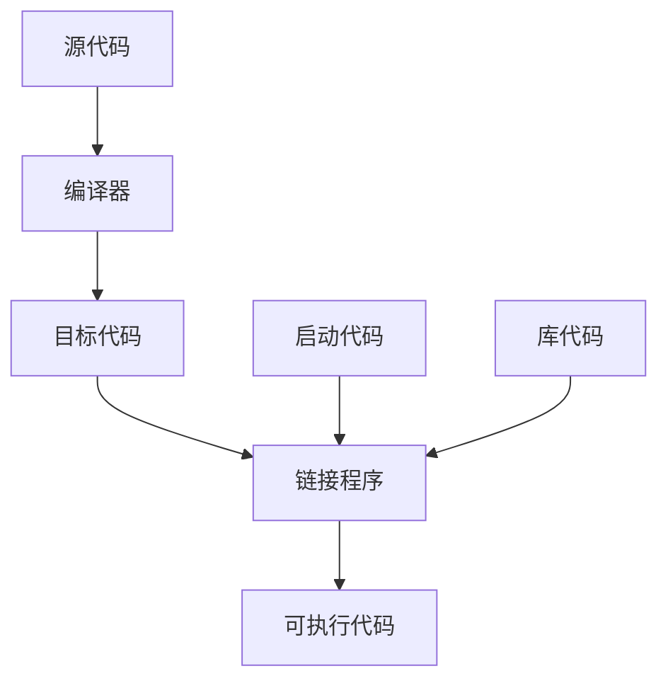

# 介绍

## C++

​		C++ 融合了3种不同的编程方式：C语言代表的过程性语言、C++在C语言基础上添加的类代表的面向对象语言、C++模板支持的泛型编程。C++ 是在C语言基础上开发的一种集面向对象、泛型编程和过程化编程于一体的编程语言，是C语言的超集<sup>1</sup>。

### 简史

​		20世纪70年代，C和Pascal这样的语言引领人们进入了结构化编程时代，这种机制把秩序和规程带进了迫切需要这种性质的领域中。除了提供结构化编程工具外，C还能生成简洁、快速运行的程序，并提供了处理硬件问题的能力，如管理通信端口和磁盘驱动器。这些因素使C语言成为20世纪80年代占统治地位的编程语言。同时，20世纪80年代，人们也见证了一种新编程模式的成长：面向对象编程（OOP）。SmallTalk和C++语言具备这种功能<sup>1</sup>。

#### C语言

​		20世纪70年代早期，贝尔实验室的Dennis Ritchie致力于开发UNIX操作系统。为完成这项工作，Ritchie需要一种语言，它必须简洁，能够生成简洁、快速的程序，并能有效地控制硬件。传统上，使用汇编语言来满足这些要求，汇编语言依赖于计算机的内部机器语言。然而，汇编语言是低级语言，即直接操作硬件，如直接访问CPU寄存器和内存单元。因此汇编语言针对于特定的计算机处理器，要将汇编程序移植到另一种计算机上，必须使用不同的汇编语言重新编写程序。

​		然而，UNIX是为在不同的计算机（或平台）上工作而设计的，这意味着它是一种高级语言。高级语言致力于解决问题，而不针对特定的硬件。一种被称为编译器的特殊程序将高级语言翻译成特定计算机的内部语言。这样，就可以通过对每个平台使用不同的编译器来在不同的平台上使用同一个高级语言程序了。Ritchie希望有一种语言能将低级语言的效率、硬件访问能力和高级语言的通用性、可移植性融合在一起，于是他在旧语言的基础上开发了C语言。

#### C语言编程原理

​		一般来说，计算机语言要处理两个概念：数据和算法。数据是程序使用和处理的信息，而算法是程序使用的方法。

​		C语言最初面世时是过程性（procedural）语言，这意味着它强调的是编程的算法方面。从概念上说，过程化编程首先要确定计算机应采取的操作，然后使用编程语言来实现这些操作。

​		随着程序规模扩大，早期的程序语言（如FORTRAN和BASIC）都会遇到组织方面的问题。例如，程序经常使用分支语句，根据某种测试的结果，执行一组或另一组指令。很多旧式程序的执行路径很混乱（被称为“”意大利面条式编程），几乎不可能通过阅读程序来理解，修改这种程序简直是一场灾难。为了解决这种问题，计算机科学家开发了一种更有序的编程方法：结构化编程（structured programming）。C语言具有使用这种方法的特性。例如，结构化编程将分支限制为一小组行为良好的结构。C语言的词汇表中就包含了这些结构（for循环、while循环、do while循环和if else语句）。

​		另一个新原则是自顶向下（top-down）的设计。在C语言中，其理念是将大型程序分解成小型、便于管理的任务。如果其中一项任务仍然过大，则将它分解为更小的任务。这一过程将一直持续下去，直到将程序划分为小型的、易于编写的模块。C语言的设计有助于使用这种方法，它鼓励程序员开发程序单元（函数）来表示各个任务模块。

​		如上所述，结构化编程技术反映了过程性编程的思想，根据执行的操作来构思一个程序。

#### 面向对象编程

​		虽然结构化编程的理念提高了程序的清晰度、可靠性，并使之便于维护，但它在编写大型程序时。仍然面临着挑战。为应付这种挑战，OOP提供了一种新方法。与强调算法的过程性编程不同的是，OOP强调的是数据。OOP不像过程性编程那样，试图使问题满足语言的过程性方法，而是试图让语言来满足问题的要求。其理念是设计与问题的本质特征相对应的数据格式。

​		在C++中，类是一种规范，它描述了这种新型数据格式，对象是根据这种规范构造的特定数据结构。通常，类规定了可使用哪些数据来表示对象以及可以对这些数据执行哪些操作。OOP程序设计方法首先设计类，它们准确地表示了程序要处理的东西。

​		OOP编程并不仅仅是将数据和方法合并为类定义。OOP还有助于创建可重用的代码，这将减少大量的工作。信息隐藏可以保护数据，使其免遭不适当的访问。多态可以为运算符和函数创建多个定义，通过编程上下文来确定使用哪个定义。继承可以使用旧类派生出新类。

​		OOP引入了很多新的理念，使用的编程方法不同于过程性编程。它不是将重点放在任务上，而是放在表示概念上。有时不一定使用自上向下的编程方法，而是使用自下向上的编程方法。

​		设计有用、可靠的类是一项艰巨的任务。OOP语言使程序员在编程中能够轻松地使用已有的类。厂商提供了大量有用的类库，包括设计用于简化Windows或Macintosh环境下编程的类库。C++真正的优点之一是：可以方便地重用和修改现有的、经过仔细测试的代码。

#### C++和泛型编程

​		泛型编程（generic programming）是C++支持的另一种编程模式。它与OOP的目标相同，即使重用代码和抽象通用概念的技术更简单。不过OOP强调的是编程的数据方面，而泛型编程强调的是独立于特定数据类型。它们的侧重点不同。OOP是一个管理大型项目的工程，而泛型编程提供了执行常见任务的工具。术语泛型（generic）指的是创建独立于类型的代码。C++的数据表示有多种类型：整数、小数、字符、字符串、用户定义的、由多种类型组成的复合结构。

​		例如，要对不同类型的数据进行排序，通常必须为每种类型创建一个排序函数。泛型编程需要对语言进行扩展，以便可以只编写一个泛型函数，并将其用于各种实际类型。C++模板提供了完成这种任务的机制。

#### C++的起源

​		C++与C语言一样，也是在贝尔实验室诞生的，Bjarne Stroustrup于20世纪80年代在这里开发出了这种语言。

> Bjarne Stroustrup的主页
>
> ​		Bjarne Stroustrup设计并实现了C++编程语言，他是权威参考手册《The C++ Programming Language》和《The design and Evolution of C++》的作者。读者应将他位于AT&T Labs Research上的个人网站作为首选的C++书签：http://www.research.att.com/-bs
>
> ​		该网站包括了C++语言有趣的发展历史、Bjarne的传记材料和C++ FAQ。Bjarne被问得最多的问题是：Bjarne Stroustrup应该如何读。您可以访问Stroustrup的网站，阅读FAQ部分并下载.WAV文件，亲自听一听。

​		Stroustrup比较关心的是让C++更有用，而不是实施特定的编程原理或风格。在确定C++语言特性方面，真正的编程需要比纯粹的原理更重要。Stroustrup之所以在C的基础上创建C++，是因为C语言简洁、适合系统编程、使用广泛且与UNIX操作系统联系紧密。C++的OOP方面是受到了计算机模拟语言Simula67的启发。Stroustrup加入了OOP特性和对C的泛型编程支持，但并没有对C的组件作很大的改动。因此，C++是C语言的超集，这意味着任何有效的C程序都是有效的C++程序。它们之间有些细微的差异，但无足轻重。C++程序可以使用已有的C软件库。库是编程模块的集合，可以从程序中调用它们。库对很多常见的编程问题提供可可靠的解决方法，因此能节省程序员大量的时间和工作量。这也有助于C++的广泛传播。

​		名称C++来自于C语言中的递增运算符++，表明它是C的扩充版本。

​		计算机程序将实际问题转换为计算机能够执行的一系列操作。OOP部分赋予了C++语言将问题所涉及的概念联系起来的能力，C部分则赋予了C++语言紧密联系硬件的能力，这种能力上的结合成就了C++的广泛传播。

> ​		从程序的一个方脉年转到另一个方面时，思维方式也要跟着转换（确实，有些OOP正统派把为C添加OOP特性看作是为猪插上翅膀，虽然这是头瘦骨嶙峋、非常能干的猪）。另外，C++是在C语言的基础上添加OOP特性，可以忽略C++的面向对象特性，但将错过很多有用的东西。

​		在C++获得一定程度的成功后，Stroustrup才添加了模板，这使得进行泛型编程成为可能。在模板特性使用和改进后，人们逐渐认识到，它们和OOP同样重要，甚至比OOP还重要，但有些人不这么认为。C++融合了OOP、泛型编程和传统的过程性方法，这表明C++强调的是实用价值，而不是意识形态方法，这也是该语言获得成功的原因之一。

#### 可移植性和标准

​		在可移植性方面存在两个障碍，其中的一个是硬件。硬件特定的程序是不可移植的。例如，直接控制IBM PC视频卡的程序在涉及Sun时将“胡言乱语”（将依赖于硬件的部分放在函数模块中可以最大限度地降低可移植问题：这样只需重新编写这些模块即可）。

​		可移植性的第二个障碍是语言上的差异。Windows XP C++的实现与Red Hat Linux或Macintosh OS X的实现相同吗？虽然多数实现都希望其C++版本与其他版本兼容，但如果没有准确描述语言工作方式的公开标准，这将很难做到。因此，美国国家标准局（American National Standards Institute，ANSI）在1990年设立了一个委员会（ANSI X3J16），专门负责制定C++标准（ANSI制定了C语言标准）。国际标准化组织（ISO）很快通过自己的委员会（ISO-WG-21）加入了这个行列，创建了联合组织ANSI/ISO，致力于制定C++标准。

​		经过多年的努力，制定出了一个国际标准ISO/IEC 14882:1998，并于1998年获得了ISO、IEC（International Electrotechnical Committee，国际电工技术委员会）和ANSI的批准。该标准常被称为C++98，它不仅描述了已有的C++特性，还对该语言进行了扩展，添加了异常、运行阶段类型识别（RTTI）、模板和标准模板库（STL）。2003年，发布了C++标准第二版（ISO/IEC 14882:2003）：这个新版本是一次技术性修订，这意味着它对第一版进行了整理——修订错误、减少多义性等，但没有改变语言特性。这个版本常被称为C++03。由于C++03没有改变语言特性，因此使用C++98表示C++98/C++2003。

​		C++在不断发展。ISO标准委员会于2001年8月批准了新标准ISO/IEC 14882:2011，该标准以前称为C++11。与C++98一样，C++11也新增了众多特性。另外，其目标是消除目标不一致性，让C++学习和使用起来更容易。该标准还曾被称为C++0x，最初预期x为7或8，但标准制定工作是一个令人疲惫的缓慢过程。所幸的是，可将0x视为十六进制数，这意味着委员会只需在2015年前完成这项任务即可。根据这个度量标准，委员会还是提前完成了任务。

​		ISO C++标准还吸收了ANSI C语言标准，因为C++应尽量是C语言的超集。这意味着在理想情况下，任何有效的C程序都应该是有效的C++程序。ANSI C与对应的C++规则之间存在一些差别，但这种差别很小。实际上，ANSI C加入了C++首次引入的一些特性，如函数原型和类型限定符const。

​		在ANSI C出现之前，C语言社区遵循一种事实标准，该标准基于Kernighan 和Ritchie编写的《The C Programming Language》一书，通常被称为K&R C。ANSI C出现后，更简单的K&R C有时被称为经典C（Classic C）。

​		ANSI C标准不仅定义了C语言，还定义了一个ANSI C实现必须支持的标准C库。C++也使用了这个库：将其称为C库或标准库。另外，ANSI/ISO C++标准还提供了一个C++标准类库。

​		最新的C标准为C99，ISO和ANSI分别于1999年和2000批准了该标准该标准在C语言添加了一些C++编译器支持的特性，如新的整型。

#### C++的发展

​		Stroustrup编写的《The Programming Language》包含65页的参考手册，它成了最初的C++事实标准。下一个事实标准是Ellis和Stroustrup编写的《The Annotated C++ Reference Manual》。C++98标准新增了大量特性，其篇幅将近800页，且包含的说明很少。C++11标准的篇幅长达1350页，对旧标准做了大量的补充。

### 程序创建的技巧

​		让一个C++程序运行起来的具体步骤取决于计算机环境和使用的C++编译器，但大体如下

1. 编辑程序，将其保存在文件中，这个文件就是程序的源代码
2. 编译源代码。这意味着运行一个程序，将源代码翻译为主机使用的内部语言——机器语言。包含了翻译后的程序的文件就是程序的目标代码（object code）
3. 将目标代码与其他代码链接起来。如，C++程序通常使用库。C++库包含一系列计算机例程（被称为函数）的目标代码，这些函数可以执行诸如在屏幕上显示信息或计算平方根等任务。链接指的是将目标代码同使用的函数的目标代码以及一些标准的启动代码（startup code）组合起来，生成程序的运行阶段版本。包含该最终产品的文件被称为可执行代码。



> 如果不加说明，后面的代码可以在任何支持C++98的系统中运行，

​		有些编译器要求使用特定的标记，让其支持部分C++特性。例如，从4.3版起，g++要求编译源代码文件时使用标记`-std=c++0x`：

```shell
g++ -srd=c++0x xxx.cpp
```

#### 创建源代码文件

​		有些C++实现（如Microsoft Visual C++、Embarcadero C++ Builder、Apple Xcode、Open Watcom C++、Digital Mars C++和Freescale Code Warrior）提供了集成开发环境（integrated development environment，IDE），能够在主程序中管理程序开发的所有步骤，包括编辑。有些实现（如UNIX和Linux的GNU C++、用于AIX的IBM XL C/C++、Embarcadero分发的Borland 5.5免费版以及Digital Mars编译器）只能处理编译和链接阶段。要求在系统命令行输入命令。在这种情况下，可以使用任何文本编辑器来创建和修改源代码。如，在UNIX系统上，可以使用vi、ed、ex或emacs；在以命令提示符模式运行的Windows系统上，可以使用edlin、edit或任何程序编辑器。如果将文件保存为标准ASCII文本文件（而不是特殊的字处理器格式），甚至可以使用字处理器。另外，还可能有IDE选项，能够使用这些命令行编译器。

​		给源文件命名时，必须使用正确的后缀，将文件标识为C++文件。这不仅表示是源文件，还将这种信息告知给编译器（如果UNIX编译器显示信息“bad magic number”，则表明后缀不正确）。后缀由一个句点和一个或多个字符组成，这些字符被称为扩展名。

​		使用什么扩展名取决于C++实现，下表列出了一些常用的扩展名。

|        C++实现         |  源代码文件的扩展名   |
| :--------------------: | :-------------------: |
|          UNIX          |     C、cc、cxx、c     |
|        GNU C++         | C、cc、cxx、cpp、c++  |
|      Digital Mars      |       cpp、cxx        |
|      Borland C++       |          cpp          |
|         Watcom         |          cpp          |
|  Microsoft Visual C++  |     cpp、cxx、cc      |
| Freestyle Code Warrior | cp、cpp、cc、cxx、c++ |

​		UNIX区分大小写，但标准C才使用小写的c。为避免在UNIX系统上发生混淆，对于C程序应使用c，而对于C++程序请使用C。对于某些UNIX系统，也可以使用cc或cxx。DOS比UNIX稍微简单一点，不区分大小写。

#### 编译和链接

​		最初，Stroustrup实现C++时，使用了一个C++到C的编译器程序，而不是开发直接的C++到目标代码的编译器。前者叫做cfront（表示C前端，C front end），它将C++源代码翻译成C源代码，然后使用一个标准C编译器对其进行编译。这种方法简化了向C的领域引入C++的过程。其他实现也采用这种方法将C++引入到其他平台。随着C++的日渐普及，越来越多的实现转向创建C++编译器，直接将C++源代码生成目标代码。这种直接方法加速了编译过程，并强调C++是一种独立的语言。

​		编译的机理取决于实现，下面介绍一些常见的形式。这些总结概括了基本步骤，但对于具体步骤，必须查看系统文档。

##### UNIX编译和链接

​		最初，UNIX命令CC调用cfront，但cfront未能紧跟C++的发展步伐，其最后一个版本发布于1993年。当今的UNIX计算机可能没有编译器、有专用编译器或第三方编译器，这些编译器可能是商业的，也可能是自由软件，如GNU g++编译器。如果UNIX计算机上有C++编译器，很多情况下命令CC仍然管用，只是启动的编译器随系统而异。出于简化的目的，假设命令CC可用，但必须认识到，对于下述讨论中的CC，可能必须使用其他命令代替。

​		使用CC命令编译程序，名称采用大写字母，这样可以将它与标准UNIX C编译器cc区分开来。CC编译器命令行编译器，意味着需要在UNIX命令行上输入编译命令。

```shell
# 编译C++源代码文件spiffy.C
CC spiffy.C
```

如果没有错误，编译器将生成一个扩展名为o的目标代码文件（spiffy.o）。

​		接下来，编译器自动将目标代码文件传递给系统链接程序，该程序代码与库代码结合起来，生成一个可执行文件。在默认情况下，可执行文件为a.out。如果只使用一个源文件，链接程序还将删除spiffy.o文件，因为这个文件不再需要了。要运行该程序，只要输入可执行文件的文件名即可

```shell
a.out
```

​		如果编译新程序，新的可执行文件a.out将覆盖已有的a.out（这是因为可执行文件占用了大量空间，因此覆盖旧的可执行文件有助于降低存储需求）。然而，如果想保留可执行文件，只需使用UNIX的mv命令来修改可执行文件的文件名即可。

​		与在C语言中一样，在C++中，程序也可以包含多个文件。这种情况下，可以通过在命令行上列出所有文件来编译程序。

```shell
CC my.C precious.C
```

​		如果有多个源代码文件，则编译器将不会删除目标代码文件。这样，如果只修改了my.C文件，则可以用下面的命令重新编译该程序：

```shell
CC my.C precious.C
```

这将重新编译my.C文件，并将它与前面编译的precious.o文件链接起来。

​		可能需要显式地指定一些库。例如，要访问数学库中定义的函数，必须在命令行中加上-lm标记

```shell
CC usingmath.C -lm
```

##### Linux编译和链接

​		Linux系统中最常用的编译器是g++，这是来自Free Software Foundation 的GNU C++编译器。Linux的多数版本都包括该编译器，但并不一定总会安装它。g++编译器的工作方式很像标准UNIX编译器。例如，下面的命令将生成可执行文件a.out

```shell
g++ spiffy.cxx
```

​		有些版本可能要求链接C++库

```shell
g++ spiffy.cxx -lg++
```

​		要编译多个源文件，只需将它们全部放到命令行中即可

```shell
g++ my.cxx precious.cxx
```

这将生成一个名为a.out的可执行文件和两个目标代码文件my.o和precious.o。如果接下来修改了其中的某个源代码文件，如my.cxx，则可以使用my.cxx和precious.o来重新编译。

```shell
g++ my.cxx precious.o
```

​		GNU编译器可以在很多平台上使用，包括基于Windows的PC和在各种平台上运行的UNIX系统。

##### Windows编译器

​		Windows产品很多且修订频繁，无法分别介绍。通常，必须为程序创建一个项目，并将组成程序的一个或多个文件添加到该项目中。每个厂商提供的IDE都包含用于创建项目的菜单选项。必须确定的非常重要的一点是，需要创建的是什么类型的程序。通常，编译器提供了很多选择，如Windows应用程序、MFC Windows应用程序、动态链接库、ActiveX控件、DOS或字符模式的可执行文件、静态库或控制台应用程序等。其中一些可能既有32位版本，又有64位版本。

​		创建好项目后，需要对程序进行编译和链接。IDE通常提供了多个菜单项，如Compile（编译）、Build（建立）、Make（生成）、Build All（全部建立）、Link（链接）、Execute（执行）、Run（运行）和Debug（调试），不过同一个IDE中，不一定包含所有这些选项。

- Complie通常意味着对当前打开的文件中的代码进行编译
- Build和Make通常意味着编译项目中所有源代码文件的代码。这通常是一个递增过程，也就是说，如果项目中包含多个文件，但只有一个文件被修改，那么只重新编译这个文件。
- Build All通常意味着重新编译所有的源代码文件
- Link意味着将编译后的源代码与所需的库代码组合起来
- Run或Execute意味着运行程序。通常，如果还没有执行前面的步骤，Run将在运行程序之前完成这些步骤。
- Debug意味着以步进的方式执行程序。
- 编译器肯可能让你选择要生成调试版还是发布版。调试版包含额外的代码，这会增大程序、降低执行速度，但可提供详细的调试信息。

​		如果程序违反了语言规则，编译器将生成错误消息，指出存在问题的行。

​		程序能够通过某个编译器的编译并不意味着它是合法的C++程序；同样，程序不能通过某个编译器的编译也并不意味着它是非法的C++程序。现在的编译器更严格地遵守了C++标准。另外，编译器通常提供了可用于控制严格程度的选项。

​		有时，编译器在不完全地构建程序后将出现混乱，它显示无法改正的、无意义的错误消息。这种情况下，可以选择Build All，重新编译整个程序，以清除这些错误消息。

​		通常，IDE允许在辅助窗口中运行程序。程序执行完毕后，有些IDE将关闭该窗口，而有些IDE不关闭。为查看输出，有时需要在程序最后加上一些代码，如

```c++
cin.get();
cin.get();
return 0;
```

##### Macintosh上的C++

​		当前，Apple随操作系统Mac OS X提供了开发框架Xcode，该框架是免费的，但通常不会自动安装。要安装它，可以使用操作系统安装盘，也可以从Apple网站免费下载（比较大）。Xcode不仅提供了支持多种语言的IDE，还自带了两个命令行编译器（g++和clang），可在UNIX模式下运行。而要进入UNIX模式，可通过实用程序Terminal。

# 开始学习C++

​		第一个示例程序

```c++
#include<iostream>

int main(){
    using namespace std;
    cout << "Come up and C++ me some time.";
    cout << endl;
    cout << "You won't regret it!" <<endl;
    return 0;
}
```

​		事实上，C++能够使用printf()、scanf()和其他所有标准C输入和输出函数，只需要包含常规C语言的stdio.h文件。

​		上面的示例程序中，包含下述元素

- 注释：由前缀`//`标识
- 预处理器编译指令`#include`
- 函数头`int main()`
- 编译指令`using namespace`
- 函数体，用`{`和`}`包围
- 使用C++的cout工具显示消息的语句
- 结束main函数的`return`语句

## main 函数

​		去掉修饰后，上述示例程序的基本结构如下

```cpp
int main(){
    statements
    return 0;
}
```

这段代码表示有一个名为main的函数，并描述了该函数的行为。这几行代码构成了函数定义（function definition）。该定义由两部分组成：第一行叫函数头；花括号包围的部分叫函数体。

​		函数头对函数与程序其他部分之间的接口进行了总结：函数体是指出函数应做什么的计算机指令。C++中，每条完整的指令都称为语句，所有的语句都以分号结束。main中最后一条语句叫做返回语句，它结束该函数。

​		**语句和分号**：语句是要执行的操作。为理解代码，编译器需要知道一条语句何时结束，另一条语句何时开始。有些语言使用语句分隔符。例如，FORTRAN通过行尾将语句分隔开来，Pascal使用分号。在Pascal中，有些情况下可以省略分号，如END语句前的语句后面，这种情况下，实际上并没有将两条语句分开。不过C++与C一样，也使用终止符（terminator），而不是分隔符。终止符是一个分号，它是语句结束的标记，是语句的组成部分，而不是语句之间的标记。**即，在C++中，不能省略分号**。

​		C++要求main()函数的定义以函数头int main()开始。通常，C++函数可以被其他函数激活或调用，函数头描述了函数与调用它的函数之间的接口。位于函数前面的部分叫做函数返回类型，它描述的是从函数返回给调用它的函数的信息。函数名后括号中的部分叫做形参列表（argument list）或参数列表（parameter list），它描述的是从调用函数传递给被调用的函数的信息。这种通用格式用于main()时让人感到有点迷惑，因为通常并不从程序的其他部分调用main()。

​		然而，通常，main()被启动代码调用，而启动代码是由编译器添加到程序中的，是程序和操作系统（UNIX、Windows 7或其他操作系统）之间的桥梁。事实上，该函数头描述的是main()和操作系统之间的接口。

​		在C语言中，省略返回类型相当于说明函数的类型为int。然而，C++逐步淘汰了这种用法。也可以使用以下变体

```cpp
int main(void)
```

在括号中使用关键字void明确地指出，函数不接受任何参数。在C++中（不是在C中），让括号空着与在括号中使用void等效（在C中，让括号空着意味着对是否接受参数保持沉默）。

​		有些使用下面的函数头，并省略返回语句

```cpp
void main()
```

这在逻辑上是一致的，因为void返回类型意味着函数不返回任何值。该变体适用于很多系统，但由于不是当前标准强制的一个选项，因此在有些系统上不能工作。应当尽量避免这种形式。

​		ANSI/ISO C++标准对那些抱怨必须在main()函数最后包含一条返回语句过于繁琐的人做出了让步。如果编译器到达main()函数末尾时没有遇到返回语句，则认为main()函数以如下语句结尾

```cpp
return 0;
```

这条语句只适用于main()函数，不适用于其他函数。

​		通常，C++程序必须包含一个名为main()的函数。在运行C++程序时，通常从main()函数开始执行。因此，如果没有main()，程序将不完整，编译器将指出未定义main()函数。

​		存在一些例外情况。例如，在Windows编程中，可以编写一个动态链接库（DLL）模块，这是其他Windows程序可以使用的代码。由于DLL模块不是独立的程序，因此不需要main()。用于专用环境的程序，如机器人中的控制芯片，可能不需要main()。有些编程环境提供一个框架程序，该程序调用一些非标准函数，如`_tmain()`。这种情况下，有一个隐藏的main()，它调用`_tmain()`。但常规的独立程序都需要main()。

## C++ 注释

​		C++注释以双斜杠打头。注释是程序员为读者提供的说明，通常标识程序的一部分或解释代码的某个方面。编译器忽略注释。

​		**C-风格注释**：C++也能识别C注释，C注释包括在符号`/*`和`*/`之间。这种注释可以跨越多行。但应尽量使用C++注释，因为不涉及符号的匹配，所以产生的问题可能性较小。事实上，C99标准也在C语言中添加了`//`注释。

### C++预处理器和iostream文件

​		如果C++程序需要使用输入和输出工具，则需要包含下面两行代码

```cpp
#include <iostream>
using namespace std;
```

第2行代码可使用其他代码代替。如果编译器不接受这几行代码，说明没有遵守C++98。

​		C++和C一样，也使用一个预处理器，该程序在进行主编译之前对源文件进行处理（前面介绍过，有些C++使用使用翻译器程序将C++程序转换为C程序。虽然翻译器也是一种预处理器，但这里不讨论这种，只讨论处理以`#`开头的编译指令的预处理器）。不必执行任何特殊的操作来调用该预处理器，它会在编译程序时自动运行。

​		`#include`是一种典型的预处理器操作，在源代码被编译之前，添加或替换文本。

​		iostream文件中的内容涉及到程序与外部世界之间的通信。iostream中的io指的是输入（进入程序的信息）和输出（从程序中发送出去的信息）。C++的输入/输出方案涉及iostream文件中的多个定义。为了使用cout来显示消息，需要这些定义。`#include`编译指令导致iostream文件的内容随源代码文件的内容一起被发送给编译器，实际上，iostream文件的内容将取代程序中的代码行`#include<iostream>`。原始文件没有被修改，而是将源代码文件和iostream组合成一个复合文件，编译的下一阶段将使用该文件。

​		**使用cin和cout进行输入和输出的程序必须包含文件iostream**

## 头文件名

​		像iostream这样的文件叫做包含文件（include file），由于它们被包含在其他文件中；也叫头文件（header file），由于它们被包含在文件的起始处。C++编译器自带了很多头文件，每个头文件都支持一组特定的工具。C语言的传统是，头文件使用扩展名`.h`，将其作为一种通过名称标识文件类型的简单方式。但C++的用法变了。现在，对老式C的头文件保留了扩展名h（C++程序仍可以使用这种文件），而C++头文件则没有扩展名。有些C头文件被转换为C++头文件，这些文件爱你被重新命名，去掉了扩展名h（使之变成了C++风格的名称），并在文件名称前面加上前缀c（表明来自C语言）。例如，C++版本的math.h为cmath。有时C头文件的C版本和C++版本相同，而有时新版本做了一些修改。对于纯粹的C++头文件（如iostream）来说，去掉h不只是形式上的变化，没有h的头文件也可以包含名称空间。下表对头文件的命名约定进行了总结

| 头文件类型  |         约定          |    示例    |                         说明                          |
| :---------: | :-------------------: | :--------: | :---------------------------------------------------: |
| C++旧式风格 |       以.h结尾        | iostream.h |                    C++程序可以使用                    |
|  C旧式风格  |       以.h结尾        |   math.h   |                  C、C++程序可以使用                   |
| C++新式风格 |      没有扩展名       |  iostream  |         C++程序就可以使用，使用namespace std          |
|  转换后的C  | 加上前缀c，没有扩展名 |   cmath    | C++程序可以使用，可以使用不是C的特性，如namespace std |

​		由于C使用不同的文件扩展名来表示不同文件类型，因此用一些特殊的扩展名（如.hpp或.hxx）表示C++头文件是有道理的，ANSI/ISO委员会也这样认为。问题在于究竟使用哪种扩展名，因此最终他们一致同意不使用任何扩展名。

## 名称空间

​		如果使用iostream，而不是iostream.h，则应使用下面的名称空间编译指令来使iostream中的定义对程序可用

```cpp
using namespace std
```

这叫做using编译指令。

​		名称空间支持是一项C++特性，旨在编写大型程序以及将多个厂商现有的代码组合起来的程序更容易，还有助于组织程序。一个潜在的问题是，可能使用两个已封装好的产品，而它们各自都包含名为wanda()的函数。这样，使用wanda()函数时，编译器不知道指的是哪个版本。名称空间让厂商能够将其产品封装在一个叫做名称空间的单元中，这样就可以用名称空间的名称来指出想使用哪个厂商的产品。

​		按照这种方式，类、函数和变量便是C++编译器的标准组件，它们现在都被放置在名称空间std中。仅当头文件没有扩展名h时，情况才是如此。这意味着在iostream中定义的用于输出的cout变量实际上是`std::cout`，而endl实际上是`std::endl`。因此，可以省略编译指令，以下述方式进行编码

```cpp
std::cout<<"Come up and C++ me some time.";
std::cout << std<< endl;
```

​		然而，多数用户并不喜欢将引入名称空间之前的代码（使用iostream.h和cout）转换为名称空间代码（使用iostream和std::cout），除非它们可以不费力地完成这种转换。于是，using编译指令应运而生。下面的代码表明，可以使用std名称空间中定义的名称，而不必使用`std::`前缀

```cpp
using namespace std;
```

这个using编译指令使得std名称空间中的所有名称都可用。这是一种偷懒的做法，在大型项目中一个潜在的问题。更好的做法是，只使用所需的名称可用，这可以通过使用using声明来实现

```cpp
using std::cout;
using std::endl;
using std::cin;
```

``然而，要使用iostram中的其他名称，必须要分别加入到using列表中。对于简单的程序，可以使用偷懒的方式。因为对于简单的程序而言，采用何种名称空间管理方法无关紧要。

## cout

​		在C++中，使用双引号括起来的一系列字符叫做字符串。`<<`符号表示将信息发送给cout；该符号指出了信息流动的路径。cout是一个预定义的对象，知道如何显示字符串、数字和单个字符等。

​		cout对象属性包括一个插入运算符`<<`，它可以将其右侧的信息插入到流中。插入运算符看起来和左移运算符是一样的，实际上这是一个运算符重载的例子。C本身也有一些运算符重载的情况，如&既表示地址运算符，又表示按位运算；*既表示乘法，又表示对指针解除引用。C++扩展了运算符重载的概念，允许用户定义的类型（类）重新定义运算符的含义。

## endl

​		endl是一个特殊的C++符号，表示一个重要的概念：重起一行。在输出流中插入endl将导致光标移到下一行开头。诸如endl等对于cout来说有特殊含义的特殊符号被称为控制符（manipulator）。和cout一样，endl也是在iostream中定义的，且位于名称空间std中。

## 换行符

​		C++还提供了另一种在输出中指示换行的旧式方法：C语言符号`\n`。在显示用引号括起来的字符串时，通常使用`\n`，在其他情况下，一般使用控制符endl。一个差别是：endl确保程序继续运行前刷新输出（将其立即显示在屏幕上）；而使用`\n`不能提供这样的保证，这意味着在有些系统中，有时可能在输入信息之后才会出现提示。

​		**换行符是一种被称为“转义序列”的按键组合**

## C++源代码的格式化

​		有些语言（如FORTRAN）是面向行的，即每条语句占一行。对于这些语言来说，回车的作用是将语句分开。然而，在C++中，分号标示了语句的结尾。因此，在C++中，回车的作用就和空格和制表符相同。也就是说，在C++中，通常可以在能够使用回车的地方使用空格，反之亦然。这说明既可以把一条语句放在几行上，也可以把几条语句放在同一行上。

​		但也必须遵循一些规则：不能把空格、制表符或回车放在元素（比如名称）中间，也不能把回车放在字符串中间。然而，C++11新增的原始（raw）字符串可包含回车。

### 源代码中的标记和空白

​		一行代码中不可分隔的元素叫做标记（token）。通常，必须用空格、制表符或回车将两个标记分开，空格、制表符和回车统称为空白（white space）。有些字符（如括号和逗号）是不需要用空白分开的标记。

### C++源代码风格

​		虽然C++在格式方面有很大的自由度，但如果遵循合理的风格，程序将便于阅读。有效但难看的代码不会令人满意。多数程序员都会遵循下述规则

- 每条语句占一行
- 每个函数都有一个开始花括号和结束花括号，这两个花括号各占一行
- 函数中语句都相对于花括号进行缩进
- 与函数名称相关的圆括号周围没有空白

​		前三条规则旨在确保代码清晰可读；第四条规则帮助区分函数和一些也使用圆括号的C++内置结构（如循环）。

## C++语句

​		C++程序是一组函数，而每个函数又是一组语句。C++有好几种语句。下面的示例代码提供了两种新的语句：声明语句创建变量；赋值语句给该变量提供一个值。另外，还演示了cout的新功能

```cpp
#include <iostream>

int main(){
    using namespace std;

    int carrots;

    carrots=25;
    cout << "I have ";
    cout << carrots;
    cout << " carrots.";
    cout << endl;
    carrots=carrots-1;
    cout << "Crunch, crunch. Now I have "<<carrots<<" carrots." << endl;
    return 0;
}
```

### 声明语句和变量

​		计算机是一种精确的、有条理的机器。要将信息存储在计算机中，必须指出信息的存储位置和所需的内存空间。C++中，完成这种任务的一种相对简便的方法，是使用声明语句来指出存储类型并提供位置标签。如，上述示例程序中的

```cpp
int carrots;
```

​		这条语句提供了两项信息：需要的内存以及该内存单元的名称。具体地说，这条语句指出程序需要足够的存储空间来存储一个整数，在C++中用int表示整数。编译器负责分配和标记内存的细节。C++可以处理多种数据类型，而int是最基本的数据类型。它表示整数。C++的int类型可以为正、也可以为负，但大小范围取决于实现。

​		完成的第二项任务是给存储单元指定名称。在这里，该声明语句指出，此后程序将使用名称carrots来标识存储在该内存单元中的值。carrots被称为变量，因为它的值可被修改。在C++中，所有变量都必须声明。

​		**为什么变量必须声明**：有些语言（最典型的是BASIC）在使用新名称时创建新的变量，而不用显式地进行声明。这看上去对用户比较友好，事实上从短期上来说确实如此。问题是，如果错误地拼写了变量名，将在不知情的情况下创建一个新的变量。在BASIC中，程序员可能编写了如下语句

```Basic
CastleDark=34
...
CastleDank=CastleDark+MoreGhosts
...
PRINT CastleDark
```

由于CastleDank是拼写错误，因此所作的修改并没有发生在CastleDark变量上。这种错误很难发现，因为没有违反BASIC中的任何规则。

​		因此，声明通常指出了要存储的数据类型和程序对存储在这里的数据使用的名称。程序中的声明语句叫做定义声明（defining declaration）语句，简称为定义（definition）。这意味着它将指导编译器为变量分配内存空间。在较为复杂的情况下，还可能有引用声明（reference declaration）。这些声明命令计算机使用在其他地方定义的变量。**通常，声明不一定是定义**。

​		在C和Pascal中，所有的变量声明通常都位于函数或过程的开始位置，但C++没有这种限制。实际上，C++通常的做法是，在首次使用变量前声明它。这种风格也有缺点，就是没有把所有的变量集中在一起，因此无法对函数使用了哪些变量一目了然（C99标准使C声明规则与C++非常相似）。

​		**对于声明变量，C++的做法是尽可能在首次使用变量前声明它**

### 赋值语句

​		赋值语句将值赋给存储单元。符号`=`叫做赋值运算符。C++（和C）有一项不寻常的特性，可以连续使用赋值运算符。赋值将从右向左进行。

### cout的新花样

​		cout可用于数字和字符串。但整数25和字符串“25”有天壤之别。要打印字符串，cout只需打印字符串中各个字符即可。但整数被存储为数值，计算机不是单独存储每个数字，而是存储为二进制数。这里的要点是，在打印之前，cout必须将整数形式的数字转换为字符串形式。

​		与老式C语言的区别在于cout的聪明程度。在C语言中，要打印字符串还是整数，可以使用C语言的多功能输出函数printf()。

​		撇开printf()的复杂性不说，必须用特殊代码（%s和%d）来指出是要打印字符串还是整数。如果让printf()打印字符串，但又错误地提供了一个整数，由于printf()不够精密，因此根本发现不了错误。它将继续处理，显示一堆乱码。

​		cout的智能行为源自C++面向对象特性。实际上，C++插入运算符将根据其后的数据类型相应地调整其行为，这是一个运算符重载的例子。

​		**cout和printf**：如果已经习惯了C语言和printf()，可能觉得cout看起来很奇怪。程序员甚至可能固执地坚持使用printf()。但与使用所有转换说明的printf()相比，cout的外观一点也不奇怪。更重要的是，cout还有明显的优点。它能够识别类型的功能表明，其设计更灵活、更好用。另外，它是可扩展的。也就是说，可以重新定义<<运算符，使cout能够识别和显示所开发的新的数据类型。如果喜欢printf()提供的控制功能，可以使用更高级的cout来获得相同的效果。

## 其他C++语句

​		下面的示例程序要求程序在运行时输入一个值。它使用了cin，这是与cout对应的用于输入的对象。另外，该程序还演示了cout对象的多功能性。

```cpp
#include <iostream>

int main(){

    using namespace std;

    int carrots;
    cout << "How many carrots do you have?"<<endl;
    cin >> carrots;
    cout << "Here are two more. ";
    carrots=carrots+2;
    cout << "Now you have " << carrots << " carrots." << endl;
    return 0;
}
```

### 使用cin

​		上面的程序中，信息从cin流向carrots。显然，对这一过程有更为正式的描述。就像C++将输出看作流出程序的字符一样，它也将输入看作是流入程序的字符流。iostream文件将cin定义为一个表示这种流的对象。输出时，<<运算符将字符串插入到输出流中；输入时，cin使用>>运算符从输入流中抽取字符。通常，需要在运算符右侧提供一个变量，以接收抽取的信息。

​		与cout一样，cin也是一个智能对象。它可以将通过键盘输入的一系列字符（即输入）转换为接收信息的变量能够接受的形式。

​		示例代码中的另一项新特性是将4条输出语句合并为一条。

### 类简介

​		类是C++中面向对象编程（OOP）的核心概念之一。

​		类是用户定义的一种数据类型。要定义类，需要描述它能够表示什么信息和可对数据执行哪些操作。类之于对象就像类型之于变量。也就是说，类定义描述的是数据格式及其用法，而对象则是根据数据格式规范创建的实体。

​		cout是一个ostream类对象。ostream类定义描述了ostream对象表示的数据以及可以对它执行的操作，如将数字或字符串插入到输出流中。同样，cin是一个istream类对象，也是在iostream中定义的。

​		类描述了一种数据类型的全部属性（包括可使用它执行的操作），对象是根据这些描述创建的实体。

​		知道类是用户定义的类型，但作为用户，并没有设计ostream和istream类。就像函数可以来自函数库一样，类也可以来自类库。ostream和istream类就属于这种情况。从技术上说，它们没有被内置到C++语言中，而是语言标准指定的类。这些类定义位于iostream文件中，没有内置到编译器中。如果愿意，程序员甚至可以修改这些类定义。iostream系列类和相关的fstream（或文件I/O）系列类是早期所有的实现都自带的唯一两组类定义。然而，ANSI/ISO C++委员会在C++标准中添加了其他一些类库。另外，多数实现都在软件包中提供了其他类定义。事实上，C++当前之所以如此有吸引力，很大程度上是由于存在大量支持UNIX、Macintosh和Windows编程的类库。

​		类描述指定了可对类对象执行的所有操作。要对特定对象执行这些允许的操作，需要给该对象发送一条消息：一种是使用类方法（本质上就是函数调用）；另一种是重新定义运算符（cin和cout就是）。

## 函数

​		C++函数分两种：有返回值的和没有返回值的。

### 使用有返回值的函数

​		有返回值的函数将生成一个值，而这个值可赋给变量或在其他表达式中使用。被调用的函数叫做被调用函数（called function），包含函数调用的函数叫做调用函数（calling function）。圆括号中的值是发给函数的信息，这被称为传递函数。以这种方式发给函数的值叫做参数。

​		使用函数之前，C++编译器必须知道函数的参数类型和返回值类型。C++程序应当为程序中使用的每个函数提供原型。函数原型之于函数就像变量声明之于变量，指出涉及的类型。

​		在程序中使用`sqrt()`时，必须提供原型，可以用两种方法

- 在源代码文件中输入函数原型
- 包含头文件cmath（老系统为math.h），其中定义了原型

第二种方法更好，因为头文件更有可能使原型正确。对于C++库中的每个函数，都在一个或多个头文件中提供了其原型。通过手册或者在线帮助查看函数描述来确定应使用哪个头文件。

​		不要混淆函数原型和函数定义。可以看出，原型只描述函数接口。也就是说，它描述的是发送给函数的信息和返回的信息。而定义中包含了函数的代码，如计算平方根的代码。C和C++将库函数的这两项特性（原型和定义）分开了。库文件中包含了函数的编译代码，而头文件中包含了原型。

​		应在首次使用函数之前提供其原型。通常的做法是把原型放到main()函数定义的前面，下面的程序演示了库函数sqrt()的用法，它通过包含cmath文件来提供该函数的原型

```cpp
#include <iostream>
#include <cmath>

int main(){
    using namespace std;

    double area;
    cout << "Enter the floor area, in square feet, of your home: ";
    cin >> area;
    double side;
    side=sqrt(area);
    cout << "That's the equivalent of a square " << side
         << " feet to the side." << endl;
    cout << "How fascinating!" << endl;
    return 0;
}
```

​		**使用库函数**：C++库函数存储在库文件中。编译器编译程序时，它必须在库文件中搜索使用的函数。至于自动搜索哪些文件，将因编译器而异。如果运行上述程序时，得到一条消息指出`_sqrt`是一个没有定义的外部函数（似乎应当避免），则很可能是由于编译器不能自动搜索数学库（编译器倾向于给函数名添加下划线前缀，提示它们对程序具有最后的发言权）。如果在UNIX实现中遇到这样的消息，可能需要在命令行结尾使用`-lm`选项

```shell
CC sqrt.C -lm
```

在Linux系统中，有些版本的GNU编译器与此类似

```shell
g++ sqrt.C -lm
```

​		只包含cmath头文件可以提供原型，但不一定会导致编译器搜索正确的库文件。

### 函数变体

​		有些函数需要多项信息。这些函数使用多个参数，参数间用逗号分开。另外有一些函数不接受任何参数。在C++中，函数调用中必须包含括号，即使没有参数。还有一些函数没有返回值，因此不能直接将函数调用放在赋值语句或其他表达式中。

​		有些语言中，又返回值的函数被称为函数（function）；没有返回值的函数被称为过程（procedure）或子程序（subroutine）。但C++与C一样，这两种变体都称为函数。

### 用户定义的函数

​		标准C库提供了140多个预定义的函数。如果其中的函数能满足要求，则应使用它们。但用户经常需要编写自己的函数，尤其是在设计类的时候。和库函数一样，也可以通过函数名来调用用户定义的函数。

```cpp
#include <iostream>

void simon(int);

int main(){

    using namespace std;
    simon(3);
    cout << "Pick an integer";
    int count;
    cin >> count;
    simon(count);
    cout << "Done!" << endl;
    return 0;
}

void simon(int n){
    using namespace std;
    cout << "Simon says touch your toes "<< n << " times." << endl;
}
```

​		和C一样（但是和Pascal不同），C++不允许将函数定义嵌套在另一个函数。每个函数定义都是独立的，所有函数的创建都是平等的。

​		**main()函数的返回值去哪里了**：可以将计算机操作系统看作是调用程序。因此，main()的返回值并不是返回给程序的其他部分，而是返回给操作系统。很多操作系统都可以使用程序的返回值。例如，UNIX外壳脚本和Windows命令行批处理文件都被设计成运行程序，并测试它们的返回值（通常叫做退出值）。通常的约定是，退出值为0意味着程序运行成功，为非零意味着存在问题。因此，如果C++程序无法打开文件，可以将它设计为一个非零值。然后，便可设计一个外壳脚本或批处理文件来运行该程序，如果该程序发出指示失败的消息，则采取其他措施。

​		**关键字**：字是计算机语言的词汇。main不是关键字，由于它不是语言的组成部分。然而，它是一个必不可少的函数名称。可以把main用作变量名（在一些很神秘的以至于无法在这里介绍的情况中，将main用作变量名会引发错误，由于它在任何情况下都是容易混淆的，因此最好不要这样做）。同样，其他函数名和对象名也都不能是关键字。然而，程序中将同一个名称用作对象名和变量名会把编译器搞糊涂。

### 用户定义的有返回值的函数

```cpp
#include <iostream>

int stonetolb(int);

int main(){
    using namespace std;
    int stone;
    cout << "Enter the weight in stone: ";
    cin >> stone;
    int pounds=stonetolb(stone);
    cout << stone << " stone = ";
    cout << pounds << " pounds." << endl;
    return 0;
}

int stonetolb(int sts){
    return 14 * sts;
}
```

​		函数原型描述了函数接口，即函数如何与程序的其他部分交互。参数列表指出了何种信息将被传递给函数，函数类型指出了返回值的类型。

### 在多函数程序中使用using编译指令

​		将编译指令放在函数外面，所有函数前面

```cpp
#include <iostream>

using namespace std;

void simon(int);

int main(){
    simon(3);
    cout << "Pick an integer";
    int count;
    cin >> count;
    simon(count);
    cout << "Done!" << endl;
    return 0;
}

void simon(int n){
    cout << "Simon says touch your toes "<< n << " times." << endl;
}
```

​		当前通行的理念是，只让需要访问名称空间std的函数访问它是更好的选择。总之，让程序能够访问名称空间std的方法有多种，下面是其中4种

- 将`using namespace std;`放在函数定义之前，让文件中所有的函数都能够使用名称空间std中所有的元素
- 将`using namespace std;`放在特定的函数定义中，让该函数能够使用名称空间std中的所有元素
- 在特定的函数中使用类似`using std::cout;`这样的编译指令，让该函数能够使用指定的元素
- 完全不使用编译指令using，而在需要使用名称空间std中的元素时，使用前缀`std::`。

# 处理数据

​		内置的C++类型分为两组：基本类型和复合类型。C++知道，没有任何一种整型和浮点型能够满足所有的编程要求，因此对于这两种数据，它提供了多种变体。

## 简单变量

​		通常程序都需要存储信息。为把信息存储在计算机中，程序必须记录3个基本属性

- 信息将存储在哪里
- 要存储什么值
- 存储何种类型的信息

### 变量名

​		C++提倡使用有一定含义的变量名。必须遵守几种简单的C++命名规则

- 在名称中只能使用字母字符、数字和下划线`_`
- 名称的第一个字符不能是数字
- 区分大写字符与小写字符
- 不能将C++关键字用作名称
- 以两个下划线或下划线和大写字母打头的名称被保留给实现（编译器及其使用的资源）使用。以一个下划线开头的名称被保留给实现，用作全局标识符。
- C++对于名称的长度没有限制，名称中所有的字符都有意义，但有些平台有长度限制。

​		倒数第二点与前面几点有些不同，因为使用像`_time_stop`或`_Dount`这样的名称不会导致编译器错误，而会导致行为的不确定性。换句话说，不知道结果将是什么。不出现编译器错误的原因是，这样的名称不是非法的，但要留给实现使用。全局名称指的是名称被声明的位置。

​		最后一点使得C++与ANSI C（C99 标准）有所区别，后者只保证名称中的前63个字符有意义（在ANSI C中，前63个字符相同的名称被认为是相同的，即使第64个字符不同）。

### 整型

​		整数就是没有小数部分的数字。语言只能提供整数的一个子集。

​		不同C++整型使用不同内存量来存储整数。使用的内存量越大，可以表示的整数值范围越大。另外，有的类型（符号类型）可以表示正值和负值，而有的类型（无符号类型）不能表示负值。术语宽度（width）用于描述存储整数时使用的内存量。使用的内存越多，则越宽。C++的基本整型分别是char、short、int、long和C++11新增的long long，其中每种类型都有符号版本和无符号版本。

#### short、int、long和long long

​		计算机的内存由一些叫做位（bit）的单元组成。C++的short、int、long和long long类型通过使用不同数目的位来存储值，最多能够表示4种不同的整数宽度。如果在所有系统中，每种类型的宽度都相同，则使用起来非常方便。不过，C++提供了一种灵活的标准，它确保了最小长度（从C语言借鉴而来）

- short至少16位
- int至少与short一样长
- long至少32位，却至少与int一样长
- long long至少64位，且至少与long一样长

​		计算机内存的基本单位是位（bit）。字节（byte）通常指的是8位的内存单元，从这个意义上说，字节指的就是描述计算机内存量的度量单位。然而，C++对字节的定义与此不同。C++字节由至少能够容纳实现的基本字符集的相邻位组成。也就是说，可能取值的数目必须等于或超过字符数目。在美国，基本字符集通常是ASCII和EBCDIC字符集，它们都可以用8位来容纳，所以在使用这两种字符集的系统中，C++字节通常包含8位。然而，国际编程可能需要使用更大的字符集，如Unicode，因此有些实现可能使用16位甚至32位的字节。有些人使用术语八位组（octet）表示8位字节。

​		当前很多系统都使用最小长度，即short为16位，long为32位，这仍然为int提供了多种选择，其宽度可以是16位、24位或32位，同时又符合标准；甚至可以是64位，因为long和long long至少64位。通常，在老式IBM PC的实现中，int的宽度为16位（与short相同），而在Windows XP、Windows Vista、Windows 7、Macintosh OS X、VAX和很多其他微型计算机的实现中，为32位（与long相同）。有些实现允许选择如何处理int。类型的宽度随实现而异，这可能在将C++程序从一种环境移到另一种环境时引发问题。

​		实际上，short是short int的简称，long是long int的简称。

​		要知道系统中整数的最大长度，可以在程序中使用C++工具来检查类型的长度。首先，sizeof运算符返回类型或变量的长度，单位为字节（运算符是内置的语言元素，对一个或多个数据进行运算，并生成一个值）。因为“字节”的含义依赖于实现，因此在一个系统中，两字节的int可能是16位，而在另一个系统中可能是32位。其次，头文件climits（在老式实现中为limits.h）中包含了关于整型限制的信息。具体地说，它定义了表示各种限制的符号名称。如，`INT_MAX`为int的最大取值，`CHAR_BIT`为字节的位数。

```cpp
#include <iostream>
#include <climits>

int main(){
    using namespace std;
    int n_int=INT_MAX;
    short n_short=SHRT_MAX;
    long n_long=LONG_MAX;
    long long n_llong = LLONG_MAX;

    cout << "int is "<< sizeof(int)<< " bytes." << endl;
    cout << "short is "<< sizeof n_short<< " bytes." << endl;
    cout << "long is "<< sizeof n_long<< " bytes." << endl;
    cout << "long long is "<< sizeof n_llong<< " bytes." << endl;
    cout << endl;

    cout << "Maximum values:"<<endl;
    cout << "int: "<< n_int<<endl;
    cout << "short: "<< n_short<<endl;
    cout << "long: "<<n_long<< endl;
    cout << "long long: "<< n_llong <<endl<< endl;

    cout << "Minimum int value = "<<INT_MIN<<endl;
    cout << "Bits per byte = "<< CHAR_BIT << endl;
    return 0;
}
```

- **运算符sizeof和头文件limits**：sizeof运算符指出，在使用8位字节的系统中，int的长度为4个字节。可对类型名或变量名使用sizeof运算符。对类型名使用sizeof运算符时，应当放在括号中；但对变量名使用该运算符时，括号是可选的。

  头文件climits定义了符号常量来表示类型的限制。

  |  符号常量  |            表示            |
  | :--------: | :------------------------: |
  |  CHAR_BIT  |         char的位数         |
  |  CHAR_MAX  |        char的最大值        |
  |  CHAR_MIN  |        char的最小值        |
  | SCHAR_MAX  |    signed char的最大值     |
  | SCHAR_MIN  |    signed char的最小值     |
  | UCHAR_MAX  |   unsighed char的最大值    |
  |  SHRT_MAX  |       short的最大值        |
  |  SHRT_MIN  |       short的最小值        |
  | USHRT_MAX  |   unsigned short的最大值   |
  |  INT_MAX   |        int的最大值         |
  |  INT_MIN   |        int的最小值         |
  |  UINT_MAX  |    unsigned int的最大值    |
  |  LONG_MAX  |        long的最大值        |
  |  LONG_MIN  |        long的最小值        |
  | ULONG_MAX  |   unsigned long的最大值    |
  | LLONG_MAX  |     long long的最大值      |
  | LLONG_MIN  |     long long的最小值      |
  | ULLONG_MAX | unsigned long long的最大值 |

  **符号常量——预处理器方式**：climits文件中包含与下面类似的语句行

  ```cpp
  #define INT_MAX 32767
  ```

  在C++编译过程中，首先将源代码传递给预处理器。在这里，`#define`和`#include`一样，也是一个预处理器编译指令。该编译指令告诉预处理器：在程序中查找`INT_MAX`，并将所有的`INT_MAX`都替换为32767。因此`#define`编译指令的工作方式与文本编辑器或字处理器中的全局搜索并替换命令相似。修改后的程序将完成这些替换后被编译。预处理器查找独立的标记（单独的单词），跳过嵌入的单词。也就是说，预处理器不会将`PING_MAXTM`替换为`P32767PM`。也可以使用`#define`来定义自己的符号常量。然而，`#define`是C语言遗留下来的。C++有一种更好的创建符号常量的方法（使用关键字const），所以不会经常使用`#define`。然而，有些头文件，尤其是那些被设计成可用于C和C++中的头文件，必须使用`#define`。

- **初始化**：初始化将赋值与声明合并在一起。也可以使用字面值常量来初始化。可以将变量初始化为另一个变量，条件是后者已经定义过的。甚至可以用表达式来初始化变量，条件是当程序执行到该声明时，表达式中所有的值都是已知的。

  C++还有另一种C语言没有的初始化语法

  ```c++
  int owls=101; // 传统C初始化
  int wrens(432); //C++的额外语法，将wrens设置为432
  ```

  如果不对函数内部定义的变量进行初始化，该变量的值将是不确定的。这意味着该变量的值将是它被创建之前，相应内存单元保存的值。

  如果知道变量的初始化应该是什么，则应对它进行初始化。将变量声明和赋值分开，可能会带来悬而未决的问题。

- **C++11初始化方式**：这种方式用户数组和结构，但在C++98中，也可以用于单值变量。

  ```cpp
  int hanburgers={24};
  ```

  将大括号初始化器用于单值变量的情形还不多，但C++11标准使得这种情形更多了。首先，采用这种形式时，可以使用等号，也可以不使用等号。其次，大括号内可以不包含任何东西，此时变量将被初始化为零。最后，这将有助于更好地防范类型转换错误。

  **为什么需要更多的初始化方法**：原因是让新手更容易学习C++。以前，C++使用不同的方式来初始化不同的类型：初始化类变量的方式不同于初始化常规结构的方式，而初始化常规结构的方式又不同于初始化简单变量的方式：通过使用C++新增的大括号初始化器，初始化常规变量的方式与初始化类变量的方式更像。C++11使得可将大括号初始化器用于任何类型（可以使用等号，也可以不使用），这是一种通用的初始化语法。

#### 无符号类型

​		前面介绍的4种整型都有一种不能存储负值的无符号变体，其优点是可以增大变量能够存储的最大值。只有当数值不会为负的时候才会使用到无符号类型，只需要使用关键字unsighed修饰声明即可。

​		注意unsighed本身就是unsighed int的缩写。

```C++
#include <iostream>
#define ZERO 0
#include <climits>

int main()
{
    using namespace std;
    short sam = SHRT_MAX;
    unsigned short sue = sam;

    cout << "Sam has " << sam << " dollars and Sue has " << sue;
    cout << "dollars deposited." << endl
         << "Add $1 to each account." << endl
         << "Now ";
    sam = sam + 1;
    sue = sue + 1;
    cout << "Sam has " << sam << " dollars and Sue has " << sue;
    cout << " dollars deposited.\nPoor Sam!" << endl;

    sam = ZERO;
    sue = ZERO;
    cout << "Sam has " << sam << " dollars and Sue has " << sue;
    cout << " dollars deposited." << endl;
    cout << "Take $1 from each account." << endl
         << "Now ";
    sam = sam - 1;
    sue = sue - 1;
    cout << "Sam has " << sam << " dollars and Sue has " << sue;
    cout << " dollars deposited." << endl
         << "Lucky Sue!" << endl;
    return 0;
}
```

```
Sam has 32767 dollars and Sue has 32767dollars deposited.
Add $1 to each account.
Now Sam has -32768 dollars and Sue has 32768 dollars deposited.
Poor Sam!
Sam has 0 dollars and Sue has 0 dollars deposited.
Take $1 from each account.
Now Sam has -1 dollars and Sue has 65535 dollars deposited.
Lucky Sue!
```

​		这些变量如果超过了限制，其值将为范围另一端的取值。C++确保了无符号类型的这种行为；但C++并不保证符号整型超越限制（上溢和下溢）时不出错。

#### 选择整型类型

​		C++提供了大量的整型。通常，int被设置为对目标计算机而言最为“自然”的长度。自然长度（natural size）指的是计算机处理起来效率最高的长度，如果没有非常有说服力的理由来选择其他类型，则应该使用int。

​		如果变量的表示不可能为负值，那么应该使用无符号类型，以便表示更大的值。如果知道变量可能表示的整数值大于16位整数的最大可能值，则使用long。即使系统上int为32位也应该这样做。这样将程序移植到16位系统时也可以工作。如果要存储的值超过20亿，则可以使用long long。

​		如果short比int小，则使用short可以节省内存。通常，仅当有大型整型数组时，才有必要使用short。如果节省内存很重要，则应该使用short，而不是int。即使长度是一样的情况下也建议使用short，以便移植的时候保证正常工作。如果只需要使用一个字节，则可以使用char。

#### 整型字面值

​		整型字面值（常量）是显式地书写的常量。与C一样，C++能够以三种不同的计数方式来书写整数：基数为10、基数为8（老式UNIX版本）和基数为16（硬件黑客的最爱）。C++使用前一（两）位来标识数字常量的基数。如果第一位为1～9，则基数为10；如果第一位是0，第二位为1～7，则基数为8；如果前两位为0x或0X，则基数为16

```c++
#include <iostream>

int main()
{
    using namespace std;

    int chest = 42;
    int waist = 0x42;
    int inseam = 042;

    cout << "Monsieur cuts a striking figure!\n";
    cout << "chest = " << chest << " (42 in decimal)\n";
    cout << "waist = " << waist << " (0x42 in hex)\n";
    cout << "inseam = " << inseam << " (042 in octal)\n";

    return 0;
}
```

默认情况下，cout以十进制显示整数。

​		不管把值书写为十进制、八进制还是十六进制，在计算机中都是以二进制进行存储的。

​		如果要以十六进制或八进制方式显示值，则可以使用cout的一些特殊特性。如iostream头文件还提供了控制符dec、hex和oct，分别用于指示cout以十进制、十六进制和八进制格式显示整数。

```c++
#include <iostream>

int main()
{
    using namespace std;

    int chest = 42;
    int waist = 42;
    int inseam = 42;

    cout << "Monsieur cuts a striking figure!\n";
    cout << "chest = " << chest << " (decimal for 42)\n";
    cout << hex;
    cout << "waist = " << waist << " (hexadecimal for 42)\n";
    cout << oct;
    cout << "inseam = " << inseam << " (octal for 42)\n";

    return 0;
}
```

诸如`cout<<hex;`等代码不会在屏幕上显示任何内容，而只是修改cout显示整数的方式。因此，控制符hex实际上是一条消息，告诉cout采取何种行为。

#### C++如何确定常量的类型

​		除非有理由存储为其他类型（如使用了特殊的后缀来表示特定的类型，或者值太大，不能存储为int），否则C++将整型常量存储为int类型。

​		后缀是放在数字常量后的字母，用于表示类型。整数后面的l或L后缀表示该整数为long常量；u或U后缀表示unsigned int常量；ul（任意顺序或大小写组合均可）表示unsigned long常量。C++ 11还提供了表示类型long long的后缀ll和LL（要同时使用相同形式的大小写），另外还有表示unsighed long long的ull、uLL、Ull和ULL。

​		接下来考察长度。在C++中，对十进制整数采用的规则，与十六进制和八进制稍微有些不同。对于不带后缀的十进制整数，将使用下面几种类型中能够存储该数的最小类型来表示：int、long或long long。对于不带后缀的十六进制和八进制整数，将使用下面几种类型中能够存储该数的最小类型来表示：int、unsighed int、long、unsigned long、long long或unsigned long long。

#### char类型

​		char类型是专为存储字符（如数字和字母）而设计的。char类型是另一种整型，它足够长，能够表示目标计算机系统中的所有基本符号。实际上，很多系统支持的字符都不超过128个，因此用一个字节就可以表示所有的符号，因此，虽然char最常用来处理字符，但也可以将其视为比short更小的整型。

​		在美国，最常用的符号集是ASCII字符集。为方便起见，本书示例中使用的是ASCII码。然而，C++实现使用的是其主机系统的编码。如IBM大型机使用EBCDID编码，ASCII和EBCDID都不能很好地满足国际需要，C++支持的宽字符类型可以存储更多的值，如国际Unicode字符集使用的值。

```c++
#include<iostream>

int main(){
    using namespace std;

    char ch;
    cout << "Enter a character: "<<endl;
    cin >> ch;
    cout << "Hola! ";
    cout << "Thank you for the " << ch << " character." << endl;

    return 0;
}
```

程序中输入M，而不是对应的字符编码77。同时打印的是M，而不是77。这是因为cin和cout进行了处理。下面的程序还演示了如何表示字符常量，最后cout.put()函数可以显示一个字符

```cpp
#include<iostream>

int main(){
    using namespace std;

    char ch='M';
    int i=ch;
    cout << "The ASCII code for "<< ch << " is "<<i<< endl;

    cout << "Add one to the character code: "<< endl;
    ch=ch+1;
    i=ch;
    cout << "The ASCII code for "<< ch << " is "<<i<< endl;

    cout << "Displaying char ch using cout.put(ch): ";
    cout.put(ch);

    cout.put('!');
    cout << endl << "Done"<< endl;

    return 0;
}
```

​		C++将字符表示为整数提供了方便，使得操纵字符值很容易。不必使用笨重的转换函数在字符和ASCII码之间来回转换。即使通过键盘输入的数字也被视为字符。

​		**成员函数cout.put()**：这是C++ OOP中的一个重要概念——成员函数。类定义了如何表示和控制数据，成员函数归类所有，描述了操作数据的方法。只能通过类的特定对象来使用成员函数。此时必须要使用`.`，这称为成员运算符。

​		**为何需要cout.put**：这与历史有关。在C++的Release 2.0之前，cout将字符变量显示为字符，而将字符常量显示为数字。问题是，C++的早期版本与C一样，也把字符常量存储为int类型。也就是说，`M`的编码77将被存储在一个16位或32位的单元中，而char变量一般只占8位。下面的语句从常量`M`中复制8位（左边的8位）到变量chz中

```c
char ch='M'；
```

遗憾的是，这意味着对于cout来说，`M`和ch看上去有天壤之别，虽然它们的存储的值相同。因此，下面的语句将打印`$`字符的ASCII码，而不是字符`$`

```c++
cout << '$';
```

但下面的语句将打印字符`$`

```c++
cout.put('$');
```

在Release 2.0之后，C++将字符常量存储为char类型，而不是int类型。这意味着cout现在可以正确处理字符常量了。

​		cin对象有几种不同的方式可以读取输入的字符。通过使用一个利用循环来读取几个字符的程序，可以更容易理解这一点。

​		**char字面值**：在C++中，书写字符常量的方式有很多。对于常规字符，可以直接使用但引号括起来。这种表示法优于数值编码，且不需要知道编码方式，如果系统使用的是EBCDIC，则A的编码将不是65，但'A'表示的仍然是字符A。

​		有些字符不能直接通过键盘输入到程序中。如，按回车键并不能使字符串包含一个换行符；相反，程序编译器将把这种键击解释为在源代码中开始新的一行。其他一些字符也无法从键盘输入，因为C++语言赋予了它们特殊的含义。对于这些字符，C++提供了一种特殊的表示方法——转义序列。

​		**C++转义序列的编码**

|  字符名称  | ASCII符号 | C++代码 | 十进制ASCII码 | 十六进制ASCII码 |
| :--------: | :-------: | :-----: | :-----------: | :-------------: |
|   换行符   |  NL(LF)   |   \n    |      10       |       0xA       |
| 水平制表符 |    HT     |   \t    |       9       |       0x9       |
| 垂直制表符 |    VT     |   \v    |      11       |       0xB       |
|    退格    |    BS     |   \b    |       8       |       0x8       |
|    回车    |    CR     |   \r    |      13       |       0xD       |
|    振铃    |    BEL    |   \a    |       7       |       0x7       |
|   反斜杠   |     \     |   \\    |      92       |      0x5C       |
|    问号    |     ?     |   \?    |      63       |      0x3F       |
|   单引号   |     '     |  `\'`   |      39       |      0x27       |
|   双引号   |     "     |  `\"`   |      34       |      0x22       |

​		应该像处理常规字符一样处理转义序列：将它们作为字符常量时，用单引号；放在字符串中时，不要使用单引号。转义序列的概念可以追溯到使用电传打字机与计算机通信的时代，现代系统并非都支持所有的转义序列。如，输入振铃字符时，有些系统保持沉默。

​		换行符可代替endl，用于在输出中重起一行。可以将换行符嵌入到较长的字符串中，这通常比使用endl方便。

​		可以基于字符的八进制和十六进制编码来使用转义序列。如，Ctrl+Z的ASCII码为26，对应的八进制编码为032，十六进制编码为0x1a。

​		在可以使用数字转义序列或符号转义序列（如\x8和\b）时，应使用符号序列。数字表示与特定的编码方式（如ASCII码）相关，而符号表示适用于任何编码方式，其可读性也更强。

​		下面的程序演示了一些转义序列，它使用振铃字符来提请注意，使用换行符使光标前进，使用退格字符使光标向左退一格（Houdini曾经在只使用转义序列的情况下，绘制了一幅哈得逊河图：他无疑是一位转义序列艺术大师）。

```c++
#include <iostream>

int main(){
    using  namespace std;
    cout << "\aOperation \"HyperHype\" is now activated!\n";
    cout << "Enter your agent code: __________\b\b\b\b\b\b\b\b";
    long code;
    cin >> code;
    cout << "\aYou entered " << code << "...\n";
    cout << "\aCode verified! Proceed with Plan Z3!\n";
    return 0;
}
```

有些基于ANSI C 之前的编译器的C++系统不能识别\a。对于使用ASCII 字符集的系统，可以用\007代替\a。有些系统的行为可能有些不同，例如可能将\b显示为一个小矩形，而不是退格，或者在退格时删除，还可能忽略\a。

#### 通用字符名

​		C++实现支持一个基本的源字符集，即可用来编写源代码的字符集。它由标准美国键盘上的字符（大写和小写）和数字、C语言中使用的符号（如{和=}以及其他一些字符（如空格和换行符）组成）。还有一个基本的执行字符集，它包括在程序执行期间可处理的字符（如可从文件中读取或显示到屏幕上的字符）。它增加了一些字符，如退格和振铃。C++标准还允许实现提供扩展源字符集和扩展执行字符集。另外，那些被作为字母的额外字符也可以用于标识符名称中。也就是说，德国实现可能允许使用日耳曼语的元音变音，而法国实现则允许使用重元音。C++有一种表示这种特殊字符的机制，它独立于任何特定的键盘，使用的是通用字符名（universal character name）。

​		通用字符名的用法类似于转义序列。通用字符名可以以\u或\U打头。\u后面是8个十六进制位，\U后面则是16个十六进制位。这些位表示的是字符的ISO 10646码点（ISO 10646是一种正在定制的国际标准，为大量的字符提供了数值编码）

​		如果所用的实现支持扩展字符，则可以在标识符（如字符常量）和字符串中使用通用字符名

```c++
int k\u00F6rper;
cout << "Let them eat g\u00E2teau.\n";
```

如果系统不支持ISO 10646，将显示其他字符或gu00E2teau

​		实际上，从易读性上来看，在变量名中使用\u00F6并没有多大意义，但如果实现的扩展源字符集包含ö，它可能允许您从键盘输入该字符

​		C++使用“通用编码名”而不是“通用编码”，这是因为应该将`\u00F6`解释为“Unicode 码点为U-00F6的字符”。支持Unicode的编译器知道，这表示字符ö，但无需使用内部编码00F6。无论计算机使用是ASCII还是其他编码系统，都可以在内部表示字符T；同样，在不同的系统中，将使用不同的编码来表示字符ö。在源代码中，可使用适用于所有系统的通用编码名，而编译器将根据当前系统使用合适的内部编码来表示它。

​		**Unicode和ISO 10646**：Unicode提供了一种表示各种字符集的解决方案——为大量字符和符号提供标准数值编码，并根据类型将它们分组。如，ASCII码为Unicode的子集，因此在这两种系统中，美国的拉丁字符的表示相同。然而，Unicode还包含其他拉丁字符，如欧洲语言使用的拉丁字符、来自其他语言（如希腊语、西里尔语、希伯来语、切罗基语、阿拉伯语、泰语和孟加拉语）中的字符以及象形文字（如中国和日本的文字）。到目前为止，Unicode可以表示109000多种符号和90多个手写符号（script），它还在不断发展中。

​		Unicode给每个字符指定一个编号——码点。Unicode码点通常类似下面这样：U-222B。其中U表示这是一个Unicode字符，而222B是该字符（积分正弦符号）的十六进制编号。

​		国际化标准组织（ISO）建立了一个工作组，专门开发ISO 10646——这也是一个对多种语言文本进行编码的标准。ISO 10646小组和Unicode小组从1991年开始合作，以确保他们的标准同步。

#### signed char和unsigned char

​		char在默认情况下是既不是没有符号的，也不是有符号的。是否有符号由C++实现决定。这样编译器开发人员可以最大限度地将这种类型与硬件属性匹配起来。如果char有某种特定的行为对您来说非常重要，则可以显式地将类型设置为signed char或unsigned char

​		如果将char用作数值类型，则signed char和unsigned char之间的差异非常重要，unsigned char表示的范围通常为0~255，而signed char表示的范围为-128~127。假设使用一个char变量来存储像200这样大的值，则在某些系统上可以，而在另一些系统上则不行。但使用unsigned char可以在任何系统上达到这种目的。另一方面，如果使用char变量存储标准ASCII字符，则char有没有符号都没关系。

#### wchar_t

​		程序需要处理的字符集可能无法用一个8位的字节表示，如日文汉字系统。对于这种情况，C++的处理方式有两种。首先，如果大型字符集是实现的基本字符集，则编译器厂商可以将char定义为一个16位的字节或更长的字节。其次，一种实现可以同时支持一个小型基本字符集和一个较大的扩展字符集。8位char可以表示为基本字符集，另一种类型wchar_t（宽字符类型）可以表示为扩展字符集。wchar_t类型是一种整数类型，它有足够的空间，可以表示系统使用的最大扩展字符集。这种类型与另一种整型（底层（underlying）类型）的长度和符号属性相同。对底层类型的选取取决于实现，因此在一个系统中，它可能是unsigned short，而在另一个系统中，则可能是int。

​		cin和cout将输入和输出看作是char流，因此不适于用来处理wchar_t类型。iostream头文件最新版提供了作用类似的工具——wcin和wcout，可用于处理wchar_t流。另外，可以通过加上前缀L来指示宽字符常量和宽字符串。

```c++
wchar_t bob=L'P';
wcout << L"tall" << endl;
```

在支持两字节wchar_t系统中，上述代码把每个字符存储在一个两个字节的内存单元中。虽然本书不使用wchar_t，但应该知道有这种类型，特别是在国际化编程或使用Unicode或ISO 10646时。

#### C++ 11新增的类型：char16_t和char32_t

​		随着编程人员日益熟悉Unicode，类型wchar_t显然不再能满足需求。事实上，在计算机系统上进行字符和字符串编码时，仅使用Unicode码点并不够。具体地说，在进行字符串编码时，如果有特定长度和符号特征的类型，将很有帮助，而类型wchar_t的长度和符号特征随实现而已。因此，C++ 11新增了char16_t和char32_t，都是无符号的，分别为16位和32位。C++ 11 使用前缀u表示char16_t的字符和字符串常量；使用前缀U表示char32_t的字符和字符串常量。char16_t与\u00F6形式的通用字符名匹配，char32_t与\U0000222B形式的通用字符名匹配。

```C++
char16_t ch1=u'q';
char32_t ch2=U'\U0000222B'
```

与wchar_t一样，char16_t和char32_t也都有底层类型——一种内置的整型，但底层类型可能随系统而已。

### bool类型

​		ANSI/ISO C++标准添加了一种名叫bool的新类型（对C++来说是新的）。它的名称源于英国数学家George Boole，是他开发了逻辑律的数学表示法。在计算过程中，布尔变量的值可以是true或false。过去，C++和C一样，也没有布尔类型。C++将非零值解释为true，将零解释为false。然而，现在可以使用bool来表示真和假了，它们分别用预定义的字面值true和false表示。

​		字面值true和false都可以通过提升类型转换为int整型。任何数字值或指针值都可以被隐式转换为bool值。

## Const限定符

​		C++有一种更好的处理符号常量的方法，这种方法就是使用const关键字来修改变量声明和初始化。常量被初始化后，其值就被固定了，编译器将不允许再修改该常量的值。

​		一般的做法是将名称的首字母大写以提醒是常量。这不是一种通用的约定。另一种是将整个常量名大写。具体什么约定看自己的组织规范。

​		创建常量的通用格式为`const type name=value;`。应该在声明中对const进行初始化，虽然可以分开声明和赋值。但这种做法不好。如果在声明时不提供常量的值，那么值是不确定且无法修改的。

​		如果以其使用过C语言，可能觉得#define已经足够完成常量的工作了。但const比#define好。首先，它能明确类型。其次，可以使用C++的作用域规则将定义限制在特定的函数或文件中。最后，可以将const用于更复杂的类型。

​		ANSI C也使用const限定符，这是从C++中借鉴的。如果熟悉ANSI C版本，则应该注意，C++版本稍微有些不同。区别之一是作用域规则。另一个主要区别是，在C++中可以用const值来声明数组长度。

## 浮点数

​		浮点数能够表示带小数部分的数字。计算机将这样的数值分成两个部分存储，一部分表示值，另一部分用于对值进行放大或缩小。缩放因子的作用是移动小数点的位置，浮点因此得名。C++内部表示浮点数的方法于此相同，只不过是基于二进制数，因此缩放因子是2的幂，不是10的幂。

### 书写浮点数

​		C++有两种浮点数书写方法。第一种是使用常用的标准小数点法，C++标准允许实现表示不同的区域，如，提供了欧洲方法的机制，即将逗号而不是句点用作小数点。然而，这些选项控制的是数字在输入和输出的外观，而不是数字在代码中的外观。第二种叫做E表示法。可以是E或e，指数可以是正数或负数。但数字之间不能有空格。

### 浮点类型

​		和ANSI C一样，C++也有3种浮点类型：float、double和long double。这些类型按照它们可以比表示的有效数位数和允许的指数最小范围来描述的。有效位（significant figure）是数字中有意义的位。

​		事实上，C和C++对于有效位数的要求是：float至少32位，double至少48位，且不少于float；long double至少和double一样。这三种类型的有效位数可以一样多。然而，通常float为32位，double为64位，而long double为80、96或128甚至更多。另外，这3种类型的指数范围至少是-37到37.可以从头文件cfloat或float.h找到系统的限制。

​		有些C++实现尚未添加头文件cfloat，有些基于ANSI C之前的编译器的C++实现没有提供头文件float.h。下面的程序演示了float和double类型以及它们表示数字时在精度方面的差异（即有效位数）。该程序预览了ostream方法setf()。这种调用迫使输出使用定点表示法，以便更好了解精度，防止把较大的值切换为E表示法，并使程序显示到小数点后6位。参数ios_base::fixed和ios_base::floatfield是通过包含iostream来提供的常量

```C++
#include <iostream>

int main(){
    using namespace std;

    cout.setf(ios_base::fixed,ios_base::floatfield);
    float tub=10.0/3.0;
    double mint=10.0/3.0;
    const float million = 1.0e6;

    cout << "tub = " << tub;
    cout << ", a million tubs = " << million * tub;
    cout << ",\nand ten million tubs = ";
    cout << 10 * million * tub << endl;

    cout << "mint = " << mint << " and a millions mints = ";
    cout << million *mint  << endl;
    return 0;
}
```

​		通常cout会删除结尾的零。如，将3333333.250000显示为3333333.25。调用cout.setf()将覆盖这种行为，至少在新的实现中是这样的。注意，为和float的精度比double低。tub和mint都被初始化为1.0/3.0=3.33333333.....由于cout打印6位小数，因此tub和mint都是精确的。但当程序将每个数乘以一百万后，tub在第7个3后就与正确的值有了误差。tub在7位有效位上还是精确的（该系统确保float至少6位有效位，但这是最糟糕的情况）。然而，double类型的；变量显示了13个3，因此其至少有13位是精确的。由于系统确保15位有效位，因此这就没有什么好奇怪的。另外，将tub乘以一百万后，再乘以10，得到的结果不正确，这再一次指出了float的精度限制。

​		cout所属的ostream类还有一个类成员函数，能够精确地控制输出的格式——字段宽度、小数位数、采用小数格式还是E格式等。为简单起见，本例通常只使用<<运算符。有时候，这种方法显示的位数比需要的多，但这只会影响美观。

​		**读取包含文件**：C++源文件开头的包含编译指令总是有一种魔咒的力量，新手C++程序员通过阅读和体验来了解哪个头文件添加哪些功能，再一一包含它们，以便程序能够运行。不要将包含文件作为神秘的知识而依赖；可以随便打开、阅读它们。它们都是文本文件，因此可以很轻松阅读。被包含在程序中的所有文件都存在于计算机中，或位于计算机可以使用的地方。找到这些文件阅读，所使用的源文件和头文件都是知识和信息的很好来源。有些情况下，它们是最好的文档。

### 浮点常量

​		在程序中书写浮点常量的时候，默认为double类型，如果想要表示float类型，则需要加f或F后缀。而对于long double，可以使用l或L后缀，推荐使用L，因为l看起来像1。

### 浮点数的优缺点

​		与整数相比，浮点数有两大优点：它们可以表示整数之间的值；由于有缩放因子，因此可以表示的范围大很多。但浮点数的运算速度通常比整数慢，且精度会降低。

```c++
#include <iostream>

int main(){
    using namespace std;

    float a=2.34E+22f;
    float b=a+1.0f;

    cout << "a= " << a << endl;
    cout << "b-a= "<<b-a << endl;

    return 0;
}
```

有些基于ANSI C之前的编译器的老式C++实现不支持浮点常量后缀f。如果出现这样的问题，可以用2.34E+22代替2.34E+22f，用（float）1.0代替1.0f。

```
a= 2.34e+22
b-a= 0
```

该程序将数字加1，然后减去原来的数字。结果应该为1。加上1，就是在第23为加1.但float类型只能表示数字中的前6或7位，因此修改第23位对这个值不会有任何影响。

​		**将类型分类**：C++对基本类型进行分类，形成了若干个族。类型signed char、short、int和long统称为符号整型；它们的无符号版本统称为无符号整型；C++ 11新增了long long。bool、char、wchar_t、符号整数和无符号整型统称为整型；C++ 11新增了char16_t和char32_t。float、double和long double统称为浮点型。整数和浮点型统称为算术（arithmetic）类型。

## C++算术运算符

​		C++使用运算符来运算。它提供了几种运算符来完成5种基本的算术计算：加、减、乘、除、求模。每种运算符都使用两个值（操作数）来计算结果。运算符及其操作数构成了表达式。

​		求模要保证两个操作数都是整数，如果有浮点数参与运算，会导致编译错误。

```C++
#include <iostream>

int main(){
    using namespace std;

    float hats, heads;

    cout.setf(ios_base::fixed,ios_base::floatfield);
    cout << "Enter a number: ";
    cin >> hats;
    cout << "Enter an another number: ";
    cin >> heads;

    cout << "hats = " << hats << "; heads = " << heads << endl;
    cout << "hats + heads = "<< hats+heads<< endl;
    cout << "hats - heads = "<< hats-heads<< endl;
    cout << "hats * heads = "<< hats*heads<< endl;
    cout << "hats / heads = "<< hats/heads<< endl;

    return 0;
}
```

​		对于float，C++只保证6位有效位。如果需要更高的精度，使用double或long double。其时，浮点数运算都需要考虑精度问题。

### 运算符优先级和结合性

​		附录D

### 除法分支

​		除法运算符的行为取决于操作数的类型。如果两个操作数都是整数，则C++将执行除法，这意味着结果的小数部分会被抛弃。如果有一个是浮点数，则结果为浮点数。

```C++
#include <iostream>

int main(){
    using namespace std;

    float hats, heads;

    cout.setf(ios_base::fixed,ios_base::floatfield);
    cout << "Integer division: 9/5 = "<< 9/5 <<endl;
    cout << "Floating-point division: 9.0/5.0=" << 9.0f/5.0f<< endl;
    cout << "Mixed division: 9.0/5=" << 9.0f/5 << endl;
    cout << "double constants: 1e7/9.0=" << 1e7/9.0 <<endl;

    return 0;
}
```

如果编译器不接受sef()中的ios_base，请使用ios。

​		有些基于ANSI C之前的编译器的C++实现不支持浮点常量的f后缀。可以使用`(float)`强制转换。有些实现会删除结尾的零。

​		**运算符重载**：C++根据上下文（如操作数的类型）确定运算的含义。使用相同的符号进行多种操作叫做运算符的重载（operator overloading）。C++有一些内置的重载示例。C++还允许扩展运算符重载，以便能够用于用户定义的类，因此这里可以看到的是一个重要的OOP属性。

### 求模运算符

​		求模运算符返回整数除法的余数。

```C++
#include <iostream>

int main(){
    using namespace std;

    const int lbs_per_stn = 14;
    int lbs;

    cout << "Enter your weight in pounds: " ;
    cin >> lbs;
    int stone = lbs/lbs_per_stn;
    int pounds=lbs%lbs_per_stn;
    cout << lbs << " pounds are "<< stone <<" stone, "<<pounds <<"pound(s).\n";

    return 0;
}
```

### 类型转换

​		C++丰富的类型允许根据需求选择不同的类型，这也使得计算机的操作更复杂。如，将两个short值相加涉及到的硬件编译指令可能与两个long值相加不同。由于有11种整型和3种浮点类型，因此计算机需要处理大量不同的情况，尤其是对不同类型进行计算时。为处理这种潜在的混乱，C++自动执行很多类型转换

- 将一种算术类型的值赋给另一种算术类型的变量，C++会对值进行转换
- 表达式中包含不同的类型，C++会对值进行转换
- 将参数传递给函数时，C++会对值进行转换

#### 初始化和赋值进行的转换

​		C++允许将一种类型的值赋给另一种类型的变量。这样，值将被转换为接收变量的类型。将一个值赋给取值范围更大的类型通常不会有什么问题。但反过来可能会带来麻烦。

|                  转换                  |                          潜在的问题                          |
| :------------------------------------: | :----------------------------------------------------------: |
| 将较大的浮点数类型转换为较小的浮点类型 | 精度（有效数位）降低，值可能超出目标类型的取值范围，此时结果将不确定 |
|          将浮点类型转换为整型          |  小数部分丢失，值可能超出目标类型的取值范围，此时结果不确定  |
|      将较大的整型转换为较小的整型      |      值可能超出目标类型的取值范围，通常只复制右边的字节      |

将0赋给bool将被转变为false，而非零值转变为true。

```C++
#include <iostream>

int main(){
    using namespace std;

    cout.setf(ios_base::fixed, ios_base::floatfield);
    float tree=3;
    int guess(3.9832);
    int debt=7.2E12;
    cout << "tree = "<< tree << endl;
    cout << "guess = " << guess <<endl;
    cout << "debt = " << debt << endl;

    return 0;
}
```

#### 以{}方式初始化时进行的转换（C++11）

​		C++11将使用大括号的初始化称为列表初始化（list-initialization），因为这种初始化经常用于给复杂的数据类型提供值列表。其对类型转换的要求更严格。具体地说，列表初始化不允许缩窄（narrowing），即类型的变量可能无法表示赋给它的值。如，不允许将浮点类型转换为整型，在不同整型之间转换或将整型转换为浮点型可能被允许，条件是编译器知道目标变量能够正确地存储赋给它的值。

```C++
const int code =66;
int x=66;
char c1 {31325}; // narrowing not allowed
char c2={66}; // allowed because char can hold 66
char c3 {code}; // ditto
char c4={x}; // not allowed, x is not constant
x=31325;
char c5=x; // allowed by this form of initialization
```

#### 表达式中的转换

​		当一个表达式中包含两种不同的算术类型时。C++将执行两种转换：首先，一些类型在出现时便会自动转换；其次，有些类型在与其他类型同时出现在表达式中时将被转换。

​		在计算表达式时，C++将bool、char、unsigned char、signed char和short自动转换为int。这些转换被称为整型提升（intergal promotion）。通常将int类型选择为计算机最自然的类型，这意味着计算机使用这种类型计算时，运算速度可能最快。

​		还有一些其他的整型提升：如果short比int短，则unsigned short将被转换为int。如果相同，则unsigned short将被转换为unsigned int。这种规则确保了在进行提升时不会损失数据。

​		同样，wchat_t被提升为下列类型中第一个宽度足够存储wchar_t取值范围的类型：int、unsigned int、long或unsigned long。

​		将不同类型进行算术运算时，也会进行一些转换。较小的类型将被转换为较大的类型。编译器通过校验表确定在算术表达式中执行的转换。C++ 11对这个校验表稍做了修改，下面是C++ 11版本的校验表

1. 如果有一个操作数的类型是long double，则将另一个转换为long double
2. 否则，如果有一个操作数的类型是double，则将另一个转换为double
3. 否则，如果有一个操作数的类型是float，则将另一个转换为float
4. 否则，说明操作数都是整数，因此执行整型提升。
5. 这种情况下，如果两个操作数都是无符号或有符号的，且其中一个操作数的级别比另一个低，则转换为级别高的类型
6. 如果一个操作数是有符号的，另一个是无符号的，且无符号的级别比有符号的级别高，则将有符号的转换为无符号的
7. 否则，如果有符号的可以表示无符号的所有可能取值，则将无符号的转换为有符号的
8. 否则，将两个操作数都转换为有符号类型的无符号版本。

​		ANSI C遵循的规则与ISO 2003 C++相同，这与前述规则稍有不同：而传统K&R C的规则又与ANSI C稍有不同。如，传统C语言总是将float提升为double，即使两个操作数都是float。

​		有符号整型按照级别从高到低：long long、long、int、short和signed char。无符号的也是一样。类型char、signed char和unsigned char级别相同。bool的级别最低，wchar_t、char16_t和char32_t的级别与其底层类型相同。

#### 传递参数时的转换

​		传递参数时类型转换通常由C++函数原型控制。然而，也可以取消原型对参数传递的控制，尽管这样做不明智。这种情况下，C++将对char和short类型（signed和unsigned）应用整型提升。另外，为保持与传统C语言中大量代码的兼容性，在将参数传递给取消原型对参数传递控制的函数时，C++将float参数提升为double。

#### 强制类型转换

​		C++允许进行强制类型转换，格式有两种：`(类型) 变量`或`类型 (变量)`。强制类型转换不会改变原变量的值，而是创建一个新的值。第一种形式来自于C语言，第二种是纯粹的C++格式，是为了让类型转换看起来像一个函数。

​		C++还引入了4个强制类型转换运算符，对它们的使用要求更为严格。其中，static_cast<>可用于将值从一种数值类型转换为另一种数值类型

```C++
static_cast<typeName> (value)
```

​		Stroustrup认为，C语言式的强制类型转换由于过多的可能性而极其危险。运算符static_cast<>比传统强制类型转换更为严格。

```C++
#include <iostream>

int main(){
    using namespace std;

    int auks, bats, coots;
    auks=19.99+11.99;

    bats=(int) 19.99 +(int)11.99;
    coots = int (19.99) + int(11.99);
    cout << "auks=" << auks << ", bats="<<bats;
    cout << ", coots"<< coots << endl;

    char ch='Z';
    cout << "The code for " << ch << " is ";
    cout << int(ch) << endl;
    cout << "Yes, the code is ";
    cout << static_cast<int>(ch)<< endl;

    return 0;
}
```

### C++ 11中的auto声明

​		C++ 11新增了一个工具，让编译器能够根据初始值的类型推断变量的类型。为此，它重新定义了auto的含义。auto是一个C语言关键字，但很少使用。在初始化声明中，如果使用auto关键字，而不指定变量的类型，编译器将把变量的类型设置成与初始值相同。

​		然而，自动推断类型并非为简单的情况设计的：事实上，如果将其用于这种简单情形，甚至可能会误入歧途。

```C++
auto x=0.0;  // x is double
double y=0;  // 0 自动转换为 0.0
auto z=0;  // 0
```

​		处理复杂类型，如标准模板库（STL）中的类型时，自动类型推断的用处才能体现，如对于下述C++98语句

```C++
std::vector<double> scores;
std::vector<double>::iterator pv=socres.begin();
```

C++ 11允许重写为

```C++
std::vector<double> scores;
auto pv=socres.begin();
```

